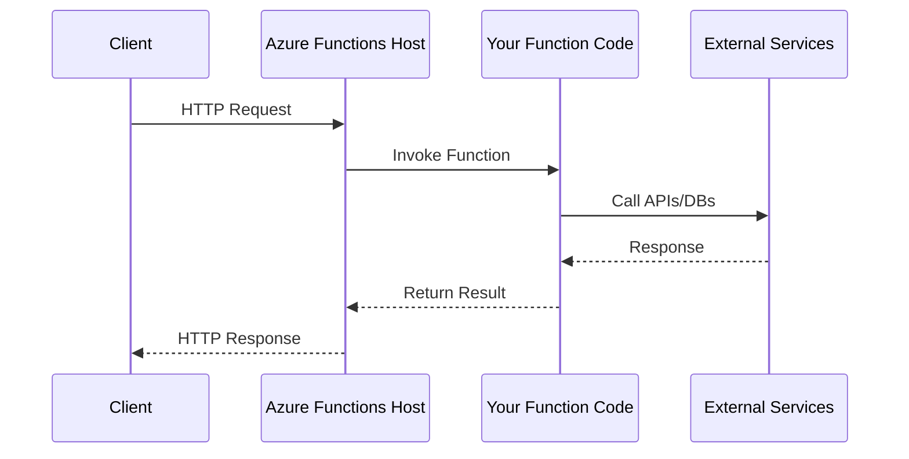

# How to Use Azure Functions with HTTP

Author: [nawazdhandala](https://github.com/nawazdhandala)

Tags: Azure, Azure Functions, Serverless, HTTP, Cloud

Description: Learn how to build HTTP-triggered Azure Functions from scratch, covering setup, routing, authentication, and deployment best practices.

---

Azure Functions with HTTP triggers are one of the easiest ways to build serverless APIs. You write the code, Azure handles the infrastructure, scaling, and availability. No servers to manage, no capacity planning, just code that runs when HTTP requests arrive.

This guide covers everything from your first function to production-ready APIs with proper authentication and error handling.

## How Azure Functions HTTP Triggers Work

When you create an HTTP-triggered Azure Function, Azure provisions an endpoint that accepts HTTP requests. Your code runs in response to each request, and Azure scales automatically based on incoming traffic.



The host manages cold starts, concurrency, and request routing. You focus on business logic.

## Setting Up Your First HTTP Function

### Prerequisites

Install the Azure Functions Core Tools for local development:

```bash
# macOS
brew tap azure/functions
brew install azure-functions-core-tools@4

# Windows
npm install -g azure-functions-core-tools@4

# Ubuntu/Debian
curl https://packages.microsoft.com/keys/microsoft.asc | gpg --dearmor > microsoft.gpg
sudo mv microsoft.gpg /etc/apt/trusted.gpg.d/microsoft.gpg
sudo sh -c 'echo "deb [arch=amd64] https://packages.microsoft.com/repos/microsoft-ubuntu-$(lsb_release -cs)-prod $(lsb_release -cs) main" > /etc/apt/sources.list.d/dotnetdev.list'
sudo apt-get update
sudo apt-get install azure-functions-core-tools-4
```

### Create a New Function Project

Initialize a new project with your preferred language. This example uses JavaScript/Node.js:

```bash
# Create a new functions project
func init my-api --worker-runtime node --language javascript

cd my-api

# Create an HTTP-triggered function
func new --name hello --template "HTTP trigger"
```

This creates a project structure with the function ready to go:

```
my-api/
  host.json           # Global configuration
  local.settings.json # Local environment variables
  package.json        # Node.js dependencies
  hello/
    function.json     # Function bindings configuration
    index.js          # Function code
```

### Basic HTTP Function

Here's the generated function with added comments explaining each part:

```javascript
// hello/index.js
// This function handles incoming HTTP requests and returns a greeting

module.exports = async function (context, req) {
    // Log the request for debugging
    context.log('HTTP trigger function processed a request.');

    // Get the name from query string (?name=value) or request body
    const name = (req.query.name || (req.body && req.body.name));

    // Build the response message
    const responseMessage = name
        ? `Hello, ${name}. This HTTP triggered function executed successfully.`
        : "This HTTP triggered function executed successfully. Pass a name in the query string or in the request body for a personalized response.";

    // Set the response - Azure Functions handles serialization
    context.res = {
        status: 200,
        body: responseMessage
    };
};
```

### Function Configuration

The `function.json` file defines the trigger and bindings:

```json
{
  "bindings": [
    {
      "authLevel": "function",
      "type": "httpTrigger",
      "direction": "in",
      "name": "req",
      "methods": ["get", "post"],
      "route": "hello"
    },
    {
      "type": "http",
      "direction": "out",
      "name": "res"
    }
  ]
}
```

| Property | Description |
|----------|-------------|
| `authLevel` | Access control: `anonymous`, `function`, or `admin` |
| `methods` | Allowed HTTP methods |
| `route` | Custom route path (default is function name) |

### Run Locally

Start the local development server:

```bash
func start
```

Your function is now available at `http://localhost:7071/api/hello`.

Test it with curl:

```bash
# Query string parameter
curl "http://localhost:7071/api/hello?name=Developer"

# POST with JSON body
curl -X POST http://localhost:7071/api/hello \
  -H "Content-Type: application/json" \
  -d '{"name": "Developer"}'
```

## Building a REST API

Let's build a proper REST API with multiple endpoints, request validation, and error handling.

### Project Structure for REST APIs

Organize your functions by resource:

```
my-api/
  host.json
  local.settings.json
  package.json
  shared/
    validation.js
    errors.js
  users/
    function.json
    index.js
  users-{id}/
    function.json
    index.js
```

### Users List Function

This function handles GET (list all) and POST (create new) requests:

```javascript
// users/index.js
// Handles listing users and creating new users

const { validateUser } = require('../shared/validation');
const { HttpError, handleError } = require('../shared/errors');

// In-memory storage for demo - use a database in production
const users = new Map();
let nextId = 1;

module.exports = async function (context, req) {
    try {
        switch (req.method) {
            case 'GET':
                return listUsers(context);
            case 'POST':
                return createUser(context, req);
            default:
                throw new HttpError(405, 'Method not allowed');
        }
    } catch (error) {
        return handleError(context, error);
    }
};

// GET /api/users - return all users
function listUsers(context) {
    const userList = Array.from(users.values());

    context.res = {
        status: 200,
        headers: { 'Content-Type': 'application/json' },
        body: { users: userList, count: userList.length }
    };
}

// POST /api/users - create a new user
async function createUser(context, req) {
    // Validate the request body
    const validation = validateUser(req.body);
    if (!validation.valid) {
        throw new HttpError(400, 'Validation failed', validation.errors);
    }

    // Create the user
    const user = {
        id: nextId++,
        name: req.body.name,
        email: req.body.email,
        createdAt: new Date().toISOString()
    };

    users.set(user.id, user);
    context.log(`Created user ${user.id}: ${user.email}`);

    context.res = {
        status: 201,
        headers: {
            'Content-Type': 'application/json',
            'Location': `/api/users/${user.id}`
        },
        body: user
    };
}
```

### Single User Function

Handle operations on a specific user:

```javascript
// users-{id}/index.js
// Handles GET, PUT, and DELETE for a specific user

const { validateUser } = require('../shared/validation');
const { HttpError, handleError } = require('../shared/errors');

// Shared storage reference - in production, this would be a database connection
const users = require('../users').users;

module.exports = async function (context, req) {
    try {
        // Extract user ID from route parameter
        const userId = parseInt(context.bindingData.id);

        if (isNaN(userId)) {
            throw new HttpError(400, 'Invalid user ID');
        }

        switch (req.method) {
            case 'GET':
                return getUser(context, userId);
            case 'PUT':
                return updateUser(context, req, userId);
            case 'DELETE':
                return deleteUser(context, userId);
            default:
                throw new HttpError(405, 'Method not allowed');
        }
    } catch (error) {
        return handleError(context, error);
    }
};

// GET /api/users/{id}
function getUser(context, userId) {
    const user = users.get(userId);

    if (!user) {
        throw new HttpError(404, 'User not found');
    }

    context.res = {
        status: 200,
        headers: { 'Content-Type': 'application/json' },
        body: user
    };
}

// PUT /api/users/{id}
function updateUser(context, req, userId) {
    const user = users.get(userId);

    if (!user) {
        throw new HttpError(404, 'User not found');
    }

    const validation = validateUser(req.body);
    if (!validation.valid) {
        throw new HttpError(400, 'Validation failed', validation.errors);
    }

    // Update user fields
    user.name = req.body.name;
    user.email = req.body.email;
    user.updatedAt = new Date().toISOString();

    context.res = {
        status: 200,
        headers: { 'Content-Type': 'application/json' },
        body: user
    };
}

// DELETE /api/users/{id}
function deleteUser(context, userId) {
    if (!users.has(userId)) {
        throw new HttpError(404, 'User not found');
    }

    users.delete(userId);
    context.log(`Deleted user ${userId}`);

    context.res = {
        status: 204
    };
}
```

### Shared Validation Module

Keep validation logic reusable:

```javascript
// shared/validation.js
// Centralized validation functions for request bodies

function validateUser(data) {
    const errors = [];

    if (!data) {
        return { valid: false, errors: ['Request body is required'] };
    }

    // Name validation
    if (!data.name || typeof data.name !== 'string') {
        errors.push('Name is required and must be a string');
    } else if (data.name.length < 2 || data.name.length > 100) {
        errors.push('Name must be between 2 and 100 characters');
    }

    // Email validation
    if (!data.email || typeof data.email !== 'string') {
        errors.push('Email is required and must be a string');
    } else if (!isValidEmail(data.email)) {
        errors.push('Email format is invalid');
    }

    return {
        valid: errors.length === 0,
        errors
    };
}

function isValidEmail(email) {
    const emailRegex = /^[^\s@]+@[^\s@]+\.[^\s@]+$/;
    return emailRegex.test(email);
}

module.exports = { validateUser, isValidEmail };
```

### Shared Error Handling

Consistent error responses across all functions:

```javascript
// shared/errors.js
// Standardized error handling for HTTP functions

class HttpError extends Error {
    constructor(statusCode, message, details = null) {
        super(message);
        this.statusCode = statusCode;
        this.details = details;
    }
}

function handleError(context, error) {
    // Log the error for debugging
    context.log.error('Error processing request:', error);

    // Determine status code and message
    const statusCode = error.statusCode || 500;
    const message = statusCode === 500
        ? 'Internal server error'
        : error.message;

    context.res = {
        status: statusCode,
        headers: { 'Content-Type': 'application/json' },
        body: {
            error: {
                message,
                details: error.details || null,
                // Include request ID for support requests
                requestId: context.invocationId
            }
        }
    };
}

module.exports = { HttpError, handleError };
```

### Route Configuration

Configure routing in `function.json` for the single user endpoint:

```json
{
  "bindings": [
    {
      "authLevel": "function",
      "type": "httpTrigger",
      "direction": "in",
      "name": "req",
      "methods": ["get", "put", "delete"],
      "route": "users/{id}"
    },
    {
      "type": "http",
      "direction": "out",
      "name": "res"
    }
  ]
}
```

## Authentication and Authorization

### Authorization Levels

Azure Functions supports three built-in authorization levels:

| Level | Description | Use Case |
|-------|-------------|----------|
| `anonymous` | No key required | Public APIs |
| `function` | Function-specific key | Standard API access |
| `admin` | Master key only | Admin operations |

### Using Function Keys

With `authLevel: "function"`, requests must include a key:

```bash
# Query string
curl "https://your-app.azurewebsites.net/api/users?code=YOUR_FUNCTION_KEY"

# Header (preferred)
curl https://your-app.azurewebsites.net/api/users \
  -H "x-functions-key: YOUR_FUNCTION_KEY"
```

### JWT Token Validation

For production APIs, validate JWT tokens from your identity provider:

```javascript
// shared/auth.js
// JWT validation middleware for Azure Functions

const jwt = require('jsonwebtoken');
const jwksClient = require('jwks-rsa');

// JWKS client for fetching signing keys from your identity provider
const client = jwksClient({
    jwksUri: `https://${process.env.AUTH_DOMAIN}/.well-known/jwks.json`,
    cache: true,
    cacheMaxAge: 86400000 // 24 hours
});

// Get signing key for token verification
function getSigningKey(header, callback) {
    client.getSigningKey(header.kid, (err, key) => {
        if (err) {
            callback(err);
            return;
        }
        const signingKey = key.publicKey || key.rsaPublicKey;
        callback(null, signingKey);
    });
}

// Validate JWT token from Authorization header
async function validateToken(req) {
    const authHeader = req.headers.authorization;

    if (!authHeader || !authHeader.startsWith('Bearer ')) {
        return { valid: false, error: 'Missing or invalid Authorization header' };
    }

    const token = authHeader.substring(7);

    return new Promise((resolve) => {
        jwt.verify(token, getSigningKey, {
            audience: process.env.AUTH_AUDIENCE,
            issuer: `https://${process.env.AUTH_DOMAIN}/`,
            algorithms: ['RS256']
        }, (err, decoded) => {
            if (err) {
                resolve({ valid: false, error: err.message });
            } else {
                resolve({ valid: true, user: decoded });
            }
        });
    });
}

// Middleware wrapper for protected endpoints
async function requireAuth(context, req, handler) {
    const authResult = await validateToken(req);

    if (!authResult.valid) {
        context.res = {
            status: 401,
            headers: { 'Content-Type': 'application/json' },
            body: { error: { message: 'Unauthorized', details: authResult.error } }
        };
        return;
    }

    // Attach user to request for handler use
    req.user = authResult.user;
    return handler(context, req);
}

module.exports = { validateToken, requireAuth };
```

Use the auth middleware in your functions:

```javascript
// Protected endpoint example
const { requireAuth } = require('../shared/auth');
const { handleError } = require('../shared/errors');

async function protectedHandler(context, req) {
    // req.user contains the decoded JWT claims
    context.log(`Request from user: ${req.user.sub}`);

    context.res = {
        status: 200,
        body: {
            message: 'Protected data',
            userId: req.user.sub
        }
    };
}

module.exports = async function (context, req) {
    try {
        return await requireAuth(context, req, protectedHandler);
    } catch (error) {
        return handleError(context, error);
    }
};
```

## Working with Request and Response

### Parsing Request Data

Azure Functions provides parsed request data in the `req` object:

```javascript
module.exports = async function (context, req) {
    // Query string parameters: /api/items?page=1&limit=10
    const page = parseInt(req.query.page) || 1;
    const limit = parseInt(req.query.limit) || 10;

    // Route parameters (from function.json route): /api/items/{category}
    const category = context.bindingData.category;

    // Request body (automatically parsed for JSON content type)
    const body = req.body;

    // Headers
    const contentType = req.headers['content-type'];
    const userAgent = req.headers['user-agent'];

    // HTTP method
    const method = req.method;

    // Full URL
    const url = req.url;

    context.log(`${method} ${url} - Category: ${category}, Page: ${page}`);

    // ... rest of function
};
```

### Setting Response Headers

Control caching, CORS, and content types:

```javascript
context.res = {
    status: 200,
    headers: {
        'Content-Type': 'application/json',
        'Cache-Control': 'public, max-age=300',  // Cache for 5 minutes
        'X-Request-Id': context.invocationId,
        'Access-Control-Allow-Origin': '*'       // CORS header
    },
    body: data
};
```

### Streaming Responses

For large responses, stream data instead of loading everything into memory:

```javascript
module.exports = async function (context, req) {
    // For large files or data, return a stream
    const { BlobServiceClient } = require('@azure/storage-blob');

    const blobClient = BlobServiceClient
        .fromConnectionString(process.env.STORAGE_CONNECTION)
        .getContainerClient('files')
        .getBlobClient(req.query.filename);

    const downloadResponse = await blobClient.download();

    context.res = {
        status: 200,
        headers: {
            'Content-Type': downloadResponse.contentType,
            'Content-Disposition': `attachment; filename="${req.query.filename}"`
        },
        body: downloadResponse.readableStreamBody,
        isRaw: true
    };
};
```

## Deployment

### Deploy with Azure CLI

Deploy your function app to Azure:

```bash
# Login to Azure
az login

# Create a resource group
az group create --name my-api-rg --location eastus

# Create a storage account (required for Functions)
az storage account create \
  --name myapistorageacct \
  --resource-group my-api-rg \
  --location eastus \
  --sku Standard_LRS

# Create the function app
az functionapp create \
  --name my-api-app \
  --resource-group my-api-rg \
  --consumption-plan-location eastus \
  --runtime node \
  --runtime-version 18 \
  --functions-version 4 \
  --storage-account myapistorageacct

# Deploy your code
func azure functionapp publish my-api-app
```

### Environment Variables

Set application settings for production:

```bash
# Set environment variables
az functionapp config appsettings set \
  --name my-api-app \
  --resource-group my-api-rg \
  --settings \
    "DATABASE_URL=your-connection-string" \
    "AUTH_DOMAIN=your-auth0-domain" \
    "AUTH_AUDIENCE=your-api-identifier"
```

### CI/CD with GitHub Actions

Automate deployments with GitHub Actions:

```yaml
# .github/workflows/deploy.yml
name: Deploy Azure Functions

on:
  push:
    branches: [main]

env:
  AZURE_FUNCTIONAPP_NAME: my-api-app
  AZURE_FUNCTIONAPP_PACKAGE_PATH: '.'
  NODE_VERSION: '18.x'

jobs:
  build-and-deploy:
    runs-on: ubuntu-latest
    steps:
      - name: Checkout code
        uses: actions/checkout@v4

      - name: Setup Node.js
        uses: actions/setup-node@v4
        with:
          node-version: ${{ env.NODE_VERSION }}

      - name: Install dependencies
        run: npm ci

      - name: Run tests
        run: npm test

      - name: Login to Azure
        uses: azure/login@v1
        with:
          creds: ${{ secrets.AZURE_CREDENTIALS }}

      - name: Deploy to Azure Functions
        uses: Azure/functions-action@v1
        with:
          app-name: ${{ env.AZURE_FUNCTIONAPP_NAME }}
          package: ${{ env.AZURE_FUNCTIONAPP_PACKAGE_PATH }}
```

## Monitoring and Debugging

### Application Insights Integration

Azure Functions automatically integrates with Application Insights when configured:

```json
// host.json - configure logging
{
  "version": "2.0",
  "logging": {
    "applicationInsights": {
      "samplingSettings": {
        "isEnabled": true,
        "maxTelemetryItemsPerSecond": 20,
        "excludedTypes": "Request"
      }
    },
    "logLevel": {
      "default": "Information",
      "Host.Results": "Error",
      "Function": "Information",
      "Host.Aggregator": "Trace"
    }
  }
}
```

### Structured Logging

Log with context for better debugging:

```javascript
module.exports = async function (context, req) {
    // Basic logging
    context.log('Processing request');

    // Log with level
    context.log.info('User lookup', { userId: req.query.id });
    context.log.warn('Rate limit approaching', { current: 95, limit: 100 });
    context.log.error('Database connection failed', { error: err.message });

    // Include correlation ID for tracing
    context.log.info('Request processed', {
        invocationId: context.invocationId,
        method: req.method,
        path: req.url,
        duration: Date.now() - startTime
    });
};
```

### Local Debugging

Debug functions locally with VS Code:

```json
// .vscode/launch.json
{
  "version": "0.2.0",
  "configurations": [
    {
      "name": "Attach to Node Functions",
      "type": "node",
      "request": "attach",
      "port": 9229,
      "preLaunchTask": "func: host start"
    }
  ]
}
```

## Summary

| Aspect | Recommendation |
|--------|----------------|
| **Project structure** | Organize by resource, share common code |
| **Error handling** | Use centralized error handler with consistent format |
| **Authentication** | Use function keys for internal APIs, JWT for public |
| **Validation** | Validate all input, return helpful error messages |
| **Logging** | Structured logs with correlation IDs |
| **Deployment** | CI/CD with GitHub Actions or Azure DevOps |

Azure Functions with HTTP triggers provide a straightforward path to serverless APIs. You get automatic scaling, built-in monitoring, and pay only for actual execution time. Start simple, add complexity as needed, and let Azure handle the infrastructure.

---

*Monitoring your Azure Functions in production? OneUptime provides end-to-end observability for serverless applications with real-time alerts, performance tracking, and incident management. Check out [OneUptime](https://oneuptime.com) to keep your functions running smoothly.*
