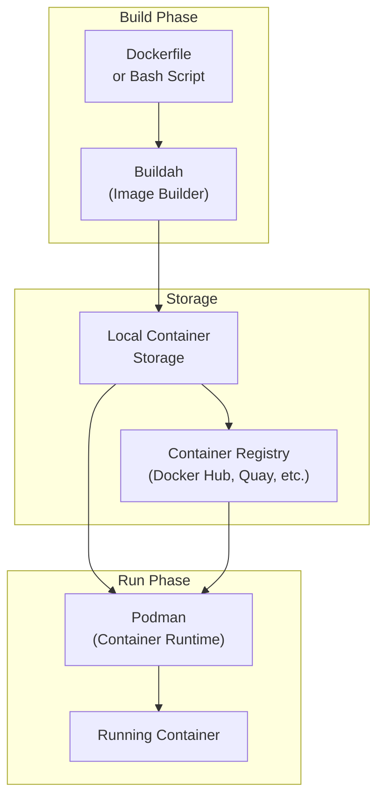
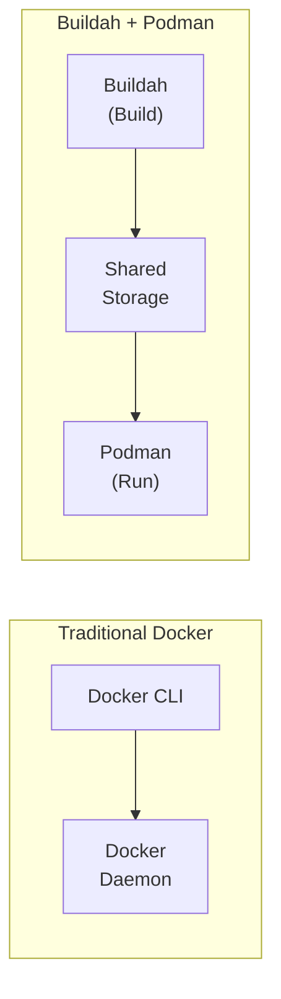
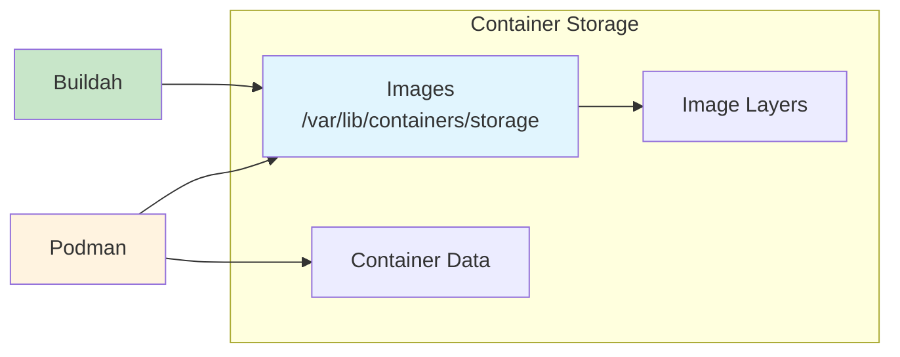
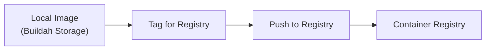

# How to Use Buildah with Podman

Author: [nawazdhandala](https://www.github.com/nawazdhandala)

Tags: Buildah, Podman, Containers, Docker, DevOps, OCI, Container Images, Linux

Description: Learn how to use Buildah with Podman for building and running container images without Docker. Master OCI-compliant image creation, rootless containers, and seamless integration between these powerful tools.

---

> Building container images without Docker daemon dependency has become essential for modern CI/CD pipelines. Buildah and Podman together provide a complete container workflow that runs rootless and daemonless, making them ideal for security-conscious environments.

Container images built with Buildah work seamlessly with Podman for running containers. Both tools share the same underlying libraries and storage, creating a unified containerization experience.

---

## Overview



---

## Why Buildah and Podman Together?

### Key Benefits



| Feature | Docker | Buildah + Podman |
|---------|--------|------------------|
| Daemon Required | Yes | No |
| Root Privileges | Usually | Optional |
| Shared Storage | Via daemon | Direct |
| Build Scripts | Dockerfile only | Dockerfile + Shell |
| OCI Compliance | Yes | Yes |

---

## Installation

### Install Buildah and Podman on Fedora/RHEL/CentOS

Both tools are available from the default package repositories on Red Hat-based systems:

```bash
# Install buildah and podman from dnf repositories
sudo dnf install -y buildah podman

# Verify the installed versions
buildah --version
podman --version
```

### Install on Ubuntu/Debian

Ubuntu and Debian require adding the Kubic repository for the latest versions:

```bash
# Add the Kubic project repository for up-to-date packages
. /etc/os-release
sudo sh -c "echo 'deb https://download.opensuse.org/repositories/devel:/kubic:/libcontainers:/stable/xUbuntu_${VERSION_ID}/ /' > /etc/apt/sources.list.d/devel:kubic:libcontainers:stable.list"

# Import the repository signing key
curl -fsSL "https://download.opensuse.org/repositories/devel:/kubic:/libcontainers:/stable/xUbuntu_${VERSION_ID}/Release.key" | sudo apt-key add -

# Update package cache and install both tools
sudo apt update
sudo apt install -y buildah podman
```

### Install on macOS

macOS users can use Homebrew to install the Podman machine, which includes Buildah:

```bash
# Install podman using Homebrew
brew install podman

# Initialize and start the Podman machine (required for macOS)
podman machine init
podman machine start

# Verify buildah is available within the Podman machine
podman machine ssh buildah --version
```

---

## Building Images with Buildah

### Using Dockerfiles

Buildah fully supports Dockerfile syntax for building images. Here is an example Python application Dockerfile:

```dockerfile
# Dockerfile
FROM python:3.11-slim

# Set working directory for the application
WORKDIR /app

# Copy dependency file first for better layer caching
COPY requirements.txt .

# Install Python dependencies
RUN pip install --no-cache-dir -r requirements.txt

# Copy application source code
COPY . .

# Expose the application port
EXPOSE 8000

# Define the command to run the application
CMD ["python", "app.py"]
```

Build the image using Buildah with progress output:

```bash
# Build the image using buildah bud (build-using-dockerfile)
# The -t flag specifies the image name and tag
buildah bud -t myapp:latest .

# List all images in local storage to verify the build
buildah images
```

### Building Without Dockerfiles

Buildah supports scripted builds using shell commands, providing more flexibility than Dockerfile syntax:

```bash
#!/bin/bash
# build-script.sh - Build a container image using Buildah native commands

# Create a new container from the base image
# The 'from' command returns a container ID for subsequent operations
container=$(buildah from python:3.11-slim)

# Set the working directory inside the container
buildah config --workingdir /app $container

# Copy the requirements file into the container
buildah copy $container requirements.txt /app/

# Run pip install inside the container to install dependencies
# The --no-cache-dir flag reduces image size by not caching pip downloads
buildah run $container pip install --no-cache-dir -r requirements.txt

# Copy all application files to the container
buildah copy $container . /app/

# Configure the container metadata
buildah config --port 8000 $container
buildah config --cmd "python app.py" $container

# Add labels for image identification and documentation
buildah config --label maintainer="team@example.com" $container
buildah config --label version="1.0.0" $container

# Commit the container to create the final image
# The container is removed after commit with implicit cleanup
buildah commit $container myapp:latest

# Clean up the working container
buildah rm $container

echo "Image built successfully!"
```

Execute the build script:

```bash
# Make the script executable and run it
chmod +x build-script.sh
./build-script.sh
```

---

## Running Images with Podman

### Basic Container Operations

After building with Buildah, run containers using Podman:

```bash
# Run the container in detached mode with port mapping
# The -d flag runs the container in background
# The -p flag maps host port 8000 to container port 8000
podman run -d -p 8000:8000 --name myapp-container myapp:latest

# View running containers
podman ps

# View container logs
podman logs myapp-container

# Execute a command inside the running container
podman exec -it myapp-container /bin/bash

# Stop the container gracefully
podman stop myapp-container

# Remove the stopped container
podman rm myapp-container
```

### Running with Volume Mounts

Mount host directories into containers for persistent data or development workflows:

```bash
# Run with a volume mount for persistent data storage
# The :Z suffix applies SELinux labels automatically on Red Hat systems
podman run -d \
    -p 8000:8000 \
    -v /host/data:/app/data:Z \
    --name myapp-container \
    myapp:latest

# Run with multiple volumes for development
# Mount source code for live reloading during development
podman run -d \
    -p 8000:8000 \
    -v $(pwd)/src:/app/src:Z \
    -v $(pwd)/config:/app/config:ro \
    -e DEBUG=true \
    --name myapp-dev \
    myapp:latest
```

---

## Shared Storage Architecture



Buildah and Podman share the same storage location by default. Images built with Buildah are immediately available to Podman without any export or import steps.

Verify shared storage with the following commands:

```bash
# Build an image with buildah
buildah bud -t shared-test:latest .

# The image appears in both buildah and podman image lists
buildah images | grep shared-test
podman images | grep shared-test

# Check the storage location
# Both tools use the same directory structure
ls -la /var/lib/containers/storage/overlay-images/
```

---

## Multi-Stage Builds

### Efficient Production Images

Create smaller production images using multi-stage builds:

```dockerfile
# Dockerfile.multistage
# Stage 1: Build stage with all development dependencies
FROM golang:1.21-alpine AS builder

WORKDIR /build

# Copy module files first for dependency caching
COPY go.mod go.sum ./
RUN go mod download

# Copy source code and compile the application
COPY . .
RUN CGO_ENABLED=0 GOOS=linux go build -a -installsuffix cgo -o app .

# Stage 2: Production stage with minimal base image
FROM alpine:3.18

# Install CA certificates for HTTPS connections
RUN apk --no-cache add ca-certificates

WORKDIR /app

# Copy only the compiled binary from the build stage
COPY --from=builder /build/app .

# Run as non-root user for security
RUN adduser -D -g '' appuser
USER appuser

EXPOSE 8080
CMD ["./app"]
```

Build and verify the multi-stage image:

```bash
# Build the multi-stage image
buildah bud -f Dockerfile.multistage -t myapp:prod .

# Check the final image size - should be much smaller than the build stage
podman images myapp:prod
```

### Buildah Script for Multi-Stage

Achieve the same result using Buildah native commands:

```bash
#!/bin/bash
# multi-stage-build.sh - Multi-stage build using Buildah native commands

# Stage 1: Build the application
echo "Starting build stage..."
builder=$(buildah from golang:1.21-alpine)
buildah config --workingdir /build $builder

# Copy and download dependencies
buildah copy $builder go.mod go.sum ./
buildah run $builder go mod download

# Copy source and compile
buildah copy $builder . .
buildah run $builder -- sh -c 'CGO_ENABLED=0 GOOS=linux go build -a -installsuffix cgo -o app .'

# Mount the builder filesystem to access the compiled binary
builder_mount=$(buildah mount $builder)

# Stage 2: Create the production image
echo "Creating production image..."
production=$(buildah from alpine:3.18)

# Install certificates for HTTPS
buildah run $production apk --no-cache add ca-certificates

# Set working directory
buildah config --workingdir /app $production

# Copy the binary from the builder stage
buildah copy $production $builder_mount/build/app /app/app

# Create non-root user and configure
buildah run $production adduser -D -g '' appuser
buildah config --user appuser $production
buildah config --port 8080 $production
buildah config --cmd "./app" $production

# Commit the production image
buildah commit $production myapp:prod

# Cleanup
buildah unmount $builder
buildah rm $builder $production

echo "Multi-stage build complete!"
```

---

## Rootless Container Operations

### Configure Rootless Mode

Both Buildah and Podman support rootless operation for enhanced security:

```bash
# Check if running in rootless mode
podman info | grep rootless

# Configure subuid and subgid for rootless containers
# Add entries for your user if not already present
sudo usermod --add-subuids 100000-165535 --add-subgids 100000-165535 $USER

# Verify the configuration
grep $USER /etc/subuid
grep $USER /etc/subgid

# Reset storage after subuid/subgid changes
podman system reset
```

### Rootless Builds and Runs

```bash
# Build image as non-root user
# No sudo required - buildah uses user namespaces
buildah bud -t rootless-app:latest .

# Run container as non-root user
# Podman automatically maps container root to your user's subuid range
podman run -d -p 8080:8080 rootless-app:latest

# Verify the container is running rootless
podman inspect --format '{{.HostConfig.Privileged}}' $(podman ps -q)
```

---

## Working with Registries

### Pushing Images



Push images to container registries using either Buildah or Podman:

```bash
# Login to a container registry
# Credentials are shared between buildah and podman
podman login docker.io
podman login quay.io

# Tag the local image for the registry
# Format: registry/namespace/repository:tag
buildah tag myapp:latest docker.io/myusername/myapp:latest
buildah tag myapp:latest quay.io/myusername/myapp:v1.0.0

# Push using buildah
buildah push docker.io/myusername/myapp:latest

# Or push using podman (both use the same storage)
podman push quay.io/myusername/myapp:v1.0.0
```

### Pulling and Inspecting Images

```bash
# Pull an image from a registry
podman pull docker.io/library/nginx:latest

# Inspect image details including layers and configuration
buildah inspect docker.io/library/nginx:latest

# List image history showing all layers
podman history docker.io/library/nginx:latest

# Export image manifest in OCI format
buildah manifest inspect docker.io/library/nginx:latest
```

---

## CI/CD Integration

### GitLab CI Pipeline

Configure a GitLab CI pipeline that uses Buildah for image builds:

```yaml
# .gitlab-ci.yml
stages:
  - build
  - test
  - deploy

variables:
  # Use vfs storage driver for CI environments without overlay support
  STORAGE_DRIVER: vfs
  # Disable TLS verification for internal registries (use with caution)
  BUILDAH_ISOLATION: chroot

build-image:
  stage: build
  image: quay.io/buildah/stable
  script:
    # Login to the container registry using CI variables
    - buildah login -u $CI_REGISTRY_USER -p $CI_REGISTRY_PASSWORD $CI_REGISTRY

    # Build the image with build arguments
    - |
      buildah bud \
        --build-arg BUILD_DATE=$(date -u +'%Y-%m-%dT%H:%M:%SZ') \
        --build-arg GIT_COMMIT=$CI_COMMIT_SHA \
        -t $CI_REGISTRY_IMAGE:$CI_COMMIT_SHA \
        -t $CI_REGISTRY_IMAGE:latest \
        .

    # Push both tags to the registry
    - buildah push $CI_REGISTRY_IMAGE:$CI_COMMIT_SHA
    - buildah push $CI_REGISTRY_IMAGE:latest
  only:
    - main
    - develop

test-image:
  stage: test
  image: quay.io/podman/stable
  script:
    # Pull and run the built image for testing
    - podman pull $CI_REGISTRY_IMAGE:$CI_COMMIT_SHA
    - podman run --rm $CI_REGISTRY_IMAGE:$CI_COMMIT_SHA python -m pytest
  needs:
    - build-image
```

### GitHub Actions Workflow

```yaml
# .github/workflows/container-build.yml
name: Build Container Image

on:
  push:
    branches: [main]
  pull_request:
    branches: [main]

jobs:
  build:
    runs-on: ubuntu-latest

    steps:
      - name: Checkout code
        uses: actions/checkout@v4

      - name: Install Buildah and Podman
        run: |
          sudo apt-get update
          sudo apt-get install -y buildah podman

      - name: Build image with Buildah
        run: |
          buildah bud \
            --layers \
            --cache-from ghcr.io/${{ github.repository }}:latest \
            -t ghcr.io/${{ github.repository }}:${{ github.sha }} \
            -t ghcr.io/${{ github.repository }}:latest \
            .

      - name: Run tests with Podman
        run: |
          podman run --rm ghcr.io/${{ github.repository }}:${{ github.sha }} npm test

      - name: Login to GitHub Container Registry
        if: github.event_name == 'push'
        run: |
          echo ${{ secrets.GITHUB_TOKEN }} | buildah login -u ${{ github.actor }} --password-stdin ghcr.io

      - name: Push to registry
        if: github.event_name == 'push'
        run: |
          buildah push ghcr.io/${{ github.repository }}:${{ github.sha }}
          buildah push ghcr.io/${{ github.repository }}:latest
```

---

## Advanced Buildah Techniques

### Building from Scratch

Create minimal images starting from an empty base:

```bash
#!/bin/bash
# scratch-build.sh - Build a minimal image from scratch

# Start with an empty scratch container
container=$(buildah from scratch)

# Mount the container filesystem for direct file manipulation
mountpoint=$(buildah mount $container)

# Create the directory structure
mkdir -p $mountpoint/app
mkdir -p $mountpoint/etc

# Copy a statically compiled binary into the container
# The binary must be statically linked with no external dependencies
cp ./myapp-static $mountpoint/app/myapp

# Copy SSL certificates if the app needs HTTPS
cp /etc/ssl/certs/ca-certificates.crt $mountpoint/etc/ca-certificates.crt

# Set executable permissions
chmod +x $mountpoint/app/myapp

# Unmount and configure the container
buildah unmount $container
buildah config --cmd "/app/myapp" $container
buildah config --port 8080 $container

# Commit the minimal image
buildah commit $container myapp:scratch

# Cleanup
buildah rm $container

# Verify the image size
echo "Final image size:"
podman images myapp:scratch --format "{{.Size}}"
```

### Layer Optimization

Reduce image size by optimizing layers:

```bash
#!/bin/bash
# optimized-build.sh - Build with layer optimization

container=$(buildah from node:18-alpine)

# Combine related commands to reduce layer count
# Each RUN creates a new layer, so combine cleanup with installation
buildah run $container -- sh -c '
    apk add --no-cache python3 make g++ && \
    npm install -g npm@latest && \
    rm -rf /var/cache/apk/*
'

# Set working directory
buildah config --workingdir /app $container

# Copy package files first for better caching
buildah copy $container package*.json ./

# Install dependencies and clean npm cache in the same layer
buildah run $container -- sh -c '
    npm ci --only=production && \
    npm cache clean --force
'

# Copy application code
buildah copy $container . .

# Configure and commit
buildah config --cmd "node server.js" $container
buildah commit --squash $container myapp:optimized

buildah rm $container
```

---

## Podman Compose Integration

### Running Multi-Container Applications

Use Podman Compose or podman-compose for applications requiring multiple containers:

```yaml
# docker-compose.yml (compatible with podman-compose)
version: '3.8'

services:
  web:
    image: myapp:latest
    ports:
      - "8000:8000"
    environment:
      - DATABASE_URL=postgresql://db:5432/myapp
      - REDIS_URL=redis://cache:6379
    depends_on:
      - db
      - cache
    networks:
      - app-network

  db:
    image: postgres:15-alpine
    environment:
      - POSTGRES_DB=myapp
      - POSTGRES_USER=appuser
      - POSTGRES_PASSWORD=secretpassword
    volumes:
      - postgres-data:/var/lib/postgresql/data
    networks:
      - app-network

  cache:
    image: redis:7-alpine
    networks:
      - app-network

networks:
  app-network:
    driver: bridge

volumes:
  postgres-data:
```

Run the stack using Podman:

```bash
# Install podman-compose
pip install podman-compose

# Start all services defined in docker-compose.yml
podman-compose up -d

# View running containers
podman-compose ps

# View logs from all services
podman-compose logs -f

# Stop and remove all containers
podman-compose down
```

---

## Troubleshooting

### Common Issues and Solutions

```bash
# Issue: Permission denied errors in rootless mode
# Solution: Check subuid/subgid configuration
podman unshare cat /proc/self/uid_map

# Issue: Storage driver errors
# Solution: Reset storage and reconfigure
podman system reset
buildah containers -a  # Should show empty

# Issue: Image not found after building
# Solution: Verify storage locations match
buildah info | grep GraphRoot
podman info | grep graphRoot

# Issue: Network connectivity problems in containers
# Solution: Check DNS configuration
podman run --rm alpine cat /etc/resolv.conf

# Issue: Slow builds due to missing cache
# Solution: Use layer caching with --layers flag
buildah bud --layers -t myapp:latest .
```

### Debugging Container Builds

```bash
# Run a build with verbose output
buildah bud --log-level debug -t myapp:debug .

# Inspect a failed build container
# List all containers including failed builds
buildah containers

# Mount and explore a container filesystem
container_id=$(buildah containers -q | head -1)
mountpoint=$(buildah mount $container_id)
ls -la $mountpoint

# Clean up after debugging
buildah unmount $container_id
buildah rm $container_id
```

---

## Best Practices

### Security Recommendations

1. **Run rootless** - avoid running containers as root
2. **Use minimal base images** - reduce attack surface
3. **Scan images** - check for vulnerabilities before deployment
4. **Sign images** - verify image authenticity

### Build Optimization

1. **Order Dockerfile instructions** - place frequently changing steps last
2. **Use multi-stage builds** - separate build dependencies from runtime
3. **Leverage layer caching** - use --layers flag with Buildah
4. **Clean up in the same layer** - remove temporary files where they are created

### Storage Management

```bash
# Remove unused images to free disk space
podman image prune -a

# Remove all stopped containers
podman container prune

# Clean up all unused resources
podman system prune -a

# Check storage usage
podman system df
```

---

## Conclusion

Buildah and Podman provide a powerful, daemonless alternative to Docker for building and running containers. Key advantages include:

- **Shared storage** eliminates the need to export and import images between tools
- **Rootless operation** improves security by avoiding privileged processes
- **Dockerfile compatibility** allows migration from Docker without rewriting build configurations
- **Native scripting support** in Buildah enables complex build workflows beyond Dockerfile capabilities
- **OCI compliance** ensures images work with any OCI-compatible runtime

Getting started with Buildah and Podman requires minimal changes to existing Docker workflows while providing enhanced security and flexibility for container operations.

---

*Looking to monitor your containerized applications? [OneUptime](https://oneuptime.com) provides comprehensive observability for containers running in any environment, with support for metrics, logs, and distributed tracing.*
