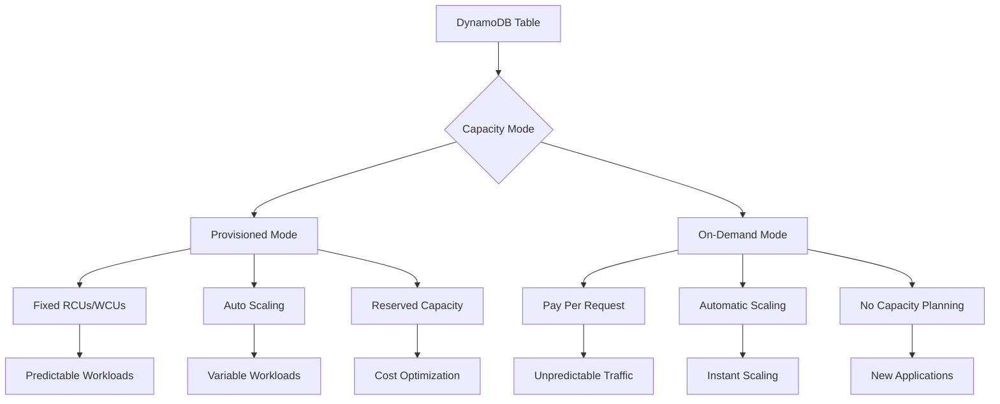
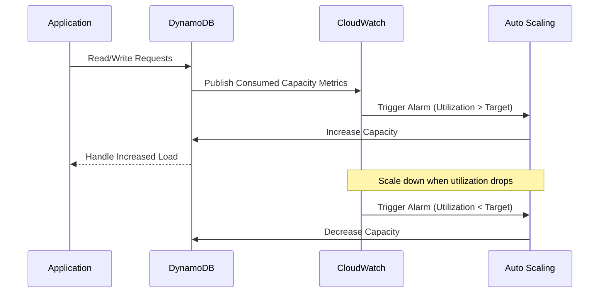
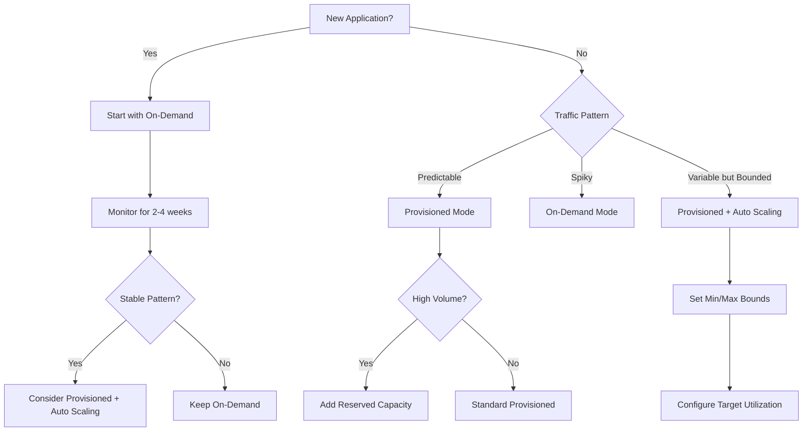
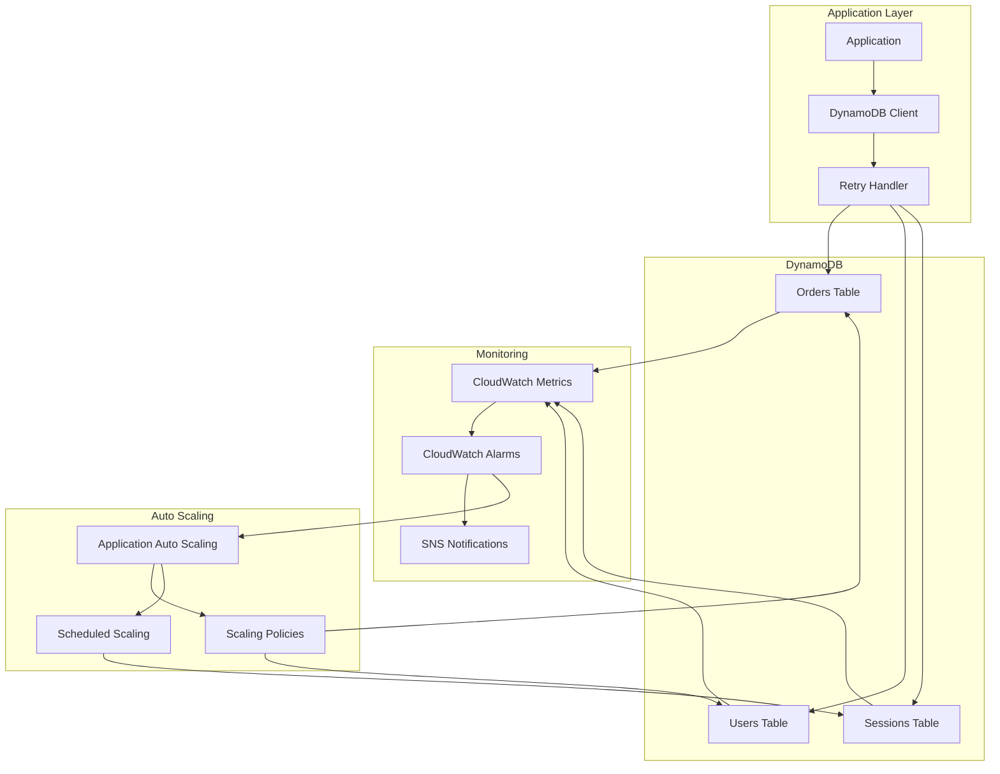
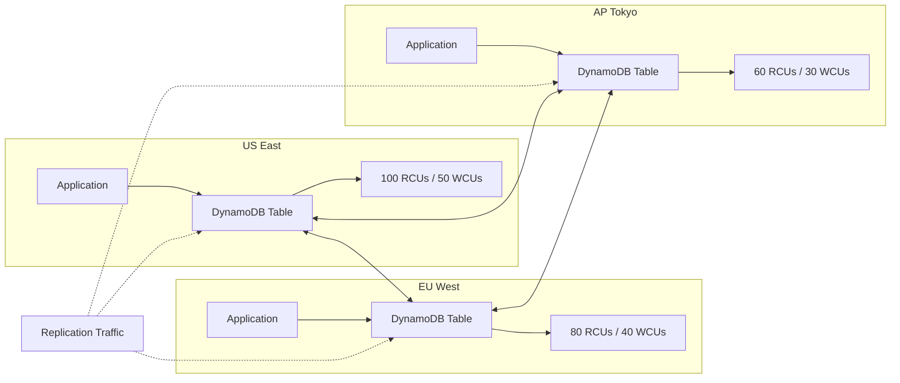
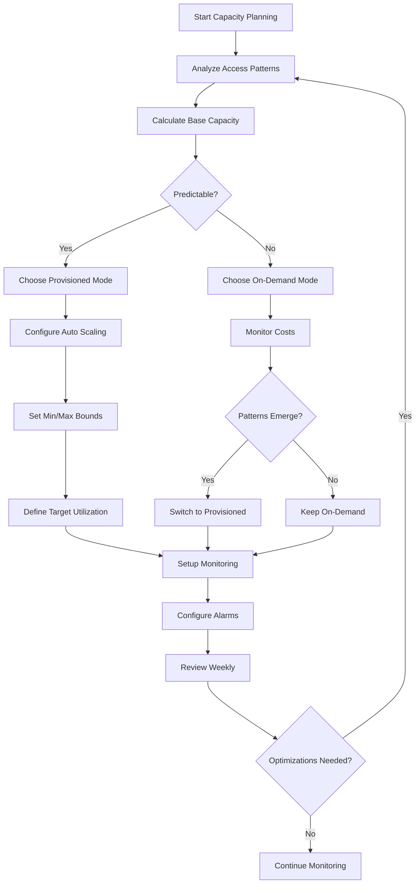

# How to Handle Capacity Planning in DynamoDB

Author: [nawazdhandala](https://github.com/nawazdhandala)

Tags: DynamoDB, AWS, Database, Capacity Planning, NoSQL, Performance, Scaling

Description: Learn how to handle capacity planning in Amazon DynamoDB with practical strategies for provisioned and on-demand modes, auto scaling configurations, reserved capacity, and monitoring techniques.

---

Amazon DynamoDB offers flexible capacity management options, but choosing the wrong configuration can lead to throttling, performance issues, or unexpected costs. Understanding capacity units, scaling strategies, and monitoring patterns helps you build applications that perform consistently while optimizing costs.

## Understanding DynamoDB Capacity Units

DynamoDB measures throughput using Read Capacity Units (RCUs) and Write Capacity Units (WCUs).

| Operation | Capacity Unit | Item Size |
|-----------|--------------|-----------|
| Strongly Consistent Read | 1 RCU | Up to 4 KB |
| Eventually Consistent Read | 0.5 RCU | Up to 4 KB |
| Transactional Read | 2 RCUs | Up to 4 KB |
| Standard Write | 1 WCU | Up to 1 KB |
| Transactional Write | 2 WCUs | Up to 1 KB |

Items larger than the base size consume additional capacity units proportionally.

## Capacity Modes Overview



## Provisioned Mode Configuration

Provisioned mode works best for predictable workloads where you can estimate read and write patterns.

The following code creates a DynamoDB table with provisioned capacity using AWS SDK for JavaScript (v3).

```javascript
// Import required AWS SDK v3 clients and commands
import {
  DynamoDBClient,
  CreateTableCommand,
  UpdateTableCommand,
  DescribeTableCommand
} from "@aws-sdk/client-dynamodb";

const client = new DynamoDBClient({ region: "us-east-1" });

// Create a table with provisioned capacity
// Allocates 100 RCUs and 50 WCUs as baseline capacity
async function createProvisionedTable() {
  const params = {
    TableName: "Orders",
    KeySchema: [
      { AttributeName: "customerId", KeyType: "HASH" },
      { AttributeName: "orderId", KeyType: "RANGE" }
    ],
    AttributeDefinitions: [
      { AttributeName: "customerId", AttributeType: "S" },
      { AttributeName: "orderId", AttributeType: "S" }
    ],
    // Provisioned throughput settings
    ProvisionedThroughput: {
      ReadCapacityUnits: 100,
      WriteCapacityUnits: 50
    },
    // Enable point-in-time recovery for data protection
    PointInTimeRecoverySpecification: {
      PointInTimeRecoveryEnabled: true
    }
  };

  try {
    const result = await client.send(new CreateTableCommand(params));
    console.log("Table created:", result.TableDescription.TableName);
    return result;
  } catch (error) {
    console.error("Error creating table:", error);
    throw error;
  }
}
```

## Calculating Required Capacity

Accurate capacity planning requires understanding your access patterns. Here is a calculator for estimating capacity requirements.

```javascript
// Capacity calculator for DynamoDB provisioned throughput
// Helps estimate RCUs and WCUs based on workload characteristics
class DynamoDBCapacityCalculator {
  constructor() {
    // Base sizes for capacity unit calculations
    this.READ_UNIT_SIZE = 4 * 1024;  // 4 KB for reads
    this.WRITE_UNIT_SIZE = 1 * 1024; // 1 KB for writes
  }

  // Calculate RCUs needed for a given read workload
  // Parameters:
  //   readsPerSecond: expected reads per second
  //   avgItemSizeBytes: average item size in bytes
  //   consistencyMode: 'strong', 'eventual', or 'transactional'
  calculateReadCapacity(readsPerSecond, avgItemSizeBytes, consistencyMode = 'eventual') {
    // Calculate how many 4KB chunks each read consumes
    const readUnitsPerItem = Math.ceil(avgItemSizeBytes / this.READ_UNIT_SIZE);

    // Apply multiplier based on consistency mode
    let multiplier;
    switch (consistencyMode) {
      case 'strong':
        multiplier = 1;
        break;
      case 'eventual':
        multiplier = 0.5;
        break;
      case 'transactional':
        multiplier = 2;
        break;
      default:
        multiplier = 0.5;
    }

    const totalRCUs = Math.ceil(readsPerSecond * readUnitsPerItem * multiplier);

    return {
      rcus: totalRCUs,
      unitsPerItem: readUnitsPerItem,
      multiplier,
      breakdown: `${readsPerSecond} reads/sec * ${readUnitsPerItem} units/item * ${multiplier} = ${totalRCUs} RCUs`
    };
  }

  // Calculate WCUs needed for a given write workload
  // Parameters:
  //   writesPerSecond: expected writes per second
  //   avgItemSizeBytes: average item size in bytes
  //   transactional: whether writes use transactions
  calculateWriteCapacity(writesPerSecond, avgItemSizeBytes, transactional = false) {
    // Calculate how many 1KB chunks each write consumes
    const writeUnitsPerItem = Math.ceil(avgItemSizeBytes / this.WRITE_UNIT_SIZE);

    // Transactional writes consume 2x capacity
    const multiplier = transactional ? 2 : 1;

    const totalWCUs = Math.ceil(writesPerSecond * writeUnitsPerItem * multiplier);

    return {
      wcus: totalWCUs,
      unitsPerItem: writeUnitsPerItem,
      multiplier,
      breakdown: `${writesPerSecond} writes/sec * ${writeUnitsPerItem} units/item * ${multiplier} = ${totalWCUs} WCUs`
    };
  }

  // Generate complete capacity estimate for a workload
  estimateCapacity(workload) {
    const readEstimate = this.calculateReadCapacity(
      workload.readsPerSecond,
      workload.avgReadItemSize,
      workload.readConsistency
    );

    const writeEstimate = this.calculateWriteCapacity(
      workload.writesPerSecond,
      workload.avgWriteItemSize,
      workload.transactionalWrites
    );

    // Add 20% buffer for traffic spikes
    const bufferMultiplier = 1.2;

    return {
      baseRCUs: readEstimate.rcus,
      baseWCUs: writeEstimate.wcus,
      recommendedRCUs: Math.ceil(readEstimate.rcus * bufferMultiplier),
      recommendedWCUs: Math.ceil(writeEstimate.wcus * bufferMultiplier),
      readBreakdown: readEstimate.breakdown,
      writeBreakdown: writeEstimate.breakdown
    };
  }
}

// Example usage
const calculator = new DynamoDBCapacityCalculator();

const workload = {
  readsPerSecond: 500,
  avgReadItemSize: 2048, // 2 KB average item
  readConsistency: 'eventual',
  writesPerSecond: 100,
  avgWriteItemSize: 512, // 512 bytes average
  transactionalWrites: false
};

const estimate = calculator.estimateCapacity(workload);
console.log("Capacity Estimate:", estimate);
// Output:
// {
//   baseRCUs: 250,
//   baseWCUs: 100,
//   recommendedRCUs: 300,
//   recommendedWCUs: 120,
//   readBreakdown: "500 reads/sec * 1 units/item * 0.5 = 250 RCUs",
//   writeBreakdown: "100 writes/sec * 1 units/item * 1 = 100 WCUs"
// }
```

## Configuring Auto Scaling

Auto scaling adjusts provisioned capacity automatically based on actual usage. The following diagram illustrates how auto scaling works.



The following code demonstrates how to configure auto scaling for a DynamoDB table using AWS SDK.

```javascript
// Configure auto scaling for DynamoDB tables
// Uses Application Auto Scaling service to manage capacity
import {
  ApplicationAutoScalingClient,
  RegisterScalableTargetCommand,
  PutScalingPolicyCommand
} from "@aws-sdk/client-application-auto-scaling";

const autoScalingClient = new ApplicationAutoScalingClient({ region: "us-east-1" });

// Register the table as a scalable target for read capacity
// Allows auto scaling to manage RCUs between min and max values
async function registerReadScalableTarget(tableName, minCapacity, maxCapacity) {
  const params = {
    ServiceNamespace: "dynamodb",
    ResourceId: `table/${tableName}`,
    ScalableDimension: "dynamodb:table:ReadCapacityUnits",
    MinCapacity: minCapacity,
    MaxCapacity: maxCapacity
  };

  try {
    await autoScalingClient.send(new RegisterScalableTargetCommand(params));
    console.log(`Registered read scaling target for ${tableName}`);
  } catch (error) {
    console.error("Error registering scalable target:", error);
    throw error;
  }
}

// Register the table as a scalable target for write capacity
async function registerWriteScalableTarget(tableName, minCapacity, maxCapacity) {
  const params = {
    ServiceNamespace: "dynamodb",
    ResourceId: `table/${tableName}`,
    ScalableDimension: "dynamodb:table:WriteCapacityUnits",
    MinCapacity: minCapacity,
    MaxCapacity: maxCapacity
  };

  try {
    await autoScalingClient.send(new RegisterScalableTargetCommand(params));
    console.log(`Registered write scaling target for ${tableName}`);
  } catch (error) {
    console.error("Error registering scalable target:", error);
    throw error;
  }
}

// Create a target tracking scaling policy
// Adjusts capacity to maintain target utilization percentage
async function createScalingPolicy(tableName, dimension, targetUtilization) {
  const dimensionName = dimension === 'read'
    ? 'dynamodb:table:ReadCapacityUnits'
    : 'dynamodb:table:WriteCapacityUnits';

  const metricName = dimension === 'read'
    ? 'DynamoDBReadCapacityUtilization'
    : 'DynamoDBWriteCapacityUtilization';

  const params = {
    ServiceNamespace: "dynamodb",
    ResourceId: `table/${tableName}`,
    ScalableDimension: dimensionName,
    PolicyName: `${tableName}-${dimension}-scaling-policy`,
    PolicyType: "TargetTrackingScaling",
    TargetTrackingScalingPolicyConfiguration: {
      // Target utilization percentage (e.g., 70%)
      TargetValue: targetUtilization,
      // Predefined metric for DynamoDB capacity utilization
      PredefinedMetricSpecification: {
        PredefinedMetricType: metricName
      },
      // Cooldown periods prevent rapid scaling fluctuations
      ScaleInCooldown: 60,  // Wait 60 seconds before scaling down
      ScaleOutCooldown: 60  // Wait 60 seconds before scaling up again
    }
  };

  try {
    const result = await autoScalingClient.send(new PutScalingPolicyCommand(params));
    console.log(`Created ${dimension} scaling policy for ${tableName}`);
    return result;
  } catch (error) {
    console.error("Error creating scaling policy:", error);
    throw error;
  }
}

// Complete auto scaling setup for a table
async function setupAutoScaling(config) {
  const {
    tableName,
    readMin,
    readMax,
    writeMin,
    writeMax,
    targetUtilization
  } = config;

  // Register scalable targets
  await registerReadScalableTarget(tableName, readMin, readMax);
  await registerWriteScalableTarget(tableName, writeMin, writeMax);

  // Create scaling policies
  await createScalingPolicy(tableName, 'read', targetUtilization);
  await createScalingPolicy(tableName, 'write', targetUtilization);

  console.log(`Auto scaling configured for table: ${tableName}`);
}

// Example: Configure auto scaling with 70% target utilization
setupAutoScaling({
  tableName: "Orders",
  readMin: 50,     // Minimum 50 RCUs
  readMax: 1000,   // Maximum 1000 RCUs
  writeMin: 25,    // Minimum 25 WCUs
  writeMax: 500,   // Maximum 500 WCUs
  targetUtilization: 70  // Scale to maintain 70% utilization
});
```

## On-Demand Mode

On-demand mode eliminates capacity planning by automatically scaling to handle any workload. Choose on-demand mode for new applications with unknown traffic patterns, workloads with unpredictable spikes, or applications where you prefer simplicity over cost optimization.

```javascript
// Create a table with on-demand capacity mode
// No need to specify RCUs or WCUs - scales automatically
async function createOnDemandTable() {
  const params = {
    TableName: "UserSessions",
    KeySchema: [
      { AttributeName: "sessionId", KeyType: "HASH" }
    ],
    AttributeDefinitions: [
      { AttributeName: "sessionId", AttributeType: "S" }
    ],
    // On-demand billing mode - pay per request
    BillingMode: "PAY_PER_REQUEST"
  };

  try {
    const result = await client.send(new CreateTableCommand(params));
    console.log("On-demand table created:", result.TableDescription.TableName);
    return result;
  } catch (error) {
    console.error("Error creating table:", error);
    throw error;
  }
}

// Switch an existing table from provisioned to on-demand
async function switchToOnDemand(tableName) {
  const params = {
    TableName: tableName,
    BillingMode: "PAY_PER_REQUEST"
  };

  try {
    const result = await client.send(new UpdateTableCommand(params));
    console.log(`Table ${tableName} switched to on-demand mode`);
    return result;
  } catch (error) {
    console.error("Error switching billing mode:", error);
    throw error;
  }
}

// Switch from on-demand back to provisioned
// Useful when workload stabilizes and you want to optimize costs
async function switchToProvisioned(tableName, rcus, wcus) {
  const params = {
    TableName: tableName,
    BillingMode: "PROVISIONED",
    ProvisionedThroughput: {
      ReadCapacityUnits: rcus,
      WriteCapacityUnits: wcus
    }
  };

  try {
    const result = await client.send(new UpdateTableCommand(params));
    console.log(`Table ${tableName} switched to provisioned mode`);
    return result;
  } catch (error) {
    console.error("Error switching billing mode:", error);
    throw error;
  }
}
```

## Capacity Mode Decision Flow



## Monitoring Capacity Metrics

Effective capacity planning requires continuous monitoring. The following code demonstrates how to retrieve and analyze capacity metrics using CloudWatch.

```javascript
// Monitor DynamoDB capacity metrics using CloudWatch
import {
  CloudWatchClient,
  GetMetricStatisticsCommand
} from "@aws-sdk/client-cloudwatch";

const cloudWatchClient = new CloudWatchClient({ region: "us-east-1" });

// Retrieve consumed capacity metrics for a table
// Helps identify usage patterns and capacity needs
async function getConsumedCapacity(tableName, metricName, period, hours) {
  const endTime = new Date();
  const startTime = new Date(endTime.getTime() - hours * 60 * 60 * 1000);

  const params = {
    Namespace: "AWS/DynamoDB",
    MetricName: metricName,
    Dimensions: [
      {
        Name: "TableName",
        Value: tableName
      }
    ],
    StartTime: startTime,
    EndTime: endTime,
    Period: period, // Seconds between data points
    Statistics: ["Sum", "Average", "Maximum"]
  };

  try {
    const result = await cloudWatchClient.send(new GetMetricStatisticsCommand(params));
    return result.Datapoints.sort((a, b) => a.Timestamp - b.Timestamp);
  } catch (error) {
    console.error("Error fetching metrics:", error);
    throw error;
  }
}

// Analyze capacity utilization and generate recommendations
async function analyzeCapacity(tableName) {
  // Fetch metrics for the past 24 hours with 5-minute granularity
  const [readMetrics, writeMetrics, throttledReads, throttledWrites] = await Promise.all([
    getConsumedCapacity(tableName, "ConsumedReadCapacityUnits", 300, 24),
    getConsumedCapacity(tableName, "ConsumedWriteCapacityUnits", 300, 24),
    getConsumedCapacity(tableName, "ReadThrottledRequests", 300, 24),
    getConsumedCapacity(tableName, "WriteThrottledRequests", 300, 24)
  ]);

  // Calculate statistics
  const readStats = calculateStats(readMetrics);
  const writeStats = calculateStats(writeMetrics);

  // Sum throttled requests
  const totalThrottledReads = throttledReads.reduce((sum, d) => sum + (d.Sum || 0), 0);
  const totalThrottledWrites = throttledWrites.reduce((sum, d) => sum + (d.Sum || 0), 0);

  return {
    tableName,
    period: "24 hours",
    reads: {
      average: Math.round(readStats.average),
      maximum: Math.round(readStats.maximum),
      p95: Math.round(readStats.p95),
      throttledRequests: totalThrottledReads
    },
    writes: {
      average: Math.round(writeStats.average),
      maximum: Math.round(writeStats.maximum),
      p95: Math.round(writeStats.p95),
      throttledRequests: totalThrottledWrites
    },
    recommendations: generateRecommendations(readStats, writeStats, totalThrottledReads, totalThrottledWrites)
  };
}

// Calculate statistical measures from metric data points
function calculateStats(datapoints) {
  if (datapoints.length === 0) {
    return { average: 0, maximum: 0, p95: 0 };
  }

  // Convert 5-minute sums to per-second rates
  const values = datapoints.map(d => (d.Sum || 0) / 300);

  const sorted = [...values].sort((a, b) => a - b);
  const sum = values.reduce((a, b) => a + b, 0);

  return {
    average: sum / values.length,
    maximum: Math.max(...values),
    p95: sorted[Math.floor(sorted.length * 0.95)] || 0
  };
}

// Generate capacity recommendations based on usage patterns
function generateRecommendations(readStats, writeStats, throttledReads, throttledWrites) {
  const recommendations = [];

  // Check for throttling issues
  if (throttledReads > 0) {
    recommendations.push({
      severity: "high",
      type: "read_throttling",
      message: `${throttledReads} read requests were throttled. Increase read capacity or enable auto scaling.`
    });
  }

  if (throttledWrites > 0) {
    recommendations.push({
      severity: "high",
      type: "write_throttling",
      message: `${throttledWrites} write requests were throttled. Increase write capacity or enable auto scaling.`
    });
  }

  // Check for over-provisioning (if max usage is much lower than average)
  if (readStats.maximum > 0 && readStats.average / readStats.maximum < 0.3) {
    recommendations.push({
      severity: "medium",
      type: "read_optimization",
      message: "Read capacity appears over-provisioned. Consider reducing minimum capacity or using on-demand mode."
    });
  }

  if (writeStats.maximum > 0 && writeStats.average / writeStats.maximum < 0.3) {
    recommendations.push({
      severity: "medium",
      type: "write_optimization",
      message: "Write capacity appears over-provisioned. Consider reducing minimum capacity or using on-demand mode."
    });
  }

  // Recommend provisioned capacity values
  recommendations.push({
    severity: "info",
    type: "capacity_suggestion",
    message: `Recommended provisioned capacity: ${Math.ceil(readStats.p95 * 1.2)} RCUs, ${Math.ceil(writeStats.p95 * 1.2)} WCUs (based on P95 + 20% buffer)`
  });

  return recommendations;
}

// Example usage
const analysis = await analyzeCapacity("Orders");
console.log(JSON.stringify(analysis, null, 2));
```

## Handling Throttling

When capacity is exceeded, DynamoDB throttles requests. The following code implements retry logic with exponential backoff to handle throttling gracefully.

```javascript
// Retry handler for DynamoDB operations with exponential backoff
// Handles ProvisionedThroughputExceededException gracefully
class DynamoDBRetryHandler {
  constructor(options = {}) {
    this.maxRetries = options.maxRetries || 5;
    this.baseDelayMs = options.baseDelayMs || 100;
    this.maxDelayMs = options.maxDelayMs || 5000;
  }

  // Execute a DynamoDB operation with automatic retry on throttling
  async executeWithRetry(operation) {
    let lastError;

    for (let attempt = 0; attempt <= this.maxRetries; attempt++) {
      try {
        return await operation();
      } catch (error) {
        lastError = error;

        // Check if error is due to throttling
        if (this.isThrottlingError(error)) {
          if (attempt < this.maxRetries) {
            const delay = this.calculateDelay(attempt);
            console.warn(`Throttled. Retrying in ${delay}ms (attempt ${attempt + 1}/${this.maxRetries})`);
            await this.sleep(delay);
            continue;
          }
        }

        // Non-throttling error or max retries exceeded
        throw error;
      }
    }

    throw lastError;
  }

  // Check if the error is a throttling exception
  isThrottlingError(error) {
    const throttlingCodes = [
      'ProvisionedThroughputExceededException',
      'ThrottlingException',
      'RequestLimitExceeded'
    ];
    return throttlingCodes.includes(error.name) ||
           throttlingCodes.includes(error.code);
  }

  // Calculate delay with exponential backoff and jitter
  calculateDelay(attempt) {
    // Exponential backoff: 100ms, 200ms, 400ms, 800ms, 1600ms...
    const exponentialDelay = this.baseDelayMs * Math.pow(2, attempt);

    // Add random jitter (0-100% of delay) to prevent thundering herd
    const jitter = Math.random() * exponentialDelay;

    // Cap at maximum delay
    return Math.min(exponentialDelay + jitter, this.maxDelayMs);
  }

  sleep(ms) {
    return new Promise(resolve => setTimeout(resolve, ms));
  }
}

// Usage example with DynamoDB operations
import { DynamoDBDocumentClient, PutCommand, GetCommand } from "@aws-sdk/lib-dynamodb";

const docClient = DynamoDBDocumentClient.from(client);
const retryHandler = new DynamoDBRetryHandler({ maxRetries: 5 });

async function putItemWithRetry(tableName, item) {
  return retryHandler.executeWithRetry(async () => {
    return docClient.send(new PutCommand({
      TableName: tableName,
      Item: item
    }));
  });
}

async function getItemWithRetry(tableName, key) {
  return retryHandler.executeWithRetry(async () => {
    return docClient.send(new GetCommand({
      TableName: tableName,
      Key: key
    }));
  });
}
```

## Capacity Planning Architecture

The following diagram shows a comprehensive capacity planning architecture for DynamoDB.



## Reserved Capacity for Cost Optimization

Reserved capacity provides significant discounts for predictable, high-volume workloads.

| Commitment | Discount | Best For |
|------------|----------|----------|
| 1 Year | ~50% | Stable production workloads |
| 3 Year | ~75% | Long-term applications |
| On-Demand | 0% | Variable workloads |

The following code demonstrates how to analyze your usage and determine if reserved capacity makes sense.

```javascript
// Reserved capacity cost analyzer
// Compares on-demand costs vs reserved capacity savings
class ReservedCapacityAnalyzer {
  constructor(region = "us-east-1") {
    // Pricing varies by region - these are example US East prices
    this.pricing = {
      onDemand: {
        rcu: 0.00013,  // Per RCU-hour
        wcu: 0.00065   // Per WCU-hour
      },
      reserved1Year: {
        rcu: 0.0001,   // ~23% discount
        wcu: 0.0005    // ~23% discount
      },
      reserved3Year: {
        rcu: 0.000052, // ~60% discount
        wcu: 0.00026   // ~60% discount
      }
    };
  }

  // Calculate monthly costs for different capacity options
  calculateMonthlyCosts(avgRcus, avgWcus) {
    const hoursPerMonth = 730; // Average hours in a month

    const onDemandCost =
      (avgRcus * this.pricing.onDemand.rcu * hoursPerMonth) +
      (avgWcus * this.pricing.onDemand.wcu * hoursPerMonth);

    const reserved1YearCost =
      (avgRcus * this.pricing.reserved1Year.rcu * hoursPerMonth) +
      (avgWcus * this.pricing.reserved1Year.wcu * hoursPerMonth);

    const reserved3YearCost =
      (avgRcus * this.pricing.reserved3Year.rcu * hoursPerMonth) +
      (avgWcus * this.pricing.reserved3Year.wcu * hoursPerMonth);

    return {
      onDemand: {
        monthly: onDemandCost.toFixed(2),
        annual: (onDemandCost * 12).toFixed(2)
      },
      reserved1Year: {
        monthly: reserved1YearCost.toFixed(2),
        annual: (reserved1YearCost * 12).toFixed(2),
        savings: ((onDemandCost - reserved1YearCost) * 12).toFixed(2),
        savingsPercent: ((1 - reserved1YearCost / onDemandCost) * 100).toFixed(1)
      },
      reserved3Year: {
        monthly: reserved3YearCost.toFixed(2),
        annual: (reserved3YearCost * 12).toFixed(2),
        savings: ((onDemandCost - reserved3YearCost) * 12).toFixed(2),
        savingsPercent: ((1 - reserved3YearCost / onDemandCost) * 100).toFixed(1)
      }
    };
  }

  // Generate recommendation based on usage stability
  recommend(avgRcus, avgWcus, usageVariability) {
    const costs = this.calculateMonthlyCosts(avgRcus, avgWcus);

    // Calculate baseline capacity for reservation
    // Reserve capacity for consistent baseline, use on-demand for peaks
    const baselineRcus = Math.floor(avgRcus * (1 - usageVariability));
    const baselineWcus = Math.floor(avgWcus * (1 - usageVariability));

    return {
      costs,
      recommendation: {
        strategy: usageVariability > 0.5
          ? "Use on-demand mode due to high variability"
          : usageVariability > 0.2
            ? "Consider reserved capacity for baseline with auto-scaling for peaks"
            : "Reserved capacity recommended for predictable workload",
        baselineToReserve: {
          rcus: baselineRcus,
          wcus: baselineWcus
        }
      }
    };
  }
}

// Example analysis
const analyzer = new ReservedCapacityAnalyzer();
const result = analyzer.recommend(
  500,   // Average 500 RCUs
  200,   // Average 200 WCUs
  0.3    // 30% variability in usage
);

console.log("Cost Analysis:", JSON.stringify(result, null, 2));
```

## Global Tables Capacity Planning

Global tables replicate data across multiple AWS regions. Each region consumes capacity independently.



When planning capacity for global tables, account for replication writes. Each write in one region triggers replicated writes in all other regions.

```javascript
// Global table capacity calculator
// Accounts for cross-region replication overhead
function calculateGlobalTableCapacity(regions) {
  const numRegions = regions.length;

  return regions.map(region => {
    // Local writes
    const localWrites = region.expectedWcus;

    // Replicated writes from other regions
    const replicatedWrites = regions
      .filter(r => r.name !== region.name)
      .reduce((sum, r) => sum + r.expectedWcus, 0);

    // Total write capacity needed (local + replicated)
    const totalWcus = localWrites + replicatedWrites;

    return {
      region: region.name,
      localWrites,
      replicatedWrites,
      totalWcus,
      rcus: region.expectedRcus,
      note: `Includes ${replicatedWrites} WCUs for replication from ${numRegions - 1} other regions`
    };
  });
}

// Example: Three-region global table
const regions = [
  { name: "us-east-1", expectedRcus: 100, expectedWcus: 50 },
  { name: "eu-west-1", expectedRcus: 80, expectedWcus: 40 },
  { name: "ap-northeast-1", expectedRcus: 60, expectedWcus: 30 }
];

const globalCapacity = calculateGlobalTableCapacity(regions);
console.log("Global Table Capacity:", JSON.stringify(globalCapacity, null, 2));
// Each region needs capacity for local writes PLUS replicated writes from other regions
```

## Scheduled Scaling for Predictable Patterns

When your workload follows predictable patterns, schedule capacity changes in advance.

```javascript
// Scheduled scaling using AWS Application Auto Scaling
import {
  ApplicationAutoScalingClient,
  PutScheduledActionCommand
} from "@aws-sdk/client-application-auto-scaling";

const schedulingClient = new ApplicationAutoScalingClient({ region: "us-east-1" });

// Create a scheduled scaling action
// Useful for known traffic patterns like business hours or batch jobs
async function createScheduledScaling(config) {
  const { tableName, actionName, schedule, minCapacity, maxCapacity, dimension } = config;

  const dimensionName = dimension === 'read'
    ? 'dynamodb:table:ReadCapacityUnits'
    : 'dynamodb:table:WriteCapacityUnits';

  const params = {
    ServiceNamespace: "dynamodb",
    ResourceId: `table/${tableName}`,
    ScalableDimension: dimensionName,
    ScheduledActionName: actionName,
    // Cron expression for schedule (UTC time)
    Schedule: schedule,
    ScalableTargetAction: {
      MinCapacity: minCapacity,
      MaxCapacity: maxCapacity
    }
  };

  try {
    await schedulingClient.send(new PutScheduledActionCommand(params));
    console.log(`Scheduled action "${actionName}" created for ${tableName}`);
  } catch (error) {
    console.error("Error creating scheduled action:", error);
    throw error;
  }
}

// Example: Scale up during business hours, scale down overnight
async function setupBusinessHoursScaling(tableName) {
  // Scale up at 8 AM UTC on weekdays
  await createScheduledScaling({
    tableName,
    actionName: "scale-up-business-hours",
    schedule: "cron(0 8 ? * MON-FRI *)",
    minCapacity: 100,
    maxCapacity: 1000,
    dimension: "read"
  });

  // Scale down at 6 PM UTC on weekdays
  await createScheduledScaling({
    tableName,
    actionName: "scale-down-evening",
    schedule: "cron(0 18 ? * MON-FRI *)",
    minCapacity: 20,
    maxCapacity: 200,
    dimension: "read"
  });

  // Weekend scaling - lower capacity
  await createScheduledScaling({
    tableName,
    actionName: "scale-down-weekend",
    schedule: "cron(0 0 ? * SAT *)",
    minCapacity: 10,
    maxCapacity: 100,
    dimension: "read"
  });
}
```

## Capacity Planning Checklist



## Best Practices Summary

| Practice | Recommendation |
|----------|---------------|
| Start with On-Demand | Use for new applications until patterns emerge |
| Set Auto Scaling Bounds | Min capacity prevents cold starts, max prevents runaway costs |
| Target 70% Utilization | Leaves headroom for traffic spikes |
| Monitor Throttling | Zero throttled requests should be the goal |
| Use Scheduled Scaling | Pre-scale for known traffic patterns |
| Review Capacity Weekly | Adjust based on actual usage data |
| Consider Reserved Capacity | For stable workloads exceeding $100/month |
| Account for GSI Capacity | Global secondary indexes consume separate capacity |
| Plan for Bursts | DynamoDB provides burst capacity, but don't rely on it |
| Test Scaling Behavior | Validate auto scaling responds correctly under load |

Following these capacity planning strategies ensures your DynamoDB tables perform reliably while optimizing costs. Start simple with on-demand mode, analyze your patterns, and progressively optimize as your workload characteristics become clear.
