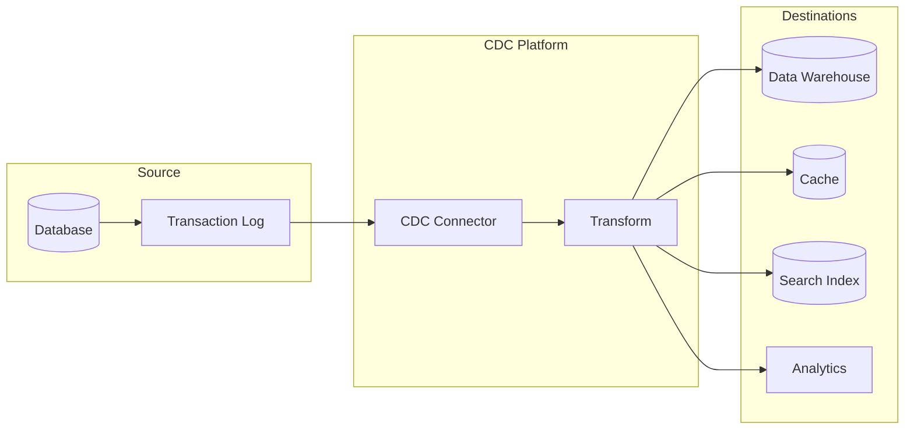
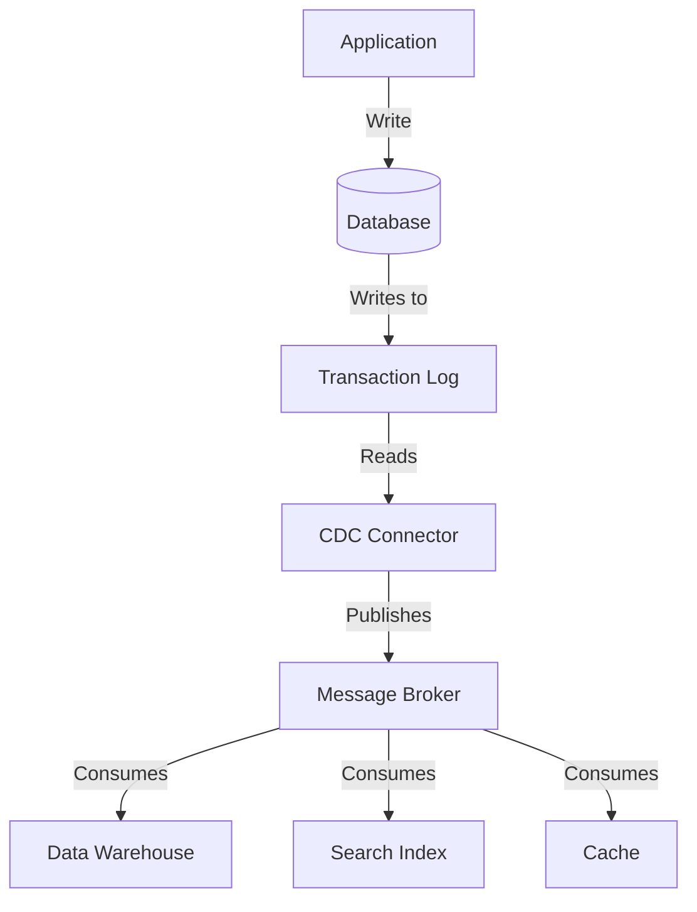
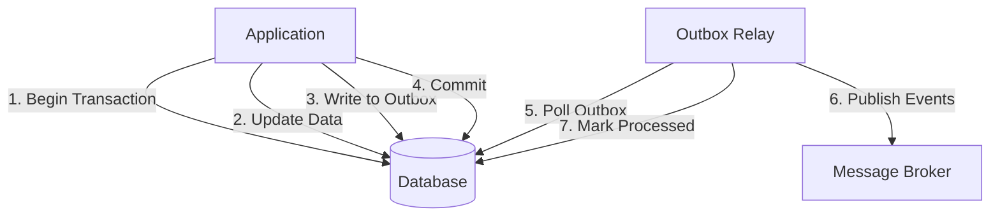
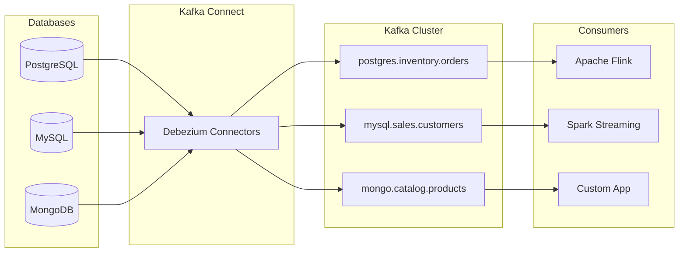
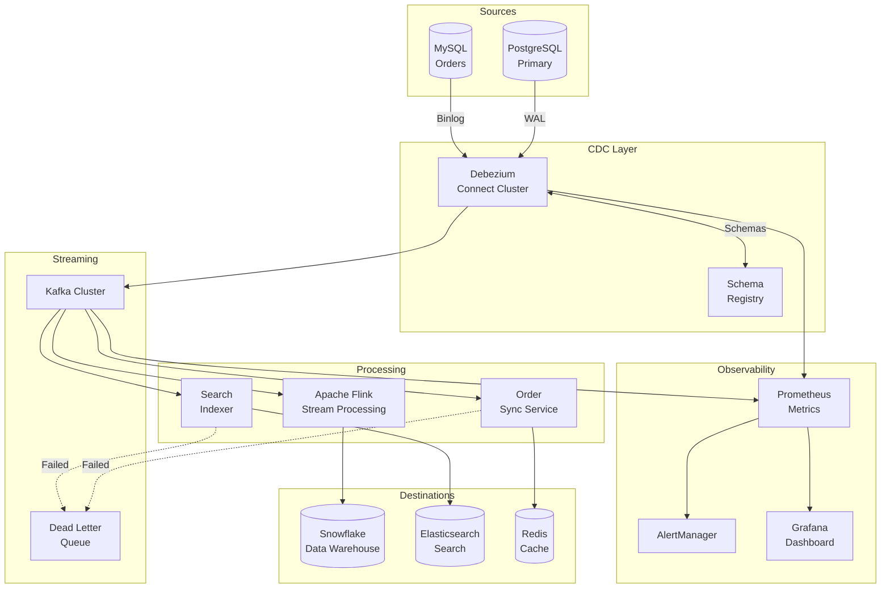

# How to Implement Change Data Capture (CDC) Pipelines

Author: [nawazdhandala](https://www.github.com/nawazdhandala)

Tags: CDC, Data Engineering, Debezium, Streaming, Kafka, PostgreSQL, Real-Time Data, Event-Driven Architecture

Description: A comprehensive guide to implementing Change Data Capture (CDC) pipelines for real-time data synchronization. Learn CDC patterns, Debezium setup, Kafka integration, and production best practices for building reliable streaming data pipelines.

---

Change Data Capture (CDC) has become the backbone of modern data architectures. Instead of periodic batch jobs that query entire tables, CDC pipelines capture row-level changes as they happen and stream them to downstream systems in near real-time. This guide walks you through implementing production-ready CDC pipelines from scratch.

## What is Change Data Capture?

Change Data Capture is a design pattern that identifies and captures changes made to data in a database. Rather than polling the entire dataset, CDC tracks individual INSERT, UPDATE, and DELETE operations and propagates them as events.

Think of CDC as a database surveillance system. Every time a row changes, CDC captures that change and publishes it as an event that downstream consumers can process.



## Why CDC Over Traditional ETL?

Traditional ETL (Extract, Transform, Load) jobs have served data teams for decades, but they come with significant drawbacks in modern architectures:

| Aspect | Traditional ETL | CDC Pipelines |
|--------|-----------------|---------------|
| Latency | Minutes to hours | Seconds to milliseconds |
| Database Load | Heavy (full table scans) | Minimal (reads transaction logs) |
| Data Freshness | Stale between runs | Near real-time |
| Change History | Lost between snapshots | Complete audit trail |
| Scalability | Limited by query performance | Scales with write throughput |

CDC pipelines excel when you need:

- Real-time analytics dashboards
- Cache invalidation without TTL guessing
- Search index synchronization
- Microservices data synchronization
- Audit logging and compliance
- Event-driven architectures

## CDC Implementation Approaches

There are four primary approaches to implementing CDC, each with different trade-offs.

### 1. Log-Based CDC (Recommended)

Log-based CDC reads the database transaction log (WAL in PostgreSQL, binlog in MySQL) to capture changes. This is the most efficient and reliable approach.



**Advantages:**
- Zero impact on application queries
- Captures all changes including deletes
- Maintains transaction ordering
- No schema modifications required

**Disadvantages:**
- Requires database configuration changes
- Log retention must be managed
- More complex initial setup

### 2. Trigger-Based CDC

Database triggers fire on each change and write to a shadow table or queue.

The following SQL creates a trigger that captures all changes to the orders table and stores them in an audit table with the operation type and timestamp.

```sql
-- Create an audit table to store change events
CREATE TABLE orders_cdc (
    id SERIAL PRIMARY KEY,
    operation VARCHAR(10) NOT NULL,
    changed_at TIMESTAMP DEFAULT CURRENT_TIMESTAMP,
    old_data JSONB,
    new_data JSONB
);

-- Create a function that captures changes and writes them to the audit table
CREATE OR REPLACE FUNCTION capture_order_changes()
RETURNS TRIGGER AS $$
BEGIN
    IF TG_OP = 'INSERT' THEN
        INSERT INTO orders_cdc (operation, new_data)
        VALUES ('INSERT', row_to_json(NEW)::jsonb);
        RETURN NEW;
    ELSIF TG_OP = 'UPDATE' THEN
        INSERT INTO orders_cdc (operation, old_data, new_data)
        VALUES ('UPDATE', row_to_json(OLD)::jsonb, row_to_json(NEW)::jsonb);
        RETURN NEW;
    ELSIF TG_OP = 'DELETE' THEN
        INSERT INTO orders_cdc (operation, old_data)
        VALUES ('DELETE', row_to_json(OLD)::jsonb);
        RETURN OLD;
    END IF;
    RETURN NULL;
END;
$$ LANGUAGE plpgsql;

-- Attach the trigger to the orders table for all change operations
CREATE TRIGGER orders_cdc_trigger
AFTER INSERT OR UPDATE OR DELETE ON orders
FOR EACH ROW EXECUTE FUNCTION capture_order_changes();
```

**Advantages:**
- Works on any database
- Simple to understand
- No special permissions needed

**Disadvantages:**
- Adds write latency to every transaction
- Increases storage requirements
- Must maintain triggers for each table

### 3. Query-Based CDC (Timestamp Polling)

Query-based CDC periodically polls tables for rows where the updated timestamp is newer than the last checkpoint.

This Python script demonstrates a simple polling-based CDC implementation that queries for records modified since the last checkpoint.

```python
import psycopg2
from datetime import datetime, timezone
import json
import time

class QueryBasedCDC:
    """
    A simple query-based CDC implementation that polls for changes
    using a timestamp column. Suitable for tables with reliable
    updated_at timestamps.
    """

    def __init__(self, connection_string: str, table: str, timestamp_column: str = "updated_at"):
        self.conn = psycopg2.connect(connection_string)
        self.table = table
        self.timestamp_column = timestamp_column
        # Start from epoch if no checkpoint exists
        self.last_checkpoint = datetime(1970, 1, 1, tzinfo=timezone.utc)

    def poll_changes(self, batch_size: int = 1000) -> list:
        """
        Query for all rows modified since the last checkpoint.
        Returns a list of changed records.
        """
        query = f"""
            SELECT * FROM {self.table}
            WHERE {self.timestamp_column} > %s
            ORDER BY {self.timestamp_column} ASC
            LIMIT %s
        """

        with self.conn.cursor() as cursor:
            cursor.execute(query, (self.last_checkpoint, batch_size))
            columns = [desc[0] for desc in cursor.description]
            rows = cursor.fetchall()

            changes = []
            for row in rows:
                record = dict(zip(columns, row))
                changes.append({
                    "operation": "UPSERT",  # Cannot distinguish INSERT from UPDATE
                    "timestamp": record[self.timestamp_column].isoformat(),
                    "data": record
                })
                # Update checkpoint to the latest timestamp seen
                self.last_checkpoint = max(
                    self.last_checkpoint,
                    record[self.timestamp_column]
                )

            return changes

    def run_continuous(self, interval_seconds: int = 5):
        """
        Continuously poll for changes at the specified interval.
        """
        print(f"Starting CDC polling for {self.table}")
        while True:
            changes = self.poll_changes()
            if changes:
                print(f"Found {len(changes)} changes")
                for change in changes:
                    # Process each change - send to Kafka, webhook, etc.
                    self.process_change(change)
            time.sleep(interval_seconds)

    def process_change(self, change: dict):
        """
        Handle a single change event. Override this method
        to send changes to your destination system.
        """
        print(json.dumps(change, default=str, indent=2))
```

**Advantages:**
- No database configuration needed
- Works with read replicas
- Simple implementation

**Disadvantages:**
- Cannot capture deletes
- Cannot distinguish inserts from updates
- Higher database load from polling
- Latency depends on poll interval

### 4. Application-Level CDC

The application emits events directly when making changes, using the outbox pattern for reliability.



The following code demonstrates the transactional outbox pattern where change events are written to an outbox table within the same transaction as the data change.

```python
from sqlalchemy import create_engine, text
from sqlalchemy.orm import sessionmaker
import json
import uuid

class OutboxPublisher:
    """
    Implements the transactional outbox pattern for reliable
    event publishing. Events are written to an outbox table
    within the same transaction as the data change.
    """

    def __init__(self, database_url: str):
        self.engine = create_engine(database_url)
        self.Session = sessionmaker(bind=self.engine)
        self._ensure_outbox_table()

    def _ensure_outbox_table(self):
        """
        Create the outbox table if it does not exist.
        This table stores events until they are published.
        """
        create_table_sql = """
            CREATE TABLE IF NOT EXISTS outbox (
                id UUID PRIMARY KEY,
                aggregate_type VARCHAR(255) NOT NULL,
                aggregate_id VARCHAR(255) NOT NULL,
                event_type VARCHAR(255) NOT NULL,
                payload JSONB NOT NULL,
                created_at TIMESTAMP DEFAULT CURRENT_TIMESTAMP,
                published_at TIMESTAMP NULL
            )
        """
        with self.engine.connect() as conn:
            conn.execute(text(create_table_sql))
            conn.commit()

    def update_with_event(
        self,
        session,
        aggregate_type: str,
        aggregate_id: str,
        event_type: str,
        payload: dict
    ):
        """
        Write an event to the outbox table. Call this method
        within the same transaction as your data changes to
        ensure atomicity.
        """
        outbox_insert = text("""
            INSERT INTO outbox (id, aggregate_type, aggregate_id, event_type, payload)
            VALUES (:id, :aggregate_type, :aggregate_id, :event_type, :payload)
        """)

        session.execute(outbox_insert, {
            "id": str(uuid.uuid4()),
            "aggregate_type": aggregate_type,
            "aggregate_id": aggregate_id,
            "event_type": event_type,
            "payload": json.dumps(payload)
        })


class OrderService:
    """
    Example service demonstrating the outbox pattern.
    All data changes include a corresponding outbox entry.
    """

    def __init__(self, database_url: str):
        self.engine = create_engine(database_url)
        self.Session = sessionmaker(bind=self.engine)
        self.outbox = OutboxPublisher(database_url)

    def create_order(self, customer_id: str, items: list, total: float) -> str:
        """
        Create a new order and publish an OrderCreated event.
        Both operations happen in a single transaction.
        """
        session = self.Session()
        try:
            # Generate order ID
            order_id = str(uuid.uuid4())

            # Insert the order into the orders table
            session.execute(
                text("""
                    INSERT INTO orders (id, customer_id, items, total, status)
                    VALUES (:id, :customer_id, :items, :total, :status)
                """),
                {
                    "id": order_id,
                    "customer_id": customer_id,
                    "items": json.dumps(items),
                    "total": total,
                    "status": "pending"
                }
            )

            # Write the event to the outbox in the same transaction
            self.outbox.update_with_event(
                session=session,
                aggregate_type="Order",
                aggregate_id=order_id,
                event_type="OrderCreated",
                payload={
                    "order_id": order_id,
                    "customer_id": customer_id,
                    "items": items,
                    "total": total,
                    "status": "pending"
                }
            )

            # Commit both the order and the outbox entry atomically
            session.commit()
            return order_id

        except Exception as e:
            session.rollback()
            raise e
        finally:
            session.close()
```

## Setting Up Debezium for Log-Based CDC

Debezium is the most popular open-source CDC platform. It connects to database transaction logs and streams changes to Apache Kafka.

### Architecture Overview



### PostgreSQL Configuration

First, configure PostgreSQL for logical replication. This requires modifying the postgresql.conf file to enable the write-ahead log settings needed for CDC.

```bash
# Edit postgresql.conf to enable logical replication
# These settings allow Debezium to read the transaction log

# Set the write-ahead log level to logical for CDC support
wal_level = logical

# Number of replication slots to reserve for CDC connectors
max_replication_slots = 4

# Maximum number of processes that can connect for replication
max_wal_senders = 4
```

Create a dedicated replication user with the minimum required permissions for Debezium to read the transaction log.

```sql
-- Create a dedicated user for Debezium with replication privileges
CREATE USER debezium WITH REPLICATION LOGIN PASSWORD 'secure_password_here';

-- Grant SELECT on all tables in the schema you want to capture
GRANT SELECT ON ALL TABLES IN SCHEMA public TO debezium;

-- Create a publication for the tables you want to capture
-- This tells PostgreSQL which tables should have their changes published
CREATE PUBLICATION debezium_publication FOR TABLE orders, customers, products;
```

### Docker Compose Setup

The following Docker Compose file sets up a complete CDC pipeline with Kafka, Zookeeper, Kafka Connect with Debezium, and PostgreSQL.

```yaml
version: '3.8'

services:
  # Zookeeper is required for Kafka cluster coordination
  zookeeper:
    image: confluentinc/cp-zookeeper:7.5.0
    environment:
      ZOOKEEPER_CLIENT_PORT: 2181
      ZOOKEEPER_TICK_TIME: 2000
    ports:
      - "2181:2181"

  # Kafka broker for storing and distributing CDC events
  kafka:
    image: confluentinc/cp-kafka:7.5.0
    depends_on:
      - zookeeper
    ports:
      - "9092:9092"
    environment:
      KAFKA_BROKER_ID: 1
      KAFKA_ZOOKEEPER_CONNECT: zookeeper:2181
      KAFKA_ADVERTISED_LISTENERS: PLAINTEXT://kafka:29092,PLAINTEXT_HOST://localhost:9092
      KAFKA_LISTENER_SECURITY_PROTOCOL_MAP: PLAINTEXT:PLAINTEXT,PLAINTEXT_HOST:PLAINTEXT
      KAFKA_INTER_BROKER_LISTENER_NAME: PLAINTEXT
      KAFKA_OFFSETS_TOPIC_REPLICATION_FACTOR: 1
      # Increase message size limit for large change events
      KAFKA_MESSAGE_MAX_BYTES: 10485760

  # Kafka Connect with Debezium plugins pre-installed
  connect:
    image: debezium/connect:2.4
    depends_on:
      - kafka
      - postgres
    ports:
      - "8083:8083"
    environment:
      GROUP_ID: 1
      CONFIG_STORAGE_TOPIC: connect_configs
      OFFSET_STORAGE_TOPIC: connect_offsets
      STATUS_STORAGE_TOPIC: connect_statuses
      BOOTSTRAP_SERVERS: kafka:29092
      # Connect to Kafka for storing connector state
      KEY_CONVERTER: org.apache.kafka.connect.json.JsonConverter
      VALUE_CONVERTER: org.apache.kafka.connect.json.JsonConverter

  # Source PostgreSQL database
  postgres:
    image: postgres:15
    ports:
      - "5432:5432"
    environment:
      POSTGRES_USER: postgres
      POSTGRES_PASSWORD: postgres
      POSTGRES_DB: inventory
    command:
      - "postgres"
      - "-c"
      - "wal_level=logical"
      - "-c"
      - "max_replication_slots=4"
      - "-c"
      - "max_wal_senders=4"
    volumes:
      - postgres_data:/var/lib/postgresql/data

volumes:
  postgres_data:
```

### Registering the Debezium Connector

Once the infrastructure is running, register a PostgreSQL connector with Debezium using the Kafka Connect REST API.

```bash
# Register the PostgreSQL connector with Debezium
# This configuration tells Debezium which database and tables to capture

curl -X POST http://localhost:8083/connectors \
  -H "Content-Type: application/json" \
  -d '{
    "name": "inventory-connector",
    "config": {
        "connector.class": "io.debezium.connector.postgresql.PostgresConnector",
        "database.hostname": "postgres",
        "database.port": "5432",
        "database.user": "debezium",
        "database.password": "secure_password_here",
        "database.dbname": "inventory",
        "database.server.name": "inventory",
        "table.include.list": "public.orders,public.customers,public.products",
        "plugin.name": "pgoutput",
        "publication.name": "debezium_publication",
        "slot.name": "debezium_slot",
        "topic.prefix": "cdc",
        "snapshot.mode": "initial",
        "tombstones.on.delete": "true",
        "key.converter": "org.apache.kafka.connect.json.JsonConverter",
        "key.converter.schemas.enable": "false",
        "value.converter": "org.apache.kafka.connect.json.JsonConverter",
        "value.converter.schemas.enable": "false"
    }
}'
```

## Consuming CDC Events

Once Debezium is capturing changes, you need consumers to process the events. Here is a Python consumer that processes CDC events from Kafka.

This consumer demonstrates how to handle different CDC operation types (create, update, delete) and route them to appropriate handlers.

```python
from kafka import KafkaConsumer
import json
from typing import Callable, Dict
from dataclasses import dataclass
from enum import Enum

class Operation(Enum):
    """CDC operation types as defined by Debezium"""
    CREATE = "c"
    UPDATE = "u"
    DELETE = "d"
    READ = "r"  # Snapshot reads

@dataclass
class CDCEvent:
    """
    Represents a single CDC event from Debezium.
    Contains both the before and after states of the record.
    """
    operation: Operation
    table: str
    before: dict  # State before the change (None for inserts)
    after: dict   # State after the change (None for deletes)
    timestamp: int
    transaction_id: str

class CDCConsumer:
    """
    A Kafka consumer for processing Debezium CDC events.
    Supports registering handlers for specific tables and operations.
    """

    def __init__(self, bootstrap_servers: str, topics: list, group_id: str):
        self.consumer = KafkaConsumer(
            *topics,
            bootstrap_servers=bootstrap_servers,
            group_id=group_id,
            auto_offset_reset='earliest',
            enable_auto_commit=False,
            value_deserializer=lambda m: json.loads(m.decode('utf-8'))
        )
        # Registry for table-specific handlers
        self.handlers: Dict[str, Dict[Operation, Callable]] = {}

    def register_handler(self, table: str, operation: Operation, handler: Callable):
        """
        Register a handler function for a specific table and operation.
        The handler will be called with the CDCEvent when a matching event arrives.
        """
        if table not in self.handlers:
            self.handlers[table] = {}
        self.handlers[table][operation] = handler

    def _parse_event(self, message) -> CDCEvent:
        """
        Parse a raw Kafka message into a CDCEvent object.
        Handles the Debezium message envelope format.
        """
        payload = message.value.get('payload', message.value)

        # Extract table name from the topic (format: prefix.schema.table)
        topic_parts = message.topic.split('.')
        table = topic_parts[-1] if len(topic_parts) >= 3 else message.topic

        return CDCEvent(
            operation=Operation(payload.get('op', 'r')),
            table=table,
            before=payload.get('before'),
            after=payload.get('after'),
            timestamp=payload.get('ts_ms', 0),
            transaction_id=payload.get('source', {}).get('txId', '')
        )

    def process_events(self):
        """
        Main processing loop. Consumes events from Kafka and
        dispatches them to registered handlers.
        """
        print("Starting CDC event processing...")

        for message in self.consumer:
            try:
                event = self._parse_event(message)

                # Find and execute the appropriate handler
                table_handlers = self.handlers.get(event.table, {})
                handler = table_handlers.get(event.operation)

                if handler:
                    handler(event)
                else:
                    print(f"No handler for {event.table}.{event.operation.name}")

                # Commit offset after successful processing
                self.consumer.commit()

            except Exception as e:
                print(f"Error processing message: {e}")
                # In production, implement proper error handling:
                # - Dead letter queue for poison messages
                # - Retry logic with exponential backoff
                # - Alerting for repeated failures


# Example usage demonstrating handler registration and event processing
def handle_order_created(event: CDCEvent):
    """Process new order events - sync to data warehouse"""
    order = event.after
    print(f"New order created: {order['id']} for customer {order['customer_id']}")
    # Send to data warehouse, update analytics, etc.

def handle_order_updated(event: CDCEvent):
    """Process order updates - invalidate caches"""
    old_status = event.before.get('status')
    new_status = event.after.get('status')
    if old_status != new_status:
        print(f"Order {event.after['id']} status changed: {old_status} -> {new_status}")
        # Invalidate cache, send notifications, etc.

def handle_order_deleted(event: CDCEvent):
    """Process order deletions - cleanup downstream systems"""
    order_id = event.before['id']
    print(f"Order deleted: {order_id}")
    # Remove from search index, archive data, etc.


if __name__ == "__main__":
    consumer = CDCConsumer(
        bootstrap_servers="localhost:9092",
        topics=["cdc.public.orders"],
        group_id="order-sync-service"
    )

    # Register handlers for different operations
    consumer.register_handler("orders", Operation.CREATE, handle_order_created)
    consumer.register_handler("orders", Operation.UPDATE, handle_order_updated)
    consumer.register_handler("orders", Operation.DELETE, handle_order_deleted)

    # Start processing events
    consumer.process_events()
```

## Handling Schema Evolution

Database schemas change over time. Your CDC pipeline must handle these changes gracefully without breaking downstream consumers.

### Schema Registry Integration

Using a schema registry ensures that producers and consumers agree on the data format. This configuration shows how to use Avro serialization with Confluent Schema Registry.

```json
{
    "name": "inventory-connector-avro",
    "config": {
        "connector.class": "io.debezium.connector.postgresql.PostgresConnector",
        "database.hostname": "postgres",
        "database.port": "5432",
        "database.user": "debezium",
        "database.password": "secure_password_here",
        "database.dbname": "inventory",
        "topic.prefix": "cdc",
        "table.include.list": "public.orders",

        "key.converter": "io.confluent.connect.avro.AvroConverter",
        "key.converter.schema.registry.url": "http://schema-registry:8081",
        "value.converter": "io.confluent.connect.avro.AvroConverter",
        "value.converter.schema.registry.url": "http://schema-registry:8081",

        "transforms": "unwrap",
        "transforms.unwrap.type": "io.debezium.transforms.ExtractNewRecordState",
        "transforms.unwrap.drop.tombstones": "false",
        "transforms.unwrap.delete.handling.mode": "rewrite"
    }
}
```

### Backward Compatible Schema Changes

When adding new columns, ensure backward compatibility by providing defaults.

```sql
-- Adding a new column with a default value ensures existing
-- consumers can still process events without the new field
ALTER TABLE orders ADD COLUMN priority VARCHAR(20) DEFAULT 'normal';

-- Adding NOT NULL columns requires a default to avoid breaking CDC
ALTER TABLE orders ADD COLUMN region VARCHAR(50) NOT NULL DEFAULT 'us-east-1';
```

### Consumer-Side Schema Handling

This Python code demonstrates how consumers can handle schema changes gracefully by checking for field existence.

```python
def process_order_event(event: CDCEvent):
    """
    Process order events with forward-compatible schema handling.
    Uses safe accessor patterns for optional fields.
    """
    order = event.after or {}

    # Required fields - fail fast if missing
    order_id = order['id']
    customer_id = order['customer_id']

    # Optional fields added in later schema versions
    # Use .get() with sensible defaults for backward compatibility
    priority = order.get('priority', 'normal')
    region = order.get('region', 'unknown')
    metadata = order.get('metadata', {})

    # Process the order with available fields
    print(f"Processing order {order_id} with priority {priority} in region {region}")
```

## Production Best Practices

### 1. Monitor Replication Lag

Replication lag indicates how far behind your CDC pipeline is from the source database. High lag means stale data in downstream systems.

This SQL query checks the current replication lag in PostgreSQL by comparing the WAL positions.

```sql
-- Check replication lag in PostgreSQL
-- This query shows the lag in bytes and estimated seconds

SELECT
    slot_name,
    active,
    pg_size_pretty(pg_wal_lsn_diff(pg_current_wal_lsn(), restart_lsn)) AS lag_size,
    pg_wal_lsn_diff(pg_current_wal_lsn(), restart_lsn) / 1024 / 1024 AS lag_mb
FROM pg_replication_slots
WHERE slot_type = 'logical';
```

### 2. Handle Poison Messages

Some messages may fail processing repeatedly. Implement a dead letter queue to prevent blocking the pipeline.

```python
from kafka import KafkaProducer
import json

class ResilientCDCConsumer:
    """
    CDC consumer with dead letter queue support for handling
    messages that repeatedly fail processing.
    """

    def __init__(self, bootstrap_servers: str, topics: list, group_id: str):
        self.consumer = KafkaConsumer(
            *topics,
            bootstrap_servers=bootstrap_servers,
            group_id=group_id,
            enable_auto_commit=False
        )
        # Producer for sending failed messages to DLQ
        self.dlq_producer = KafkaProducer(
            bootstrap_servers=bootstrap_servers,
            value_serializer=lambda v: json.dumps(v).encode('utf-8')
        )
        self.max_retries = 3

    def process_with_retry(self, message, handler):
        """
        Attempt to process a message with retries.
        After max_retries failures, send to dead letter queue.
        """
        retries = 0
        last_error = None

        while retries < self.max_retries:
            try:
                handler(message)
                return True
            except Exception as e:
                retries += 1
                last_error = e
                print(f"Retry {retries}/{self.max_retries} for message: {e}")

        # Send to dead letter queue after exhausting retries
        self.send_to_dlq(message, last_error)
        return False

    def send_to_dlq(self, message, error):
        """
        Send a failed message to the dead letter queue for
        manual investigation and reprocessing.
        """
        dlq_message = {
            "original_topic": message.topic,
            "original_partition": message.partition,
            "original_offset": message.offset,
            "payload": message.value.decode('utf-8') if message.value else None,
            "error": str(error),
            "timestamp": message.timestamp
        }

        dlq_topic = f"{message.topic}.dlq"
        self.dlq_producer.send(dlq_topic, dlq_message)
        self.dlq_producer.flush()
        print(f"Sent message to DLQ: {dlq_topic}")
```

### 3. Implement Exactly-Once Semantics

For critical data pipelines, implement exactly-once processing using idempotent consumers.

```python
import hashlib
import redis

class IdempotentConsumer:
    """
    Ensures exactly-once processing by tracking processed
    message IDs in Redis. Duplicate messages are skipped.
    """

    def __init__(self, redis_client: redis.Redis, ttl_seconds: int = 86400):
        self.redis = redis_client
        self.ttl = ttl_seconds  # How long to remember processed messages

    def _generate_message_id(self, event: CDCEvent) -> str:
        """
        Generate a unique ID for deduplication based on
        the event's source transaction and position.
        """
        unique_string = f"{event.transaction_id}:{event.table}:{event.timestamp}"
        return hashlib.sha256(unique_string.encode()).hexdigest()

    def process_if_new(self, event: CDCEvent, handler: Callable) -> bool:
        """
        Process the event only if it has not been seen before.
        Returns True if processed, False if duplicate.
        """
        message_id = self._generate_message_id(event)
        key = f"cdc:processed:{message_id}"

        # Use SET NX to atomically check and set
        # Returns True only if the key did not exist
        is_new = self.redis.set(key, "1", nx=True, ex=self.ttl)

        if is_new:
            handler(event)
            return True
        else:
            print(f"Skipping duplicate message: {message_id}")
            return False
```

### 4. Manage WAL Retention

CDC connectors need the transaction log to remain available. Configure retention appropriately to prevent data loss while managing disk space.

```bash
# PostgreSQL WAL retention settings
# Add to postgresql.conf

# Maximum size of WAL files to retain (prevents disk exhaustion)
max_slot_wal_keep_size = 10GB

# Minimum WAL segments to keep even if not needed by replication
wal_keep_size = 1GB
```

Monitor and alert on replication slot status to catch issues before they cause problems.

```sql
-- Alert if replication slot is inactive or lagging significantly
SELECT
    slot_name,
    active,
    pg_size_pretty(pg_wal_lsn_diff(pg_current_wal_lsn(), restart_lsn)) AS lag
FROM pg_replication_slots
WHERE active = false
   OR pg_wal_lsn_diff(pg_current_wal_lsn(), restart_lsn) > 1073741824;  -- 1GB
```

### 5. Partition Strategy for Scale

For high-volume tables, use Kafka partitioning to enable parallel processing while maintaining order for related events.

```json
{
    "name": "high-volume-connector",
    "config": {
        "connector.class": "io.debezium.connector.postgresql.PostgresConnector",
        "database.hostname": "postgres",
        "database.dbname": "inventory",
        "topic.prefix": "cdc",

        "transforms": "route,partition",

        "transforms.route.type": "org.apache.kafka.connect.transforms.RegexRouter",
        "transforms.route.regex": "cdc.public.(.*)",
        "transforms.route.replacement": "cdc.$1",

        "transforms.partition.type": "io.debezium.transforms.ByLogicalTableRouter",
        "transforms.partition.topic.regex": "cdc.(.*)",
        "transforms.partition.topic.replacement": "cdc.$1",
        "transforms.partition.key.field.name": "customer_id",
        "transforms.partition.key.enforce.uniqueness": "false"
    }
}
```

## Complete Pipeline Architecture

Here is a complete architecture diagram showing a production CDC pipeline with monitoring, error handling, and multiple destinations.



## Troubleshooting Common Issues

### Connector Not Starting

Check the Kafka Connect logs and verify database connectivity.

```bash
# Check connector status via REST API
curl -s http://localhost:8083/connectors/inventory-connector/status | jq

# Common issues and solutions:
# - "FAILED" status: Check database credentials and network connectivity
# - "RESTARTING" loop: Verify replication slot exists and is not in use
# - "RUNNING" but no data: Confirm table include list matches actual tables
```

### High Replication Lag

If lag is increasing, the connector cannot keep up with write volume.

```bash
# Check current connector tasks and their status
curl -s http://localhost:8083/connectors/inventory-connector/tasks | jq

# Scale by adding more tasks (for connectors that support it)
# Or optimize by reducing captured tables
```

### Missing Events

Events can be missed if the replication slot is dropped or WAL is recycled.

```sql
-- Check if the replication slot still exists
SELECT * FROM pg_replication_slots WHERE slot_name = 'debezium_slot';

-- If slot is missing, the connector needs a new snapshot
-- Update connector config with snapshot.mode = "always" temporarily
```

## Conclusion

Change Data Capture pipelines transform how organizations handle data synchronization. By capturing changes at the database level and streaming them in real-time, CDC eliminates the latency and resource overhead of traditional batch ETL.

Key takeaways:

1. **Choose log-based CDC** (Debezium) for production workloads. It offers the lowest impact on source databases and captures all change types reliably.

2. **Plan for schema evolution** from day one. Use a schema registry and design consumers to handle missing or extra fields gracefully.

3. **Monitor replication lag** religiously. High lag means stale data in downstream systems and potential data loss if WAL gets recycled.

4. **Implement exactly-once semantics** for critical data. Use idempotent consumers and dead letter queues to handle failures without data loss or duplication.

5. **Start simple, iterate fast**. Begin with a single table and one destination. Add complexity only when you understand the failure modes.

CDC is not just about moving data faster. It enables event-driven architectures where systems react to changes as they happen rather than polling for updates. This shift unlocks new possibilities for real-time analytics, instant cache invalidation, and loosely coupled microservices.

The investment in setting up a proper CDC pipeline pays dividends across your entire data infrastructure. Once the foundation is in place, adding new tables or destinations becomes trivial, and your data consumers always see a consistent, up-to-date view of the world.
