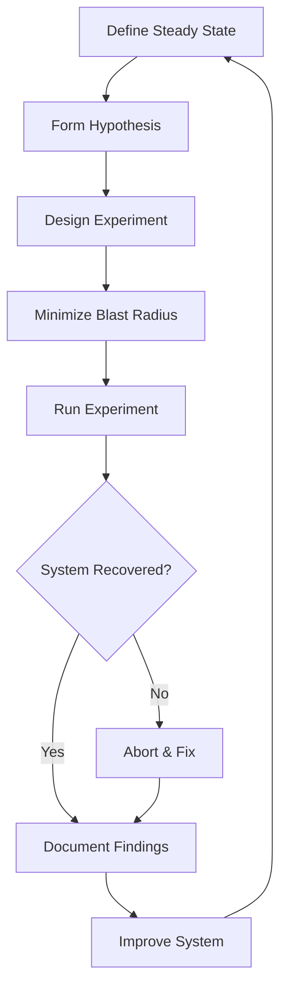
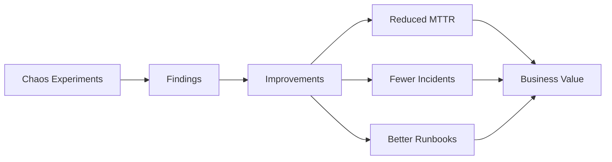

# How to Implement Chaos Experiments

Author: [nawazdhandala](https://www.github.com/nawazdhandala)

Tags: Chaos Engineering, SRE, Reliability, Testing, Resilience

Description: A practical guide to implementing chaos experiments that help you discover system weaknesses before they cause real outages.

---

## What is Chaos Engineering?

Chaos engineering is the practice of intentionally injecting failures into your systems to see how they respond. The goal is simple: find problems in a controlled environment before they find you during a real incident at 3 AM.

Netflix pioneered this approach with Chaos Monkey back in 2011. Their philosophy was straightforward - if you want to build resilient systems, you need to test them under realistic failure conditions. Random VM terminations, network partitions, and latency spikes are all fair game.

The key insight is that distributed systems fail in unexpected ways. You can write all the tests you want, but nothing beats actually killing a service and watching what happens.

---

## The Chaos Experiment Lifecycle

Before you start breaking things, you need a structured approach. Here's the workflow that works:



1. **Define Steady State**: What does "healthy" look like? Pick metrics that represent normal behavior - request latency, error rates, throughput.

2. **Form Hypothesis**: "If database primary fails, the replica should promote and requests should continue within 30 seconds."

3. **Design Experiment**: Plan exactly what you'll break and how you'll measure the impact.

4. **Minimize Blast Radius**: Start small. Test in staging first. Have kill switches ready.

5. **Run Experiment**: Execute the failure injection and observe.

6. **Analyze Results**: Did the system behave as expected? What surprised you?

7. **Improve**: Fix what broke, update runbooks, strengthen monitoring.

---

## Setting Up Your First Chaos Experiment

Let's build a simple chaos experiment framework in Python. This gives you the foundation to inject failures and measure their impact.

The following code creates a basic experiment runner that handles the lifecycle of injecting faults, monitoring the system, and collecting results.

```python
# chaos_experiment.py
# A simple chaos experiment framework for testing system resilience.
# This module provides the core abstractions for running controlled failure experiments.

import time
import random
import logging
from dataclasses import dataclass
from typing import Callable, Optional
from datetime import datetime, timedelta
from abc import ABC, abstractmethod

# Configure logging to track experiment progress
logging.basicConfig(
    level=logging.INFO,
    format='%(asctime)s - %(name)s - %(levelname)s - %(message)s'
)
logger = logging.getLogger('chaos')


@dataclass
class SteadyStateMetrics:
    """
    Captures the baseline metrics that define 'healthy' system behavior.
    These metrics are compared before and after fault injection.
    """
    latency_p99_ms: float      # 99th percentile latency in milliseconds
    error_rate_percent: float   # Percentage of requests returning errors
    throughput_rps: float       # Requests per second
    timestamp: datetime         # When these metrics were captured


@dataclass
class ExperimentResult:
    """
    Contains the complete results of a chaos experiment run.
    """
    name: str
    hypothesis: str
    started_at: datetime
    ended_at: datetime
    baseline_metrics: SteadyStateMetrics
    during_fault_metrics: SteadyStateMetrics
    recovery_metrics: SteadyStateMetrics
    success: bool
    notes: str


class FaultInjector(ABC):
    """
    Abstract base class for fault injection strategies.
    Implement this to create different types of failures.
    """

    @abstractmethod
    def inject(self) -> None:
        """Start the fault injection."""
        pass

    @abstractmethod
    def rollback(self) -> None:
        """Stop the fault and restore normal behavior."""
        pass

    @abstractmethod
    def is_active(self) -> bool:
        """Check if the fault is currently active."""
        pass


class LatencyInjector(FaultInjector):
    """
    Injects artificial latency into service calls.
    Useful for testing timeout handling and circuit breakers.
    """

    def __init__(self, target_service: str, latency_ms: int):
        self.target_service = target_service
        self.latency_ms = latency_ms
        self._active = False

    def inject(self) -> None:
        # In a real implementation, this would configure a proxy
        # or service mesh to add latency to requests
        logger.info(
            f"Injecting {self.latency_ms}ms latency to {self.target_service}"
        )
        self._active = True

    def rollback(self) -> None:
        logger.info(f"Removing latency injection from {self.target_service}")
        self._active = False

    def is_active(self) -> bool:
        return self._active


class ChaosExperiment:
    """
    Orchestrates a complete chaos experiment lifecycle.
    Handles metric collection, fault injection, and result analysis.
    """

    def __init__(
        self,
        name: str,
        hypothesis: str,
        injector: FaultInjector,
        metrics_collector: Callable[[], SteadyStateMetrics],
        steady_state_duration_sec: int = 60,
        fault_duration_sec: int = 120,
        recovery_duration_sec: int = 60
    ):
        self.name = name
        self.hypothesis = hypothesis
        self.injector = injector
        self.collect_metrics = metrics_collector
        self.steady_state_duration = steady_state_duration_sec
        self.fault_duration = fault_duration_sec
        self.recovery_duration = recovery_duration_sec

    def run(self) -> ExperimentResult:
        """
        Execute the full chaos experiment lifecycle.
        Returns detailed results including metrics from each phase.
        """
        started_at = datetime.now()

        # Phase 1: Collect baseline metrics
        logger.info(f"Starting experiment: {self.name}")
        logger.info("Phase 1: Collecting baseline metrics...")
        time.sleep(self.steady_state_duration)
        baseline = self.collect_metrics()
        logger.info(f"Baseline - Latency: {baseline.latency_p99_ms}ms, "
                   f"Errors: {baseline.error_rate_percent}%")

        # Phase 2: Inject fault and observe
        logger.info("Phase 2: Injecting fault...")
        try:
            self.injector.inject()
            time.sleep(self.fault_duration)
            during_fault = self.collect_metrics()
            logger.info(f"During fault - Latency: {during_fault.latency_p99_ms}ms, "
                       f"Errors: {during_fault.error_rate_percent}%")
        finally:
            # Always rollback, even if something goes wrong
            self.injector.rollback()

        # Phase 3: Observe recovery
        logger.info("Phase 3: Observing recovery...")
        time.sleep(self.recovery_duration)
        recovery = self.collect_metrics()
        logger.info(f"Recovery - Latency: {recovery.latency_p99_ms}ms, "
                   f"Errors: {recovery.error_rate_percent}%")

        # Analyze results
        success = self._evaluate_success(baseline, during_fault, recovery)

        return ExperimentResult(
            name=self.name,
            hypothesis=self.hypothesis,
            started_at=started_at,
            ended_at=datetime.now(),
            baseline_metrics=baseline,
            during_fault_metrics=during_fault,
            recovery_metrics=recovery,
            success=success,
            notes=self._generate_notes(baseline, during_fault, recovery)
        )

    def _evaluate_success(
        self,
        baseline: SteadyStateMetrics,
        during: SteadyStateMetrics,
        recovery: SteadyStateMetrics
    ) -> bool:
        """
        Determine if the system behaved acceptably during the experiment.
        Success means the system degraded gracefully and recovered fully.
        """
        # Check if recovery metrics are close to baseline
        latency_recovered = recovery.latency_p99_ms < baseline.latency_p99_ms * 1.5
        errors_recovered = recovery.error_rate_percent < baseline.error_rate_percent * 1.5
        throughput_recovered = recovery.throughput_rps > baseline.throughput_rps * 0.9

        # Check if degradation during fault was graceful (not catastrophic)
        graceful_degradation = during.error_rate_percent < 50.0

        return all([
            latency_recovered,
            errors_recovered,
            throughput_recovered,
            graceful_degradation
        ])

    def _generate_notes(
        self,
        baseline: SteadyStateMetrics,
        during: SteadyStateMetrics,
        recovery: SteadyStateMetrics
    ) -> str:
        """Generate human-readable notes about the experiment results."""
        notes = []

        latency_increase = (
            (during.latency_p99_ms - baseline.latency_p99_ms)
            / baseline.latency_p99_ms * 100
        )
        notes.append(f"Latency increased {latency_increase:.1f}% during fault")

        error_increase = during.error_rate_percent - baseline.error_rate_percent
        notes.append(f"Error rate increased by {error_increase:.2f} percentage points")

        recovery_time = self.recovery_duration
        notes.append(f"System observed for {recovery_time}s post-fault")

        return "; ".join(notes)
```

---

## Example: Testing Database Failover

Here's a practical example that tests whether your application handles database failover correctly.

This experiment simulates a primary database failure and verifies that the replica takes over within your defined SLO.

```python
# test_db_failover.py
# Tests database failover behavior by killing the primary and observing recovery.

import subprocess
from chaos_experiment import (
    ChaosExperiment,
    FaultInjector,
    SteadyStateMetrics,
    logger
)
from datetime import datetime


class DatabaseFailoverInjector(FaultInjector):
    """
    Simulates database primary failure by stopping the container.
    Assumes you're running PostgreSQL in Docker for this example.
    """

    def __init__(self, container_name: str = "postgres-primary"):
        self.container_name = container_name
        self._active = False

    def inject(self) -> None:
        """Stop the primary database container."""
        logger.warning(f"Stopping database container: {self.container_name}")
        subprocess.run(
            ["docker", "stop", self.container_name],
            check=True,
            capture_output=True
        )
        self._active = True

    def rollback(self) -> None:
        """Restart the database container."""
        logger.info(f"Restarting database container: {self.container_name}")
        subprocess.run(
            ["docker", "start", self.container_name],
            check=True,
            capture_output=True
        )
        self._active = False

    def is_active(self) -> bool:
        return self._active


def collect_app_metrics() -> SteadyStateMetrics:
    """
    Collect current application metrics from your monitoring system.
    In production, this would query Prometheus, Datadog, or OneUptime.
    """
    # Example: Query your metrics endpoint
    # This is a simplified example - replace with real metric collection
    import requests

    try:
        # Query your application's metrics endpoint
        response = requests.get(
            "http://localhost:8080/metrics",
            timeout=5
        )
        metrics = response.json()

        return SteadyStateMetrics(
            latency_p99_ms=metrics.get("http_request_duration_p99", 100),
            error_rate_percent=metrics.get("http_error_rate", 0.1),
            throughput_rps=metrics.get("http_requests_per_second", 1000),
            timestamp=datetime.now()
        )
    except Exception as e:
        logger.error(f"Failed to collect metrics: {e}")
        # Return worst-case metrics if collection fails
        return SteadyStateMetrics(
            latency_p99_ms=9999,
            error_rate_percent=100,
            throughput_rps=0,
            timestamp=datetime.now()
        )


def run_database_failover_experiment():
    """
    Execute the database failover chaos experiment.
    Validates that application handles primary DB failure gracefully.
    """
    experiment = ChaosExperiment(
        name="database-primary-failover",
        hypothesis=(
            "When the primary database fails, the application should "
            "failover to replica within 30 seconds with less than 5% "
            "error rate increase"
        ),
        injector=DatabaseFailoverInjector("postgres-primary"),
        metrics_collector=collect_app_metrics,
        steady_state_duration_sec=30,  # Baseline observation period
        fault_duration_sec=60,          # How long to keep DB down
        recovery_duration_sec=30        # Post-recovery observation
    )

    result = experiment.run()

    # Print results summary
    print("\n" + "=" * 60)
    print(f"Experiment: {result.name}")
    print(f"Hypothesis: {result.hypothesis}")
    print(f"Result: {'PASSED' if result.success else 'FAILED'}")
    print(f"Duration: {result.ended_at - result.started_at}")
    print(f"Notes: {result.notes}")
    print("=" * 60)

    return result


if __name__ == "__main__":
    run_database_failover_experiment()
```

---

## Network Chaos Experiments

Network failures are common in distributed systems. Here's how to inject network chaos using Linux traffic control (tc).

This injector lets you simulate network latency, packet loss, and bandwidth constraints between services.

```python
# network_chaos.py
# Network fault injection using Linux traffic control (tc).
# Requires root/sudo access to modify network interfaces.

import subprocess
import shlex
from chaos_experiment import FaultInjector, logger


class NetworkChaosInjector(FaultInjector):
    """
    Injects network faults using Linux tc (traffic control).
    Supports latency, packet loss, and bandwidth limiting.
    """

    def __init__(
        self,
        interface: str = "eth0",
        latency_ms: int = 0,
        jitter_ms: int = 0,
        packet_loss_percent: float = 0,
        bandwidth_kbps: int = 0,
        target_ip: str = None
    ):
        """
        Configure network chaos parameters.

        Args:
            interface: Network interface to apply rules to
            latency_ms: Added latency in milliseconds
            jitter_ms: Latency variation (randomness)
            packet_loss_percent: Percentage of packets to drop
            bandwidth_kbps: Bandwidth limit in kilobits per second
            target_ip: Optional IP to target (None = all traffic)
        """
        self.interface = interface
        self.latency_ms = latency_ms
        self.jitter_ms = jitter_ms
        self.packet_loss_percent = packet_loss_percent
        self.bandwidth_kbps = bandwidth_kbps
        self.target_ip = target_ip
        self._active = False

    def inject(self) -> None:
        """Apply network chaos rules using tc."""
        # Build the tc command based on configured parameters
        # Using netem (network emulator) qdisc

        netem_opts = []

        if self.latency_ms > 0:
            if self.jitter_ms > 0:
                netem_opts.append(
                    f"delay {self.latency_ms}ms {self.jitter_ms}ms"
                )
            else:
                netem_opts.append(f"delay {self.latency_ms}ms")

        if self.packet_loss_percent > 0:
            netem_opts.append(f"loss {self.packet_loss_percent}%")

        if not netem_opts:
            logger.warning("No network chaos parameters configured")
            return

        netem_config = " ".join(netem_opts)

        # Clear any existing rules first
        self._clear_rules()

        # Apply new rules
        cmd = f"tc qdisc add dev {self.interface} root netem {netem_config}"
        logger.info(f"Applying network chaos: {cmd}")

        try:
            subprocess.run(
                shlex.split(cmd),
                check=True,
                capture_output=True
            )
            self._active = True
            logger.info(
                f"Network chaos active: {self.latency_ms}ms latency, "
                f"{self.packet_loss_percent}% loss"
            )
        except subprocess.CalledProcessError as e:
            logger.error(f"Failed to apply network chaos: {e.stderr}")
            raise

    def rollback(self) -> None:
        """Remove all tc rules from the interface."""
        self._clear_rules()
        self._active = False
        logger.info(f"Network chaos removed from {self.interface}")

    def _clear_rules(self) -> None:
        """Clear existing tc rules, ignoring errors if none exist."""
        cmd = f"tc qdisc del dev {self.interface} root"
        try:
            subprocess.run(
                shlex.split(cmd),
                check=False,  # Don't fail if no rules exist
                capture_output=True
            )
        except Exception:
            pass  # Ignore errors when clearing

    def is_active(self) -> bool:
        return self._active


# Pre-configured chaos scenarios for common failure patterns
def create_slow_network(interface: str = "eth0") -> NetworkChaosInjector:
    """
    Simulates a slow network connection.
    Useful for testing timeout handling.
    """
    return NetworkChaosInjector(
        interface=interface,
        latency_ms=500,
        jitter_ms=100
    )


def create_lossy_network(interface: str = "eth0") -> NetworkChaosInjector:
    """
    Simulates an unreliable network with packet loss.
    Useful for testing retry logic.
    """
    return NetworkChaosInjector(
        interface=interface,
        packet_loss_percent=10
    )


def create_flaky_network(interface: str = "eth0") -> NetworkChaosInjector:
    """
    Simulates a flaky network with both latency and packet loss.
    Represents real-world degraded network conditions.
    """
    return NetworkChaosInjector(
        interface=interface,
        latency_ms=200,
        jitter_ms=50,
        packet_loss_percent=5
    )
```

---

## Kubernetes Chaos with Pod Termination

If you're running on Kubernetes, here's how to implement pod-level chaos experiments.

This injector randomly terminates pods to verify your deployments handle failures gracefully.

```python
# kubernetes_chaos.py
# Chaos experiments for Kubernetes workloads.
# Uses the official Kubernetes Python client.

from kubernetes import client, config
from kubernetes.client.rest import ApiException
import random
import time
from chaos_experiment import FaultInjector, logger


class PodTerminationInjector(FaultInjector):
    """
    Randomly terminates pods matching a label selector.
    Simulates node failures or OOM kills in production.
    """

    def __init__(
        self,
        namespace: str,
        label_selector: str,
        kill_count: int = 1,
        grace_period_seconds: int = 0
    ):
        """
        Configure pod termination chaos.

        Args:
            namespace: Kubernetes namespace to target
            label_selector: Label selector to find target pods
            kill_count: Number of pods to terminate
            grace_period_seconds: Grace period before force kill
        """
        self.namespace = namespace
        self.label_selector = label_selector
        self.kill_count = kill_count
        self.grace_period = grace_period_seconds
        self._killed_pods = []
        self._active = False

        # Load kubeconfig (in-cluster or from file)
        try:
            config.load_incluster_config()
        except config.ConfigException:
            config.load_kube_config()

        self.v1 = client.CoreV1Api()

    def inject(self) -> None:
        """Terminate random pods matching the selector."""
        # Find matching pods
        pods = self.v1.list_namespaced_pod(
            namespace=self.namespace,
            label_selector=self.label_selector
        )

        running_pods = [
            p for p in pods.items
            if p.status.phase == "Running"
        ]

        if not running_pods:
            logger.warning(
                f"No running pods found matching {self.label_selector}"
            )
            return

        # Select random pods to kill
        targets = random.sample(
            running_pods,
            min(self.kill_count, len(running_pods))
        )

        self._killed_pods = []
        for pod in targets:
            pod_name = pod.metadata.name
            logger.warning(
                f"Terminating pod: {pod_name} in {self.namespace}"
            )

            try:
                self.v1.delete_namespaced_pod(
                    name=pod_name,
                    namespace=self.namespace,
                    grace_period_seconds=self.grace_period
                )
                self._killed_pods.append(pod_name)
            except ApiException as e:
                logger.error(f"Failed to terminate {pod_name}: {e}")

        self._active = True
        logger.info(f"Terminated {len(self._killed_pods)} pods")

    def rollback(self) -> None:
        """
        For pod termination, rollback means waiting for replacements.
        Kubernetes will automatically recreate pods via the Deployment.
        """
        if not self._killed_pods:
            return

        logger.info("Waiting for pod replacements to be ready...")

        # Wait for the deployment to stabilize
        max_wait = 120  # seconds
        start = time.time()

        while time.time() - start < max_wait:
            pods = self.v1.list_namespaced_pod(
                namespace=self.namespace,
                label_selector=self.label_selector
            )

            running = [
                p for p in pods.items
                if p.status.phase == "Running"
                and all(
                    c.ready for c in p.status.container_statuses or []
                )
            ]

            if len(running) >= self.kill_count:
                logger.info(
                    f"Replacement pods ready: {len(running)} running"
                )
                break

            time.sleep(5)

        self._killed_pods = []
        self._active = False

    def is_active(self) -> bool:
        return self._active


class ResourceExhaustionInjector(FaultInjector):
    """
    Deploys a stress pod to consume CPU or memory.
    Tests resource limits and eviction behavior.
    """

    def __init__(
        self,
        namespace: str,
        cpu_cores: int = 0,
        memory_mb: int = 0
    ):
        self.namespace = namespace
        self.cpu_cores = cpu_cores
        self.memory_mb = memory_mb
        self._stress_pod_name = "chaos-stress-pod"
        self._active = False

        try:
            config.load_incluster_config()
        except config.ConfigException:
            config.load_kube_config()

        self.v1 = client.CoreV1Api()

    def inject(self) -> None:
        """Deploy a stress pod to exhaust resources."""
        # Build stress command based on configuration
        stress_args = ["stress"]

        if self.cpu_cores > 0:
            stress_args.extend(["--cpu", str(self.cpu_cores)])

        if self.memory_mb > 0:
            stress_args.extend([
                "--vm", "1",
                "--vm-bytes", f"{self.memory_mb}M"
            ])

        stress_args.extend(["--timeout", "3600s"])

        # Create the stress pod
        pod = client.V1Pod(
            metadata=client.V1ObjectMeta(
                name=self._stress_pod_name,
                labels={"app": "chaos-stress", "chaos": "true"}
            ),
            spec=client.V1PodSpec(
                containers=[
                    client.V1Container(
                        name="stress",
                        image="progrium/stress",
                        args=stress_args[1:],  # stress is the entrypoint
                        resources=client.V1ResourceRequirements(
                            requests={
                                "cpu": f"{self.cpu_cores}",
                                "memory": f"{self.memory_mb}Mi"
                            },
                            limits={
                                "cpu": f"{self.cpu_cores}",
                                "memory": f"{self.memory_mb}Mi"
                            }
                        )
                    )
                ],
                restart_policy="Never"
            )
        )

        logger.warning(
            f"Deploying stress pod: {self.cpu_cores} CPUs, "
            f"{self.memory_mb}MB memory"
        )

        try:
            self.v1.create_namespaced_pod(
                namespace=self.namespace,
                body=pod
            )
            self._active = True
        except ApiException as e:
            logger.error(f"Failed to create stress pod: {e}")
            raise

    def rollback(self) -> None:
        """Delete the stress pod."""
        try:
            self.v1.delete_namespaced_pod(
                name=self._stress_pod_name,
                namespace=self.namespace,
                grace_period_seconds=0
            )
            logger.info("Stress pod deleted")
        except ApiException as e:
            if e.status != 404:  # Ignore if already deleted
                logger.error(f"Failed to delete stress pod: {e}")

        self._active = False

    def is_active(self) -> bool:
        return self._active
```

---

## Chaos Experiment Safety Checklist

Before running any chaos experiment, go through this checklist:

| Check | Description |
|-------|-------------|
| Hypothesis documented | You have a clear, testable statement about expected behavior |
| Blast radius limited | Start with non-production, then staging, then production with safeguards |
| Kill switch ready | You can stop the experiment immediately if things go wrong |
| Monitoring in place | Dashboards and alerts are active to observe impact |
| Stakeholders notified | Relevant teams know an experiment is running |
| Rollback tested | You've verified the rollback procedure works |
| Time-bounded | The experiment has a maximum duration |
| Business hours | Run during work hours when people can respond |

---

## Automating Chaos with a Scheduler

Once you're comfortable with manual experiments, automate them. Here's a simple scheduler that runs experiments on a schedule.

This scheduler integrates with your experiment framework to run tests regularly and track results over time.

```python
# chaos_scheduler.py
# Automated chaos experiment scheduler with result tracking.

import schedule
import time
import json
from datetime import datetime
from pathlib import Path
from typing import List, Dict, Any
from dataclasses import asdict
from chaos_experiment import ChaosExperiment, ExperimentResult, logger


class ChaosScheduler:
    """
    Schedules and runs chaos experiments automatically.
    Stores results for historical analysis.
    """

    def __init__(self, results_dir: str = "./chaos_results"):
        self.experiments: Dict[str, ChaosExperiment] = {}
        self.results_dir = Path(results_dir)
        self.results_dir.mkdir(parents=True, exist_ok=True)

    def register_experiment(
        self,
        experiment: ChaosExperiment,
        schedule_expression: str
    ) -> None:
        """
        Register an experiment to run on a schedule.

        Args:
            experiment: The chaos experiment to run
            schedule_expression: Cron-like schedule (e.g., "daily", "weekly")
        """
        self.experiments[experiment.name] = experiment

        # Set up the schedule based on expression
        if schedule_expression == "daily":
            schedule.every().day.at("10:00").do(
                self._run_experiment, experiment.name
            )
        elif schedule_expression == "weekly":
            schedule.every().wednesday.at("14:00").do(
                self._run_experiment, experiment.name
            )
        elif schedule_expression == "hourly":
            schedule.every().hour.do(
                self._run_experiment, experiment.name
            )

        logger.info(
            f"Registered experiment '{experiment.name}' "
            f"to run {schedule_expression}"
        )

    def _run_experiment(self, name: str) -> None:
        """Execute a registered experiment and store results."""
        experiment = self.experiments.get(name)
        if not experiment:
            logger.error(f"Experiment '{name}' not found")
            return

        logger.info(f"Starting scheduled experiment: {name}")

        try:
            result = experiment.run()
            self._store_result(result)
            self._notify_result(result)
        except Exception as e:
            logger.error(f"Experiment '{name}' failed with error: {e}")
            self._send_alert(name, str(e))

    def _store_result(self, result: ExperimentResult) -> None:
        """Save experiment result to JSON file."""
        filename = (
            f"{result.name}_"
            f"{result.started_at.strftime('%Y%m%d_%H%M%S')}.json"
        )
        filepath = self.results_dir / filename

        # Convert dataclass to dict for JSON serialization
        result_dict = {
            "name": result.name,
            "hypothesis": result.hypothesis,
            "started_at": result.started_at.isoformat(),
            "ended_at": result.ended_at.isoformat(),
            "success": result.success,
            "notes": result.notes,
            "baseline_metrics": {
                "latency_p99_ms": result.baseline_metrics.latency_p99_ms,
                "error_rate_percent": result.baseline_metrics.error_rate_percent,
                "throughput_rps": result.baseline_metrics.throughput_rps
            },
            "during_fault_metrics": {
                "latency_p99_ms": result.during_fault_metrics.latency_p99_ms,
                "error_rate_percent": result.during_fault_metrics.error_rate_percent,
                "throughput_rps": result.during_fault_metrics.throughput_rps
            },
            "recovery_metrics": {
                "latency_p99_ms": result.recovery_metrics.latency_p99_ms,
                "error_rate_percent": result.recovery_metrics.error_rate_percent,
                "throughput_rps": result.recovery_metrics.throughput_rps
            }
        }

        with open(filepath, 'w') as f:
            json.dump(result_dict, f, indent=2)

        logger.info(f"Result stored: {filepath}")

    def _notify_result(self, result: ExperimentResult) -> None:
        """Send notification about experiment result."""
        status = "PASSED" if result.success else "FAILED"
        message = (
            f"Chaos Experiment {status}: {result.name}\n"
            f"Hypothesis: {result.hypothesis}\n"
            f"Notes: {result.notes}"
        )

        # In production, send to Slack, PagerDuty, or your alerting system
        logger.info(f"Notification: {message}")

    def _send_alert(self, name: str, error: str) -> None:
        """Send alert when experiment fails to execute."""
        logger.error(f"ALERT: Chaos experiment '{name}' execution failed: {error}")
        # Integrate with your alerting system here

    def get_history(
        self,
        experiment_name: str,
        limit: int = 10
    ) -> List[Dict[str, Any]]:
        """Retrieve historical results for an experiment."""
        results = []

        for filepath in sorted(
            self.results_dir.glob(f"{experiment_name}_*.json"),
            reverse=True
        )[:limit]:
            with open(filepath) as f:
                results.append(json.load(f))

        return results

    def run_forever(self) -> None:
        """Start the scheduler loop."""
        logger.info("Chaos scheduler started")
        while True:
            schedule.run_pending()
            time.sleep(60)
```

---

## Measuring Chaos Experiment Effectiveness

Track these metrics to measure the value of your chaos program:



**Key metrics to track:**

1. **Experiments per month**: Are you running enough tests?
2. **Findings per experiment**: Are experiments revealing real issues?
3. **Time to remediation**: How fast do you fix discovered problems?
4. **Incident correlation**: Do fewer incidents occur after chaos programs?
5. **MTTR improvement**: Is mean time to recovery decreasing?

---

## Common Failure Scenarios to Test

Here are the most valuable chaos experiments to run, organized by category:

### Infrastructure Failures
- Kill a random instance/pod
- Exhaust CPU on a node
- Fill disk to capacity
- Corrupt DNS responses

### Network Failures
- Add latency between services
- Drop packets randomly
- Partition network segments
- Simulate region failover

### Dependency Failures
- Kill database primary
- Make cache unavailable
- Slow down external API responses
- Revoke authentication tokens

### Application Failures
- Return errors from downstream services
- Inject malformed responses
- Exceed rate limits
- Trigger circuit breakers

---

## Integrating with Existing Tools

Several mature chaos engineering tools can complement your custom experiments:

| Tool | Best For | Notes |
|------|----------|-------|
| Chaos Monkey | Random instance termination | Netflix original, AWS-focused |
| Litmus Chaos | Kubernetes-native chaos | CNCF project, great operator support |
| Chaos Mesh | Kubernetes, comprehensive | Strong UI, good time controls |
| Gremlin | Enterprise, SaaS | Managed service, broad coverage |
| Toxiproxy | Network chaos | Simple proxy for dev/test |

---

## Building a Chaos Culture

Technical implementation is only half the battle. Building a culture where chaos experiments are welcomed requires:

1. **Start small**: Run your first experiment on a non-critical service
2. **Celebrate findings**: Treat discovered weaknesses as wins, not failures
3. **Share results**: Present chaos findings in team meetings
4. **Include everyone**: Let developers run experiments on their services
5. **Game days**: Run larger, cross-team chaos exercises quarterly

---

## Conclusion

Chaos engineering transforms how you think about reliability. Instead of hoping your systems handle failures, you know they do because you've tested them.

Start with these steps:
1. Pick one critical service
2. Define what "healthy" looks like with metrics
3. Form a hypothesis about a failure scenario
4. Run a controlled experiment
5. Fix what you find
6. Repeat

The goal isn't to break things for fun. It's to build confidence in your systems by proving they can handle the chaos that production will inevitably throw at them.

---

*Ready to track the impact of your chaos experiments? OneUptime provides the observability foundation you need - unified metrics, traces, and logs that show exactly how your systems respond to injected failures. Combined with incident management and SLO tracking, you can measure the real value of your chaos engineering program. Get started at [oneuptime.com](https://oneuptime.com).*
