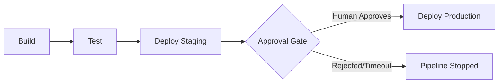
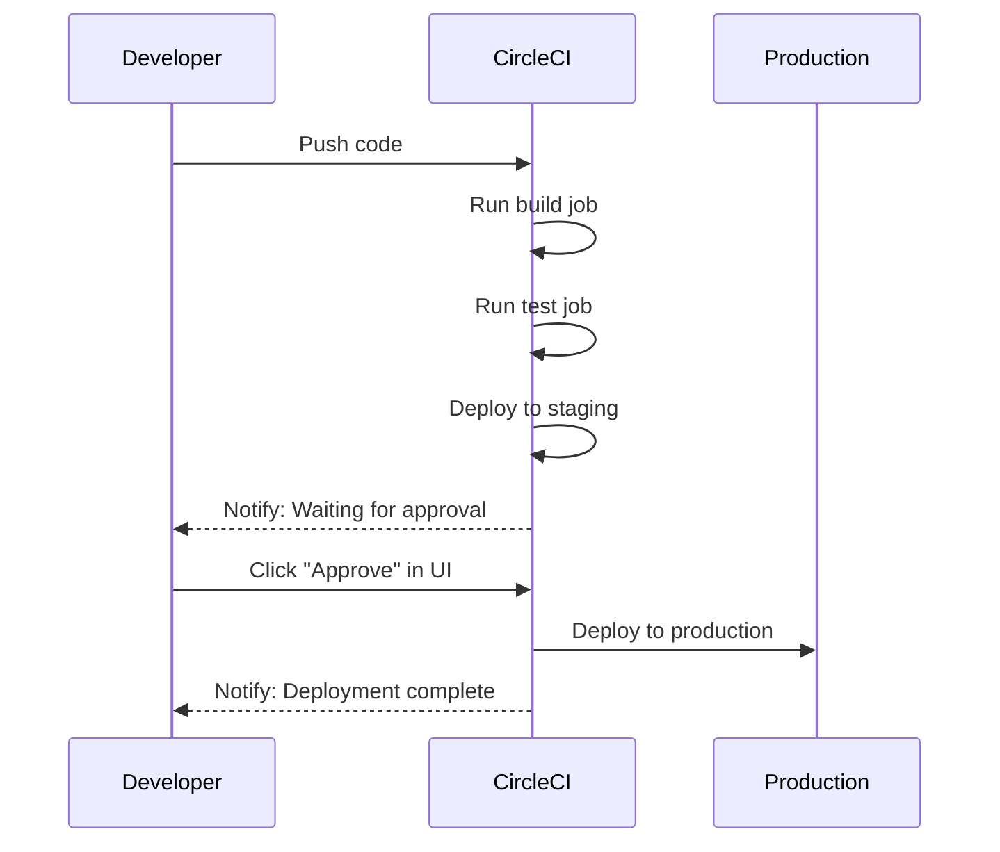
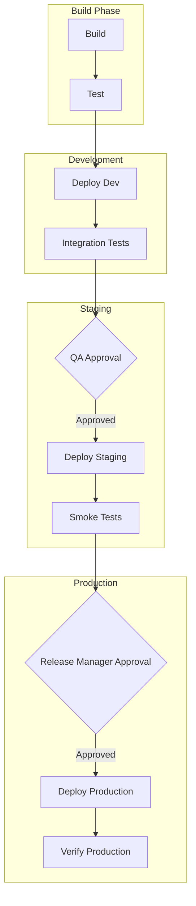
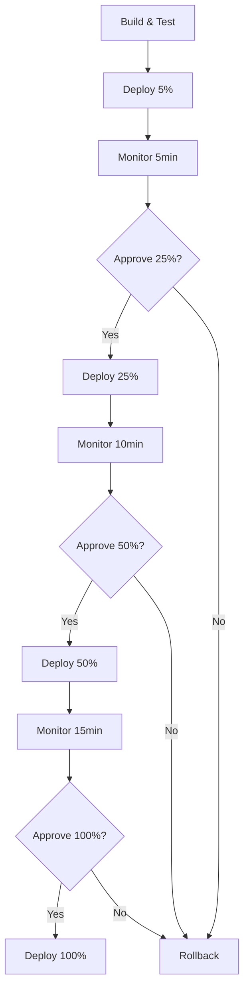

# How to Implement CircleCI Approval Jobs

Author: [nawazdhandala](https://www.github.com/nawazdhandala)

Tags: CircleCI, CI/CD, Approval Jobs, DevOps, Workflows, Deployment Safety

Description: A practical guide to implementing CircleCI approval jobs for production deployments. Covers manual approval gates, conditional approvals, multi-stage pipelines, Slack integration, and best practices for safe deployment workflows.

---

Production deployments deserve human oversight. CircleCI approval jobs let you add manual checkpoints to your pipelines, ensuring that critical deployments only proceed after explicit human authorization. Whether you need to pause before a production release, require sign-off from a team lead, or implement multi-stage approval workflows, approval jobs give you the control you need.

## Understanding Approval Jobs

An approval job is a special job type in CircleCI that pauses workflow execution until someone manually approves it through the CircleCI UI or API. Unlike regular jobs that run automatically, approval jobs act as gates that require human intervention.



The key characteristics of approval jobs:

1. **No Executor Required** - Approval jobs do not run any code or consume compute resources
2. **Indefinite Wait** - By default, approval jobs wait indefinitely until someone takes action
3. **Explicit Authorization** - Only team members with appropriate permissions can approve
4. **Audit Trail** - CircleCI records who approved and when for compliance purposes

## Your First Approval Job

Adding an approval job to your workflow requires only a few lines of configuration. The following example demonstrates a basic deployment pipeline with a manual approval gate before production.

```yaml
# .circleci/config.yml
# Version 2.1 enables workflow features and modern syntax
version: 2.1

jobs:
  # Build job compiles and packages the application
  build:
    docker:
      - image: cimg/node:20.10
    steps:
      - checkout
      - run:
          name: Install dependencies
          command: npm ci
      - run:
          name: Build application
          command: npm run build
      - persist_to_workspace:
          root: .
          paths:
            - dist
            - node_modules

  # Test job validates the build
  test:
    docker:
      - image: cimg/node:20.10
    steps:
      - checkout
      - attach_workspace:
          at: .
      - run:
          name: Execute test suite
          command: npm test

  # Deploy staging for pre-production verification
  deploy-staging:
    docker:
      - image: cimg/node:20.10
    steps:
      - attach_workspace:
          at: .
      - run:
          name: Deploy to staging environment
          command: |
            echo "Deploying to staging..."
            # Add your staging deployment commands here
            ./deploy.sh staging

  # Deploy production after approval
  deploy-production:
    docker:
      - image: cimg/node:20.10
    steps:
      - attach_workspace:
          at: .
      - run:
          name: Deploy to production environment
          command: |
            echo "Deploying to production..."
            # Add your production deployment commands here
            ./deploy.sh production

workflows:
  # Main deployment workflow with approval gate
  build-test-deploy:
    jobs:
      - build
      - test:
          requires:
            - build
      - deploy-staging:
          requires:
            - test
      # Approval job requires type: approval
      # No other configuration is needed for basic usage
      - hold-for-production:
          type: approval
          requires:
            - deploy-staging
      # Production deployment waits for approval
      - deploy-production:
          requires:
            - hold-for-production
```

When you push code with this configuration, the pipeline runs build, test, and deploy-staging automatically. After staging deployment completes, the workflow pauses at the `hold-for-production` job and waits for manual approval.

## Approving Jobs in the CircleCI UI

Once your workflow reaches an approval job, you can approve it through several methods.

### Using the CircleCI Web Interface

Navigate to your project in CircleCI and find the waiting workflow. The approval job appears with a "Hold" status and a distinct icon indicating it requires human action.



To approve a job:

1. Open the CircleCI dashboard
2. Navigate to your project's Pipelines
3. Find the workflow with the pending approval
4. Click on the approval job
5. Click the "Approve" button

### Using the CircleCI API

For automation scenarios, you can approve jobs programmatically using the CircleCI API.

The following script demonstrates how to approve a job using curl and the CircleCI API v2.

```bash
#!/bin/bash
# Script to approve a CircleCI workflow job via API
# Requires CIRCLECI_TOKEN environment variable

# Configuration - replace with your values
WORKFLOW_ID="your-workflow-id"
APPROVAL_JOB_ID="your-approval-job-id"

# Approve the job using CircleCI API v2
curl --request POST \
  --url "https://circleci.com/api/v2/workflow/${WORKFLOW_ID}/approve/${APPROVAL_JOB_ID}" \
  --header "Circle-Token: ${CIRCLECI_TOKEN}" \
  --header "Content-Type: application/json"

echo "Approval request sent for workflow: ${WORKFLOW_ID}"
```

### Using the CircleCI CLI

If you have the CircleCI CLI installed, approving jobs becomes straightforward from your terminal.

```bash
# Install CircleCI CLI if not already installed
brew install circleci

# Authenticate with your token
circleci setup

# List workflows for your project to find the workflow ID
circleci workflow list --project-slug gh/your-org/your-repo

# Approve a specific job in a workflow
circleci workflow approve \
  --workflow-id <workflow-id> \
  --job-id <approval-job-id>
```

## Multi-Stage Approval Workflows

Complex deployment pipelines often require multiple approval gates. You might need one approval for staging promotion, another for production, and perhaps a final sign-off for customer-facing features.

The following configuration implements a three-stage approval workflow with different teams approving at each stage.

```yaml
version: 2.1

jobs:
  build:
    docker:
      - image: cimg/node:20.10
    steps:
      - checkout
      - run: npm ci && npm run build
      - persist_to_workspace:
          root: .
          paths: [dist, node_modules]

  test:
    docker:
      - image: cimg/node:20.10
    steps:
      - checkout
      - attach_workspace:
          at: .
      - run: npm test

  deploy-dev:
    docker:
      - image: cimg/node:20.10
    steps:
      - attach_workspace:
          at: .
      - run:
          name: Deploy to development
          command: ./deploy.sh development

  integration-tests:
    docker:
      - image: cimg/node:20.10
    steps:
      - checkout
      - run:
          name: Run integration test suite
          command: npm run test:integration

  deploy-staging:
    docker:
      - image: cimg/node:20.10
    steps:
      - attach_workspace:
          at: .
      - run:
          name: Deploy to staging
          command: ./deploy.sh staging

  smoke-tests:
    docker:
      - image: cimg/node:20.10
    steps:
      - checkout
      - run:
          name: Run smoke tests against staging
          command: npm run test:smoke

  deploy-production:
    docker:
      - image: cimg/node:20.10
    steps:
      - attach_workspace:
          at: .
      - run:
          name: Deploy to production
          command: ./deploy.sh production

  verify-production:
    docker:
      - image: cimg/node:20.10
    steps:
      - checkout
      - run:
          name: Verify production deployment
          command: npm run verify:production

workflows:
  # Multi-stage deployment with multiple approval gates
  full-deployment-pipeline:
    jobs:
      # Initial build and test phase
      - build
      - test:
          requires:
            - build

      # Development deployment - automatic
      - deploy-dev:
          requires:
            - test

      # Integration testing on dev environment
      - integration-tests:
          requires:
            - deploy-dev

      # First approval gate - QA team promotes to staging
      - approve-staging:
          type: approval
          requires:
            - integration-tests

      # Staging deployment after QA approval
      - deploy-staging:
          requires:
            - approve-staging

      # Smoke tests verify staging deployment
      - smoke-tests:
          requires:
            - deploy-staging

      # Second approval gate - Release manager approves production
      - approve-production:
          type: approval
          requires:
            - smoke-tests

      # Production deployment after release manager approval
      - deploy-production:
          requires:
            - approve-production

      # Verify production deployment
      - verify-production:
          requires:
            - deploy-production
```



## Branch-Specific Approval Jobs

Not every branch needs the same approval requirements. Feature branches might deploy directly to development, while main branch deployments require approval for production.

The following configuration applies approval gates only to specific branches.

```yaml
version: 2.1

jobs:
  build:
    docker:
      - image: cimg/node:20.10
    steps:
      - checkout
      - run: npm ci && npm run build
      - persist_to_workspace:
          root: .
          paths: [dist, node_modules]

  test:
    docker:
      - image: cimg/node:20.10
    steps:
      - checkout
      - attach_workspace:
          at: .
      - run: npm test

  deploy-staging:
    docker:
      - image: cimg/node:20.10
    steps:
      - attach_workspace:
          at: .
      - run: ./deploy.sh staging

  deploy-production:
    docker:
      - image: cimg/node:20.10
    steps:
      - attach_workspace:
          at: .
      - run: ./deploy.sh production

workflows:
  # Workflow applies different rules based on branch
  branch-aware-deployment:
    jobs:
      # Build and test run on all branches
      - build
      - test:
          requires:
            - build

      # Staging deployment for develop and main branches
      - deploy-staging:
          requires:
            - test
          filters:
            branches:
              only:
                - develop
                - main

      # Approval gate only for main branch production deployments
      - hold-production:
          type: approval
          requires:
            - deploy-staging
          filters:
            branches:
              only: main

      # Production deployment only from main branch after approval
      - deploy-production:
          requires:
            - hold-production
          filters:
            branches:
              only: main
```

## Conditional Approvals with Pipeline Parameters

Sometimes you want to skip approval in specific situations, like hotfix deployments or automated releases. Pipeline parameters enable conditional approval requirements.

The following configuration allows bypassing approval when triggered with a skip parameter.

```yaml
version: 2.1

# Pipeline parameters allow external control of workflow behavior
parameters:
  skip-approval:
    type: boolean
    default: false
    description: "Set to true for hotfix deployments that skip approval"
  deployment-type:
    type: enum
    enum: ["standard", "hotfix", "rollback"]
    default: "standard"

jobs:
  build:
    docker:
      - image: cimg/node:20.10
    steps:
      - checkout
      - run: npm ci && npm run build
      - persist_to_workspace:
          root: .
          paths: [dist, node_modules]

  test:
    docker:
      - image: cimg/node:20.10
    steps:
      - checkout
      - attach_workspace:
          at: .
      - run: npm test

  deploy-staging:
    docker:
      - image: cimg/node:20.10
    steps:
      - attach_workspace:
          at: .
      - run: ./deploy.sh staging

  deploy-production:
    docker:
      - image: cimg/node:20.10
    steps:
      - attach_workspace:
          at: .
      - run:
          name: Deploy to production
          command: |
            echo "Deployment type: << pipeline.parameters.deployment-type >>"
            ./deploy.sh production

workflows:
  # Standard workflow with approval gate
  standard-deployment:
    # Only run when skip-approval is false
    when:
      not: << pipeline.parameters.skip-approval >>
    jobs:
      - build
      - test:
          requires:
            - build
      - deploy-staging:
          requires:
            - test
          filters:
            branches:
              only: main
      - approve-production:
          type: approval
          requires:
            - deploy-staging
      - deploy-production:
          requires:
            - approve-production

  # Hotfix workflow without approval gate
  hotfix-deployment:
    # Only run when skip-approval is true
    when: << pipeline.parameters.skip-approval >>
    jobs:
      - build
      - test:
          requires:
            - build
      - deploy-staging:
          requires:
            - test
      - deploy-production:
          requires:
            - deploy-staging
```

To trigger a hotfix deployment that skips approval, use the CircleCI API.

```bash
#!/bin/bash
# Trigger a hotfix deployment that bypasses approval

curl --request POST \
  --url "https://circleci.com/api/v2/project/gh/your-org/your-repo/pipeline" \
  --header "Circle-Token: ${CIRCLECI_TOKEN}" \
  --header "Content-Type: application/json" \
  --data '{
    "branch": "main",
    "parameters": {
      "skip-approval": true,
      "deployment-type": "hotfix"
    }
  }'
```

## Approval Notifications with Slack

Waiting for approval without notification leads to delays. Integrating Slack notifications ensures the right people know when approval is needed.

The following configuration uses the CircleCI Slack orb to send notifications at key workflow stages.

```yaml
version: 2.1

# Import the official Slack orb for notifications
orbs:
  slack: circleci/slack@4.12.5

jobs:
  build:
    docker:
      - image: cimg/node:20.10
    steps:
      - checkout
      - run: npm ci && npm run build
      - persist_to_workspace:
          root: .
          paths: [dist, node_modules]

  test:
    docker:
      - image: cimg/node:20.10
    steps:
      - checkout
      - attach_workspace:
          at: .
      - run: npm test

  deploy-staging:
    docker:
      - image: cimg/node:20.10
    steps:
      - attach_workspace:
          at: .
      - run: ./deploy.sh staging

  # Notify team that approval is needed
  notify-approval-needed:
    docker:
      - image: cimg/base:stable
    steps:
      - slack/notify:
          channel: deployments
          event: pass
          custom: |
            {
              "blocks": [
                {
                  "type": "header",
                  "text": {
                    "type": "plain_text",
                    "text": "Production Deployment Awaiting Approval"
                  }
                },
                {
                  "type": "section",
                  "fields": [
                    {
                      "type": "mrkdwn",
                      "text": "*Project:*\n${CIRCLE_PROJECT_REPONAME}"
                    },
                    {
                      "type": "mrkdwn",
                      "text": "*Branch:*\n${CIRCLE_BRANCH}"
                    },
                    {
                      "type": "mrkdwn",
                      "text": "*Author:*\n${CIRCLE_USERNAME}"
                    },
                    {
                      "type": "mrkdwn",
                      "text": "*Commit:*\n${CIRCLE_SHA1:0:7}"
                    }
                  ]
                },
                {
                  "type": "actions",
                  "elements": [
                    {
                      "type": "button",
                      "text": {
                        "type": "plain_text",
                        "text": "View Workflow"
                      },
                      "url": "https://app.circleci.com/pipelines/workflows/${CIRCLE_WORKFLOW_ID}"
                    }
                  ]
                }
              ]
            }

  deploy-production:
    docker:
      - image: cimg/node:20.10
    steps:
      - attach_workspace:
          at: .
      - run: ./deploy.sh production
      # Notify on successful deployment
      - slack/notify:
          channel: deployments
          event: pass
          template: success_tagged_deploy_1

workflows:
  deployment-with-notifications:
    jobs:
      - build
      - test:
          requires:
            - build
      - deploy-staging:
          requires:
            - test
          filters:
            branches:
              only: main

      # Send notification before approval gate
      - notify-approval-needed:
          requires:
            - deploy-staging
          filters:
            branches:
              only: main

      # Approval gate
      - hold-production:
          type: approval
          requires:
            - notify-approval-needed

      # Deploy after approval
      - deploy-production:
          requires:
            - hold-production
          context:
            - slack-secrets
```

## Using Contexts for Approval Security

CircleCI contexts allow you to restrict who can approve deployments based on team membership. By placing approval-dependent jobs in a context with restricted access, you ensure only authorized personnel can trigger production deployments.

The following configuration demonstrates using contexts to secure the deployment process.

```yaml
version: 2.1

jobs:
  build:
    docker:
      - image: cimg/node:20.10
    steps:
      - checkout
      - run: npm ci && npm run build
      - persist_to_workspace:
          root: .
          paths: [dist, node_modules]

  test:
    docker:
      - image: cimg/node:20.10
    steps:
      - checkout
      - attach_workspace:
          at: .
      - run: npm test

  deploy-staging:
    docker:
      - image: cimg/node:20.10
    steps:
      - attach_workspace:
          at: .
      - run: ./deploy.sh staging

  deploy-production:
    docker:
      - image: cimg/node:20.10
    steps:
      - attach_workspace:
          at: .
      - run:
          name: Deploy to production with credentials from context
          command: |
            # AWS_ACCESS_KEY_ID and AWS_SECRET_ACCESS_KEY come from context
            ./deploy.sh production

workflows:
  secure-deployment:
    jobs:
      - build
      - test:
          requires:
            - build

      # Staging uses staging context
      - deploy-staging:
          requires:
            - test
          context:
            - staging-aws-credentials
          filters:
            branches:
              only: main

      # Approval job - only users with access to production-aws-credentials
      # context can approve and trigger production deployment
      - hold-production:
          type: approval
          requires:
            - deploy-staging

      # Production uses restricted production context
      # Context restrictions ensure only authorized users can approve
      - deploy-production:
          requires:
            - hold-production
          context:
            - production-aws-credentials
          filters:
            branches:
              only: main
```

To configure context restrictions in CircleCI:

1. Navigate to Organization Settings
2. Select Contexts
3. Create or edit your production context
4. Add security groups or user restrictions
5. Only members of those groups can approve jobs using that context

## Approval Job Timeouts

By default, approval jobs wait indefinitely. For time-sensitive deployments, you might want approvals to expire after a certain period.

While CircleCI does not natively support approval timeouts, you can implement them using scheduled pipelines that check for stale approvals.

The following approach uses a scheduled job to cancel workflows waiting too long for approval.

```yaml
version: 2.1

jobs:
  # Job that checks for and cancels stale workflows
  cancel-stale-approvals:
    docker:
      - image: cimg/base:stable
    steps:
      - run:
          name: Cancel workflows waiting more than 4 hours
          command: |
            # Get workflows in "on_hold" status
            STALE_WORKFLOWS=$(curl -s \
              --header "Circle-Token: ${CIRCLECI_TOKEN}" \
              "https://circleci.com/api/v2/insights/${CIRCLE_PROJECT_USERNAME}/${CIRCLE_PROJECT_REPONAME}/workflows?branch=main" \
              | jq -r '.items[] | select(.status == "on_hold") | select(.created_at < (now - 14400 | strftime("%Y-%m-%dT%H:%M:%SZ"))) | .id')

            # Cancel each stale workflow
            for WORKFLOW_ID in $STALE_WORKFLOWS; do
              echo "Cancelling stale workflow: $WORKFLOW_ID"
              curl --request POST \
                --url "https://circleci.com/api/v2/workflow/${WORKFLOW_ID}/cancel" \
                --header "Circle-Token: ${CIRCLECI_TOKEN}"
            done

workflows:
  # Scheduled workflow to clean up stale approvals
  cleanup-stale-approvals:
    triggers:
      - schedule:
          # Run every hour
          cron: "0 * * * *"
          filters:
            branches:
              only: main
    jobs:
      - cancel-stale-approvals:
          context:
            - circleci-api-token
```

## Canary Deployments with Progressive Approvals

Canary deployments benefit from multiple approval gates at each traffic percentage increase. The following workflow implements a gradual rollout with approval checkpoints.

```yaml
version: 2.1

jobs:
  build:
    docker:
      - image: cimg/node:20.10
    steps:
      - checkout
      - run: npm ci && npm run build
      - persist_to_workspace:
          root: .
          paths: [dist, node_modules]

  test:
    docker:
      - image: cimg/node:20.10
    steps:
      - checkout
      - attach_workspace:
          at: .
      - run: npm test

  # Parameterized deployment job for different percentages
  deploy-canary:
    parameters:
      percentage:
        type: integer
        description: "Percentage of traffic to route to canary"
    docker:
      - image: cimg/node:20.10
    steps:
      - attach_workspace:
          at: .
      - run:
          name: Deploy canary at << parameters.percentage >>%
          command: |
            echo "Deploying canary with << parameters.percentage >>% traffic"
            ./deploy-canary.sh << parameters.percentage >>

  # Monitor canary health
  monitor-canary:
    parameters:
      duration:
        type: integer
        default: 300
        description: "Monitoring duration in seconds"
    docker:
      - image: cimg/node:20.10
    steps:
      - run:
          name: Monitor canary deployment
          command: |
            echo "Monitoring canary for << parameters.duration >> seconds"
            ./monitor-canary.sh << parameters.duration >>

  # Finalize deployment to 100%
  deploy-full:
    docker:
      - image: cimg/node:20.10
    steps:
      - attach_workspace:
          at: .
      - run:
          name: Complete rollout to 100%
          command: ./deploy-canary.sh 100

workflows:
  # Canary deployment with progressive approvals
  canary-rollout:
    jobs:
      - build
      - test:
          requires:
            - build

      # Initial 5% canary deployment
      - deploy-canary:
          name: deploy-canary-5
          percentage: 5
          requires:
            - test
          filters:
            branches:
              only: main

      # Monitor initial canary
      - monitor-canary:
          name: monitor-5-percent
          duration: 300
          requires:
            - deploy-canary-5

      # Approval to expand to 25%
      - approve-25-percent:
          type: approval
          requires:
            - monitor-5-percent

      # Expand to 25%
      - deploy-canary:
          name: deploy-canary-25
          percentage: 25
          requires:
            - approve-25-percent

      # Monitor 25% canary
      - monitor-canary:
          name: monitor-25-percent
          duration: 600
          requires:
            - deploy-canary-25

      # Approval to expand to 50%
      - approve-50-percent:
          type: approval
          requires:
            - monitor-25-percent

      # Expand to 50%
      - deploy-canary:
          name: deploy-canary-50
          percentage: 50
          requires:
            - approve-50-percent

      # Monitor 50% canary
      - monitor-canary:
          name: monitor-50-percent
          duration: 900
          requires:
            - deploy-canary-50

      # Final approval for 100%
      - approve-full-rollout:
          type: approval
          requires:
            - monitor-50-percent

      # Complete the deployment
      - deploy-full:
          requires:
            - approve-full-rollout
```



## Best Practices for Approval Jobs

### 1. Use Descriptive Names

Give approval jobs clear names that indicate what they protect and who should approve.

```yaml
workflows:
  deployment:
    jobs:
      # Good: Clear indication of what requires approval
      - hold-production-release:
          type: approval
          requires:
            - smoke-tests

      # Better: Include the approval context
      - await-release-manager-approval:
          type: approval
          requires:
            - staging-verification
```

### 2. Require Verification Before Approval

Always run tests and verification steps before the approval gate, not after. Approvers should have confidence that the code is ready.

```yaml
workflows:
  verified-deployment:
    jobs:
      - build
      - unit-tests:
          requires: [build]
      - integration-tests:
          requires: [build]
      - security-scan:
          requires: [build]
      - deploy-staging:
          requires:
            - unit-tests
            - integration-tests
            - security-scan
      - smoke-tests:
          requires: [deploy-staging]
      # All verification complete before approval
      - hold-production:
          type: approval
          requires:
            - smoke-tests
      - deploy-production:
          requires: [hold-production]
```

### 3. Document Approval Requirements

Include comments explaining who should approve and under what conditions.

```yaml
workflows:
  documented-approval:
    jobs:
      - build
      - test:
          requires: [build]
      - deploy-staging:
          requires: [test]

      # APPROVAL REQUIREMENTS:
      # - Must be approved by a member of the release-managers group
      # - Verify staging deployment is working correctly
      # - Check monitoring dashboards for any anomalies
      # - Confirm no active incidents in production
      - hold-production:
          type: approval
          requires:
            - deploy-staging

      - deploy-production:
          requires: [hold-production]
```

### 4. Implement Notification Workflows

Always notify the appropriate team when approval is needed to avoid deployment delays.

```yaml
version: 2.1

orbs:
  slack: circleci/slack@4.12.5

jobs:
  notify-and-wait:
    docker:
      - image: cimg/base:stable
    steps:
      - slack/notify:
          channel: release-approvers
          custom: |
            {
              "text": "Production deployment requires approval",
              "blocks": [
                {
                  "type": "section",
                  "text": {
                    "type": "mrkdwn",
                    "text": "*Production deployment ready for review*\n\nBranch: ${CIRCLE_BRANCH}\nCommit: ${CIRCLE_SHA1:0:7}\n\n<https://app.circleci.com/pipelines/workflows/${CIRCLE_WORKFLOW_ID}|View and approve in CircleCI>"
                  }
                }
              ]
            }

workflows:
  notified-approval:
    jobs:
      - build
      - test:
          requires: [build]
      - notify-and-wait:
          requires: [test]
      - hold-production:
          type: approval
          requires: [notify-and-wait]
      - deploy-production:
          requires: [hold-production]
```

### 5. Use Fan-In for Complex Approvals

When multiple verification steps must pass before approval, use fan-in to collect all results.

```yaml
workflows:
  comprehensive-verification:
    jobs:
      - build

      # Fan-out to multiple verification jobs
      - unit-tests:
          requires: [build]
      - integration-tests:
          requires: [build]
      - security-scan:
          requires: [build]
      - performance-tests:
          requires: [build]
      - accessibility-audit:
          requires: [build]

      # Fan-in: all verifications must pass before approval
      - hold-production:
          type: approval
          requires:
            - unit-tests
            - integration-tests
            - security-scan
            - performance-tests
            - accessibility-audit

      - deploy-production:
          requires: [hold-production]
```

## Troubleshooting Approval Jobs

### Workflow Stuck on Approval

If a workflow remains stuck on approval indefinitely, check these common issues:

1. **No notification was sent** - Ensure you have notification jobs before the approval gate
2. **Wrong users notified** - Verify the Slack channel or email list includes approvers
3. **Context restrictions** - Check if the approving user has access to required contexts

### Cannot Find Approval Button

The approval button only appears for users who:

1. Have write access to the project
2. Have access to any contexts used by downstream jobs
3. Are viewing the specific workflow (not the job list)

### Approval Job Not Appearing

If the approval job does not appear in your workflow:

```yaml
# Incorrect: Missing type declaration
- hold-production:
    requires:
      - test

# Correct: Must specify type: approval
- hold-production:
    type: approval
    requires:
      - test
```

### Jobs Running Without Approval

Verify that downstream jobs correctly list the approval job in their requires:

```yaml
# Incorrect: deploy-production does not require approval
workflows:
  broken:
    jobs:
      - build
      - hold-production:
          type: approval
          requires: [build]
      - deploy-production:
          requires: [build]  # Wrong - should require hold-production

# Correct: deploy-production waits for approval
workflows:
  working:
    jobs:
      - build
      - hold-production:
          type: approval
          requires: [build]
      - deploy-production:
          requires: [hold-production]  # Correct
```

## Conclusion

CircleCI approval jobs provide essential human oversight for critical deployments. By implementing approval gates, you ensure that production changes receive appropriate review before going live.

Key takeaways for implementing approval jobs effectively:

1. Add approval gates before any production deployment
2. Run all verification steps before the approval job, not after
3. Configure notifications so approvers know when action is needed
4. Use contexts to restrict who can approve critical deployments
5. Give approval jobs descriptive names that indicate their purpose
6. Implement progressive approval for canary deployments
7. Consider conditional approvals for hotfix scenarios

Start with a simple approval gate before production and expand your workflow as needed. The few seconds of delay for human review can prevent hours of incident response from a bad deployment.
