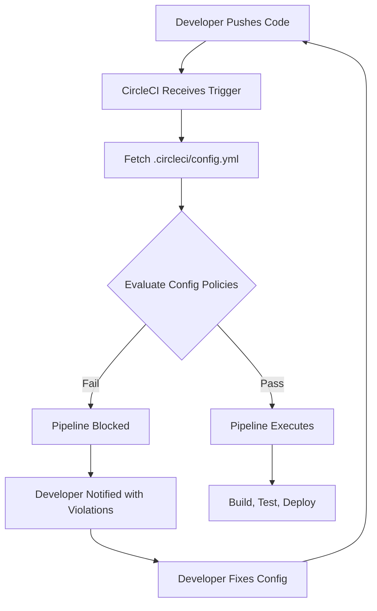
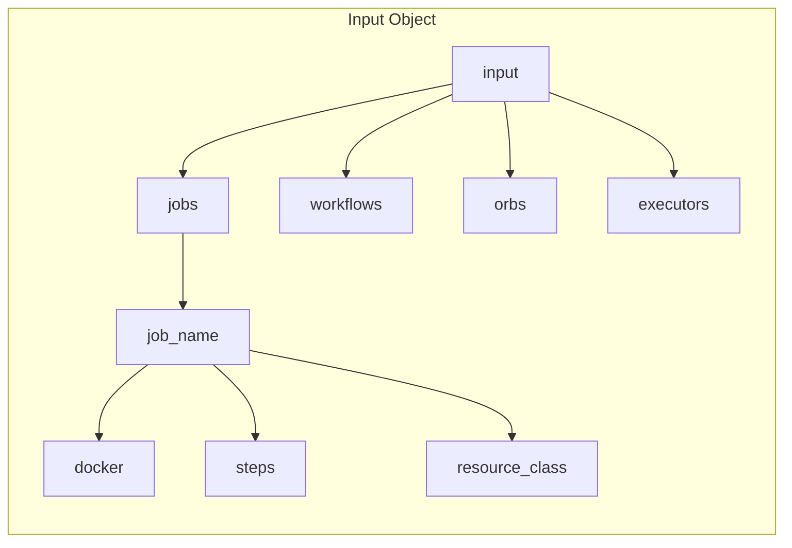
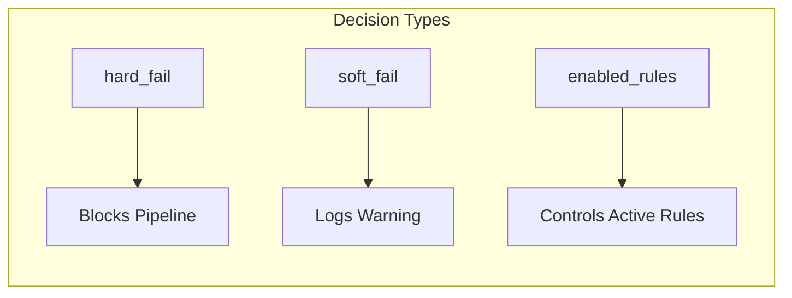
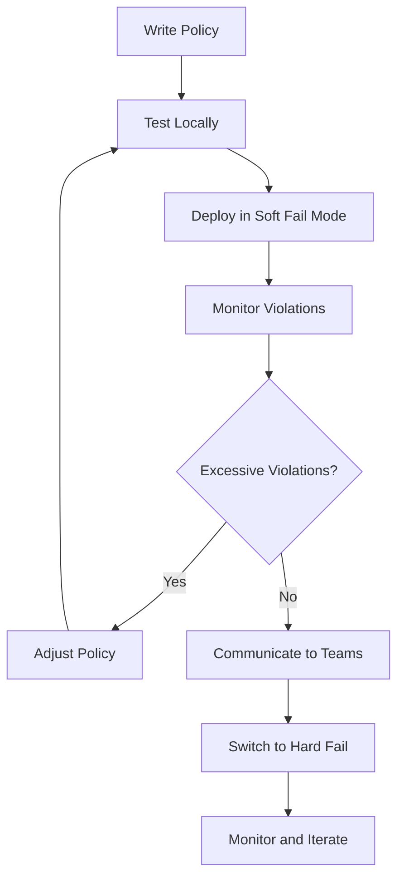
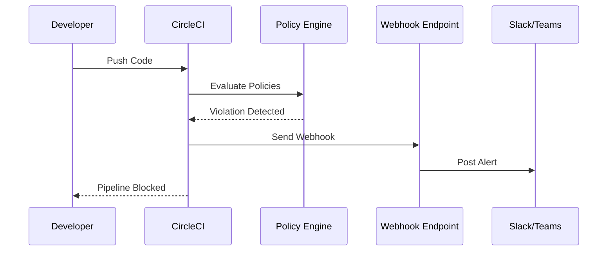

# How to Use CircleCI Config Policies

Author: [nawazdhandala](https://www.github.com/nawazdhandala)

Tags: CircleCI, CI/CD, DevOps, Policy as Code, Configuration Management, Security

Description: Learn how to implement CircleCI Config Policies to enforce organizational standards, security requirements, and best practices across all your CI/CD pipelines using Open Policy Agent (OPA) and Rego.

---

> CircleCI Config Policies give organizations the power to enforce standards across all pipelines without manually reviewing every configuration change. By defining policies as code, you can automatically prevent insecure practices, ensure compliance, and maintain consistency at scale.

Managing CI/CD configurations across dozens or hundreds of projects becomes challenging. Different teams might use outdated images, skip security scans, or configure pipelines in ways that violate organizational standards. Config Policies solve these problems by acting as automated gatekeepers for your pipeline configurations.

---

## What Are CircleCI Config Policies?

Config Policies are rules written in Rego (the policy language from Open Policy Agent) that evaluate CircleCI configurations before pipelines run. When a developer pushes code, CircleCI checks the configuration against your policies and either allows the pipeline to proceed or blocks it with an explanation.

The following diagram shows how Config Policies integrate into the CircleCI workflow:



---

## Setting Up Config Policies

Before writing policies, you need to enable the feature in your CircleCI organization. Config Policies require a Scale plan or higher.

### Prerequisites

- CircleCI account with Scale plan
- Organization admin access
- CircleCI CLI installed locally

### Installing the CircleCI CLI

The CLI is essential for testing and managing policies. Install it using your preferred method:

```bash
# Install CircleCI CLI on macOS using Homebrew
brew install circleci

# Install on Linux using curl
curl -fLSs https://raw.githubusercontent.com/CircleCI-Public/circleci-cli/master/install.sh | bash

# Verify installation and authenticate
circleci version
circleci setup
```

### Enabling Config Policies

Navigate to your organization settings in the CircleCI web interface:

1. Go to Organization Settings > Security
2. Find the "Config Policies" section
3. Enable config policies for your organization
4. Choose your decision mode (soft fail or hard fail)

Decision modes determine what happens when a policy violation occurs:

| Mode | Behavior | Use Case |
|------|----------|----------|
| **Soft Fail** | Log violations but allow pipeline | Testing new policies |
| **Hard Fail** | Block pipeline on violation | Production enforcement |

---

## Writing Your First Policy

Policies are written in Rego and organized into policy bundles. Each bundle contains one or more `.rego` files that define rules.

### Policy Structure

Create a directory structure for your policies:

```bash
# Create the policies directory structure
mkdir -p policies/security
mkdir -p policies/standards
```

Every policy file follows a consistent structure with package declaration, imports, and rules:

```rego
# policies/security/docker_images.rego
# Policy to enforce approved Docker images in CircleCI configurations.
# Prevents teams from using arbitrary images that might contain vulnerabilities.

package org

import future.keywords

# Define the list of approved Docker image prefixes
approved_prefixes := [
    "cimg/",
    "circleci/",
    "docker.io/library/",
    "gcr.io/my-org/"
]

# Helper function to check if an image starts with an approved prefix
image_approved(image) if {
    some prefix in approved_prefixes
    startswith(image, prefix)
}

# Main rule that evaluates all jobs in the configuration
# Returns a hard_fail decision if any job uses an unapproved image
hard_fail contains decision if {
    # Iterate through all jobs in the config
    some job_name, job in input.jobs

    # Check if the job uses a docker executor
    some executor in job.docker

    # Verify the image is not in our approved list
    not image_approved(executor.image)

    # Create the decision object with details about the violation
    decision := {
        "rule": "approved_docker_images",
        "reason": sprintf("Job '%s' uses unapproved image '%s'. Use images from approved registries.", [job_name, executor.image])
    }
}
```

### Understanding the Input Structure

CircleCI passes your pipeline configuration as JSON to the policy engine. Understanding the input structure helps you write effective rules.



Here is an example of how CircleCI configuration maps to the policy input:

```yaml
# .circleci/config.yml - Example configuration
version: 2.1

jobs:
  build:
    docker:
      - image: cimg/python:3.11
    resource_class: medium
    steps:
      - checkout
      - run: pip install -r requirements.txt
      - run: pytest

workflows:
  main:
    jobs:
      - build
```

The above YAML becomes the following JSON structure in your policy:

```json
{
  "jobs": {
    "build": {
      "docker": [
        {"image": "cimg/python:3.11"}
      ],
      "resource_class": "medium",
      "steps": [
        "checkout",
        {"run": "pip install -r requirements.txt"},
        {"run": "pytest"}
      ]
    }
  },
  "workflows": {
    "main": {
      "jobs": ["build"]
    }
  }
}
```

---

## Common Policy Patterns

### Enforcing Resource Class Limits

Organizations often need to control compute costs by limiting which resource classes teams can use:

```rego
# policies/standards/resource_limits.rego
# Restricts resource classes to prevent excessive compute costs.
# Teams requiring larger instances must request exceptions.

package org

import future.keywords

# Resource classes allowed for standard projects
allowed_resource_classes := {
    "small",
    "medium",
    "medium+"
}

# Check each job's resource class against the allowed list
hard_fail contains decision if {
    some job_name, job in input.jobs

    # Get the resource class, defaulting to medium if not specified
    resource_class := object.get(job, "resource_class", "medium")

    # Fail if the resource class is not in the allowed set
    not resource_class in allowed_resource_classes

    decision := {
        "rule": "resource_class_limit",
        "reason": sprintf("Job '%s' uses resource class '%s'. Allowed classes: %v", [job_name, resource_class, allowed_resource_classes])
    }
}
```

### Requiring Security Scanning

Ensure all projects include security scanning before deployment:

```rego
# policies/security/require_scanning.rego
# Mandates security scanning in workflows that deploy to production.
# Helps catch vulnerabilities before they reach production environments.

package org

import future.keywords

# List of job names that indicate a deployment
deployment_indicators := ["deploy", "release", "publish", "prod"]

# Check if a job name suggests it's a deployment job
is_deployment_job(job_name) if {
    some indicator in deployment_indicators
    contains(lower(job_name), indicator)
}

# List of job names or step commands that indicate security scanning
security_scan_indicators := ["snyk", "trivy", "grype", "security-scan", "vulnerability"]

# Check if the workflow contains any security scanning
workflow_has_security_scan(workflow) if {
    some job_ref in workflow.jobs

    # Handle both string job names and object job references
    job_name := get_job_name(job_ref)

    some indicator in security_scan_indicators
    contains(lower(job_name), indicator)
}

# Extract job name from either string or object format
get_job_name(job_ref) := job_ref if is_string(job_ref)
get_job_name(job_ref) := name if {
    is_object(job_ref)
    some name, _ in job_ref
}

# Fail if a workflow has deployment but no security scan
hard_fail contains decision if {
    some workflow_name, workflow in input.workflows

    # Check if workflow has deployment jobs
    some job_ref in workflow.jobs
    job_name := get_job_name(job_ref)
    is_deployment_job(job_name)

    # Verify no security scan exists
    not workflow_has_security_scan(workflow)

    decision := {
        "rule": "require_security_scan",
        "reason": sprintf("Workflow '%s' contains deployment jobs but no security scan. Add a security scanning job before deployment.", [workflow_name])
    }
}
```

### Blocking Dangerous Commands

Prevent specific commands that could compromise security or stability:

```rego
# policies/security/blocked_commands.rego
# Prevents execution of dangerous commands in pipeline steps.
# Blocks sudo usage, curl piping to shell, and other risky patterns.

package org

import future.keywords

# Patterns that should never appear in run commands
blocked_patterns := [
    "curl.*|.*sh",
    "wget.*|.*sh",
    "sudo",
    "chmod 777",
    "rm -rf /",
    "--no-verify"
]

# Extract the command string from a step
get_command(step) := step.run if is_object(step)
get_command(step) := step if is_string(step)

# Check if a command matches any blocked pattern
command_is_blocked(command) if {
    some pattern in blocked_patterns
    regex.match(pattern, command)
}

# Evaluate all steps in all jobs for blocked patterns
hard_fail contains decision if {
    some job_name, job in input.jobs
    some step in job.steps

    command := get_command(step)
    command != null
    command_is_blocked(command)

    decision := {
        "rule": "blocked_commands",
        "reason": sprintf("Job '%s' contains a blocked command pattern. Review step: %s", [job_name, command])
    }
}
```

---

## Policy Decision Types

CircleCI supports three types of policy decisions that give you flexibility in how violations are handled:



### Hard Fail Rules

Use hard_fail for critical violations that must block the pipeline:

```rego
# Returns a hard failure - pipeline will not run
hard_fail contains decision if {
    # condition that must be true for failure
    some job_name, job in input.jobs
    not has_required_step(job)

    decision := {
        "rule": "required_steps",
        "reason": sprintf("Job '%s' missing required step", [job_name])
    }
}
```

### Soft Fail Rules

Use soft_fail for warnings or when rolling out new policies:

```rego
# Returns a soft failure - pipeline runs but violation is logged
soft_fail contains decision if {
    some job_name, job in input.jobs
    uses_deprecated_image(job)

    decision := {
        "rule": "deprecated_images",
        "reason": sprintf("Job '%s' uses a deprecated image. Consider upgrading.", [job_name])
    }
}
```

### Enabling and Disabling Rules

Control which rules are active using the enabled_rules set:

```rego
# policies/main.rego
# Central policy file that controls which rules are active.

package org

import future.keywords

# Enable specific rules - only these rules will be evaluated
enabled_rules := {
    "approved_docker_images",
    "resource_class_limit",
    "require_security_scan"
}
```

---

## Testing Policies Locally

Always test policies before deploying them to production. The CircleCI CLI provides tools for local validation.

### Creating Test Fixtures

Create sample configurations to test against:

```yaml
# test/fixtures/valid_config.yml
# A configuration that should pass all policies

version: 2.1

jobs:
  build:
    docker:
      - image: cimg/python:3.11
    resource_class: medium
    steps:
      - checkout
      - run: pip install -r requirements.txt

  security-scan:
    docker:
      - image: cimg/python:3.11
    steps:
      - checkout
      - run: pip install safety
      - run: safety check

  deploy:
    docker:
      - image: cimg/python:3.11
    steps:
      - run: echo "Deploying..."

workflows:
  main:
    jobs:
      - build
      - security-scan:
          requires:
            - build
      - deploy:
          requires:
            - security-scan
```

```yaml
# test/fixtures/invalid_config.yml
# A configuration that should fail policy checks

version: 2.1

jobs:
  build:
    docker:
      - image: random-registry/untrusted:latest
    resource_class: 2xlarge
    steps:
      - checkout
      - run: curl https://example.com/script.sh | sh

  deploy:
    docker:
      - image: cimg/python:3.11
    steps:
      - run: echo "Deploying without security scan"

workflows:
  main:
    jobs:
      - build
      - deploy:
          requires:
            - build
```

### Running Policy Tests

Use the CircleCI CLI to evaluate configurations against your policies:

```bash
# Validate policy syntax before testing
circleci policy validate policies/

# Test a valid configuration against policies
circleci policy decide policies/ --input test/fixtures/valid_config.yml

# Test an invalid configuration to see failure messages
circleci policy decide policies/ --input test/fixtures/invalid_config.yml

# Output in JSON format for automation
circleci policy decide policies/ --input test/fixtures/invalid_config.yml --output json
```

Example output for a failing configuration:

```json
{
  "status": "HARD_FAIL",
  "hard_failures": [
    {
      "rule": "approved_docker_images",
      "reason": "Job 'build' uses unapproved image 'random-registry/untrusted:latest'. Use images from approved registries."
    },
    {
      "rule": "resource_class_limit",
      "reason": "Job 'build' uses resource class '2xlarge'. Allowed classes: [small, medium, medium+]"
    },
    {
      "rule": "blocked_commands",
      "reason": "Job 'build' contains a blocked command pattern. Review step: curl https://example.com/script.sh | sh"
    },
    {
      "rule": "require_security_scan",
      "reason": "Workflow 'main' contains deployment jobs but no security scan. Add a security scanning job before deployment."
    }
  ],
  "soft_failures": []
}
```

---

## Deploying Policies

Once policies are tested, deploy them to your CircleCI organization.

### Creating a Policy Bundle

Package your policies into a bundle for deployment:

```bash
# Create a tarball of your policies directory
tar -czvf policy-bundle.tar.gz -C policies .

# Alternatively, push directly using the CLI
circleci policy push policies/ --owner-id YOUR_ORG_ID
```

### Viewing Active Policies

Check what policies are currently deployed:

```bash
# List all policy files in your organization
circleci policy list --owner-id YOUR_ORG_ID

# View the content of a specific policy
circleci policy fetch --owner-id YOUR_ORG_ID --policy-name security/docker_images.rego
```

### Rolling Out Policies Gradually

When introducing new policies, use a phased approach:



Start with soft fail mode to understand the impact:

```rego
# During rollout, use soft_fail instead of hard_fail
soft_fail contains decision if {
    # Same conditions as hard_fail
    some job_name, job in input.jobs
    not image_approved(job.docker[0].image)

    decision := {
        "rule": "approved_docker_images_preview",
        "reason": sprintf("PREVIEW: Job '%s' would fail with new image policy", [job_name])
    }
}
```

---

## Advanced Policy Techniques

### Using Policy Metadata

Add metadata to policies for better organization and documentation:

```rego
# policies/security/secrets.rego
# Checks for potential hardcoded secrets in configuration.

package org

import future.keywords

# Policy metadata for documentation and filtering
__policy_metadata__ := {
    "name": "No Hardcoded Secrets",
    "category": "security",
    "severity": "critical",
    "description": "Prevents hardcoded secrets in pipeline configuration",
    "remediation": "Use CircleCI contexts or project environment variables"
}

# Patterns that might indicate hardcoded secrets
secret_patterns := [
    "(?i)api[_-]?key\\s*[:=]\\s*['\"][^'\"]+['\"]",
    "(?i)password\\s*[:=]\\s*['\"][^'\"]+['\"]",
    "(?i)secret\\s*[:=]\\s*['\"][^'\"]+['\"]",
    "(?i)token\\s*[:=]\\s*['\"][^'\"]+['\"]"
]

hard_fail contains decision if {
    some job_name, job in input.jobs
    some step in job.steps

    command := get_command(step)
    command != null

    some pattern in secret_patterns
    regex.match(pattern, command)

    decision := {
        "rule": "no_hardcoded_secrets",
        "reason": sprintf("Job '%s' may contain hardcoded secrets. Use environment variables or contexts.", [job_name])
    }
}
```

### Conditional Policies Based on Project

Apply different policies based on project attributes:

```rego
# policies/conditional/project_based.rego
# Applies stricter policies to production projects.

package org

import future.keywords

# Production project identifiers - add your project slugs
production_projects := {
    "gh/my-org/payment-service",
    "gh/my-org/user-service",
    "gh/my-org/api-gateway"
}

# Check if current project is production-critical
is_production_project if {
    input._project_slug in production_projects
}

# Only enforce strict branch protection for production projects
hard_fail contains decision if {
    is_production_project

    some workflow_name, workflow in input.workflows

    # Check for deployments without branch filters
    some job_ref in workflow.jobs
    is_object(job_ref)

    some job_name, job_config in job_ref
    is_deployment_job(job_name)

    # Verify branch filter exists
    not object.get(job_config, "filters", null)

    decision := {
        "rule": "production_branch_protection",
        "reason": sprintf("Production project deployment '%s' must have branch filters", [job_name])
    }
}
```

### Creating Reusable Policy Libraries

Build a library of helper functions for consistent policy writing:

```rego
# policies/lib/helpers.rego
# Common helper functions used across multiple policies.

package lib.helpers

import future.keywords

# Extract job name from various formats
get_job_name(ref) := ref if is_string(ref)
get_job_name(ref) := name if {
    is_object(ref)
    count(ref) == 1
    some name, _ in ref
}

# Get command from step in various formats
get_step_command(step) := step if is_string(step)
get_step_command(step) := step.run if {
    is_object(step)
    step.run
    is_string(step.run)
}
get_step_command(step) := step.run.command if {
    is_object(step)
    is_object(step.run)
    step.run.command
}

# Check if a string contains any pattern from a list
matches_any_pattern(str, patterns) if {
    some pattern in patterns
    contains(lower(str), pattern)
}

# Get all steps from a job, handling various formats
get_all_steps(job) := steps if {
    steps := object.get(job, "steps", [])
}

# Check if job uses Docker executor
uses_docker_executor(job) if {
    job.docker
    count(job.docker) > 0
}
```

Using the helper library in policies:

```rego
# policies/security/example_using_lib.rego

package org

import future.keywords
import data.lib.helpers

hard_fail contains decision if {
    some job_name, job in input.jobs
    helpers.uses_docker_executor(job)

    some step in helpers.get_all_steps(job)
    command := helpers.get_step_command(step)
    command != null

    helpers.matches_any_pattern(command, ["rm -rf", "sudo"])

    decision := {
        "rule": "dangerous_commands",
        "reason": sprintf("Job '%s' contains potentially dangerous command", [job_name])
    }
}
```

---

## Monitoring and Reporting

Track policy violations to measure compliance and identify patterns.

### Setting Up Violation Alerts

CircleCI can send webhooks when policy violations occur. Configure these in your organization settings to integrate with your monitoring stack.



### Sample Webhook Handler

Create a simple webhook handler to process policy violation events:

```python
# webhook_handler.py
# Receives CircleCI policy violation webhooks and forwards alerts.
# Deploy as a serverless function or lightweight service.

from flask import Flask, request, jsonify
import requests
import os

app = Flask(__name__)

SLACK_WEBHOOK_URL = os.environ.get("SLACK_WEBHOOK_URL")

@app.route("/circleci-webhook", methods=["POST"])
def handle_webhook():
    """Process incoming CircleCI policy violation webhooks."""
    payload = request.json

    # Check if event is a policy violation
    if payload.get("type") != "policy-decision":
        return jsonify({"status": "ignored"}), 200

    decision = payload.get("decision", {})

    # Only alert on hard failures
    if decision.get("status") != "HARD_FAIL":
        return jsonify({"status": "ignored"}), 200

    # Build alert message
    project = payload.get("project", {}).get("slug", "Unknown")
    branch = payload.get("pipeline", {}).get("branch", "Unknown")
    violations = decision.get("hard_failures", [])

    message = build_slack_message(project, branch, violations)
    send_slack_alert(message)

    return jsonify({"status": "alerted"}), 200

def build_slack_message(project, branch, violations):
    """Format violation details for Slack."""
    blocks = [
        {
            "type": "header",
            "text": {
                "type": "plain_text",
                "text": "CircleCI Policy Violation"
            }
        },
        {
            "type": "section",
            "fields": [
                {"type": "mrkdwn", "text": f"*Project:*\n{project}"},
                {"type": "mrkdwn", "text": f"*Branch:*\n{branch}"}
            ]
        }
    ]

    for violation in violations:
        blocks.append({
            "type": "section",
            "text": {
                "type": "mrkdwn",
                "text": f"*Rule:* `{violation['rule']}`\n{violation['reason']}"
            }
        })

    return {"blocks": blocks}

def send_slack_alert(message):
    """Send alert to Slack channel."""
    if SLACK_WEBHOOK_URL:
        requests.post(SLACK_WEBHOOK_URL, json=message)

if __name__ == "__main__":
    app.run(port=8080)
```

---

## Common Pitfalls and Solutions

### Pitfall 1: Overly Strict Policies

Starting with too many restrictions frustrates developers and leads to policy bypass attempts.

**Solution:** Begin with a minimal set of critical policies and expand gradually based on actual issues.

### Pitfall 2: Vague Error Messages

Generic error messages make it hard for developers to fix violations.

**Solution:** Include specific details and remediation steps in your decision reasons:

```rego
# Bad: Vague message
decision := {
    "rule": "image_check",
    "reason": "Invalid image"
}

# Good: Specific and actionable
decision := {
    "rule": "image_check",
    "reason": sprintf("Job '%s' uses image '%s' which is not approved. Approved prefixes: %v. See https://wiki.example.com/approved-images for the full list.", [job_name, image, approved_prefixes])
}
```

### Pitfall 3: Not Testing Edge Cases

Policies that work for simple configs may fail with complex ones.

**Solution:** Test with real configurations from your organization:

```bash
# Collect sample configs from your projects
find ~/projects -name "config.yml" -path "*/.circleci/*" -exec cp {} test/fixtures/ \;

# Test each against your policies
for config in test/fixtures/*.yml; do
    echo "Testing: $config"
    circleci policy decide policies/ --input "$config"
done
```

### Pitfall 4: Forgetting About Orbs

Orbs can introduce steps and configurations that bypass your policies.

**Solution:** Create policies that validate orb usage:

```rego
# policies/security/orb_restrictions.rego
# Controls which orbs can be used in configurations.

package org

import future.keywords

# Orbs that are explicitly approved for use
approved_orbs := {
    "circleci/node",
    "circleci/python",
    "circleci/docker",
    "circleci/aws-cli"
}

# Allow any orb from specific trusted namespaces
trusted_namespaces := {"circleci"}

orb_is_approved(orb_name) if {
    orb_name in approved_orbs
}

orb_is_approved(orb_name) if {
    # Extract namespace from orb name (format: namespace/orb@version)
    parts := split(orb_name, "/")
    count(parts) >= 2
    namespace := parts[0]
    namespace in trusted_namespaces
}

hard_fail contains decision if {
    some orb_alias, orb_ref in input.orbs

    # Handle both string references and object definitions
    orb_name := get_orb_name(orb_ref)
    not orb_is_approved(orb_name)

    decision := {
        "rule": "approved_orbs",
        "reason": sprintf("Orb '%s' (%s) is not in the approved list. Request approval at https://wiki.example.com/orb-requests", [orb_alias, orb_name])
    }
}

get_orb_name(ref) := ref if is_string(ref)
get_orb_name(ref) := ref.orb if {
    is_object(ref)
    ref.orb
}
```

---

## Best Practices Summary

| Practice | Description |
|----------|-------------|
| **Start small** | Begin with 3-5 critical policies |
| **Use soft fail first** | Test impact before enforcing |
| **Write clear messages** | Include rule name, violation, and fix |
| **Test extensively** | Use real configs from your org |
| **Version control policies** | Treat policies as code |
| **Document exceptions** | Create a process for policy exceptions |
| **Monitor violations** | Track patterns and adjust policies |
| **Communicate changes** | Notify teams before enabling new policies |

---

## Conclusion

CircleCI Config Policies transform how organizations manage CI/CD security and compliance. Instead of relying on manual reviews or tribal knowledge, you codify standards that apply consistently across every pipeline.

Start by identifying your most critical requirements: approved images, required security scans, or resource limits. Write policies for these first, test them thoroughly, and roll them out gradually. Over time, expand your policy suite based on actual issues and evolving requirements.

The investment in policy automation pays dividends through reduced security incidents, consistent configurations, and faster code reviews since reviewers no longer need to check for basic compliance issues.

---

*Want comprehensive monitoring for your CI/CD pipelines? [OneUptime](https://oneuptime.com) provides infrastructure monitoring, incident management, and status pages to keep your deployments running smoothly.*

**Related Reading:**
- [How to Implement Kubernetes Egress Network Policies](https://oneuptime.com/blog/post/2026-02-02-kubernetes-egress-network-policies/view)
