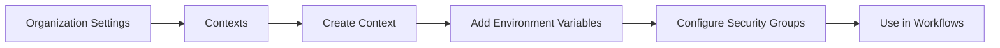
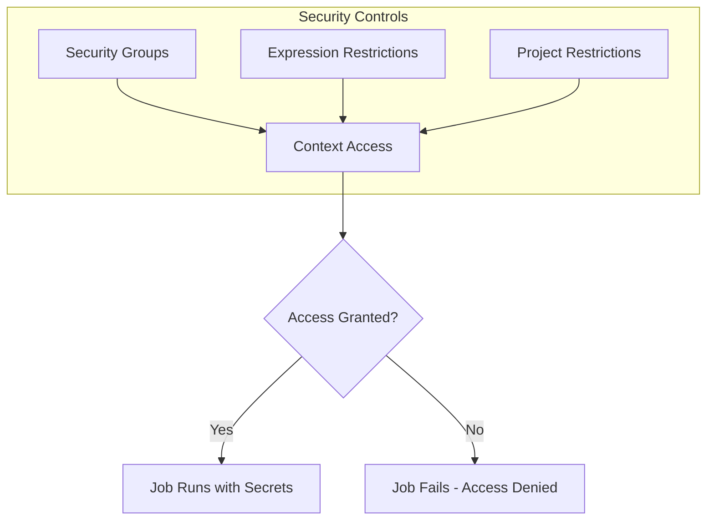
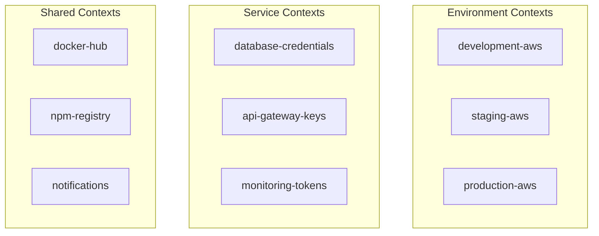
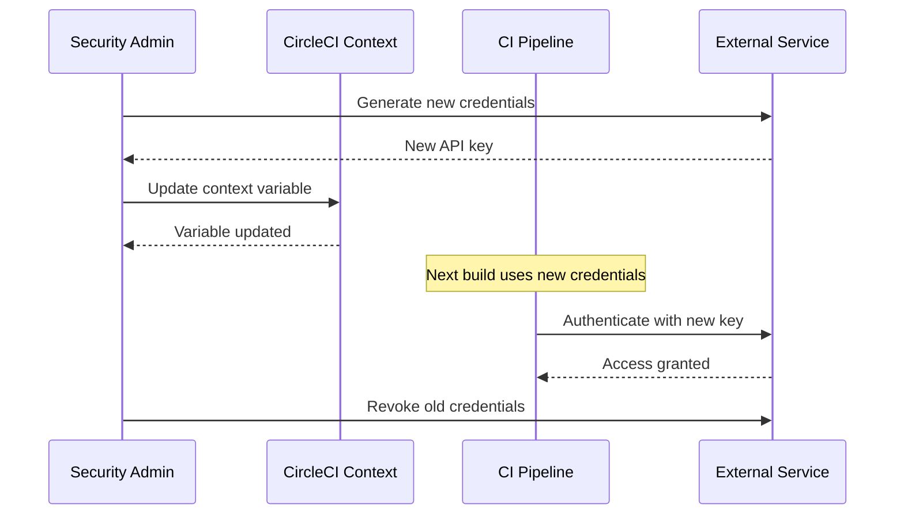

# How to Configure CircleCI Contexts

Author: [nawazdhandala](https://www.github.com/nawazdhandala)

Tags: CircleCI, CI/CD, DevOps, Security, Secrets Management, Continuous Integration

Description: Learn how to configure CircleCI Contexts to securely share environment variables and secrets across projects, manage access controls, and implement organization-wide security policies.

---

> CircleCI Contexts provide a secure mechanism for sharing environment variables across multiple projects while maintaining fine-grained access controls and audit capabilities.

## What Are CircleCI Contexts?

Contexts solve the problem of secret sprawl in CI/CD pipelines. Instead of duplicating database credentials, API keys, and deployment tokens across dozens of repositories, you define them once in a context and reference that context from any project that needs access.

A context is essentially a named collection of environment variables stored securely in CircleCI. When a job references a context, those variables become available during execution. Security teams can restrict which groups or users can access sensitive contexts, and all access is logged for audit purposes.

Key benefits of using contexts:

1. **Centralized secret management** - Update credentials in one place instead of editing every repository
2. **Access control** - Restrict sensitive contexts to specific teams or security groups
3. **Audit trail** - Track who accessed what secrets and when
4. **Reduced duplication** - Share common configuration across projects without copy-paste

## Creating Your First Context

Navigate to your organization settings in CircleCI to create a context. You can also use the CircleCI CLI for automation.



### Using the CircleCI Web Interface

The web interface provides a straightforward way to create and manage contexts:

1. Go to **Organization Settings** in CircleCI
2. Select **Contexts** from the sidebar
3. Click **Create Context**
4. Enter a descriptive name (e.g., `production-aws`, `staging-database`)
5. Add environment variables with their values

### Using the CircleCI CLI

For teams that prefer automation or need to manage contexts programmatically, the CLI offers full context management capabilities.

The following commands demonstrate context creation and variable management using the CircleCI CLI:

```bash
# Install the CircleCI CLI if not already installed
# macOS installation using Homebrew
brew install circleci

# Linux installation using the official install script
curl -fLSs https://raw.githubusercontent.com/CircleCI-Public/circleci-cli/main/install.sh | bash

# Authenticate with your CircleCI account
# You will need a personal API token from CircleCI
circleci setup

# Create a new context in your organization
# Replace 'your-org' with your actual organization name
circleci context create github your-org production-aws

# Add environment variables to the context
# The CLI will prompt for the value to keep it out of shell history
circleci context store-secret github your-org production-aws AWS_ACCESS_KEY_ID

# Add another secret to the same context
circleci context store-secret github your-org production-aws AWS_SECRET_ACCESS_KEY

# List all contexts in your organization
circleci context list github your-org

# Show variables in a specific context (values are masked)
circleci context show github your-org production-aws

# Remove a variable from a context
circleci context remove-secret github your-org production-aws OLD_API_KEY

# Delete an entire context (use with caution)
circleci context delete github your-org deprecated-context
```

## Using Contexts in Your Configuration

Once you have created a context, reference it in your `.circleci/config.yml` file to make its variables available to jobs.

### Basic Context Usage

Jobs that need access to context variables specify the context in the workflow definition:

```yaml
# CircleCI configuration demonstrating basic context usage
version: 2.1

jobs:
  deploy-to-aws:
    docker:
      # Use a Docker image with AWS CLI pre-installed
      - image: cimg/aws:2024.03
    steps:
      - checkout
      # AWS credentials are available from the context
      # No need to hardcode or define them in this file
      - run:
          name: Configure AWS credentials
          command: |
            # AWS_ACCESS_KEY_ID and AWS_SECRET_ACCESS_KEY
            # are automatically injected from the context
            aws configure set aws_access_key_id $AWS_ACCESS_KEY_ID
            aws configure set aws_secret_access_key $AWS_SECRET_ACCESS_KEY
            aws configure set region us-east-1
      - run:
          name: Deploy application to ECS
          command: |
            # Run your deployment commands here
            aws ecs update-service \
              --cluster production \
              --service myapp \
              --force-new-deployment

workflows:
  deploy:
    jobs:
      - deploy-to-aws:
          # Reference the context containing AWS credentials
          # All environment variables from this context become
          # available to the job at runtime
          context:
            - production-aws
```

### Multiple Contexts Per Job

Jobs can reference multiple contexts when they need variables from different sources. Variables from later contexts override earlier ones if there are naming conflicts.

```yaml
version: 2.1

jobs:
  deploy-with-notifications:
    docker:
      - image: cimg/base:current
    steps:
      - checkout
      - run:
          name: Deploy application
          command: |
            # AWS credentials come from production-aws context
            echo "Deploying with AWS credentials..."
            ./scripts/deploy.sh
      - run:
          name: Send deployment notification
          command: |
            # Slack webhook URL comes from notifications context
            curl -X POST -H 'Content-type: application/json' \
              --data '{"text":"Deployment complete!"}' \
              $SLACK_WEBHOOK_URL

workflows:
  deploy:
    jobs:
      - deploy-with-notifications:
          # Multiple contexts provide different sets of variables
          # List contexts in order of precedence (later overrides earlier)
          context:
            - production-aws
            - notifications
            - deployment-config
```

## Context Security and Access Control

CircleCI provides several mechanisms to control who can use contexts and under what conditions.



### Security Groups

Security groups restrict context access to specific teams within your organization. Only members of the allowed groups can trigger jobs that use the protected context.

Navigate to the context settings to configure security groups:

1. Open the context in Organization Settings
2. Click **Security** tab
3. Add security groups that should have access
4. Remove the default "All members" group for sensitive contexts

### Expression-Based Restrictions

Expression restrictions add conditional logic to context access. You can restrict contexts based on branch names, tags, or other pipeline values.

The following example shows how to configure expression restrictions in your context settings:

```yaml
# Expression restrictions are configured in the CircleCI UI
# Here are common patterns you can apply:

# Only allow access from the main branch
# pipeline.git.branch == "main"

# Only allow tagged releases
# pipeline.git.tag =~ /^v[0-9]+\.[0-9]+\.[0-9]+$/

# Only allow specific projects
# pipeline.project.slug == "github/myorg/production-app"

# Combine conditions with logical operators
# pipeline.git.branch == "main" and pipeline.project.slug == "github/myorg/critical-service"
```

### Project Restrictions

Limit contexts to specific projects to prevent accidental or unauthorized use. In the context security settings, you can specify exactly which repositories can access the context.

## Organizing Contexts by Environment

A well-structured context organization makes it easy to manage secrets across different environments and services.



### Naming Conventions

Adopt consistent naming conventions for contexts to improve discoverability and reduce confusion:

```yaml
# Environment-specific contexts
# Pattern: {environment}-{service/provider}
# Examples:
#   - production-aws
#   - staging-database
#   - development-redis

# Shared contexts
# Pattern: {service}-{purpose}
# Examples:
#   - docker-hub-push
#   - npm-registry-publish
#   - slack-notifications

# Team-specific contexts
# Pattern: {team}-{resource}
# Examples:
#   - platform-terraform
#   - backend-api-keys
#   - frontend-cdn-tokens
```

### Environment Promotion Pattern

Structure your workflows to use different contexts as code moves through environments:

```yaml
version: 2.1

jobs:
  test:
    docker:
      - image: cimg/node:20.10
    steps:
      - checkout
      - run: npm ci
      - run: npm test

  deploy:
    docker:
      - image: cimg/aws:2024.03
    parameters:
      # Parameter to specify target environment
      environment:
        type: enum
        enum: ["staging", "production"]
    steps:
      - checkout
      - run:
          name: Deploy to << parameters.environment >>
          command: |
            # AWS credentials are injected from the appropriate context
            ./scripts/deploy.sh << parameters.environment >>

workflows:
  build-and-deploy:
    jobs:
      - test

      # Deploy to staging automatically after tests pass
      - deploy:
          name: deploy-staging
          environment: staging
          # Use staging credentials
          context:
            - staging-aws
            - staging-database
          requires:
            - test
          filters:
            branches:
              only: develop

      # Production deployment requires manual approval
      - hold-for-approval:
          type: approval
          requires:
            - deploy-staging
          filters:
            branches:
              only: main

      # Deploy to production after approval
      - deploy:
          name: deploy-production
          environment: production
          # Use production credentials
          context:
            - production-aws
            - production-database
          requires:
            - hold-for-approval
          filters:
            branches:
              only: main
```

## Context Variables vs Project Environment Variables

Understanding when to use contexts versus project-level environment variables helps you design secure and maintainable pipelines.

| Feature | Context Variables | Project Variables |
|---------|------------------|-------------------|
| Scope | Organization-wide | Single project |
| Access Control | Security groups, expressions | Project settings only |
| Sharing | Multiple projects | One project |
| Audit | Full audit log | Limited |
| Best For | Shared secrets, team credentials | Project-specific config |

### When to Use Contexts

Choose contexts for variables that:

- Need to be shared across multiple repositories
- Require access control beyond project membership
- Contain sensitive credentials like cloud provider keys
- Need centralized rotation (change once, affect all projects)

### When to Use Project Variables

Choose project environment variables for:

- Project-specific configuration that does not need sharing
- Non-sensitive build settings
- Variables that different projects should have different values for

Here is an example showing both approaches in a single configuration:

```yaml
version: 2.1

jobs:
  build-and-deploy:
    docker:
      - image: cimg/node:20.10
    steps:
      - checkout
      # PROJECT_NAME is set in project environment variables
      # since each project has a unique name
      - run:
          name: Build application
          command: |
            echo "Building $PROJECT_NAME"
            npm ci
            npm run build

      # NPM_TOKEN comes from a context since it is
      # shared across all projects that publish packages
      - run:
          name: Publish to npm
          command: |
            echo "//registry.npmjs.org/:_authToken=$NPM_TOKEN" > .npmrc
            npm publish

workflows:
  publish:
    jobs:
      - build-and-deploy:
          # Context provides shared npm credentials
          context:
            - npm-registry
          filters:
            branches:
              only: main
```

## Rotating Secrets in Contexts

Regular secret rotation is a security best practice. Contexts make rotation straightforward since you update the secret in one place.



### Rotation Procedure

Follow these steps to rotate secrets without disrupting pipelines:

```bash
# Step 1: Generate new credentials from your service provider
# For AWS, create new access keys in the IAM console

# Step 2: Add the new credentials to the context
# Use a temporary name to avoid overwriting the current credentials
circleci context store-secret github your-org production-aws AWS_ACCESS_KEY_ID_NEW

# Step 3: Update your configuration to use the new variable temporarily
# Or if your service supports multiple active keys, proceed to step 4

# Step 4: Verify the new credentials work by triggering a test pipeline

# Step 5: Update the context with the new credentials using the standard name
circleci context store-secret github your-org production-aws AWS_ACCESS_KEY_ID

# Step 6: Remove the temporary variable
circleci context remove-secret github your-org production-aws AWS_ACCESS_KEY_ID_NEW

# Step 7: Revoke the old credentials from your service provider
# For AWS, delete the old access key from IAM
```

## Debugging Context Issues

When jobs fail due to context problems, use these techniques to identify the root cause.

### Common Issues and Solutions

**Job cannot access context:**

```yaml
# Error: "Context not found" or "Unauthorized"
#
# Solutions:
# 1. Verify the context name is spelled correctly (case-sensitive)
# 2. Check that your user belongs to the context's security group
# 3. Verify the project is allowed to use the context
# 4. Check expression restrictions are not blocking access
```

**Variable not available in job:**

```yaml
version: 2.1

jobs:
  debug-context:
    docker:
      - image: cimg/base:current
    steps:
      - run:
          name: List available environment variables
          command: |
            # Print all environment variables (values are masked by CircleCI)
            # Useful for verifying which context variables are available
            printenv | sort
      - run:
          name: Check specific variable exists
          command: |
            # Test if a variable is set and non-empty
            if [ -z "$AWS_ACCESS_KEY_ID" ]; then
              echo "ERROR: AWS_ACCESS_KEY_ID is not set"
              echo "Check that the context is attached to this job"
              exit 1
            fi
            echo "AWS_ACCESS_KEY_ID is available"

workflows:
  debug:
    jobs:
      - debug-context:
          context:
            - production-aws
```

### Viewing Context Audit Logs

Organization administrators can view context access logs to troubleshoot security issues and audit credential usage.

1. Navigate to **Organization Settings**
2. Select **Contexts**
3. Click on the context name
4. Select the **Audit Log** tab
5. Review access events including timestamp, user, and action

## Best Practices Summary

**Security**
- Apply the principle of least privilege when granting context access
- Use security groups to restrict sensitive contexts to specific teams
- Enable expression restrictions for production contexts (e.g., main branch only)
- Rotate secrets regularly and revoke old credentials promptly

**Organization**
- Use consistent naming conventions across all contexts
- Separate contexts by environment (development, staging, production)
- Document what variables each context provides and their purpose
- Avoid storing non-sensitive configuration in contexts to reduce complexity

**Maintenance**
- Audit context usage periodically to remove unused variables
- Review security group memberships when team composition changes
- Test secret rotation procedures before an emergency requires them
- Keep a runbook documenting which contexts serve which purposes

**Performance**
- Minimize the number of contexts per job to reduce overhead
- Group related variables in the same context rather than creating many small contexts
- Use project environment variables for non-shared configuration

---

CircleCI Contexts provide the foundation for secure, scalable secret management in your CI/CD pipelines. By centralizing credentials in contexts with appropriate access controls, you reduce the risk of secret sprawl while making credential rotation straightforward. Start by migrating your most sensitive and widely-shared secrets to contexts, then expand coverage as you establish organizational patterns.

Monitor your CI/CD pipeline security and performance with [OneUptime](https://oneuptime.com/blog/post/circleci-production-setup/view). Track context usage patterns, detect anomalies, and ensure your deployment pipeline remains secure and reliable.
