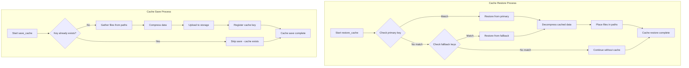
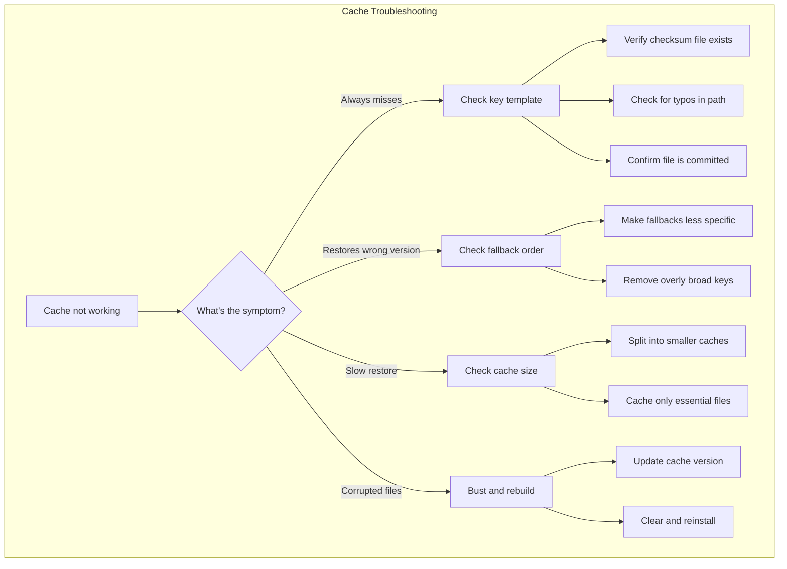

# How to Cache Dependencies in CircleCI

Author: [nawazdhandala](https://www.github.com/nawazdhandala)

Tags: CircleCI, CI/CD, Caching, DevOps, Build Optimization, Continuous Integration, Performance

Description: A practical guide to implementing dependency caching in CircleCI pipelines, covering cache keys, restore strategies, language-specific patterns, and best practices for faster builds.

---

> Build times directly impact developer productivity. Every minute spent waiting for dependencies to download is a minute not spent writing code. CircleCI's caching mechanism can slash your build times by storing and reusing dependencies across pipeline runs.

Dependency caching works by saving files from one pipeline run and restoring them in subsequent runs. Instead of downloading the same npm packages, Python wheels, or Maven artifacts every time, your pipeline retrieves them from cache in seconds. The result? Dramatically faster feedback loops and happier developers.

---

## Prerequisites

Before implementing caching, you should have:
- A CircleCI account with an active project
- Basic familiarity with YAML configuration
- Understanding of your project's dependency management (npm, pip, Maven, etc.)
- Access to your project's `.circleci/config.yml` file

---

## How CircleCI Caching Works

CircleCI stores cached data in object storage and retrieves it at the start of jobs. Understanding the caching flow helps you design effective caching strategies.


### Key Concepts

- **Cache Key**: A unique identifier for cached data, often based on lock file checksums
- **Cache Miss**: When no matching cache exists, requiring fresh dependency installation
- **Cache Hit**: When a matching cache is found and restored
- **Partial Match**: When a fallback cache key matches, providing a starting point

---

## Basic Caching Configuration

Let's start with a simple caching setup for a Node.js project. The example below demonstrates the fundamental save and restore pattern.

```yaml
# .circleci/config.yml
# Basic Node.js caching configuration
# Caches node_modules based on package-lock.json checksum

version: 2.1

jobs:
  build:
    docker:
      - image: cimg/node:18.17.0

    steps:
      # Check out your source code first
      - checkout

      # Attempt to restore cached dependencies
      # The key is based on the checksum of package-lock.json
      - restore_cache:
          keys:
            # Primary key: exact match on lock file
            - node-deps-v1-{{ checksum "package-lock.json" }}
            # Fallback key: any cache from this branch
            - node-deps-v1-

      # Install dependencies (skipped if cache is complete)
      - run:
          name: Install Dependencies
          command: npm ci

      # Save the cache for future runs
      # Only saves if the primary key does not exist
      - save_cache:
          key: node-deps-v1-{{ checksum "package-lock.json" }}
          paths:
            - node_modules

      # Run your build steps
      - run:
          name: Build Application
          command: npm run build

workflows:
  build-workflow:
    jobs:
      - build
```

### Understanding Cache Keys

Cache keys determine when to use cached data versus fresh installation. CircleCI evaluates keys in order, using the first match found.

The key template `node-deps-v1-{{ checksum "package-lock.json" }}` creates a unique identifier based on your lock file. When dependencies change, the checksum changes, triggering a fresh cache.

The fallback key `node-deps-v1-` provides a starting point when the exact match fails. Even an outdated cache speeds up installation since npm only downloads changed packages.

---

## Advanced Cache Key Strategies

Real-world projects often need sophisticated caching strategies. The following examples show how to handle complex scenarios.

### Multi-Factor Cache Keys

Combine multiple factors for precise cache invalidation. Including the OS, Node version, and lock file creates highly specific cache entries.

```yaml
# .circleci/config.yml
# Advanced cache key strategy with multiple factors
# Ensures cache matches the exact build environment

version: 2.1

jobs:
  build:
    docker:
      - image: cimg/node:18.17.0

    steps:
      - checkout

      # Multi-factor cache key for precise matching
      - restore_cache:
          keys:
            # Most specific: OS + Node version + exact dependencies
            - node-deps-v1-{{ arch }}-{{ checksum ".nvmrc" }}-{{ checksum "package-lock.json" }}
            # Fallback: OS + Node version + any dependencies
            - node-deps-v1-{{ arch }}-{{ checksum ".nvmrc" }}-
            # Last resort: any cache for this architecture
            - node-deps-v1-{{ arch }}-

      - run:
          name: Install Dependencies
          command: npm ci

      - save_cache:
          key: node-deps-v1-{{ arch }}-{{ checksum ".nvmrc" }}-{{ checksum "package-lock.json" }}
          paths:
            - node_modules
```

### Branch-Aware Caching

For monorepos or projects with branch-specific dependencies, include the branch name in your cache key.

```yaml
# Branch-aware caching configuration
# Isolates caches between feature branches and main

version: 2.1

jobs:
  build:
    docker:
      - image: cimg/node:18.17.0

    steps:
      - checkout

      - restore_cache:
          keys:
            # Branch-specific cache with exact dependencies
            - node-deps-v1-{{ .Branch }}-{{ checksum "package-lock.json" }}
            # Same branch, any dependencies
            - node-deps-v1-{{ .Branch }}-
            # Fall back to main branch cache
            - node-deps-v1-main-
            # Last resort: any available cache
            - node-deps-v1-

      - run:
          name: Install Dependencies
          command: npm ci

      - save_cache:
          key: node-deps-v1-{{ .Branch }}-{{ checksum "package-lock.json" }}
          paths:
            - node_modules
```

---

## Language-Specific Caching Patterns

Different languages and package managers require specific caching approaches. Here are production-ready configurations for common stacks.

### Node.js with npm

```yaml
# .circleci/config.yml
# Production Node.js caching with npm
# Caches both node_modules and npm cache directory

version: 2.1

jobs:
  build:
    docker:
      - image: cimg/node:18.17.0

    steps:
      - checkout

      # Restore both npm cache and node_modules
      - restore_cache:
          keys:
            - npm-v1-{{ checksum "package-lock.json" }}
            - npm-v1-

      - run:
          name: Install Dependencies
          command: npm ci

      # Cache npm's global cache for faster future installs
      - save_cache:
          key: npm-v1-{{ checksum "package-lock.json" }}
          paths:
            - ~/.npm
            - node_modules

      - run:
          name: Run Tests
          command: npm test
```

### Node.js with Yarn

```yaml
# Yarn caching configuration
# Yarn uses a different cache location than npm

version: 2.1

jobs:
  build:
    docker:
      - image: cimg/node:18.17.0

    steps:
      - checkout

      - restore_cache:
          keys:
            - yarn-v1-{{ checksum "yarn.lock" }}
            - yarn-v1-

      # Yarn installs faster with frozen lockfile
      - run:
          name: Install Dependencies
          command: yarn install --frozen-lockfile

      - save_cache:
          key: yarn-v1-{{ checksum "yarn.lock" }}
          paths:
            - ~/.cache/yarn
            - node_modules
```

### Python with pip

```yaml
# .circleci/config.yml
# Python pip caching configuration
# Caches pip's download cache and virtual environment

version: 2.1

jobs:
  build:
    docker:
      - image: cimg/python:3.11.4

    steps:
      - checkout

      # Restore pip cache and virtual environment
      - restore_cache:
          keys:
            - pip-v1-{{ checksum "requirements.txt" }}
            - pip-v1-

      # Create virtual environment if it does not exist
      - run:
          name: Setup Virtual Environment
          command: |
            python -m venv venv
            . venv/bin/activate
            pip install --upgrade pip

      # Install dependencies using cached wheels when possible
      - run:
          name: Install Dependencies
          command: |
            . venv/bin/activate
            pip install -r requirements.txt

      # Cache both pip cache and the virtual environment
      - save_cache:
          key: pip-v1-{{ checksum "requirements.txt" }}
          paths:
            - ~/.cache/pip
            - venv

      - run:
          name: Run Tests
          command: |
            . venv/bin/activate
            pytest tests/
```

### Python with Poetry

```yaml
# Poetry caching for Python projects
# Poetry manages dependencies and virtual environments

version: 2.1

jobs:
  build:
    docker:
      - image: cimg/python:3.11.4

    steps:
      - checkout

      # Restore Poetry cache including virtual environment
      - restore_cache:
          keys:
            - poetry-v1-{{ checksum "poetry.lock" }}
            - poetry-v1-

      - run:
          name: Install Poetry
          command: |
            curl -sSL https://install.python-poetry.org | python3 -
            echo 'export PATH="$HOME/.local/bin:$PATH"' >> $BASH_ENV

      # Configure Poetry to create virtualenv in project directory
      - run:
          name: Configure Poetry
          command: poetry config virtualenvs.in-project true

      - run:
          name: Install Dependencies
          command: poetry install --no-interaction

      - save_cache:
          key: poetry-v1-{{ checksum "poetry.lock" }}
          paths:
            - ~/.cache/pypoetry
            - .venv

      - run:
          name: Run Tests
          command: poetry run pytest
```

### Java with Maven

```yaml
# .circleci/config.yml
# Maven caching for Java projects
# Caches the local Maven repository

version: 2.1

jobs:
  build:
    docker:
      - image: cimg/openjdk:17.0.8

    steps:
      - checkout

      # Restore Maven repository cache
      - restore_cache:
          keys:
            - maven-v1-{{ checksum "pom.xml" }}
            - maven-v1-

      # Download dependencies without building
      - run:
          name: Download Dependencies
          command: mvn dependency:go-offline

      # Cache the local Maven repository
      - save_cache:
          key: maven-v1-{{ checksum "pom.xml" }}
          paths:
            - ~/.m2/repository

      # Build and test the application
      - run:
          name: Build and Test
          command: mvn clean verify
```

### Java with Gradle

```yaml
# Gradle caching for Java/Kotlin projects
# Caches Gradle wrapper and dependency cache

version: 2.1

jobs:
  build:
    docker:
      - image: cimg/openjdk:17.0.8

    steps:
      - checkout

      # Restore Gradle caches
      - restore_cache:
          keys:
            - gradle-v1-{{ checksum "build.gradle" }}-{{ checksum "gradle/wrapper/gradle-wrapper.properties" }}
            - gradle-v1-{{ checksum "build.gradle" }}
            - gradle-v1-

      # Build with Gradle daemon disabled for CI
      - run:
          name: Build Project
          command: ./gradlew build --no-daemon

      # Cache Gradle home directory
      - save_cache:
          key: gradle-v1-{{ checksum "build.gradle" }}-{{ checksum "gradle/wrapper/gradle-wrapper.properties" }}
          paths:
            - ~/.gradle/caches
            - ~/.gradle/wrapper
```

### Go Modules

```yaml
# .circleci/config.yml
# Go modules caching configuration
# Caches downloaded modules

version: 2.1

jobs:
  build:
    docker:
      - image: cimg/go:1.21.0

    steps:
      - checkout

      # Restore Go module cache
      - restore_cache:
          keys:
            - go-mod-v1-{{ checksum "go.sum" }}
            - go-mod-v1-

      # Download modules
      - run:
          name: Download Dependencies
          command: go mod download

      # Cache Go modules
      - save_cache:
          key: go-mod-v1-{{ checksum "go.sum" }}
          paths:
            - ~/go/pkg/mod

      - run:
          name: Run Tests
          command: go test ./...

      - run:
          name: Build Application
          command: go build -o app ./cmd/server
```

### Ruby with Bundler

```yaml
# Bundler caching for Ruby projects
# Caches gem installation directory

version: 2.1

jobs:
  build:
    docker:
      - image: cimg/ruby:3.2.2

    steps:
      - checkout

      # Restore bundled gems
      - restore_cache:
          keys:
            - bundle-v1-{{ checksum "Gemfile.lock" }}
            - bundle-v1-

      # Configure bundler to use a local path
      - run:
          name: Configure Bundler
          command: |
            bundle config set --local path 'vendor/bundle'
            bundle config set --local deployment 'true'

      - run:
          name: Install Dependencies
          command: bundle install

      - save_cache:
          key: bundle-v1-{{ checksum "Gemfile.lock" }}
          paths:
            - vendor/bundle

      - run:
          name: Run Tests
          command: bundle exec rspec
```

---

## Caching Flow Visualization

Understanding how cache operations flow through your pipeline helps optimize performance.



---

## Monorepo Caching Strategies

Monorepos require careful cache management to avoid bloated caches and slow restores. Segment your caches by package or workspace.

```yaml
# .circleci/config.yml
# Monorepo caching with workspace-specific caches
# Each package gets its own cache for efficiency

version: 2.1

jobs:
  build-frontend:
    docker:
      - image: cimg/node:18.17.0
    working_directory: ~/project/packages/frontend

    steps:
      - checkout:
          path: ~/project

      # Frontend-specific cache
      - restore_cache:
          keys:
            - frontend-deps-v1-{{ checksum "package-lock.json" }}
            - frontend-deps-v1-

      - run:
          name: Install Frontend Dependencies
          command: npm ci

      - save_cache:
          key: frontend-deps-v1-{{ checksum "package-lock.json" }}
          paths:
            - node_modules

      - run:
          name: Build Frontend
          command: npm run build

  build-backend:
    docker:
      - image: cimg/node:18.17.0
    working_directory: ~/project/packages/backend

    steps:
      - checkout:
          path: ~/project

      # Backend-specific cache
      - restore_cache:
          keys:
            - backend-deps-v1-{{ checksum "package-lock.json" }}
            - backend-deps-v1-

      - run:
          name: Install Backend Dependencies
          command: npm ci

      - save_cache:
          key: backend-deps-v1-{{ checksum "package-lock.json" }}
          paths:
            - node_modules

      - run:
          name: Build Backend
          command: npm run build

  build-shared:
    docker:
      - image: cimg/node:18.17.0
    working_directory: ~/project/packages/shared

    steps:
      - checkout:
          path: ~/project

      # Shared library cache
      - restore_cache:
          keys:
            - shared-deps-v1-{{ checksum "package-lock.json" }}
            - shared-deps-v1-

      - run:
          name: Install Shared Dependencies
          command: npm ci

      - save_cache:
          key: shared-deps-v1-{{ checksum "package-lock.json" }}
          paths:
            - node_modules

workflows:
  monorepo-build:
    jobs:
      - build-shared
      - build-frontend:
          requires:
            - build-shared
      - build-backend:
          requires:
            - build-shared
```

---

## Caching Build Artifacts

Beyond dependencies, caching build artifacts can significantly speed up incremental builds.

```yaml
# .circleci/config.yml
# Cache build artifacts for incremental compilation
# Useful for large TypeScript or compiled language projects

version: 2.1

jobs:
  build:
    docker:
      - image: cimg/node:18.17.0

    steps:
      - checkout

      # Restore dependency cache
      - restore_cache:
          keys:
            - deps-v1-{{ checksum "package-lock.json" }}
            - deps-v1-

      - run:
          name: Install Dependencies
          command: npm ci

      - save_cache:
          key: deps-v1-{{ checksum "package-lock.json" }}
          paths:
            - node_modules

      # Restore TypeScript build cache for incremental compilation
      # The cache includes compiled JavaScript and type information
      - restore_cache:
          keys:
            - tsbuild-v1-{{ .Branch }}-{{ .Revision }}
            - tsbuild-v1-{{ .Branch }}-
            - tsbuild-v1-

      # Build with incremental compilation enabled
      - run:
          name: Build TypeScript
          command: npm run build

      # Save build cache for next run
      # Include tsconfig.tsbuildinfo for incremental builds
      - save_cache:
          key: tsbuild-v1-{{ .Branch }}-{{ .Revision }}
          paths:
            - dist
            - tsconfig.tsbuildinfo
            - .tscache
```

---

## Cache Warming Strategies

Pre-warming caches on the main branch ensures feature branches have fast builds from the start.

```yaml
# .circleci/config.yml
# Cache warming workflow for main branch
# Ensures fresh caches are available for feature branches

version: 2.1

jobs:
  warm-cache:
    docker:
      - image: cimg/node:18.17.0

    steps:
      - checkout

      # Always start fresh for cache warming
      - run:
          name: Clean Install
          command: |
            rm -rf node_modules
            npm ci

      # Save cache without fallbacks
      # Forces a fresh cache for the current lock file
      - save_cache:
          key: node-deps-v1-{{ checksum "package-lock.json" }}
          paths:
            - ~/.npm
            - node_modules

      - run:
          name: Build Application
          command: npm run build

      # Save build cache
      - save_cache:
          key: build-cache-v1-{{ .Revision }}
          paths:
            - dist

  build:
    docker:
      - image: cimg/node:18.17.0

    steps:
      - checkout

      - restore_cache:
          keys:
            - node-deps-v1-{{ checksum "package-lock.json" }}
            - node-deps-v1-

      - run:
          name: Install Dependencies
          command: npm ci

      - save_cache:
          key: node-deps-v1-{{ checksum "package-lock.json" }}
          paths:
            - ~/.npm
            - node_modules

      - run:
          name: Build Application
          command: npm run build

workflows:
  # Cache warming runs only on main branch
  cache-warming:
    jobs:
      - warm-cache:
          filters:
            branches:
              only: main

  # Regular build workflow
  build-workflow:
    jobs:
      - build:
          filters:
            branches:
              ignore: main
```

---

## Cache Invalidation Techniques

Sometimes you need to bust the cache manually or based on specific conditions.

```yaml
# .circleci/config.yml
# Cache invalidation strategies
# Includes version prefix for manual invalidation

version: 2.1

# Define cache version as a parameter for easy invalidation
# Increment CACHE_VERSION to bust all caches
parameters:
  cache-version:
    type: string
    default: "v2"

jobs:
  build:
    docker:
      - image: cimg/node:18.17.0

    steps:
      - checkout

      # Include the cache version parameter in the key
      # Changing the parameter invalidates all caches
      - restore_cache:
          keys:
            - node-<< pipeline.parameters.cache-version >>-{{ checksum "package-lock.json" }}
            - node-<< pipeline.parameters.cache-version >>-

      - run:
          name: Install Dependencies
          command: npm ci

      - save_cache:
          key: node-<< pipeline.parameters.cache-version >>-{{ checksum "package-lock.json" }}
          paths:
            - node_modules

      - run:
          name: Build
          command: npm run build
```

### Time-Based Cache Invalidation

For caches that should refresh periodically, include a date component.

```yaml
# Time-based cache invalidation
# Cache refreshes weekly to pick up security updates

jobs:
  build:
    docker:
      - image: cimg/node:18.17.0

    steps:
      - checkout

      # Generate week number for cache key
      - run:
          name: Generate Cache Key
          command: |
            echo "WEEK_NUM=$(date +%Y-%W)" >> $BASH_ENV

      # Include week number in cache key
      - restore_cache:
          keys:
            - deps-v1-${WEEK_NUM}-{{ checksum "package-lock.json" }}
            - deps-v1-${WEEK_NUM}-
            - deps-v1-

      - run:
          name: Install Dependencies
          command: npm ci

      - save_cache:
          key: deps-v1-${WEEK_NUM}-{{ checksum "package-lock.json" }}
          paths:
            - node_modules
```

---

## Troubleshooting Cache Issues

When caching does not work as expected, follow these debugging steps.

### Debugging Cache Keys

Add a step to print cache key values for debugging.

```yaml
# Debug cache key components
# Helps identify why cache hits or misses occur

jobs:
  build:
    docker:
      - image: cimg/node:18.17.0

    steps:
      - checkout

      # Print cache key components for debugging
      - run:
          name: Debug Cache Keys
          command: |
            echo "Branch: ${CIRCLE_BRANCH}"
            echo "Revision: ${CIRCLE_SHA1}"
            echo "Lock file checksum: $(md5sum package-lock.json | cut -d' ' -f1)"
            echo "Architecture: $(uname -m)"

      - restore_cache:
          keys:
            - node-deps-v1-{{ checksum "package-lock.json" }}
            - node-deps-v1-
```

### Common Issues and Solutions



### Verifying Cache Contents

Add verification steps to ensure cached data is valid.

```yaml
# Verify cache integrity after restore
# Catches corruption early

jobs:
  build:
    docker:
      - image: cimg/node:18.17.0

    steps:
      - checkout

      - restore_cache:
          keys:
            - node-deps-v1-{{ checksum "package-lock.json" }}
            - node-deps-v1-

      # Verify node_modules is valid after cache restore
      - run:
          name: Verify Cache Integrity
          command: |
            if [ -d "node_modules" ]; then
              echo "Cache restored, verifying integrity..."
              npm ls --depth=0 || {
                echo "Cache corrupted, cleaning..."
                rm -rf node_modules
              }
            else
              echo "No cache found, will install fresh"
            fi

      - run:
          name: Install Dependencies
          command: npm ci

      - save_cache:
          key: node-deps-v1-{{ checksum "package-lock.json" }}
          paths:
            - node_modules
```

---

## Performance Optimization Tips

Maximize the benefit of caching with these optimization strategies.

### Measure Cache Performance

Track cache metrics to identify optimization opportunities.

```yaml
# Measure and report cache performance
# Helps identify slow or inefficient caches

jobs:
  build:
    docker:
      - image: cimg/node:18.17.0

    steps:
      - checkout

      # Record start time
      - run:
          name: Start Timer
          command: echo "START_TIME=$(date +%s)" >> $BASH_ENV

      - restore_cache:
          keys:
            - node-deps-v1-{{ checksum "package-lock.json" }}
            - node-deps-v1-

      # Measure restore time
      - run:
          name: Measure Cache Restore
          command: |
            RESTORE_TIME=$(($(date +%s) - $START_TIME))
            echo "Cache restore took ${RESTORE_TIME} seconds"

            if [ -d "node_modules" ]; then
              CACHE_SIZE=$(du -sh node_modules | cut -f1)
              echo "Cache size: ${CACHE_SIZE}"
            fi

      - run:
          name: Install Dependencies
          command: |
            INSTALL_START=$(date +%s)
            npm ci
            INSTALL_TIME=$(($(date +%s) - $INSTALL_START))
            echo "Install took ${INSTALL_TIME} seconds"

      - save_cache:
          key: node-deps-v1-{{ checksum "package-lock.json" }}
          paths:
            - node_modules
```

### Optimal Cache Sizes

Keep caches reasonably sized for fast restore times.

| Cache Size | Restore Time | Recommendation |
|------------|--------------|----------------|
| < 100 MB   | < 5 seconds  | Optimal        |
| 100-500 MB | 5-30 seconds | Acceptable     |
| 500 MB-1 GB| 30-60 seconds| Consider splitting |
| > 1 GB     | > 60 seconds | Split into multiple caches |

### Parallel Cache Operations

When possible, structure jobs to restore and save caches in parallel.

```yaml
# Parallel cache operations for multiple job types
# Each job manages its own cache independently

version: 2.1

jobs:
  lint:
    docker:
      - image: cimg/node:18.17.0
    steps:
      - checkout
      - restore_cache:
          keys:
            - lint-deps-v1-{{ checksum "package-lock.json" }}
      - run: npm ci
      - save_cache:
          key: lint-deps-v1-{{ checksum "package-lock.json" }}
          paths:
            - node_modules
      - run: npm run lint

  test:
    docker:
      - image: cimg/node:18.17.0
    steps:
      - checkout
      - restore_cache:
          keys:
            - test-deps-v1-{{ checksum "package-lock.json" }}
      - run: npm ci
      - save_cache:
          key: test-deps-v1-{{ checksum "package-lock.json" }}
          paths:
            - node_modules
      - run: npm test

  build:
    docker:
      - image: cimg/node:18.17.0
    steps:
      - checkout
      - restore_cache:
          keys:
            - build-deps-v1-{{ checksum "package-lock.json" }}
      - run: npm ci
      - save_cache:
          key: build-deps-v1-{{ checksum "package-lock.json" }}
          paths:
            - node_modules
      - run: npm run build

workflows:
  parallel-jobs:
    jobs:
      # All jobs run in parallel with their own caches
      - lint
      - test
      - build
```

---

## Best Practices Summary

Follow these guidelines for effective dependency caching in CircleCI:

### Cache Key Design
- Always include a version prefix (v1, v2) for manual invalidation
- Use lock file checksums as the primary key component
- Provide multiple fallback keys from most to least specific
- Include architecture or OS information for cross-platform builds

### Cache Management
- Cache only what you need; exclude development tools and test fixtures
- Split large caches into smaller, focused caches
- Warm caches on your main branch for faster feature branch builds
- Periodically review and clean up unused cache patterns

### Performance
- Measure cache restore times and optimize slow caches
- Use workspace persistence for artifacts needed within the same workflow
- Consider the trade-off between cache specificity and hit rate

### Reliability
- Verify cache integrity after restore
- Handle cache misses gracefully with proper fallback installation
- Include cache versioning in your release notes for breaking changes

---

## Summary

Effective dependency caching transforms slow CI pipelines into fast feedback loops. By understanding how CircleCI caching works and applying language-specific patterns, you can achieve significant build time improvements.

Key takeaways:
- Design cache keys with specificity and appropriate fallbacks
- Use language-specific caching patterns for optimal performance
- Split large caches and warm them on main branches
- Monitor cache performance and iterate on your strategy

The time invested in proper caching configuration pays dividends across every build, every branch, and every developer on your team.

---

*Want to monitor your CircleCI pipeline performance? [OneUptime](https://oneuptime.com) provides comprehensive CI/CD monitoring with build time tracking, failure alerting, and performance trends. Start optimizing your deployment pipeline today.*
