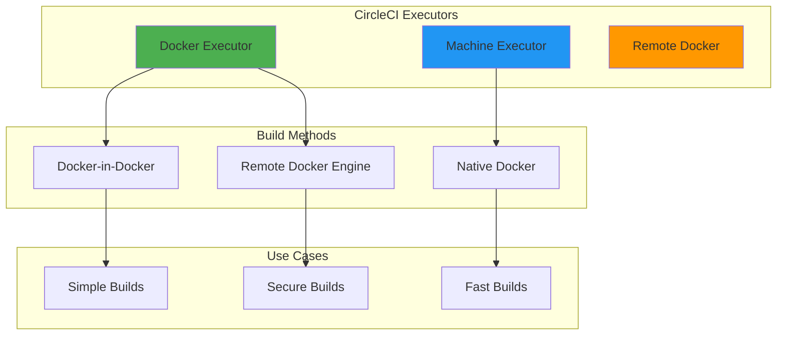
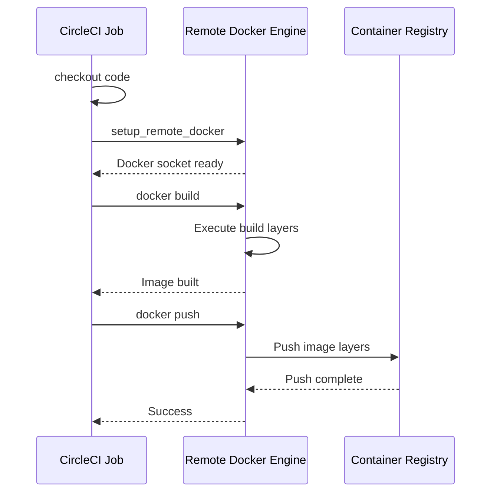
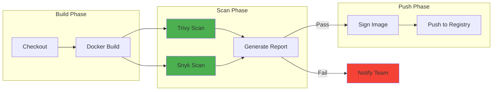

# How to Build Docker Images in CircleCI

Author: [nawazdhandala](https://www.github.com/nawazdhandala)

Tags: CircleCI, Docker, CI/CD, DevOps, Containers, Build Automation

Description: A complete guide to building Docker images in CircleCI pipelines, covering configuration, caching strategies, multi-stage builds, security scanning, and pushing to container registries.

---

Building Docker images as part of your CI/CD pipeline ensures consistent, reproducible deployments. CircleCI provides excellent support for Docker workflows, offering multiple approaches depending on your requirements for security, performance, and complexity.

## CircleCI Docker Build Architecture

CircleCI offers three primary approaches for building Docker images, each with different tradeoffs.



## Setting Up Your CircleCI Configuration

Every CircleCI project starts with a `.circleci/config.yml` file at the root of your repository. Below is a basic configuration that builds a Docker image using the machine executor.

```yaml
# .circleci/config.yml
# Basic configuration for building Docker images with the machine executor

version: 2.1

jobs:
  build-docker-image:
    # Machine executor provides a full VM with Docker pre-installed
    machine:
      image: ubuntu-2204:current

    steps:
      # Check out the repository code
      - checkout

      # Build the Docker image with a tag based on the commit SHA
      - run:
          name: Build Docker Image
          command: |
            docker build -t myapp:${CIRCLE_SHA1:0:7} .

      # Verify the image was created successfully
      - run:
          name: Verify Image
          command: |
            docker images myapp

workflows:
  build:
    jobs:
      - build-docker-image
```

## Using Remote Docker for Secure Builds

When your jobs run in Docker containers, you need the remote Docker feature to build Docker images. Remote Docker spins up a separate, isolated environment for running Docker commands.

```yaml
# .circleci/config.yml
# Configuration using remote Docker for builds inside Docker executors

version: 2.1

jobs:
  build-with-remote-docker:
    # Docker executor is faster to start than machine executor
    docker:
      - image: cimg/base:stable

    steps:
      - checkout

      # Set up remote Docker environment
      # The version parameter ensures compatibility with your Dockerfile
      - setup_remote_docker:
          version: 20.10.18
          docker_layer_caching: true

      # Build the image in the remote Docker environment
      - run:
          name: Build Docker Image
          command: |
            docker build -t myapp:${CIRCLE_SHA1:0:7} .

workflows:
  build:
    jobs:
      - build-with-remote-docker
```

### Remote Docker Architecture

Understanding how remote Docker works helps you optimize your builds.



## Docker Layer Caching

Docker layer caching (DLC) significantly speeds up builds by reusing unchanged layers from previous builds. Enabling DLC requires a paid CircleCI plan.

```yaml
# .circleci/config.yml
# Configuration with Docker layer caching enabled for faster builds

version: 2.1

jobs:
  build-with-caching:
    docker:
      - image: cimg/base:stable

    steps:
      - checkout

      # Enable Docker layer caching for faster rebuilds
      - setup_remote_docker:
          version: 20.10.18
          # DLC reuses layers from previous builds when possible
          docker_layer_caching: true

      - run:
          name: Build Docker Image
          command: |
            # Use build arguments to ensure cache utilization
            docker build \
              --build-arg BUILDKIT_INLINE_CACHE=1 \
              -t myapp:${CIRCLE_SHA1:0:7} \
              -t myapp:latest \
              .

workflows:
  build:
    jobs:
      - build-with-caching
```

### Layer Caching Without DLC

For teams without access to DLC, you can implement caching manually using CircleCI's cache mechanism.

```yaml
# .circleci/config.yml
# Manual caching strategy for Docker images without DLC

version: 2.1

jobs:
  build-with-manual-cache:
    machine:
      image: ubuntu-2204:current

    steps:
      - checkout

      # Restore cached Docker layers from previous builds
      - restore_cache:
          keys:
            - docker-layers-{{ checksum "Dockerfile" }}
            - docker-layers-

      # Load the cached image if it exists
      - run:
          name: Load Cached Image
          command: |
            if [ -f /tmp/docker-cache/image.tar ]; then
              docker load -i /tmp/docker-cache/image.tar
            fi

      # Build the image, leveraging any cached layers
      - run:
          name: Build Docker Image
          command: |
            docker build \
              --cache-from myapp:cache \
              -t myapp:${CIRCLE_SHA1:0:7} \
              -t myapp:cache \
              .

      # Save the image for future builds
      - run:
          name: Save Image for Cache
          command: |
            mkdir -p /tmp/docker-cache
            docker save myapp:cache -o /tmp/docker-cache/image.tar

      # Store the cache for subsequent builds
      - save_cache:
          key: docker-layers-{{ checksum "Dockerfile" }}
          paths:
            - /tmp/docker-cache

workflows:
  build:
    jobs:
      - build-with-manual-cache
```

## Multi-Stage Build Configuration

Multi-stage builds reduce final image size by separating build dependencies from runtime dependencies.

```dockerfile
# Dockerfile
# Multi-stage build separating build and runtime environments

# Build stage - includes all build tools and dependencies
FROM node:18-alpine AS builder

WORKDIR /app

# Copy package files first for better cache utilization
COPY package*.json ./

# Install all dependencies including devDependencies
RUN npm ci

# Copy source code and build the application
COPY . .
RUN npm run build

# Production stage - minimal runtime image
FROM node:18-alpine AS production

WORKDIR /app

# Copy only production dependencies
COPY package*.json ./
RUN npm ci --only=production

# Copy built artifacts from builder stage
COPY --from=builder /app/dist ./dist

# Run as non-root user for security
USER node

EXPOSE 3000

CMD ["node", "dist/index.js"]
```

The CircleCI configuration for multi-stage builds remains the same, but you can target specific stages during development.

```yaml
# .circleci/config.yml
# Configuration supporting multi-stage Docker builds

version: 2.1

jobs:
  build-production:
    docker:
      - image: cimg/base:stable

    steps:
      - checkout

      - setup_remote_docker:
          version: 20.10.18
          docker_layer_caching: true

      # Build only the production stage
      - run:
          name: Build Production Image
          command: |
            docker build \
              --target production \
              -t myapp:${CIRCLE_SHA1:0:7} \
              .

  build-test:
    docker:
      - image: cimg/base:stable

    steps:
      - checkout

      - setup_remote_docker:
          version: 20.10.18
          docker_layer_caching: true

      # Build builder stage for running tests
      - run:
          name: Build Test Image
          command: |
            docker build \
              --target builder \
              -t myapp:test \
              .

      # Run tests inside the container
      - run:
          name: Run Tests
          command: |
            docker run myapp:test npm test

workflows:
  build-and-test:
    jobs:
      - build-test
      - build-production:
          requires:
            - build-test
```

## Pushing to Container Registries

After building your image, you typically push it to a container registry. Below are examples for common registries.

### Docker Hub

Configure Docker Hub credentials as environment variables in your CircleCI project settings.

```yaml
# .circleci/config.yml
# Configuration for pushing images to Docker Hub

version: 2.1

jobs:
  build-and-push:
    docker:
      - image: cimg/base:stable

    steps:
      - checkout

      - setup_remote_docker:
          version: 20.10.18
          docker_layer_caching: true

      # Authenticate with Docker Hub using environment variables
      # Set DOCKER_USERNAME and DOCKER_PASSWORD in CircleCI project settings
      - run:
          name: Login to Docker Hub
          command: |
            echo "$DOCKER_PASSWORD" | docker login -u "$DOCKER_USERNAME" --password-stdin

      # Build and tag the image with multiple tags
      - run:
          name: Build Docker Image
          command: |
            docker build \
              -t ${DOCKER_USERNAME}/myapp:${CIRCLE_SHA1:0:7} \
              -t ${DOCKER_USERNAME}/myapp:latest \
              .

      # Push all tags to Docker Hub
      - run:
          name: Push to Docker Hub
          command: |
            docker push ${DOCKER_USERNAME}/myapp:${CIRCLE_SHA1:0:7}
            docker push ${DOCKER_USERNAME}/myapp:latest

workflows:
  build-and-push:
    jobs:
      - build-and-push
```

### Amazon ECR

Pushing to Amazon ECR requires AWS credentials and the AWS CLI.

```yaml
# .circleci/config.yml
# Configuration for pushing images to Amazon ECR

version: 2.1

orbs:
  # Use the AWS ECR orb for simplified configuration
  aws-ecr: circleci/aws-ecr@8.2.1

jobs:
  build-and-push-ecr:
    docker:
      - image: cimg/base:stable

    steps:
      - checkout

      - setup_remote_docker:
          version: 20.10.18
          docker_layer_caching: true

      # Install AWS CLI for ECR authentication
      - run:
          name: Install AWS CLI
          command: |
            curl "https://awscli.amazonaws.com/awscli-exe-linux-x86_64.zip" -o "awscliv2.zip"
            unzip awscliv2.zip
            sudo ./aws/install

      # Authenticate with ECR
      # AWS_ACCESS_KEY_ID and AWS_SECRET_ACCESS_KEY must be set in project settings
      - run:
          name: Login to ECR
          command: |
            aws ecr get-login-password --region ${AWS_REGION} | \
              docker login --username AWS --password-stdin \
              ${AWS_ACCOUNT_ID}.dkr.ecr.${AWS_REGION}.amazonaws.com

      # Build and tag for ECR
      - run:
          name: Build Docker Image
          command: |
            docker build \
              -t ${AWS_ACCOUNT_ID}.dkr.ecr.${AWS_REGION}.amazonaws.com/myapp:${CIRCLE_SHA1:0:7} \
              .

      # Push to ECR
      - run:
          name: Push to ECR
          command: |
            docker push ${AWS_ACCOUNT_ID}.dkr.ecr.${AWS_REGION}.amazonaws.com/myapp:${CIRCLE_SHA1:0:7}

workflows:
  build-and-push:
    jobs:
      - build-and-push-ecr
```

### Google Container Registry / Artifact Registry

For Google Cloud, use service account authentication.

```yaml
# .circleci/config.yml
# Configuration for pushing images to Google Artifact Registry

version: 2.1

jobs:
  build-and-push-gcr:
    docker:
      - image: cimg/base:stable

    steps:
      - checkout

      - setup_remote_docker:
          version: 20.10.18
          docker_layer_caching: true

      # Authenticate with Google Cloud
      # GCLOUD_SERVICE_KEY should contain the JSON service account key
      - run:
          name: Login to Google Artifact Registry
          command: |
            echo ${GCLOUD_SERVICE_KEY} | docker login -u _json_key --password-stdin https://${GCP_REGION}-docker.pkg.dev

      # Build and tag for Artifact Registry
      - run:
          name: Build Docker Image
          command: |
            docker build \
              -t ${GCP_REGION}-docker.pkg.dev/${GCP_PROJECT_ID}/myrepo/myapp:${CIRCLE_SHA1:0:7} \
              .

      # Push to Artifact Registry
      - run:
          name: Push to Artifact Registry
          command: |
            docker push ${GCP_REGION}-docker.pkg.dev/${GCP_PROJECT_ID}/myrepo/myapp:${CIRCLE_SHA1:0:7}

workflows:
  build-and-push:
    jobs:
      - build-and-push-gcr
```

## Using CircleCI Orbs

CircleCI orbs provide reusable configuration packages. The Docker orb simplifies common Docker operations.

```yaml
# .circleci/config.yml
# Configuration using the official Docker orb

version: 2.1

orbs:
  docker: circleci/docker@2.2.0

workflows:
  build-and-push:
    jobs:
      # Build and push with minimal configuration
      - docker/publish:
          image: myorg/myapp
          tag: ${CIRCLE_SHA1:0:7},latest
          dockerfile: Dockerfile
          use-docker-credentials-store: true
```

### Custom Orb Commands

Extend orb functionality with custom commands.

```yaml
# .circleci/config.yml
# Extended Docker orb usage with custom steps

version: 2.1

orbs:
  docker: circleci/docker@2.2.0

jobs:
  build-with-orb:
    executor: docker/docker
    steps:
      - checkout

      # Use orb command for setup
      - docker/check

      # Build using orb command
      - docker/build:
          image: myorg/myapp
          tag: ${CIRCLE_SHA1:0:7}
          extra_build_args: --build-arg VERSION=${CIRCLE_TAG}

      # Run security scan before pushing
      - run:
          name: Security Scan
          command: |
            docker run --rm \
              -v /var/run/docker.sock:/var/run/docker.sock \
              aquasec/trivy image myorg/myapp:${CIRCLE_SHA1:0:7}

      # Push only if scan passes
      - docker/push:
          image: myorg/myapp
          tag: ${CIRCLE_SHA1:0:7}

workflows:
  build-scan-push:
    jobs:
      - build-with-orb
```

## Security Scanning

Integrate security scanning into your Docker build pipeline to catch vulnerabilities early.

```yaml
# .circleci/config.yml
# Configuration with integrated security scanning using Trivy

version: 2.1

jobs:
  build-and-scan:
    docker:
      - image: cimg/base:stable

    steps:
      - checkout

      - setup_remote_docker:
          version: 20.10.18
          docker_layer_caching: true

      # Build the image
      - run:
          name: Build Docker Image
          command: |
            docker build -t myapp:scan .

      # Scan for vulnerabilities with Trivy
      - run:
          name: Install Trivy
          command: |
            curl -sfL https://raw.githubusercontent.com/aquasecurity/trivy/main/contrib/install.sh | sh -s -- -b /usr/local/bin

      # Run vulnerability scan
      # Exit code 1 on HIGH or CRITICAL vulnerabilities
      - run:
          name: Scan Image for Vulnerabilities
          command: |
            trivy image \
              --exit-code 1 \
              --severity HIGH,CRITICAL \
              --no-progress \
              myapp:scan

      # Generate scan report
      - run:
          name: Generate Scan Report
          command: |
            trivy image \
              --format json \
              --output scan-report.json \
              myapp:scan
          when: always

      # Store scan results as artifacts
      - store_artifacts:
          path: scan-report.json
          destination: security-scan

workflows:
  secure-build:
    jobs:
      - build-and-scan
```

### Security Scanning Workflow

Integrate scanning at multiple points in your pipeline.



## Build Matrix for Multiple Architectures

Build images for multiple CPU architectures using Docker Buildx.

```yaml
# .circleci/config.yml
# Configuration for multi-architecture Docker builds

version: 2.1

jobs:
  build-multiarch:
    machine:
      image: ubuntu-2204:current

    steps:
      - checkout

      # Set up QEMU for cross-platform builds
      - run:
          name: Set Up QEMU
          command: |
            docker run --rm --privileged multiarch/qemu-user-static --reset -p yes

      # Create and use a new Buildx builder
      - run:
          name: Set Up Buildx
          command: |
            docker buildx create --name multiarch --driver docker-container --use
            docker buildx inspect --bootstrap

      # Login to registry
      - run:
          name: Login to Docker Hub
          command: |
            echo "$DOCKER_PASSWORD" | docker login -u "$DOCKER_USERNAME" --password-stdin

      # Build and push for multiple architectures
      - run:
          name: Build and Push Multi-Arch Image
          command: |
            docker buildx build \
              --platform linux/amd64,linux/arm64 \
              --tag ${DOCKER_USERNAME}/myapp:${CIRCLE_SHA1:0:7} \
              --tag ${DOCKER_USERNAME}/myapp:latest \
              --push \
              .

workflows:
  multiarch-build:
    jobs:
      - build-multiarch
```

## Conditional Builds

Control when Docker builds run based on branches, tags, or file changes.

```yaml
# .circleci/config.yml
# Configuration with conditional build triggers

version: 2.1

jobs:
  build-dev:
    docker:
      - image: cimg/base:stable
    steps:
      - checkout
      - setup_remote_docker:
          version: 20.10.18
      - run:
          name: Build Development Image
          command: |
            docker build -t myapp:dev .

  build-production:
    docker:
      - image: cimg/base:stable
    steps:
      - checkout
      - setup_remote_docker:
          version: 20.10.18
          docker_layer_caching: true
      - run:
          name: Build Production Image
          command: |
            docker build \
              --target production \
              -t myapp:${CIRCLE_TAG} \
              .

  push-production:
    docker:
      - image: cimg/base:stable
    steps:
      - checkout
      - setup_remote_docker:
          version: 20.10.18
      - run:
          name: Push Production Image
          command: |
            echo "$DOCKER_PASSWORD" | docker login -u "$DOCKER_USERNAME" --password-stdin
            docker push myapp:${CIRCLE_TAG}

workflows:
  # Development builds on every push
  development:
    jobs:
      - build-dev:
          filters:
            branches:
              ignore: main

  # Production builds only on tags
  release:
    jobs:
      - build-production:
          filters:
            branches:
              ignore: /.*/
            tags:
              only: /^v.*/
      - push-production:
          requires:
            - build-production
          filters:
            branches:
              ignore: /.*/
            tags:
              only: /^v.*/
```

## Performance Optimization Strategies

Optimize your Docker builds in CircleCI for faster feedback cycles.

### Parallel Build Steps

Run independent steps in parallel using CircleCI workflows.

```yaml
# .circleci/config.yml
# Configuration with parallelized build steps

version: 2.1

jobs:
  lint-dockerfile:
    docker:
      - image: hadolint/hadolint:latest-debian
    steps:
      - checkout
      - run:
          name: Lint Dockerfile
          command: hadolint Dockerfile

  build-image:
    docker:
      - image: cimg/base:stable
    steps:
      - checkout
      - setup_remote_docker:
          version: 20.10.18
          docker_layer_caching: true
      - run:
          name: Build Image
          command: docker build -t myapp:${CIRCLE_SHA1:0:7} .
      - run:
          name: Save Image
          command: docker save myapp:${CIRCLE_SHA1:0:7} -o /tmp/image.tar
      - persist_to_workspace:
          root: /tmp
          paths:
            - image.tar

  scan-image:
    docker:
      - image: cimg/base:stable
    steps:
      - setup_remote_docker:
          version: 20.10.18
      - attach_workspace:
          at: /tmp
      - run:
          name: Load Image
          command: docker load -i /tmp/image.tar
      - run:
          name: Scan Image
          command: |
            docker run --rm \
              -v /var/run/docker.sock:/var/run/docker.sock \
              aquasec/trivy image myapp:${CIRCLE_SHA1:0:7}

  test-image:
    docker:
      - image: cimg/base:stable
    steps:
      - setup_remote_docker:
          version: 20.10.18
      - attach_workspace:
          at: /tmp
      - run:
          name: Load Image
          command: docker load -i /tmp/image.tar
      - run:
          name: Run Container Tests
          command: |
            docker run --rm myapp:${CIRCLE_SHA1:0:7} npm test

workflows:
  build-test-scan:
    jobs:
      # Lint runs independently
      - lint-dockerfile
      # Build after lint passes
      - build-image:
          requires:
            - lint-dockerfile
      # Scan and test run in parallel after build
      - scan-image:
          requires:
            - build-image
      - test-image:
          requires:
            - build-image
```

### Workflow Visualization

The parallel workflow reduces total build time.

```mermaid
gantt
    title Docker Build Pipeline Timeline
    dateFormat X
    axisFormat %s

    section Sequential
    Lint         :0, 30
    Build        :30, 120
    Scan         :120, 180
    Test         :180, 240

    section Parallel
    Lint         :0, 30
    Build        :30, 120
    Scan         :120, 180
    Test         :120, 180
```



## Complete Production Pipeline

Below is a comprehensive production-ready configuration combining all best practices.

```yaml
# .circleci/config.yml
# Production-ready Docker build pipeline with all best practices

version: 2.1

orbs:
  docker: circleci/docker@2.2.0

# Reusable executor configuration
executors:
  docker-builder:
    docker:
      - image: cimg/base:stable
    resource_class: medium

# Reusable commands
commands:
  setup-docker:
    description: Set up Docker environment with caching
    steps:
      - setup_remote_docker:
          version: 20.10.18
          docker_layer_caching: true

  docker-login:
    description: Authenticate with Docker Hub
    steps:
      - run:
          name: Login to Docker Hub
          command: |
            echo "$DOCKER_PASSWORD" | docker login -u "$DOCKER_USERNAME" --password-stdin

jobs:
  lint:
    docker:
      - image: hadolint/hadolint:latest-debian
    steps:
      - checkout
      - run:
          name: Lint Dockerfile
          command: hadolint Dockerfile

  build:
    executor: docker-builder
    steps:
      - checkout
      - setup-docker
      - run:
          name: Build Docker Image
          command: |
            docker build \
              --build-arg BUILD_DATE=$(date -u +'%Y-%m-%dT%H:%M:%SZ') \
              --build-arg VCS_REF=${CIRCLE_SHA1} \
              --build-arg VERSION=${CIRCLE_TAG:-${CIRCLE_SHA1:0:7}} \
              -t myapp:${CIRCLE_SHA1:0:7} \
              .
      - run:
          name: Save Image
          command: |
            mkdir -p /tmp/docker
            docker save myapp:${CIRCLE_SHA1:0:7} -o /tmp/docker/image.tar
      - persist_to_workspace:
          root: /tmp/docker
          paths:
            - image.tar

  security-scan:
    executor: docker-builder
    steps:
      - setup-docker
      - attach_workspace:
          at: /tmp/docker
      - run:
          name: Load Image
          command: docker load -i /tmp/docker/image.tar
      - run:
          name: Install Trivy
          command: |
            curl -sfL https://raw.githubusercontent.com/aquasecurity/trivy/main/contrib/install.sh | sh -s -- -b /usr/local/bin
      - run:
          name: Run Security Scan
          command: |
            trivy image \
              --exit-code 1 \
              --severity HIGH,CRITICAL \
              --ignore-unfixed \
              myapp:${CIRCLE_SHA1:0:7}

  integration-test:
    executor: docker-builder
    steps:
      - checkout
      - setup-docker
      - attach_workspace:
          at: /tmp/docker
      - run:
          name: Load Image
          command: docker load -i /tmp/docker/image.tar
      - run:
          name: Run Integration Tests
          command: |
            docker-compose -f docker-compose.test.yml up --abort-on-container-exit
            docker-compose -f docker-compose.test.yml down -v

  push:
    executor: docker-builder
    steps:
      - setup-docker
      - docker-login
      - attach_workspace:
          at: /tmp/docker
      - run:
          name: Load Image
          command: docker load -i /tmp/docker/image.tar
      - run:
          name: Tag and Push Image
          command: |
            # Tag with commit SHA
            docker tag myapp:${CIRCLE_SHA1:0:7} ${DOCKER_USERNAME}/myapp:${CIRCLE_SHA1:0:7}
            docker push ${DOCKER_USERNAME}/myapp:${CIRCLE_SHA1:0:7}

            # Tag with branch name for non-main branches
            if [ "${CIRCLE_BRANCH}" != "main" ]; then
              BRANCH_TAG=$(echo ${CIRCLE_BRANCH} | sed 's/[^a-zA-Z0-9]/-/g')
              docker tag myapp:${CIRCLE_SHA1:0:7} ${DOCKER_USERNAME}/myapp:${BRANCH_TAG}
              docker push ${DOCKER_USERNAME}/myapp:${BRANCH_TAG}
            fi

            # Tag as latest for main branch
            if [ "${CIRCLE_BRANCH}" == "main" ]; then
              docker tag myapp:${CIRCLE_SHA1:0:7} ${DOCKER_USERNAME}/myapp:latest
              docker push ${DOCKER_USERNAME}/myapp:latest
            fi

            # Tag with version for tagged releases
            if [ -n "${CIRCLE_TAG}" ]; then
              docker tag myapp:${CIRCLE_SHA1:0:7} ${DOCKER_USERNAME}/myapp:${CIRCLE_TAG}
              docker push ${DOCKER_USERNAME}/myapp:${CIRCLE_TAG}
            fi

workflows:
  # Main build workflow for all branches
  build-test-push:
    jobs:
      - lint
      - build:
          requires:
            - lint
      - security-scan:
          requires:
            - build
      - integration-test:
          requires:
            - build
      - push:
          requires:
            - security-scan
            - integration-test
          filters:
            branches:
              only:
                - main
                - develop

  # Release workflow for version tags
  release:
    jobs:
      - lint:
          filters:
            branches:
              ignore: /.*/
            tags:
              only: /^v.*/
      - build:
          requires:
            - lint
          filters:
            branches:
              ignore: /.*/
            tags:
              only: /^v.*/
      - security-scan:
          requires:
            - build
          filters:
            branches:
              ignore: /.*/
            tags:
              only: /^v.*/
      - push:
          requires:
            - security-scan
          filters:
            branches:
              ignore: /.*/
            tags:
              only: /^v.*/
```

## Troubleshooting Common Issues

### Permission Denied Errors

When Docker commands fail with permission errors, verify the executor and remote Docker setup.

```yaml
# Solution: Ensure proper Docker group membership
jobs:
  debug-permissions:
    machine:
      image: ubuntu-2204:current
    steps:
      - run:
          name: Check Docker Access
          command: |
            whoami
            groups
            docker info
```

### Layer Caching Not Working

Layer caching issues often stem from incorrect build arguments or cache keys.

```yaml
# Solution: Use BuildKit and explicit cache configuration
jobs:
  debug-caching:
    docker:
      - image: cimg/base:stable
    steps:
      - checkout
      - setup_remote_docker:
          version: 20.10.18
          docker_layer_caching: true
      - run:
          name: Build with Verbose Caching
          command: |
            export DOCKER_BUILDKIT=1
            docker build \
              --progress=plain \
              --build-arg BUILDKIT_INLINE_CACHE=1 \
              -t myapp:test .
```

### Out of Disk Space

Large images can exhaust disk space on CircleCI executors.

```yaml
# Solution: Clean up unused images and use resource classes appropriately
jobs:
  build-large-image:
    machine:
      image: ubuntu-2204:current
    resource_class: large
    steps:
      - checkout
      - run:
          name: Clean Docker System
          command: |
            docker system prune -af
            docker volume prune -f
      - run:
          name: Build Image
          command: docker build -t myapp:large .
```

## Best Practices Summary

1. **Use Docker layer caching** when available to speed up builds significantly

2. **Implement multi-stage builds** to reduce final image sizes and improve security

3. **Scan images for vulnerabilities** before pushing to registries

4. **Use CircleCI orbs** for common Docker operations to reduce configuration complexity

5. **Run parallel jobs** where possible to minimize total pipeline duration

6. **Tag images consistently** with commit SHAs, branch names, and semantic versions

7. **Store credentials securely** using CircleCI environment variables, never in code

8. **Use workspaces** to share built images between jobs without rebuilding

---

Building Docker images in CircleCI provides a powerful, flexible foundation for container-based CI/CD. Start with a basic configuration, add security scanning early, and optimize caching as your build times grow. The combination of remote Docker, layer caching, and CircleCI orbs enables fast, secure image builds that scale with your team's needs.
