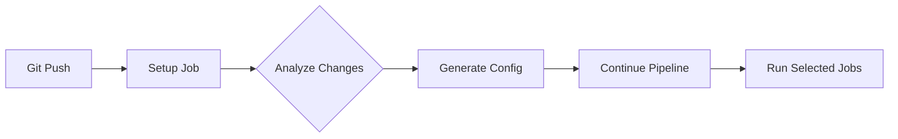
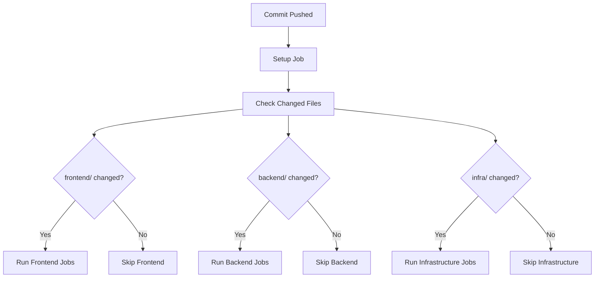
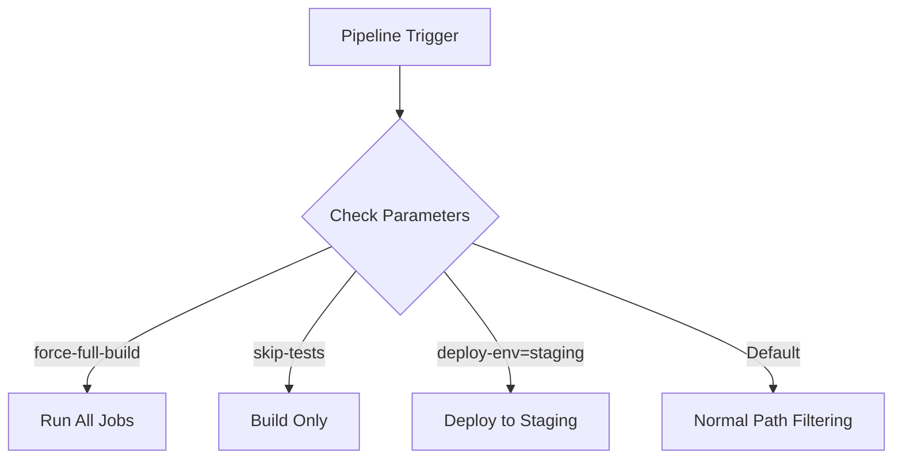
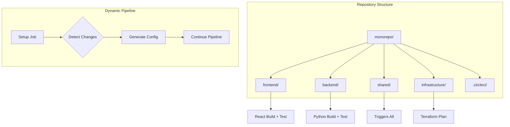

# How to Use CircleCI Dynamic Configuration

Author: [nawazdhandala](https://github.com/nawazdhandala)

Tags: CircleCI, CI/CD, DevOps, Automation, Pipelines, Dynamic Configuration

Description: A practical guide to CircleCI dynamic configuration, covering setup, path filtering, conditional workflows, pipeline parameters, and advanced patterns for optimizing build times.

---

Large monorepos and complex projects often face a common challenge: running all CI/CD jobs on every commit wastes time and resources. CircleCI's dynamic configuration feature solves the problem by letting you generate pipeline configurations at runtime based on conditions you define.

Instead of maintaining a single massive config file with complicated conditional logic, dynamic configuration allows your setup job to analyze the changes and produce only the workflows needed for that specific commit.

## What is Dynamic Configuration?

Dynamic configuration splits your CircleCI pipeline into two phases:

1. **Setup Phase**: A lightweight job that runs first and determines what should happen next
2. **Continuation Phase**: The actual build jobs generated based on the setup phase output



The setup job can inspect changed files, check environment variables, query external services, or use any logic you need to decide which jobs to run.

## Enabling Dynamic Configuration

Before using dynamic configuration, you must enable it in your CircleCI project settings. Navigate to Project Settings > Advanced and toggle on "Enable dynamic config using setup workflows."

Your `.circleci/config.yml` file needs to declare that it uses the setup workflow feature with version 2.1.

The following configuration shows the minimal setup required to enable dynamic configuration:

```yaml
# .circleci/config.yml
version: 2.1

# Enable the setup workflow feature
setup: true

# Define the continuation orb for easier config generation
orbs:
  continuation: circleci/continuation@1.0.0

# The setup workflow runs first
workflows:
  setup-workflow:
    jobs:
      - setup
```

## Basic Setup Job Structure

The setup job analyzes the repository and generates the configuration for subsequent jobs. You can write the setup logic in any language, but shell scripts and Python are common choices.

Here is a basic setup job that generates a continuation configuration:

```yaml
# .circleci/config.yml
version: 2.1
setup: true

orbs:
  continuation: circleci/continuation@1.0.0

jobs:
  setup:
    docker:
      - image: cimg/base:current
    steps:
      # Check out the repository to analyze changes
      - checkout

      # Generate the configuration dynamically
      - run:
          name: Generate Dynamic Config
          command: |
            # Create the continuation config
            cat > /tmp/generated-config.yml \<< 'EOF'
            version: 2.1
            workflows:
              main:
                jobs:
                  - build
            jobs:
              build:
                docker:
                  - image: cimg/base:current
                steps:
                  - checkout
                  - run: echo "Building the project"
            EOF

      # Continue the pipeline with the generated config
      - continuation/continue:
          configuration_path: /tmp/generated-config.yml

workflows:
  setup-workflow:
    jobs:
      - setup
```

## Path Filtering with the Path-Filtering Orb

One of the most powerful use cases for dynamic configuration is running jobs only when specific paths change. The path-filtering orb simplifies the pattern.



The path-filtering orb maps directory patterns to pipeline parameters, making it easy to control which workflows execute.

Install and configure the path-filtering orb with the following setup configuration:

```yaml
# .circleci/config.yml
version: 2.1
setup: true

orbs:
  # The path-filtering orb handles changed file detection
  path-filtering: circleci/path-filtering@1.0.0

workflows:
  setup-workflow:
    jobs:
      - path-filtering/filter:
          # Base revision to compare against (usually main or master)
          base-revision: main
          # Path to the continuation config
          config-path: .circleci/continue-config.yml
          # Map paths to parameters
          mapping: |
            frontend/.* run-frontend-jobs true
            backend/.* run-backend-jobs true
            infrastructure/.* run-infra-jobs true
            shared/.* run-all-jobs true
```

The continuation configuration uses these parameters to conditionally run workflows:

```yaml
# .circleci/continue-config.yml
version: 2.1

# Define the parameters that path-filtering will set
parameters:
  run-frontend-jobs:
    type: boolean
    default: false
  run-backend-jobs:
    type: boolean
    default: false
  run-infra-jobs:
    type: boolean
    default: false
  run-all-jobs:
    type: boolean
    default: false

jobs:
  build-frontend:
    docker:
      - image: cimg/node:20.0
    steps:
      - checkout
      - run: cd frontend && npm ci
      - run: cd frontend && npm run build
      - run: cd frontend && npm test

  build-backend:
    docker:
      - image: cimg/python:3.12
    steps:
      - checkout
      - run: cd backend && pip install -r requirements.txt
      - run: cd backend && python -m pytest

  deploy-infrastructure:
    docker:
      - image: hashicorp/terraform:latest
    steps:
      - checkout
      - run: cd infrastructure && terraform init
      - run: cd infrastructure && terraform plan

# Conditional workflows based on path-filtering parameters
workflows:
  frontend:
    # Run when frontend changes or shared code changes
    when:
      or:
        - << pipeline.parameters.run-frontend-jobs >>
        - << pipeline.parameters.run-all-jobs >>
    jobs:
      - build-frontend

  backend:
    when:
      or:
        - << pipeline.parameters.run-backend-jobs >>
        - << pipeline.parameters.run-all-jobs >>
    jobs:
      - build-backend

  infrastructure:
    when:
      or:
        - << pipeline.parameters.run-infra-jobs >>
        - << pipeline.parameters.run-all-jobs >>
    jobs:
      - deploy-infrastructure
```

## Advanced Path Filtering Patterns

Real-world projects often need more sophisticated path matching. Here are common patterns for handling complex repository structures.

The following mapping configuration demonstrates advanced pattern matching for a typical monorepo:

```yaml
# Advanced path-filtering mapping examples
mapping: |
  # Match any file in the services directory
  services/.* run-services true

  # Match only TypeScript files in frontend
  frontend/.*\.tsx? run-frontend-ts true

  # Match Dockerfiles anywhere
  .*/Dockerfile run-docker-builds true

  # Match CI configuration changes
  \.circleci/.* run-all-tests true

  # Match dependency files
  package\.json run-npm-install true
  requirements\.txt run-pip-install true
  go\.mod run-go-mod true

  # Match specific services
  services/auth/.* run-auth-service true
  services/payments/.* run-payments-service true
  services/notifications/.* run-notifications-service true
```

## Custom Setup Scripts for Complex Logic

When path-filtering alone is not enough, write custom setup logic in a script. You can query APIs, check feature flags, or implement any decision logic you need.

The following Python script generates configuration based on changed files and additional context:

```python
#!/usr/bin/env python3
# .circleci/scripts/generate-config.py
"""
Generate CircleCI configuration dynamically based on changed files
and other conditions like time of day, branch name, or external APIs.
"""

import subprocess
import json
import os
from datetime import datetime

def get_changed_files(base_branch="main"):
    """Get list of files changed compared to base branch."""
    result = subprocess.run(
        ["git", "diff", "--name-only", f"origin/{base_branch}...HEAD"],
        capture_output=True,
        text=True
    )
    return result.stdout.strip().split("\n") if result.stdout else []

def determine_jobs_to_run(changed_files):
    """Determine which jobs should run based on changed files."""
    jobs = set()

    for file_path in changed_files:
        # Skip empty strings
        if not file_path:
            continue

        # Frontend changes
        if file_path.startswith("frontend/"):
            jobs.add("build-frontend")
            jobs.add("test-frontend")

        # Backend changes
        if file_path.startswith("backend/"):
            jobs.add("build-backend")
            jobs.add("test-backend")

        # Infrastructure changes require approval on main
        if file_path.startswith("infrastructure/"):
            jobs.add("plan-infrastructure")

        # Documentation changes only need linting
        if file_path.endswith(".md"):
            jobs.add("lint-docs")

        # CI config changes should run everything
        if file_path.startswith(".circleci/"):
            jobs.add("build-frontend")
            jobs.add("test-frontend")
            jobs.add("build-backend")
            jobs.add("test-backend")

    return jobs

def should_run_nightly_jobs():
    """Check if nightly jobs should run (scheduled or manual trigger)."""
    # Check for scheduled pipeline parameter
    if os.environ.get("CIRCLE_PIPELINE_SCHEDULED") == "true":
        return True
    # Check for manual trigger with nightly parameter
    if os.environ.get("NIGHTLY_BUILD") == "true":
        return True
    return False

def generate_config(jobs_to_run, include_nightly=False):
    """Generate the CircleCI configuration YAML."""

    # Base configuration structure
    config = {
        "version": "2.1",
        "jobs": {},
        "workflows": {}
    }

    # Job definitions
    job_definitions = {
        "build-frontend": {
            "docker": [{"image": "cimg/node:20.0"}],
            "steps": [
                "checkout",
                {"run": "cd frontend && npm ci"},
                {"run": "cd frontend && npm run build"},
                {"persist_to_workspace": {
                    "root": "frontend",
                    "paths": ["dist"]
                }}
            ]
        },
        "test-frontend": {
            "docker": [{"image": "cimg/node:20.0"}],
            "steps": [
                "checkout",
                {"run": "cd frontend && npm ci"},
                {"run": "cd frontend && npm test -- --coverage"}
            ]
        },
        "build-backend": {
            "docker": [{"image": "cimg/python:3.12"}],
            "steps": [
                "checkout",
                {"run": "cd backend && pip install -r requirements.txt"},
                {"run": "cd backend && python -m build"}
            ]
        },
        "test-backend": {
            "docker": [{"image": "cimg/python:3.12"}],
            "steps": [
                "checkout",
                {"run": "cd backend && pip install -r requirements.txt -r requirements-dev.txt"},
                {"run": "cd backend && pytest --cov=app"}
            ]
        },
        "plan-infrastructure": {
            "docker": [{"image": "hashicorp/terraform:latest"}],
            "steps": [
                "checkout",
                {"run": "cd infrastructure && terraform init"},
                {"run": "cd infrastructure && terraform plan -out=tfplan"}
            ]
        },
        "lint-docs": {
            "docker": [{"image": "cimg/node:20.0"}],
            "steps": [
                "checkout",
                {"run": "npx markdownlint '**/*.md' --ignore node_modules"}
            ]
        }
    }

    # Add requested jobs
    for job_name in jobs_to_run:
        if job_name in job_definitions:
            config["jobs"][job_name] = job_definitions[job_name]

    # Build workflow
    if jobs_to_run:
        workflow_jobs = []

        # Frontend jobs
        if "build-frontend" in jobs_to_run:
            workflow_jobs.append("build-frontend")
            if "test-frontend" in jobs_to_run:
                workflow_jobs.append({
                    "test-frontend": {"requires": ["build-frontend"]}
                })

        # Backend jobs
        if "build-backend" in jobs_to_run:
            workflow_jobs.append("build-backend")
            if "test-backend" in jobs_to_run:
                workflow_jobs.append({
                    "test-backend": {"requires": ["build-backend"]}
                })

        # Independent jobs
        if "plan-infrastructure" in jobs_to_run:
            workflow_jobs.append("plan-infrastructure")
        if "lint-docs" in jobs_to_run:
            workflow_jobs.append("lint-docs")

        config["workflows"]["build-and-test"] = {"jobs": workflow_jobs}

    # Add nightly jobs if scheduled
    if include_nightly:
        config["jobs"]["security-scan"] = {
            "docker": [{"image": "cimg/base:current"}],
            "steps": [
                "checkout",
                {"run": "echo 'Running security scans...'"}
            ]
        }
        config["workflows"]["nightly"] = {
            "jobs": ["security-scan"]
        }

    return config

def main():
    import yaml

    # Get changed files
    changed_files = get_changed_files()
    print(f"Changed files: {changed_files}")

    # Determine jobs
    jobs_to_run = determine_jobs_to_run(changed_files)
    print(f"Jobs to run: {jobs_to_run}")

    # Check nightly
    include_nightly = should_run_nightly_jobs()

    # Generate config
    config = generate_config(jobs_to_run, include_nightly)

    # Handle empty config
    if not config["workflows"]:
        config["jobs"]["no-op"] = {
            "docker": [{"image": "cimg/base:current"}],
            "steps": [{"run": "echo 'No relevant changes detected'"}]
        }
        config["workflows"]["no-op"] = {"jobs": ["no-op"]}

    # Write config
    with open("/tmp/generated-config.yml", "w") as f:
        yaml.dump(config, f, default_flow_style=False)

    print("Generated configuration:")
    print(yaml.dump(config, default_flow_style=False))

if __name__ == "__main__":
    main()
```

Use the script in your setup job:

```yaml
# .circleci/config.yml
version: 2.1
setup: true

orbs:
  continuation: circleci/continuation@1.0.0

jobs:
  setup:
    docker:
      - image: cimg/python:3.12
    steps:
      - checkout

      # Install YAML library for config generation
      - run:
          name: Install Dependencies
          command: pip install pyyaml

      # Run the custom config generator
      - run:
          name: Generate Dynamic Config
          command: python .circleci/scripts/generate-config.py

      # Continue with generated config
      - continuation/continue:
          configuration_path: /tmp/generated-config.yml

workflows:
  setup-workflow:
    jobs:
      - setup
```

## Pipeline Parameters for Manual Control

Pipeline parameters allow manual control over which jobs run, useful for debugging or forcing specific workflows.



Define parameters in your config and use them in the setup logic:

```yaml
# .circleci/config.yml
version: 2.1
setup: true

# Pipeline parameters for manual overrides
parameters:
  force-full-build:
    type: boolean
    default: false
    description: "Force all jobs to run regardless of changed files"
  skip-tests:
    type: boolean
    default: false
    description: "Skip test jobs (use with caution)"
  deploy-environment:
    type: enum
    default: "none"
    enum: ["none", "staging", "production"]
    description: "Target deployment environment"

orbs:
  continuation: circleci/continuation@1.0.0

jobs:
  setup:
    docker:
      - image: cimg/python:3.12
    environment:
      FORCE_FULL_BUILD: << pipeline.parameters.force-full-build >>
      SKIP_TESTS: << pipeline.parameters.skip-tests >>
      DEPLOY_ENV: << pipeline.parameters.deploy-environment >>
    steps:
      - checkout
      - run:
          name: Generate Config with Parameters
          command: |
            # Access parameters as environment variables
            if [ "$FORCE_FULL_BUILD" = "true" ]; then
              echo "Forcing full build..."
              # Generate config with all jobs
            fi

            python .circleci/scripts/generate-config.py

      - continuation/continue:
          configuration_path: /tmp/generated-config.yml

workflows:
  setup-workflow:
    jobs:
      - setup
```

Trigger pipelines with specific parameters using the CircleCI API:

```bash
# Trigger pipeline with force-full-build parameter
curl -X POST "https://circleci.com/api/v2/project/github/your-org/your-repo/pipeline" \
  -H "Circle-Token: ${CIRCLECI_TOKEN}" \
  -H "Content-Type: application/json" \
  -d '{
    "branch": "main",
    "parameters": {
      "force-full-build": true
    }
  }'

# Trigger deployment to staging
curl -X POST "https://circleci.com/api/v2/project/github/your-org/your-repo/pipeline" \
  -H "Circle-Token: ${CIRCLECI_TOKEN}" \
  -H "Content-Type: application/json" \
  -d '{
    "branch": "release-v2.0",
    "parameters": {
      "deploy-environment": "staging"
    }
  }'
```

## Matrix Builds with Dynamic Configuration

Generate matrix builds dynamically based on project structure or changed components.

The following script scans for services and generates a matrix configuration:

```python
#!/usr/bin/env python3
# .circleci/scripts/generate-matrix-config.py
"""
Generate matrix builds for multiple services dynamically.
"""

import os
import yaml
from pathlib import Path

def find_services():
    """Find all services in the services directory."""
    services_dir = Path("services")
    if not services_dir.exists():
        return []

    services = []
    for service_path in services_dir.iterdir():
        if service_path.is_dir():
            # Check for service marker files
            if (service_path / "Dockerfile").exists() or \
               (service_path / "package.json").exists() or \
               (service_path / "requirements.txt").exists():
                services.append(service_path.name)

    return sorted(services)

def detect_service_type(service_name):
    """Detect the service type based on files present."""
    service_path = Path(f"services/{service_name}")

    if (service_path / "package.json").exists():
        return "node"
    elif (service_path / "requirements.txt").exists():
        return "python"
    elif (service_path / "go.mod").exists():
        return "go"
    elif (service_path / "Cargo.toml").exists():
        return "rust"
    else:
        return "generic"

def generate_matrix_config(services):
    """Generate configuration with matrix builds for services."""

    config = {
        "version": "2.1",
        "jobs": {},
        "workflows": {}
    }

    # Docker images per service type
    images = {
        "node": "cimg/node:20.0",
        "python": "cimg/python:3.12",
        "go": "cimg/go:1.22",
        "rust": "cimg/rust:1.75",
        "generic": "cimg/base:current"
    }

    # Build commands per service type
    build_commands = {
        "node": ["npm ci", "npm run build", "npm test"],
        "python": ["pip install -r requirements.txt", "pytest"],
        "go": ["go build ./...", "go test ./..."],
        "rust": ["cargo build --release", "cargo test"],
        "generic": ["make build", "make test"]
    }

    workflow_jobs = []

    for service in services:
        service_type = detect_service_type(service)
        job_name = f"build-{service}"

        # Generate job definition
        steps = [
            "checkout",
            {"run": f"cd services/{service} && echo 'Building {service}'"}
        ]

        for cmd in build_commands.get(service_type, []):
            steps.append({"run": f"cd services/{service} && {cmd}"})

        config["jobs"][job_name] = {
            "docker": [{"image": images.get(service_type, images["generic"])}],
            "steps": steps
        }

        workflow_jobs.append(job_name)

    # Create parallel workflow
    if workflow_jobs:
        config["workflows"]["build-services"] = {
            "jobs": workflow_jobs
        }
    else:
        # No services found
        config["jobs"]["no-services"] = {
            "docker": [{"image": "cimg/base:current"}],
            "steps": [{"run": "echo 'No services found'"}]
        }
        config["workflows"]["default"] = {
            "jobs": ["no-services"]
        }

    return config

def main():
    services = find_services()
    print(f"Found services: {services}")

    config = generate_matrix_config(services)

    with open("/tmp/generated-config.yml", "w") as f:
        yaml.dump(config, f, default_flow_style=False)

    print("Generated matrix configuration:")
    print(yaml.dump(config, default_flow_style=False))

if __name__ == "__main__":
    main()
```

## Caching and Workspace Strategies

Dynamic configuration can optimize caching by generating cache keys based on actual dependencies.

The following configuration generates intelligent cache keys:

```yaml
# .circleci/continue-config.yml
version: 2.1

jobs:
  build-with-smart-cache:
    docker:
      - image: cimg/node:20.0
    steps:
      - checkout

      # Generate a hash of all package-lock.json files
      - run:
          name: Generate Cache Key
          command: |
            find . -name "package-lock.json" -exec md5sum {} \; | sort | md5sum > /tmp/deps-hash.txt
            echo "Dependencies hash: $(cat /tmp/deps-hash.txt)"

      # Restore cache with generated key
      - restore_cache:
          keys:
            - v1-deps-{{ checksum "/tmp/deps-hash.txt" }}
            - v1-deps-

      # Install dependencies
      - run: npm ci

      # Save cache with generated key
      - save_cache:
          key: v1-deps-{{ checksum "/tmp/deps-hash.txt" }}
          paths:
            - node_modules
            - ~/.npm

      - run: npm run build

  # Workspace example for artifacts between jobs
  test-with-workspace:
    docker:
      - image: cimg/node:20.0
    steps:
      - attach_workspace:
          at: /tmp/workspace

      - run:
          name: List Workspace Contents
          command: ls -la /tmp/workspace

      - run:
          name: Run Tests
          command: |
            cp -r /tmp/workspace/dist ./dist
            npm test

workflows:
  build-and-test:
    jobs:
      - build-with-smart-cache
      - test-with-workspace:
          requires:
            - build-with-smart-cache
```

## Error Handling and Fallbacks

Robust dynamic configuration needs proper error handling to prevent pipeline failures when config generation fails.

```yaml
# .circleci/config.yml
version: 2.1
setup: true

orbs:
  continuation: circleci/continuation@1.0.0

jobs:
  setup:
    docker:
      - image: cimg/python:3.12
    steps:
      - checkout

      - run:
          name: Generate Config with Fallback
          command: |
            # Try to generate config
            if python .circleci/scripts/generate-config.py; then
              echo "Config generated successfully"
            else
              echo "Config generation failed, using fallback"
              # Create a minimal fallback config
              cat > /tmp/generated-config.yml \<< 'EOF'
            version: 2.1
            jobs:
              fallback-build:
                docker:
                  - image: cimg/base:current
                steps:
                  - checkout
                  - run:
                      name: Fallback Build
                      command: |
                        echo "Dynamic config generation failed"
                        echo "Running fallback build process"
                        # Add your fallback build commands here
                        make build || echo "Make not available, skipping"
            workflows:
              fallback:
                jobs:
                  - fallback-build
            EOF
            fi

      # Validate the generated config
      - run:
          name: Validate Config
          command: |
            python -c "import yaml; yaml.safe_load(open('/tmp/generated-config.yml'))"
            echo "Config validation passed"

      - continuation/continue:
          configuration_path: /tmp/generated-config.yml

workflows:
  setup-workflow:
    jobs:
      - setup
```

## Debugging Dynamic Configuration

When dynamic configuration is not working as expected, use these debugging techniques.

Add verbose logging to your setup job:

```yaml
jobs:
  setup:
    docker:
      - image: cimg/python:3.12
    steps:
      - checkout

      # Debug: Show changed files
      - run:
          name: Debug - List Changed Files
          command: |
            echo "=== Git Status ==="
            git status
            echo ""
            echo "=== Changed Files vs main ==="
            git diff --name-only origin/main...HEAD || echo "Could not diff against main"
            echo ""
            echo "=== Recent Commits ==="
            git log --oneline -5

      # Debug: Show environment
      - run:
          name: Debug - Environment Variables
          command: |
            echo "=== Pipeline Variables ==="
            echo "CIRCLE_BRANCH: $CIRCLE_BRANCH"
            echo "CIRCLE_SHA1: $CIRCLE_SHA1"
            echo "CIRCLE_PIPELINE_NUMBER: $CIRCLE_PIPELINE_NUMBER"
            echo "CIRCLE_PIPELINE_ID: $CIRCLE_PIPELINE_ID"

      - run:
          name: Generate Config
          command: python .circleci/scripts/generate-config.py

      # Debug: Show generated config
      - run:
          name: Debug - Generated Config
          command: |
            echo "=== Generated Configuration ==="
            cat /tmp/generated-config.yml

      # Store config as artifact for inspection
      - store_artifacts:
          path: /tmp/generated-config.yml
          destination: generated-config.yml

      - continuation/continue:
          configuration_path: /tmp/generated-config.yml
```

## Real-World Example: Monorepo with Multiple Services

Here is a complete example for a monorepo with frontend, backend, and shared libraries.



The complete setup configuration:

```yaml
# .circleci/config.yml
version: 2.1
setup: true

parameters:
  force-all:
    type: boolean
    default: false
  environment:
    type: enum
    default: "development"
    enum: ["development", "staging", "production"]

orbs:
  continuation: circleci/continuation@1.0.0

jobs:
  setup:
    docker:
      - image: cimg/python:3.12
    environment:
      FORCE_ALL: << pipeline.parameters.force-all >>
      DEPLOY_ENV: << pipeline.parameters.environment >>
    steps:
      - checkout
      - run: pip install pyyaml
      - run:
          name: Generate Pipeline Config
          command: |
            python << 'SCRIPT'
            import subprocess
            import yaml
            import os

            def get_changed_files():
                result = subprocess.run(
                    ["git", "diff", "--name-only", "origin/main...HEAD"],
                    capture_output=True, text=True
                )
                return [f for f in result.stdout.strip().split("\n") if f]

            def main():
                force_all = os.environ.get("FORCE_ALL") == "true"
                deploy_env = os.environ.get("DEPLOY_ENV", "development")
                changed = get_changed_files()

                # Determine what to build
                build_frontend = force_all or any(f.startswith(("frontend/", "shared/")) for f in changed)
                build_backend = force_all or any(f.startswith(("backend/", "shared/")) for f in changed)
                build_infra = any(f.startswith("infrastructure/") for f in changed)

                config = {"version": "2.1", "jobs": {}, "workflows": {}}
                workflow_jobs = []

                if build_frontend:
                    config["jobs"]["frontend"] = {
                        "docker": [{"image": "cimg/node:20.0"}],
                        "steps": [
                            "checkout",
                            {"run": "cd frontend && npm ci"},
                            {"run": "cd frontend && npm run lint"},
                            {"run": "cd frontend && npm test"},
                            {"run": "cd frontend && npm run build"}
                        ]
                    }
                    workflow_jobs.append("frontend")

                if build_backend:
                    config["jobs"]["backend"] = {
                        "docker": [{"image": "cimg/python:3.12"}],
                        "steps": [
                            "checkout",
                            {"run": "cd backend && pip install -r requirements.txt"},
                            {"run": "cd backend && black --check ."},
                            {"run": "cd backend && pytest -v"}
                        ]
                    }
                    workflow_jobs.append("backend")

                if build_infra:
                    config["jobs"]["infrastructure"] = {
                        "docker": [{"image": "hashicorp/terraform:latest"}],
                        "steps": [
                            "checkout",
                            {"run": "cd infrastructure && terraform init"},
                            {"run": "cd infrastructure && terraform validate"},
                            {"run": "cd infrastructure && terraform plan"}
                        ]
                    }
                    workflow_jobs.append("infrastructure")

                if not workflow_jobs:
                    config["jobs"]["no-changes"] = {
                        "docker": [{"image": "cimg/base:current"}],
                        "steps": [{"run": "echo 'No relevant changes'"}]
                    }
                    workflow_jobs.append("no-changes")

                config["workflows"]["main"] = {"jobs": workflow_jobs}

                with open("/tmp/generated-config.yml", "w") as f:
                    yaml.dump(config, f)

                print(f"Changed files: {changed}")
                print(f"Building: frontend={build_frontend}, backend={build_backend}, infra={build_infra}")

            main()
            SCRIPT

      - run: cat /tmp/generated-config.yml
      - store_artifacts:
          path: /tmp/generated-config.yml
      - continuation/continue:
          configuration_path: /tmp/generated-config.yml

workflows:
  setup-workflow:
    jobs:
      - setup
```

## Performance Optimization Tips

Dynamic configuration can significantly reduce build times. Here are strategies to maximize the benefits:

1. **Keep setup jobs lightweight**: Minimize dependencies in the setup job to reduce startup time
2. **Use path-filtering orb for simple cases**: Avoid custom scripts when the path-filtering orb handles your needs
3. **Cache config generation dependencies**: Cache Python packages or other dependencies used in config generation
4. **Parallelize independent jobs**: Generate configurations that run independent jobs in parallel
5. **Use workspaces sparingly**: Only persist artifacts that downstream jobs actually need

The following configuration demonstrates an optimized setup job:

```yaml
jobs:
  setup:
    docker:
      # Use a minimal image
      - image: cimg/base:current
    resource_class: small
    steps:
      - checkout

      # Fast path filtering with shell script
      - run:
          name: Quick Path Check
          command: |
            CHANGED=$(git diff --name-only origin/main...HEAD 2>/dev/null || echo "")

            # Quick checks with grep (faster than Python for simple cases)
            FRONTEND=$(echo "$CHANGED" | grep -c "^frontend/" || true)
            BACKEND=$(echo "$CHANGED" | grep -c "^backend/" || true)

            echo "export RUN_FRONTEND=$([[ $FRONTEND -gt 0 ]] && echo true || echo false)" >> $BASH_ENV
            echo "export RUN_BACKEND=$([[ $BACKEND -gt 0 ]] && echo true || echo false)" >> $BASH_ENV

      - run:
          name: Generate Minimal Config
          command: |
            # Generate config inline without Python
            cat > /tmp/generated-config.yml \<< EOF
            version: 2.1
            workflows:
              main:
                jobs:
            $([ "$RUN_FRONTEND" = "true" ] && echo "      - frontend")
            $([ "$RUN_BACKEND" = "true" ] && echo "      - backend")
            $([ "$RUN_FRONTEND" != "true" ] && [ "$RUN_BACKEND" != "true" ] && echo "      - no-op")
            jobs:
              frontend:
                docker:
                  - image: cimg/node:20.0
                steps:
                  - checkout
                  - run: cd frontend && npm ci && npm test
              backend:
                docker:
                  - image: cimg/python:3.12
                steps:
                  - checkout
                  - run: cd backend && pip install -r requirements.txt && pytest
              no-op:
                docker:
                  - image: cimg/base:current
                steps:
                  - run: echo "No changes detected"
            EOF
```

## Summary

CircleCI dynamic configuration transforms how you manage CI/CD pipelines for complex projects. By generating configurations at runtime, you can:

- Run only the jobs affected by changes
- Reduce build times and resource costs
- Simplify configuration maintenance
- Implement sophisticated conditional logic
- Support monorepo architectures effectively

Start with the path-filtering orb for basic use cases, then graduate to custom setup scripts as your needs grow. Always include proper error handling and debugging capabilities to maintain pipeline reliability.

The investment in setting up dynamic configuration pays dividends as your project scales, keeping build times manageable even as the codebase grows.
