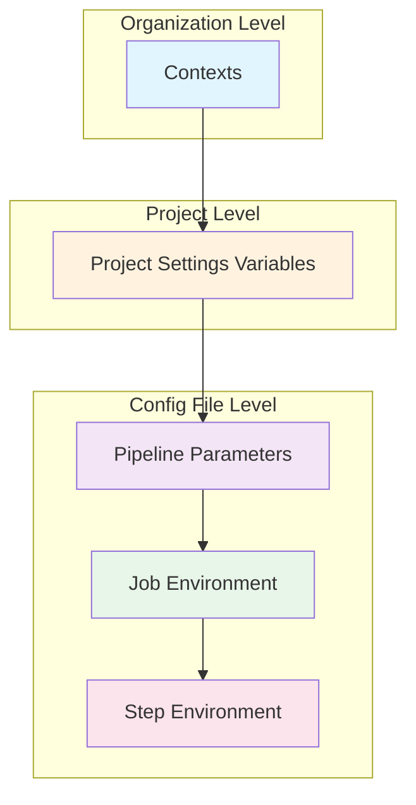
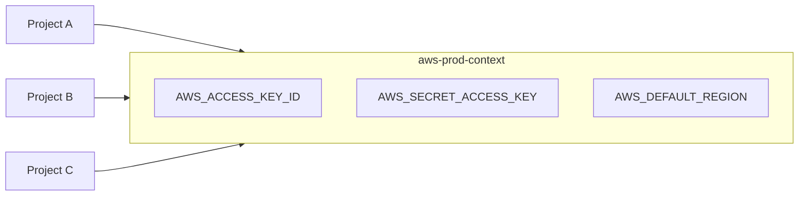
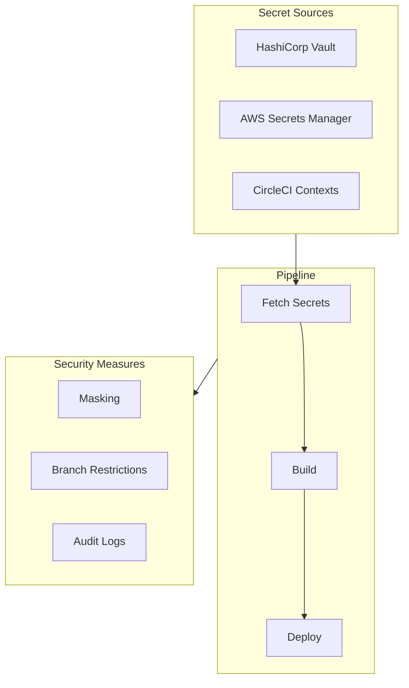

# How to Use Environment Variables in CircleCI

Author: [nawazdhandala](https://www.github.com/nawazdhandala)

Tags: CircleCI, CI/CD, Environment Variables, DevOps, Automation, Secrets Management

Description: A practical guide to managing environment variables in CircleCI pipelines, covering project-level variables, contexts, dynamic values, and security best practices.

---

Managing secrets and configuration values in CI/CD pipelines requires careful handling. CircleCI provides multiple ways to define and use environment variables, each suited for different use cases. Let me walk you through the options and show you how to implement them effectively.

## Understanding Environment Variable Scope in CircleCI

CircleCI environment variables operate at different levels, from organization-wide contexts down to individual job steps. Choosing the right scope keeps your pipelines secure and maintainable.



## Setting Project-Level Environment Variables

Project variables are the most common approach for storing secrets specific to a single repository. You set these in the CircleCI web UI.

### Adding Variables via CircleCI Dashboard

Navigate to **Project Settings** > **Environment Variables** and add your key-value pairs. CircleCI masks these values in build logs automatically.

The following example shows how to reference project variables in your config file:

```yaml
# .circleci/config.yml
# Project variables like DATABASE_URL and API_KEY are automatically
# available in all jobs without explicit declaration
version: 2.1

jobs:
  deploy:
    docker:
      - image: cimg/node:20.0
    steps:
      - checkout
      # DATABASE_URL is set in Project Settings and available here
      - run:
          name: Run database migrations
          command: |
            echo "Connecting to database..."
            npm run migrate
      # API_KEY is also available from Project Settings
      - run:
          name: Deploy application
          command: |
            curl -X POST https://api.deployment.com/deploy \
              -H "Authorization: Bearer $API_KEY"
```

### Built-in Environment Variables

CircleCI provides several built-in variables automatically. Here are the most useful ones:

```yaml
# .circleci/config.yml
# Built-in variables are available in every job automatically
version: 2.1

jobs:
  build:
    docker:
      - image: cimg/base:current
    steps:
      - checkout
      - run:
          name: Display build information
          command: |
            echo "Branch: $CIRCLE_BRANCH"
            echo "Commit SHA: $CIRCLE_SHA1"
            echo "Build Number: $CIRCLE_BUILD_NUM"
            echo "PR Number: $CIRCLE_PULL_REQUEST"
            echo "Repository: $CIRCLE_PROJECT_REPONAME"
            echo "Username: $CIRCLE_PROJECT_USERNAME"
            echo "Job Name: $CIRCLE_JOB"
            echo "Working Directory: $CIRCLE_WORKING_DIRECTORY"
```

## Using Contexts for Shared Variables

Contexts let you share environment variables across multiple projects. Teams commonly use contexts for organization-wide credentials like Docker Hub, AWS, or npm tokens.



### Creating and Using Contexts

Set up contexts in **Organization Settings** > **Contexts**. Then reference them in your workflow:

```yaml
# .circleci/config.yml
# Contexts are attached at the workflow level, making all contained
# variables available to jobs that reference the context
version: 2.1

workflows:
  deploy-pipeline:
    jobs:
      - build
      # The aws-prod context includes AWS credentials that
      # the deploy job needs for pushing to ECR
      - deploy:
          context:
            - aws-prod
            - docker-hub
          requires:
            - build

jobs:
  build:
    docker:
      - image: cimg/node:20.0
    steps:
      - checkout
      - run: npm ci
      - run: npm run build

  deploy:
    docker:
      - image: cimg/aws:2024.03
    steps:
      - checkout
      # AWS credentials from aws-prod context are available here
      - run:
          name: Push to ECR
          command: |
            aws ecr get-login-password --region $AWS_DEFAULT_REGION | \
              docker login --username AWS --password-stdin $ECR_REGISTRY
            docker push $ECR_REGISTRY/my-app:$CIRCLE_SHA1
```

### Restricting Context Access

Security-conscious teams restrict which projects and branches can use sensitive contexts:

```yaml
# .circleci/config.yml
# Context restrictions happen at the workflow level
# Only the main branch can use the production context
version: 2.1

workflows:
  deploy:
    jobs:
      - deploy-staging:
          context:
            - staging-aws
          filters:
            branches:
              only:
                - develop
                - /feature\/.*/

      # Production context is restricted to main branch only
      - deploy-production:
          context:
            - production-aws
          filters:
            branches:
              only: main
          requires:
            - deploy-staging
```

## Defining Variables in Config Files

Sometimes you need variables defined directly in your config file for non-sensitive values or dynamic computation.

### Job-Level Environment Variables

```yaml
# .circleci/config.yml
# Job-level environment variables apply to all steps within that job
# Use these for configuration values that are not secrets
version: 2.1

jobs:
  test:
    docker:
      - image: cimg/node:20.0
    # These environment variables are available to all steps in this job
    environment:
      NODE_ENV: test
      LOG_LEVEL: debug
      JEST_WORKERS: 4
    steps:
      - checkout
      - run:
          name: Install dependencies
          command: npm ci
      # NODE_ENV and LOG_LEVEL are available here
      - run:
          name: Run tests
          command: npm test
```

### Step-Level Environment Variables

```yaml
# .circleci/config.yml
# Step-level variables only apply to that specific step
# Useful for overriding job-level values or setting step-specific config
version: 2.1

jobs:
  build:
    docker:
      - image: cimg/node:20.0
    environment:
      NODE_ENV: production
    steps:
      - checkout
      - run:
          name: Build with custom settings
          # These environment variables override job-level ones
          # and only apply to this specific step
          environment:
            NODE_ENV: development
            DEBUG: true
          command: npm run build
      # Here NODE_ENV is back to production
      - run:
          name: Create production bundle
          command: npm run bundle
```

## Dynamic Environment Variables

Many pipelines need to compute values at runtime. CircleCI provides several ways to handle dynamic values.

### Using BASH_ENV for Cross-Step Variables

```yaml
# .circleci/config.yml
# BASH_ENV persists environment variables across steps
# CircleCI sources this file before each step runs
version: 2.1

jobs:
  build:
    docker:
      - image: cimg/node:20.0
    steps:
      - checkout
      # Set dynamic values that subsequent steps can use
      - run:
          name: Set build variables
          command: |
            # These exports are written to BASH_ENV so later steps can access them
            echo 'export VERSION=$(cat package.json | jq -r .version)' >> $BASH_ENV
            echo 'export BUILD_DATE=$(date +%Y-%m-%d)' >> $BASH_ENV
            echo 'export GIT_SHORT_SHA=${CIRCLE_SHA1:0:7}' >> $BASH_ENV
            # Source immediately to use in this step
            source $BASH_ENV
            echo "Building version $VERSION"

      # VERSION, BUILD_DATE, and GIT_SHORT_SHA are now available
      - run:
          name: Build Docker image
          command: |
            docker build -t my-app:$VERSION-$GIT_SHORT_SHA .

      - run:
          name: Tag with date
          command: |
            docker tag my-app:$VERSION-$GIT_SHORT_SHA my-app:$BUILD_DATE
```

### Pipeline Parameters for Conditional Logic

Pipeline parameters let you pass values when triggering builds:

```yaml
# .circleci/config.yml
# Pipeline parameters allow external input when triggering builds
# Default values are used when parameters are not provided
version: 2.1

# Define parameters with types and defaults
parameters:
  deploy_environment:
    type: string
    default: "staging"
  run_integration_tests:
    type: boolean
    default: true
  node_version:
    type: string
    default: "20.0"

jobs:
  build:
    docker:
      # Parameters can be used anywhere in the config
      - image: cimg/node:<< pipeline.parameters.node_version >>
    steps:
      - checkout
      - run: npm ci
      - run: npm run build

  test:
    docker:
      - image: cimg/node:<< pipeline.parameters.node_version >>
    steps:
      - checkout
      - run: npm ci
      - run: npm test

  integration-test:
    docker:
      - image: cimg/node:<< pipeline.parameters.node_version >>
    steps:
      - checkout
      - run: npm ci
      - run: npm run test:integration

  deploy:
    docker:
      - image: cimg/aws:2024.03
    environment:
      # Convert parameter to environment variable for use in scripts
      TARGET_ENV: << pipeline.parameters.deploy_environment >>
    steps:
      - checkout
      - run:
          name: Deploy to environment
          command: |
            ./scripts/deploy.sh $TARGET_ENV

workflows:
  build-and-deploy:
    jobs:
      - build
      - test:
          requires:
            - build
      # Conditionally run integration tests based on parameter
      - integration-test:
          requires:
            - build
          filters:
            branches:
              only: main
      - deploy:
          requires:
            - test
```

Trigger a build with parameters using the CircleCI API:

```bash
# Trigger a pipeline with custom parameters using the CircleCI API
# Replace YOUR_TOKEN with your CircleCI personal API token
curl -X POST https://circleci.com/api/v2/project/github/org/repo/pipeline \
  -H "Circle-Token: $CIRCLECI_TOKEN" \
  -H "Content-Type: application/json" \
  -d '{
    "branch": "main",
    "parameters": {
      "deploy_environment": "production",
      "run_integration_tests": true,
      "node_version": "21.0"
    }
  }'
```

## Secure Handling of Secrets

Protecting sensitive values requires more than just environment variables. Here are patterns for secure secret management.



### Fetching Secrets from External Vaults

```yaml
# .circleci/config.yml
# Fetch secrets from HashiCorp Vault at runtime
# Only the Vault token needs to be stored in CircleCI
version: 2.1

jobs:
  deploy:
    docker:
      - image: cimg/base:current
    steps:
      - checkout
      # Install Vault CLI
      - run:
          name: Install Vault
          command: |
            curl -fsSL https://apt.releases.hashicorp.com/gpg | sudo gpg --dearmor -o /usr/share/keyrings/hashicorp-archive-keyring.gpg
            echo "deb [signed-by=/usr/share/keyrings/hashicorp-archive-keyring.gpg] https://apt.releases.hashicorp.com $(lsb_release -cs) main" | sudo tee /etc/apt/sources.list.d/hashicorp.list
            sudo apt-get update && sudo apt-get install vault

      # Fetch secrets from Vault and export to BASH_ENV
      # VAULT_TOKEN and VAULT_ADDR should be set in CircleCI
      - run:
          name: Fetch secrets from Vault
          command: |
            # Authenticate with Vault
            export VAULT_TOKEN=$(vault write -field=token auth/jwt/login role=circleci jwt=$CIRCLE_OIDC_TOKEN)

            # Fetch secrets and write to BASH_ENV
            vault kv get -field=api_key secret/production/app >> $BASH_ENV
            vault kv get -field=database_url secret/production/db >> $BASH_ENV

      - run:
          name: Deploy with secrets
          command: ./deploy.sh
```

### Masking Custom Variables

CircleCI automatically masks project-level variables. For dynamic secrets, use the `mask` orb:

```yaml
# .circleci/config.yml
# Use the circleci orb to mask dynamically generated secrets
# Prevents accidental exposure in build logs
version: 2.1

orbs:
  circleci-cli: circleci/circleci-cli@0.1.9

jobs:
  deploy:
    docker:
      - image: cimg/base:current
    steps:
      - checkout
      - run:
          name: Generate and mask secret
          command: |
            # Generate a dynamic token
            TOKEN=$(curl -s https://api.example.com/token)

            # Mask it in logs using CircleCI's built-in function
            echo "export DYNAMIC_TOKEN='$TOKEN'" >> $BASH_ENV
            # Any output containing $TOKEN will now show as ****

      - run:
          name: Use masked token
          command: |
            # Even if this echoes, the token will be masked
            curl -H "Authorization: Bearer $DYNAMIC_TOKEN" https://api.example.com/deploy
```

### Preventing Secret Leakage

```yaml
# .circleci/config.yml
# Best practices for preventing secret exposure
version: 2.1

jobs:
  secure-build:
    docker:
      - image: cimg/node:20.0
    steps:
      - checkout

      # Never echo secrets directly
      - run:
          name: Validate environment
          command: |
            # Check that required secrets exist without printing them
            if [ -z "$DATABASE_URL" ]; then
              echo "ERROR: DATABASE_URL is not set"
              exit 1
            fi
            echo "All required secrets are configured"

      # Use .npmrc for npm tokens instead of command line
      - run:
          name: Configure npm safely
          command: |
            echo "//registry.npmjs.org/:_authToken=$NPM_TOKEN" > ~/.npmrc
            chmod 600 ~/.npmrc

      # Clean up credentials after use
      - run:
          name: Cleanup
          command: rm -f ~/.npmrc
          when: always
```

## Working with Multiple Environments

Real-world pipelines need different configurations for development, staging, and production.

```yaml
# .circleci/config.yml
# Handle multiple environments with context-based configuration
# Each environment has its own context with appropriate credentials
version: 2.1

parameters:
  environment:
    type: enum
    enum: ["development", "staging", "production"]
    default: "development"

jobs:
  deploy:
    docker:
      - image: cimg/aws:2024.03
    steps:
      - checkout
      - run:
          name: Deploy to << pipeline.parameters.environment >>
          command: |
            ./scripts/deploy.sh << pipeline.parameters.environment >>

workflows:
  # Development deployments happen on feature branches
  development:
    when:
      and:
        - equal: [development, << pipeline.parameters.environment >>]
    jobs:
      - deploy:
          context:
            - aws-development

  # Staging deployments happen on develop branch
  staging:
    when:
      and:
        - equal: [staging, << pipeline.parameters.environment >>]
    jobs:
      - deploy:
          context:
            - aws-staging

  # Production deployments require approval and main branch
  production:
    when:
      and:
        - equal: [production, << pipeline.parameters.environment >>]
    jobs:
      - hold:
          type: approval
      - deploy:
          context:
            - aws-production
          requires:
            - hold
          filters:
            branches:
              only: main
```

### Environment-Specific Configuration Files

```yaml
# .circleci/config.yml
# Load different configuration files based on deployment target
version: 2.1

jobs:
  deploy:
    docker:
      - image: cimg/node:20.0
    parameters:
      env:
        type: string
    steps:
      - checkout
      # Copy the correct environment config
      - run:
          name: Setup environment config
          command: |
            cp config/<< parameters.env >>.json config/active.json
            # Inject runtime secrets into the config
            jq '.database.url = env.DATABASE_URL' config/active.json > config/final.json

      - run:
          name: Deploy application
          command: |
            npm run deploy -- --config config/final.json

      # Cleanup sensitive files
      - run:
          name: Remove config files
          command: rm -f config/final.json config/active.json
          when: always

workflows:
  deploy:
    jobs:
      - deploy:
          env: staging
          context:
            - staging
          filters:
            branches:
              only: develop
      - deploy:
          env: production
          context:
            - production
          filters:
            branches:
              only: main
```

## Debugging Environment Variables

When builds fail due to missing or incorrect variables, these techniques help identify the problem.

```yaml
# .circleci/config.yml
# Debugging techniques for environment variable issues
version: 2.1

jobs:
  debug:
    docker:
      - image: cimg/base:current
    steps:
      - checkout

      # Print all non-sensitive environment variables
      - run:
          name: List environment variables
          command: |
            echo "=== CircleCI Built-in Variables ==="
            env | grep CIRCLE_ | sort

            echo ""
            echo "=== Custom Variables (names only) ==="
            # Show variable names without values for security
            env | grep -v CIRCLE_ | grep -v PATH | cut -d= -f1 | sort

      # Check if specific variables are set
      - run:
          name: Validate required variables
          command: |
            MISSING=""
            for VAR in DATABASE_URL API_KEY AWS_ACCESS_KEY_ID; do
              if [ -z "${!VAR}" ]; then
                MISSING="$MISSING $VAR"
              fi
            done

            if [ -n "$MISSING" ]; then
              echo "Missing required variables:$MISSING"
              exit 1
            fi
            echo "All required variables are present"

      # Check variable length (useful for detecting truncation)
      - run:
          name: Check variable lengths
          command: |
            echo "API_KEY length: ${#API_KEY}"
            echo "DATABASE_URL length: ${#DATABASE_URL}"
```

## Complete Pipeline Example

Here is a full example combining all the techniques covered:

```yaml
# .circleci/config.yml
# Complete CI/CD pipeline with proper environment variable management
version: 2.1

orbs:
  aws-cli: circleci/aws-cli@4.0
  node: circleci/node@5.0

parameters:
  deploy_env:
    type: enum
    enum: ["staging", "production"]
    default: "staging"

# Reusable commands for common operations
commands:
  setup-env:
    parameters:
      environment:
        type: string
    steps:
      - run:
          name: Configure environment
          command: |
            echo 'export APP_VERSION=$(cat package.json | jq -r .version)' >> $BASH_ENV
            echo 'export BUILD_ID=${CIRCLE_BUILD_NUM}-${CIRCLE_SHA1:0:7}' >> $BASH_ENV
            echo 'export DEPLOY_ENV=<< parameters.environment >>' >> $BASH_ENV
            source $BASH_ENV

jobs:
  install:
    executor:
      name: node/default
      tag: '20.0'
    steps:
      - checkout
      - node/install-packages:
          pkg-manager: npm
      - persist_to_workspace:
          root: .
          paths:
            - node_modules

  test:
    executor:
      name: node/default
      tag: '20.0'
    # Test-specific environment configuration
    environment:
      NODE_ENV: test
      LOG_LEVEL: error
    steps:
      - checkout
      - attach_workspace:
          at: .
      - run:
          name: Run unit tests
          command: npm test
      - run:
          name: Run linting
          command: npm run lint
      - store_test_results:
          path: test-results

  build:
    executor:
      name: node/default
      tag: '20.0'
    parameters:
      environment:
        type: string
    environment:
      NODE_ENV: production
    steps:
      - checkout
      - attach_workspace:
          at: .
      - setup-env:
          environment: << parameters.environment >>
      - run:
          name: Build application
          command: |
            echo "Building for $DEPLOY_ENV environment"
            npm run build
      - run:
          name: Build Docker image
          command: |
            docker build \
              --build-arg APP_VERSION=$APP_VERSION \
              --build-arg BUILD_ID=$BUILD_ID \
              -t app:$BUILD_ID .
      - persist_to_workspace:
          root: .
          paths:
            - dist
            - Dockerfile

  deploy:
    docker:
      - image: cimg/aws:2024.03
    parameters:
      environment:
        type: string
    steps:
      - checkout
      - attach_workspace:
          at: .
      - setup-env:
          environment: << parameters.environment >>
      - aws-cli/setup
      - run:
          name: Push to ECR
          command: |
            aws ecr get-login-password --region $AWS_DEFAULT_REGION | \
              docker login --username AWS --password-stdin $ECR_REGISTRY
            docker tag app:$BUILD_ID $ECR_REGISTRY/app:$BUILD_ID
            docker push $ECR_REGISTRY/app:$BUILD_ID
      - run:
          name: Deploy to ECS
          command: |
            aws ecs update-service \
              --cluster $ECS_CLUSTER \
              --service app-$DEPLOY_ENV \
              --force-new-deployment
      - run:
          name: Wait for deployment
          command: |
            aws ecs wait services-stable \
              --cluster $ECS_CLUSTER \
              --services app-$DEPLOY_ENV

workflows:
  ci:
    jobs:
      - install
      - test:
          requires:
            - install

  deploy-staging:
    when:
      equal: [staging, << pipeline.parameters.deploy_env >>]
    jobs:
      - install
      - test:
          requires:
            - install
      - build:
          environment: staging
          requires:
            - test
      - deploy:
          environment: staging
          context:
            - aws-staging
          requires:
            - build
          filters:
            branches:
              only: develop

  deploy-production:
    when:
      equal: [production, << pipeline.parameters.deploy_env >>]
    jobs:
      - install
      - test:
          requires:
            - install
      - build:
          environment: production
          requires:
            - test
      - hold:
          type: approval
          requires:
            - build
      - deploy:
          environment: production
          context:
            - aws-production
          requires:
            - hold
          filters:
            branches:
              only: main
```

## Quick Reference

| Scope | Set In | Use For |
|-------|--------|---------|
| Organization Context | Web UI | Shared credentials across projects |
| Project Variables | Web UI | Project-specific secrets |
| Pipeline Parameters | config.yml | Triggerable options |
| Job Environment | config.yml | Non-sensitive job config |
| Step Environment | config.yml | Step-specific overrides |
| BASH_ENV | Runtime | Dynamic values between steps |

## Security Checklist

- [ ] Store all secrets in Project Settings or Contexts, never in config files
- [ ] Use separate contexts for each environment
- [ ] Restrict sensitive contexts to protected branches
- [ ] Rotate secrets regularly
- [ ] Use external secret managers for production credentials
- [ ] Validate required variables at the start of jobs
- [ ] Clean up credential files after use
- [ ] Review context access permissions quarterly

---

Environment variables in CircleCI strike a balance between convenience and security. Start with project-level variables for simple cases, graduate to contexts for team-wide secrets, and integrate external vaults when compliance requires it. The key is matching your variable strategy to your security requirements.

