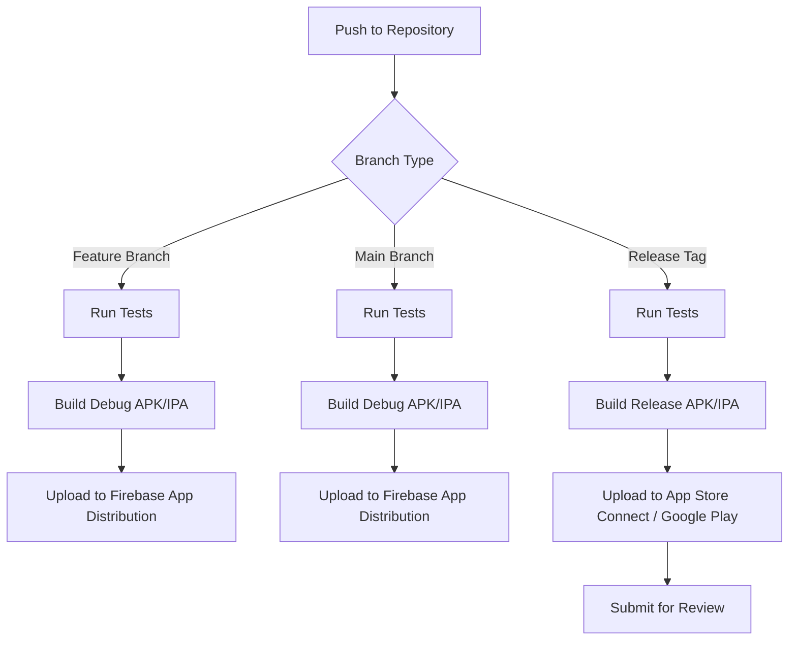
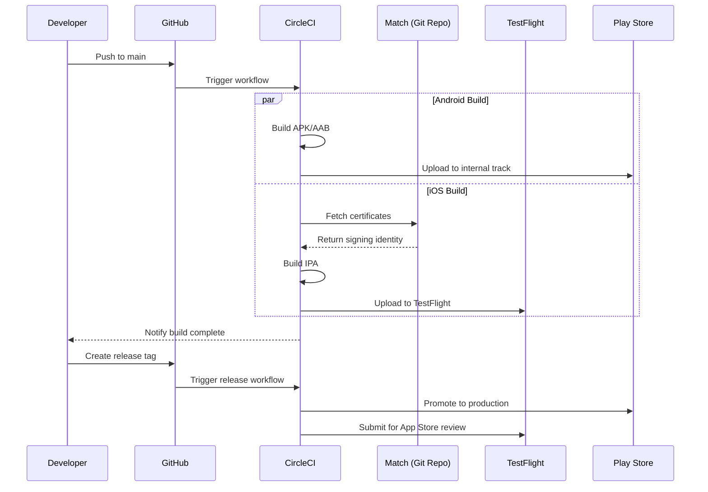
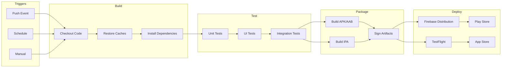

# How to Configure CircleCI for iOS/Android Builds

Author: [nawazdhandala](https://www.github.com/nawazdhandala)

Tags: CircleCI, iOS, Android, CI/CD, Mobile Development, DevOps, Fastlane, Code Signing

Description: A comprehensive guide to configuring CircleCI pipelines for iOS and Android mobile app builds, covering code signing, dependency caching, parallel testing, and release automation with Fastlane.

---

Mobile CI/CD pipelines come with unique challenges: code signing certificates, platform-specific build tools, long build times, and device simulators. CircleCI provides macOS and Linux executors that handle both iOS and Android builds in a single pipeline. Here's how to set up a production-ready mobile build system.

## Build Pipeline Architecture

Before diving into configuration, let's visualize how a typical mobile CI/CD pipeline flows through CircleCI.



## 1. Project Structure

Organize your CircleCI configuration to separate platform concerns while sharing common workflows.

```
.circleci/
  config.yml
  scripts/
    setup-android-keystore.sh
    setup-ios-signing.sh
fastlane/
  Fastfile
  Appfile
  Matchfile
```

## 2. Base Configuration with Orbs

CircleCI orbs package reusable configuration for common tasks. The following base configuration sets up both Android and iOS environments using official orbs.

```yaml
# .circleci/config.yml
version: 2.1

# Import official orbs for Android and iOS tooling
orbs:
  android: circleci/android@2.5.0
  macos: circleci/macos@2.5.0
  ruby: circleci/ruby@2.1.0

# Define parameters to control which platforms to build
parameters:
  build-ios:
    type: boolean
    default: true
  build-android:
    type: boolean
    default: true

# Reusable commands shared across jobs
commands:
  # Install and cache Ruby gems for Fastlane
  setup-fastlane:
    steps:
      - ruby/install-deps:
          key: gems-v1
          bundler-version: "2.4.0"
```

## 3. Android Build Configuration

Android builds require the Android SDK, Gradle, and proper keystore management. The executor below provides a Docker image with all Android tools pre-installed.

```yaml
# Android job configuration with caching and signing
jobs:
  android-build:
    executor:
      name: android/android-docker
      resource-class: large
      tag: 2024.01.1  # Pin to specific image version

    environment:
      # Optimize Gradle for CI environment
      GRADLE_OPTS: "-Dorg.gradle.daemon=false -Dorg.gradle.workers.max=4"
      # Limit JVM memory to prevent OOM on CI runners
      _JAVA_OPTIONS: "-Xmx3g -XX:+HeapDumpOnOutOfMemoryError"

    steps:
      - checkout

      # Restore Gradle caches from previous builds
      - restore_cache:
          keys:
            - gradle-{{ checksum "android/build.gradle" }}-{{ checksum "android/app/build.gradle" }}
            - gradle-{{ checksum "android/build.gradle" }}-
            - gradle-

      # Decode and setup the release keystore from environment variable
      - run:
          name: Setup Android Keystore
          command: |
            # Keystore is base64 encoded in CircleCI environment variables
            echo "$ANDROID_KEYSTORE_BASE64" | base64 -d > android/app/release.keystore
            # Create keystore properties file for Gradle
            cat > android/keystore.properties \<<EOF
            storeFile=release.keystore
            storePassword=$ANDROID_KEYSTORE_PASSWORD
            keyAlias=$ANDROID_KEY_ALIAS
            keyPassword=$ANDROID_KEY_PASSWORD
            EOF

      # Run unit tests before building
      - run:
          name: Run Android Unit Tests
          command: |
            cd android
            ./gradlew testReleaseUnitTest --no-daemon

      # Build the release APK and AAB
      - run:
          name: Build Android Release
          command: |
            cd android
            ./gradlew assembleRelease bundleRelease --no-daemon

      # Cache Gradle dependencies for future builds
      - save_cache:
          key: gradle-{{ checksum "android/build.gradle" }}-{{ checksum "android/app/build.gradle" }}
          paths:
            - ~/.gradle/caches
            - ~/.gradle/wrapper

      # Store build artifacts for download and deployment
      - store_artifacts:
          path: android/app/build/outputs/apk/release
          destination: apk
      - store_artifacts:
          path: android/app/build/outputs/bundle/release
          destination: aab

      # Persist artifacts for downstream jobs
      - persist_to_workspace:
          root: android/app/build/outputs
          paths:
            - apk/release/*.apk
            - bundle/release/*.aab
```

## 4. iOS Build Configuration

iOS builds require a macOS executor and proper code signing setup. Match (part of Fastlane) simplifies certificate management across team members and CI.

```yaml
# iOS job configuration with code signing via Match
jobs:
  ios-build:
    macos:
      xcode: 15.2.0  # Specify exact Xcode version
    resource_class: macos.m1.large.gen1  # Apple Silicon for faster builds

    environment:
      # Use xcpretty for readable build output
      FASTLANE_XCODEBUILD_SETTINGS_TIMEOUT: "180"
      # Disable interactive prompts
      FASTLANE_SKIP_UPDATE_CHECK: "1"

    steps:
      - checkout

      # Restore CocoaPods cache
      - restore_cache:
          keys:
            - pods-{{ checksum "ios/Podfile.lock" }}
            - pods-

      # Install Ruby dependencies (Fastlane)
      - setup-fastlane

      # Install CocoaPods dependencies
      - run:
          name: Install CocoaPods
          command: |
            cd ios
            bundle exec pod install --deployment

      # Cache CocoaPods for future builds
      - save_cache:
          key: pods-{{ checksum "ios/Podfile.lock" }}
          paths:
            - ios/Pods
            - ~/.cocoapods

      # Setup code signing using Match
      - run:
          name: Setup Code Signing
          command: |
            # Create a temporary keychain for CI
            security create-keychain -p "$KEYCHAIN_PASSWORD" build.keychain
            security default-keychain -s build.keychain
            security unlock-keychain -p "$KEYCHAIN_PASSWORD" build.keychain
            # Allow codesign to access keychain without prompts
            security set-keychain-settings -t 3600 -u build.keychain

            # Sync certificates and profiles from private git repo
            cd ios
            bundle exec fastlane match appstore --readonly

      # Run unit tests
      - run:
          name: Run iOS Tests
          command: |
            cd ios
            bundle exec fastlane scan --scheme "MyApp" --device "iPhone 15"

      # Build and archive the app
      - run:
          name: Build iOS Release
          command: |
            cd ios
            bundle exec fastlane gym \
              --scheme "MyApp" \
              --configuration "Release" \
              --export_method "app-store" \
              --output_directory "./build"

      # Store build artifacts
      - store_artifacts:
          path: ios/build
          destination: ipa

      # Persist for deployment jobs
      - persist_to_workspace:
          root: ios/build
          paths:
            - "*.ipa"
            - "*.dSYM.zip"
```

## 5. Fastlane Configuration

Fastlane automates tedious tasks like code signing, building, and deployment. The Fastfile below defines lanes for both platforms.

```ruby
# fastlane/Fastfile
default_platform(:ios)

# Shared configuration
before_all do
  # Ensure we're on a clean git state
  ensure_git_status_clean unless ENV["CI"]
end

platform :ios do
  desc "Sync code signing certificates"
  lane :certificates do
    # Match syncs certificates from a private git repository
    # Certificates are encrypted with MATCH_PASSWORD environment variable
    match(
      type: "appstore",
      app_identifier: "com.example.myapp",
      readonly: is_ci  # Never modify certs on CI
    )
  end

  desc "Run tests"
  lane :test do
    scan(
      scheme: "MyApp",
      device: "iPhone 15",
      code_coverage: true,
      output_directory: "./test_output"
    )
  end

  desc "Build and upload to TestFlight"
  lane :beta do
    certificates

    # Increment build number using CI build number
    increment_build_number(
      build_number: ENV["CIRCLE_BUILD_NUM"]
    )

    # Build the app
    gym(
      scheme: "MyApp",
      configuration: "Release",
      export_method: "app-store",
      include_symbols: true,
      include_bitcode: false
    )

    # Upload to TestFlight
    pilot(
      skip_waiting_for_build_processing: true,
      distribute_external: false
    )

    # Upload dSYMs for crash reporting
    upload_symbols_to_crashlytics(
      dsym_path: lane_context[SharedValues::DSYM_OUTPUT_PATH]
    )
  end

  desc "Deploy to App Store"
  lane :release do
    certificates

    gym(
      scheme: "MyApp",
      configuration: "Release",
      export_method: "app-store"
    )

    # Submit for App Store review
    deliver(
      submit_for_review: true,
      automatic_release: false,
      force: true  # Skip HTML preview
    )
  end
end

platform :android do
  desc "Run tests"
  lane :test do
    gradle(
      task: "test",
      build_type: "Release",
      project_dir: "./android"
    )
  end

  desc "Build and upload to Play Store internal track"
  lane :beta do
    # Build the Android App Bundle
    gradle(
      task: "bundle",
      build_type: "Release",
      project_dir: "./android",
      properties: {
        "versionCode" => ENV["CIRCLE_BUILD_NUM"]
      }
    )

    # Upload to Play Store internal testing track
    upload_to_play_store(
      track: "internal",
      aab: "./android/app/build/outputs/bundle/release/app-release.aab",
      skip_upload_metadata: true,
      skip_upload_images: true,
      skip_upload_screenshots: true
    )
  end

  desc "Promote to production"
  lane :release do
    upload_to_play_store(
      track: "internal",
      track_promote_to: "production",
      skip_upload_changelogs: false
    )
  end
end
```

## 6. Workflow Orchestration

Connect all jobs into a coherent pipeline that builds both platforms in parallel and gates deployments on test success.

```yaml
# Workflow definitions in config.yml
workflows:
  version: 2

  # Main CI/CD workflow
  build-test-deploy:
    jobs:
      # Android jobs
      - android-build:
          context: mobile-signing  # Context contains signing secrets
          filters:
            branches:
              only: /.*/

      - android-deploy-beta:
          requires:
            - android-build
          context: mobile-signing
          filters:
            branches:
              only: main

      - android-deploy-production:
          requires:
            - android-deploy-beta
          context: mobile-signing
          filters:
            branches:
              only: release

      # iOS jobs (run in parallel with Android)
      - ios-build:
          context: mobile-signing
          filters:
            branches:
              only: /.*/

      - ios-deploy-beta:
          requires:
            - ios-build
          context: mobile-signing
          filters:
            branches:
              only: main

      - ios-deploy-production:
          requires:
            - ios-deploy-beta
          context: mobile-signing
          filters:
            branches:
              only: release

  # Nightly builds for long-running tests
  nightly:
    triggers:
      - schedule:
          cron: "0 2 * * *"  # Run at 2 AM UTC
          filters:
            branches:
              only: main
    jobs:
      - android-build:
          context: mobile-signing
      - ios-build:
          context: mobile-signing
      - android-integration-tests:
          requires:
            - android-build
      - ios-integration-tests:
          requires:
            - ios-build
```

## 7. Build and Deploy Flow Visualization

Here's how the complete workflow handles a release from code push to store submission.



## 8. Environment Variables and Secrets

Store sensitive credentials in CircleCI contexts. Here's a reference for required variables.

| Variable | Platform | Description |
|----------|----------|-------------|
| `ANDROID_KEYSTORE_BASE64` | Android | Base64 encoded release keystore |
| `ANDROID_KEYSTORE_PASSWORD` | Android | Keystore password |
| `ANDROID_KEY_ALIAS` | Android | Key alias in keystore |
| `ANDROID_KEY_PASSWORD` | Android | Key password |
| `GOOGLE_PLAY_JSON_KEY` | Android | Service account JSON for Play Store API |
| `MATCH_PASSWORD` | iOS | Encryption password for Match certificates |
| `MATCH_GIT_URL` | iOS | Git URL for certificates repository |
| `APP_STORE_CONNECT_API_KEY` | iOS | App Store Connect API key JSON |
| `KEYCHAIN_PASSWORD` | iOS | Temporary keychain password for CI |

Encode the Android keystore with this command.

```bash
# Encode your release keystore for storage in CircleCI
base64 -i release.keystore -o keystore.base64
# Copy the contents of keystore.base64 to CircleCI environment variable
cat keystore.base64 | pbcopy
```

## 9. Optimizing Build Times

Long build times kill developer productivity. Apply these optimizations to cut build duration.

The following configuration enables Gradle build cache and parallel execution for Android builds.

```yaml
# Android build optimization settings
jobs:
  android-build:
    environment:
      # Enable Gradle build cache
      GRADLE_OPTS: >-
        -Dorg.gradle.caching=true
        -Dorg.gradle.parallel=true
        -Dorg.gradle.daemon=false
        -Dorg.gradle.configureondemand=true

    steps:
      # Use remote Gradle cache for shared artifacts
      - run:
          name: Configure Gradle Remote Cache
          command: |
            mkdir -p ~/.gradle
            cat > ~/.gradle/gradle.properties \<<EOF
            org.gradle.caching=true
            org.gradle.parallel=true
            android.enableBuildCache=true
            EOF
```

For iOS, enable derived data caching to skip redundant compilation.

```yaml
# iOS build optimization with derived data caching
jobs:
  ios-build:
    steps:
      # Cache Xcode derived data between builds
      - restore_cache:
          keys:
            - derived-data-{{ checksum "ios/MyApp.xcodeproj/project.pbxproj" }}
            - derived-data-

      - run:
          name: Build with Cached Derived Data
          command: |
            cd ios
            xcodebuild \
              -workspace MyApp.xcworkspace \
              -scheme MyApp \
              -derivedDataPath ~/derived-data \
              -configuration Release \
              build

      - save_cache:
          key: derived-data-{{ checksum "ios/MyApp.xcodeproj/project.pbxproj" }}
          paths:
            - ~/derived-data/Build
```

## 10. Parallel Test Execution

Split tests across multiple containers to reduce feedback time. CircleCI's test splitting feature distributes tests by timing data.

```yaml
# Parallel test execution for Android
jobs:
  android-test:
    parallelism: 4  # Run tests across 4 containers

    steps:
      - checkout

      # Collect list of test classes
      - run:
          name: Split Tests
          command: |
            cd android
            # Find all test files and split by timing
            find . -name "*Test.kt" -o -name "*Test.java" | \
              circleci tests split --split-by=timings > /tmp/tests-to-run.txt

      # Run only the assigned subset of tests
      - run:
          name: Run Tests
          command: |
            cd android
            TEST_CLASSES=$(cat /tmp/tests-to-run.txt | \
              sed 's|.*/||' | sed 's|\.kt$||' | sed 's|\.java$||' | \
              tr '\n' ',' | sed 's/,$//')
            ./gradlew test --tests "$TEST_CLASSES"

      # Store timing data for future splits
      - store_test_results:
          path: android/app/build/test-results
```

## 11. Build Status and Notifications

Integrate build status with Slack and your monitoring tools for visibility into pipeline health.

```yaml
# Notification configuration
commands:
  notify-slack:
    parameters:
      status:
        type: string
    steps:
      - run:
          name: Notify Slack
          when: always
          command: |
            STATUS="<< parameters.status >>"
            if [ "$STATUS" = "success" ]; then
              EMOJI=":white_check_mark:"
              COLOR="#36a64f"
            else
              EMOJI=":x:"
              COLOR="#ff0000"
            fi

            curl -X POST "$SLACK_WEBHOOK_URL" \
              -H "Content-Type: application/json" \
              -d "{
                \"attachments\": [{
                  \"color\": \"$COLOR\",
                  \"text\": \"$EMOJI Build ${STATUS}: ${CIRCLE_PROJECT_REPONAME} (${CIRCLE_BRANCH})\",
                  \"fields\": [
                    {\"title\": \"Job\", \"value\": \"${CIRCLE_JOB}\", \"short\": true},
                    {\"title\": \"Build\", \"value\": \"<${CIRCLE_BUILD_URL}|#${CIRCLE_BUILD_NUM}>\", \"short\": true}
                  ]
                }]
              }"
```

## 12. Complete Workflow Visualization

Here's how all the pieces fit together in a production mobile CI/CD pipeline.



## Troubleshooting Common Issues

When builds fail, check these common causes.

**iOS Code Signing Errors**: Ensure the Match password is correct and the certificates repository is accessible. Verify the provisioning profile matches the bundle identifier.

**Android Memory Issues**: Increase the Gradle daemon memory limit or disable the daemon entirely. Consider using a larger resource class.

**Cache Misses**: Verify cache keys include all relevant files that affect the build. Overly broad keys lead to stale caches while overly specific keys cause misses.

**Slow Builds**: Enable build caching, use larger resource classes, and split tests across parallel containers.

---

A well-configured CircleCI pipeline transforms mobile development from a manual, error-prone process into a streamlined delivery system. With proper caching, parallel testing, and automated signing, your team can ship iOS and Android updates with confidence.
