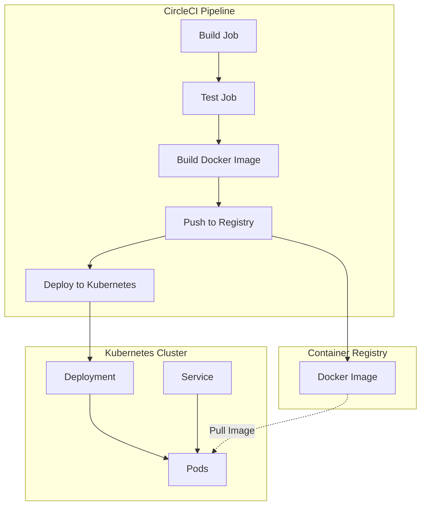
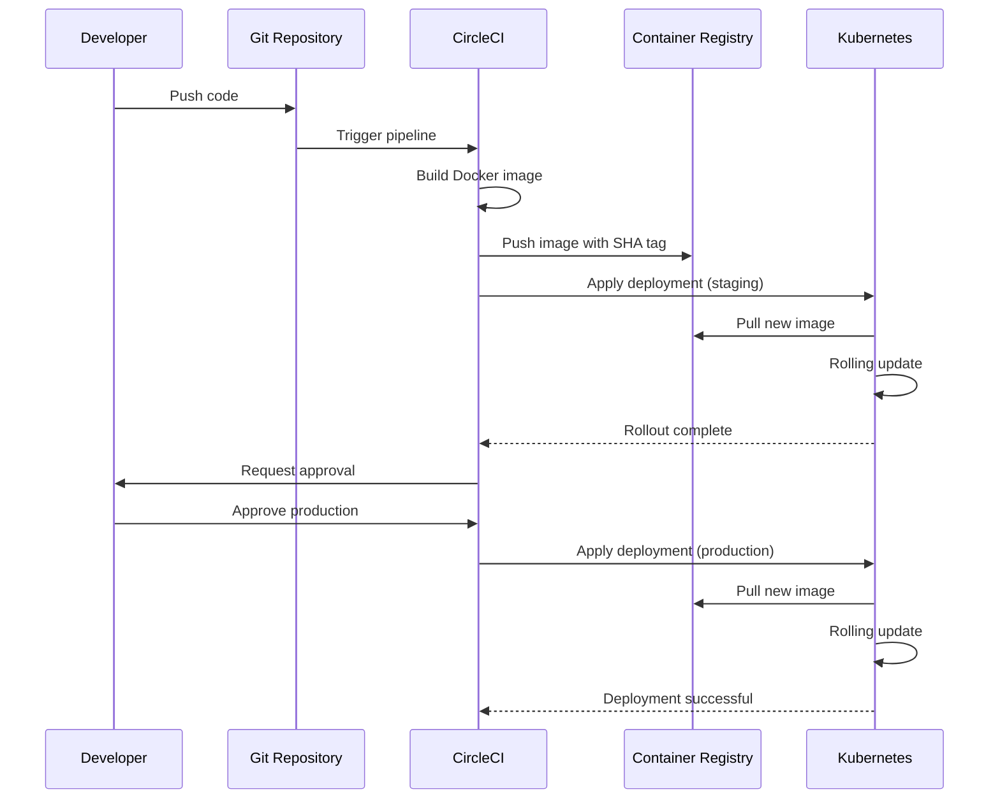

# How to Deploy to Kubernetes from CircleCI

Author: [nawazdhandala](https://www.github.com/nawazdhandala)

Tags: CircleCI, Kubernetes, CI/CD, DevOps, Containers, Deployment, Automation

Description: A hands-on guide to deploying applications to Kubernetes clusters directly from CircleCI pipelines, covering authentication, image building, rollout strategies, and production-ready configurations.

---

Deploying to Kubernetes from your CI/CD pipeline eliminates manual intervention and ensures consistent, repeatable deployments. CircleCI integrates smoothly with Kubernetes clusters, whether they run on managed services like EKS, GKE, and AKS or on self-hosted infrastructure. Here's how to set up a complete deployment pipeline from scratch.

## Deployment Architecture Overview

Before writing any configuration, let's understand how the pieces connect.



The pipeline builds your application, packages it into a container image, pushes to a registry, and then instructs Kubernetes to deploy the new version.

## Prerequisites

Make sure you have the following in place:

- A Kubernetes cluster (EKS, GKE, AKS, or self-hosted)
- A container registry (Docker Hub, ECR, GCR, or private registry)
- A CircleCI account connected to your repository
- `kubectl` access configured for your cluster

## Project Structure

Organize your project to keep deployment manifests separate from application code.

```
my-app/
├── .circleci/
│   └── config.yml
├── k8s/
│   ├── deployment.yaml
│   ├── service.yaml
│   └── configmap.yaml
├── src/
│   └── ...
├── Dockerfile
└── package.json
```

## Kubernetes Manifests

Create Kubernetes manifests that will be applied during deployment.

The deployment manifest defines how your application runs in the cluster. Notice the image placeholder that CircleCI will replace during deployment.

```yaml
# k8s/deployment.yaml
apiVersion: apps/v1
kind: Deployment
metadata:
  name: my-app
  labels:
    app: my-app
spec:
  # Number of pod replicas to maintain
  replicas: 3
  selector:
    matchLabels:
      app: my-app
  template:
    metadata:
      labels:
        app: my-app
    spec:
      containers:
        - name: my-app
          # IMAGE_TAG will be replaced by CircleCI during deployment
          image: your-registry/my-app:IMAGE_TAG
          ports:
            - containerPort: 3000
          # Resource limits prevent runaway containers
          resources:
            requests:
              memory: "128Mi"
              cpu: "100m"
            limits:
              memory: "256Mi"
              cpu: "500m"
          # Liveness probe restarts unhealthy containers
          livenessProbe:
            httpGet:
              path: /health
              port: 3000
            initialDelaySeconds: 30
            periodSeconds: 10
          # Readiness probe controls traffic routing
          readinessProbe:
            httpGet:
              path: /ready
              port: 3000
            initialDelaySeconds: 5
            periodSeconds: 5
```

The service manifest exposes your deployment within the cluster or externally.

```yaml
# k8s/service.yaml
apiVersion: v1
kind: Service
metadata:
  name: my-app
spec:
  selector:
    app: my-app
  ports:
    - protocol: TCP
      port: 80
      targetPort: 3000
  # Use LoadBalancer for external access, ClusterIP for internal only
  type: LoadBalancer
```

## CircleCI Configuration

### Basic Pipeline Structure

Start with the foundational CircleCI configuration that establishes orbs, executors, and commands.

```yaml
# .circleci/config.yml
version: 2.1

# Orbs provide pre-packaged functionality
orbs:
  # Kubernetes orb simplifies kubectl operations
  kubernetes: circleci/kubernetes@1.3.1
  # Docker orb provides Docker build and push commands
  docker: circleci/docker@2.5.0
  # AWS CLI orb for ECR authentication (if using AWS)
  aws-cli: circleci/aws-cli@4.1.2

# Executors define the build environment
executors:
  # Docker executor for building and deploying
  deploy-executor:
    docker:
      - image: cimg/base:current
    resource_class: medium

# Reusable commands reduce duplication
commands:
  # Command to install and configure kubectl
  setup-kubectl:
    description: "Install kubectl and configure cluster access"
    steps:
      - run:
          name: Install kubectl
          command: |
            # Download the latest stable kubectl binary
            curl -LO "https://dl.k8s.io/release/$(curl -L -s https://dl.k8s.io/release/stable.txt)/bin/linux/amd64/kubectl"

            # Verify the binary (optional but recommended)
            curl -LO "https://dl.k8s.io/release/$(curl -L -s https://dl.k8s.io/release/stable.txt)/bin/linux/amd64/kubectl.sha256"
            echo "$(cat kubectl.sha256)  kubectl" | sha256sum --check

            # Install kubectl to system path
            chmod +x kubectl
            sudo mv kubectl /usr/local/bin/

            # Verify installation
            kubectl version --client
      - run:
          name: Configure kubectl
          command: |
            # Decode kubeconfig from CircleCI environment variable
            # Store as base64-encoded string in CircleCI project settings
            echo "$KUBECONFIG_DATA" | base64 -d > kubeconfig.yaml
            export KUBECONFIG=$(pwd)/kubeconfig.yaml

            # Test cluster connectivity
            kubectl cluster-info
            kubectl get nodes
```

### Docker Build and Push Job

Define the job that builds your Docker image and pushes it to your registry.

```yaml
jobs:
  # Build and push Docker image to registry
  build-and-push:
    executor: deploy-executor
    steps:
      - checkout

      # Set up Docker buildx for efficient builds
      - setup_remote_docker:
          version: docker24
          docker_layer_caching: true

      - run:
          name: Build Docker image
          command: |
            # Use git SHA for unique, traceable image tags
            IMAGE_TAG="${CIRCLE_SHA1:0:7}"
            REGISTRY="${DOCKER_REGISTRY:-docker.io}"
            IMAGE_NAME="${REGISTRY}/${DOCKER_USERNAME}/my-app"

            # Build with build arguments for metadata
            docker build \
              --build-arg BUILD_DATE=$(date -u +"%Y-%m-%dT%H:%M:%SZ") \
              --build-arg VCS_REF=${CIRCLE_SHA1} \
              --build-arg VERSION=${IMAGE_TAG} \
              -t "${IMAGE_NAME}:${IMAGE_TAG}" \
              -t "${IMAGE_NAME}:latest" \
              .

            # Save image tag for later jobs
            echo "export IMAGE_TAG=${IMAGE_TAG}" >> $BASH_ENV
            echo "export FULL_IMAGE=${IMAGE_NAME}:${IMAGE_TAG}" >> $BASH_ENV

      - run:
          name: Push to registry
          command: |
            # Login to Docker registry
            echo "$DOCKER_PASSWORD" | docker login -u "$DOCKER_USERNAME" --password-stdin

            # Push both tagged and latest versions
            docker push "${DOCKER_REGISTRY}/${DOCKER_USERNAME}/my-app:${IMAGE_TAG}"
            docker push "${DOCKER_REGISTRY}/${DOCKER_USERNAME}/my-app:latest"

      # Persist image tag for downstream jobs
      - run:
          name: Save image tag
          command: echo "${IMAGE_TAG}" > /tmp/image-tag.txt

      - persist_to_workspace:
          root: /tmp
          paths:
            - image-tag.txt
```

### Deploy to Kubernetes Job

The deployment job applies your Kubernetes manifests with the new image tag.

```yaml
  # Deploy application to Kubernetes cluster
  deploy-to-k8s:
    executor: deploy-executor
    parameters:
      environment:
        type: string
        default: "staging"
      namespace:
        type: string
        default: "default"
    steps:
      - checkout

      # Restore image tag from build job
      - attach_workspace:
          at: /tmp

      - setup-kubectl

      - run:
          name: Deploy to Kubernetes
          command: |
            # Read image tag from previous job
            IMAGE_TAG=$(cat /tmp/image-tag.txt)
            NAMESPACE="<< parameters.namespace >>"
            REGISTRY="${DOCKER_REGISTRY:-docker.io}"
            FULL_IMAGE="${REGISTRY}/${DOCKER_USERNAME}/my-app:${IMAGE_TAG}"

            echo "Deploying image: ${FULL_IMAGE}"
            echo "Target namespace: ${NAMESPACE}"

            # Create namespace if it does not exist
            kubectl create namespace ${NAMESPACE} --dry-run=client -o yaml | kubectl apply -f -

            # Replace image placeholder in deployment manifest
            sed -i "s|your-registry/my-app:IMAGE_TAG|${FULL_IMAGE}|g" k8s/deployment.yaml

            # Apply all Kubernetes manifests
            kubectl apply -f k8s/ -n ${NAMESPACE}

            # Wait for deployment rollout to complete
            kubectl rollout status deployment/my-app -n ${NAMESPACE} --timeout=300s

      - run:
          name: Verify deployment
          command: |
            NAMESPACE="<< parameters.namespace >>"

            # Check pod status
            echo "Pod status:"
            kubectl get pods -n ${NAMESPACE} -l app=my-app

            # Check service endpoints
            echo "Service endpoints:"
            kubectl get svc -n ${NAMESPACE} -l app=my-app

            # Show recent events for troubleshooting
            echo "Recent events:"
            kubectl get events -n ${NAMESPACE} --sort-by='.lastTimestamp' | tail -20
```

## Complete Workflow

Wire all jobs together into a workflow with proper dependencies and approval gates.

```yaml
workflows:
  # Main deployment workflow
  build-test-deploy:
    jobs:
      # Build runs on every push
      - build-and-push:
          filters:
            branches:
              only: /.*/

      # Deploy to staging automatically on main branch
      - deploy-to-k8s:
          name: deploy-staging
          environment: staging
          namespace: staging
          requires:
            - build-and-push
          filters:
            branches:
              only: main

      # Manual approval gate before production
      - hold-for-production:
          type: approval
          requires:
            - deploy-staging
          filters:
            branches:
              only: main

      # Production deployment after approval
      - deploy-to-k8s:
          name: deploy-production
          environment: production
          namespace: production
          requires:
            - hold-for-production
          filters:
            branches:
              only: main
```

## Deployment Flow Visualization

Here's how the workflow progresses from code to production.



## Cloud Provider Specific Configurations

### Amazon EKS

For EKS clusters, use AWS credentials and update the kubeconfig dynamically.

```yaml
jobs:
  deploy-eks:
    executor: deploy-executor
    steps:
      - checkout
      - attach_workspace:
          at: /tmp

      # Install and configure AWS CLI
      - aws-cli/setup:
          role-arn: $AWS_ROLE_ARN
          role-session-name: "circleci-eks-deploy"

      - run:
          name: Configure EKS kubeconfig
          command: |
            # Update kubeconfig for EKS cluster
            aws eks update-kubeconfig \
              --name ${EKS_CLUSTER_NAME} \
              --region ${AWS_REGION}

            # Verify connectivity
            kubectl get nodes

      - run:
          name: Login to ECR
          command: |
            # Get ECR login token and authenticate Docker
            aws ecr get-login-password --region ${AWS_REGION} | \
              docker login --username AWS --password-stdin ${AWS_ACCOUNT_ID}.dkr.ecr.${AWS_REGION}.amazonaws.com

      - run:
          name: Deploy to EKS
          command: |
            IMAGE_TAG=$(cat /tmp/image-tag.txt)
            FULL_IMAGE="${AWS_ACCOUNT_ID}.dkr.ecr.${AWS_REGION}.amazonaws.com/my-app:${IMAGE_TAG}"

            # Update deployment image
            kubectl set image deployment/my-app \
              my-app=${FULL_IMAGE} \
              -n production

            # Monitor rollout
            kubectl rollout status deployment/my-app -n production --timeout=300s
```

### Google GKE

For GKE clusters, authenticate using a service account key.

```yaml
jobs:
  deploy-gke:
    executor: deploy-executor
    steps:
      - checkout
      - attach_workspace:
          at: /tmp

      - run:
          name: Setup Google Cloud SDK
          command: |
            # Install gcloud CLI
            curl -sSL https://sdk.cloud.google.com | bash
            source ~/google-cloud-sdk/path.bash.inc

            # Authenticate with service account
            echo "$GCLOUD_SERVICE_KEY" | base64 -d > gcloud-key.json
            gcloud auth activate-service-account --key-file=gcloud-key.json

            # Configure project and region
            gcloud config set project ${GCP_PROJECT_ID}
            gcloud config set compute/zone ${GCP_ZONE}

      - run:
          name: Configure GKE kubeconfig
          command: |
            # Get GKE cluster credentials
            gcloud container clusters get-credentials ${GKE_CLUSTER_NAME} \
              --zone ${GCP_ZONE} \
              --project ${GCP_PROJECT_ID}

      - run:
          name: Deploy to GKE
          command: |
            IMAGE_TAG=$(cat /tmp/image-tag.txt)
            FULL_IMAGE="gcr.io/${GCP_PROJECT_ID}/my-app:${IMAGE_TAG}"

            kubectl set image deployment/my-app \
              my-app=${FULL_IMAGE} \
              -n production

            kubectl rollout status deployment/my-app -n production --timeout=300s
```

### Azure AKS

For AKS clusters, use Azure CLI for authentication.

```yaml
jobs:
  deploy-aks:
    executor: deploy-executor
    steps:
      - checkout
      - attach_workspace:
          at: /tmp

      - run:
          name: Install Azure CLI
          command: |
            curl -sL https://aka.ms/InstallAzureCLIDeb | sudo bash

      - run:
          name: Azure login and AKS config
          command: |
            # Login with service principal
            az login --service-principal \
              --username ${AZURE_CLIENT_ID} \
              --password ${AZURE_CLIENT_SECRET} \
              --tenant ${AZURE_TENANT_ID}

            # Get AKS credentials
            az aks get-credentials \
              --resource-group ${AKS_RESOURCE_GROUP} \
              --name ${AKS_CLUSTER_NAME} \
              --overwrite-existing

      - run:
          name: Deploy to AKS
          command: |
            IMAGE_TAG=$(cat /tmp/image-tag.txt)
            FULL_IMAGE="${ACR_NAME}.azurecr.io/my-app:${IMAGE_TAG}"

            kubectl set image deployment/my-app \
              my-app=${FULL_IMAGE} \
              -n production

            kubectl rollout status deployment/my-app -n production --timeout=300s
```

## Rolling Updates and Rollback Strategies

Configure your deployment for zero-downtime updates.

```yaml
# k8s/deployment.yaml (updated with rolling update strategy)
apiVersion: apps/v1
kind: Deployment
metadata:
  name: my-app
spec:
  replicas: 3
  # Rolling update strategy configuration
  strategy:
    type: RollingUpdate
    rollingUpdate:
      # Maximum pods that can be unavailable during update
      maxUnavailable: 1
      # Maximum pods that can be created above desired count
      maxSurge: 1
  selector:
    matchLabels:
      app: my-app
  template:
    metadata:
      labels:
        app: my-app
    spec:
      containers:
        - name: my-app
          image: your-registry/my-app:IMAGE_TAG
          ports:
            - containerPort: 3000
```

Add a rollback command to handle failed deployments.

```yaml
commands:
  deploy-with-rollback:
    description: "Deploy with automatic rollback on failure"
    parameters:
      namespace:
        type: string
    steps:
      - run:
          name: Deploy with rollback capability
          command: |
            NAMESPACE="<< parameters.namespace >>"

            # Record the current revision before deployment
            CURRENT_REVISION=$(kubectl rollout history deployment/my-app -n ${NAMESPACE} | tail -2 | head -1 | awk '{print $1}')

            # Apply the new deployment
            kubectl apply -f k8s/ -n ${NAMESPACE}

            # Wait for rollout with timeout
            if ! kubectl rollout status deployment/my-app -n ${NAMESPACE} --timeout=300s; then
              echo "Deployment failed, initiating rollback..."

              # Rollback to previous revision
              kubectl rollout undo deployment/my-app -n ${NAMESPACE}

              # Wait for rollback to complete
              kubectl rollout status deployment/my-app -n ${NAMESPACE} --timeout=120s

              # Exit with error to fail the pipeline
              exit 1
            fi

            echo "Deployment successful"
```

## Secrets Management

Store sensitive data securely and inject it into your deployment.

### Using CircleCI Contexts

Navigate to **Organization Settings > Contexts** in CircleCI and create contexts for each environment.

```yaml
workflows:
  build-test-deploy:
    jobs:
      - deploy-to-k8s:
          name: deploy-production
          # Contexts provide environment variables securely
          context:
            - kubernetes-production
            - docker-credentials
          requires:
            - hold-for-production
```

### Using Kubernetes Secrets

Create Kubernetes secrets from CircleCI environment variables.

```yaml
  - run:
      name: Create Kubernetes secrets
      command: |
        NAMESPACE="production"

        # Create secret from environment variables
        kubectl create secret generic app-secrets \
          --from-literal=DATABASE_URL="${DATABASE_URL}" \
          --from-literal=API_KEY="${API_KEY}" \
          --namespace ${NAMESPACE} \
          --dry-run=client -o yaml | kubectl apply -f -
```

Reference secrets in your deployment manifest.

```yaml
# k8s/deployment.yaml
spec:
  template:
    spec:
      containers:
        - name: my-app
          image: your-registry/my-app:IMAGE_TAG
          envFrom:
            # Load all keys from the secret as environment variables
            - secretRef:
                name: app-secrets
          env:
            # Or reference individual keys
            - name: DATABASE_URL
              valueFrom:
                secretKeyRef:
                  name: app-secrets
                  key: DATABASE_URL
```

## Health Checks and Smoke Tests

Add post-deployment verification to catch issues early.

```yaml
  - run:
      name: Run smoke tests
      command: |
        NAMESPACE="<< parameters.namespace >>"

        # Wait for pods to be ready
        kubectl wait --for=condition=ready pod \
          -l app=my-app \
          -n ${NAMESPACE} \
          --timeout=120s

        # Get service endpoint
        SERVICE_IP=$(kubectl get svc my-app -n ${NAMESPACE} -o jsonpath='{.status.loadBalancer.ingress[0].ip}')

        # If using hostname instead of IP
        if [ -z "$SERVICE_IP" ]; then
          SERVICE_IP=$(kubectl get svc my-app -n ${NAMESPACE} -o jsonpath='{.status.loadBalancer.ingress[0].hostname}')
        fi

        # Run health check
        echo "Testing health endpoint at ${SERVICE_IP}"
        curl -f "http://${SERVICE_IP}/health" || exit 1

        # Run readiness check
        curl -f "http://${SERVICE_IP}/ready" || exit 1

        echo "Smoke tests passed successfully"
```

## Monitoring and Notifications

Integrate with monitoring tools to track deployment health.

```yaml
orbs:
  slack: circleci/slack@4.12.5

jobs:
  deploy-to-k8s:
    steps:
      # ... deployment steps ...

      - slack/notify:
          event: pass
          custom: |
            {
              "blocks": [
                {
                  "type": "header",
                  "text": {
                    "type": "plain_text",
                    "text": "Deployment Successful"
                  }
                },
                {
                  "type": "section",
                  "fields": [
                    {
                      "type": "mrkdwn",
                      "text": "*Environment:*\n<< parameters.environment >>"
                    },
                    {
                      "type": "mrkdwn",
                      "text": "*Image:*\n${CIRCLE_SHA1:0:7}"
                    }
                  ]
                }
              ]
            }

      - slack/notify:
          event: fail
          template: basic_fail_1
```

## Complete Configuration Reference

Here's the full configuration file bringing everything together.

```yaml
# .circleci/config.yml
version: 2.1

orbs:
  kubernetes: circleci/kubernetes@1.3.1
  docker: circleci/docker@2.5.0
  slack: circleci/slack@4.12.5

executors:
  deploy-executor:
    docker:
      - image: cimg/base:current
    resource_class: medium

commands:
  setup-kubectl:
    steps:
      - run:
          name: Install and configure kubectl
          command: |
            curl -LO "https://dl.k8s.io/release/$(curl -L -s https://dl.k8s.io/release/stable.txt)/bin/linux/amd64/kubectl"
            chmod +x kubectl && sudo mv kubectl /usr/local/bin/
            echo "$KUBECONFIG_DATA" | base64 -d > kubeconfig.yaml
            export KUBECONFIG=$(pwd)/kubeconfig.yaml

jobs:
  build-and-push:
    executor: deploy-executor
    steps:
      - checkout
      - setup_remote_docker:
          version: docker24
          docker_layer_caching: true
      - run:
          name: Build and push image
          command: |
            IMAGE_TAG="${CIRCLE_SHA1:0:7}"
            docker build -t "${DOCKER_REGISTRY}/${DOCKER_USERNAME}/my-app:${IMAGE_TAG}" .
            echo "$DOCKER_PASSWORD" | docker login -u "$DOCKER_USERNAME" --password-stdin
            docker push "${DOCKER_REGISTRY}/${DOCKER_USERNAME}/my-app:${IMAGE_TAG}"
            echo "${IMAGE_TAG}" > /tmp/image-tag.txt
      - persist_to_workspace:
          root: /tmp
          paths:
            - image-tag.txt

  deploy-to-k8s:
    executor: deploy-executor
    parameters:
      environment:
        type: string
      namespace:
        type: string
    steps:
      - checkout
      - attach_workspace:
          at: /tmp
      - setup-kubectl
      - run:
          name: Deploy
          command: |
            IMAGE_TAG=$(cat /tmp/image-tag.txt)
            sed -i "s|your-registry/my-app:IMAGE_TAG|${DOCKER_REGISTRY}/${DOCKER_USERNAME}/my-app:${IMAGE_TAG}|g" k8s/deployment.yaml
            kubectl apply -f k8s/ -n << parameters.namespace >>
            kubectl rollout status deployment/my-app -n << parameters.namespace >> --timeout=300s

workflows:
  deploy:
    jobs:
      - build-and-push
      - deploy-to-k8s:
          name: deploy-staging
          environment: staging
          namespace: staging
          requires:
            - build-and-push
          filters:
            branches:
              only: main
      - hold:
          type: approval
          requires:
            - deploy-staging
      - deploy-to-k8s:
          name: deploy-production
          environment: production
          namespace: production
          requires:
            - hold
```

## Best Practices

1. **Use immutable image tags** - Always tag images with git SHA or version numbers, never deploy `latest` in production
2. **Implement health checks** - Liveness and readiness probes catch issues before they affect users
3. **Set resource limits** - Prevent containers from consuming excessive cluster resources
4. **Use namespaces** - Isolate environments and applications within your cluster
5. **Enable rollback** - Always have a plan to revert failed deployments quickly
6. **Secure credentials** - Store kubeconfig and registry credentials in CircleCI contexts
7. **Monitor deployments** - Integrate with monitoring tools and set up alerts
8. **Test in staging first** - Never deploy directly to production without staging validation

## Troubleshooting Common Issues

### ImagePullBackOff

Check that the image exists in your registry and that Kubernetes has pull permissions.

```bash
# Verify image exists
docker pull your-registry/my-app:tag

# Check imagePullSecrets in deployment
kubectl get deployment my-app -o yaml | grep -A5 imagePullSecrets
```

### Deployment Timeout

Increase the timeout or check pod events for issues.

```bash
# Check pod events
kubectl describe pod -l app=my-app -n production

# Check deployment events
kubectl describe deployment my-app -n production
```

### Connection Refused to Cluster

Verify your kubeconfig is valid and the cluster is accessible.

```bash
# Test with verbose output
kubectl cluster-info --v=9
```

---

Deploying to Kubernetes from CircleCI brings consistency and automation to your release process. Start with a simple pipeline for staging, add approval gates for production, and gradually introduce advanced features like canary deployments and automated rollbacks as your team gains confidence.
