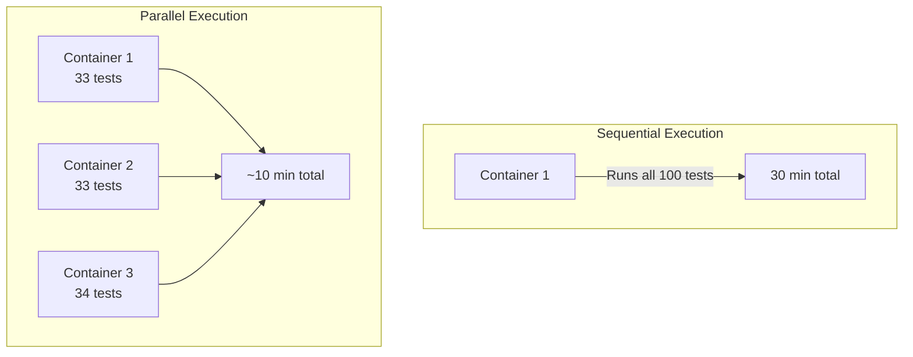
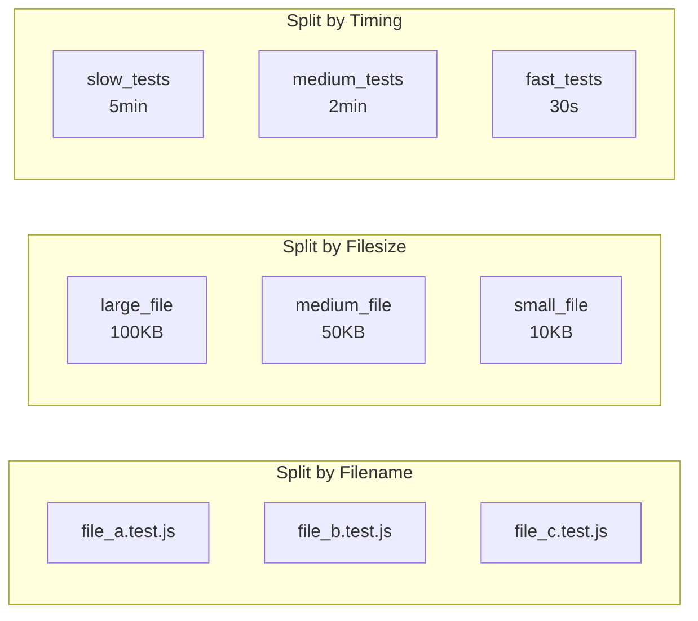
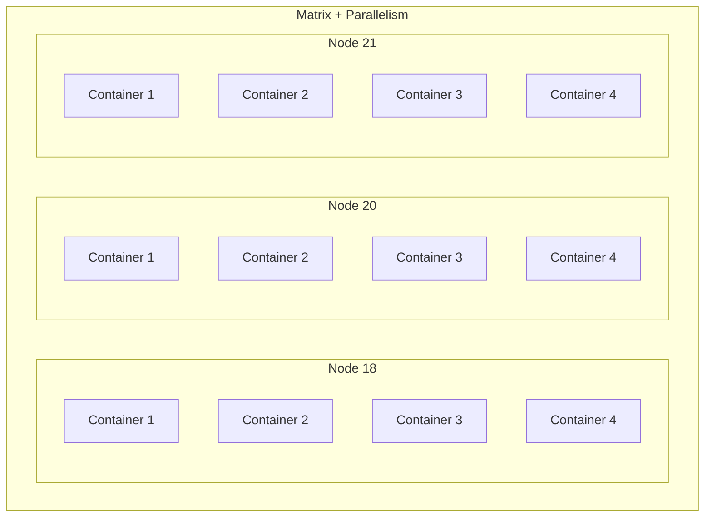
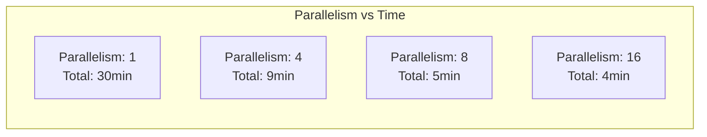
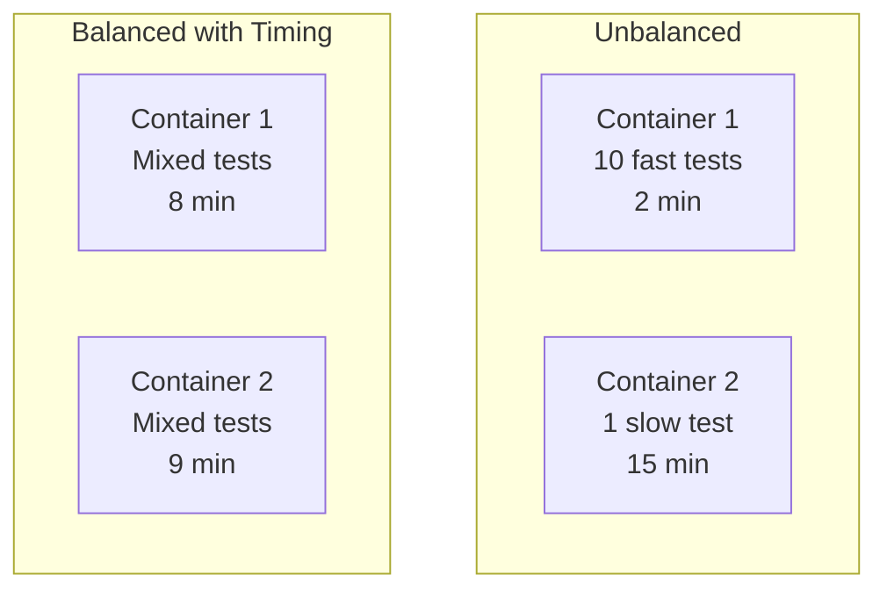

# How to Use Parallelism in CircleCI

Author: [nawazdhandala](https://www.github.com/nawazdhandala)

Tags: CircleCI, CI/CD, Parallelism, DevOps, Testing, Performance Optimization

Description: A practical guide to using parallelism in CircleCI to speed up your test suites and build pipelines. Learn how to split tests across multiple containers, configure parallelism levels, and optimize your CI/CD performance.

---

Long-running test suites are one of the most common bottlenecks in CI/CD pipelines. A test suite that takes 30 minutes to run sequentially can often be reduced to under 5 minutes with proper parallelism configuration. CircleCI provides built-in support for parallelism, allowing you to split your workload across multiple containers or executors running simultaneously. Getting parallelism right requires understanding how test splitting works, when to use it, and how to balance cost against speed.

---

## Understanding CircleCI Parallelism

Parallelism in CircleCI refers to running multiple instances of the same job simultaneously, with each instance handling a portion of the workload. Unlike workflow-level parallelism where different jobs run concurrently, job-level parallelism duplicates a single job across multiple containers.



When you set `parallelism: 3` on a job, CircleCI spins up three identical containers. Each container receives the same configuration but can be assigned a different subset of tests or tasks. The magic happens when you use CircleCI's test splitting commands to intelligently distribute work across these containers.

---

## Configuring Basic Parallelism

Setting up parallelism requires two components: specifying the parallelism level and implementing test splitting logic to divide the work.

The following configuration demonstrates a basic parallel test setup where the test suite is split across multiple containers using filename-based splitting.

```yaml
# .circleci/config.yml
# Version 2.1 provides access to parallelism features and orbs
version: 2.1

jobs:
  test:
    # Docker image for running Node.js tests
    docker:
      - image: cimg/node:20.10
    # Run 4 containers in parallel for faster test execution
    parallelism: 4
    steps:
      # Check out the repository code
      - checkout
      # Install project dependencies
      - run:
          name: Install dependencies
          command: npm ci
      # Run tests with parallel splitting based on filenames
      - run:
          name: Run tests in parallel
          command: |
            # Use circleci tests glob to find all test files
            # Then split them across the parallel containers
            TESTFILES=$(circleci tests glob "tests/**/*.test.js" |
              circleci tests split --split-by=filename)
            # Run only the tests assigned to this container
            npm test -- $TESTFILES

workflows:
  test-workflow:
    jobs:
      - test
```

Each container knows its index and the total count through environment variables `CIRCLE_NODE_INDEX` (0-based) and `CIRCLE_NODE_TOTAL`. CircleCI's `tests split` command uses these to determine which subset of files each container should process.

---

## Test Splitting Strategies

CircleCI offers three strategies for splitting tests across parallel containers. Each strategy has different strengths depending on your test suite characteristics.



### Splitting by Filename

Filename splitting is the simplest approach. It distributes files alphabetically across containers without considering execution time or file size.

```yaml
# Split tests evenly by filename (alphabetical distribution)
# Simple but may result in uneven container loads
- run:
    name: Run tests split by filename
    command: |
      # Glob pattern finds all matching test files
      TEST_FILES=$(circleci tests glob "spec/**/*_spec.rb" |
        circleci tests split --split-by=filename)

      # Pass the assigned files to your test runner
      bundle exec rspec $TEST_FILES
```

### Splitting by Filesize

Filesize splitting attempts to balance containers by assigning files so that each container processes approximately the same total bytes.

```yaml
# Split tests by filesize for more balanced distribution
# Works better when larger files tend to take longer
- run:
    name: Run tests split by filesize
    command: |
      # Filesize splitting considers the byte size of each file
      TEST_FILES=$(circleci tests glob "tests/**/*.py" |
        circleci tests split --split-by=filesize)

      pytest $TEST_FILES --junitxml=test-results/results.xml
```

### Splitting by Timing Data

Timing-based splitting provides the most balanced distribution by using historical data from previous runs. CircleCI learns how long each test takes and distributes them to minimize the longest container runtime.

```yaml
# Split tests by timing data for optimal load balancing
# Requires storing and retrieving timing data between runs
- run:
    name: Run tests with timing-based splitting
    command: |
      # Timing split uses historical data to predict execution time
      # Falls back to filename splitting if timing data unavailable
      TEST_FILES=$(circleci tests glob "tests/**/*.test.js" |
        circleci tests split --split-by=timings)

      npm test -- $TEST_FILES
# Store test results for timing data collection
- store_test_results:
    path: test-results
```

---

## Collecting and Using Timing Data

Timing-based splitting requires storing test results in JUnit XML format. CircleCI parses these files to build a historical record of how long each test file takes to run.

Below is a complete configuration that stores test results and uses timing data for optimal test splitting.

```yaml
version: 2.1

jobs:
  test:
    docker:
      - image: cimg/python:3.11
    # Higher parallelism for faster execution
    parallelism: 6
    steps:
      - checkout

      - run:
          name: Install dependencies
          command: pip install -r requirements.txt

      # Configure pytest to output JUnit XML format for timing data
      - run:
          name: Run parallel tests with timing
          command: |
            # Create directory for test results
            mkdir -p test-results

            # Split tests using timing data from previous runs
            # Falls back to name-based splitting on first run
            TESTS=$(circleci tests glob "tests/**/test_*.py" |
              circleci tests split --split-by=timings)

            # Run pytest with JUnit XML output
            # The XML file contains timing for each test case
            pytest $TESTS \
              --junitxml=test-results/junit.xml \
              -v

      # Store results so CircleCI can collect timing data
      # This data improves splitting accuracy on future runs
      - store_test_results:
          path: test-results

      # Optionally store as artifacts for debugging
      - store_artifacts:
          path: test-results

workflows:
  test-workflow:
    jobs:
      - test
```

After several runs with `store_test_results`, CircleCI accumulates enough timing data to make intelligent splitting decisions. The more runs you complete, the more accurate the predictions become.

---

## Parallelism with Different Test Frameworks

Different testing frameworks require different approaches to accept split test files. Here are configurations for popular frameworks.

### Jest (JavaScript)

Jest accepts test file paths as arguments, making integration straightforward.

```yaml
jobs:
  test-jest:
    docker:
      - image: cimg/node:20.10
    parallelism: 4
    steps:
      - checkout
      - run:
          name: Install dependencies
          command: npm ci

      # Jest configuration for parallel execution
      - run:
          name: Run Jest tests in parallel
          command: |
            # Find all test files matching Jest conventions
            TESTS=$(circleci tests glob "src/**/*.test.js" "src/**/*.spec.js" |
              circleci tests split --split-by=timings)

            # Run Jest with specific test files
            # The -- separates npm args from Jest args
            npm test -- --ci --reporters=default --reporters=jest-junit $TESTS
          environment:
            # Configure jest-junit to output results for timing data
            JEST_JUNIT_OUTPUT_DIR: test-results
            JEST_JUNIT_OUTPUT_NAME: junit.xml

      - store_test_results:
          path: test-results
```

### pytest (Python)

Pytest works well with file-based splitting and can output JUnit XML natively.

```yaml
jobs:
  test-pytest:
    docker:
      - image: cimg/python:3.11
    parallelism: 8
    steps:
      - checkout
      - run:
          name: Install dependencies
          command: |
            pip install -r requirements.txt
            pip install pytest pytest-cov

      # Pytest parallel configuration
      - run:
          name: Run pytest in parallel
          command: |
            mkdir -p test-results

            # Find test files following pytest conventions
            TESTS=$(circleci tests glob "tests/test_*.py" "tests/**/test_*.py" |
              circleci tests split --split-by=timings)

            # Run pytest with coverage and JUnit output
            pytest $TESTS \
              --cov=src \
              --cov-report=xml \
              --junitxml=test-results/junit.xml

      - store_test_results:
          path: test-results

      - store_artifacts:
          path: coverage.xml
```

### RSpec (Ruby)

RSpec requires the `rspec_junit_formatter` gem for timing data collection.

```yaml
jobs:
  test-rspec:
    docker:
      - image: cimg/ruby:3.2
    parallelism: 6
    steps:
      - checkout
      - run:
          name: Install dependencies
          command: |
            bundle install
            # Ensure junit formatter is available
            gem install rspec_junit_formatter

      # RSpec parallel configuration
      - run:
          name: Run RSpec in parallel
          command: |
            mkdir -p test-results

            # Find all spec files
            SPECS=$(circleci tests glob "spec/**/*_spec.rb" |
              circleci tests split --split-by=timings)

            # Run RSpec with JUnit formatter for timing data
            bundle exec rspec $SPECS \
              --format progress \
              --format RspecJunitFormatter \
              --out test-results/rspec.xml

      - store_test_results:
          path: test-results
```

### Go Tests

Go testing requires a slightly different approach since test splitting works at the package level.

```yaml
jobs:
  test-go:
    docker:
      - image: cimg/go:1.21
    parallelism: 4
    steps:
      - checkout

      # Go parallel testing configuration
      - run:
          name: Run Go tests in parallel
          command: |
            mkdir -p test-results

            # List all packages with tests
            PACKAGES=$(go list ./... |
              circleci tests split --split-by=timings)

            # Run tests for assigned packages
            # Use gotestsum for JUnit output
            gotestsum \
              --junitfile test-results/junit.xml \
              -- -v -race $PACKAGES

      - store_test_results:
          path: test-results
```

---

## Advanced Parallelism Patterns

Beyond basic test splitting, there are several advanced patterns that can further optimize your pipeline performance.

### Matrix Testing with Parallelism

Combine workflow-level matrix jobs with job-level parallelism for testing across multiple environments.

```yaml
version: 2.1

jobs:
  test:
    parameters:
      node-version:
        type: string
    docker:
      - image: cimg/node:<< parameters.node-version >>
    # Each matrix variant runs 4 parallel containers
    parallelism: 4
    steps:
      - checkout
      - run:
          name: Install and test
          command: |
            npm ci
            TESTS=$(circleci tests glob "tests/**/*.test.js" |
              circleci tests split --split-by=timings)
            npm test -- $TESTS
      - store_test_results:
          path: test-results

workflows:
  matrix-parallel-tests:
    jobs:
      # Run parallel tests across multiple Node versions
      # Results in 3 versions x 4 containers = 12 total containers
      - test:
          matrix:
            parameters:
              node-version: ["18.19", "20.10", "21.5"]
```



### Custom Test Splitting Logic

Sometimes the built-in splitting strategies do not fit your needs. You can implement custom splitting logic using the environment variables provided by CircleCI.

```yaml
jobs:
  custom-parallel:
    docker:
      - image: cimg/base:current
    parallelism: 5
    steps:
      - checkout

      # Custom splitting using environment variables
      - run:
          name: Custom test distribution
          command: |
            # CIRCLE_NODE_INDEX: Current container (0-based)
            # CIRCLE_NODE_TOTAL: Total number of containers

            echo "Container $CIRCLE_NODE_INDEX of $CIRCLE_NODE_TOTAL"

            # Example: Split tests by directory
            # Each container handles specific test directories
            case $CIRCLE_NODE_INDEX in
              0) TEST_DIR="tests/unit" ;;
              1) TEST_DIR="tests/integration" ;;
              2) TEST_DIR="tests/e2e" ;;
              3) TEST_DIR="tests/api" ;;
              4) TEST_DIR="tests/performance" ;;
            esac

            echo "Running tests from: $TEST_DIR"
            npm test -- --testPathPattern="$TEST_DIR"
```

### Parallelism with Resource Classes

Adjust resource allocation along with parallelism for optimal cost and performance balance.

```yaml
version: 2.1

jobs:
  # Lightweight parallel tests
  unit-tests:
    docker:
      - image: cimg/node:20.10
    # Small resource class for unit tests
    resource_class: small
    # High parallelism since each container is small
    parallelism: 8
    steps:
      - checkout
      - run:
          name: Run unit tests
          command: |
            npm ci
            TESTS=$(circleci tests glob "tests/unit/**/*.test.js" |
              circleci tests split --split-by=timings)
            npm test -- $TESTS

  # Resource-intensive parallel tests
  e2e-tests:
    docker:
      - image: cimg/node:20.10-browsers
    # Larger resource class for browser tests
    resource_class: large
    # Lower parallelism due to higher per-container resource usage
    parallelism: 4
    steps:
      - checkout
      - run:
          name: Run E2E tests
          command: |
            npm ci
            TESTS=$(circleci tests glob "tests/e2e/**/*.spec.js" |
              circleci tests split --split-by=timings)
            npx playwright test $TESTS
```

---

## Optimizing Parallelism Performance

Proper optimization requires balancing several factors: parallelism level, container startup time, test distribution, and cost.

### Finding the Optimal Parallelism Level

More parallelism is not always better. Each container has startup overhead, and at some point, adding more containers provides diminishing returns.



The configuration below includes a script to help determine optimal parallelism by analyzing historical timing data.

```yaml
jobs:
  analyze-parallelism:
    docker:
      - image: cimg/base:current
    steps:
      - checkout

      # Analyze test distribution to find optimal parallelism
      - run:
          name: Analyze test timing distribution
          command: |
            # Count total test files
            TOTAL_TESTS=$(circleci tests glob "tests/**/*.test.js" | wc -l)
            echo "Total test files: $TOTAL_TESTS"

            # Estimate optimal parallelism
            # Rule of thumb: Each container should run at least 2-3 minutes of tests
            # to offset the container startup overhead

            # If average test file takes 30 seconds
            AVG_TEST_TIME=30
            TARGET_CONTAINER_TIME=180  # 3 minutes

            OPTIMAL_PARALLELISM=$((TOTAL_TESTS * AVG_TEST_TIME / TARGET_CONTAINER_TIME))

            echo "Suggested parallelism: $OPTIMAL_PARALLELISM"
```

### Caching with Parallelism

Proper caching is essential for parallel jobs. Each container must restore the cache independently, so efficient cache usage becomes even more important.

```yaml
version: 2.1

jobs:
  parallel-with-cache:
    docker:
      - image: cimg/node:20.10
    parallelism: 6
    steps:
      - checkout

      # Restore cache before installing dependencies
      # All parallel containers use the same cache key
      - restore_cache:
          keys:
            # Primary cache key based on lock file hash
            - deps-v1-{{ checksum "package-lock.json" }}
            # Fallback to most recent cache if exact match unavailable
            - deps-v1-

      - run:
          name: Install dependencies
          command: npm ci

      # Save cache only from container 0 to avoid race conditions
      # Multiple containers saving the same cache wastes time
      - run:
          name: Save cache conditionally
          command: |
            if [ "$CIRCLE_NODE_INDEX" = "0" ]; then
              echo "Container 0: Will save cache"
            else
              echo "Container $CIRCLE_NODE_INDEX: Skipping cache save"
              circleci-agent step halt
            fi

      - save_cache:
          key: deps-v1-{{ checksum "package-lock.json" }}
          paths:
            - node_modules

      - run:
          name: Run tests
          command: |
            TESTS=$(circleci tests glob "tests/**/*.test.js" |
              circleci tests split --split-by=timings)
            npm test -- $TESTS
```

### Handling Flaky Tests in Parallel Runs

Flaky tests can cause inconsistent parallel runs. Consider isolating or retrying flaky tests.

```yaml
jobs:
  parallel-with-retries:
    docker:
      - image: cimg/node:20.10
    parallelism: 4
    steps:
      - checkout
      - run:
          name: Install dependencies
          command: npm ci

      # Run tests with automatic retry for failures
      - run:
          name: Run tests with retry
          command: |
            TESTS=$(circleci tests glob "tests/**/*.test.js" |
              circleci tests split --split-by=timings)

            # Retry failed tests up to 2 times
            # Helps handle intermittent failures without failing the build
            npm test -- $TESTS --retries=2

      # Store test results even on failure for debugging
      - store_test_results:
          path: test-results
        when: always
```

---

## Monitoring Parallel Test Performance

Understanding how your tests perform across parallel containers helps identify optimization opportunities.

```yaml
version: 2.1

jobs:
  monitored-parallel-tests:
    docker:
      - image: cimg/node:20.10
    parallelism: 6
    steps:
      - checkout
      - run:
          name: Install dependencies
          command: npm ci

      # Track timing for each parallel container
      - run:
          name: Run tests with timing
          command: |
            START_TIME=$(date +%s)

            TESTS=$(circleci tests glob "tests/**/*.test.js" |
              circleci tests split --split-by=timings)

            # Count tests assigned to this container
            TEST_COUNT=$(echo "$TESTS" | wc -w)
            echo "Container $CIRCLE_NODE_INDEX running $TEST_COUNT tests"

            npm test -- $TESTS

            END_TIME=$(date +%s)
            DURATION=$((END_TIME - START_TIME))
            echo "Container $CIRCLE_NODE_INDEX completed in ${DURATION}s"

            # Save timing for analysis
            echo "$CIRCLE_NODE_INDEX,$TEST_COUNT,$DURATION" >> timing.csv

      - store_artifacts:
          path: timing.csv

      - store_test_results:
          path: test-results
```

---

## Common Parallelism Pitfalls

Several common mistakes can reduce the effectiveness of parallel test runs or cause unexpected failures.

### Shared State Between Tests

Tests that share state can interfere with each other when run in parallel containers. Each container runs a subset of tests, and tests may run in different combinations than in sequential runs.

```yaml
# Problem: Tests share a database and may conflict
# Solution: Use container-specific test databases

jobs:
  parallel-with-isolation:
    docker:
      - image: cimg/node:20.10
      # Each container gets its own database
      - image: cimg/postgres:15.0
        environment:
          POSTGRES_DB: test_db
    parallelism: 4
    steps:
      - checkout
      - run:
          name: Configure database per container
          command: |
            # Use unique database name per container
            export DATABASE_NAME="test_db_${CIRCLE_NODE_INDEX}"

            # Create container-specific database
            psql -h localhost -U postgres -c "CREATE DATABASE $DATABASE_NAME;"

            # Run migrations
            npm run migrate

      - run:
          name: Run isolated tests
          command: |
            export DATABASE_NAME="test_db_${CIRCLE_NODE_INDEX}"
            TESTS=$(circleci tests glob "tests/**/*.test.js" |
              circleci tests split --split-by=timings)
            npm test -- $TESTS
```

### Uneven Test Distribution

When tests have vastly different execution times, simple splitting strategies can result in severely unbalanced loads.



Always use timing-based splitting when possible and ensure you store test results to build accurate timing data.

### Resource Contention

Running too many parallel containers can exhaust shared resources like database connections or API rate limits.

```yaml
jobs:
  parallel-with-limits:
    docker:
      - image: cimg/node:20.10
    parallelism: 8
    steps:
      - checkout
      - run:
          name: Configure resource limits
          command: |
            # Limit concurrent database connections per container
            export DB_POOL_SIZE=5

            # Stagger start times to avoid thundering herd
            sleep $((CIRCLE_NODE_INDEX * 2))

      - run:
          name: Run tests
          command: |
            TESTS=$(circleci tests glob "tests/**/*.test.js" |
              circleci tests split --split-by=timings)
            npm test -- $TESTS
```

---

## Cost Considerations

Parallelism increases CI/CD costs since you pay for compute time across all containers. Balance speed improvements against budget constraints.

```yaml
# Cost-optimized configuration example
# Different parallelism levels for different scenarios

version: 2.1

jobs:
  # Full parallelism for main branch
  full-parallel-tests:
    docker:
      - image: cimg/node:20.10
    resource_class: medium
    parallelism: 8
    steps:
      - checkout
      - run:
          name: Run all tests
          command: |
            npm ci
            TESTS=$(circleci tests glob "tests/**/*.test.js" |
              circleci tests split --split-by=timings)
            npm test -- $TESTS

  # Reduced parallelism for feature branches
  limited-parallel-tests:
    docker:
      - image: cimg/node:20.10
    resource_class: small
    parallelism: 3
    steps:
      - checkout
      - run:
          name: Run tests
          command: |
            npm ci
            TESTS=$(circleci tests glob "tests/**/*.test.js" |
              circleci tests split --split-by=timings)
            npm test -- $TESTS

workflows:
  cost-optimized:
    jobs:
      # High parallelism on main for fast feedback
      - full-parallel-tests:
          filters:
            branches:
              only: main

      # Lower parallelism on feature branches to save costs
      - limited-parallel-tests:
          filters:
            branches:
              ignore: main
```

---

## Complete Production Configuration

Here is a production-ready configuration that combines all the best practices covered in this guide.

```yaml
version: 2.1

# Use orbs for common functionality
orbs:
  node: circleci/node@5.2

# Reusable commands for test execution
commands:
  run-parallel-tests:
    parameters:
      test-pattern:
        type: string
      parallelism-level:
        type: integer
    steps:
      - run:
          name: Execute parallel tests
          command: |
            # Log container information for debugging
            echo "Running on container $CIRCLE_NODE_INDEX of $CIRCLE_NODE_TOTAL"

            # Split tests using timing data
            TESTS=$(circleci tests glob "<< parameters.test-pattern >>" |
              circleci tests split --split-by=timings)

            # Log test count for this container
            echo "Tests assigned to this container: $(echo $TESTS | wc -w)"

            # Run tests with coverage and JUnit output
            npm test -- \
              --ci \
              --coverage \
              --reporters=default \
              --reporters=jest-junit \
              $TESTS
          environment:
            JEST_JUNIT_OUTPUT_DIR: test-results
            JEST_JUNIT_OUTPUT_NAME: results.xml

      - store_test_results:
          path: test-results

      - store_artifacts:
          path: coverage
          destination: coverage

# Job definitions
jobs:
  # Install dependencies and cache
  install:
    docker:
      - image: cimg/node:20.10
    steps:
      - checkout
      - restore_cache:
          keys:
            - deps-v2-{{ checksum "package-lock.json" }}
            - deps-v2-
      - run:
          name: Install dependencies
          command: npm ci
      - save_cache:
          key: deps-v2-{{ checksum "package-lock.json" }}
          paths:
            - node_modules
      - persist_to_workspace:
          root: .
          paths:
            - node_modules

  # Parallel unit tests
  unit-tests:
    docker:
      - image: cimg/node:20.10
    resource_class: medium
    parallelism: 6
    steps:
      - checkout
      - attach_workspace:
          at: .
      - run-parallel-tests:
          test-pattern: "tests/unit/**/*.test.js"
          parallelism-level: 6

  # Parallel integration tests with database
  integration-tests:
    docker:
      - image: cimg/node:20.10
      - image: cimg/postgres:15.0
        environment:
          POSTGRES_USER: test
          POSTGRES_PASSWORD: test
          POSTGRES_DB: testdb
    resource_class: large
    parallelism: 4
    steps:
      - checkout
      - attach_workspace:
          at: .
      - run:
          name: Wait for database
          command: dockerize -wait tcp://localhost:5432 -timeout 60s
      - run:
          name: Setup test database
          command: npm run db:migrate
      - run-parallel-tests:
          test-pattern: "tests/integration/**/*.test.js"
          parallelism-level: 4

# Workflow orchestration
workflows:
  test-pipeline:
    jobs:
      - install

      # Run unit and integration tests in parallel after install
      - unit-tests:
          requires:
            - install

      - integration-tests:
          requires:
            - install
```

---

## Conclusion

Parallelism in CircleCI transforms slow test suites into fast, efficient pipelines. The key points to remember:

- **Start with timing-based splitting** for the best test distribution across containers
- **Store test results** in JUnit format to build accurate timing data over time
- **Balance parallelism level** against container startup overhead and cost
- **Handle shared state carefully** to avoid test interference across containers
- **Monitor performance** to identify optimization opportunities

A well-tuned parallel test configuration can reduce CI/CD times by 80% or more, providing faster feedback and enabling more frequent deployments. Start with conservative parallelism levels and increase gradually while monitoring both performance improvements and cost impacts.

---

*Looking for comprehensive CI/CD monitoring? [OneUptime](https://oneuptime.com) provides pipeline observability, helping you track build times, identify bottlenecks, and ensure your CI/CD infrastructure remains reliable.*

**Related Reading:**
- [How to Create CircleCI Workflows](https://oneuptime.com/blog/post/2026-02-02-circleci-workflows/view)
