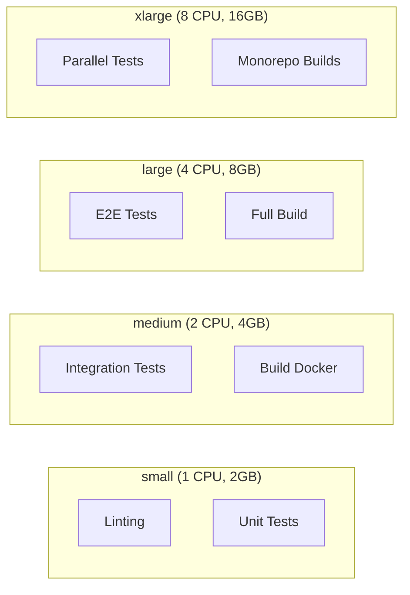
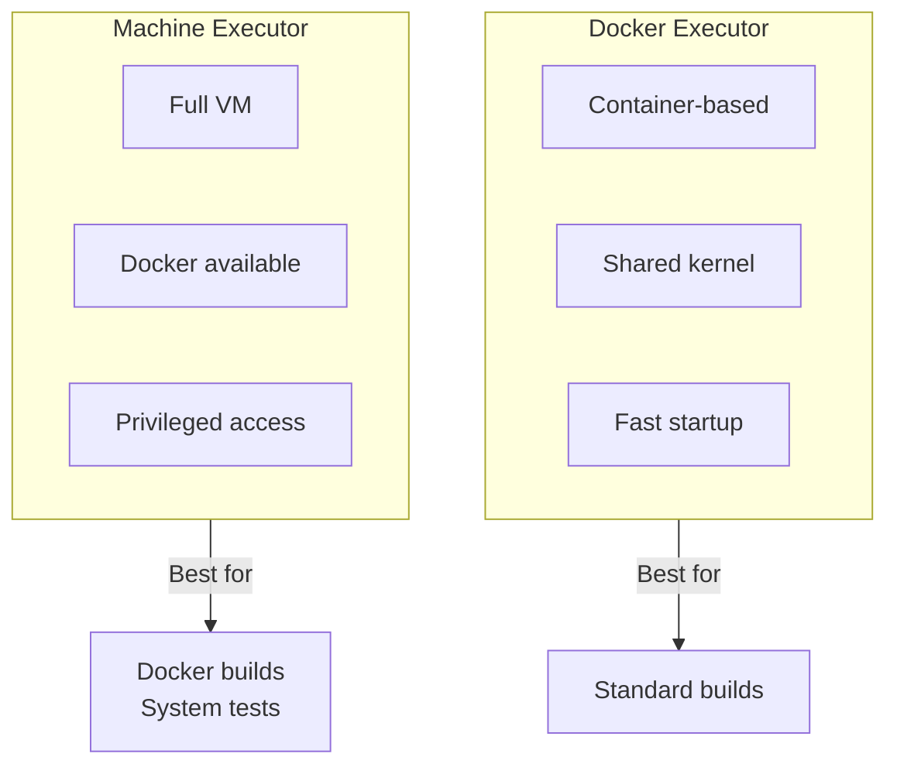
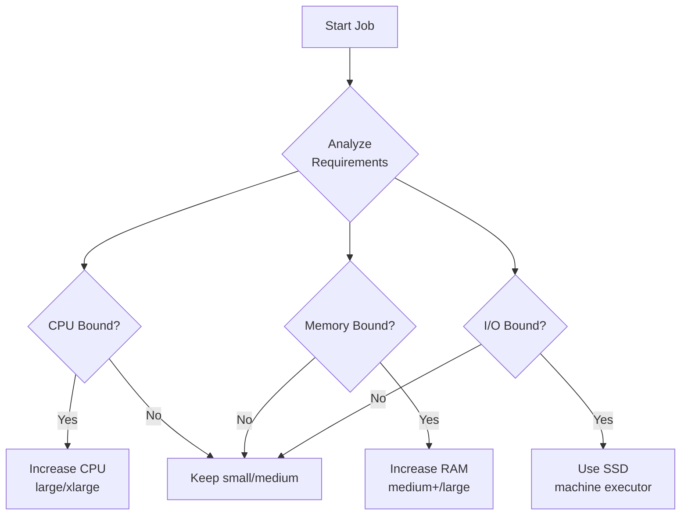
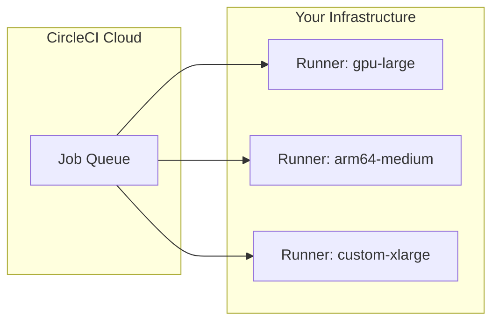

# How to Implement CircleCI Resource Classes

Author: [nawazdhandala](https://www.github.com/nawazdhandala)

Tags: CircleCI, CI/CD, DevOps, Resource Management, Build Optimization, Performance

Description: A practical guide to implementing CircleCI resource classes for optimizing build performance, managing costs, and scaling your CI/CD pipelines effectively.

---

Build times matter. When your CI pipeline takes 20 minutes instead of 5, developers context-switch, productivity drops, and frustration builds. CircleCI resource classes give you direct control over the compute power allocated to your jobs, letting you balance speed against cost based on actual workload requirements.

## What Are Resource Classes?

Resource classes define the CPU and memory allocated to each job in your CircleCI pipeline. Instead of one-size-fits-all executors, you pick the right-sized machine for each task.



### Available Resource Classes

CircleCI offers different resource classes for Docker, Linux, macOS, and Windows executors:

| Resource Class | vCPUs | RAM | Best For |
|---------------|-------|-----|----------|
| small | 1 | 2GB | Linting, simple scripts |
| medium | 2 | 4GB | Standard builds, unit tests |
| medium+ | 3 | 6GB | Moderate compilation |
| large | 4 | 8GB | Integration tests, Docker builds |
| xlarge | 8 | 16GB | Parallel test suites |
| 2xlarge | 16 | 32GB | Large monorepo builds |
| 2xlarge+ | 20 | 40GB | Memory-intensive workloads |

## Basic Configuration

You specify resource classes in your `.circleci/config.yml` file. The resource_class key goes inside the executor or job definition.

The following configuration shows a simple job using the medium resource class for a standard Node.js build:

```yaml
version: 2.1

jobs:
  build:
    docker:
      - image: cimg/node:18.17
    # Assign the medium resource class for balanced CPU and memory
    resource_class: medium
    steps:
      - checkout
      - run: npm ci
      - run: npm run build
```

### Multiple Jobs with Different Resources

Different jobs have different needs. Allocate resources based on actual requirements rather than using the same class everywhere.

Here we define three jobs with appropriately sized resource classes - small for fast linting, medium for compilation, and large for running the full test suite:

```yaml
version: 2.1

jobs:
  # Linting requires minimal resources - keep costs low
  lint:
    docker:
      - image: cimg/node:18.17
    resource_class: small
    steps:
      - checkout
      - run: npm ci
      - run: npm run lint

  # Building requires more CPU for compilation
  build:
    docker:
      - image: cimg/node:18.17
    resource_class: medium
    steps:
      - checkout
      - run: npm ci
      - run: npm run build
      - persist_to_workspace:
          root: .
          paths:
            - dist

  # Testing benefits from additional CPU cores for parallelization
  test:
    docker:
      - image: cimg/node:18.17
    resource_class: large
    steps:
      - checkout
      - run: npm ci
      - run: npm run test:ci

workflows:
  build-and-test:
    jobs:
      - lint
      - build
      - test:
          requires:
            - lint
```

## Using Executors for Reusability

Executors let you define resource configurations once and reuse them across jobs. Keep your config DRY while maintaining consistent resource allocation.

The executor definitions below create reusable configurations that standardize resource allocation across your organization:

```yaml
version: 2.1

# Define reusable executors with preset resource classes
executors:
  # Lightweight executor for simple operations
  node-small:
    docker:
      - image: cimg/node:18.17
    resource_class: small
    working_directory: ~/project

  # Standard executor for most build operations
  node-medium:
    docker:
      - image: cimg/node:18.17
    resource_class: medium
    working_directory: ~/project

  # Heavy-duty executor for resource-intensive tasks
  node-large:
    docker:
      - image: cimg/node:18.17
    resource_class: large
    working_directory: ~/project

jobs:
  lint:
    executor: node-small
    steps:
      - checkout
      - run: npm ci
      - run: npm run lint

  build:
    executor: node-medium
    steps:
      - checkout
      - run: npm ci
      - run: npm run build

  integration-tests:
    executor: node-large
    steps:
      - checkout
      - run: npm ci
      - run: npm run test:integration
```

## Machine Executors with Resource Classes

Machine executors provide full Linux VMs. Use them when you need Docker-in-Docker, privileged operations, or specific kernel features.



Machine executors require explicit resource class specification with the machine prefix. Use these for building Docker images or running system-level tests:

```yaml
version: 2.1

jobs:
  # Building Docker images works best in machine executors
  build-docker:
    machine:
      image: ubuntu-2204:current
    # Machine executor resource classes use different naming
    resource_class: large
    steps:
      - checkout
      - run:
          name: Build Docker image
          command: |
            # Log in to container registry
            echo "$DOCKER_PASSWORD" | docker login -u "$DOCKER_USERNAME" --password-stdin

            # Build with BuildKit for better caching
            DOCKER_BUILDKIT=1 docker build -t myapp:$CIRCLE_SHA1 .

            # Push to registry
            docker push myapp:$CIRCLE_SHA1

  # System-level testing requiring VM access
  system-tests:
    machine:
      image: ubuntu-2204:current
    resource_class: xlarge
    steps:
      - checkout
      - run:
          name: Start test infrastructure
          command: docker compose up -d
      - run:
          name: Run system tests
          command: ./scripts/run-system-tests.sh
      - run:
          name: Cleanup
          command: docker compose down
```

## Parallelism with Resource Classes

Combine resource classes with CircleCI's parallelism feature to split tests across multiple containers. Larger resource classes handle parallel execution better.

The configuration below demonstrates running tests in parallel across 4 containers, each with sufficient resources to handle its test subset:

```yaml
version: 2.1

jobs:
  test:
    docker:
      - image: cimg/node:18.17
      # Database container for integration tests
      - image: cimg/postgres:14.0
        environment:
          POSTGRES_USER: test
          POSTGRES_DB: testdb
    # Large class handles parallel test execution better
    resource_class: large
    # Split tests across 4 parallel containers
    parallelism: 4
    steps:
      - checkout
      - run: npm ci
      - run:
          name: Run tests with parallelism
          command: |
            # Use CircleCI's test splitting to distribute tests
            TESTFILES=$(circleci tests glob "src/**/*.test.ts" | circleci tests split --split-by=timings)
            npm run test -- $TESTFILES
      - store_test_results:
          path: test-results
```

## Cost Optimization Strategies

Resource classes directly impact your CircleCI bill. Optimize by matching resources to actual needs.



### Strategy 1: Right-Size Each Job

Audit your jobs to find resource waste. Check CPU and memory utilization in CircleCI's job insights.

Use conditional resource allocation based on the branch - feature branches get smaller resources while main branches warrant faster builds:

```yaml
version: 2.1

# Use parameters to adjust resources based on context
parameters:
  resource-tier:
    type: enum
    enum: [small, medium, large]
    default: medium

jobs:
  build:
    docker:
      - image: cimg/node:18.17
    # Parameterized resource class for flexibility
    resource_class: << pipeline.parameters.resource-tier >>
    steps:
      - checkout
      - run: npm ci
      - run: npm run build

workflows:
  # Feature branch builds use smaller resources
  feature-build:
    when:
      not:
        equal: [main, << pipeline.git.branch >>]
    jobs:
      - build:
          resource-tier: small

  # Main branch builds get more resources for speed
  main-build:
    when:
      equal: [main, << pipeline.git.branch >>]
    jobs:
      - build:
          resource-tier: large
```

### Strategy 2: Caching to Reduce Resource Needs

Effective caching reduces build time, allowing you to use smaller resource classes while maintaining acceptable speeds.

Proper caching of dependencies and build artifacts can cut build times significantly, making smaller resource classes viable:

```yaml
version: 2.1

jobs:
  build:
    docker:
      - image: cimg/node:18.17
    # Medium is sufficient with good caching
    resource_class: medium
    steps:
      - checkout

      # Restore dependencies from cache
      - restore_cache:
          keys:
            # Try exact match first
            - npm-deps-v1-{{ checksum "package-lock.json" }}
            # Fall back to most recent cache
            - npm-deps-v1-

      - run:
          name: Install dependencies
          command: npm ci

      # Save dependencies to cache
      - save_cache:
          key: npm-deps-v1-{{ checksum "package-lock.json" }}
          paths:
            - node_modules

      # Restore build cache
      - restore_cache:
          keys:
            - build-cache-v1-{{ .Branch }}-{{ checksum "src/**/*" }}
            - build-cache-v1-{{ .Branch }}-
            - build-cache-v1-

      - run: npm run build

      - save_cache:
          key: build-cache-v1-{{ .Branch }}-{{ checksum "src/**/*" }}
          paths:
            - dist
            - .next/cache
```

### Strategy 3: Conditional Resource Allocation

Use different resources based on the type of change. Documentation updates don't need the same power as code changes.

Path filtering lets you skip expensive builds when only documentation or configuration files change:

```yaml
version: 2.1

# Orb for path filtering
orbs:
  path-filtering: circleci/path-filtering@1.0.0

jobs:
  # Quick build for docs-only changes
  docs-build:
    docker:
      - image: cimg/node:18.17
    resource_class: small
    steps:
      - checkout
      - run: npm ci
      - run: npm run docs:build

  # Full build for code changes
  full-build:
    docker:
      - image: cimg/node:18.17
    resource_class: large
    steps:
      - checkout
      - run: npm ci
      - run: npm run build
      - run: npm run test

workflows:
  path-filtered:
    jobs:
      - path-filtering/filter:
          base-revision: main
          mapping: |
            docs/.* docs-build true
            src/.* full-build true
            .*\.md docs-build true
```

## Self-Hosted Runner Resource Classes

Self-hosted runners let you define custom resource classes that match your infrastructure.



### Setting Up Self-Hosted Runners

Install the CircleCI runner agent on your infrastructure and assign custom resource class names:

```yaml
# Runner configuration on your server
# /etc/circleci-runner/config.yaml
api:
  auth_token: YOUR_RUNNER_TOKEN

runner:
  name: gpu-runner-01
  # Define your custom resource class
  resource_class: myorg/gpu-large
  working_directory: /var/lib/circleci-runner/workdir
  cleanup_working_directory: true
```

Reference self-hosted runners in your CircleCI config with the organization-prefixed resource class name:

```yaml
version: 2.1

jobs:
  # GPU-accelerated ML training job
  train-model:
    machine: true
    # Reference your self-hosted runner's resource class
    resource_class: myorg/gpu-large
    steps:
      - checkout
      - run:
          name: Install dependencies
          command: pip install -r requirements.txt
      - run:
          name: Train model
          command: python train.py --epochs 100
      - store_artifacts:
          path: models/

  # ARM-based builds for multi-arch support
  build-arm:
    machine: true
    resource_class: myorg/arm64-medium
    steps:
      - checkout
      - run: docker build --platform linux/arm64 -t myapp:arm64 .
```

## Monitoring Resource Usage

Track resource utilization to identify optimization opportunities. CircleCI provides job insights showing CPU and memory usage.

### Create a Resource Audit Job

Add a job that logs resource information for later analysis:

```yaml
version: 2.1

jobs:
  resource-audit:
    docker:
      - image: cimg/base:current
    resource_class: medium
    steps:
      - run:
          name: Log resource information
          command: |
            # Capture CPU info
            echo "=== CPU Information ==="
            nproc
            cat /proc/cpuinfo | grep "model name" | head -1

            # Capture memory info
            echo "=== Memory Information ==="
            free -h

            # Capture disk info
            echo "=== Disk Information ==="
            df -h
      - run:
          name: Monitor resource usage during build
          background: true
          command: |
            # Log resource usage every 10 seconds
            while true; do
              echo "$(date): CPU: $(top -bn1 | grep 'Cpu(s)' | awk '{print $2}')% MEM: $(free | grep Mem | awk '{printf("%.1f%%", $3/$2 * 100.0)}')"
              sleep 10
            done
      - checkout
      - run: npm ci
      - run: npm run build
```

## Complete Production Configuration

Here's a full configuration demonstrating resource class best practices for a typical production application:

```yaml
version: 2.1

# Reusable executor definitions
executors:
  # Minimal executor for fast jobs
  node-light:
    docker:
      - image: cimg/node:18.17
    resource_class: small
    working_directory: ~/project
    environment:
      NODE_ENV: test

  # Standard executor for most operations
  node-standard:
    docker:
      - image: cimg/node:18.17
    resource_class: medium
    working_directory: ~/project
    environment:
      NODE_ENV: test

  # High-performance executor for intensive tasks
  node-performance:
    docker:
      - image: cimg/node:18.17
      - image: cimg/postgres:14.0
        environment:
          POSTGRES_USER: test
          POSTGRES_DB: app_test
      - image: cimg/redis:7.0
    resource_class: large
    working_directory: ~/project
    environment:
      NODE_ENV: test
      DATABASE_URL: postgresql://test@localhost/app_test
      REDIS_URL: redis://localhost:6379

# Reusable commands
commands:
  setup-node:
    description: Install Node dependencies with caching
    steps:
      - checkout
      - restore_cache:
          keys:
            - npm-v1-{{ checksum "package-lock.json" }}
            - npm-v1-
      - run: npm ci
      - save_cache:
          key: npm-v1-{{ checksum "package-lock.json" }}
          paths:
            - node_modules

jobs:
  # Quick quality checks
  lint-and-typecheck:
    executor: node-light
    steps:
      - setup-node
      - run:
          name: Run ESLint
          command: npm run lint
      - run:
          name: Run TypeScript compiler
          command: npm run typecheck

  # Security vulnerability scanning
  security-scan:
    executor: node-light
    steps:
      - setup-node
      - run:
          name: Audit dependencies
          command: npm audit --audit-level=high
      - run:
          name: Run Snyk scan
          command: npx snyk test

  # Unit tests - moderate resources
  unit-tests:
    executor: node-standard
    steps:
      - setup-node
      - run:
          name: Run unit tests
          command: npm run test:unit -- --coverage
      - store_test_results:
          path: test-results/unit
      - store_artifacts:
          path: coverage

  # Integration tests - need database and more CPU
  integration-tests:
    executor: node-performance
    parallelism: 4
    steps:
      - setup-node
      - run:
          name: Wait for services
          command: |
            dockerize -wait tcp://localhost:5432 -timeout 60s
            dockerize -wait tcp://localhost:6379 -timeout 60s
      - run:
          name: Run database migrations
          command: npm run db:migrate
      - run:
          name: Run integration tests
          command: |
            TESTFILES=$(circleci tests glob "tests/integration/**/*.test.ts" | circleci tests split)
            npm run test:integration -- $TESTFILES
      - store_test_results:
          path: test-results/integration

  # E2E tests - maximum resources
  e2e-tests:
    docker:
      - image: cimg/node:18.17-browsers
    resource_class: xlarge
    parallelism: 3
    steps:
      - setup-node
      - run:
          name: Run E2E tests
          command: |
            TESTFILES=$(circleci tests glob "tests/e2e/**/*.spec.ts" | circleci tests split --split-by=timings)
            npm run test:e2e -- $TESTFILES
      - store_test_results:
          path: test-results/e2e
      - store_artifacts:
          path: tests/e2e/screenshots
          when: on_fail

  # Production build
  build:
    executor: node-standard
    steps:
      - setup-node
      - run:
          name: Build application
          command: npm run build
      - persist_to_workspace:
          root: .
          paths:
            - dist
            - package.json
            - package-lock.json

  # Docker image build - use machine executor
  docker-build:
    machine:
      image: ubuntu-2204:current
    resource_class: large
    steps:
      - checkout
      - attach_workspace:
          at: .
      - run:
          name: Build and push Docker image
          command: |
            echo "$DOCKER_PASSWORD" | docker login -u "$DOCKER_USERNAME" --password-stdin

            docker build \
              --build-arg BUILD_DATE=$(date -u +'%Y-%m-%dT%H:%M:%SZ') \
              --build-arg VERSION=$CIRCLE_TAG \
              --build-arg COMMIT=$CIRCLE_SHA1 \
              -t myorg/myapp:$CIRCLE_SHA1 \
              -t myorg/myapp:latest \
              .

            docker push myorg/myapp:$CIRCLE_SHA1
            docker push myorg/myapp:latest

  # Deploy to staging
  deploy-staging:
    docker:
      - image: cimg/base:current
    resource_class: small
    steps:
      - run:
          name: Deploy to staging
          command: |
            curl -X POST "$DEPLOY_WEBHOOK_URL" \
              -H "Authorization: Bearer $DEPLOY_TOKEN" \
              -d "{\"image\": \"myorg/myapp:$CIRCLE_SHA1\", \"env\": \"staging\"}"

workflows:
  # Run on every push
  build-test-deploy:
    jobs:
      # Fast feedback - run in parallel
      - lint-and-typecheck
      - security-scan
      - unit-tests

      # Integration tests after lint passes
      - integration-tests:
          requires:
            - lint-and-typecheck

      # E2E tests in parallel with integration
      - e2e-tests:
          requires:
            - lint-and-typecheck

      # Build after all tests pass
      - build:
          requires:
            - unit-tests
            - integration-tests
            - e2e-tests

      # Docker build on main branch only
      - docker-build:
          requires:
            - build
          filters:
            branches:
              only: main

      # Auto-deploy to staging
      - deploy-staging:
          requires:
            - docker-build
          filters:
            branches:
              only: main
```

## Resource Class Selection Guide

Use the decision matrix below to select appropriate resource classes:

| Job Type | Recommended Class | Rationale |
|----------|------------------|-----------|
| Linting/formatting | small | CPU-light, fast execution |
| Type checking | small/medium | Memory-dependent |
| Unit tests | medium | Balanced requirements |
| Integration tests | large | Database connections, parallelism |
| E2E tests | large/xlarge | Browser automation overhead |
| Docker builds | large (machine) | CPU-intensive, layer caching |
| Monorepo builds | xlarge/2xlarge | Multiple projects, parallelism |
| ML training | Self-hosted GPU | Specialized hardware |

## Troubleshooting Common Issues

**Job fails with OOM (Out of Memory)**
- Upgrade to a larger resource class
- Optimize memory usage in your application
- Split the job into smaller tasks

**Build times inconsistent**
- Check if you're hitting resource limits
- Review caching effectiveness
- Consider dedicated resource classes

**Self-hosted runner not picking up jobs**
- Verify the resource_class name matches exactly
- Check runner agent logs for connection issues
- Ensure the runner has capacity

---

Resource classes give you fine-grained control over your CI/CD infrastructure costs and performance. Start by auditing your current jobs, identify bottlenecks, and right-size each step. The initial investment in configuration pays dividends in faster builds and lower bills.
