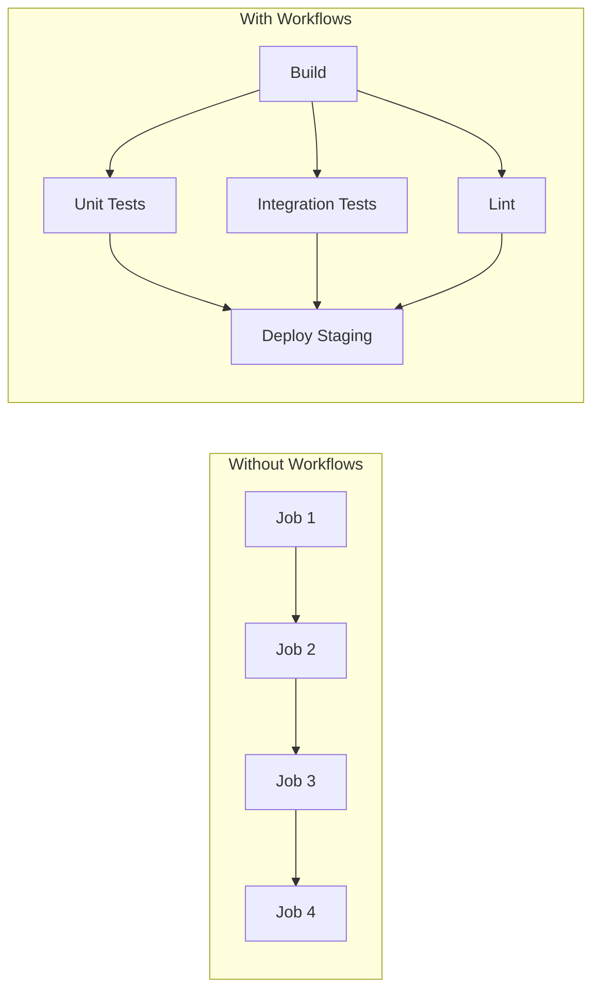
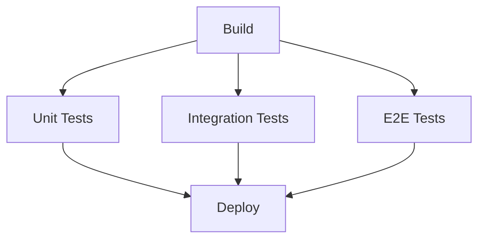
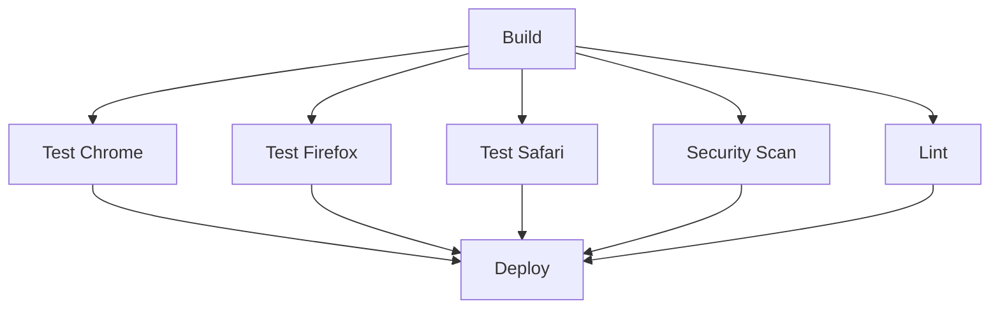
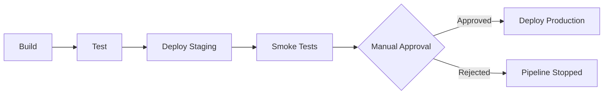
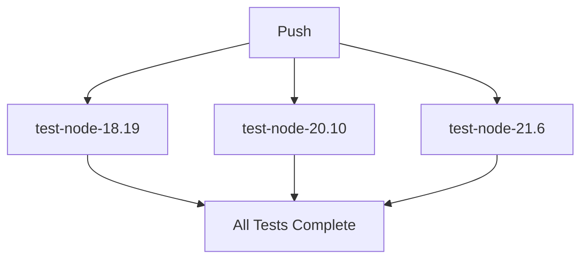
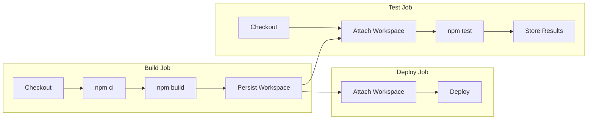
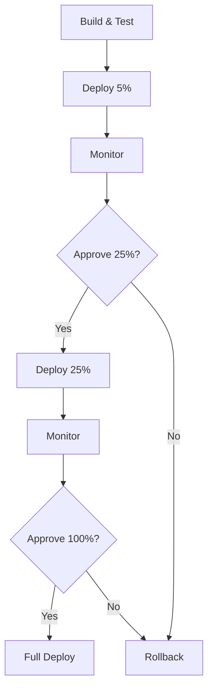

# How to Create CircleCI Workflows

Author: [nawazdhandala](https://www.github.com/nawazdhandala)

Tags: CircleCI, CI/CD, Workflows, DevOps

Description: A comprehensive guide to creating CircleCI workflows with parallel jobs, sequential dependencies, approval gates, scheduled triggers, and advanced orchestration patterns.

---

CircleCI workflows provide a powerful way to orchestrate multiple jobs in your CI/CD pipeline. Unlike simple sequential builds, workflows let you define complex relationships between jobs, run tasks in parallel, add manual approval gates, and trigger pipelines on schedules. This guide covers everything you need to know about creating effective CircleCI workflows, from basic concepts to advanced patterns used in production environments.

## What Are CircleCI Workflows?

A workflow is a set of rules that defines how jobs should run in relation to each other. While jobs contain the actual steps that execute your code, workflows determine the order, conditions, and dependencies between those jobs.



Without workflows, jobs run sequentially one after another. With workflows, you can run independent jobs in parallel, significantly reducing your total pipeline time.

## Creating Your First Workflow

Let's start with a basic workflow configuration. CircleCI configuration files live in `.circleci/config.yml` at the root of your repository.

The following configuration demonstrates a simple workflow with two jobs where the test job depends on the build job completing successfully.

```yaml
# .circleci/config.yml
# Version 2.1 is required for workflow features and orbs support
version: 2.1

# Define the jobs that will be orchestrated by workflows
jobs:
  # Build job compiles the application
  build:
    docker:
      # Use CircleCI's convenience image with Node.js pre-installed
      - image: cimg/node:20.10
    steps:
      # Check out the source code from the repository
      - checkout
      # Install dependencies using npm ci for reproducible builds
      - run:
          name: Install dependencies
          command: npm ci
      # Build the application for production
      - run:
          name: Build application
          command: npm run build
      # Save the build output for use in downstream jobs
      - persist_to_workspace:
          root: .
          paths:
            - dist
            - node_modules

  # Test job runs the test suite
  test:
    docker:
      - image: cimg/node:20.10
    steps:
      - checkout
      # Retrieve the workspace saved by the build job
      - attach_workspace:
          at: .
      # Execute the test suite
      - run:
          name: Run tests
          command: npm test

# Workflows section defines how jobs relate to each other
workflows:
  # Name your workflow descriptively
  build-and-test:
    jobs:
      # Build job runs first with no dependencies
      - build
      # Test job waits for build to complete
      - test:
          requires:
            - build
```

## Understanding Workflow Orchestration

Workflows support several orchestration patterns that help you design efficient pipelines.

### Parallel Job Execution

When jobs do not depend on each other, running them in parallel saves time. This is one of the most impactful optimizations you can make.

The following example runs three different test suites concurrently after the build completes.

```yaml
# Parallel execution runs multiple independent jobs simultaneously
# This reduces total pipeline time significantly
workflows:
  parallel-testing:
    jobs:
      - build
      # All three test jobs start as soon as build completes
      # They run in parallel, not sequentially
      - unit-tests:
          requires:
            - build
      - integration-tests:
          requires:
            - build
      - e2e-tests:
          requires:
            - build
```



### Sequential Job Dependencies

Sometimes jobs must run in a specific order. Use the `requires` key to create sequential dependencies.

This configuration ensures jobs run in a strict sequence where each job waits for the previous one to complete.

```yaml
# Sequential workflow ensures strict ordering
# Each job waits for its dependencies before starting
workflows:
  sequential-pipeline:
    jobs:
      - checkout-code
      - install-dependencies:
          requires:
            - checkout-code
      - build:
          requires:
            - install-dependencies
      - test:
          requires:
            - build
      - deploy:
          requires:
            - test
```

### Fan-Out and Fan-In Patterns

Complex workflows often combine parallel and sequential execution. The fan-out/fan-in pattern is particularly useful for running multiple parallel jobs that must all complete before continuing.

The following example demonstrates how to fan out to multiple jobs and then fan in to a single deployment job.

```yaml
# Fan-out/fan-in pattern maximizes parallelism while ensuring
# all required jobs complete before deployment
workflows:
  fan-out-fan-in:
    jobs:
      # Single build job fans out to multiple test jobs
      - build

      # Fan-out: Multiple jobs run in parallel
      - test-chrome:
          requires:
            - build
      - test-firefox:
          requires:
            - build
      - test-safari:
          requires:
            - build
      - security-scan:
          requires:
            - build
      - lint:
          requires:
            - build

      # Fan-in: Single job waits for all parallel jobs
      - deploy:
          requires:
            - test-chrome
            - test-firefox
            - test-safari
            - security-scan
            - lint
```



## Adding Branch Filters

Workflows support filtering by branch name, allowing different jobs to run on different branches.

The following configuration runs different jobs depending on which branch triggered the pipeline.

```yaml
# Branch filters control which jobs run on which branches
# This is essential for different treatment of feature vs main branches
workflows:
  branch-specific:
    jobs:
      # Build and test run on all branches
      - build:
          filters:
            branches:
              only: /.*/
      - test:
          requires:
            - build
          filters:
            branches:
              only: /.*/

      # Deploy to staging only on develop branch
      - deploy-staging:
          requires:
            - test
          filters:
            branches:
              only: develop

      # Deploy to production only on main branch
      - deploy-production:
          requires:
            - test
          filters:
            branches:
              only: main
```

### Using Branch Patterns

CircleCI supports regular expressions for branch filtering, giving you flexible control over which branches trigger specific jobs.

This example shows various branch pattern matching techniques.

```yaml
# Regular expressions provide flexible branch matching
workflows:
  pattern-matching:
    jobs:
      - build
      - test:
          requires:
            - build

      # Run on main and master branches
      - deploy-production:
          requires:
            - test
          filters:
            branches:
              only:
                - main
                - master

      # Run on any branch starting with 'release/'
      - deploy-staging:
          requires:
            - test
          filters:
            branches:
              only: /release\/.*/

      # Ignore branches starting with 'wip/' or 'experiment/'
      - code-quality:
          requires:
            - build
          filters:
            branches:
              ignore:
                - /wip\/.*/
                - /experiment\/.*/
```

## Adding Tag Filters

Tag filters are useful for release workflows that should only trigger when you create a git tag.

The following configuration triggers a release workflow when tags matching semantic versioning are pushed.

```yaml
# Tag filters enable release workflows triggered by git tags
# This is common for publishing packages or creating releases
workflows:
  release:
    jobs:
      - build:
          filters:
            # Must explicitly specify branch filter when using tags
            branches:
              ignore: /.*/
            tags:
              # Match semantic versioning tags like v1.0.0, v2.1.3
              only: /^v\d+\.\d+\.\d+$/

      - test:
          requires:
            - build
          filters:
            branches:
              ignore: /.*/
            tags:
              only: /^v\d+\.\d+\.\d+$/

      - publish:
          requires:
            - test
          filters:
            branches:
              ignore: /.*/
            tags:
              only: /^v\d+\.\d+\.\d+$/
```

## Manual Approval Gates

Approval jobs add human checkpoints to your workflow. This is essential for production deployments where you want manual verification before proceeding.

The following example adds a manual approval step before deploying to production.

```yaml
# Approval jobs pause the workflow until a human approves
# This is critical for production deployments requiring manual verification
workflows:
  deploy-with-approval:
    jobs:
      - build
      - test:
          requires:
            - build
      - deploy-staging:
          requires:
            - test

      # Smoke tests verify staging deployment works correctly
      - smoke-tests:
          requires:
            - deploy-staging

      # Approval job pauses here until someone approves in the UI
      - hold-for-production:
          type: approval
          requires:
            - smoke-tests

      # Production deploy only runs after manual approval
      - deploy-production:
          requires:
            - hold-for-production
```



## Scheduled Workflows

Scheduled workflows run on a cron schedule, independent of code pushes. This is useful for nightly builds, periodic security scans, or cleanup tasks.

The following configuration runs a nightly workflow at 2 AM UTC every day.

```yaml
# Scheduled workflows run on a cron schedule
# They are independent of code pushes
workflows:
  # Regular workflow triggered by code pushes
  build-and-test:
    jobs:
      - build
      - test:
          requires:
            - build

  # Nightly workflow for extended testing
  nightly-tests:
    triggers:
      - schedule:
          # Cron syntax: minute hour day-of-month month day-of-week
          # This runs at 2:00 AM UTC every day
          cron: "0 2 * * *"
          filters:
            branches:
              only:
                - main
    jobs:
      - build
      - unit-tests:
          requires:
            - build
      - integration-tests:
          requires:
            - build
      - performance-tests:
          requires:
            - build
      - security-audit:
          requires:
            - build

  # Weekly dependency update check
  weekly-maintenance:
    triggers:
      - schedule:
          # Run every Sunday at 6:00 AM UTC
          cron: "0 6 * * 0"
          filters:
            branches:
              only: main
    jobs:
      - dependency-update-check
      - stale-branch-cleanup
```

### Cron Syntax Reference

Here are common cron patterns for CircleCI scheduled workflows:

```yaml
# Cron pattern examples for CircleCI schedules
# Format: minute hour day-of-month month day-of-week

# Every day at midnight UTC
cron: "0 0 * * *"

# Every weekday at 9 AM UTC
cron: "0 9 * * 1-5"

# Every Monday at 6 AM UTC
cron: "0 6 * * 1"

# First day of every month at midnight
cron: "0 0 1 * *"

# Every 6 hours
cron: "0 */6 * * *"

# Every 30 minutes (use sparingly)
cron: "*/30 * * * *"
```

## Using Contexts for Secure Variables

Contexts allow you to share environment variables across projects while keeping them secure. Different contexts can be used for different environments.

The following example demonstrates using contexts to provide environment-specific secrets to deployment jobs.

```yaml
# Contexts provide environment variables securely to jobs
# Create contexts in CircleCI Organization Settings
workflows:
  deploy-with-contexts:
    jobs:
      - build
      - test:
          requires:
            - build

      # Staging uses staging-specific secrets
      - deploy-staging:
          requires:
            - test
          context:
            - staging-aws-credentials
            - slack-notifications
          filters:
            branches:
              only: develop

      # Production uses production-specific secrets
      - deploy-production:
          requires:
            - test
          context:
            - production-aws-credentials
            - slack-notifications
          filters:
            branches:
              only: main
```

## Matrix Jobs for Multiple Configurations

Matrix jobs allow you to run the same job with different parameters. This is useful for testing across multiple versions or configurations.

The following example tests an application across multiple Node.js versions and operating systems.

```yaml
# Version 2.1 required for parameters and matrix features
version: 2.1

# Define a parameterized job that accepts version as input
jobs:
  test:
    parameters:
      node-version:
        type: string
      os:
        type: string
        default: "linux"
    docker:
      - image: cimg/node:<< parameters.node-version >>
    steps:
      - checkout
      - run:
          name: Display version info
          command: |
            echo "Testing on Node.js << parameters.node-version >>"
            echo "Operating system: << parameters.os >>"
            node --version
            npm --version
      - run: npm ci
      - run: npm test

workflows:
  # Matrix workflow tests across multiple Node.js versions
  test-matrix:
    jobs:
      - test:
          matrix:
            parameters:
              node-version: ["18.19", "20.10", "21.6"]
          name: test-node-<< matrix.node-version >>
```



## Conditional Workflow Execution

CircleCI allows conditional execution based on pipeline parameters or configuration values.

The following example shows how to conditionally run jobs based on parameters.

```yaml
version: 2.1

# Define pipeline parameters that can be set via API or UI
parameters:
  run-integration-tests:
    type: boolean
    default: true
  run-e2e-tests:
    type: boolean
    default: false
  deploy-target:
    type: enum
    enum: ["none", "staging", "production"]
    default: "none"

jobs:
  build:
    docker:
      - image: cimg/node:20.10
    steps:
      - checkout
      - run: npm ci
      - run: npm run build

  integration-tests:
    docker:
      - image: cimg/node:20.10
    steps:
      - checkout
      - run: npm ci
      - run: npm run test:integration

  e2e-tests:
    docker:
      - image: cimg/node:20.10
    steps:
      - checkout
      - run: npm ci
      - run: npm run test:e2e

  deploy:
    parameters:
      environment:
        type: string
    docker:
      - image: cimg/node:20.10
    steps:
      - checkout
      - run:
          name: Deploy to << parameters.environment >>
          command: ./deploy.sh << parameters.environment >>

workflows:
  # Conditional workflow based on pipeline parameters
  conditional-build:
    jobs:
      - build

      # Only run if parameter is true
      - integration-tests:
          requires:
            - build
          # Use when clause for conditional execution
          when: << pipeline.parameters.run-integration-tests >>

      - e2e-tests:
          requires:
            - build
          when: << pipeline.parameters.run-e2e-tests >>

      # Deploy only when target is not 'none'
      - deploy:
          environment: staging
          requires:
            - build
          filters:
            branches:
              only: develop
```

## Workspace and Artifact Sharing

Workflows often need to share data between jobs. CircleCI provides workspaces for sharing within a workflow and artifacts for long-term storage.

The following example demonstrates proper workspace usage across multiple jobs.

```yaml
version: 2.1

jobs:
  # Build job creates artifacts and saves them to workspace
  build:
    docker:
      - image: cimg/node:20.10
    steps:
      - checkout
      - run: npm ci
      - run: npm run build
      # Persist workspace makes files available to downstream jobs
      # The root is the base directory, paths are relative to root
      - persist_to_workspace:
          root: .
          paths:
            - dist
            - node_modules
            - package.json

  # Test job retrieves workspace and runs tests
  test:
    docker:
      - image: cimg/node:20.10
    steps:
      - checkout
      # Attach workspace retrieves files from previous job
      # The 'at' parameter specifies where to place the files
      - attach_workspace:
          at: .
      - run: npm test
      # Store test results for CircleCI test insights
      - store_test_results:
          path: test-results
      # Store artifacts for long-term access and debugging
      - store_artifacts:
          path: coverage
          destination: test-coverage

  # Deploy job uses workspace for deployment
  deploy:
    docker:
      - image: cimg/node:20.10
    steps:
      - attach_workspace:
          at: .
      - run:
          name: Deploy application
          command: |
            # The dist directory from build job is available here
            ls -la dist/
            ./deploy.sh

workflows:
  build-test-deploy:
    jobs:
      - build
      - test:
          requires:
            - build
      - deploy:
          requires:
            - test
          filters:
            branches:
              only: main
```



## Advanced Workflow Patterns

### Monorepo Workflows with Path Filtering

For monorepos, you can trigger different workflows based on which files changed.

This configuration uses path filtering to only run relevant jobs when specific directories change.

```yaml
version: 2.1

# Path filtering requires the path-filtering orb
orbs:
  path-filtering: circleci/path-filtering@1.0.0

# Setup workflow determines which other workflows to run
setup: true

workflows:
  # This workflow runs first and determines what changed
  setup-workflow:
    jobs:
      - path-filtering/filter:
          # Base revision to compare against
          base-revision: main
          # Mapping of paths to pipeline parameters
          mapping: |
            packages/frontend/.* run-frontend-workflow true
            packages/backend/.* run-backend-workflow true
            packages/shared/.* run-all-workflows true
          # Configuration to continue with
          config-path: .circleci/continue-config.yml
```

### Canary Deployments

Implement progressive rollouts with workflow approval gates at each stage.

The following example implements a canary deployment strategy with gradual rollout.

```yaml
workflows:
  canary-deployment:
    jobs:
      - build
      - test:
          requires:
            - build

      # Deploy to 5% of traffic
      - deploy-canary-5:
          requires:
            - test
          filters:
            branches:
              only: main

      # Monitor and wait for metrics
      - monitor-canary:
          requires:
            - deploy-canary-5

      # Manual approval before expanding
      - approve-25-percent:
          type: approval
          requires:
            - monitor-canary

      # Expand to 25% of traffic
      - deploy-canary-25:
          requires:
            - approve-25-percent

      # Another monitoring phase
      - monitor-expanded:
          requires:
            - deploy-canary-25

      # Final approval for full rollout
      - approve-full-rollout:
          type: approval
          requires:
            - monitor-expanded

      # Complete the deployment
      - deploy-full:
          requires:
            - approve-full-rollout
```



### Workflow with Reusable Jobs

Use CircleCI's reusable configuration features to avoid duplication.

This example shows how to parameterize jobs for reuse across different environments.

```yaml
version: 2.1

# Define reusable executor
executors:
  node:
    docker:
      - image: cimg/node:20.10
    working_directory: ~/project

# Define reusable commands
commands:
  setup-dependencies:
    description: "Install and cache dependencies"
    steps:
      - restore_cache:
          keys:
            - deps-v1-{{ checksum "package-lock.json" }}
            - deps-v1-
      - run: npm ci
      - save_cache:
          key: deps-v1-{{ checksum "package-lock.json" }}
          paths:
            - node_modules

# Parameterized job for deployment to any environment
jobs:
  deploy:
    parameters:
      environment:
        type: string
        description: "Target environment for deployment"
      requires-approval:
        type: boolean
        default: false
    executor: node
    steps:
      - checkout
      - setup-dependencies
      - run:
          name: Deploy to << parameters.environment >>
          command: |
            echo "Deploying to << parameters.environment >>"
            npm run deploy:<< parameters.environment >>

workflows:
  multi-environment:
    jobs:
      - build
      - test:
          requires:
            - build

      # Reuse deploy job with different parameters
      - deploy:
          name: deploy-dev
          environment: development
          requires:
            - test
          filters:
            branches:
              only: develop

      - deploy:
          name: deploy-staging
          environment: staging
          requires:
            - test
          filters:
            branches:
              only: main

      - approve-production:
          type: approval
          requires:
            - deploy-staging
          filters:
            branches:
              only: main

      - deploy:
          name: deploy-production
          environment: production
          requires:
            - approve-production
          filters:
            branches:
              only: main
```

## Best Practices for CircleCI Workflows

### 1. Keep Jobs Focused and Small

Each job should do one thing well. This makes debugging easier and enables maximum parallelism.

```yaml
# Good: Separate focused jobs
workflows:
  focused-jobs:
    jobs:
      - checkout-and-build
      - unit-tests:
          requires: [checkout-and-build]
      - integration-tests:
          requires: [checkout-and-build]
      - lint:
          requires: [checkout-and-build]
      - security-scan:
          requires: [checkout-and-build]
```

### 2. Use Caching Effectively

Cache dependencies to speed up builds significantly.

```yaml
# Effective caching strategy
commands:
  restore-caches:
    steps:
      # Try exact match first, then fall back to partial matches
      - restore_cache:
          keys:
            - npm-v2-{{ checksum "package-lock.json" }}
            - npm-v2-{{ .Branch }}
            - npm-v2-
```

### 3. Add Meaningful Names

Use descriptive names for workflows, jobs, and steps to make debugging easier.

```yaml
workflows:
  # Descriptive workflow name
  build-test-and-deploy-to-production:
    jobs:
      - compile-typescript:
          name: "Build TypeScript Application"
      - run-jest-tests:
          name: "Execute Unit Test Suite"
          requires:
            - compile-typescript
```

### 4. Implement Proper Error Handling

Add fallback behavior and notifications for failures.

```yaml
jobs:
  deploy-with-fallback:
    docker:
      - image: cimg/node:20.10
    steps:
      - checkout
      - run:
          name: Deploy with rollback capability
          command: |
            # Capture current version for potential rollback
            CURRENT_VERSION=$(./get-current-version.sh)

            # Attempt deployment
            if ! ./deploy.sh; then
              echo "Deployment failed, rolling back to $CURRENT_VERSION"
              ./rollback.sh "$CURRENT_VERSION"
              exit 1
            fi
      - run:
          name: Notify on failure
          command: ./notify-slack.sh "Deployment failed"
          when: on_fail
```

### 5. Use Resource Classes Appropriately

Match resource allocation to job requirements to optimize cost and performance.

```yaml
jobs:
  # Light jobs use small resources
  lint:
    resource_class: small
    docker:
      - image: cimg/node:20.10
    steps:
      - checkout
      - run: npm run lint

  # Heavy jobs use larger resources
  e2e-tests:
    resource_class: large
    docker:
      - image: cimg/node:20.10
    steps:
      - checkout
      - run: npm run test:e2e
```

## Troubleshooting Common Workflow Issues

### Jobs Not Running

If a job is not running, check these common causes:

1. Branch filters may be excluding your branch
2. Required jobs may have failed
3. The workflow may be waiting for approval

```yaml
# Debug workflow configuration
workflows:
  debug-workflow:
    jobs:
      - build:
          filters:
            branches:
              # Verify this pattern matches your branch
              only: /feature\/.*/
```

### Workflow Taking Too Long

Optimize slow workflows by identifying bottlenecks:

```yaml
# Before: Sequential execution (slow)
workflows:
  slow:
    jobs:
      - build
      - test-1:
          requires: [build]
      - test-2:
          requires: [test-1]  # Unnecessary dependency
      - test-3:
          requires: [test-2]  # Unnecessary dependency

# After: Parallel execution (fast)
workflows:
  fast:
    jobs:
      - build
      - test-1:
          requires: [build]
      - test-2:
          requires: [build]  # Run in parallel
      - test-3:
          requires: [build]  # Run in parallel
```

### Workspace Not Available

Ensure workspace paths are correctly configured:

```yaml
jobs:
  producer:
    steps:
      # Must persist from correct root directory
      - persist_to_workspace:
          root: ~/project
          paths:
            - dist  # This means ~/project/dist

  consumer:
    steps:
      # Attach to the same location
      - attach_workspace:
          at: ~/project
      - run: ls ~/project/dist  # Files should be here
```

## Conclusion

CircleCI workflows provide powerful orchestration capabilities that enable efficient, reliable CI/CD pipelines. By understanding the concepts covered in this guide, you can design workflows that maximize parallelism, enforce proper approval gates, and handle complex deployment scenarios.

Key takeaways for creating effective CircleCI workflows:

1. Use parallel execution wherever possible to reduce total pipeline time
2. Implement branch and tag filters to control when jobs run
3. Add approval gates before production deployments for safety
4. Leverage scheduled workflows for recurring tasks like nightly builds
5. Share data between jobs using workspaces and artifacts
6. Use contexts to securely manage environment variables
7. Keep jobs focused and small for better parallelism and debugging

Start with simple workflows and gradually add complexity as your needs grow. Monitor your pipeline metrics in CircleCI Insights to identify optimization opportunities, and iterate on your workflow design to achieve faster, more reliable builds.
