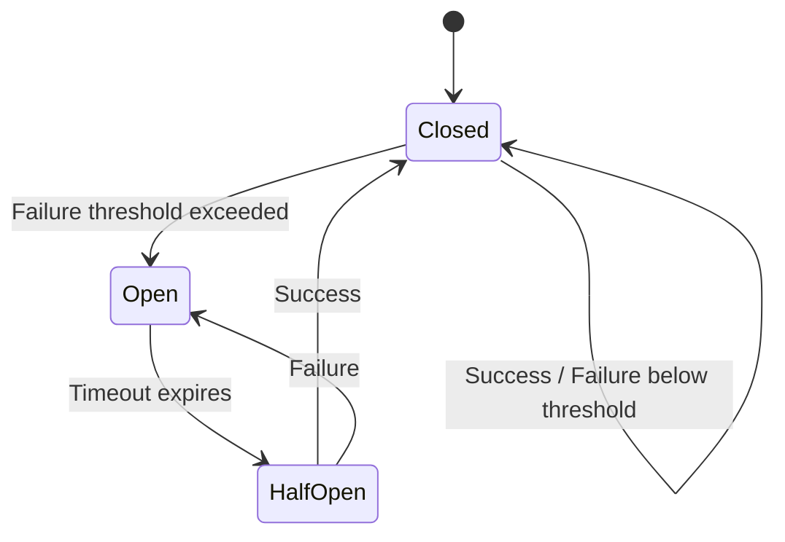

# How to Configure Circuit Breaker Patterns

Author: [nawazdhandala](https://www.github.com/nawazdhandala)

Tags: Circuit Breaker, Resilience, Microservices, Fault Tolerance, Design Patterns

Description: Learn how to implement circuit breaker patterns to protect your microservices from cascading failures and build resilient distributed systems.

---

> When a downstream service fails, the worst thing you can do is keep hammering it with requests. Circuit breakers are the fuse box of distributed systems - they trip before your entire system catches fire.

In a microservices architecture, failures are inevitable. A single slow or failing service can bring down your entire system if not handled properly. Circuit breakers prevent this by detecting failures and stopping requests to unhealthy services, giving them time to recover.

---

## What Is a Circuit Breaker?

The circuit breaker pattern is borrowed from electrical engineering. Just like an electrical circuit breaker trips when there's too much current, a software circuit breaker trips when there are too many failures.



The circuit breaker has three states:

| State | Description | Behavior |
|-------|-------------|----------|
| **Closed** | Normal operation | Requests pass through, failures are counted |
| **Open** | Service is failing | Requests fail immediately without calling the service |
| **Half-Open** | Testing recovery | Limited requests allowed to test if service recovered |

---

## Why Use Circuit Breakers?

Without circuit breakers, cascading failures can take down your entire system:

```
User Request
    |
    v
API Gateway --> Auth Service (slow, 30s timeout)
                    |
                    v
                User Service (waiting for Auth)
                    |
                    v
                Order Service (waiting for User)
                    |
                    v
                Payment Service (waiting for Order)
```

One slow service creates a chain reaction. Threads pile up waiting for responses, connection pools exhaust, and eventually everything fails.

With circuit breakers:

```
User Request
    |
    v
API Gateway --> Auth Service [CIRCUIT OPEN]
                    |
                    v
                Immediate failure (5ms)
                    |
                    v
                Return cached data or error
```

The circuit trips, requests fail fast, and the rest of your system stays healthy.

---

## Implementing Circuit Breakers in Python

Let's build a production-ready circuit breaker from scratch. This implementation includes all three states, configurable thresholds, and thread safety.

### Basic Circuit Breaker Class

This circuit breaker tracks failures and automatically opens when the threshold is exceeded. The half-open state allows periodic testing to check if the service has recovered.

```python
from enum import Enum
from datetime import datetime, timedelta
from threading import Lock
from typing import Callable, Optional, Any
import functools

class CircuitState(Enum):
    """Circuit breaker states"""
    CLOSED = "closed"       # Normal operation
    OPEN = "open"           # Rejecting requests
    HALF_OPEN = "half_open" # Testing recovery


class CircuitBreakerError(Exception):
    """Raised when circuit is open"""
    pass


class CircuitBreaker:
    """
    Thread-safe circuit breaker implementation.

    Tracks failures and opens the circuit when threshold is exceeded.
    After a recovery timeout, allows limited requests to test recovery.
    """

    def __init__(
        self,
        name: str,
        failure_threshold: int = 5,
        recovery_timeout: int = 30,
        half_open_max_calls: int = 3,
        expected_exceptions: tuple = (Exception,)
    ):
        """
        Initialize circuit breaker.

        Args:
            name: Identifier for this circuit (used in logs/metrics)
            failure_threshold: Number of failures before opening circuit
            recovery_timeout: Seconds to wait before testing recovery
            half_open_max_calls: Number of successful calls to close circuit
            expected_exceptions: Exception types that count as failures
        """
        self.name = name
        self.failure_threshold = failure_threshold
        self.recovery_timeout = timedelta(seconds=recovery_timeout)
        self.half_open_max_calls = half_open_max_calls
        self.expected_exceptions = expected_exceptions

        # State tracking
        self._state = CircuitState.CLOSED
        self._failure_count = 0
        self._success_count = 0
        self._last_failure_time: Optional[datetime] = None
        self._lock = Lock()

    @property
    def state(self) -> CircuitState:
        """Get current circuit state, checking for automatic transitions"""
        with self._lock:
            if self._state == CircuitState.OPEN:
                # Check if recovery timeout has passed
                if self._should_attempt_recovery():
                    self._state = CircuitState.HALF_OPEN
                    self._success_count = 0
            return self._state

    def _should_attempt_recovery(self) -> bool:
        """Check if enough time has passed to attempt recovery"""
        if self._last_failure_time is None:
            return True
        return datetime.now() - self._last_failure_time >= self.recovery_timeout

    def _record_success(self) -> None:
        """Record a successful call"""
        with self._lock:
            if self._state == CircuitState.HALF_OPEN:
                self._success_count += 1
                # Close circuit if enough successes
                if self._success_count >= self.half_open_max_calls:
                    self._state = CircuitState.CLOSED
                    self._failure_count = 0
                    self._success_count = 0
            elif self._state == CircuitState.CLOSED:
                # Reset failure count on success
                self._failure_count = 0

    def _record_failure(self) -> None:
        """Record a failed call"""
        with self._lock:
            self._failure_count += 1
            self._last_failure_time = datetime.now()

            if self._state == CircuitState.HALF_OPEN:
                # Immediately reopen circuit on failure during recovery
                self._state = CircuitState.OPEN
            elif self._failure_count >= self.failure_threshold:
                # Open circuit when threshold exceeded
                self._state = CircuitState.OPEN

    def can_execute(self) -> bool:
        """Check if a request should be allowed"""
        current_state = self.state  # This may trigger state transitions
        return current_state != CircuitState.OPEN

    def call(self, func: Callable, *args, **kwargs) -> Any:
        """
        Execute function through circuit breaker.

        Raises CircuitBreakerError if circuit is open.
        Records success/failure and manages state transitions.
        """
        if not self.can_execute():
            raise CircuitBreakerError(
                f"Circuit '{self.name}' is open. "
                f"Service unavailable, try again later."
            )

        try:
            result = func(*args, **kwargs)
            self._record_success()
            return result
        except self.expected_exceptions as e:
            self._record_failure()
            raise

    def __call__(self, func: Callable) -> Callable:
        """Decorator syntax for circuit breaker"""
        @functools.wraps(func)
        def wrapper(*args, **kwargs):
            return self.call(func, *args, **kwargs)
        return wrapper
```

### Using the Circuit Breaker as a Decorator

The decorator syntax makes it easy to protect any function with a circuit breaker. Each call is automatically tracked and the circuit state is managed.

```python
import requests

# Create circuit breaker for payment service
payment_circuit = CircuitBreaker(
    name="payment-service",
    failure_threshold=5,
    recovery_timeout=60,
    expected_exceptions=(requests.RequestException,)
)

@payment_circuit
def process_payment(amount: float, customer_id: str) -> dict:
    """Process payment through external payment service"""
    response = requests.post(
        "https://payment-api.example.com/charge",
        json={"amount": amount, "customer_id": customer_id},
        timeout=10
    )
    response.raise_for_status()
    return response.json()

# Usage with error handling
try:
    result = process_payment(99.99, "cust_123")
    print(f"Payment successful: {result}")
except CircuitBreakerError:
    print("Payment service unavailable, please try again later")
except requests.RequestException as e:
    print(f"Payment failed: {e}")
```

---

## Circuit Breaker with Fallback

A circuit breaker is more useful when combined with a fallback strategy. When the primary service is unavailable, the fallback provides degraded but functional behavior.

```python
from typing import Callable, Optional, TypeVar, Generic
import logging

logger = logging.getLogger(__name__)

T = TypeVar('T')

class CircuitBreakerWithFallback(CircuitBreaker):
    """
    Circuit breaker that supports fallback functions.

    When the circuit is open or the call fails, the fallback
    function is invoked to provide degraded functionality.
    """

    def __init__(self, *args, fallback: Optional[Callable] = None, **kwargs):
        super().__init__(*args, **kwargs)
        self.fallback = fallback

    def call_with_fallback(
        self,
        func: Callable[..., T],
        *args,
        fallback: Optional[Callable[..., T]] = None,
        **kwargs
    ) -> T:
        """
        Execute with fallback support.

        Uses provided fallback, or instance fallback, or raises exception.
        """
        active_fallback = fallback or self.fallback

        try:
            return self.call(func, *args, **kwargs)
        except (CircuitBreakerError, self.expected_exceptions) as e:
            if active_fallback:
                logger.warning(
                    f"Circuit '{self.name}' using fallback: {e}"
                )
                return active_fallback(*args, **kwargs)
            raise


# Example: User service with cache fallback
user_circuit = CircuitBreakerWithFallback(
    name="user-service",
    failure_threshold=3,
    recovery_timeout=30,
    expected_exceptions=(requests.RequestException,)
)

# Simple in-memory cache for demonstration
user_cache: dict = {}

def get_user_from_service(user_id: str) -> dict:
    """Fetch user from primary service"""
    response = requests.get(
        f"https://user-api.example.com/users/{user_id}",
        timeout=5
    )
    response.raise_for_status()
    user = response.json()

    # Update cache on success
    user_cache[user_id] = user
    return user

def get_user_from_cache(user_id: str) -> dict:
    """Fallback: return cached user data"""
    if user_id in user_cache:
        return user_cache[user_id]
    # Return minimal user object if not in cache
    return {"id": user_id, "name": "Unknown", "cached": True}

def get_user(user_id: str) -> dict:
    """Get user with automatic fallback to cache"""
    return user_circuit.call_with_fallback(
        get_user_from_service,
        user_id,
        fallback=get_user_from_cache
    )
```

---

## Circuit Breaker in Node.js

Here's an equivalent implementation in Node.js using modern async/await patterns.

### Basic Implementation

This Node.js circuit breaker uses the same three-state model and includes support for async functions.

```javascript
// circuit-breaker.js

const CircuitState = {
  CLOSED: 'closed',
  OPEN: 'open',
  HALF_OPEN: 'half_open'
};

class CircuitBreakerError extends Error {
  constructor(message, circuitName) {
    super(message);
    this.name = 'CircuitBreakerError';
    this.circuitName = circuitName;
  }
}

class CircuitBreaker {
  /**
   * Create a circuit breaker.
   * @param {Object} options - Configuration options
   * @param {string} options.name - Circuit identifier
   * @param {number} options.failureThreshold - Failures before opening (default: 5)
   * @param {number} options.recoveryTimeout - Milliseconds before testing recovery (default: 30000)
   * @param {number} options.halfOpenMaxCalls - Successes to close circuit (default: 3)
   */
  constructor(options = {}) {
    this.name = options.name || 'default';
    this.failureThreshold = options.failureThreshold || 5;
    this.recoveryTimeout = options.recoveryTimeout || 30000;
    this.halfOpenMaxCalls = options.halfOpenMaxCalls || 3;

    // State
    this._state = CircuitState.CLOSED;
    this._failureCount = 0;
    this._successCount = 0;
    this._lastFailureTime = null;
  }

  get state() {
    // Check for automatic state transitions
    if (this._state === CircuitState.OPEN) {
      if (this._shouldAttemptRecovery()) {
        this._state = CircuitState.HALF_OPEN;
        this._successCount = 0;
      }
    }
    return this._state;
  }

  _shouldAttemptRecovery() {
    if (!this._lastFailureTime) return true;
    return Date.now() - this._lastFailureTime >= this.recoveryTimeout;
  }

  _recordSuccess() {
    if (this._state === CircuitState.HALF_OPEN) {
      this._successCount++;
      if (this._successCount >= this.halfOpenMaxCalls) {
        this._state = CircuitState.CLOSED;
        this._failureCount = 0;
        this._successCount = 0;
        console.log(`Circuit '${this.name}' closed - service recovered`);
      }
    } else if (this._state === CircuitState.CLOSED) {
      this._failureCount = 0;
    }
  }

  _recordFailure() {
    this._failureCount++;
    this._lastFailureTime = Date.now();

    if (this._state === CircuitState.HALF_OPEN) {
      this._state = CircuitState.OPEN;
      console.log(`Circuit '${this.name}' reopened - recovery failed`);
    } else if (this._failureCount >= this.failureThreshold) {
      this._state = CircuitState.OPEN;
      console.log(`Circuit '${this.name}' opened - failure threshold exceeded`);
    }
  }

  canExecute() {
    return this.state !== CircuitState.OPEN;
  }

  /**
   * Execute a function through the circuit breaker.
   * @param {Function} fn - Async function to execute
   * @returns {Promise<any>} - Result of the function
   */
  async execute(fn) {
    if (!this.canExecute()) {
      throw new CircuitBreakerError(
        `Circuit '${this.name}' is open. Service unavailable.`,
        this.name
      );
    }

    try {
      const result = await fn();
      this._recordSuccess();
      return result;
    } catch (error) {
      this._recordFailure();
      throw error;
    }
  }

  /**
   * Create a wrapped version of an async function.
   * @param {Function} fn - Function to wrap
   * @returns {Function} - Wrapped function
   */
  wrap(fn) {
    return async (...args) => {
      return this.execute(() => fn(...args));
    };
  }
}

module.exports = { CircuitBreaker, CircuitBreakerError, CircuitState };
```

### Using the Node.js Circuit Breaker

Here's how to use the circuit breaker with an HTTP client like axios.

```javascript
// usage.js

const axios = require('axios');
const { CircuitBreaker, CircuitBreakerError } = require('./circuit-breaker');

// Create circuit breaker for external API
const apiCircuit = new CircuitBreaker({
  name: 'external-api',
  failureThreshold: 3,
  recoveryTimeout: 60000,  // 60 seconds
  halfOpenMaxCalls: 2
});

// Wrap API call function
const fetchUserData = apiCircuit.wrap(async (userId) => {
  const response = await axios.get(
    `https://api.example.com/users/${userId}`,
    { timeout: 5000 }
  );
  return response.data;
});

// Usage with fallback
async function getUser(userId) {
  try {
    return await fetchUserData(userId);
  } catch (error) {
    if (error instanceof CircuitBreakerError) {
      console.log('Service unavailable, returning cached data');
      return getCachedUser(userId);
    }
    throw error;
  }
}

// Cache for fallback
const userCache = new Map();

function getCachedUser(userId) {
  if (userCache.has(userId)) {
    return userCache.get(userId);
  }
  return { id: userId, name: 'Unknown', cached: true };
}
```

---

## Using Resilience4j (Java)

Resilience4j is the go-to library for circuit breakers in Java applications. It's lightweight, works great with Spring Boot, and provides excellent configuration options.

### Maven Dependency

Add resilience4j to your project by including the core module and any integrations you need.

```xml
<dependency>
    <groupId>io.github.resilience4j</groupId>
    <artifactId>resilience4j-circuitbreaker</artifactId>
    <version>2.1.0</version>
</dependency>

<!-- For Spring Boot integration -->
<dependency>
    <groupId>io.github.resilience4j</groupId>
    <artifactId>resilience4j-spring-boot3</artifactId>
    <version>2.1.0</version>
</dependency>
```

### Java Implementation

Resilience4j provides both programmatic and annotation-based configuration. Here's the programmatic approach for maximum control.

```java
import io.github.resilience4j.circuitbreaker.CircuitBreaker;
import io.github.resilience4j.circuitbreaker.CircuitBreakerConfig;
import io.github.resilience4j.circuitbreaker.CircuitBreakerRegistry;
import io.vavr.control.Try;

import java.time.Duration;

public class PaymentService {

    private final CircuitBreaker circuitBreaker;
    private final PaymentClient paymentClient;

    public PaymentService(PaymentClient paymentClient) {
        this.paymentClient = paymentClient;

        // Configure circuit breaker
        CircuitBreakerConfig config = CircuitBreakerConfig.custom()
            // Percentage of calls that must fail to open circuit
            .failureRateThreshold(50)
            // Minimum calls before calculating failure rate
            .minimumNumberOfCalls(10)
            // Time to wait before transitioning to half-open
            .waitDurationInOpenState(Duration.ofSeconds(30))
            // Calls allowed in half-open state
            .permittedNumberOfCallsInHalfOpenState(5)
            // Use sliding window to track calls
            .slidingWindowType(CircuitBreakerConfig.SlidingWindowType.COUNT_BASED)
            .slidingWindowSize(20)
            // Also consider slow calls as failures
            .slowCallRateThreshold(80)
            .slowCallDurationThreshold(Duration.ofSeconds(5))
            // Only trip on certain exceptions
            .recordExceptions(
                java.io.IOException.class,
                java.util.concurrent.TimeoutException.class
            )
            .ignoreExceptions(
                IllegalArgumentException.class
            )
            .build();

        // Create circuit breaker from registry
        CircuitBreakerRegistry registry = CircuitBreakerRegistry.of(config);
        this.circuitBreaker = registry.circuitBreaker("payment-service");

        // Register event listeners for monitoring
        circuitBreaker.getEventPublisher()
            .onStateTransition(event ->
                System.out.println("Circuit state: " + event.getStateTransition())
            )
            .onFailureRateExceeded(event ->
                System.out.println("Failure rate exceeded: " + event.getFailureRate())
            );
    }

    /**
     * Process payment with circuit breaker protection.
     */
    public PaymentResult processPayment(PaymentRequest request) {
        // Decorate the supplier with circuit breaker
        return circuitBreaker.executeSupplier(() ->
            paymentClient.charge(request)
        );
    }

    /**
     * Process payment with fallback on failure.
     */
    public PaymentResult processPaymentWithFallback(PaymentRequest request) {
        return Try.ofSupplier(
            CircuitBreaker.decorateSupplier(
                circuitBreaker,
                () -> paymentClient.charge(request)
            )
        ).recover(throwable -> {
            // Fallback: queue payment for later processing
            return queuePaymentForRetry(request, throwable);
        }).get();
    }

    private PaymentResult queuePaymentForRetry(
        PaymentRequest request,
        Throwable error
    ) {
        System.out.println("Payment failed, queuing for retry: " + error.getMessage());
        // Queue to message broker for async retry
        return new PaymentResult(
            PaymentStatus.PENDING,
            "Queued for processing"
        );
    }
}
```

### Spring Boot Configuration

Spring Boot makes configuration even easier with YAML properties and annotations.

```yaml
# application.yml
resilience4j:
  circuitbreaker:
    instances:
      payment-service:
        registerHealthIndicator: true
        slidingWindowSize: 20
        minimumNumberOfCalls: 10
        failureRateThreshold: 50
        waitDurationInOpenState: 30s
        permittedNumberOfCallsInHalfOpenState: 5
        slowCallDurationThreshold: 5s
        slowCallRateThreshold: 80
        recordExceptions:
          - java.io.IOException
          - java.util.concurrent.TimeoutException
        ignoreExceptions:
          - java.lang.IllegalArgumentException

      user-service:
        slidingWindowSize: 10
        failureRateThreshold: 60
        waitDurationInOpenState: 60s
```

Using annotations with Spring Boot allows you to apply circuit breakers declaratively.

```java
import io.github.resilience4j.circuitbreaker.annotation.CircuitBreaker;
import org.springframework.stereotype.Service;

@Service
public class UserService {

    private final UserClient userClient;
    private final UserCache userCache;

    public UserService(UserClient userClient, UserCache userCache) {
        this.userClient = userClient;
        this.userCache = userCache;
    }

    /**
     * Get user with circuit breaker and fallback.
     * The @CircuitBreaker annotation automatically applies protection.
     */
    @CircuitBreaker(name = "user-service", fallbackMethod = "getUserFallback")
    public User getUser(String userId) {
        User user = userClient.fetchUser(userId);
        userCache.put(userId, user);  // Update cache on success
        return user;
    }

    /**
     * Fallback method - must have same signature plus Throwable.
     */
    private User getUserFallback(String userId, Throwable t) {
        System.out.println("User service unavailable: " + t.getMessage());

        // Try to return cached user
        User cached = userCache.get(userId);
        if (cached != null) {
            return cached;
        }

        // Return placeholder user
        return User.unknown(userId);
    }
}
```

---

## Monitoring Circuit Breakers

Monitoring circuit breaker state is essential for understanding your system's health. Here's how to expose metrics for Prometheus.

### Python Metrics

This example shows how to track circuit breaker state and transitions using Prometheus client library.

```python
from prometheus_client import Gauge, Counter, Histogram
from datetime import datetime
from typing import Callable
import functools

# Define Prometheus metrics
circuit_state_gauge = Gauge(
    'circuit_breaker_state',
    'Current circuit breaker state (0=closed, 1=open, 2=half-open)',
    ['circuit_name']
)

circuit_calls_total = Counter(
    'circuit_breaker_calls_total',
    'Total calls through circuit breaker',
    ['circuit_name', 'result']  # result: success, failure, rejected
)

circuit_state_transitions = Counter(
    'circuit_breaker_state_transitions_total',
    'Circuit breaker state transitions',
    ['circuit_name', 'from_state', 'to_state']
)

class MonitoredCircuitBreaker(CircuitBreaker):
    """Circuit breaker with Prometheus metrics"""

    STATE_VALUES = {
        CircuitState.CLOSED: 0,
        CircuitState.OPEN: 1,
        CircuitState.HALF_OPEN: 2
    }

    def __init__(self, *args, **kwargs):
        super().__init__(*args, **kwargs)
        self._previous_state = self._state
        # Initialize gauge
        circuit_state_gauge.labels(circuit_name=self.name).set(0)

    def _update_metrics(self):
        """Update Prometheus metrics after state change"""
        current_state = self._state

        # Update state gauge
        circuit_state_gauge.labels(
            circuit_name=self.name
        ).set(self.STATE_VALUES[current_state])

        # Record state transition
        if current_state != self._previous_state:
            circuit_state_transitions.labels(
                circuit_name=self.name,
                from_state=self._previous_state.value,
                to_state=current_state.value
            ).inc()
            self._previous_state = current_state

    def call(self, func: Callable, *args, **kwargs):
        """Execute with metrics tracking"""
        if not self.can_execute():
            circuit_calls_total.labels(
                circuit_name=self.name,
                result='rejected'
            ).inc()
            raise CircuitBreakerError(f"Circuit '{self.name}' is open")

        try:
            result = func(*args, **kwargs)
            self._record_success()
            circuit_calls_total.labels(
                circuit_name=self.name,
                result='success'
            ).inc()
            self._update_metrics()
            return result
        except self.expected_exceptions:
            self._record_failure()
            circuit_calls_total.labels(
                circuit_name=self.name,
                result='failure'
            ).inc()
            self._update_metrics()
            raise
```

### Grafana Dashboard Query Examples

Use these PromQL queries to visualize circuit breaker behavior in Grafana.

```promql
# Current state of all circuit breakers
circuit_breaker_state

# Rate of rejected requests (circuit open)
rate(circuit_breaker_calls_total{result="rejected"}[5m])

# Failure rate by circuit
rate(circuit_breaker_calls_total{result="failure"}[5m])
/
rate(circuit_breaker_calls_total[5m])

# State transitions over time
increase(circuit_breaker_state_transitions_total[1h])
```

---

## Configuration Best Practices

### Choosing Thresholds

| Parameter | Recommendation | Why |
|-----------|---------------|-----|
| **Failure Threshold** | 5-10 calls | Low enough to detect issues quickly, high enough to avoid false positives |
| **Recovery Timeout** | 30-60 seconds | Give the service time to recover, but not so long users give up |
| **Half-Open Calls** | 3-5 calls | Enough to confirm recovery, not enough to overload |
| **Sliding Window** | 20-50 calls | Large enough for statistical significance |

### Service-Specific Tuning

Different services need different configurations based on their characteristics.

```python
# Critical payment service - conservative settings
payment_circuit = CircuitBreaker(
    name="payment-service",
    failure_threshold=3,        # Trip quickly
    recovery_timeout=120,       # Long recovery time
    half_open_max_calls=5       # Thorough recovery test
)

# Non-critical recommendations service - lenient settings
recommendations_circuit = CircuitBreaker(
    name="recommendations-service",
    failure_threshold=10,       # More tolerant
    recovery_timeout=30,        # Quick recovery test
    half_open_max_calls=2       # Fast recovery
)

# High-traffic search service - balanced settings
search_circuit = CircuitBreaker(
    name="search-service",
    failure_threshold=5,
    recovery_timeout=45,
    half_open_max_calls=3
)
```

### Combining with Retry

Circuit breakers work best when combined with retry logic. The retry handles transient failures, while the circuit breaker handles prolonged outages.

```python
from tenacity import retry, stop_after_attempt, wait_exponential_jitter

# Retry logic for transient failures
@retry(
    stop=stop_after_attempt(3),
    wait=wait_exponential_jitter(initial=1, max=10)
)
def make_api_call(url: str) -> dict:
    """Make API call with retry"""
    response = requests.get(url, timeout=5)
    response.raise_for_status()
    return response.json()

# Circuit breaker wraps the retrying function
api_circuit = CircuitBreaker(
    name="external-api",
    failure_threshold=5,
    recovery_timeout=60
)

@api_circuit
def get_data_with_protection(url: str) -> dict:
    """Protected API call: retries first, then circuit breaks"""
    return make_api_call(url)
```

The order matters here: retry is the inner function (handles transient issues), circuit breaker is the outer function (handles prolonged outages).

---

## Common Pitfalls

### 1. Circuit Per Instance vs Per Service

Wrong approach - circuit per service instance makes each instance independent, missing systemic issues:

```python
# Wrong: Circuit per instance
def get_user(user_id: str, instance: str):
    circuit = CircuitBreaker(name=f"user-service-{instance}")
    # Each instance has its own circuit
```

Correct approach - shared circuit detects service-wide issues:

```python
# Correct: Shared circuit for the service
user_circuit = CircuitBreaker(name="user-service")

@user_circuit
def get_user(user_id: str):
    # All instances share the circuit
    pass
```

### 2. Not Handling CircuitBreakerError

Always handle the circuit breaker exception explicitly to provide good user experience.

```python
# Always handle circuit breaker errors
try:
    result = protected_call()
except CircuitBreakerError:
    # Provide degraded functionality or clear error message
    return get_fallback_response()
except Exception as e:
    # Handle actual service errors
    logger.error(f"Service error: {e}")
    raise
```

### 3. Ignoring Slow Calls

Configure your circuit breaker to treat slow calls as failures. A service responding in 30 seconds is often worse than no response.

```python
# Consider slow responses as failures
class TimeoutAwareCircuitBreaker(CircuitBreaker):
    def __init__(self, *args, slow_call_threshold: float = 5.0, **kwargs):
        super().__init__(*args, **kwargs)
        self.slow_call_threshold = slow_call_threshold

    def call(self, func, *args, **kwargs):
        start = time.time()
        try:
            result = super().call(func, *args, **kwargs)
            duration = time.time() - start

            # Treat slow calls as failures
            if duration > self.slow_call_threshold:
                self._record_failure()

            return result
        except Exception:
            raise
```

---

## Conclusion

Circuit breakers are essential for building resilient microservices. Key takeaways:

- **Fail fast**: Open circuits prevent resource exhaustion
- **Automatic recovery**: Half-open state tests if services have recovered
- **Fallbacks matter**: Always have a degraded mode of operation
- **Monitor everything**: Track circuit state to understand system health
- **Tune per service**: Critical services need conservative settings

Start with sensible defaults, monitor behavior in production, and tune based on real traffic patterns.

---

*Building resilient microservices? [OneUptime](https://oneuptime.com) provides comprehensive monitoring and alerting to help you detect service degradations before they become outages. Track your circuit breaker state, visualize failure rates, and get notified when services start failing.*
