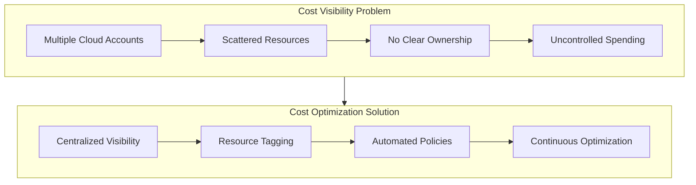
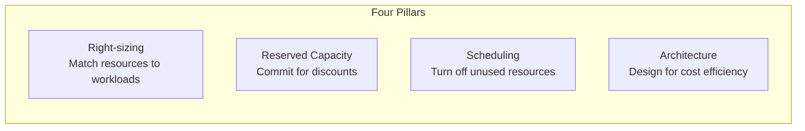
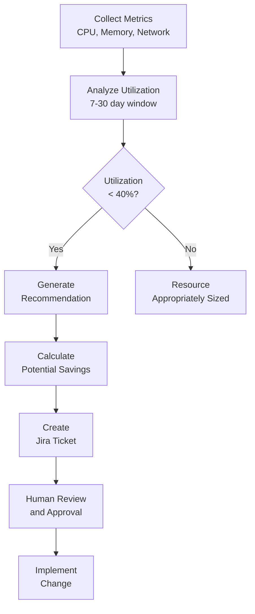
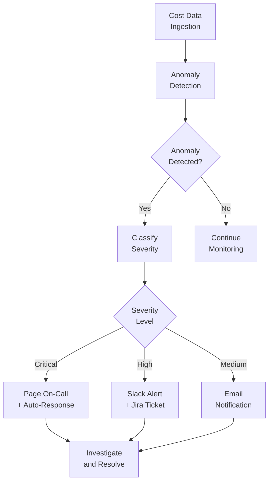
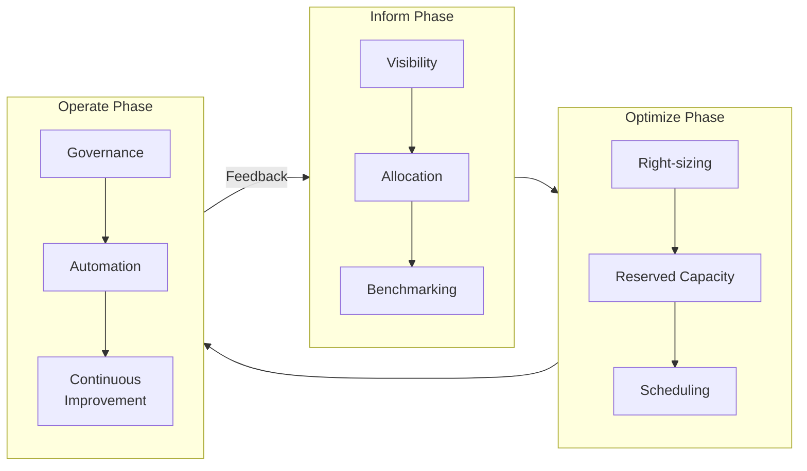

# How to Use Cloud Cost Optimization Tools

Author: [nawazdhandala](https://www.github.com/nawazdhandala)

Tags: FinOps, Cloud Cost, AWS, Optimization, Cost Management, Azure, GCP, Infrastructure, DevOps

Description: A comprehensive guide to using cloud cost optimization tools effectively. Learn strategies for reducing cloud spend, implementing FinOps practices, and leveraging native and third-party tools across AWS, Azure, and GCP.

---

> Cloud costs can spiral out of control without proper visibility and governance. Cost optimization tools provide the insights and automation needed to control spending while maintaining performance. This guide covers the essential tools and strategies for effective cloud cost management.

Organizations routinely overspend on cloud infrastructure by 20-30% due to poor visibility and lack of optimization practices.

---

## The Cloud Cost Challenge



Cloud cost optimization is not a one-time activity. It requires continuous monitoring, analysis, and action. The right tools help you identify waste, implement savings, and maintain cost discipline across your organization.

---

## Understanding Cloud Cost Optimization

Before diving into tools, it is essential to understand the core areas where optimization efforts should focus.

### The Four Pillars of Cloud Cost Optimization



**Right-sizing** involves matching your cloud resources to actual workload requirements. Many organizations over-provision resources during initial deployment and never revisit these decisions.

**Reserved capacity** programs offer significant discounts (up to 72% on AWS) in exchange for usage commitments. Identifying stable workloads suitable for reservations is a key optimization strategy.

**Scheduling** means turning off development, testing, and staging environments outside of business hours. This simple practice can reduce costs by 65% or more for non-production workloads.

**Architecture optimization** involves designing systems to use cost-effective services. Moving from EC2 to Lambda for bursty workloads or using S3 Intelligent-Tiering for storage can dramatically reduce costs.

---

## Native Cloud Provider Tools

Each major cloud provider offers built-in cost management tools. These should be your first stop for cost visibility and basic optimization.

### AWS Cost Explorer and Cost Management

AWS provides a comprehensive suite of cost management tools included with your account.

The following AWS CLI command retrieves cost and usage data for the current month, grouped by service to identify the biggest cost drivers:

```bash
# Get cost breakdown by service for current month
# This helps identify which AWS services consume the most budget
aws ce get-cost-and-usage \
    --time-period Start=$(date -d "$(date +%Y-%m-01)" +%Y-%m-%d),End=$(date +%Y-%m-%d) \
    --granularity MONTHLY \
    --metrics "BlendedCost" "UnblendedCost" "UsageQuantity" \
    --group-by Type=DIMENSION,Key=SERVICE \
    --output json
```

To set up a cost anomaly monitor that alerts when spending deviates from expected patterns, use this Terraform configuration:

```hcl
# terraform/aws-cost-anomaly-detection.tf
# This creates an anomaly detection monitor for all AWS services
# Alerts trigger when spending exceeds expected thresholds

resource "aws_ce_anomaly_monitor" "service_monitor" {
  name              = "service-cost-anomaly-monitor"
  monitor_type      = "DIMENSIONAL"
  monitor_dimension = "SERVICE"

  tags = {
    Environment = "production"
    Purpose     = "cost-management"
  }
}

# Create a subscription to receive alerts via email and SNS
resource "aws_ce_anomaly_subscription" "alert_subscription" {
  name      = "cost-anomaly-alerts"
  frequency = "IMMEDIATE"

  # Set threshold to trigger on anomalies over $100
  # Adjust based on your typical daily spend
  threshold_expression {
    dimension {
      key           = "ANOMALY_TOTAL_IMPACT_ABSOLUTE"
      match_options = ["GREATER_THAN_OR_EQUAL"]
      values        = ["100"]
    }
  }

  monitor_arn_list = [aws_ce_anomaly_monitor.service_monitor.arn]

  subscriber {
    type    = "EMAIL"
    address = "finops-team@company.com"
  }

  subscriber {
    type    = "SNS"
    address = aws_sns_topic.cost_alerts.arn
  }
}

# SNS topic for cost alert integrations
resource "aws_sns_topic" "cost_alerts" {
  name = "cost-anomaly-alerts"
}
```

### AWS Trusted Advisor

AWS Trusted Advisor provides recommendations across cost optimization, security, performance, and fault tolerance. The following script queries Trusted Advisor for cost optimization checks:

```python
# aws_trusted_advisor_costs.py
# Retrieves and displays all cost optimization recommendations from AWS Trusted Advisor
# Requires Business or Enterprise support plan for full access

import boto3
import json
from datetime import datetime

def get_cost_optimization_checks():
    """
    Fetch all cost optimization recommendations from AWS Trusted Advisor.
    Returns a list of checks with their status and estimated savings.
    """
    support_client = boto3.client('support', region_name='us-east-1')

    # Retrieve all available Trusted Advisor checks
    checks_response = support_client.describe_trusted_advisor_checks(language='en')

    cost_checks = []

    # Filter for cost optimization category
    for check in checks_response['checks']:
        if check['category'] == 'cost_optimizing':
            # Get the current status and results for each cost check
            result = support_client.describe_trusted_advisor_check_result(
                checkId=check['id'],
                language='en'
            )

            cost_checks.append({
                'name': check['name'],
                'description': check['description'],
                'status': result['result']['status'],
                'resources_flagged': len(result['result'].get('flaggedResources', [])),
                'estimated_savings': extract_savings(result['result'])
            })

    return cost_checks

def extract_savings(result):
    """
    Extract estimated monthly savings from Trusted Advisor result.
    Savings format varies by check type, so we handle multiple formats.
    """
    flagged = result.get('flaggedResources', [])
    total_savings = 0.0

    for resource in flagged:
        metadata = resource.get('metadata', [])
        # Savings is typically in the last metadata field as a dollar amount
        for item in metadata:
            if item and '$' in str(item):
                try:
                    # Remove currency symbols and parse as float
                    savings = float(item.replace('$', '').replace(',', ''))
                    total_savings += savings
                except ValueError:
                    continue

    return total_savings

def main():
    """Main function to display cost optimization recommendations."""
    print("AWS Trusted Advisor - Cost Optimization Recommendations")
    print("=" * 60)

    checks = get_cost_optimization_checks()
    total_potential_savings = 0

    for check in checks:
        if check['resources_flagged'] > 0:
            print(f"\nCheck: {check['name']}")
            print(f"  Status: {check['status']}")
            print(f"  Resources Flagged: {check['resources_flagged']}")
            print(f"  Estimated Monthly Savings: ${check['estimated_savings']:,.2f}")
            total_potential_savings += check['estimated_savings']

    print("\n" + "=" * 60)
    print(f"Total Potential Monthly Savings: ${total_potential_savings:,.2f}")
    print(f"Potential Annual Savings: ${total_potential_savings * 12:,.2f}")

if __name__ == "__main__":
    main()
```

### Azure Cost Management

Azure provides Cost Management and Billing tools integrated into the Azure Portal. Here is how to query cost data programmatically:

```python
# azure_cost_analysis.py
# Retrieves cost data from Azure Cost Management API
# Provides breakdown by resource group and service

from azure.identity import DefaultAzureCredential
from azure.mgmt.costmanagement import CostManagementClient
from datetime import datetime, timedelta
import json

def get_azure_costs(subscription_id: str, days: int = 30):
    """
    Query Azure Cost Management for spending data.
    Groups costs by resource group and service for analysis.
    """
    credential = DefaultAzureCredential()
    client = CostManagementClient(credential)

    # Define the time range for cost analysis
    end_date = datetime.utcnow()
    start_date = end_date - timedelta(days=days)

    # Build the cost query with grouping by resource group and service
    query = {
        "type": "ActualCost",
        "timeframe": "Custom",
        "timePeriod": {
            "from": start_date.strftime("%Y-%m-%dT00:00:00Z"),
            "to": end_date.strftime("%Y-%m-%dT23:59:59Z")
        },
        "dataset": {
            "granularity": "Daily",
            "aggregation": {
                "totalCost": {
                    "name": "Cost",
                    "function": "Sum"
                }
            },
            "grouping": [
                {
                    "type": "Dimension",
                    "name": "ResourceGroup"
                },
                {
                    "type": "Dimension",
                    "name": "ServiceName"
                }
            ]
        }
    }

    # Execute the query against the subscription scope
    scope = f"/subscriptions/{subscription_id}"
    result = client.query.usage(scope=scope, parameters=query)

    return parse_cost_results(result)

def parse_cost_results(result):
    """Parse the cost management API response into a structured format."""
    costs_by_group = {}

    for row in result.rows:
        # Row format: [cost, resource_group, service_name, date]
        cost = float(row[0])
        resource_group = row[1] or "Unassigned"
        service = row[2]

        if resource_group not in costs_by_group:
            costs_by_group[resource_group] = {
                'total': 0,
                'services': {}
            }

        costs_by_group[resource_group]['total'] += cost

        if service not in costs_by_group[resource_group]['services']:
            costs_by_group[resource_group]['services'][service] = 0
        costs_by_group[resource_group]['services'][service] += cost

    return costs_by_group

def generate_recommendations(costs_by_group: dict):
    """
    Generate basic cost optimization recommendations based on spending patterns.
    """
    recommendations = []

    for rg, data in costs_by_group.items():
        # Flag resource groups with high storage costs for review
        storage_cost = data['services'].get('Storage', 0)
        if storage_cost > data['total'] * 0.3:
            recommendations.append({
                'resource_group': rg,
                'type': 'storage_optimization',
                'message': f'Storage represents {storage_cost/data["total"]*100:.1f}% of costs. '
                          f'Consider implementing lifecycle policies or tiered storage.'
            })

        # Flag resource groups with high compute costs
        compute_cost = data['services'].get('Virtual Machines', 0)
        if compute_cost > 1000:
            recommendations.append({
                'resource_group': rg,
                'type': 'compute_optimization',
                'message': f'VM costs are ${compute_cost:,.2f}. '
                          f'Review for right-sizing and reserved instance opportunities.'
            })

    return recommendations
```

### Google Cloud Cost Management

Google Cloud provides detailed billing exports to BigQuery for advanced cost analysis. This setup enables powerful SQL-based cost queries:

```sql
-- gcp_cost_analysis.sql
-- Query Google Cloud billing data exported to BigQuery
-- Provides daily cost breakdown by project and service

-- Get daily costs grouped by project and service for the last 30 days
SELECT
    FORMAT_DATE('%Y-%m-%d', usage_start_time) AS usage_date,
    project.id AS project_id,
    project.name AS project_name,
    service.description AS service_name,
    -- Sum up costs and credits to get net cost
    SUM(cost) AS gross_cost,
    SUM(IFNULL((SELECT SUM(amount) FROM UNNEST(credits)), 0)) AS credits,
    SUM(cost) + SUM(IFNULL((SELECT SUM(amount) FROM UNNEST(credits)), 0)) AS net_cost
FROM
    `project-id.billing_dataset.gcp_billing_export_v1_XXXXXX`
WHERE
    -- Filter to last 30 days
    usage_start_time >= TIMESTAMP_SUB(CURRENT_TIMESTAMP(), INTERVAL 30 DAY)
    AND usage_start_time < CURRENT_TIMESTAMP()
GROUP BY
    usage_date,
    project_id,
    project_name,
    service_name
ORDER BY
    net_cost DESC
LIMIT 100;
```

The following query identifies resources with consistently low utilization, making them candidates for right-sizing:

```sql
-- gcp_rightsizing_candidates.sql
-- Identify underutilized Compute Engine instances for right-sizing

SELECT
    instance_id,
    zone,
    machine_type,
    AVG(cpu_utilization) AS avg_cpu_percent,
    MAX(cpu_utilization) AS max_cpu_percent,
    AVG(memory_utilization) AS avg_memory_percent,
    -- Calculate estimated monthly cost based on usage
    SUM(cost) AS monthly_cost
FROM (
    SELECT
        resource.labels.instance_id AS instance_id,
        resource.labels.zone AS zone,
        system_labels.value AS machine_type,
        -- Extract utilization metrics
        SAFE_DIVIDE(
            metric.points[OFFSET(0)].value.double_value,
            1.0
        ) * 100 AS cpu_utilization,
        0 AS memory_utilization,  -- Memory metrics require separate query
        cost
    FROM
        `project-id.billing_dataset.gcp_billing_export_v1_XXXXXX` billing
    LEFT JOIN
        `project-id.monitoring_dataset.compute_metrics` metrics
    ON
        billing.resource.labels.instance_id = metrics.resource.labels.instance_id
    WHERE
        service.description = 'Compute Engine'
        AND usage_start_time >= TIMESTAMP_SUB(CURRENT_TIMESTAMP(), INTERVAL 30 DAY)
)
GROUP BY
    instance_id,
    zone,
    machine_type
-- Flag instances with average CPU under 20% as underutilized
HAVING
    avg_cpu_percent < 20
ORDER BY
    monthly_cost DESC;
```

---

## Third-Party Cost Optimization Tools

While native tools provide good visibility, third-party tools offer advanced features like multi-cloud support, deeper analytics, and automated optimization.

### Implementing a Cost Monitoring Solution

The following Python script creates a unified cost monitoring system that aggregates data from multiple cloud providers:

```python
# multi_cloud_cost_monitor.py
# Unified cost monitoring across AWS, Azure, and GCP
# Aggregates costs and generates actionable insights

import boto3
from azure.identity import DefaultAzureCredential
from azure.mgmt.costmanagement import CostManagementClient
from google.cloud import bigquery
from datetime import datetime, timedelta
from dataclasses import dataclass
from typing import List, Dict, Optional
import json

@dataclass
class CloudCost:
    """Represents cost data from a cloud provider."""
    provider: str
    account_id: str
    service: str
    cost: float
    currency: str
    date: str
    tags: Dict[str, str]

class MultiCloudCostAggregator:
    """
    Aggregates cost data from AWS, Azure, and GCP into a unified format.
    Enables cross-cloud cost analysis and reporting.
    """

    def __init__(self):
        self.costs: List[CloudCost] = []

    def fetch_aws_costs(self, days: int = 30) -> List[CloudCost]:
        """Fetch costs from AWS Cost Explorer."""
        ce_client = boto3.client('ce', region_name='us-east-1')

        end_date = datetime.utcnow()
        start_date = end_date - timedelta(days=days)

        response = ce_client.get_cost_and_usage(
            TimePeriod={
                'Start': start_date.strftime('%Y-%m-%d'),
                'End': end_date.strftime('%Y-%m-%d')
            },
            Granularity='DAILY',
            Metrics=['UnblendedCost'],
            GroupBy=[
                {'Type': 'DIMENSION', 'Key': 'SERVICE'},
                {'Type': 'DIMENSION', 'Key': 'LINKED_ACCOUNT'}
            ]
        )

        aws_costs = []
        for result in response['ResultsByTime']:
            date = result['TimePeriod']['Start']
            for group in result['Groups']:
                service = group['Keys'][0]
                account = group['Keys'][1]
                amount = float(group['Metrics']['UnblendedCost']['Amount'])

                aws_costs.append(CloudCost(
                    provider='AWS',
                    account_id=account,
                    service=service,
                    cost=amount,
                    currency='USD',
                    date=date,
                    tags={}
                ))

        self.costs.extend(aws_costs)
        return aws_costs

    def fetch_azure_costs(self, subscription_id: str, days: int = 30) -> List[CloudCost]:
        """Fetch costs from Azure Cost Management."""
        credential = DefaultAzureCredential()
        client = CostManagementClient(credential)

        end_date = datetime.utcnow()
        start_date = end_date - timedelta(days=days)

        query = {
            "type": "ActualCost",
            "timeframe": "Custom",
            "timePeriod": {
                "from": start_date.strftime("%Y-%m-%dT00:00:00Z"),
                "to": end_date.strftime("%Y-%m-%dT23:59:59Z")
            },
            "dataset": {
                "granularity": "Daily",
                "aggregation": {
                    "totalCost": {"name": "Cost", "function": "Sum"}
                },
                "grouping": [
                    {"type": "Dimension", "name": "ServiceName"}
                ]
            }
        }

        scope = f"/subscriptions/{subscription_id}"
        result = client.query.usage(scope=scope, parameters=query)

        azure_costs = []
        for row in result.rows:
            azure_costs.append(CloudCost(
                provider='Azure',
                account_id=subscription_id,
                service=row[1],
                cost=float(row[0]),
                currency='USD',
                date=row[2] if len(row) > 2 else datetime.utcnow().strftime('%Y-%m-%d'),
                tags={}
            ))

        self.costs.extend(azure_costs)
        return azure_costs

    def fetch_gcp_costs(self, project_id: str, dataset_id: str, days: int = 30) -> List[CloudCost]:
        """Fetch costs from GCP BigQuery billing export."""
        client = bigquery.Client(project=project_id)

        query = f"""
        SELECT
            FORMAT_DATE('%Y-%m-%d', usage_start_time) AS usage_date,
            service.description AS service_name,
            SUM(cost) AS total_cost
        FROM
            `{project_id}.{dataset_id}.gcp_billing_export_*`
        WHERE
            usage_start_time >= TIMESTAMP_SUB(CURRENT_TIMESTAMP(), INTERVAL {days} DAY)
        GROUP BY
            usage_date, service_name
        ORDER BY
            usage_date, total_cost DESC
        """

        results = client.query(query).result()

        gcp_costs = []
        for row in results:
            gcp_costs.append(CloudCost(
                provider='GCP',
                account_id=project_id,
                service=row.service_name,
                cost=float(row.total_cost),
                currency='USD',
                date=row.usage_date,
                tags={}
            ))

        self.costs.extend(gcp_costs)
        return gcp_costs

    def get_summary(self) -> Dict:
        """Generate a summary of costs across all providers."""
        summary = {
            'total_cost': 0,
            'by_provider': {},
            'by_service': {},
            'top_services': []
        }

        for cost in self.costs:
            summary['total_cost'] += cost.cost

            # Aggregate by provider
            if cost.provider not in summary['by_provider']:
                summary['by_provider'][cost.provider] = 0
            summary['by_provider'][cost.provider] += cost.cost

            # Aggregate by service (normalized)
            service_key = f"{cost.provider}:{cost.service}"
            if service_key not in summary['by_service']:
                summary['by_service'][service_key] = 0
            summary['by_service'][service_key] += cost.cost

        # Get top 10 services by cost
        sorted_services = sorted(
            summary['by_service'].items(),
            key=lambda x: x[1],
            reverse=True
        )[:10]
        summary['top_services'] = [
            {'service': k, 'cost': v} for k, v in sorted_services
        ]

        return summary

    def identify_optimization_opportunities(self) -> List[Dict]:
        """
        Analyze costs and identify optimization opportunities.
        Returns actionable recommendations.
        """
        opportunities = []
        summary = self.get_summary()

        # Check for cloud concentration risk
        for provider, cost in summary['by_provider'].items():
            percentage = (cost / summary['total_cost']) * 100
            if percentage > 80:
                opportunities.append({
                    'type': 'concentration_risk',
                    'severity': 'medium',
                    'provider': provider,
                    'message': f'{provider} represents {percentage:.1f}% of total spend. '
                              f'Consider multi-cloud strategy for resilience and cost optimization.'
                })

        # Identify services consuming disproportionate budget
        for service_data in summary['top_services'][:5]:
            service = service_data['service']
            cost = service_data['cost']
            percentage = (cost / summary['total_cost']) * 100

            if percentage > 25:
                opportunities.append({
                    'type': 'high_spend_service',
                    'severity': 'high',
                    'service': service,
                    'cost': cost,
                    'message': f'{service} represents {percentage:.1f}% of total spend (${cost:,.2f}). '
                              f'Prioritize optimization efforts here.'
                })

        return opportunities
```

---

## Automated Resource Scheduling

One of the most effective cost optimization strategies is scheduling non-production resources to run only during business hours.

### AWS Instance Scheduler

The following Terraform configuration sets up automated instance scheduling:

```hcl
# terraform/aws-instance-scheduler.tf
# Configures automatic start/stop schedules for EC2 instances
# Reduces costs by stopping non-production instances outside business hours

# Create the scheduler Lambda function role
resource "aws_iam_role" "scheduler_role" {
  name = "instance-scheduler-role"

  assume_role_policy = jsonencode({
    Version = "2012-10-17"
    Statement = [
      {
        Action = "sts:AssumeRole"
        Effect = "Allow"
        Principal = {
          Service = "lambda.amazonaws.com"
        }
      }
    ]
  })
}

# Policy allowing Lambda to start/stop EC2 instances
resource "aws_iam_role_policy" "scheduler_policy" {
  name = "instance-scheduler-policy"
  role = aws_iam_role.scheduler_role.id

  policy = jsonencode({
    Version = "2012-10-17"
    Statement = [
      {
        Effect = "Allow"
        Action = [
          "ec2:DescribeInstances",
          "ec2:StartInstances",
          "ec2:StopInstances",
          "ec2:DescribeTags"
        ]
        Resource = "*"
      },
      {
        Effect = "Allow"
        Action = [
          "logs:CreateLogGroup",
          "logs:CreateLogStream",
          "logs:PutLogEvents"
        ]
        Resource = "arn:aws:logs:*:*:*"
      }
    ]
  })
}

# Lambda function for stopping instances
resource "aws_lambda_function" "stop_instances" {
  filename         = "scheduler.zip"
  function_name    = "stop-scheduled-instances"
  role            = aws_iam_role.scheduler_role.arn
  handler         = "scheduler.stop_handler"
  runtime         = "python3.11"
  timeout         = 300

  environment {
    variables = {
      TAG_KEY   = "Schedule"
      TAG_VALUE = "office-hours"
    }
  }
}

# Lambda function for starting instances
resource "aws_lambda_function" "start_instances" {
  filename         = "scheduler.zip"
  function_name    = "start-scheduled-instances"
  role            = aws_iam_role.scheduler_role.arn
  handler         = "scheduler.start_handler"
  runtime         = "python3.11"
  timeout         = 300

  environment {
    variables = {
      TAG_KEY   = "Schedule"
      TAG_VALUE = "office-hours"
    }
  }
}

# CloudWatch Events rule to stop instances at 7 PM EST weekdays
resource "aws_cloudwatch_event_rule" "stop_schedule" {
  name                = "stop-instances-evening"
  description         = "Stop scheduled instances at 7 PM EST"
  schedule_expression = "cron(0 0 ? * MON-FRI *)"  # 00:00 UTC = 7 PM EST
}

# CloudWatch Events rule to start instances at 7 AM EST weekdays
resource "aws_cloudwatch_event_rule" "start_schedule" {
  name                = "start-instances-morning"
  description         = "Start scheduled instances at 7 AM EST"
  schedule_expression = "cron(0 12 ? * MON-FRI *)"  # 12:00 UTC = 7 AM EST
}

# Connect the event rules to Lambda functions
resource "aws_cloudwatch_event_target" "stop_target" {
  rule      = aws_cloudwatch_event_rule.stop_schedule.name
  target_id = "StopInstances"
  arn       = aws_lambda_function.stop_instances.arn
}

resource "aws_cloudwatch_event_target" "start_target" {
  rule      = aws_cloudwatch_event_rule.start_schedule.name
  target_id = "StartInstances"
  arn       = aws_lambda_function.start_instances.arn
}

# Allow CloudWatch Events to invoke Lambda
resource "aws_lambda_permission" "allow_stop_schedule" {
  statement_id  = "AllowStopSchedule"
  action        = "lambda:InvokeFunction"
  function_name = aws_lambda_function.stop_instances.function_name
  principal     = "events.amazonaws.com"
  source_arn    = aws_cloudwatch_event_rule.stop_schedule.arn
}

resource "aws_lambda_permission" "allow_start_schedule" {
  statement_id  = "AllowStartSchedule"
  action        = "lambda:InvokeFunction"
  function_name = aws_lambda_function.start_instances.function_name
  principal     = "events.amazonaws.com"
  source_arn    = aws_cloudwatch_event_rule.start_schedule.arn
}
```

The Lambda function code for the scheduler:

```python
# scheduler.py
# Lambda functions for starting and stopping EC2 instances based on tags
# Instances with the specified tag are automatically managed

import boto3
import os
import logging

logger = logging.getLogger()
logger.setLevel(logging.INFO)

ec2 = boto3.client('ec2')

def get_instances_by_tag(tag_key: str, tag_value: str):
    """
    Find all EC2 instances with a specific tag key-value pair.
    Returns a list of instance IDs.
    """
    response = ec2.describe_instances(
        Filters=[
            {
                'Name': f'tag:{tag_key}',
                'Values': [tag_value]
            },
            {
                'Name': 'instance-state-name',
                # Only return running or stopped instances
                'Values': ['running', 'stopped']
            }
        ]
    )

    instance_ids = []
    for reservation in response['Reservations']:
        for instance in reservation['Instances']:
            instance_ids.append(instance['InstanceId'])

    return instance_ids

def stop_handler(event, context):
    """
    Lambda handler to stop all instances with the scheduled tag.
    Called by CloudWatch Events at the configured stop time.
    """
    tag_key = os.environ.get('TAG_KEY', 'Schedule')
    tag_value = os.environ.get('TAG_VALUE', 'office-hours')

    instance_ids = get_instances_by_tag(tag_key, tag_value)

    if not instance_ids:
        logger.info(f"No instances found with tag {tag_key}={tag_value}")
        return {'stopped': []}

    # Filter to only running instances
    running_response = ec2.describe_instances(
        InstanceIds=instance_ids,
        Filters=[{'Name': 'instance-state-name', 'Values': ['running']}]
    )

    running_ids = []
    for reservation in running_response['Reservations']:
        for instance in reservation['Instances']:
            running_ids.append(instance['InstanceId'])

    if running_ids:
        ec2.stop_instances(InstanceIds=running_ids)
        logger.info(f"Stopped instances: {running_ids}")

    return {'stopped': running_ids}

def start_handler(event, context):
    """
    Lambda handler to start all instances with the scheduled tag.
    Called by CloudWatch Events at the configured start time.
    """
    tag_key = os.environ.get('TAG_KEY', 'Schedule')
    tag_value = os.environ.get('TAG_VALUE', 'office-hours')

    instance_ids = get_instances_by_tag(tag_key, tag_value)

    if not instance_ids:
        logger.info(f"No instances found with tag {tag_key}={tag_value}")
        return {'started': []}

    # Filter to only stopped instances
    stopped_response = ec2.describe_instances(
        InstanceIds=instance_ids,
        Filters=[{'Name': 'instance-state-name', 'Values': ['stopped']}]
    )

    stopped_ids = []
    for reservation in stopped_response['Reservations']:
        for instance in reservation['Instances']:
            stopped_ids.append(instance['InstanceId'])

    if stopped_ids:
        ec2.start_instances(InstanceIds=stopped_ids)
        logger.info(f"Started instances: {stopped_ids}")

    return {'started': stopped_ids}
```

---

## Right-Sizing Automation

Automated right-sizing analysis helps identify over-provisioned resources.



The following script analyzes EC2 instances and generates right-sizing recommendations:

```python
# rightsizing_analyzer.py
# Analyzes CloudWatch metrics to identify over-provisioned EC2 instances
# Generates recommendations with estimated savings

import boto3
from datetime import datetime, timedelta
from dataclasses import dataclass
from typing import List, Dict, Optional
import json

@dataclass
class RightsizingRecommendation:
    """Represents a right-sizing recommendation for an EC2 instance."""
    instance_id: str
    instance_type: str
    recommended_type: str
    current_monthly_cost: float
    recommended_monthly_cost: float
    monthly_savings: float
    avg_cpu_utilization: float
    max_cpu_utilization: float
    reason: str

class RightsizingAnalyzer:
    """
    Analyzes EC2 instance utilization and generates right-sizing recommendations.
    Uses CloudWatch metrics to identify underutilized instances.
    """

    # Mapping of instance types to their approximate hourly costs (us-east-1)
    INSTANCE_COSTS = {
        't3.micro': 0.0104,
        't3.small': 0.0208,
        't3.medium': 0.0416,
        't3.large': 0.0832,
        't3.xlarge': 0.1664,
        'm5.large': 0.096,
        'm5.xlarge': 0.192,
        'm5.2xlarge': 0.384,
        'm5.4xlarge': 0.768,
        'c5.large': 0.085,
        'c5.xlarge': 0.17,
        'c5.2xlarge': 0.34,
        'r5.large': 0.126,
        'r5.xlarge': 0.252,
        'r5.2xlarge': 0.504,
    }

    # Downsizing paths for common instance families
    DOWNSIZE_PATH = {
        'm5.4xlarge': 'm5.2xlarge',
        'm5.2xlarge': 'm5.xlarge',
        'm5.xlarge': 'm5.large',
        'm5.large': 't3.large',
        'c5.2xlarge': 'c5.xlarge',
        'c5.xlarge': 'c5.large',
        'c5.large': 't3.large',
        't3.xlarge': 't3.large',
        't3.large': 't3.medium',
        't3.medium': 't3.small',
        't3.small': 't3.micro',
    }

    def __init__(self, region: str = 'us-east-1'):
        self.ec2 = boto3.client('ec2', region_name=region)
        self.cloudwatch = boto3.client('cloudwatch', region_name=region)
        self.region = region

    def get_cpu_metrics(self, instance_id: str, days: int = 14) -> Dict:
        """
        Retrieve CPU utilization metrics for an instance from CloudWatch.
        Returns average and maximum utilization over the specified period.
        """
        end_time = datetime.utcnow()
        start_time = end_time - timedelta(days=days)

        response = self.cloudwatch.get_metric_statistics(
            Namespace='AWS/EC2',
            MetricName='CPUUtilization',
            Dimensions=[
                {'Name': 'InstanceId', 'Value': instance_id}
            ],
            StartTime=start_time,
            EndTime=end_time,
            Period=3600,  # 1 hour granularity
            Statistics=['Average', 'Maximum']
        )

        if not response['Datapoints']:
            return {'avg': None, 'max': None}

        avg_values = [dp['Average'] for dp in response['Datapoints']]
        max_values = [dp['Maximum'] for dp in response['Datapoints']]

        return {
            'avg': sum(avg_values) / len(avg_values),
            'max': max(max_values)
        }

    def analyze_instance(self, instance_id: str, instance_type: str) -> Optional[RightsizingRecommendation]:
        """
        Analyze a single instance and generate recommendation if underutilized.
        Returns None if instance is appropriately sized.
        """
        metrics = self.get_cpu_metrics(instance_id)

        if metrics['avg'] is None:
            return None

        # Skip if average utilization is above 40%
        if metrics['avg'] >= 40:
            return None

        # Skip if max utilization is above 80% (handles burst workloads)
        if metrics['max'] >= 80:
            return None

        # Check if we have a downsize path for this instance type
        if instance_type not in self.DOWNSIZE_PATH:
            return None

        recommended_type = self.DOWNSIZE_PATH[instance_type]

        # Calculate costs
        current_hourly = self.INSTANCE_COSTS.get(instance_type, 0)
        recommended_hourly = self.INSTANCE_COSTS.get(recommended_type, 0)

        current_monthly = current_hourly * 730  # Average hours per month
        recommended_monthly = recommended_hourly * 730
        monthly_savings = current_monthly - recommended_monthly

        return RightsizingRecommendation(
            instance_id=instance_id,
            instance_type=instance_type,
            recommended_type=recommended_type,
            current_monthly_cost=current_monthly,
            recommended_monthly_cost=recommended_monthly,
            monthly_savings=monthly_savings,
            avg_cpu_utilization=metrics['avg'],
            max_cpu_utilization=metrics['max'],
            reason=f"Average CPU utilization is {metrics['avg']:.1f}%, "
                   f"max is {metrics['max']:.1f}%. Instance is overprovisioned."
        )

    def analyze_all_instances(self) -> List[RightsizingRecommendation]:
        """
        Analyze all running EC2 instances and generate recommendations.
        """
        recommendations = []

        # Get all running instances
        response = self.ec2.describe_instances(
            Filters=[
                {'Name': 'instance-state-name', 'Values': ['running']}
            ]
        )

        for reservation in response['Reservations']:
            for instance in reservation['Instances']:
                instance_id = instance['InstanceId']
                instance_type = instance['InstanceType']

                recommendation = self.analyze_instance(instance_id, instance_type)
                if recommendation:
                    recommendations.append(recommendation)

        # Sort by potential savings
        recommendations.sort(key=lambda x: x.monthly_savings, reverse=True)

        return recommendations

    def generate_report(self, recommendations: List[RightsizingRecommendation]) -> str:
        """Generate a human-readable report of recommendations."""
        if not recommendations:
            return "No right-sizing recommendations at this time."

        total_savings = sum(r.monthly_savings for r in recommendations)

        lines = [
            "EC2 Right-Sizing Recommendations",
            "=" * 50,
            f"Total instances analyzed with recommendations: {len(recommendations)}",
            f"Total potential monthly savings: ${total_savings:,.2f}",
            f"Total potential annual savings: ${total_savings * 12:,.2f}",
            "",
            "Detailed Recommendations:",
            "-" * 50
        ]

        for r in recommendations:
            lines.extend([
                f"\nInstance: {r.instance_id}",
                f"  Current Type: {r.instance_type}",
                f"  Recommended Type: {r.recommended_type}",
                f"  Avg CPU: {r.avg_cpu_utilization:.1f}%",
                f"  Max CPU: {r.max_cpu_utilization:.1f}%",
                f"  Current Monthly Cost: ${r.current_monthly_cost:,.2f}",
                f"  Recommended Monthly Cost: ${r.recommended_monthly_cost:,.2f}",
                f"  Monthly Savings: ${r.monthly_savings:,.2f}",
                f"  Reason: {r.reason}"
            ])

        return "\n".join(lines)


def main():
    """Main function to run the right-sizing analysis."""
    analyzer = RightsizingAnalyzer()
    recommendations = analyzer.analyze_all_instances()
    report = analyzer.generate_report(recommendations)
    print(report)

    # Export to JSON for integration with other tools
    export_data = [
        {
            'instance_id': r.instance_id,
            'instance_type': r.instance_type,
            'recommended_type': r.recommended_type,
            'monthly_savings': r.monthly_savings,
            'avg_cpu': r.avg_cpu_utilization,
            'max_cpu': r.max_cpu_utilization
        }
        for r in recommendations
    ]

    with open('rightsizing_recommendations.json', 'w') as f:
        json.dump(export_data, f, indent=2)


if __name__ == "__main__":
    main()
```

---

## Reserved Instance and Savings Plan Management

Reserved capacity programs offer significant discounts. The following analysis helps identify candidates for reservation:

```python
# reserved_instance_analyzer.py
# Analyzes EC2 usage patterns to identify Reserved Instance opportunities
# Calculates potential savings from different commitment options

import boto3
from datetime import datetime, timedelta
from collections import defaultdict
from typing import Dict, List, Tuple
import json

class ReservedInstanceAnalyzer:
    """
    Analyzes EC2 usage to identify opportunities for Reserved Instances
    or Savings Plans commitments.
    """

    # RI discount percentages compared to On-Demand
    RI_DISCOUNTS = {
        '1-year-no-upfront': 0.30,
        '1-year-partial-upfront': 0.35,
        '1-year-all-upfront': 0.40,
        '3-year-no-upfront': 0.45,
        '3-year-partial-upfront': 0.55,
        '3-year-all-upfront': 0.60
    }

    def __init__(self, region: str = 'us-east-1'):
        self.ce = boto3.client('ce', region_name='us-east-1')
        self.ec2 = boto3.client('ec2', region_name=region)
        self.region = region

    def get_instance_usage_history(self, days: int = 90) -> Dict[str, Dict]:
        """
        Retrieve instance usage history from Cost Explorer.
        Groups usage by instance type to identify stable workloads.
        """
        end_date = datetime.utcnow()
        start_date = end_date - timedelta(days=days)

        response = self.ce.get_cost_and_usage(
            TimePeriod={
                'Start': start_date.strftime('%Y-%m-%d'),
                'End': end_date.strftime('%Y-%m-%d')
            },
            Granularity='DAILY',
            Metrics=['UsageQuantity', 'UnblendedCost'],
            GroupBy=[
                {'Type': 'DIMENSION', 'Key': 'INSTANCE_TYPE'},
                {'Type': 'DIMENSION', 'Key': 'REGION'}
            ],
            Filter={
                'Dimensions': {
                    'Key': 'SERVICE',
                    'Values': ['Amazon Elastic Compute Cloud - Compute']
                }
            }
        )

        # Aggregate usage by instance type
        usage_by_type = defaultdict(lambda: {
            'daily_hours': [],
            'total_cost': 0,
            'days_with_usage': 0
        })

        for result in response['ResultsByTime']:
            for group in result['Groups']:
                instance_type = group['Keys'][0]
                region = group['Keys'][1]
                hours = float(group['Metrics']['UsageQuantity']['Amount'])
                cost = float(group['Metrics']['UnblendedCost']['Amount'])

                key = f"{instance_type}:{region}"
                usage_by_type[key]['daily_hours'].append(hours)
                usage_by_type[key]['total_cost'] += cost
                if hours > 0:
                    usage_by_type[key]['days_with_usage'] += 1

        return dict(usage_by_type)

    def analyze_ri_opportunities(self, usage_data: Dict) -> List[Dict]:
        """
        Analyze usage data to identify RI purchase opportunities.
        Returns recommendations with estimated savings.
        """
        opportunities = []

        for key, data in usage_data.items():
            instance_type, region = key.split(':')
            daily_hours = data['daily_hours']

            if len(daily_hours) < 30:
                continue

            # Calculate usage statistics
            avg_daily_hours = sum(daily_hours) / len(daily_hours)
            min_daily_hours = min(daily_hours)
            coverage_ratio = data['days_with_usage'] / len(daily_hours)

            # Only recommend RI for instances running consistently
            # Minimum 20 hours/day average and 80% coverage
            if avg_daily_hours < 20 or coverage_ratio < 0.8:
                continue

            # Calculate baseline (minimum consistent usage)
            # Use 10th percentile to find stable baseline
            sorted_hours = sorted(daily_hours)
            baseline_hours = sorted_hours[int(len(sorted_hours) * 0.1)]

            # Only recommend RI for baseline that justifies commitment
            if baseline_hours < 12:  # At least 12 hours/day baseline
                continue

            # Calculate number of instances to reserve
            instances_to_reserve = int(baseline_hours / 24)

            if instances_to_reserve < 1:
                continue

            # Estimate current on-demand cost for baseline usage
            # This is a simplification - actual analysis would use real pricing
            daily_on_demand_cost = data['total_cost'] / len(daily_hours)
            baseline_daily_cost = (baseline_hours / avg_daily_hours) * daily_on_demand_cost
            annual_baseline_cost = baseline_daily_cost * 365

            # Calculate savings for each RI option
            ri_options = []
            for option, discount in self.RI_DISCOUNTS.items():
                annual_ri_cost = annual_baseline_cost * (1 - discount)
                annual_savings = annual_baseline_cost - annual_ri_cost
                ri_options.append({
                    'option': option,
                    'discount': discount * 100,
                    'annual_cost': annual_ri_cost,
                    'annual_savings': annual_savings
                })

            opportunities.append({
                'instance_type': instance_type,
                'region': region,
                'avg_daily_hours': avg_daily_hours,
                'baseline_daily_hours': baseline_hours,
                'instances_to_reserve': instances_to_reserve,
                'coverage_ratio': coverage_ratio,
                'current_annual_cost': annual_baseline_cost,
                'ri_options': ri_options
            })

        # Sort by potential savings (3-year all-upfront)
        opportunities.sort(
            key=lambda x: x['ri_options'][-1]['annual_savings'],
            reverse=True
        )

        return opportunities

    def generate_recommendations_report(self, opportunities: List[Dict]) -> str:
        """Generate a formatted report of RI recommendations."""
        if not opportunities:
            return "No Reserved Instance opportunities identified."

        lines = [
            "Reserved Instance Purchase Recommendations",
            "=" * 60,
            f"Opportunities identified: {len(opportunities)}",
            ""
        ]

        total_potential_savings = 0

        for opp in opportunities:
            best_option = opp['ri_options'][-1]  # 3-year all-upfront
            total_potential_savings += best_option['annual_savings']

            lines.extend([
                f"\nInstance Type: {opp['instance_type']}",
                f"Region: {opp['region']}",
                f"Recommended Quantity: {opp['instances_to_reserve']}",
                f"Current Usage: {opp['avg_daily_hours']:.1f} hours/day average",
                f"Baseline Usage: {opp['baseline_daily_hours']:.1f} hours/day",
                f"Coverage: {opp['coverage_ratio']*100:.1f}%",
                "",
                "Savings Options:"
            ])

            for option in opp['ri_options']:
                lines.append(
                    f"  {option['option']}: "
                    f"${option['annual_savings']:,.0f}/year savings "
                    f"({option['discount']:.0f}% discount)"
                )

        lines.extend([
            "",
            "=" * 60,
            f"Total Potential Annual Savings: ${total_potential_savings:,.0f}",
            "(Based on 3-year all-upfront commitments)"
        ])

        return "\n".join(lines)


def main():
    """Main function to run RI analysis."""
    analyzer = ReservedInstanceAnalyzer()
    usage_data = analyzer.get_instance_usage_history(days=90)
    opportunities = analyzer.analyze_ri_opportunities(usage_data)
    report = analyzer.generate_recommendations_report(opportunities)
    print(report)


if __name__ == "__main__":
    main()
```

---

## Cost Alerting and Governance

Implement proactive cost alerting to catch spending anomalies before they become budget overruns.



The following script sets up comprehensive cost alerting:

```python
# cost_alerting.py
# Implements cost anomaly detection and alerting
# Integrates with Slack and PagerDuty for notifications

import boto3
from datetime import datetime, timedelta
import statistics
from typing import Dict, List, Optional
import requests
import os
import json

class CostAnomalyDetector:
    """
    Detects cost anomalies by comparing current spending to historical patterns.
    Uses statistical analysis to identify unusual spending patterns.
    """

    def __init__(self):
        self.ce = boto3.client('ce', region_name='us-east-1')
        self.slack_webhook = os.environ.get('SLACK_WEBHOOK_URL')
        self.pagerduty_key = os.environ.get('PAGERDUTY_ROUTING_KEY')

    def get_daily_costs(self, days: int = 30) -> List[float]:
        """
        Retrieve daily cost data for anomaly detection baseline.
        Returns a list of daily costs.
        """
        end_date = datetime.utcnow()
        start_date = end_date - timedelta(days=days)

        response = self.ce.get_cost_and_usage(
            TimePeriod={
                'Start': start_date.strftime('%Y-%m-%d'),
                'End': end_date.strftime('%Y-%m-%d')
            },
            Granularity='DAILY',
            Metrics=['UnblendedCost']
        )

        costs = []
        for result in response['ResultsByTime']:
            amount = float(result['Total']['UnblendedCost']['Amount'])
            costs.append(amount)

        return costs

    def get_today_cost(self) -> float:
        """Get the current day's cost so far."""
        today = datetime.utcnow()
        start = today.strftime('%Y-%m-%d')
        end = (today + timedelta(days=1)).strftime('%Y-%m-%d')

        response = self.ce.get_cost_and_usage(
            TimePeriod={'Start': start, 'End': end},
            Granularity='DAILY',
            Metrics=['UnblendedCost']
        )

        if response['ResultsByTime']:
            return float(response['ResultsByTime'][0]['Total']['UnblendedCost']['Amount'])
        return 0.0

    def detect_anomaly(self, current_cost: float, historical_costs: List[float]) -> Dict:
        """
        Detect if current cost is anomalous compared to historical data.
        Uses z-score method with dynamic thresholds.
        """
        if len(historical_costs) < 7:
            return {'is_anomaly': False, 'reason': 'Insufficient historical data'}

        # Calculate statistics
        mean = statistics.mean(historical_costs)
        std_dev = statistics.stdev(historical_costs)

        # Avoid division by zero
        if std_dev == 0:
            std_dev = mean * 0.1  # Use 10% of mean as minimum deviation

        # Calculate z-score
        z_score = (current_cost - mean) / std_dev

        # Determine severity based on z-score
        severity = None
        if z_score > 4:
            severity = 'critical'
        elif z_score > 3:
            severity = 'high'
        elif z_score > 2:
            severity = 'medium'

        percent_increase = ((current_cost - mean) / mean) * 100

        return {
            'is_anomaly': severity is not None,
            'severity': severity,
            'z_score': z_score,
            'current_cost': current_cost,
            'mean_cost': mean,
            'std_dev': std_dev,
            'percent_increase': percent_increase
        }

    def send_slack_alert(self, anomaly: Dict) -> bool:
        """Send cost anomaly alert to Slack."""
        if not self.slack_webhook:
            return False

        color = {
            'critical': '#dc3545',
            'high': '#fd7e14',
            'medium': '#ffc107'
        }.get(anomaly['severity'], '#6c757d')

        message = {
            'attachments': [{
                'color': color,
                'title': f":warning: Cost Anomaly Detected - {anomaly['severity'].upper()}",
                'fields': [
                    {
                        'title': 'Current Daily Cost',
                        'value': f"${anomaly['current_cost']:,.2f}",
                        'short': True
                    },
                    {
                        'title': 'Expected Cost',
                        'value': f"${anomaly['mean_cost']:,.2f}",
                        'short': True
                    },
                    {
                        'title': 'Increase',
                        'value': f"{anomaly['percent_increase']:.1f}%",
                        'short': True
                    },
                    {
                        'title': 'Z-Score',
                        'value': f"{anomaly['z_score']:.2f}",
                        'short': True
                    }
                ],
                'footer': 'Cloud Cost Monitor',
                'ts': int(datetime.utcnow().timestamp())
            }]
        }

        response = requests.post(self.slack_webhook, json=message)
        return response.status_code == 200

    def send_pagerduty_alert(self, anomaly: Dict) -> bool:
        """Send critical cost anomaly to PagerDuty."""
        if not self.pagerduty_key or anomaly['severity'] != 'critical':
            return False

        payload = {
            'routing_key': self.pagerduty_key,
            'event_action': 'trigger',
            'dedup_key': f"cost-anomaly-{datetime.utcnow().strftime('%Y-%m-%d')}",
            'payload': {
                'summary': f"Critical cost anomaly: ${anomaly['current_cost']:,.2f} "
                          f"({anomaly['percent_increase']:.1f}% above normal)",
                'severity': 'critical',
                'source': 'cloud-cost-monitor',
                'custom_details': {
                    'current_cost': anomaly['current_cost'],
                    'expected_cost': anomaly['mean_cost'],
                    'percent_increase': anomaly['percent_increase'],
                    'z_score': anomaly['z_score']
                }
            }
        }

        response = requests.post(
            'https://events.pagerduty.com/v2/enqueue',
            json=payload
        )
        return response.status_code == 202

    def run_detection(self) -> Dict:
        """
        Run the full anomaly detection pipeline.
        Returns detection results and alert status.
        """
        historical_costs = self.get_daily_costs(days=30)
        current_cost = self.get_today_cost()

        anomaly = self.detect_anomaly(current_cost, historical_costs)

        alerts_sent = []
        if anomaly['is_anomaly']:
            if self.send_slack_alert(anomaly):
                alerts_sent.append('slack')
            if self.send_pagerduty_alert(anomaly):
                alerts_sent.append('pagerduty')

        return {
            'anomaly': anomaly,
            'alerts_sent': alerts_sent,
            'timestamp': datetime.utcnow().isoformat()
        }


def lambda_handler(event, context):
    """
    Lambda handler for scheduled cost anomaly detection.
    Configure with CloudWatch Events to run hourly or daily.
    """
    detector = CostAnomalyDetector()
    result = detector.run_detection()

    return {
        'statusCode': 200,
        'body': json.dumps(result)
    }


if __name__ == "__main__":
    detector = CostAnomalyDetector()
    result = detector.run_detection()
    print(json.dumps(result, indent=2))
```

---

## Resource Tagging Strategy

Effective cost allocation requires consistent resource tagging. The following policy enforces tagging compliance:

```python
# tagging_compliance.py
# Enforces resource tagging standards across AWS accounts
# Reports untagged resources and sends compliance notifications

import boto3
from typing import List, Dict, Set
from dataclasses import dataclass
import json

@dataclass
class TaggingPolicy:
    """Defines required tags for cost allocation."""
    required_tags: Set[str]
    tag_values: Dict[str, List[str]]  # Optional: allowed values per tag

class TaggingComplianceChecker:
    """
    Checks AWS resources for tagging compliance.
    Reports non-compliant resources for remediation.
    """

    SUPPORTED_SERVICES = ['ec2', 'rds', 's3', 'lambda', 'ecs']

    def __init__(self, region: str = 'us-east-1'):
        self.region = region
        self.policy = TaggingPolicy(
            required_tags={'Environment', 'Owner', 'CostCenter', 'Application'},
            tag_values={
                'Environment': ['production', 'staging', 'development', 'test'],
            }
        )

    def check_ec2_instances(self) -> List[Dict]:
        """Check EC2 instances for tagging compliance."""
        ec2 = boto3.client('ec2', region_name=self.region)
        non_compliant = []

        response = ec2.describe_instances()

        for reservation in response['Reservations']:
            for instance in reservation['Instances']:
                instance_id = instance['InstanceId']
                tags = {t['Key']: t['Value'] for t in instance.get('Tags', [])}

                missing_tags = self.policy.required_tags - set(tags.keys())
                invalid_values = self._check_tag_values(tags)

                if missing_tags or invalid_values:
                    non_compliant.append({
                        'resource_type': 'EC2 Instance',
                        'resource_id': instance_id,
                        'missing_tags': list(missing_tags),
                        'invalid_values': invalid_values,
                        'current_tags': tags
                    })

        return non_compliant

    def check_rds_instances(self) -> List[Dict]:
        """Check RDS instances for tagging compliance."""
        rds = boto3.client('rds', region_name=self.region)
        non_compliant = []

        response = rds.describe_db_instances()

        for db in response['DBInstances']:
            db_id = db['DBInstanceIdentifier']
            arn = db['DBInstanceArn']

            # Get tags for the RDS instance
            tags_response = rds.list_tags_for_resource(ResourceName=arn)
            tags = {t['Key']: t['Value'] for t in tags_response.get('TagList', [])}

            missing_tags = self.policy.required_tags - set(tags.keys())
            invalid_values = self._check_tag_values(tags)

            if missing_tags or invalid_values:
                non_compliant.append({
                    'resource_type': 'RDS Instance',
                    'resource_id': db_id,
                    'missing_tags': list(missing_tags),
                    'invalid_values': invalid_values,
                    'current_tags': tags
                })

        return non_compliant

    def check_s3_buckets(self) -> List[Dict]:
        """Check S3 buckets for tagging compliance."""
        s3 = boto3.client('s3', region_name=self.region)
        non_compliant = []

        response = s3.list_buckets()

        for bucket in response['Buckets']:
            bucket_name = bucket['Name']

            try:
                tags_response = s3.get_bucket_tagging(Bucket=bucket_name)
                tags = {t['Key']: t['Value'] for t in tags_response.get('TagSet', [])}
            except s3.exceptions.ClientError:
                # No tags set on bucket
                tags = {}

            missing_tags = self.policy.required_tags - set(tags.keys())
            invalid_values = self._check_tag_values(tags)

            if missing_tags or invalid_values:
                non_compliant.append({
                    'resource_type': 'S3 Bucket',
                    'resource_id': bucket_name,
                    'missing_tags': list(missing_tags),
                    'invalid_values': invalid_values,
                    'current_tags': tags
                })

        return non_compliant

    def _check_tag_values(self, tags: Dict[str, str]) -> List[Dict]:
        """Check if tag values match allowed values."""
        invalid = []

        for tag_key, allowed_values in self.policy.tag_values.items():
            if tag_key in tags and tags[tag_key] not in allowed_values:
                invalid.append({
                    'tag': tag_key,
                    'value': tags[tag_key],
                    'allowed_values': allowed_values
                })

        return invalid

    def run_compliance_check(self) -> Dict:
        """
        Run compliance checks across all supported services.
        Returns a summary with non-compliant resources.
        """
        results = {
            'timestamp': boto3.client('sts').get_caller_identity()['Account'],
            'region': self.region,
            'policy': {
                'required_tags': list(self.policy.required_tags),
                'tag_value_constraints': self.policy.tag_values
            },
            'non_compliant_resources': [],
            'summary': {
                'total_non_compliant': 0,
                'by_service': {}
            }
        }

        # Check each service
        ec2_issues = self.check_ec2_instances()
        rds_issues = self.check_rds_instances()
        s3_issues = self.check_s3_buckets()

        all_issues = ec2_issues + rds_issues + s3_issues
        results['non_compliant_resources'] = all_issues
        results['summary']['total_non_compliant'] = len(all_issues)

        # Summarize by service
        for issue in all_issues:
            service = issue['resource_type']
            if service not in results['summary']['by_service']:
                results['summary']['by_service'][service] = 0
            results['summary']['by_service'][service] += 1

        return results

    def generate_report(self, results: Dict) -> str:
        """Generate a human-readable compliance report."""
        lines = [
            "Resource Tagging Compliance Report",
            "=" * 50,
            f"Region: {results['region']}",
            f"Required Tags: {', '.join(results['policy']['required_tags'])}",
            "",
            f"Total Non-Compliant Resources: {results['summary']['total_non_compliant']}",
            ""
        ]

        if results['summary']['by_service']:
            lines.append("Non-Compliant by Service:")
            for service, count in results['summary']['by_service'].items():
                lines.append(f"  {service}: {count}")
            lines.append("")

        if results['non_compliant_resources']:
            lines.append("Detailed Issues:")
            lines.append("-" * 50)

            for resource in results['non_compliant_resources']:
                lines.extend([
                    f"\nResource: {resource['resource_type']} - {resource['resource_id']}",
                    f"  Missing Tags: {', '.join(resource['missing_tags']) or 'None'}",
                ])

                if resource['invalid_values']:
                    lines.append("  Invalid Values:")
                    for inv in resource['invalid_values']:
                        lines.append(
                            f"    {inv['tag']}: '{inv['value']}' "
                            f"(allowed: {', '.join(inv['allowed_values'])})"
                        )

        return "\n".join(lines)


def main():
    """Main function to run tagging compliance check."""
    checker = TaggingComplianceChecker()
    results = checker.run_compliance_check()
    report = checker.generate_report(results)
    print(report)

    # Export to JSON
    with open('tagging_compliance_report.json', 'w') as f:
        json.dump(results, f, indent=2, default=str)


if __name__ == "__main__":
    main()
```

---

## Best Practices for Cloud Cost Optimization

### 1. Establish Clear Ownership

- Assign cost center tags to every resource
- Create team-specific cost dashboards
- Set up budget alerts per team

### 2. Implement FinOps Practices



### 3. Automate Where Possible

- Use auto-scaling to match capacity to demand
- Implement automated scheduling for non-production
- Set up automatic cleanup of unused resources

### 4. Review Regularly

- Weekly: Check for anomalies and quick wins
- Monthly: Review reserved capacity utilization
- Quarterly: Assess architecture optimization opportunities

### 5. Integrate Cost into Development

- Include cost estimates in architecture reviews
- Add cost metrics to CI/CD pipelines
- Make cost data visible to developers

---

## Monitoring Cost Optimization Effectiveness

Track the following metrics to measure the success of your optimization efforts:

| Metric | Target | Measurement |
|--------|--------|-------------|
| Reservation Coverage | > 70% | RI/SP covered hours / total hours |
| Right-sizing Implementation | < 30 days | Time from recommendation to action |
| Tag Compliance | > 95% | Tagged resources / total resources |
| Anomaly Detection Rate | > 90% | Detected anomalies / actual anomalies |
| Cost per Customer | Decreasing | Total cloud cost / active customers |

---

## Conclusion

Cloud cost optimization is a continuous discipline that requires the right tools, processes, and culture. Key takeaways:

- **Start with visibility** using native cloud provider tools
- **Automate scheduling** for immediate savings on non-production workloads
- **Implement right-sizing analysis** to identify over-provisioned resources
- **Leverage reserved capacity** for stable, predictable workloads
- **Enforce tagging standards** for accurate cost allocation
- **Set up proactive alerting** to catch anomalies early

The combination of native tools, third-party solutions, and custom automation creates a comprehensive cost optimization strategy that can reduce cloud spending by 20-40% while maintaining performance and reliability.

---

*Looking for comprehensive infrastructure monitoring to complement your cost optimization efforts? [OneUptime](https://oneuptime.com) provides unified observability across your cloud environments, helping you correlate performance metrics with cost data for informed optimization decisions.*
