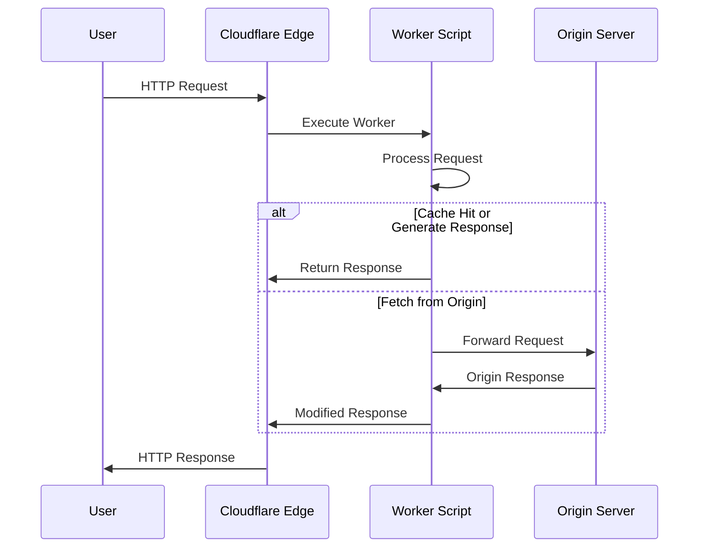

# How to Get Started with Cloudflare Workers

Author: [nawazdhandala](https://www.github.com/nawazdhandala)

Tags: Cloudflare Workers, Serverless, Edge Computing, JavaScript, API

Description: Learn how to build and deploy serverless applications at the edge with Cloudflare Workers, covering setup, routing, data storage, and production best practices.

---

> Cloudflare Workers lets you run JavaScript at the edge, closer to your users than traditional cloud functions. With execution in data centers across 300+ cities worldwide, your code runs within milliseconds of your users, making it perfect for APIs, authentication, A/B testing, and content transformation.

If you have been looking at serverless platforms and want something that runs closer to your users with minimal cold starts, Cloudflare Workers is worth exploring. This guide walks you through everything from your first Worker to production deployment.

---

## What Are Cloudflare Workers?

Cloudflare Workers are serverless functions that run on Cloudflare's edge network. Unlike traditional serverless platforms that run in specific regions, Workers execute in whichever data center is closest to the user making the request.

| Feature | Traditional Serverless | Cloudflare Workers |
|---------|----------------------|-------------------|
| **Execution Location** | Specific region | Nearest edge location |
| **Cold Start** | 100ms - several seconds | Sub-millisecond |
| **Runtime** | Node.js, Python, etc. | V8 JavaScript/WASM |
| **Pricing Model** | Per invocation + duration | Per request (generous free tier) |
| **Max Execution Time** | 15 minutes (Lambda) | 30 seconds (paid), 10ms CPU (free) |

### How Workers Fit in the Request Flow



---

## Setting Up Your Development Environment

Before writing your first Worker, you need to install the Wrangler CLI, which handles development, testing, and deployment.

### Install Wrangler

Wrangler is Cloudflare's CLI tool for managing Workers. Install it globally using npm.

```bash
# Install Wrangler globally
npm install -g wrangler

# Verify installation
wrangler --version

# Login to your Cloudflare account
# This opens a browser window for authentication
wrangler login
```

### Create Your First Project

Use Wrangler to scaffold a new Worker project with all the necessary configuration files.

```bash
# Create a new Worker project
# This generates a project directory with starter files
wrangler init my-first-worker

# Navigate to the project directory
cd my-first-worker

# The project structure looks like this:
# my-first-worker/
#   src/
#     index.js      # Your Worker code
#   wrangler.toml   # Configuration file
#   package.json    # Node.js dependencies
```

---

## Writing Your First Worker

Workers use a simple request/response model. Every Worker exports a `fetch` handler that receives incoming requests and returns responses.

### Basic Hello World

This minimal example shows the structure of a Worker. The fetch handler receives the request object and returns a Response.

```javascript
// src/index.js
// Basic Worker that returns a greeting
// The fetch handler is the entry point for all HTTP requests

export default {
  // The fetch handler receives the request and environment bindings
  async fetch(request, env, ctx) {
    // Return a simple text response
    // Response constructor takes the body and optional init object
    return new Response('Hello from Cloudflare Workers!', {
      headers: {
        'Content-Type': 'text/plain',
      },
    });
  },
};
```

### Run Locally

Test your Worker locally before deploying. Wrangler provides a local development server that simulates the Workers runtime.

```bash
# Start local development server
# This runs your Worker at http://localhost:8787
wrangler dev

# The dev server supports hot reloading
# Changes to your code are reflected immediately
```

---

## Handling HTTP Requests

Workers can handle different HTTP methods and parse request data. Here is a more complete example that demonstrates routing based on method and path.

### Request Routing

This example shows how to build a simple router that handles different endpoints and methods.

```javascript
// src/index.js
// Worker with basic routing for different HTTP methods
// Demonstrates URL parsing and method-based routing

export default {
  async fetch(request, env, ctx) {
    // Parse the request URL to get the pathname
    const url = new URL(request.url);
    const path = url.pathname;
    const method = request.method;

    // Route based on path and method
    // This pattern scales well for small to medium APIs
    if (path === '/api/hello' && method === 'GET') {
      return handleHello(request);
    }

    if (path === '/api/echo' && method === 'POST') {
      return handleEcho(request);
    }

    if (path === '/api/users' && method === 'GET') {
      return handleGetUsers(url);
    }

    // Return 404 for unmatched routes
    return new Response('Not Found', { status: 404 });
  },
};

// Handler for GET /api/hello
// Returns a JSON greeting with timestamp
async function handleHello(request) {
  const data = {
    message: 'Hello from the edge!',
    timestamp: new Date().toISOString(),
    // Access request headers for additional context
    userAgent: request.headers.get('User-Agent'),
  };

  return new Response(JSON.stringify(data), {
    headers: {
      'Content-Type': 'application/json',
    },
  });
}

// Handler for POST /api/echo
// Echoes back the request body as JSON
async function handleEcho(request) {
  try {
    // Parse JSON body from the request
    const body = await request.json();

    return new Response(JSON.stringify({
      received: body,
      processedAt: new Date().toISOString(),
    }), {
      headers: { 'Content-Type': 'application/json' },
    });
  } catch (error) {
    // Handle JSON parsing errors gracefully
    return new Response(JSON.stringify({
      error: 'Invalid JSON body',
    }), {
      status: 400,
      headers: { 'Content-Type': 'application/json' },
    });
  }
}

// Handler for GET /api/users
// Demonstrates query parameter parsing
async function handleGetUsers(url) {
  // Extract query parameters
  const limit = parseInt(url.searchParams.get('limit')) || 10;
  const offset = parseInt(url.searchParams.get('offset')) || 0;

  // In a real app, you would fetch from a database
  const users = [
    { id: 1, name: 'Alice' },
    { id: 2, name: 'Bob' },
    { id: 3, name: 'Charlie' },
  ];

  // Apply pagination
  const paginated = users.slice(offset, offset + limit);

  return new Response(JSON.stringify({
    users: paginated,
    pagination: { limit, offset, total: users.length },
  }), {
    headers: { 'Content-Type': 'application/json' },
  });
}
```

---

## Working with KV Storage

Cloudflare KV is a key-value store optimized for read-heavy workloads. It is eventually consistent but provides low-latency reads from edge locations.

### Configure KV Namespace

First, create a KV namespace and bind it to your Worker in the configuration file.

```toml
# wrangler.toml
# Worker configuration with KV binding

name = "my-worker"
main = "src/index.js"
compatibility_date = "2024-01-01"

# KV namespace binding
# Create the namespace first: wrangler kv:namespace create "MY_KV"
[[kv_namespaces]]
binding = "MY_KV"          # Variable name in your Worker
id = "abc123..."           # Namespace ID from wrangler kv:namespace create
preview_id = "def456..."   # Optional: separate namespace for local dev
```

### Use KV in Your Worker

This example shows how to read and write data to KV storage.

```javascript
// src/index.js
// Worker that uses KV for data persistence
// KV is great for caching, session storage, and configuration

export default {
  async fetch(request, env, ctx) {
    const url = new URL(request.url);
    const path = url.pathname;

    // GET /kv/:key - Read a value from KV
    if (path.startsWith('/kv/') && request.method === 'GET') {
      const key = path.replace('/kv/', '');

      // env.MY_KV is the KV namespace binding from wrangler.toml
      const value = await env.MY_KV.get(key);

      if (value === null) {
        return new Response('Key not found', { status: 404 });
      }

      return new Response(value, {
        headers: { 'Content-Type': 'application/json' },
      });
    }

    // PUT /kv/:key - Write a value to KV
    if (path.startsWith('/kv/') && request.method === 'PUT') {
      const key = path.replace('/kv/', '');
      const value = await request.text();

      // Write to KV with optional expiration
      // expirationTtl is in seconds
      await env.MY_KV.put(key, value, {
        expirationTtl: 3600,  // Expire after 1 hour
      });

      return new Response(JSON.stringify({
        success: true,
        key: key,
      }), {
        headers: { 'Content-Type': 'application/json' },
      });
    }

    // DELETE /kv/:key - Remove a value from KV
    if (path.startsWith('/kv/') && request.method === 'DELETE') {
      const key = path.replace('/kv/', '');

      await env.MY_KV.delete(key);

      return new Response(JSON.stringify({
        success: true,
        deleted: key,
      }), {
        headers: { 'Content-Type': 'application/json' },
      });
    }

    return new Response('Not Found', { status: 404 });
  },
};
```

### KV with JSON Data

When storing objects, serialize them to JSON and optionally use metadata for quick filtering.

```javascript
// Store and retrieve JSON data with metadata
// Metadata is returned with list operations without reading the value

async function storeUser(kv, user) {
  const key = `user:${user.id}`;

  // Store the full user object as JSON
  // Metadata allows filtering in list operations
  await kv.put(key, JSON.stringify(user), {
    metadata: {
      email: user.email,
      role: user.role,
      createdAt: new Date().toISOString(),
    },
  });
}

async function getUser(kv, userId) {
  const key = `user:${userId}`;

  // Get with metadata returns both value and metadata
  const { value, metadata } = await kv.getWithMetadata(key);

  if (!value) return null;

  return {
    ...JSON.parse(value),
    _metadata: metadata,
  };
}

async function listUsers(kv, prefix = 'user:') {
  // List keys with a prefix
  // Returns keys and metadata, not values (for efficiency)
  const list = await kv.list({ prefix });

  return list.keys.map(key => ({
    id: key.name.replace('user:', ''),
    ...key.metadata,
  }));
}
```

---

## Durable Objects for Stateful Applications

While KV is eventually consistent, Durable Objects provide strong consistency for use cases like real-time collaboration, rate limiting, or anything requiring coordination.

### Define a Durable Object

Durable Objects are JavaScript classes that maintain state and handle requests. Each instance is guaranteed to run in a single location.

```javascript
// src/counter.js
// Durable Object that implements a strongly consistent counter
// Each counter has a unique ID and maintains its own state

export class Counter {
  constructor(state, env) {
    // state.storage provides persistent storage
    // Data is stored in the same location as the Durable Object
    this.state = state;
    this.env = env;
  }

  // Handle incoming requests to this Durable Object
  async fetch(request) {
    const url = new URL(request.url);

    // Get current count from storage (defaults to 0)
    let count = await this.state.storage.get('count') || 0;

    if (url.pathname === '/increment') {
      count++;
      // Storage operations are strongly consistent
      await this.state.storage.put('count', count);
    }

    if (url.pathname === '/decrement') {
      count--;
      await this.state.storage.put('count', count);
    }

    if (url.pathname === '/reset') {
      count = 0;
      await this.state.storage.put('count', count);
    }

    return new Response(JSON.stringify({ count }), {
      headers: { 'Content-Type': 'application/json' },
    });
  }
}
```

### Configure Durable Objects

Add the Durable Object class to your wrangler.toml configuration.

```toml
# wrangler.toml
# Configuration with Durable Objects binding

name = "my-worker"
main = "src/index.js"
compatibility_date = "2024-01-01"

# Durable Objects configuration
[[durable_objects.bindings]]
name = "COUNTER"           # Binding name in your Worker
class_name = "Counter"     # Class name exported from your code

# Tell Wrangler where to find the Durable Object class
[[migrations]]
tag = "v1"
new_classes = ["Counter"]
```

### Use Durable Objects from Your Worker

Access Durable Objects through their binding and get instances by ID.

```javascript
// src/index.js
// Worker that uses a Durable Object for consistent counting

// Export the Durable Object class
export { Counter } from './counter.js';

export default {
  async fetch(request, env, ctx) {
    const url = new URL(request.url);

    if (url.pathname.startsWith('/counter/')) {
      // Extract counter ID from the path
      const counterId = url.pathname.split('/')[2];
      const action = url.pathname.split('/')[3] || 'get';

      // Get a Durable Object instance by ID
      // The same ID always routes to the same instance
      const id = env.COUNTER.idFromName(counterId);
      const counter = env.COUNTER.get(id);

      // Forward the request to the Durable Object
      const counterUrl = new URL(request.url);
      counterUrl.pathname = '/' + action;

      return counter.fetch(counterUrl.toString());
    }

    return new Response('Not Found', { status: 404 });
  },
};
```

---

## Environment Variables and Secrets

Workers support environment variables for configuration and secrets for sensitive data.

### Configure Variables

Define variables in wrangler.toml for non-sensitive configuration.

```toml
# wrangler.toml
# Environment variables for different environments

name = "my-worker"
main = "src/index.js"

# Variables available in all environments
[vars]
API_VERSION = "v1"
LOG_LEVEL = "info"

# Environment-specific overrides
[env.staging.vars]
LOG_LEVEL = "debug"

[env.production.vars]
LOG_LEVEL = "warn"
```

### Add Secrets

Use Wrangler to add secrets that should not be in your codebase.

```bash
# Add a secret using Wrangler CLI
# Secrets are encrypted at rest
wrangler secret put API_KEY

# You will be prompted to enter the secret value
# Secrets are available in env just like variables
```

### Access Variables in Code

Variables and secrets are available through the env parameter.

```javascript
// src/index.js
// Worker that uses environment variables and secrets

export default {
  async fetch(request, env, ctx) {
    // Access environment variables from env object
    const apiVersion = env.API_VERSION;
    const logLevel = env.LOG_LEVEL;

    // Secrets are accessed the same way
    const apiKey = env.API_KEY;

    // Use the configuration
    if (logLevel === 'debug') {
      console.log('Debug mode enabled');
    }

    // Make authenticated requests to external APIs
    const response = await fetch('https://api.example.com/data', {
      headers: {
        'Authorization': `Bearer ${apiKey}`,
        'X-API-Version': apiVersion,
      },
    });

    return new Response(await response.text());
  },
};
```

---

## Making External Requests

Workers can fetch data from external APIs and transform responses before returning them to users.

### Fetch with Error Handling

This example shows how to proxy requests to an external API with proper error handling.

```javascript
// src/index.js
// Worker that proxies requests to an external API
// Includes timeout handling and error responses

export default {
  async fetch(request, env, ctx) {
    const url = new URL(request.url);

    if (url.pathname === '/api/weather') {
      return handleWeatherRequest(url, env);
    }

    return new Response('Not Found', { status: 404 });
  },
};

async function handleWeatherRequest(url, env) {
  const city = url.searchParams.get('city');

  if (!city) {
    return new Response(JSON.stringify({
      error: 'Missing city parameter',
    }), {
      status: 400,
      headers: { 'Content-Type': 'application/json' },
    });
  }

  try {
    // Create an AbortController for timeout handling
    const controller = new AbortController();
    const timeoutId = setTimeout(() => controller.abort(), 5000);

    // Make the external API request
    const response = await fetch(
      `https://api.weather.com/v1/current?city=${encodeURIComponent(city)}`,
      {
        headers: {
          'Authorization': `Bearer ${env.WEATHER_API_KEY}`,
        },
        signal: controller.signal,
      }
    );

    clearTimeout(timeoutId);

    if (!response.ok) {
      // Handle non-200 responses from the upstream API
      return new Response(JSON.stringify({
        error: 'Weather API error',
        status: response.status,
      }), {
        status: 502,  // Bad Gateway
        headers: { 'Content-Type': 'application/json' },
      });
    }

    const data = await response.json();

    // Transform the response before returning
    return new Response(JSON.stringify({
      city: city,
      temperature: data.temp,
      conditions: data.conditions,
      fetchedAt: new Date().toISOString(),
    }), {
      headers: {
        'Content-Type': 'application/json',
        // Cache the response for 5 minutes
        'Cache-Control': 'public, max-age=300',
      },
    });

  } catch (error) {
    // Handle timeout and network errors
    if (error.name === 'AbortError') {
      return new Response(JSON.stringify({
        error: 'Request timeout',
      }), {
        status: 504,  // Gateway Timeout
        headers: { 'Content-Type': 'application/json' },
      });
    }

    return new Response(JSON.stringify({
      error: 'Failed to fetch weather data',
    }), {
      status: 500,
      headers: { 'Content-Type': 'application/json' },
    });
  }
}
```

---

## Caching Strategies

Workers can interact with Cloudflare's cache to improve performance and reduce origin load.

### Using the Cache API

The Cache API lets you store responses in Cloudflare's edge cache.

```javascript
// src/index.js
// Worker with custom caching logic
// Uses the Cache API for fine-grained cache control

export default {
  async fetch(request, env, ctx) {
    const url = new URL(request.url);

    // Only cache GET requests
    if (request.method !== 'GET') {
      return handleRequest(request, env);
    }

    // Create a cache key from the request URL
    const cacheKey = new Request(url.toString(), request);
    const cache = caches.default;

    // Check if we have a cached response
    let response = await cache.match(cacheKey);

    if (response) {
      // Return cached response with a header indicating cache hit
      response = new Response(response.body, response);
      response.headers.set('X-Cache-Status', 'HIT');
      return response;
    }

    // No cache hit, fetch fresh data
    response = await handleRequest(request, env);

    // Only cache successful responses
    if (response.ok) {
      // Clone the response since we need to read it and cache it
      const responseToCache = response.clone();

      // Add to cache in the background
      // ctx.waitUntil ensures the cache write completes
      ctx.waitUntil(cache.put(cacheKey, responseToCache));
    }

    response = new Response(response.body, response);
    response.headers.set('X-Cache-Status', 'MISS');
    return response;
  },
};

async function handleRequest(request, env) {
  // Your actual request handling logic
  const data = await fetchDataFromOrigin();

  return new Response(JSON.stringify(data), {
    headers: {
      'Content-Type': 'application/json',
      // Tell the cache how long to store this response
      'Cache-Control': 'public, max-age=3600',
    },
  });
}
```

---

## Deploying to Production

When your Worker is ready, deploy it to Cloudflare's edge network.

### Deploy with Wrangler

Use Wrangler to deploy your Worker to production.

```bash
# Deploy to production
wrangler deploy

# Deploy to a specific environment (e.g., staging)
wrangler deploy --env staging

# View deployment logs in real-time
wrangler tail

# Check the Worker's status
wrangler whoami
```

### Configure Routes

Routes determine which URLs trigger your Worker. Configure them in wrangler.toml or the Cloudflare dashboard.

```toml
# wrangler.toml
# Route configuration for production

name = "my-worker"
main = "src/index.js"

# Route all requests to api.example.com to this Worker
routes = [
  { pattern = "api.example.com/*", zone_name = "example.com" }
]

# Or use a custom domain
# workers_dev = false  # Disable the workers.dev subdomain
```

### Custom Domains

Set up a custom domain for your Worker through the Cloudflare dashboard or wrangler.toml.

```toml
# wrangler.toml
# Custom domain configuration

name = "my-api"
main = "src/index.js"

# Custom domain (requires the domain to be on Cloudflare)
routes = [
  { pattern = "api.mysite.com/*", zone_name = "mysite.com" }
]
```

---

## Error Handling Best Practices

Robust error handling ensures your Worker fails gracefully and provides useful debugging information.

```javascript
// src/index.js
// Worker with comprehensive error handling
// Catches errors and returns appropriate responses

export default {
  async fetch(request, env, ctx) {
    try {
      return await handleRequest(request, env, ctx);
    } catch (error) {
      // Log the error for debugging
      console.error('Worker error:', error.message, error.stack);

      // Return a user-friendly error response
      return new Response(JSON.stringify({
        error: 'Internal Server Error',
        // Only include details in non-production environments
        ...(env.ENVIRONMENT !== 'production' && {
          message: error.message,
        }),
      }), {
        status: 500,
        headers: { 'Content-Type': 'application/json' },
      });
    }
  },
};

async function handleRequest(request, env, ctx) {
  const url = new URL(request.url);

  // Validate required parameters early
  if (url.pathname === '/api/process') {
    const data = await request.json().catch(() => null);

    if (!data) {
      throw new ValidationError('Invalid JSON body');
    }

    if (!data.id) {
      throw new ValidationError('Missing required field: id');
    }

    return processData(data, env);
  }

  return new Response('Not Found', { status: 404 });
}

// Custom error class for validation errors
class ValidationError extends Error {
  constructor(message) {
    super(message);
    this.name = 'ValidationError';
    this.status = 400;
  }
}
```

---

## Testing Your Workers

Write tests to ensure your Worker behaves correctly before deploying.

### Unit Testing with Vitest

Vitest works well with Workers thanks to Miniflare integration.

```javascript
// test/worker.test.js
// Unit tests for Worker using Vitest and Miniflare

import { describe, it, expect, beforeAll } from 'vitest';
import { unstable_dev } from 'wrangler';

describe('Worker', () => {
  let worker;

  // Start the Worker before running tests
  beforeAll(async () => {
    worker = await unstable_dev('src/index.js', {
      experimental: { disableExperimentalWarning: true },
    });
  });

  // Stop the Worker after tests complete
  afterAll(async () => {
    await worker.stop();
  });

  it('returns hello message', async () => {
    const response = await worker.fetch('/api/hello');
    const data = await response.json();

    expect(response.status).toBe(200);
    expect(data.message).toBe('Hello from the edge!');
  });

  it('handles POST requests', async () => {
    const response = await worker.fetch('/api/echo', {
      method: 'POST',
      body: JSON.stringify({ test: 'data' }),
      headers: { 'Content-Type': 'application/json' },
    });

    const data = await response.json();

    expect(response.status).toBe(200);
    expect(data.received.test).toBe('data');
  });

  it('returns 404 for unknown routes', async () => {
    const response = await worker.fetch('/unknown');

    expect(response.status).toBe(404);
  });
});
```

---

## Conclusion

Cloudflare Workers provide a compelling platform for building serverless applications at the edge. Key takeaways:

- **Fast cold starts**: Sub-millisecond cold starts compared to seconds on traditional platforms
- **Global distribution**: Code runs in 300+ data centers automatically
- **KV and Durable Objects**: Choose eventually consistent storage for reads or strongly consistent storage for coordination
- **Simple deployment**: Deploy with a single command using Wrangler

Workers are particularly well-suited for APIs, authentication, content transformation, and any workload that benefits from low latency. Start with the free tier to experiment, and scale as your needs grow.

---

*Need to monitor your Cloudflare Workers? [OneUptime](https://oneuptime.com) provides comprehensive monitoring for serverless applications, including request tracking, error alerting, and performance metrics to keep your edge functions running smoothly.*
