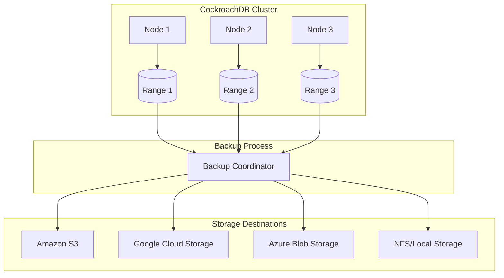
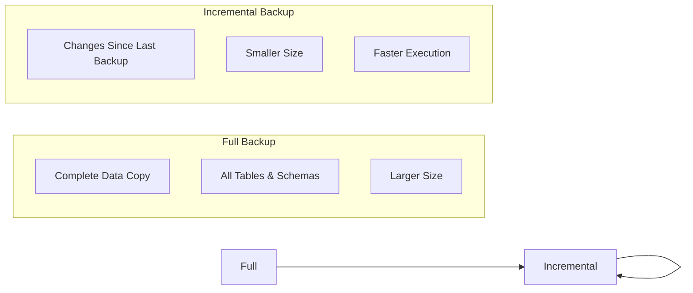
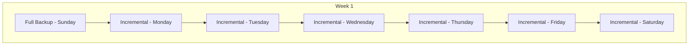
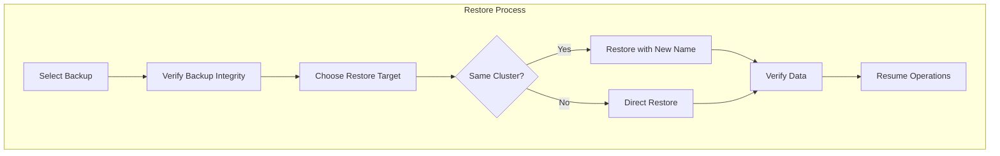
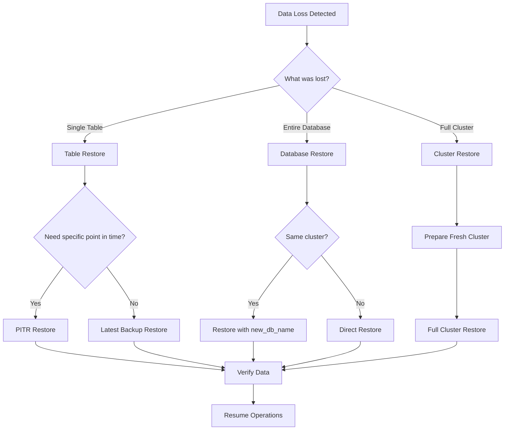

# How to Back Up and Restore CockroachDB

Author: [nawazdhandala](https://www.github.com/nawazdhandala)

Tags: CockroachDB, Backup, Restore, Database, Disaster Recovery, SQL

Description: A comprehensive guide to backing up and restoring CockroachDB databases, covering full and incremental backups, point-in-time recovery, cloud storage integration, and automated backup strategies for production environments.

---

CockroachDB is a distributed SQL database designed for resilience, but even the most resilient systems need proper backup strategies. Data loss from accidental deletions, application bugs, or compliance requirements makes backup and recovery essential skills. Here is everything you need to know about protecting your CockroachDB data.

## Understanding CockroachDB Backup Architecture



CockroachDB backups are distributed operations that capture consistent snapshots across all nodes. The database uses a distributed backup coordinator to ensure all ranges are captured at the same timestamp, guaranteeing transactional consistency.

## Backup Types in CockroachDB



CockroachDB supports three backup types:

- **Full Backup**: Captures all data at a point in time
- **Incremental Backup**: Captures only changes since the last backup
- **Revision History Backup**: Includes historical versions for point-in-time recovery

## Prerequisites and Setup

### Enabling Enterprise Features

Backup and restore functionality requires an enterprise license or CockroachDB Dedicated/Serverless. For testing, you can use a trial license.

The following SQL command sets up an enterprise license for your cluster.

```sql
-- Set enterprise license
SET CLUSTER SETTING cluster.organization = 'your-org-name';
SET CLUSTER SETTING enterprise.license = 'your-license-key';

-- Verify license status
SHOW CLUSTER SETTING cluster.organization;
```

### Configuring Cloud Storage Credentials

Before running backups to cloud storage, configure the appropriate credentials for your cloud provider.

The following example configures AWS credentials for S3 access.

```sql
-- For AWS S3 using IAM role (recommended)
-- No explicit credentials needed when running on EC2 with IAM role

-- For explicit AWS credentials
BACKUP DATABASE mydb INTO 's3://bucket-name/backup-path?AWS_ACCESS_KEY_ID=xxx&AWS_SECRET_ACCESS_KEY=yyy&AWS_REGION=us-east-1';

-- For Google Cloud Storage using implicit credentials
-- Ensure GOOGLE_APPLICATION_CREDENTIALS environment variable is set
BACKUP DATABASE mydb INTO 'gs://bucket-name/backup-path';

-- For Azure Blob Storage
BACKUP DATABASE mydb INTO 'azure://container-name/backup-path?AZURE_ACCOUNT_NAME=xxx&AZURE_ACCOUNT_KEY=yyy';
```

## Full Database Backup

### Basic Full Backup

A full backup captures the entire database state at a specific timestamp.

The following command creates a full backup of a single database to S3.

```sql
-- Backup a single database to S3
BACKUP DATABASE mydb
INTO 's3://my-bucket/cockroach-backups/mydb?AWS_ACCESS_KEY_ID=xxx&AWS_SECRET_ACCESS_KEY=yyy'
WITH revision_history;

-- Backup multiple databases
BACKUP DATABASE db1, db2, db3
INTO 's3://my-bucket/cockroach-backups/multi-db?AWS_ACCESS_KEY_ID=xxx&AWS_SECRET_ACCESS_KEY=yyy';

-- Backup entire cluster
BACKUP
INTO 's3://my-bucket/cockroach-backups/full-cluster?AWS_ACCESS_KEY_ID=xxx&AWS_SECRET_ACCESS_KEY=yyy';
```

### Backup with Encryption

Protecting backup data with encryption is critical for security compliance.

The following example demonstrates creating an encrypted backup using a passphrase.

```sql
-- Create encrypted backup with passphrase
BACKUP DATABASE mydb
INTO 's3://my-bucket/encrypted-backups/mydb?AWS_ACCESS_KEY_ID=xxx&AWS_SECRET_ACCESS_KEY=yyy'
WITH encryption_passphrase = 'your-secure-passphrase-here';

-- Create encrypted backup with KMS
BACKUP DATABASE mydb
INTO 's3://my-bucket/encrypted-backups/mydb?AWS_ACCESS_KEY_ID=xxx&AWS_SECRET_ACCESS_KEY=yyy'
WITH kms = 'aws:///arn:aws:kms:us-east-1:123456789:key/your-kms-key-id';
```

## Incremental Backups

### Creating Incremental Backups

Incremental backups significantly reduce storage costs and backup duration by capturing only changed data.



The following SQL demonstrates creating a full backup followed by incremental backups.

```sql
-- First, create a full backup (this establishes the base)
BACKUP DATABASE mydb
INTO 's3://my-bucket/backups/mydb?AWS_ACCESS_KEY_ID=xxx&AWS_SECRET_ACCESS_KEY=yyy';

-- Create incremental backup (appends to the latest full backup)
BACKUP DATABASE mydb
INTO LATEST IN 's3://my-bucket/backups/mydb?AWS_ACCESS_KEY_ID=xxx&AWS_SECRET_ACCESS_KEY=yyy';

-- Another incremental backup
BACKUP DATABASE mydb
INTO LATEST IN 's3://my-bucket/backups/mydb?AWS_ACCESS_KEY_ID=xxx&AWS_SECRET_ACCESS_KEY=yyy';
```

### Viewing Backup History

Checking backup history helps you understand your recovery options.

```sql
-- List all backups in a location
SHOW BACKUPS IN 's3://my-bucket/backups/mydb?AWS_ACCESS_KEY_ID=xxx&AWS_SECRET_ACCESS_KEY=yyy';

-- Show details of a specific backup
SHOW BACKUP 's3://my-bucket/backups/mydb/2024/01/15-120000.00?AWS_ACCESS_KEY_ID=xxx&AWS_SECRET_ACCESS_KEY=yyy';

-- Show backup contents
SHOW BACKUP SCHEMAS IN 's3://my-bucket/backups/mydb?AWS_ACCESS_KEY_ID=xxx&AWS_SECRET_ACCESS_KEY=yyy';
```

## Scheduled Backups

### Creating Backup Schedules

Automated backup schedules eliminate manual intervention and ensure consistent protection.

The following example creates a schedule with weekly full backups and hourly incremental backups.

```sql
-- Create a scheduled backup with incremental backups
CREATE SCHEDULE daily_backup
FOR BACKUP DATABASE mydb
INTO 's3://my-bucket/scheduled-backups/mydb?AWS_ACCESS_KEY_ID=xxx&AWS_SECRET_ACCESS_KEY=yyy'
WITH revision_history
RECURRING '@daily'
FULL BACKUP '@weekly'
WITH SCHEDULE OPTIONS first_run = 'now';

-- Create hourly incremental with daily full backup
CREATE SCHEDULE hourly_backup
FOR BACKUP DATABASE mydb
INTO 's3://my-bucket/hourly-backups/mydb?AWS_ACCESS_KEY_ID=xxx&AWS_SECRET_ACCESS_KEY=yyy'
RECURRING '@hourly'
FULL BACKUP '@daily';
```

### Managing Backup Schedules

The following commands help you monitor and manage your backup schedules.

```sql
-- View all backup schedules
SHOW SCHEDULES;

-- View schedule details
SHOW SCHEDULE 123456;

-- Pause a schedule
PAUSE SCHEDULE 123456;

-- Resume a schedule
RESUME SCHEDULE 123456;

-- Delete a schedule
DROP SCHEDULE 123456;
```

## Database Restoration

### Full Database Restore



Restoring a database from backup requires careful planning to avoid conflicts.

The following command restores a database from the latest backup.

```sql
-- Restore database from latest backup
RESTORE DATABASE mydb
FROM LATEST IN 's3://my-bucket/backups/mydb?AWS_ACCESS_KEY_ID=xxx&AWS_SECRET_ACCESS_KEY=yyy';

-- Restore with a new database name (useful for same-cluster restore)
RESTORE DATABASE mydb
FROM LATEST IN 's3://my-bucket/backups/mydb?AWS_ACCESS_KEY_ID=xxx&AWS_SECRET_ACCESS_KEY=yyy'
WITH new_db_name = 'mydb_restored';

-- Restore encrypted backup
RESTORE DATABASE mydb
FROM LATEST IN 's3://my-bucket/encrypted-backups/mydb?AWS_ACCESS_KEY_ID=xxx&AWS_SECRET_ACCESS_KEY=yyy'
WITH encryption_passphrase = 'your-secure-passphrase-here';
```

### Restoring Specific Tables

Sometimes you only need to recover specific tables rather than the entire database.

```sql
-- Restore a single table
RESTORE TABLE mydb.users
FROM LATEST IN 's3://my-bucket/backups/mydb?AWS_ACCESS_KEY_ID=xxx&AWS_SECRET_ACCESS_KEY=yyy';

-- Restore multiple tables
RESTORE TABLE mydb.users, mydb.orders, mydb.products
FROM LATEST IN 's3://my-bucket/backups/mydb?AWS_ACCESS_KEY_ID=xxx&AWS_SECRET_ACCESS_KEY=yyy';

-- Restore table with new name
RESTORE TABLE mydb.users
FROM LATEST IN 's3://my-bucket/backups/mydb?AWS_ACCESS_KEY_ID=xxx&AWS_SECRET_ACCESS_KEY=yyy'
WITH into_db = 'mydb', new_table_name = 'users_restored';
```

### Point-in-Time Recovery

Point-in-time recovery allows restoration to any moment within the backup retention period.

The following example demonstrates recovering data to a specific timestamp.

```sql
-- Restore to a specific point in time
RESTORE DATABASE mydb
FROM LATEST IN 's3://my-bucket/backups/mydb?AWS_ACCESS_KEY_ID=xxx&AWS_SECRET_ACCESS_KEY=yyy'
AS OF SYSTEM TIME '2024-01-15 14:30:00'
WITH new_db_name = 'mydb_pitr';

-- Restore to a specific backup timestamp
RESTORE DATABASE mydb
FROM '2024/01/15-120000.00' IN 's3://my-bucket/backups/mydb?AWS_ACCESS_KEY_ID=xxx&AWS_SECRET_ACCESS_KEY=yyy';
```

## Cluster Backup and Restore

### Full Cluster Backup

Cluster-level backups capture everything, including user accounts and privileges.

```sql
-- Full cluster backup
BACKUP
INTO 's3://my-bucket/cluster-backups?AWS_ACCESS_KEY_ID=xxx&AWS_SECRET_ACCESS_KEY=yyy'
WITH revision_history;

-- Scheduled cluster backup
CREATE SCHEDULE cluster_backup
FOR BACKUP
INTO 's3://my-bucket/cluster-backups?AWS_ACCESS_KEY_ID=xxx&AWS_SECRET_ACCESS_KEY=yyy'
WITH revision_history
RECURRING '@daily'
FULL BACKUP '@weekly';
```

### Cluster Restore

Restoring a full cluster requires careful preparation of the target environment.

```sql
-- Restore entire cluster (on a fresh cluster)
RESTORE
FROM LATEST IN 's3://my-bucket/cluster-backups?AWS_ACCESS_KEY_ID=xxx&AWS_SECRET_ACCESS_KEY=yyy';

-- Restore cluster with specific databases excluded
RESTORE
FROM LATEST IN 's3://my-bucket/cluster-backups?AWS_ACCESS_KEY_ID=xxx&AWS_SECRET_ACCESS_KEY=yyy'
WITH skip_missing_foreign_keys;
```

## Backup Monitoring and Validation

### Monitoring Backup Jobs

The following queries help you track backup progress and history.

```sql
-- View running backup jobs
SELECT * FROM [SHOW JOBS]
WHERE job_type = 'BACKUP'
AND status = 'running';

-- View backup job history
SELECT job_id, description, status, created, finished, error
FROM [SHOW JOBS]
WHERE job_type = 'BACKUP'
ORDER BY created DESC
LIMIT 20;

-- View failed backups
SELECT * FROM [SHOW JOBS]
WHERE job_type = 'BACKUP'
AND status = 'failed';
```

### Validating Backup Integrity

Regular validation ensures backups are usable when needed.

The following script creates a validation process for your backups.

```sql
-- Check backup details and verify it completed successfully
SHOW BACKUP
FROM LATEST IN 's3://my-bucket/backups/mydb?AWS_ACCESS_KEY_ID=xxx&AWS_SECRET_ACCESS_KEY=yyy'
WITH check_files;

-- Perform a test restore to validate backup
RESTORE DATABASE mydb
FROM LATEST IN 's3://my-bucket/backups/mydb?AWS_ACCESS_KEY_ID=xxx&AWS_SECRET_ACCESS_KEY=yyy'
WITH new_db_name = 'mydb_validation_test';

-- Verify row counts match
SELECT 'production' as source, COUNT(*) as count FROM mydb.users
UNION ALL
SELECT 'backup' as source, COUNT(*) as count FROM mydb_validation_test.users;

-- Clean up validation database
DROP DATABASE mydb_validation_test CASCADE;
```

## Automated Backup Script

### Shell Script for Backup Automation

The following shell script provides a complete backup solution with error handling and notifications.

```bash
#!/bin/bash
# cockroachdb-backup.sh
# Automated CockroachDB backup script with monitoring

set -euo pipefail

# Configuration
COCKROACH_HOST="${COCKROACH_HOST:-localhost}"
COCKROACH_PORT="${COCKROACH_PORT:-26257}"
COCKROACH_USER="${COCKROACH_USER:-root}"
COCKROACH_CERT_DIR="${COCKROACH_CERT_DIR:-/certs}"
DATABASE_NAME="${DATABASE_NAME:-mydb}"
S3_BUCKET="${S3_BUCKET:-my-backup-bucket}"
S3_PATH="${S3_PATH:-cockroach-backups}"
AWS_REGION="${AWS_REGION:-us-east-1}"
BACKUP_TYPE="${BACKUP_TYPE:-incremental}"  # full or incremental
ENCRYPTION_PASSPHRASE="${ENCRYPTION_PASSPHRASE:-}"
SLACK_WEBHOOK="${SLACK_WEBHOOK:-}"

# Timestamp for logging
TIMESTAMP=$(date +"%Y-%m-%d %H:%M:%S")
BACKUP_PATH="s3://${S3_BUCKET}/${S3_PATH}/${DATABASE_NAME}"

log() {
    echo "[${TIMESTAMP}] $1"
}

send_notification() {
    local message="$1"
    local status="$2"

    if [ -n "${SLACK_WEBHOOK}" ]; then
        local color="good"
        [ "$status" = "error" ] && color="danger"

        curl -s -X POST "${SLACK_WEBHOOK}" \
            -H 'Content-Type: application/json' \
            -d "{\"attachments\":[{\"color\":\"${color}\",\"text\":\"${message}\"}]}"
    fi
}

run_backup() {
    local backup_sql=""
    local backup_options="WITH revision_history"

    # Add encryption if passphrase provided
    if [ -n "${ENCRYPTION_PASSPHRASE}" ]; then
        backup_options="${backup_options}, encryption_passphrase = '${ENCRYPTION_PASSPHRASE}'"
    fi

    # Construct backup SQL based on type
    if [ "${BACKUP_TYPE}" = "full" ]; then
        backup_sql="BACKUP DATABASE ${DATABASE_NAME} INTO '${BACKUP_PATH}?AWS_REGION=${AWS_REGION}' ${backup_options};"
    else
        backup_sql="BACKUP DATABASE ${DATABASE_NAME} INTO LATEST IN '${BACKUP_PATH}?AWS_REGION=${AWS_REGION}' ${backup_options};"
    fi

    log "Starting ${BACKUP_TYPE} backup of ${DATABASE_NAME}"
    log "Destination: ${BACKUP_PATH}"

    # Execute backup
    cockroach sql \
        --host="${COCKROACH_HOST}" \
        --port="${COCKROACH_PORT}" \
        --user="${COCKROACH_USER}" \
        --certs-dir="${COCKROACH_CERT_DIR}" \
        --execute="${backup_sql}"

    return $?
}

verify_backup() {
    log "Verifying backup integrity"

    local verify_sql="SHOW BACKUP FROM LATEST IN '${BACKUP_PATH}?AWS_REGION=${AWS_REGION}' WITH check_files;"

    cockroach sql \
        --host="${COCKROACH_HOST}" \
        --port="${COCKROACH_PORT}" \
        --user="${COCKROACH_USER}" \
        --certs-dir="${COCKROACH_CERT_DIR}" \
        --execute="${verify_sql}"

    return $?
}

main() {
    log "=== CockroachDB Backup Started ==="

    # Run backup
    if run_backup; then
        log "Backup completed successfully"

        # Verify backup
        if verify_backup; then
            log "Backup verification passed"
            send_notification "CockroachDB ${BACKUP_TYPE} backup of ${DATABASE_NAME} completed successfully" "success"
        else
            log "Backup verification failed"
            send_notification "CockroachDB backup verification failed for ${DATABASE_NAME}" "error"
            exit 1
        fi
    else
        log "Backup failed"
        send_notification "CockroachDB backup failed for ${DATABASE_NAME}" "error"
        exit 1
    fi

    log "=== CockroachDB Backup Finished ==="
}

main "$@"
```

### Kubernetes CronJob for Backups

The following Kubernetes manifest schedules automated backups in a containerized environment.

```yaml
apiVersion: batch/v1
kind: CronJob
metadata:
  name: cockroachdb-backup
  namespace: cockroachdb
spec:
  schedule: "0 */6 * * *"  # Every 6 hours
  concurrencyPolicy: Forbid
  successfulJobsHistoryLimit: 3
  failedJobsHistoryLimit: 3
  jobTemplate:
    spec:
      backoffLimit: 3
      template:
        spec:
          serviceAccountName: cockroachdb-backup
          containers:
            - name: backup
              image: cockroachdb/cockroach:v23.2.0
              env:
                - name: COCKROACH_HOST
                  value: "cockroachdb-public"
                - name: COCKROACH_PORT
                  value: "26257"
                - name: COCKROACH_USER
                  value: "backup_user"
                - name: DATABASE_NAME
                  value: "mydb"
                - name: S3_BUCKET
                  valueFrom:
                    secretKeyRef:
                      name: backup-credentials
                      key: s3-bucket
                - name: AWS_ACCESS_KEY_ID
                  valueFrom:
                    secretKeyRef:
                      name: backup-credentials
                      key: aws-access-key
                - name: AWS_SECRET_ACCESS_KEY
                  valueFrom:
                    secretKeyRef:
                      name: backup-credentials
                      key: aws-secret-key
              command:
                - /bin/bash
                - -c
                - |
                  set -e

                  BACKUP_PATH="s3://${S3_BUCKET}/cockroach-backups/${DATABASE_NAME}"

                  echo "Starting incremental backup..."

                  cockroach sql \
                    --host=${COCKROACH_HOST} \
                    --port=${COCKROACH_PORT} \
                    --user=${COCKROACH_USER} \
                    --certs-dir=/certs \
                    --execute="BACKUP DATABASE ${DATABASE_NAME} INTO LATEST IN '${BACKUP_PATH}?AWS_ACCESS_KEY_ID=${AWS_ACCESS_KEY_ID}&AWS_SECRET_ACCESS_KEY=${AWS_SECRET_ACCESS_KEY}' WITH revision_history;"

                  echo "Backup completed successfully"
              volumeMounts:
                - name: client-certs
                  mountPath: /certs
                  readOnly: true
          volumes:
            - name: client-certs
              secret:
                secretName: cockroachdb-client-certs
          restartPolicy: OnFailure
---
apiVersion: batch/v1
kind: CronJob
metadata:
  name: cockroachdb-full-backup
  namespace: cockroachdb
spec:
  schedule: "0 2 * * 0"  # Weekly on Sunday at 2 AM
  concurrencyPolicy: Forbid
  jobTemplate:
    spec:
      backoffLimit: 3
      template:
        spec:
          serviceAccountName: cockroachdb-backup
          containers:
            - name: backup
              image: cockroachdb/cockroach:v23.2.0
              env:
                - name: COCKROACH_HOST
                  value: "cockroachdb-public"
                - name: DATABASE_NAME
                  value: "mydb"
                - name: S3_BUCKET
                  valueFrom:
                    secretKeyRef:
                      name: backup-credentials
                      key: s3-bucket
                - name: AWS_ACCESS_KEY_ID
                  valueFrom:
                    secretKeyRef:
                      name: backup-credentials
                      key: aws-access-key
                - name: AWS_SECRET_ACCESS_KEY
                  valueFrom:
                    secretKeyRef:
                      name: backup-credentials
                      key: aws-secret-key
              command:
                - /bin/bash
                - -c
                - |
                  set -e

                  BACKUP_PATH="s3://${S3_BUCKET}/cockroach-backups/${DATABASE_NAME}"

                  echo "Starting full backup..."

                  cockroach sql \
                    --host=${COCKROACH_HOST} \
                    --port=26257 \
                    --user=backup_user \
                    --certs-dir=/certs \
                    --execute="BACKUP DATABASE ${DATABASE_NAME} INTO '${BACKUP_PATH}?AWS_ACCESS_KEY_ID=${AWS_ACCESS_KEY_ID}&AWS_SECRET_ACCESS_KEY=${AWS_SECRET_ACCESS_KEY}' WITH revision_history;"

                  echo "Full backup completed successfully"
              volumeMounts:
                - name: client-certs
                  mountPath: /certs
                  readOnly: true
          volumes:
            - name: client-certs
              secret:
                secretName: cockroachdb-client-certs
          restartPolicy: OnFailure
```

## Backup Retention and Cleanup

### Configuring Backup Retention

Managing backup retention prevents storage costs from growing unbounded.

```sql
-- Create backup schedule with automatic garbage collection
CREATE SCHEDULE production_backup
FOR BACKUP DATABASE mydb
INTO 's3://my-bucket/backups/mydb?AWS_ACCESS_KEY_ID=xxx&AWS_SECRET_ACCESS_KEY=yyy'
WITH revision_history, detached
RECURRING '@hourly'
FULL BACKUP '@daily'
WITH SCHEDULE OPTIONS
  first_run = 'now',
  on_execution_failure = 'pause',
  on_previous_running = 'skip';

-- View current garbage collection settings
SHOW CLUSTER SETTING jobs.retention_time;

-- Adjust retention time for completed jobs
SET CLUSTER SETTING jobs.retention_time = '336h';  -- 14 days
```

### Manual Cleanup Script

The following script helps clean up old backups that exceed retention policy.

```bash
#!/bin/bash
# cleanup-old-backups.sh
# Remove CockroachDB backups older than retention period

set -euo pipefail

S3_BUCKET="${S3_BUCKET:-my-backup-bucket}"
S3_PATH="${S3_PATH:-cockroach-backups}"
RETENTION_DAYS="${RETENTION_DAYS:-30}"
DRY_RUN="${DRY_RUN:-true}"

# Calculate cutoff date
CUTOFF_DATE=$(date -d "${RETENTION_DAYS} days ago" +%Y-%m-%d)

echo "Cleaning up backups older than ${CUTOFF_DATE}"
echo "Dry run: ${DRY_RUN}"

# List and filter old backups
aws s3 ls "s3://${S3_BUCKET}/${S3_PATH}/" --recursive | while read -r line; do
    # Extract date from backup path
    backup_date=$(echo "$line" | awk '{print $1}')
    backup_path=$(echo "$line" | awk '{print $4}')

    if [[ "${backup_date}" < "${CUTOFF_DATE}" ]]; then
        echo "Found old backup: ${backup_path} (${backup_date})"

        if [ "${DRY_RUN}" = "false" ]; then
            aws s3 rm "s3://${S3_BUCKET}/${backup_path}"
            echo "Deleted: ${backup_path}"
        fi
    fi
done

echo "Cleanup complete"
```

## Disaster Recovery Runbook

### Recovery Decision Tree



### Emergency Restore Procedure

The following step-by-step commands walk through emergency database recovery.

```sql
-- Step 1: Assess the situation
-- Check what backups are available
SHOW BACKUPS IN 's3://my-bucket/backups/mydb?AWS_ACCESS_KEY_ID=xxx&AWS_SECRET_ACCESS_KEY=yyy';

-- Step 2: Identify the right backup timestamp
-- For accidental deletion, find the time just before the incident
SHOW BACKUP
FROM LATEST IN 's3://my-bucket/backups/mydb?AWS_ACCESS_KEY_ID=xxx&AWS_SECRET_ACCESS_KEY=yyy';

-- Step 3: Restore to a new database name (preserves current state)
RESTORE DATABASE mydb
FROM LATEST IN 's3://my-bucket/backups/mydb?AWS_ACCESS_KEY_ID=xxx&AWS_SECRET_ACCESS_KEY=yyy'
AS OF SYSTEM TIME '2024-01-15 09:00:00'
WITH new_db_name = 'mydb_recovery';

-- Step 4: Verify recovered data
SELECT COUNT(*) FROM mydb_recovery.critical_table;

-- Step 5: If recovery is validated, swap databases
-- Option A: Rename databases (requires brief downtime)
ALTER DATABASE mydb RENAME TO mydb_corrupted;
ALTER DATABASE mydb_recovery RENAME TO mydb;

-- Option B: Copy specific tables back
INSERT INTO mydb.critical_table
SELECT * FROM mydb_recovery.critical_table
WHERE id NOT IN (SELECT id FROM mydb.critical_table);

-- Step 6: Clean up
DROP DATABASE mydb_corrupted CASCADE;
DROP DATABASE mydb_recovery CASCADE;  -- if using Option B
```

## Best Practices Summary

1. **Schedule regular backups**: Configure automated full backups weekly and incremental backups hourly
2. **Enable revision history**: Always use `WITH revision_history` for point-in-time recovery capability
3. **Encrypt your backups**: Use encryption passphrases or KMS for sensitive data
4. **Store backups offsite**: Use cloud storage in a different region than your primary cluster
5. **Test restore procedures**: Perform monthly restore tests to validate backup integrity
6. **Monitor backup jobs**: Set up alerts for failed backup jobs
7. **Document recovery procedures**: Maintain runbooks for common disaster scenarios
8. **Implement retention policies**: Balance storage costs with recovery requirements
9. **Use dedicated backup credentials**: Create separate database users with minimal required permissions
10. **Version your backup scripts**: Keep backup automation in source control

---

Protecting your CockroachDB data requires a comprehensive backup strategy that covers full and incremental backups, point-in-time recovery, and tested restore procedures. By implementing the practices outlined in this guide, you can confidently recover from any data loss scenario and maintain business continuity.
