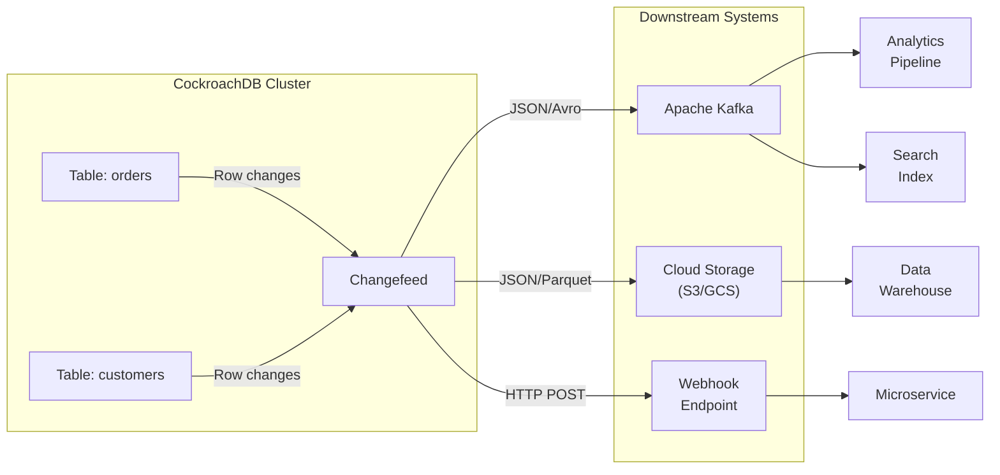
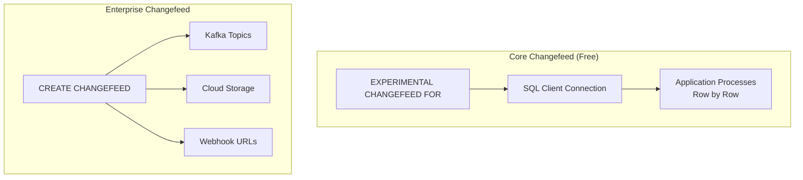
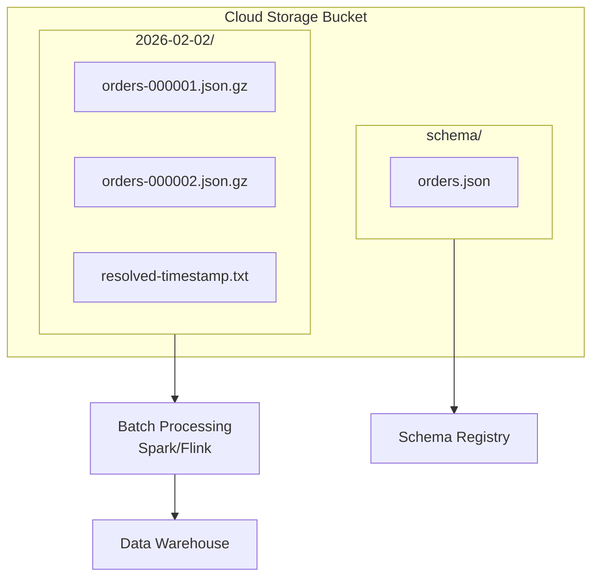
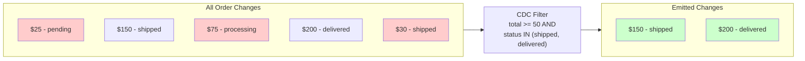
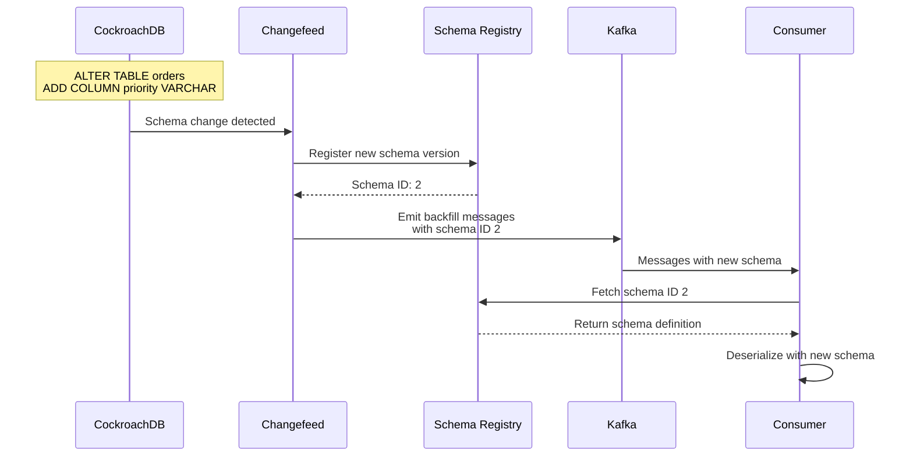
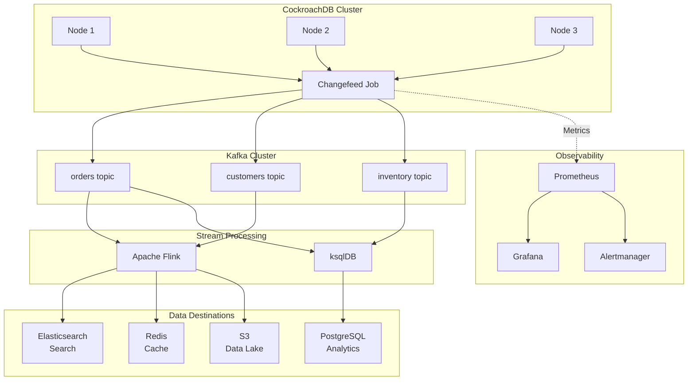

# How to Use Change Data Capture with CockroachDB

Author: [nawazdhandala](https://www.github.com/nawazdhandala)

Tags: CockroachDB, Change Data Capture, CDC, Database, Streaming, Kafka, Event-Driven Architecture, PostgreSQL

Description: A comprehensive guide to implementing Change Data Capture (CDC) with CockroachDB using changefeeds. Learn how to stream database changes to Kafka, cloud storage, and webhooks for real-time data pipelines and event-driven architectures.

---

Change Data Capture (CDC) enables applications to track and react to database changes in real-time. CockroachDB provides a powerful built-in feature called changefeeds that streams row-level changes to external systems like Kafka, cloud storage buckets, or webhooks. Capturing changes at the database level eliminates the need for application-level event publishing and ensures data consistency across your distributed systems.

## What is Change Data Capture?

Change Data Capture is a pattern for tracking row-level changes (inserts, updates, and deletes) in a database and delivering those changes to downstream consumers. Instead of polling tables for changes or implementing application-level event publishing, CDC captures changes directly from the database transaction log.



Key benefits of CDC with CockroachDB:

- Exactly-once delivery semantics with enterprise changefeeds
- No application code changes required to capture events
- Consistent capture across distributed database nodes
- Support for multiple output formats (JSON, Avro, Parquet)
- Built-in support for Kafka, cloud storage, and webhooks

## CockroachDB Changefeed Types

CockroachDB offers two types of changefeeds:

| Feature | Core Changefeed | Enterprise Changefeed |
|---------|-----------------|----------------------|
| License | Free | Enterprise |
| Output | SQL client cursor | Kafka, Cloud Storage, Webhook |
| Delivery | At-least-once | Exactly-once (with Kafka) |
| Schema Changes | Limited | Full support |
| Filtering | None | WHERE clause support |
| Aggregation | None | CDC queries support |



## Setting Up Core Changefeeds

Core changefeeds are available in the free tier and stream changes directly to a SQL client connection. They are useful for development, testing, and simple use cases.

The following SQL statement creates a core changefeed that streams all changes from the orders table.

```sql
-- Core changefeed streams changes to the SQL client connection
-- Each change is returned as a row with the timestamp and JSON payload
-- Note: Core changefeeds are experimental and intended for development use

EXPERIMENTAL CHANGEFEED FOR orders
WITH updated, resolved='10s';
```

Here is a complete example using Node.js to consume a core changefeed.

```javascript
// core-changefeed-consumer.js
// Consume CockroachDB core changefeed using the PostgreSQL driver
// Core changefeeds stream changes directly through the SQL connection

const { Client } = require('pg');

// CockroachDB connection configuration
// Use the same connection string you would use for regular queries
const connectionConfig = {
    host: 'localhost',
    port: 26257,
    database: 'myapp',
    user: 'root',
    ssl: false // Enable SSL in production
};

async function consumeCoreChangefeed() {
    const client = new Client(connectionConfig);

    try {
        await client.connect();
        console.log('Connected to CockroachDB');

        // Start the changefeed query
        // The query runs indefinitely, streaming changes as they occur
        const query = `
            EXPERIMENTAL CHANGEFEED FOR orders
            WITH updated, resolved='10s'
        `;

        // Use query streaming to process rows as they arrive
        const stream = client.query(new Query(query));

        stream.on('row', (row) => {
            // Each row contains: table, key, value
            const table = row.table;
            const key = JSON.parse(row.key);
            const value = row.value ? JSON.parse(row.value) : null;

            if (value === null) {
                // Null value indicates a DELETE operation
                console.log(`DELETE from ${table}:`, key);
                handleDelete(table, key);
            } else {
                // Non-null value indicates INSERT or UPDATE
                console.log(`UPSERT to ${table}:`, value);
                handleUpsert(table, key, value);
            }
        });

        stream.on('error', (err) => {
            console.error('Changefeed error:', err);
        });

    } catch (error) {
        console.error('Connection error:', error);
        throw error;
    }
}

function handleUpsert(table, key, value) {
    // Process insert or update events
    // Implement your business logic here
    console.log(`Processing change for ${table}:`, {
        key,
        order_id: value.order_id,
        status: value.status,
        total: value.total
    });
}

function handleDelete(table, key) {
    // Process delete events
    // Key contains the primary key values of the deleted row
    console.log(`Processing deletion from ${table}:`, key);
}

// Start consuming the changefeed
consumeCoreChangefeed().catch(console.error);
```

## Creating Enterprise Changefeeds to Kafka

Enterprise changefeeds provide production-grade CDC with delivery guarantees. Streaming to Kafka is the most common pattern for building event-driven architectures.

The following SQL creates a changefeed that streams changes to a Kafka cluster.

```sql
-- Create an enterprise changefeed streaming to Kafka
-- Changes are published as JSON messages to the specified topic
-- The topic is created automatically if it does not exist

CREATE CHANGEFEED FOR TABLE orders, customers
INTO 'kafka://kafka-broker-1:9092,kafka-broker-2:9092'
WITH format = 'json',
     updated,
     resolved = '10s',
     kafka_sink_config = '{"Flush": {"Messages": 1000, "Frequency": "1s"}}';
```

Here is a more complete configuration with authentication and schema registry.

```sql
-- Enterprise changefeed with Avro format and schema registry
-- Avro provides schema evolution and smaller message sizes
-- Schema registry ensures consumers can decode messages correctly

CREATE CHANGEFEED FOR TABLE orders
INTO 'kafka://kafka-broker:9092'
WITH format = 'avro',
     confluent_schema_registry = 'https://schema-registry:8081',
     updated,
     resolved = '10s',
     -- Configure SASL authentication for secure Kafka clusters
     sasl_enabled = true,
     sasl_mechanism = 'PLAIN',
     sasl_user = 'changefeed-user',
     sasl_password = 'secure-password',
     -- Topic naming: database_schema_table format
     full_table_name;
```

The Kafka message structure includes metadata about the change.

```json
{
  "after": {
    "order_id": "ord-12345",
    "customer_id": "cust-789",
    "status": "shipped",
    "total": 149.99,
    "updated_at": "2026-02-02T10:30:00Z"
  },
  "before": {
    "order_id": "ord-12345",
    "customer_id": "cust-789",
    "status": "processing",
    "total": 149.99,
    "updated_at": "2026-02-02T09:00:00Z"
  },
  "updated": "1706869800000000000.0000000000"
}
```

## Consuming Kafka Changefeeds with Node.js

Here is a complete Node.js consumer for processing CockroachDB changefeeds from Kafka.

```javascript
// kafka-changefeed-consumer.js
// Consume CockroachDB changefeed messages from Kafka
// Implements exactly-once processing with consumer group coordination

const { Kafka } = require('kafkajs');

// Initialize Kafka client with connection to your cluster
const kafka = new Kafka({
    clientId: 'cockroachdb-cdc-consumer',
    brokers: ['kafka-broker-1:9092', 'kafka-broker-2:9092'],
    // Configure SSL and SASL for production
    ssl: true,
    sasl: {
        mechanism: 'plain',
        username: process.env.KAFKA_USERNAME,
        password: process.env.KAFKA_PASSWORD
    }
});

// Create consumer with a consumer group
// Multiple consumers in the same group share partition assignments
const consumer = kafka.consumer({
    groupId: 'order-processor-group',
    // Start from earliest to process historical changes on first run
    sessionTimeout: 30000,
    heartbeatInterval: 3000
});

async function processChangeEvent(message) {
    const change = JSON.parse(message.value.toString());

    // Handle resolved timestamps (checkpoint messages)
    // Resolved messages indicate all changes up to this timestamp have been sent
    if (change.resolved) {
        console.log('Checkpoint:', change.resolved);
        return;
    }

    // Extract the before and after states
    const { before, after, updated } = change;

    // Determine the type of change
    let changeType;
    if (!before && after) {
        changeType = 'INSERT';
    } else if (before && after) {
        changeType = 'UPDATE';
    } else if (before && !after) {
        changeType = 'DELETE';
    }

    console.log(`[${changeType}] Order:`, {
        orderId: after?.order_id || before?.order_id,
        timestamp: updated
    });

    // Route to appropriate handler based on change type
    switch (changeType) {
        case 'INSERT':
            await handleNewOrder(after);
            break;
        case 'UPDATE':
            await handleOrderUpdate(before, after);
            break;
        case 'DELETE':
            await handleOrderDeletion(before);
            break;
    }
}

async function handleNewOrder(order) {
    // Process new order - send confirmation email, update inventory, etc.
    console.log('New order received:', order.order_id);

    // Example: Update search index
    await updateSearchIndex('orders', order.order_id, order);

    // Example: Send notification
    await sendOrderNotification(order.customer_id, 'order_created', order);
}

async function handleOrderUpdate(before, after) {
    // Process order update - check for status changes
    if (before.status !== after.status) {
        console.log(`Order ${after.order_id} status: ${before.status} -> ${after.status}`);

        // Trigger actions based on status transitions
        if (after.status === 'shipped') {
            await sendShippingNotification(after);
        } else if (after.status === 'delivered') {
            await requestReview(after);
        }
    }

    // Update search index with new data
    await updateSearchIndex('orders', after.order_id, after);
}

async function handleOrderDeletion(order) {
    // Process order deletion - cleanup related data
    console.log('Order deleted:', order.order_id);

    // Remove from search index
    await removeFromSearchIndex('orders', order.order_id);
}

async function runConsumer() {
    await consumer.connect();
    console.log('Connected to Kafka');

    // Subscribe to the changefeed topic
    // Topic name follows the pattern: database_schema_table
    await consumer.subscribe({
        topics: ['myapp_public_orders'],
        fromBeginning: false
    });

    // Process messages with automatic offset commits
    await consumer.run({
        eachMessage: async ({ topic, partition, message }) => {
            try {
                await processChangeEvent(message);
            } catch (error) {
                console.error('Error processing message:', error);
                // Implement dead letter queue for failed messages
                await sendToDeadLetterQueue(topic, message, error);
            }
        }
    });
}

// Graceful shutdown handling
process.on('SIGTERM', async () => {
    console.log('Shutting down consumer...');
    await consumer.disconnect();
    process.exit(0);
});

runConsumer().catch(console.error);
```

## Streaming to Cloud Storage

Enterprise changefeeds can write directly to cloud storage buckets for data lake and data warehouse integrations.

```sql
-- Stream changes to Google Cloud Storage
-- Files are written in batches based on time and size thresholds
-- Useful for data lake ingestion and batch analytics

CREATE CHANGEFEED FOR TABLE orders, order_items
INTO 'gs://my-bucket/changefeeds/orders'
WITH format = 'json',
     updated,
     resolved = '1m',
     -- Control file partitioning
     partition_format = 'daily',
     -- Compress output files
     compression = 'gzip',
     -- Include schema information
     schema_prefix = 'schema',
     -- Use service account for authentication
     AUTH = 'specified',
     CREDENTIALS = 'service-account-key-json';
```

Here is the equivalent for AWS S3.

```sql
-- Stream changes to AWS S3
-- Configure IAM authentication for secure access
-- Parquet format provides efficient columnar storage for analytics

CREATE CHANGEFEED FOR TABLE orders
INTO 's3://my-bucket/changefeeds/orders?AWS_ACCESS_KEY_ID=xxx&AWS_SECRET_ACCESS_KEY=xxx&AWS_REGION=us-east-1'
WITH format = 'parquet',
     updated,
     resolved = '5m',
     partition_format = 'hourly',
     file_size = '64MB';
```

The cloud storage output structure looks like this.



## Using Webhook Sinks

Webhook sinks allow direct HTTP delivery of changes to any endpoint. Webhooks are ideal for integrating with services that do not support Kafka.

```sql
-- Create a changefeed that posts changes to a webhook endpoint
-- Changes are batched and sent as HTTP POST requests
-- Implement retry logic in your webhook handler

CREATE CHANGEFEED FOR TABLE orders
INTO 'webhook-https://api.myservice.com/webhooks/orders'
WITH format = 'json',
     updated,
     resolved = '10s',
     -- Configure webhook behavior
     webhook_sink_config = '{
         "Flush": {
             "Messages": 100,
             "Bytes": 1048576,
             "Frequency": "1s"
         },
         "Retry": {
             "Max": 5,
             "Backoff": "500ms"
         }
     }',
     -- Include authorization header
     webhook_auth_header = 'Bearer your-secret-token';
```

Here is an Express.js server that handles webhook deliveries.

```javascript
// webhook-server.js
// Express server to receive CockroachDB changefeed webhook deliveries
// Implements idempotent processing to handle retries correctly

const express = require('express');
const crypto = require('crypto');

const app = express();
app.use(express.json({ limit: '10mb' }));

// Store processed message IDs to ensure idempotency
// In production, use Redis or a database for distributed deployments
const processedMessages = new Set();

// Middleware to validate webhook signature
function validateWebhookSignature(req, res, next) {
    const signature = req.headers['x-webhook-signature'];
    const payload = JSON.stringify(req.body);

    const expectedSignature = crypto
        .createHmac('sha256', process.env.WEBHOOK_SECRET)
        .update(payload)
        .digest('hex');

    if (signature !== expectedSignature) {
        console.error('Invalid webhook signature');
        return res.status(401).json({ error: 'Invalid signature' });
    }

    next();
}

// Webhook endpoint for receiving changefeed events
app.post('/webhooks/orders', validateWebhookSignature, async (req, res) => {
    const { payload } = req.body;

    // Process each change in the batch
    for (const change of payload) {
        // Handle resolved timestamps (checkpoint markers)
        if (change.resolved) {
            console.log('Checkpoint received:', change.resolved);
            continue;
        }

        // Generate unique message ID for idempotency
        const messageId = `${change.key}-${change.updated}`;

        // Skip already processed messages (handles retries)
        if (processedMessages.has(messageId)) {
            console.log('Skipping duplicate:', messageId);
            continue;
        }

        try {
            // Process the change event
            await processOrderChange(change);

            // Mark as processed
            processedMessages.add(messageId);

            // Cleanup old message IDs periodically
            if (processedMessages.size > 100000) {
                cleanupOldMessageIds();
            }
        } catch (error) {
            console.error('Error processing change:', error);
            // Return 500 to trigger webhook retry
            return res.status(500).json({ error: 'Processing failed' });
        }
    }

    // Acknowledge successful processing
    res.status(200).json({ status: 'ok', processed: payload.length });
});

async function processOrderChange(change) {
    const { before, after, updated } = change;

    if (!before && after) {
        // New order created
        console.log('New order:', after.order_id);
        await notifyOrderCreated(after);
    } else if (before && after) {
        // Order updated
        console.log('Order updated:', after.order_id);
        await notifyOrderUpdated(before, after);
    } else if (before && !after) {
        // Order deleted
        console.log('Order deleted:', before.order_id);
        await notifyOrderDeleted(before);
    }
}

// Health check endpoint
app.get('/health', (req, res) => {
    res.json({ status: 'healthy' });
});

const PORT = process.env.PORT || 3000;
app.listen(PORT, () => {
    console.log(`Webhook server listening on port ${PORT}`);
});
```

## Filtering Changes with CDC Queries

Enterprise changefeeds support WHERE clauses to filter which changes are emitted. Filtering reduces downstream processing load and Kafka storage costs.

```sql
-- Filter changefeed to only emit high-value orders
-- Reduces message volume by excluding low-value changes
-- Useful for tiered processing pipelines

CREATE CHANGEFEED FOR TABLE orders
INTO 'kafka://kafka:9092'
WITH format = 'json',
     updated
AS SELECT order_id, customer_id, total, status, updated_at
   FROM orders
   WHERE total > 100.00;
```

Here is a more complex filtering example.

```sql
-- Changefeed with multiple filter conditions
-- Only captures orders that transition to specific statuses
-- Joins are not supported, but you can filter on single table columns

CREATE CHANGEFEED FOR TABLE orders
INTO 'kafka://kafka:9092'
WITH format = 'json',
     updated,
     diff  -- Include only changed columns in update messages
AS SELECT order_id,
          customer_id,
          status,
          total,
          shipping_address,
          updated_at
   FROM orders
   WHERE status IN ('shipped', 'delivered', 'returned')
     AND total >= 50.00;
```

The following diagram shows how filtering reduces message volume.



## Managing Changefeed Lifecycle

Changefeeds need to be monitored and managed in production. CockroachDB provides SQL commands for lifecycle management.

```sql
-- View all running changefeeds with their status
-- Shows job ID, status, running time, and high-water timestamp
SHOW CHANGEFEED JOBS;

-- Get detailed information about a specific changefeed
SHOW CHANGEFEED JOB 123456789;

-- Pause a changefeed (useful for maintenance)
-- The changefeed will resume from where it left off
PAUSE JOB 123456789;

-- Resume a paused changefeed
RESUME JOB 123456789;

-- Cancel a changefeed permanently
-- Use with caution - this cannot be undone
CANCEL JOB 123456789;
```

Here is a Python script for automated changefeed monitoring.

```python
# changefeed_monitor.py
# Monitor CockroachDB changefeed health and alert on issues
# Tracks lag, errors, and automatically restarts failed changefeeds

import psycopg2
import time
from datetime import datetime, timedelta
from typing import Dict, List, Optional
import requests

# Database connection configuration
DB_CONFIG = {
    'host': 'cockroachdb-host',
    'port': 26257,
    'database': 'myapp',
    'user': 'monitor_user',
    'password': 'secure-password',
    'sslmode': 'verify-full',
    'sslrootcert': '/path/to/ca.crt'
}

# Alert configuration
SLACK_WEBHOOK_URL = 'https://hooks.slack.com/services/xxx'
MAX_LAG_SECONDS = 300  # Alert if lag exceeds 5 minutes


def get_changefeed_status(conn) -> List[Dict]:
    """
    Query the status of all changefeeds in the cluster.
    Returns a list of changefeed details including lag information.
    """
    query = """
        SELECT
            job_id,
            description,
            status,
            running_status,
            created,
            high_water_timestamp,
            error
        FROM [SHOW CHANGEFEED JOBS]
        WHERE status != 'canceled'
    """

    with conn.cursor() as cur:
        cur.execute(query)
        columns = [desc[0] for desc in cur.description]
        return [dict(zip(columns, row)) for row in cur.fetchall()]


def calculate_lag_seconds(high_water_timestamp: Optional[str]) -> Optional[float]:
    """
    Calculate the lag between the high-water timestamp and current time.
    High-water timestamp indicates the most recently processed change.
    """
    if not high_water_timestamp:
        return None

    # CockroachDB timestamps are in nanoseconds
    hw_seconds = int(high_water_timestamp.split('.')[0]) / 1e9
    hw_datetime = datetime.fromtimestamp(hw_seconds)

    lag = datetime.utcnow() - hw_datetime
    return lag.total_seconds()


def send_alert(message: str, severity: str = 'warning'):
    """Send alert to Slack channel."""
    color = '#ff0000' if severity == 'critical' else '#ffaa00'

    payload = {
        'attachments': [{
            'color': color,
            'title': f'CockroachDB Changefeed Alert ({severity.upper()})',
            'text': message,
            'ts': int(time.time())
        }]
    }

    try:
        requests.post(SLACK_WEBHOOK_URL, json=payload, timeout=10)
    except Exception as e:
        print(f'Failed to send alert: {e}')


def restart_failed_changefeed(conn, job_id: int):
    """
    Attempt to restart a failed changefeed.
    Pauses and resumes to clear transient errors.
    """
    try:
        with conn.cursor() as cur:
            # First pause, then resume
            cur.execute(f'PAUSE JOB {job_id}')
            time.sleep(2)
            cur.execute(f'RESUME JOB {job_id}')
            conn.commit()

        print(f'Successfully restarted changefeed job {job_id}')
        return True
    except Exception as e:
        print(f'Failed to restart job {job_id}: {e}')
        return False


def monitor_changefeeds():
    """
    Main monitoring loop that checks changefeed health.
    Runs continuously and alerts on issues.
    """
    conn = psycopg2.connect(**DB_CONFIG)

    while True:
        try:
            changefeeds = get_changefeed_status(conn)

            for cf in changefeeds:
                job_id = cf['job_id']
                status = cf['status']
                error = cf.get('error')

                # Check for failed changefeeds
                if status == 'failed':
                    message = f"Changefeed {job_id} has failed: {error}"
                    send_alert(message, severity='critical')

                    # Attempt automatic restart
                    if restart_failed_changefeed(conn, job_id):
                        send_alert(f"Changefeed {job_id} restarted successfully")

                # Check for paused changefeeds (might indicate issues)
                elif status == 'paused':
                    message = f"Changefeed {job_id} is paused"
                    send_alert(message, severity='warning')

                # Check for high lag
                elif status == 'running':
                    lag = calculate_lag_seconds(cf.get('high_water_timestamp'))

                    if lag and lag > MAX_LAG_SECONDS:
                        message = f"Changefeed {job_id} lag is {lag:.0f}s (threshold: {MAX_LAG_SECONDS}s)"
                        send_alert(message, severity='warning')
                    else:
                        print(f"Changefeed {job_id}: healthy, lag={lag:.1f}s")

            # Check every minute
            time.sleep(60)

        except Exception as e:
            print(f'Monitoring error: {e}')
            send_alert(f'Changefeed monitoring error: {e}', severity='critical')
            time.sleep(10)


if __name__ == '__main__':
    print('Starting changefeed monitor...')
    monitor_changefeeds()
```

## Handling Schema Changes

CockroachDB changefeeds can handle schema evolution gracefully. Configure the changefeed to manage schema changes appropriately.

```sql
-- Changefeed with schema change handling options
-- schema_change_policy controls behavior when table schema changes
-- 'backfill' re-emits all existing rows when schema changes

CREATE CHANGEFEED FOR TABLE orders
INTO 'kafka://kafka:9092'
WITH format = 'json',
     updated,
     -- Options: 'backfill', 'nobackfill', 'stop'
     schema_change_policy = 'backfill',
     -- Include schema in each message for self-describing events
     envelope = 'wrapped',
     -- Emit events when schema changes
     schema_change_events = 'column_changes';
```

When using Avro format with schema registry, schema evolution is handled automatically.



Here is how to handle schema evolution in your consumer.

```python
# schema_evolution_consumer.py
# Kafka consumer that handles CockroachDB changefeed schema evolution
# Uses Avro with schema registry for seamless schema changes

from confluent_kafka import Consumer
from confluent_kafka.avro import AvroConsumer
from confluent_kafka.avro.serializer import SerializerError

# Configure Avro consumer with schema registry
consumer_config = {
    'bootstrap.servers': 'kafka:9092',
    'group.id': 'order-consumer-group',
    'auto.offset.reset': 'earliest',
    'schema.registry.url': 'http://schema-registry:8081'
}

consumer = AvroConsumer(consumer_config)
consumer.subscribe(['myapp_public_orders'])


def process_with_schema_evolution():
    """
    Process messages handling schema evolution transparently.
    Avro deserializer automatically handles schema differences.
    """
    while True:
        try:
            msg = consumer.poll(1.0)

            if msg is None:
                continue

            if msg.error():
                print(f'Consumer error: {msg.error()}')
                continue

            # Value is automatically deserialized with correct schema
            # New fields are present, removed fields are absent
            value = msg.value()

            # Handle potentially missing fields from older schema
            order_id = value.get('order_id')
            status = value.get('status')
            # New field - may be None for older records
            priority = value.get('priority', 'normal')

            print(f'Order {order_id}: status={status}, priority={priority}')

            # Process the order with all available fields
            process_order(value)

        except SerializerError as e:
            print(f'Schema error: {e}')
            # Log and continue - do not crash on schema issues
            continue


def process_order(order: dict):
    """
    Process order with forward-compatible field access.
    Always use .get() with defaults for optional/new fields.
    """
    required_fields = ['order_id', 'customer_id', 'total']

    # Validate required fields exist
    for field in required_fields:
        if field not in order:
            raise ValueError(f'Missing required field: {field}')

    # Process with optional fields
    shipping_priority = order.get('priority', 'standard')
    expedited = order.get('expedited_shipping', False)

    print(f"Processing order {order['order_id']} "
          f"(priority: {shipping_priority}, expedited: {expedited})")


if __name__ == '__main__':
    process_with_schema_evolution()
```

## Building a Complete CDC Pipeline

Here is an architecture for a production CDC pipeline using CockroachDB changefeeds.



Here is the changefeed configuration for multiple tables.

```sql
-- Production changefeed configuration for multiple tables
-- Uses separate changefeeds per table for independent scaling
-- Each changefeed writes to its own Kafka topic

-- Orders changefeed with high-value filtering
CREATE CHANGEFEED FOR TABLE orders
INTO 'kafka://kafka:9092'
WITH format = 'avro',
     confluent_schema_registry = 'http://schema-registry:8081',
     topic_prefix = 'cdc.',
     updated,
     resolved = '10s',
     min_checkpoint_frequency = '30s',
     protect_data_from_gc_on_pause,
     on_error = 'pause'
AS SELECT * FROM orders WHERE total >= 10.00;

-- Customers changefeed for all changes
CREATE CHANGEFEED FOR TABLE customers
INTO 'kafka://kafka:9092'
WITH format = 'avro',
     confluent_schema_registry = 'http://schema-registry:8081',
     topic_prefix = 'cdc.',
     updated,
     diff,
     resolved = '30s';

-- Inventory changefeed with immediate delivery
CREATE CHANGEFEED FOR TABLE inventory
INTO 'kafka://kafka:9092'
WITH format = 'avro',
     confluent_schema_registry = 'http://schema-registry:8081',
     topic_prefix = 'cdc.',
     updated,
     resolved = '5s',
     kafka_sink_config = '{"Flush": {"Messages": 100, "Frequency": "100ms"}}';
```

## Best Practices and Performance Tuning

Follow these guidelines to optimize changefeed performance and reliability.

### Changefeed Configuration Best Practices

```sql
-- Production-optimized changefeed settings
-- Balance between latency and throughput based on your requirements

CREATE CHANGEFEED FOR TABLE orders
INTO 'kafka://kafka:9092'
WITH
    -- Use Avro for better compression and schema evolution
    format = 'avro',
    confluent_schema_registry = 'http://schema-registry:8081',

    -- Include before values for proper update handling
    updated,

    -- Use diff to reduce message size for updates
    diff,

    -- Tune resolved timestamp frequency
    -- Lower values = more checkpoints = faster recovery but more overhead
    resolved = '10s',

    -- Minimum checkpoint frequency prevents too-frequent checkpointing
    min_checkpoint_frequency = '30s',

    -- Protect data from garbage collection when paused
    -- Important for long-running changefeeds
    protect_data_from_gc_on_pause,

    -- Pause on error instead of failing completely
    on_error = 'pause',

    -- Configure Kafka producer settings for throughput
    kafka_sink_config = '{
        "Flush": {
            "Messages": 1000,
            "Bytes": 10485760,
            "Frequency": "500ms"
        }
    }';
```

### Resource Allocation Guidelines

| Cluster Size | Changefeed Count | Recommended Settings |
|--------------|------------------|---------------------|
| Small (3 nodes) | 1-5 | resolved='30s', min_checkpoint='60s' |
| Medium (5-9 nodes) | 5-15 | resolved='10s', min_checkpoint='30s' |
| Large (10+ nodes) | 15+ | resolved='5s', min_checkpoint='15s' |

### Monitoring Metrics to Track

```python
# metrics_collector.py
# Collect and expose CockroachDB changefeed metrics for Prometheus
# Tracks lag, throughput, and error rates

from prometheus_client import Gauge, Counter, start_http_server
import psycopg2
import time

# Define Prometheus metrics
changefeed_lag = Gauge(
    'cockroachdb_changefeed_lag_seconds',
    'Changefeed lag in seconds',
    ['job_id', 'table']
)

changefeed_status = Gauge(
    'cockroachdb_changefeed_status',
    'Changefeed status (1=running, 0=paused, -1=failed)',
    ['job_id', 'table']
)

changefeed_errors = Counter(
    'cockroachdb_changefeed_errors_total',
    'Total changefeed errors',
    ['job_id', 'table', 'error_type']
)


def collect_metrics(conn):
    """
    Collect changefeed metrics from CockroachDB.
    Updates Prometheus gauges and counters.
    """
    query = """
        SELECT
            job_id,
            description,
            status,
            high_water_timestamp,
            error
        FROM [SHOW CHANGEFEED JOBS]
    """

    with conn.cursor() as cur:
        cur.execute(query)

        for row in cur.fetchall():
            job_id = str(row[0])
            description = row[1]
            status = row[2]
            high_water = row[3]
            error = row[4]

            # Extract table name from description
            table = extract_table_name(description)

            # Update status metric
            status_value = 1 if status == 'running' else (0 if status == 'paused' else -1)
            changefeed_status.labels(job_id=job_id, table=table).set(status_value)

            # Calculate and update lag
            if high_water:
                lag = calculate_lag(high_water)
                changefeed_lag.labels(job_id=job_id, table=table).set(lag)

            # Track errors
            if error:
                error_type = classify_error(error)
                changefeed_errors.labels(
                    job_id=job_id,
                    table=table,
                    error_type=error_type
                ).inc()


def main():
    # Start Prometheus metrics server
    start_http_server(8000)
    print('Metrics server started on port 8000')

    conn = psycopg2.connect(**DB_CONFIG)

    while True:
        collect_metrics(conn)
        time.sleep(15)


if __name__ == '__main__':
    main()
```

## Common Issues and Troubleshooting

| Issue | Symptoms | Solution |
|-------|----------|----------|
| High lag | Consumers fall behind | Increase Kafka partitions, add consumer instances |
| Memory pressure | OOM errors on CRDB nodes | Reduce changefeed count, increase resolved interval |
| Kafka timeouts | Message delivery failures | Tune kafka_sink_config flush settings |
| Schema conflicts | Avro serialization errors | Use schema registry, configure compatibility |
| GC threshold exceeded | Changefeed fails to start | Increase gc.ttlseconds, use protect_data_from_gc_on_pause |

Debug a problematic changefeed with these queries.

```sql
-- Check changefeed job details
SHOW CHANGEFEED JOB 123456789;

-- View changefeed errors in the system log
SELECT * FROM [SHOW JOBS]
WHERE job_type = 'CHANGEFEED'
  AND status = 'failed'
ORDER BY finished DESC
LIMIT 10;

-- Check for GC issues affecting changefeed
SELECT * FROM crdb_internal.zones
WHERE table_id IN (
    SELECT table_id FROM crdb_internal.tables WHERE name = 'orders'
);

-- Monitor changefeed memory usage
SELECT * FROM crdb_internal.node_memory_monitors
WHERE name LIKE '%changefeed%';
```

## Summary

CockroachDB changefeeds provide a powerful mechanism for implementing Change Data Capture in distributed systems. By streaming row-level changes to Kafka, cloud storage, or webhooks, you can build real-time data pipelines, maintain search indexes, update caches, and synchronize data across services without modifying application code.

Key takeaways:

- Core changefeeds are free but limited to SQL client connections
- Enterprise changefeeds support Kafka, cloud storage, and webhooks with delivery guarantees
- CDC queries enable filtering to reduce downstream processing load
- Avro format with schema registry provides seamless schema evolution
- Monitor changefeed lag and status to ensure pipeline health
- Configure resolved timestamps and checkpoint frequencies based on your latency requirements

CDC with CockroachDB eliminates the need for dual-write patterns and ensures consistency between your primary database and downstream systems.

---

Need to monitor your CockroachDB changefeeds and CDC pipelines in production? [OneUptime](https://oneuptime.com) provides comprehensive database monitoring, alerting, and incident management. Track changefeed lag, throughput metrics, and consumer health across your entire data infrastructure from a single platform.
