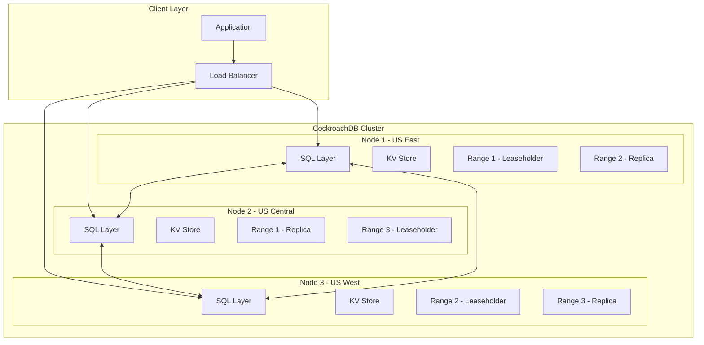
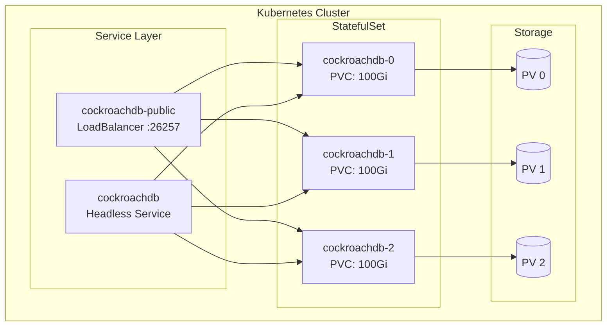

# How to Deploy CockroachDB Cluster

Author: [nawazdhandala](https://www.github.com/nawazdhandala)

Tags: CockroachDB, Database, Distributed Systems, Kubernetes, High Availability, PostgreSQL

Description: A comprehensive guide to deploying a production-ready CockroachDB cluster. Learn how to set up multi-node clusters on bare metal, Docker, and Kubernetes, configure replication, secure your deployment, and monitor cluster health.

---

CockroachDB is a distributed SQL database built for cloud-native applications. It provides automatic sharding, strong consistency, and PostgreSQL wire compatibility. Unlike traditional databases, CockroachDB survives zone, region, and cloud failures without manual intervention.

## CockroachDB Architecture Overview



## Prerequisites

Before deploying CockroachDB, ensure you have the following:

- At least 3 nodes for production (minimum for fault tolerance)
- 4+ CPU cores per node
- 8+ GB RAM per node
- SSD storage (strongly recommended)
- Network connectivity between all nodes
- Synchronized clocks (NTP configured)

## Deployment Option 1: Bare Metal / VM Installation

### Step 1: Install CockroachDB on All Nodes

Download and install CockroachDB on each server in your cluster.

```bash
# Download the latest CockroachDB release
curl https://binaries.cockroachdb.com/cockroach-v23.2.0.linux-amd64.tgz | tar -xz

# Move the binary to a location in your PATH
sudo cp cockroach-v23.2.0.linux-amd64/cockroach /usr/local/bin/

# Verify installation
cockroach version
```

### Step 2: Generate Security Certificates

CockroachDB uses TLS certificates for secure communication. Generate certificates for your cluster.

```bash
# Create a directory for certificates
mkdir -p /var/lib/cockroach/certs
cd /var/lib/cockroach

# Create the CA certificate (run only once, copy to all nodes)
cockroach cert create-ca \
    --certs-dir=certs \
    --ca-key=my-safe-directory/ca.key

# Create node certificate for node1 (adjust addresses for each node)
cockroach cert create-node \
    node1.example.com \
    localhost \
    127.0.0.1 \
    192.168.1.10 \
    --certs-dir=certs \
    --ca-key=my-safe-directory/ca.key

# Create client certificate for the root user
cockroach cert create-client root \
    --certs-dir=certs \
    --ca-key=my-safe-directory/ca.key
```

### Step 3: Start the First Node

Initialize the first node in your cluster with proper configuration.

```bash
# Start the first node
cockroach start \
    --certs-dir=/var/lib/cockroach/certs \
    --advertise-addr=node1.example.com:26257 \
    --join=node1.example.com:26257,node2.example.com:26257,node3.example.com:26257 \
    --cache=.25 \
    --max-sql-memory=.25 \
    --store=/var/lib/cockroach/data \
    --background
```

### Step 4: Start Additional Nodes

Start the remaining nodes with the same join flag pointing to all cluster members.

```bash
# On node2
cockroach start \
    --certs-dir=/var/lib/cockroach/certs \
    --advertise-addr=node2.example.com:26257 \
    --join=node1.example.com:26257,node2.example.com:26257,node3.example.com:26257 \
    --cache=.25 \
    --max-sql-memory=.25 \
    --store=/var/lib/cockroach/data \
    --background

# On node3
cockroach start \
    --certs-dir=/var/lib/cockroach/certs \
    --advertise-addr=node3.example.com:26257 \
    --join=node1.example.com:26257,node2.example.com:26257,node3.example.com:26257 \
    --cache=.25 \
    --max-sql-memory=.25 \
    --store=/var/lib/cockroach/data \
    --background
```

### Step 5: Initialize the Cluster

Run the init command once from any node to bootstrap the cluster.

```bash
# Initialize the cluster (run only once from any node)
cockroach init --certs-dir=/var/lib/cockroach/certs --host=node1.example.com:26257

# Verify the cluster is running
cockroach node status --certs-dir=/var/lib/cockroach/certs --host=node1.example.com:26257
```

## Deployment Option 2: Docker Compose

### Docker Compose Configuration

Create a docker-compose.yml file for a 3-node cluster suitable for development and testing.

```yaml
# docker-compose.yml
version: '3.8'

services:
  roach1:
    image: cockroachdb/cockroach:v23.2.0
    container_name: roach1
    hostname: roach1
    command: start --insecure --join=roach1,roach2,roach3 --advertise-addr=roach1
    volumes:
      - roach1-data:/cockroach/cockroach-data
    ports:
      - "26257:26257"  # SQL port
      - "8080:8080"    # Admin UI
    networks:
      - roachnet

  roach2:
    image: cockroachdb/cockroach:v23.2.0
    container_name: roach2
    hostname: roach2
    command: start --insecure --join=roach1,roach2,roach3 --advertise-addr=roach2
    volumes:
      - roach2-data:/cockroach/cockroach-data
    networks:
      - roachnet

  roach3:
    image: cockroachdb/cockroach:v23.2.0
    container_name: roach3
    hostname: roach3
    command: start --insecure --join=roach1,roach2,roach3 --advertise-addr=roach3
    volumes:
      - roach3-data:/cockroach/cockroach-data
    networks:
      - roachnet

  init:
    image: cockroachdb/cockroach:v23.2.0
    container_name: roach-init
    command: init --insecure --host=roach1
    depends_on:
      - roach1
      - roach2
      - roach3
    networks:
      - roachnet

networks:
  roachnet:
    driver: bridge

volumes:
  roach1-data:
  roach2-data:
  roach3-data:
```

### Start the Docker Cluster

Launch the cluster using Docker Compose and verify it is operational.

```bash
# Start the cluster
docker-compose up -d

# Wait for initialization (about 30 seconds)
sleep 30

# Verify the cluster status
docker exec -it roach1 cockroach node status --insecure

# Access the SQL shell
docker exec -it roach1 cockroach sql --insecure
```

## Deployment Option 3: Kubernetes with Helm

### Kubernetes Deployment Architecture



### Install Using Helm

Deploy CockroachDB on Kubernetes using the official Helm chart.

```bash
# Add the CockroachDB Helm repository
helm repo add cockroachdb https://charts.cockroachdb.com/
helm repo update

# Create a namespace for CockroachDB
kubectl create namespace cockroachdb

# Install CockroachDB with custom values
helm install cockroachdb cockroachdb/cockroachdb \
    --namespace cockroachdb \
    --set statefulset.replicas=3 \
    --set storage.persistentVolume.size=100Gi \
    --set storage.persistentVolume.storageClass=fast-ssd \
    --set tls.enabled=true
```

### Custom Helm Values for Production

Create a values file with production-ready settings for your CockroachDB deployment.

```yaml
# values-production.yaml
statefulset:
  replicas: 3
  resources:
    limits:
      cpu: "4"
      memory: "8Gi"
    requests:
      cpu: "2"
      memory: "4Gi"
  budget:
    maxUnavailable: 1

storage:
  persistentVolume:
    enabled: true
    size: 100Gi
    storageClass: fast-ssd

tls:
  enabled: true
  certs:
    selfSigner:
      enabled: true
      caExpiration: 87600h   # 10 years
      clientExpiration: 8760h # 1 year
      nodeExpiration: 8760h   # 1 year

conf:
  cache: "2Gi"
  max-sql-memory: "2Gi"
  join:
    - cockroachdb-0.cockroachdb.cockroachdb.svc.cluster.local:26257
    - cockroachdb-1.cockroachdb.cockroachdb.svc.cluster.local:26257
    - cockroachdb-2.cockroachdb.cockroachdb.svc.cluster.local:26257

service:
  public:
    type: LoadBalancer
    annotations:
      service.beta.kubernetes.io/aws-load-balancer-internal: "true"
```

### Apply Production Values

Install or upgrade the Helm release with your production configuration.

```bash
# Install with production values
helm install cockroachdb cockroachdb/cockroachdb \
    --namespace cockroachdb \
    -f values-production.yaml

# Wait for pods to be ready
kubectl rollout status statefulset/cockroachdb -n cockroachdb

# Get the cluster status
kubectl exec -n cockroachdb cockroachdb-0 -- cockroach node status \
    --certs-dir=/cockroach/cockroach-certs
```

## Creating Your First Database

Connect to the cluster and create a database with a sample schema.

```sql
-- Connect to the cluster
-- cockroach sql --certs-dir=/var/lib/cockroach/certs --host=node1.example.com

-- Create a new database
CREATE DATABASE myapp;

-- Switch to the new database
USE myapp;

-- Create a table with a primary key
-- CockroachDB automatically distributes data based on primary key
CREATE TABLE users (
    id UUID PRIMARY KEY DEFAULT gen_random_uuid(),
    email STRING NOT NULL UNIQUE,
    name STRING NOT NULL,
    created_at TIMESTAMP DEFAULT now(),
    INDEX idx_users_email (email),
    INDEX idx_users_created (created_at)
);

-- Create another table with a foreign key
CREATE TABLE orders (
    id UUID PRIMARY KEY DEFAULT gen_random_uuid(),
    user_id UUID NOT NULL REFERENCES users(id),
    total DECIMAL(10,2) NOT NULL,
    status STRING DEFAULT 'pending',
    created_at TIMESTAMP DEFAULT now(),
    INDEX idx_orders_user (user_id),
    INDEX idx_orders_status (status)
);

-- Insert sample data
INSERT INTO users (email, name) VALUES
    ('alice@example.com', 'Alice Smith'),
    ('bob@example.com', 'Bob Johnson');

-- Verify data distribution
SHOW RANGES FROM TABLE users;
```

## Configuring Replication Zones

Control where your data is stored and replicated using zone configurations.

```sql
-- View current zone configuration
SHOW ZONE CONFIGURATION FOR DATABASE myapp;

-- Set replication factor to 5 for critical data
ALTER DATABASE myapp CONFIGURE ZONE USING num_replicas = 5;

-- Pin data to specific regions using constraints
-- Useful for data residency requirements
ALTER TABLE users CONFIGURE ZONE USING
    num_replicas = 3,
    constraints = '[+region=us-east]';

-- Configure range sizes for better performance
ALTER DATABASE myapp CONFIGURE ZONE USING
    range_min_bytes = 134217728,  -- 128 MiB
    range_max_bytes = 536870912;  -- 512 MiB

-- Set up geo-partitioning for compliance
-- Partition user data by region
ALTER TABLE users ADD COLUMN region STRING DEFAULT 'us';
ALTER TABLE users PARTITION BY LIST (region) (
    PARTITION us VALUES IN ('us'),
    PARTITION eu VALUES IN ('eu'),
    PARTITION ap VALUES IN ('ap')
);

-- Configure each partition to stay in its region
ALTER PARTITION us OF TABLE users CONFIGURE ZONE USING
    constraints = '[+region=us]';
ALTER PARTITION eu OF TABLE users CONFIGURE ZONE USING
    constraints = '[+region=eu]';
ALTER PARTITION ap OF TABLE users CONFIGURE ZONE USING
    constraints = '[+region=ap]';
```

## Setting Up User Authentication

Create database users with appropriate privileges for your applications.

```sql
-- Create an application user with a strong password
CREATE USER app_user WITH PASSWORD 'SecurePassword123!';

-- Grant privileges on the database
GRANT ALL ON DATABASE myapp TO app_user;

-- Create a read-only user for analytics
CREATE USER analytics_user WITH PASSWORD 'AnalyticsPass456!';
GRANT SELECT ON DATABASE myapp TO analytics_user;

-- Create an admin user
CREATE USER admin_user WITH PASSWORD 'AdminPass789!';
GRANT admin TO admin_user;

-- View all users and their roles
SHOW USERS;
SHOW GRANTS ON DATABASE myapp;
```

## Backup and Restore

### Configure Backup to Cloud Storage

Set up automated backups to cloud storage for disaster recovery.

```sql
-- Create a full cluster backup to S3
BACKUP INTO 's3://my-bucket/cockroach-backups?AUTH=implicit'
    AS OF SYSTEM TIME '-10s';

-- Create a backup with explicit credentials
BACKUP DATABASE myapp INTO
    's3://my-bucket/myapp-backups?AWS_ACCESS_KEY_ID=xxxx&AWS_SECRET_ACCESS_KEY=yyyy'
    AS OF SYSTEM TIME '-10s';

-- Create an incremental backup
BACKUP DATABASE myapp INTO LATEST IN
    's3://my-bucket/myapp-backups?AUTH=implicit';

-- Schedule automated backups (CockroachDB 20.2+)
CREATE SCHEDULE daily_backup
    FOR BACKUP INTO 's3://my-bucket/scheduled-backups?AUTH=implicit'
    RECURRING '@daily'
    WITH SCHEDULE OPTIONS first_run = 'now';

-- View backup history
SHOW BACKUPS IN 's3://my-bucket/myapp-backups?AUTH=implicit';
```

### Restore from Backup

Restore a database from a backup when disaster recovery is needed.

```sql
-- Restore the entire database
RESTORE DATABASE myapp FROM LATEST IN
    's3://my-bucket/myapp-backups?AUTH=implicit';

-- Restore to a specific point in time
RESTORE DATABASE myapp FROM LATEST IN
    's3://my-bucket/myapp-backups?AUTH=implicit'
    AS OF SYSTEM TIME '2024-01-15 10:00:00';

-- Restore specific tables
RESTORE TABLE myapp.users, myapp.orders FROM LATEST IN
    's3://my-bucket/myapp-backups?AUTH=implicit';

-- Restore with a new database name
RESTORE DATABASE myapp FROM LATEST IN
    's3://my-bucket/myapp-backups?AUTH=implicit'
    WITH new_db_name = 'myapp_restored';
```

## Monitoring the Cluster

### Cluster Health Flow

```mermaid
flowchart LR
    subgraph CockroachDB Cluster
        N1[Node 1]
        N2[Node 2]
        N3[Node 3]
    end

    subgraph Monitoring Stack
        PROM[Prometheus]
        GRAF[Grafana]
        ALERT[Alertmanager]
    end

    subgraph Endpoints
        UI[Admin UI :8080]
        METRICS[/_status/vars]
    end

    N1 --> UI
    N1 --> METRICS
    N2 --> METRICS
    N3 --> METRICS

    METRICS --> PROM
    PROM --> GRAF
    PROM --> ALERT
```

### Access the Admin UI

CockroachDB provides a built-in web interface for monitoring cluster health.

```bash
# For secure clusters, create an admin user first
cockroach sql --certs-dir=/var/lib/cockroach/certs --host=node1.example.com \
    -e "CREATE USER admin WITH PASSWORD 'admin123'; GRANT admin TO admin;"

# Access the UI at https://node1.example.com:8080
# Login with the admin user credentials

# For Kubernetes deployments, use port-forward
kubectl port-forward svc/cockroachdb-public 8080:8080 -n cockroachdb
```

### Configure Prometheus Monitoring

Set up Prometheus to scrape CockroachDB metrics for comprehensive monitoring.

```yaml
# prometheus.yml
global:
  scrape_interval: 15s

scrape_configs:
  - job_name: 'cockroachdb'
    metrics_path: '/_status/vars'
    scheme: https
    tls_config:
      ca_file: /certs/ca.crt
      cert_file: /certs/client.root.crt
      key_file: /certs/client.root.key
    static_configs:
      - targets:
        - 'node1.example.com:8080'
        - 'node2.example.com:8080'
        - 'node3.example.com:8080'
    relabel_configs:
      - source_labels: [__address__]
        target_label: instance
        regex: '([^:]+):.*'
        replacement: '${1}'
```

### Key Metrics to Monitor

Query important metrics to understand cluster health and performance.

```sql
-- Check node liveness and status
SELECT node_id, address, is_live, locality FROM crdb_internal.gossip_nodes;

-- View range distribution across nodes
SELECT node_id, range_count, lease_count
FROM crdb_internal.kv_node_status;

-- Check for under-replicated ranges
SELECT * FROM crdb_internal.ranges WHERE array_length(replicas, 1) < 3;

-- Monitor query performance
SELECT query, count, mean_latency, max_latency
FROM crdb_internal.node_statement_statistics
ORDER BY mean_latency DESC LIMIT 10;

-- Check storage usage per node
SELECT node_id,
       store_id,
       capacity,
       available,
       round(available::float/capacity::float * 100, 2) as pct_available
FROM crdb_internal.kv_store_status;
```

### Grafana Dashboard Configuration

Create a Grafana dashboard JSON for visualizing CockroachDB metrics.

```json
{
  "dashboard": {
    "title": "CockroachDB Cluster",
    "panels": [
      {
        "title": "SQL Queries per Second",
        "type": "graph",
        "targets": [
          {
            "expr": "rate(sql_query_count[1m])",
            "legendFormat": "{{instance}}"
          }
        ]
      },
      {
        "title": "Query Latency P99",
        "type": "graph",
        "targets": [
          {
            "expr": "histogram_quantile(0.99, rate(sql_exec_latency_bucket[5m]))",
            "legendFormat": "{{instance}}"
          }
        ]
      },
      {
        "title": "Live Nodes",
        "type": "singlestat",
        "targets": [
          {
            "expr": "sum(liveness_livenodes)"
          }
        ]
      },
      {
        "title": "Storage Used",
        "type": "graph",
        "targets": [
          {
            "expr": "capacity_used",
            "legendFormat": "{{instance}}"
          }
        ]
      }
    ]
  }
}
```

## Scaling the Cluster

### Adding Nodes

Scale your cluster horizontally by adding new nodes.

```bash
# On the new node, install CockroachDB and copy certificates
# Then start the node with the existing join addresses

cockroach start \
    --certs-dir=/var/lib/cockroach/certs \
    --advertise-addr=node4.example.com:26257 \
    --join=node1.example.com:26257,node2.example.com:26257,node3.example.com:26257 \
    --locality=region=us-west,zone=us-west-2a \
    --cache=.25 \
    --max-sql-memory=.25 \
    --store=/var/lib/cockroach/data \
    --background

# Verify the new node joined the cluster
cockroach node status --certs-dir=/var/lib/cockroach/certs --host=node1.example.com
```

### Decommissioning Nodes

Safely remove nodes from the cluster without data loss.

```bash
# Get the node ID of the node to remove
cockroach node status --certs-dir=/var/lib/cockroach/certs

# Decommission the node (this migrates data to other nodes)
cockroach node decommission <node-id> \
    --certs-dir=/var/lib/cockroach/certs \
    --host=node1.example.com

# Wait for decommissioning to complete
# Then stop the node
cockroach quit --certs-dir=/var/lib/cockroach/certs --host=node4.example.com
```

### Kubernetes Scaling

Scale the StatefulSet to add or remove nodes in Kubernetes.

```bash
# Scale up to 5 nodes
kubectl scale statefulset cockroachdb -n cockroachdb --replicas=5

# Scale down (CockroachDB will automatically rebalance)
# First decommission nodes using SQL
kubectl exec -n cockroachdb cockroachdb-0 -- cockroach node decommission 5 \
    --certs-dir=/cockroach/cockroach-certs

# Then scale down
kubectl scale statefulset cockroachdb -n cockroachdb --replicas=4
```

## Connection Pooling

### Configure PgBouncer

Set up PgBouncer for connection pooling to improve application performance.

```ini
# pgbouncer.ini
[databases]
myapp = host=node1.example.com port=26257 dbname=myapp

[pgbouncer]
listen_addr = 0.0.0.0
listen_port = 6432
auth_type = md5
auth_file = /etc/pgbouncer/userlist.txt
pool_mode = transaction
max_client_conn = 1000
default_pool_size = 20
min_pool_size = 5
reserve_pool_size = 5
reserve_pool_timeout = 3
server_lifetime = 3600
server_idle_timeout = 600
server_connect_timeout = 15
server_login_retry = 3
query_timeout = 120
query_wait_timeout = 120
client_idle_timeout = 0
```

### Application Connection String

Configure your application to connect through the connection pool.

```python
# Python example using psycopg2
import psycopg2
from psycopg2 import pool

# Create a connection pool
connection_pool = psycopg2.pool.ThreadedConnectionPool(
    minconn=5,
    maxconn=20,
    host="pgbouncer.example.com",
    port=6432,
    database="myapp",
    user="app_user",
    password="SecurePassword123!",
    sslmode="require",
    sslrootcert="/path/to/ca.crt"
)

# Get a connection from the pool
conn = connection_pool.getconn()
try:
    with conn.cursor() as cur:
        cur.execute("SELECT * FROM users LIMIT 10")
        results = cur.fetchall()
finally:
    # Return connection to pool
    connection_pool.putconn(conn)
```

## Troubleshooting Common Issues

### Diagnose Node Failures

Check logs and cluster status when nodes become unavailable.

```bash
# Check node status
cockroach node status --certs-dir=/var/lib/cockroach/certs

# View logs for errors
cockroach debug zip /tmp/debug.zip \
    --certs-dir=/var/lib/cockroach/certs \
    --host=node1.example.com

# Check for under-replicated ranges
cockroach sql --certs-dir=/var/lib/cockroach/certs \
    -e "SELECT * FROM crdb_internal.ranges WHERE array_length(replicas, 1) < 3;"

# Check cluster settings
cockroach sql --certs-dir=/var/lib/cockroach/certs \
    -e "SHOW CLUSTER SETTINGS;"
```

### Fix Certificate Issues

Resolve TLS certificate problems that prevent nodes from communicating.

```bash
# Verify certificate validity
cockroach cert list --certs-dir=/var/lib/cockroach/certs

# Check certificate expiration
openssl x509 -in /var/lib/cockroach/certs/node.crt -noout -dates

# Regenerate node certificate if expired
cockroach cert create-node \
    node1.example.com \
    localhost \
    127.0.0.1 \
    --certs-dir=/var/lib/cockroach/certs \
    --ca-key=/path/to/ca.key \
    --overwrite

# Restart the node after certificate renewal
cockroach quit --certs-dir=/var/lib/cockroach/certs --host=node1.example.com
cockroach start --certs-dir=/var/lib/cockroach/certs ...
```

### Handle Split Brain Scenarios

Recover from network partitions that cause cluster inconsistencies.

```bash
# Check quorum status
cockroach sql --certs-dir=/var/lib/cockroach/certs \
    -e "SELECT * FROM crdb_internal.gossip_liveness;"

# If nodes are stuck, check for network issues
ping node2.example.com
nc -zv node2.example.com 26257

# Force leader election in extreme cases (use with caution)
# Only when you are certain the majority of nodes are healthy
cockroach debug unsafe-remove-dead-replicas \
    --certs-dir=/var/lib/cockroach/certs \
    --store=/var/lib/cockroach/data
```

## Best Practices Summary

1. **Always deploy at least 3 nodes** for production to ensure fault tolerance and quorum
2. **Use SSDs** for storage to get optimal performance from CockroachDB
3. **Enable TLS** for all connections in production environments
4. **Configure localities** to improve data placement and reduce cross-region latency
5. **Set up automated backups** to cloud storage for disaster recovery
6. **Monitor cluster health** using the Admin UI, Prometheus, and Grafana
7. **Use connection pooling** with PgBouncer to handle high connection counts
8. **Plan for capacity** by monitoring storage usage and scaling proactively
9. **Test failover scenarios** regularly to ensure your team is prepared for incidents
10. **Keep CockroachDB updated** to benefit from performance improvements and security patches

---

CockroachDB provides a powerful foundation for building globally distributed applications. By following the deployment strategies in this guide, you can create a resilient database cluster that survives failures and scales with your needs. Start with a small cluster, monitor its behavior, and expand as your application grows.
