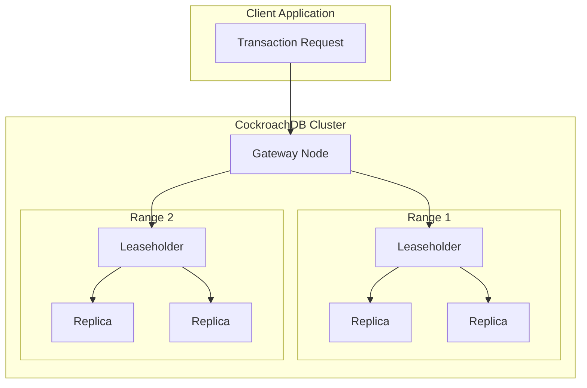
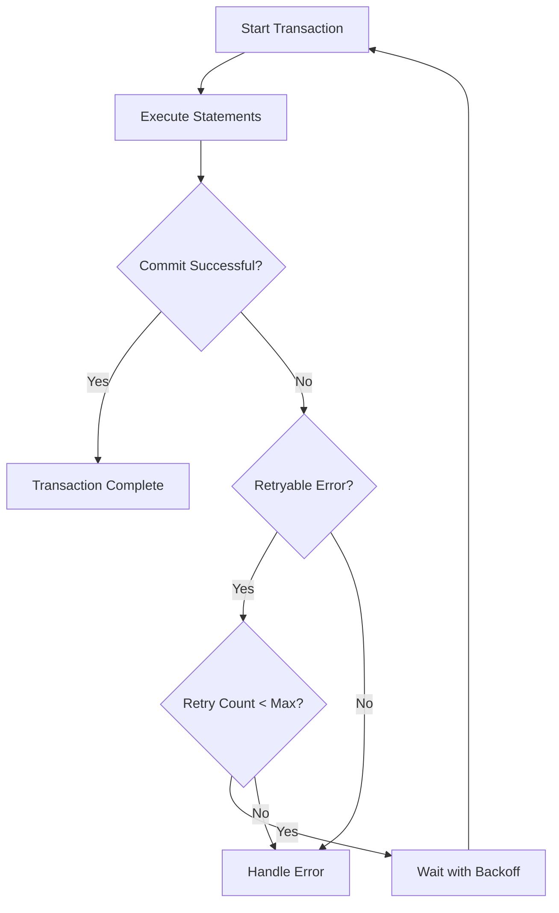
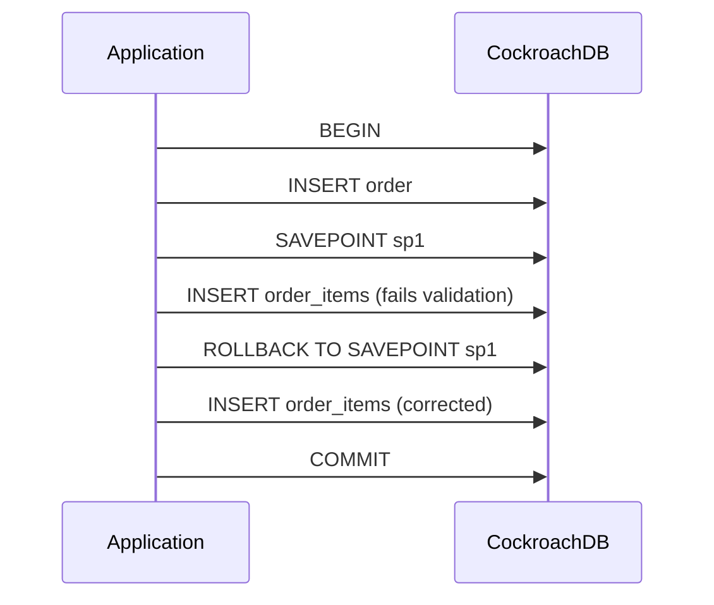
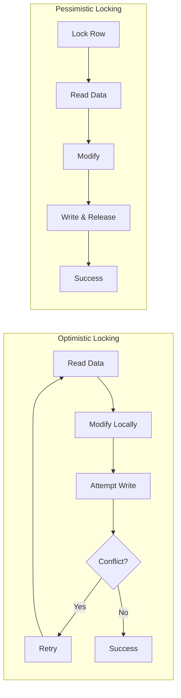
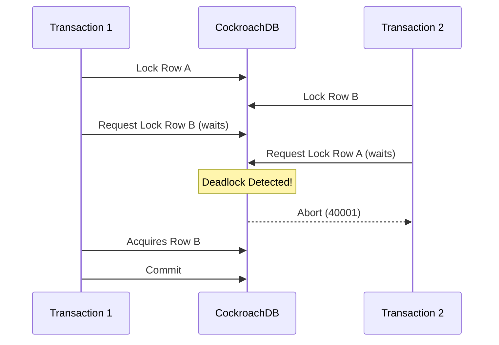

# How to Handle Distributed Transactions in CockroachDB

Author: [nawazdhandala](https://www.github.com/nawazdhandala)

Tags: CockroachDB, Distributed Transactions, Database, SQL, Consistency, ACID

Description: Learn how to handle distributed transactions in CockroachDB effectively. Covering transaction isolation levels, conflict handling, retry strategies, and best practices for building reliable distributed applications with strong consistency guarantees.

---

Distributed transactions are one of the most challenging aspects of building scalable applications. CockroachDB simplifies this complexity by providing serializable isolation and automatic transaction retries across a distributed cluster. Understanding how to leverage these features properly can make the difference between a robust system and one plagued by subtle bugs.

## Understanding CockroachDB's Transaction Model

CockroachDB uses a distributed consensus protocol based on Raft to ensure data consistency across nodes. Every transaction goes through a coordinator that manages reads and writes across multiple ranges.



### Key Concepts

CockroachDB transactions have several important characteristics:

- **Serializable Isolation**: All transactions appear to execute one at a time, preventing anomalies
- **Distributed Coordination**: Transactions can span multiple nodes seamlessly
- **Automatic Retries**: The database handles many retry scenarios internally
- **Time-based Ordering**: Hybrid Logical Clocks (HLC) ensure consistent ordering across nodes

## Basic Transaction Syntax

Starting a transaction in CockroachDB follows standard SQL syntax with some CockroachDB-specific options.

The following example shows how to create a simple transaction that transfers funds between accounts while maintaining consistency.

```sql
-- Basic transaction syntax
BEGIN;

-- Deduct from source account
UPDATE accounts
SET balance = balance - 100.00
WHERE account_id = 'acc_001';

-- Add to destination account
UPDATE accounts
SET balance = balance + 100.00
WHERE account_id = 'acc_002';

-- Record the transfer
INSERT INTO transfers (from_account, to_account, amount, created_at)
VALUES ('acc_001', 'acc_002', 100.00, now());

COMMIT;
```

### Setting Transaction Priority

CockroachDB allows you to set transaction priority to control which transactions win during conflicts. Higher priority transactions are less likely to be aborted.

```sql
-- Set transaction priority for critical operations
BEGIN PRIORITY HIGH;

-- Critical business logic here
UPDATE inventory
SET quantity = quantity - 1
WHERE product_id = 'prod_123'
AND quantity > 0;

COMMIT;
```

Available priority levels are LOW, NORMAL, and HIGH. Use HIGH priority sparingly for truly critical operations.

## Handling Transaction Retries

Transaction conflicts are inevitable in distributed systems. CockroachDB provides built-in retry mechanisms, but your application needs to handle retries properly.



### Client-Side Retry Logic

The following Go code demonstrates proper retry handling for CockroachDB transactions with exponential backoff.

```go
package main

import (
    "context"
    "database/sql"
    "fmt"
    "math/rand"
    "time"

    "github.com/cockroachdb/cockroach-go/v2/crdb"
    _ "github.com/lib/pq"
)

// TransferFunds executes a fund transfer with automatic retry handling
// using CockroachDB's crdb package for proper transaction management
func TransferFunds(db *sql.DB, fromAccount, toAccount string, amount float64) error {
    ctx := context.Background()

    // crdb.ExecuteTx handles retries automatically
    err := crdb.ExecuteTx(ctx, db, nil, func(tx *sql.Tx) error {
        // Check source account balance
        var balance float64
        err := tx.QueryRow(
            "SELECT balance FROM accounts WHERE account_id = $1",
            fromAccount,
        ).Scan(&balance)
        if err != nil {
            return fmt.Errorf("failed to get balance: %w", err)
        }

        // Verify sufficient funds
        if balance < amount {
            return fmt.Errorf("insufficient funds: have %.2f, need %.2f", balance, amount)
        }

        // Deduct from source
        _, err = tx.Exec(
            "UPDATE accounts SET balance = balance - $1 WHERE account_id = $2",
            amount, fromAccount,
        )
        if err != nil {
            return fmt.Errorf("failed to deduct from source: %w", err)
        }

        // Add to destination
        _, err = tx.Exec(
            "UPDATE accounts SET balance = balance + $1 WHERE account_id = $2",
            amount, toAccount,
        )
        if err != nil {
            return fmt.Errorf("failed to add to destination: %w", err)
        }

        // Record transfer
        _, err = tx.Exec(
            `INSERT INTO transfers (from_account, to_account, amount, created_at)
             VALUES ($1, $2, $3, now())`,
            fromAccount, toAccount, amount,
        )
        if err != nil {
            return fmt.Errorf("failed to record transfer: %w", err)
        }

        return nil
    })

    return err
}
```

### Manual Retry Implementation

If you prefer more control over retry behavior, implement custom retry logic with exponential backoff.

```go
package main

import (
    "context"
    "database/sql"
    "errors"
    "math/rand"
    "strings"
    "time"
)

const (
    maxRetries     = 5
    baseDelay      = 100 * time.Millisecond
    maxDelay       = 10 * time.Second
)

// isRetryableError checks if the error is a retryable transaction error
func isRetryableError(err error) bool {
    if err == nil {
        return false
    }
    errStr := err.Error()
    // Check for common retryable error codes
    return strings.Contains(errStr, "40001") || // serialization_failure
           strings.Contains(errStr, "40003") || // statement_completion_unknown
           strings.Contains(errStr, "CR000") || // CockroachDB retry error
           strings.Contains(errStr, "restart transaction")
}

// calculateBackoff returns the delay for the given retry attempt
func calculateBackoff(attempt int) time.Duration {
    delay := baseDelay * time.Duration(1<<uint(attempt))
    if delay > maxDelay {
        delay = maxDelay
    }
    // Add jitter to prevent thundering herd
    jitter := time.Duration(rand.Int63n(int64(delay / 2)))
    return delay + jitter
}

// ExecuteWithRetry runs a transaction function with automatic retry on conflicts
func ExecuteWithRetry(ctx context.Context, db *sql.DB, txFunc func(*sql.Tx) error) error {
    var lastErr error

    for attempt := 0; attempt < maxRetries; attempt++ {
        tx, err := db.BeginTx(ctx, nil)
        if err != nil {
            return err
        }

        err = txFunc(tx)
        if err != nil {
            tx.Rollback()
            if isRetryableError(err) && attempt < maxRetries-1 {
                lastErr = err
                time.Sleep(calculateBackoff(attempt))
                continue
            }
            return err
        }

        err = tx.Commit()
        if err != nil {
            if isRetryableError(err) && attempt < maxRetries-1 {
                lastErr = err
                time.Sleep(calculateBackoff(attempt))
                continue
            }
            return err
        }

        return nil
    }

    return lastErr
}
```

## Savepoints for Partial Rollbacks

Savepoints allow you to create checkpoints within a transaction and roll back to them without aborting the entire transaction.



The following example demonstrates using savepoints to handle partial failures in a complex order processing workflow.

```sql
-- Start transaction for order processing
BEGIN;

-- Create the main order record
INSERT INTO orders (order_id, customer_id, status, created_at)
VALUES ('ord_12345', 'cust_001', 'pending', now());

-- Create savepoint before processing items
SAVEPOINT before_items;

-- Attempt to process first item
INSERT INTO order_items (order_id, product_id, quantity, unit_price)
VALUES ('ord_12345', 'prod_a', 2, 29.99);

-- Attempt to process second item - might fail due to stock
INSERT INTO order_items (order_id, product_id, quantity, unit_price)
VALUES ('ord_12345', 'prod_b', 1, 49.99);

-- If second item fails, we can rollback to savepoint
-- ROLLBACK TO SAVEPOINT before_items;

-- Create another savepoint for payment processing
SAVEPOINT before_payment;

-- Process payment
INSERT INTO payments (order_id, amount, payment_method, status)
VALUES ('ord_12345', 109.97, 'credit_card', 'completed');

-- Update order status
UPDATE orders SET status = 'confirmed' WHERE order_id = 'ord_12345';

COMMIT;
```

### Programmatic Savepoint Usage

The following code shows how to use savepoints programmatically for complex transaction workflows.

```go
package main

import (
    "context"
    "database/sql"
    "fmt"
)

// ProcessOrderWithSavepoints handles order processing with checkpoint recovery
func ProcessOrderWithSavepoints(ctx context.Context, db *sql.DB, order Order) error {
    tx, err := db.BeginTx(ctx, nil)
    if err != nil {
        return err
    }
    defer tx.Rollback()

    // Create main order
    _, err = tx.ExecContext(ctx,
        `INSERT INTO orders (order_id, customer_id, status)
         VALUES ($1, $2, 'pending')`,
        order.ID, order.CustomerID,
    )
    if err != nil {
        return fmt.Errorf("failed to create order: %w", err)
    }

    // Create savepoint before items
    _, err = tx.ExecContext(ctx, "SAVEPOINT items_checkpoint")
    if err != nil {
        return err
    }

    // Process each item with individual error handling
    for _, item := range order.Items {
        _, err = tx.ExecContext(ctx,
            `INSERT INTO order_items (order_id, product_id, quantity)
             VALUES ($1, $2, $3)`,
            order.ID, item.ProductID, item.Quantity,
        )
        if err != nil {
            // Check if item is optional
            if item.Optional {
                // Rollback just this item and continue
                _, _ = tx.ExecContext(ctx, "ROLLBACK TO SAVEPOINT items_checkpoint")
                _, _ = tx.ExecContext(ctx, "SAVEPOINT items_checkpoint")
                continue
            }
            return fmt.Errorf("failed to add item %s: %w", item.ProductID, err)
        }

        // Update savepoint after successful item
        _, _ = tx.ExecContext(ctx, "RELEASE SAVEPOINT items_checkpoint")
        _, _ = tx.ExecContext(ctx, "SAVEPOINT items_checkpoint")
    }

    return tx.Commit()
}

// Order represents a customer order
type Order struct {
    ID         string
    CustomerID string
    Items      []OrderItem
}

// OrderItem represents a line item in an order
type OrderItem struct {
    ProductID string
    Quantity  int
    Optional  bool
}
```

## Optimistic vs Pessimistic Locking

CockroachDB supports both optimistic and pessimistic concurrency control strategies. Choosing the right approach depends on your workload characteristics.



### Pessimistic Locking with SELECT FOR UPDATE

Use pessimistic locking when conflicts are frequent and retry overhead is expensive.

```sql
-- Pessimistic locking for inventory management
BEGIN;

-- Lock the inventory row before reading
SELECT quantity
FROM inventory
WHERE product_id = 'prod_123'
FOR UPDATE;

-- Now safe to decrement - no other transaction can modify
UPDATE inventory
SET quantity = quantity - 1,
    updated_at = now()
WHERE product_id = 'prod_123';

COMMIT;
```

### SELECT FOR UPDATE with SKIP LOCKED

For queue processing workloads, SKIP LOCKED allows multiple workers to process different rows concurrently.

```sql
-- Worker picks up next available job without blocking
BEGIN;

-- Claim a job by selecting and locking it
-- SKIP LOCKED ensures we do not wait for locked rows
SELECT job_id, payload
FROM job_queue
WHERE status = 'pending'
ORDER BY created_at
LIMIT 1
FOR UPDATE SKIP LOCKED;

-- Process and update the claimed job
UPDATE job_queue
SET status = 'processing',
    started_at = now(),
    worker_id = 'worker_42'
WHERE job_id = 'claimed_job_id';

COMMIT;
```

### Optimistic Locking with Version Columns

For read-heavy workloads with infrequent conflicts, optimistic locking reduces lock contention.

```sql
-- Add version column to table
ALTER TABLE products ADD COLUMN version INT DEFAULT 1;

-- Read product without locking
SELECT product_id, name, price, stock, version
FROM products
WHERE product_id = 'prod_123';
-- Application stores: version = 5

-- Update only if version has not changed
UPDATE products
SET price = 29.99,
    version = version + 1,
    updated_at = now()
WHERE product_id = 'prod_123'
AND version = 5;

-- Check rows affected - if 0, another transaction modified the row
-- Application should retry with fresh data
```

## Transaction Isolation Levels

CockroachDB defaults to SERIALIZABLE isolation, the strongest guarantee. Understanding when to use other levels can improve performance.

### Serializable (Default)

Serializable isolation ensures transactions behave as if executed sequentially.

```sql
-- Explicitly set serializable isolation (default in CockroachDB)
BEGIN TRANSACTION ISOLATION LEVEL SERIALIZABLE;

-- All reads and writes are fully isolated
SELECT balance FROM accounts WHERE account_id = 'acc_001';
UPDATE accounts SET balance = balance - 50 WHERE account_id = 'acc_001';

COMMIT;
```

### Read Committed

Read committed allows non-repeatable reads but provides better performance for some workloads.

```sql
-- Use read committed for reporting queries where slight inconsistency is acceptable
BEGIN TRANSACTION ISOLATION LEVEL READ COMMITTED;

-- Each statement sees the latest committed data
-- Subsequent reads might see different values if other transactions commit
SELECT SUM(balance) FROM accounts WHERE account_type = 'savings';
SELECT COUNT(*) FROM accounts WHERE balance > 10000;

COMMIT;
```

## Handling Deadlocks

CockroachDB automatically detects and resolves deadlocks by aborting one of the conflicting transactions. Your application should handle these gracefully.



### Preventing Deadlocks

Accessing resources in a consistent order prevents most deadlocks.

```sql
-- BAD: Inconsistent ordering causes deadlocks
-- Transaction 1: accounts -> inventory
-- Transaction 2: inventory -> accounts

-- GOOD: Always access tables in the same order
-- Both transactions: accounts -> inventory

-- Example: Process order with consistent resource ordering
BEGIN;

-- Always lock accounts first (alphabetically)
SELECT balance FROM accounts
WHERE customer_id = 'cust_001'
FOR UPDATE;

-- Then lock inventory
SELECT quantity FROM inventory
WHERE product_id = 'prod_123'
FOR UPDATE;

-- Now perform updates
UPDATE accounts SET balance = balance - 99.99 WHERE customer_id = 'cust_001';
UPDATE inventory SET quantity = quantity - 1 WHERE product_id = 'prod_123';

COMMIT;
```

### Handling Deadlock Errors

The following code shows how to detect and handle deadlock errors specifically.

```go
package main

import (
    "context"
    "database/sql"
    "strings"
    "time"
)

// isDeadlockError checks if the error is a deadlock
func isDeadlockError(err error) bool {
    if err == nil {
        return false
    }
    errStr := err.Error()
    return strings.Contains(errStr, "40001") ||
           strings.Contains(errStr, "deadlock")
}

// ExecuteWithDeadlockRetry handles deadlock-specific retry logic
func ExecuteWithDeadlockRetry(ctx context.Context, db *sql.DB, fn func(*sql.Tx) error) error {
    maxRetries := 3

    for attempt := 0; attempt < maxRetries; attempt++ {
        tx, err := db.BeginTx(ctx, nil)
        if err != nil {
            return err
        }

        err = fn(tx)
        if err != nil {
            tx.Rollback()
            if isDeadlockError(err) && attempt < maxRetries-1 {
                // Exponential backoff with jitter
                sleepDuration := time.Duration(50*(1<<attempt)) * time.Millisecond
                time.Sleep(sleepDuration)
                continue
            }
            return err
        }

        if err = tx.Commit(); err != nil {
            if isDeadlockError(err) && attempt < maxRetries-1 {
                sleepDuration := time.Duration(50*(1<<attempt)) * time.Millisecond
                time.Sleep(sleepDuration)
                continue
            }
            return err
        }

        return nil
    }

    return nil
}
```

## AS OF SYSTEM TIME Queries

CockroachDB supports historical queries, which can reduce contention for read-heavy workloads by reading from a consistent snapshot in the past.

```sql
-- Read from 10 seconds ago to avoid conflicts with current writes
SELECT * FROM orders
WHERE customer_id = 'cust_001'
AS OF SYSTEM TIME '-10s';

-- Read from a specific timestamp
SELECT SUM(amount) FROM transactions
WHERE created_at > '2026-01-01'
AS OF SYSTEM TIME '2026-02-02 10:00:00';

-- Use with interval for follower reads (reads from nearest replica)
SELECT * FROM products
AS OF SYSTEM TIME follower_read_timestamp();
```

### Follower Reads for Geo-Distributed Deployments

Follower reads allow queries to be served from the nearest replica, reducing latency in geo-distributed clusters.

```sql
-- Enable follower reads for this session
SET default_transaction_use_follower_reads = on;

-- Queries automatically use follower reads
SELECT * FROM products WHERE category = 'electronics';

-- Or specify per-query
SELECT * FROM inventory
AS OF SYSTEM TIME follower_read_timestamp()
WHERE warehouse_id = 'west_coast';
```

## Monitoring Transaction Performance

Understanding transaction behavior is crucial for maintaining system health.

### Key Metrics to Track

The following query helps identify problematic transactions by showing their duration and conflict status.

```sql
-- View active transactions and their duration
SELECT
    application_name,
    query,
    phase,
    EXTRACT(EPOCH FROM (now() - start)) as duration_seconds,
    num_retries,
    num_auto_retries
FROM crdb_internal.cluster_transactions
WHERE application_name NOT LIKE '%internal%'
ORDER BY duration_seconds DESC
LIMIT 20;
```

### Identifying Contention Hotspots

```sql
-- Find tables with high contention
SELECT
    table_name,
    range_id,
    contention_events,
    cumulative_contention_time
FROM crdb_internal.cluster_contention_events
GROUP BY table_name, range_id
ORDER BY contention_events DESC
LIMIT 10;

-- View transaction contention details
SELECT
    blocking_txn_id,
    waiting_txn_id,
    contending_key,
    duration
FROM crdb_internal.cluster_contention_events
WHERE duration > interval '100ms'
ORDER BY duration DESC;
```

### Setting Up Contention Alerts

```sql
-- Create a view for monitoring contention trends
CREATE VIEW contention_summary AS
SELECT
    date_trunc('minute', collected_at) as minute,
    SUM(contention_events) as total_events,
    AVG(cumulative_contention_time) as avg_contention_time
FROM crdb_internal.cluster_contention_events
GROUP BY date_trunc('minute', collected_at)
ORDER BY minute DESC;

-- Query for alerting (use in monitoring system)
SELECT
    COUNT(*) as blocked_transactions,
    MAX(EXTRACT(EPOCH FROM duration)) as max_wait_seconds
FROM crdb_internal.cluster_contention_events
WHERE collected_at > now() - interval '5 minutes';
```

## Best Practices Summary

Follow these guidelines for reliable distributed transactions:

1. **Use the official retry helpers** - The cockroach-go library handles retry logic correctly
2. **Keep transactions short** - Long transactions increase conflict probability
3. **Access resources in consistent order** - Prevents deadlocks across the cluster
4. **Choose appropriate isolation levels** - Serializable is safest but read committed may suffice for analytics
5. **Use AS OF SYSTEM TIME for reporting** - Reduces contention with write workloads
6. **Monitor contention metrics** - Identify hotspots before they become problems
7. **Set reasonable timeouts** - Prevent runaway transactions from blocking others
8. **Use SKIP LOCKED for queues** - Enables parallel processing without blocking

```sql
-- Example: Well-structured transaction with best practices
BEGIN PRIORITY NORMAL;

-- Set statement timeout
SET statement_timeout = '30s';

-- Access tables in consistent alphabetical order
SELECT id, balance FROM accounts WHERE id = $1 FOR UPDATE;
SELECT id, quantity FROM inventory WHERE id = $2 FOR UPDATE;

-- Perform modifications
UPDATE accounts SET balance = balance - $3 WHERE id = $1;
UPDATE inventory SET quantity = quantity - 1 WHERE id = $2;
INSERT INTO transactions (account_id, product_id, amount) VALUES ($1, $2, $3);

COMMIT;
```

## Conclusion

Distributed transactions in CockroachDB provide strong consistency guarantees while handling the complexity of coordination across nodes. By understanding the transaction model, implementing proper retry logic, and following best practices, you can build applications that remain reliable under high concurrency and network partitions.

The key is to embrace CockroachDB's automatic retry mechanisms while designing your application to handle conflicts gracefully. Monitor contention metrics, keep transactions short, and choose the right isolation level for each workload.

---

**Need visibility into your distributed database performance?** [OneUptime](https://oneuptime.com) provides comprehensive monitoring for CockroachDB clusters, including transaction latency tracking, contention alerts, and cluster health dashboards. Detect slow transactions and deadlocks before they impact your users. Start monitoring your CockroachDB deployment today with OneUptime's free tier.
