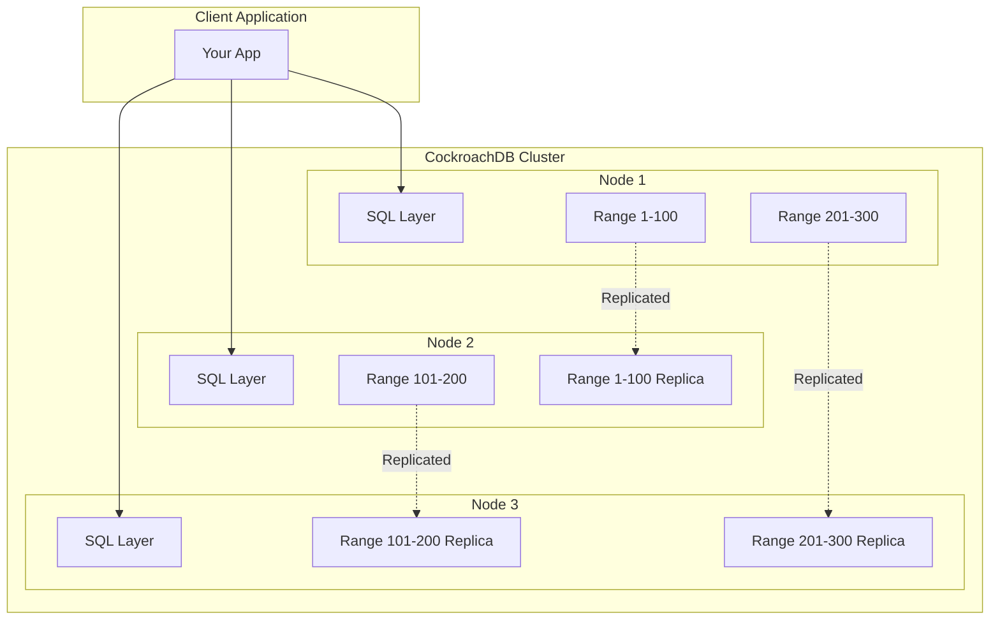
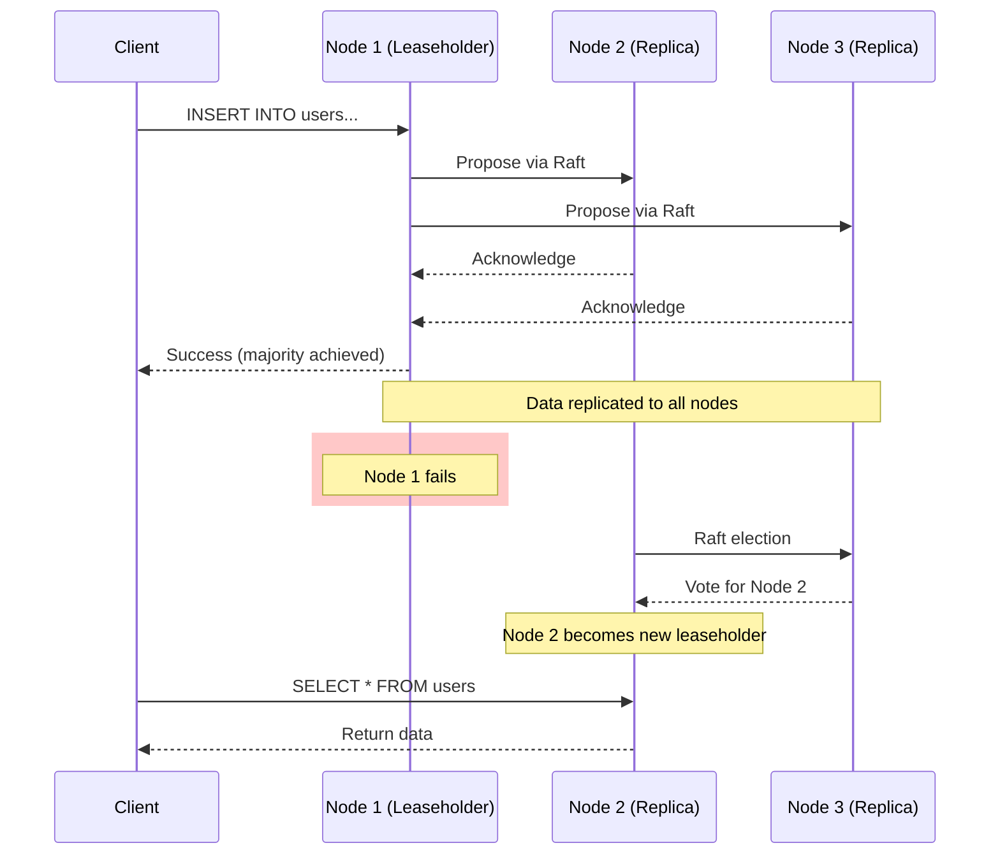

# How to Get Started with CockroachDB

Author: [nawazdhandala](https://www.github.com/nawazdhandala)

Tags: CockroachDB, Database, Distributed, SQL, PostgreSQL, Cloud Native

Description: A practical guide to getting started with CockroachDB, covering installation, configuration, and building your first distributed database application.

---

> CockroachDB is a distributed SQL database that survives disk, machine, rack, and even datacenter failures with minimal latency disruption. If you're building applications that need high availability without sacrificing SQL compatibility, CockroachDB is worth exploring.

CockroachDB was designed from the ground up for cloud-native applications. It speaks PostgreSQL wire protocol, so your existing tools and libraries just work. The big difference is what happens under the hood - your data is automatically replicated and distributed across nodes.

---

## Why CockroachDB?

Before diving into setup, here's why you might choose CockroachDB:

| Feature | Traditional PostgreSQL | CockroachDB |
|---------|----------------------|-------------|
| High Availability | Manual setup with replicas | Built-in, automatic |
| Horizontal Scaling | Complex sharding | Add nodes, done |
| Geo-Distribution | Application-level | Database-level |
| PostgreSQL Compatible | Native | Wire-compatible |
| Transactions | Single-node ACID | Distributed ACID |

The tradeoff is that CockroachDB has slightly higher latency for single-row operations compared to a local PostgreSQL instance. But for applications that need to survive failures, the benefits outweigh this cost.

---

## Installation Options

### Option 1: Docker (Recommended for Development)

The fastest way to get a CockroachDB instance running. This command pulls the official CockroachDB image and starts a single-node cluster:

```bash
# Pull and run CockroachDB in a container
# Port 26257 is for SQL connections, 8080 is for the admin UI
docker run -d \
  --name=cockroach \
  -p 26257:26257 \
  -p 8080:8080 \
  cockroachdb/cockroach:latest start-single-node \
  --insecure
```

Verify it's running and check the cluster status:

```bash
# Check container status
docker ps

# Connect to the SQL shell
docker exec -it cockroach ./cockroach sql --insecure
```

### Option 2: Binary Installation (Linux/macOS)

For a more permanent development setup, install the binary directly on your machine:

```bash
# macOS with Homebrew
brew install cockroachdb/tap/cockroach

# Linux (download binary)
curl https://binaries.cockroachdb.com/cockroach-latest.linux-amd64.tgz | tar -xz
sudo cp -i cockroach-*/cockroach /usr/local/bin/

# Verify installation
cockroach version
```

Start a single-node cluster for development. The --insecure flag disables TLS, which is fine for local development but should never be used in production:

```bash
# Start a single-node cluster
# Data stored in cockroach-data directory
cockroach start-single-node \
  --insecure \
  --store=cockroach-data \
  --listen-addr=localhost:26257 \
  --http-addr=localhost:8080
```

### Option 3: CockroachDB Serverless (Easiest)

For zero-setup development, use CockroachDB Cloud's free tier:

1. Go to [cockroachlabs.com/cloud](https://cockroachlabs.com/cloud)
2. Create a free Serverless cluster
3. Get your connection string

The serverless tier gives you 10GB storage and 50M request units free per month - plenty for development and small projects.

---

## Your First Database

Once connected, CockroachDB feels like PostgreSQL. Here's how to create a database and your first table:

```sql
-- Connect to CockroachDB
-- Using cockroach sql client or psql

-- Create a database for your application
CREATE DATABASE myapp;

-- Switch to the new database
USE myapp;

-- Create a users table
-- Note: CockroachDB uses UUID for primary keys by default
-- This helps with distributed data placement
CREATE TABLE users (
    id UUID PRIMARY KEY DEFAULT gen_random_uuid(),
    email STRING NOT NULL UNIQUE,
    name STRING NOT NULL,
    created_at TIMESTAMP DEFAULT current_timestamp(),

    -- Create an index on email for fast lookups
    INDEX idx_users_email (email)
);

-- Insert some test data
INSERT INTO users (email, name) VALUES
    ('alice@example.com', 'Alice Johnson'),
    ('bob@example.com', 'Bob Smith'),
    ('charlie@example.com', 'Charlie Brown');

-- Query the data
SELECT * FROM users;
```

---

## Architecture Overview

Understanding how CockroachDB distributes data helps you design better schemas. Here's a simplified view of the architecture:



Key concepts:
- **Ranges**: Your data is split into 512MB chunks called ranges
- **Replicas**: Each range is replicated 3 times (configurable)
- **Leaseholder**: One replica handles all reads/writes for a range
- **Raft consensus**: Replicas agree on data using Raft protocol

---

## Connecting from Your Application

### Python with psycopg2

CockroachDB is wire-compatible with PostgreSQL, so standard PostgreSQL drivers work. Here's a Python example:

```python
# cockroach_connection.py
import psycopg2
from psycopg2 import pool
import os

# Connection string format for CockroachDB
# For local insecure: postgresql://root@localhost:26257/myapp
# For CockroachDB Cloud: includes SSL settings
DATABASE_URL = os.environ.get(
    'DATABASE_URL',
    'postgresql://root@localhost:26257/myapp?sslmode=disable'
)

# Create a connection pool
# CockroachDB recommends connection pooling for production
connection_pool = pool.ThreadedConnectionPool(
    minconn=2,
    maxconn=10,
    dsn=DATABASE_URL
)

def get_connection():
    """Get a connection from the pool"""
    return connection_pool.getconn()

def return_connection(conn):
    """Return a connection to the pool"""
    connection_pool.putconn(conn)

def execute_query(query, params=None):
    """Execute a query and return results"""
    conn = get_connection()
    try:
        with conn.cursor() as cur:
            cur.execute(query, params)
            if cur.description:  # SELECT query
                return cur.fetchall()
            conn.commit()
            return cur.rowcount
    finally:
        return_connection(conn)


# Example usage
if __name__ == '__main__':
    # Create a user
    user_count = execute_query(
        "INSERT INTO users (email, name) VALUES (%s, %s)",
        ('newuser@example.com', 'New User')
    )
    print(f"Inserted {user_count} user(s)")

    # Fetch all users
    users = execute_query("SELECT id, email, name FROM users")
    for user in users:
        print(f"User: {user[2]} ({user[1]})")
```

### Node.js with pg

For JavaScript/TypeScript applications, use the standard pg driver:

```javascript
// cockroach_connection.js
const { Pool } = require('pg');

// Connection configuration
// CockroachDB Cloud connections require SSL
const pool = new Pool({
    connectionString: process.env.DATABASE_URL ||
        'postgresql://root@localhost:26257/myapp',
    ssl: process.env.NODE_ENV === 'production' ? {
        rejectUnauthorized: true
    } : false,
    // Pool configuration
    max: 10,          // Maximum connections
    idleTimeoutMillis: 30000,
    connectionTimeoutMillis: 5000,
});

// Wrapper for executing queries
async function query(text, params) {
    const start = Date.now();
    const result = await pool.query(text, params);
    const duration = Date.now() - start;
    console.log('Executed query', { text, duration, rows: result.rowCount });
    return result;
}

// Transaction helper
// CockroachDB supports distributed transactions
async function withTransaction(callback) {
    const client = await pool.connect();
    try {
        await client.query('BEGIN');
        const result = await callback(client);
        await client.query('COMMIT');
        return result;
    } catch (error) {
        await client.query('ROLLBACK');
        throw error;
    } finally {
        client.release();
    }
}

// Example: Transfer funds between accounts
// This demonstrates distributed ACID transactions
async function transferFunds(fromAccount, toAccount, amount) {
    return withTransaction(async (client) => {
        // Debit source account
        await client.query(
            'UPDATE accounts SET balance = balance - $1 WHERE id = $2',
            [amount, fromAccount]
        );

        // Credit destination account
        await client.query(
            'UPDATE accounts SET balance = balance + $1 WHERE id = $2',
            [amount, toAccount]
        );

        return { success: true, amount };
    });
}

module.exports = { query, withTransaction, transferFunds };
```

### Go with pgx

Go applications can use the pgx driver, which is the recommended driver for CockroachDB:

```go
// main.go
package main

import (
    "context"
    "fmt"
    "log"
    "os"
    "time"

    "github.com/jackc/pgx/v5/pgxpool"
)

// Database pool configuration
func createPool(ctx context.Context) (*pgxpool.Pool, error) {
    databaseURL := os.Getenv("DATABASE_URL")
    if databaseURL == "" {
        databaseURL = "postgresql://root@localhost:26257/myapp?sslmode=disable"
    }

    // Parse configuration from URL
    config, err := pgxpool.ParseConfig(databaseURL)
    if err != nil {
        return nil, fmt.Errorf("failed to parse config: %w", err)
    }

    // Pool settings optimized for CockroachDB
    config.MaxConns = 10
    config.MinConns = 2
    config.MaxConnLifetime = 30 * time.Minute
    config.MaxConnIdleTime = 5 * time.Minute

    // Create the pool
    pool, err := pgxpool.NewWithConfig(ctx, config)
    if err != nil {
        return nil, fmt.Errorf("failed to create pool: %w", err)
    }

    // Verify connection
    if err := pool.Ping(ctx); err != nil {
        return nil, fmt.Errorf("failed to ping database: %w", err)
    }

    return pool, nil
}

// User represents a user in our database
type User struct {
    ID        string
    Email     string
    Name      string
    CreatedAt time.Time
}

// GetUser retrieves a user by ID
func GetUser(ctx context.Context, pool *pgxpool.Pool, id string) (*User, error) {
    var user User
    err := pool.QueryRow(ctx,
        "SELECT id, email, name, created_at FROM users WHERE id = $1",
        id,
    ).Scan(&user.ID, &user.Email, &user.Name, &user.CreatedAt)

    if err != nil {
        return nil, err
    }
    return &user, nil
}

// CreateUser inserts a new user and returns the generated ID
func CreateUser(ctx context.Context, pool *pgxpool.Pool, email, name string) (string, error) {
    var id string
    err := pool.QueryRow(ctx,
        "INSERT INTO users (email, name) VALUES ($1, $2) RETURNING id",
        email, name,
    ).Scan(&id)

    return id, err
}

func main() {
    ctx := context.Background()

    pool, err := createPool(ctx)
    if err != nil {
        log.Fatalf("Failed to create pool: %v", err)
    }
    defer pool.Close()

    // Create a user
    id, err := CreateUser(ctx, pool, "gopher@example.com", "Go Gopher")
    if err != nil {
        log.Fatalf("Failed to create user: %v", err)
    }
    fmt.Printf("Created user with ID: %s\n", id)

    // Fetch the user back
    user, err := GetUser(ctx, pool, id)
    if err != nil {
        log.Fatalf("Failed to get user: %v", err)
    }
    fmt.Printf("User: %s (%s)\n", user.Name, user.Email)
}
```

---

## Setting Up a Multi-Node Cluster

For high availability testing, run a 3-node cluster locally. This simulates a production setup:

```bash
# Terminal 1 - Start node 1
cockroach start \
  --insecure \
  --store=node1 \
  --listen-addr=localhost:26257 \
  --http-addr=localhost:8080 \
  --join=localhost:26257,localhost:26258,localhost:26259

# Terminal 2 - Start node 2
cockroach start \
  --insecure \
  --store=node2 \
  --listen-addr=localhost:26258 \
  --http-addr=localhost:8081 \
  --join=localhost:26257,localhost:26258,localhost:26259

# Terminal 3 - Start node 3
cockroach start \
  --insecure \
  --store=node3 \
  --listen-addr=localhost:26259 \
  --http-addr=localhost:8082 \
  --join=localhost:26257,localhost:26258,localhost:26259
```

Initialize the cluster (run once after all nodes are up):

```bash
# Initialize the cluster
cockroach init --insecure --host=localhost:26257
```

Verify the cluster is healthy:

```bash
# Check cluster status
cockroach node status --insecure --host=localhost:26257
```

You should see output showing all three nodes:

```
  id |     address      |   sql_address    |  build  |          started_at          |          updated_at          | locality | is_available | is_live
-----+------------------+------------------+---------+------------------------------+------------------------------+----------+--------------+---------
   1 | localhost:26257  | localhost:26257  | v23.x.x | 2026-02-02 10:00:00.000000+0 | 2026-02-02 10:00:05.000000+0 |          | true         | true
   2 | localhost:26258  | localhost:26258  | v23.x.x | 2026-02-02 10:00:01.000000+0 | 2026-02-02 10:00:05.000000+0 |          | true         | true
   3 | localhost:26259  | localhost:26259  | v23.x.x | 2026-02-02 10:00:02.000000+0 | 2026-02-02 10:00:05.000000+0 |          | true         | true
```

---

## Multi-Node Architecture

Here's how a 3-node cluster handles data distribution and failover:



---

## Schema Design Best Practices

### Use UUIDs for Primary Keys

UUIDs distribute data evenly across ranges. Sequential IDs can create hotspots:

```sql
-- Good: UUIDs distribute writes across the cluster
CREATE TABLE orders (
    id UUID PRIMARY KEY DEFAULT gen_random_uuid(),
    customer_id UUID NOT NULL,
    total DECIMAL(10, 2) NOT NULL,
    created_at TIMESTAMP DEFAULT current_timestamp()
);

-- Avoid: Sequential IDs create write hotspots
-- All new rows go to the same range
CREATE TABLE orders_bad (
    id SERIAL PRIMARY KEY,  -- Don't do this
    customer_id INT NOT NULL,
    total DECIMAL(10, 2) NOT NULL
);
```

### Composite Primary Keys for Multi-Tenancy

For multi-tenant applications, include the tenant ID in the primary key. This keeps tenant data together and enables efficient tenant-scoped queries:

```sql
-- Multi-tenant table design
-- Tenant data stays together for efficient queries
CREATE TABLE tenant_documents (
    tenant_id UUID NOT NULL,
    doc_id UUID NOT NULL DEFAULT gen_random_uuid(),
    title STRING NOT NULL,
    content STRING,
    created_at TIMESTAMP DEFAULT current_timestamp(),

    -- Composite primary key with tenant_id first
    -- This groups all documents for a tenant together
    PRIMARY KEY (tenant_id, doc_id)
);

-- Queries scoped to a tenant are efficient
SELECT * FROM tenant_documents
WHERE tenant_id = 'tenant-123'
ORDER BY created_at DESC
LIMIT 10;
```

### Add Indexes Thoughtfully

Create indexes based on your query patterns. CockroachDB indexes are also distributed:

```sql
-- Create index on frequently queried columns
CREATE INDEX idx_orders_customer ON orders (customer_id);

-- Covering index to avoid table lookups
-- Includes all columns needed by the query
CREATE INDEX idx_orders_customer_covering ON orders (customer_id)
    STORING (total, created_at);

-- Partial index for common filters
-- Only indexes active orders, smaller and faster
CREATE INDEX idx_orders_active ON orders (customer_id, created_at)
    WHERE status = 'active';
```

---

## Handling Transactions

CockroachDB provides serializable isolation by default. Transactions work across nodes:

```python
# transaction_example.py
import psycopg2
from psycopg2 import errors

def transfer_funds(conn, from_account, to_account, amount):
    """
    Transfer funds between accounts with retry logic.
    CockroachDB may abort transactions due to conflicts,
    so we need to handle retries.
    """
    max_retries = 3

    for attempt in range(max_retries):
        try:
            with conn.cursor() as cur:
                # Start transaction
                conn.autocommit = False

                # Check source account balance
                cur.execute(
                    "SELECT balance FROM accounts WHERE id = %s FOR UPDATE",
                    (from_account,)
                )
                balance = cur.fetchone()[0]

                if balance < amount:
                    conn.rollback()
                    raise ValueError("Insufficient funds")

                # Debit source
                cur.execute(
                    "UPDATE accounts SET balance = balance - %s WHERE id = %s",
                    (amount, from_account)
                )

                # Credit destination
                cur.execute(
                    "UPDATE accounts SET balance = balance + %s WHERE id = %s",
                    (amount, to_account)
                )

                # Commit the transaction
                conn.commit()
                return True

        except errors.SerializationFailure as e:
            # Transaction conflict - retry
            conn.rollback()
            if attempt == max_retries - 1:
                raise
            print(f"Retry {attempt + 1} due to serialization failure")

        except Exception as e:
            conn.rollback()
            raise

# Usage
conn = psycopg2.connect("postgresql://root@localhost:26257/myapp")
try:
    transfer_funds(conn, 'account-1', 'account-2', 100.00)
    print("Transfer successful")
finally:
    conn.close()
```

---

## Monitoring and Administration

### Admin UI

Access the built-in admin UI at `http://localhost:8080`. It provides:

- Cluster health overview
- Node status and metrics
- Query performance insights
- Database and table information

### Key Metrics to Monitor

Monitor these metrics for production clusters:

```sql
-- Check cluster health
SELECT * FROM crdb_internal.gossip_nodes;

-- View range distribution
SELECT * FROM crdb_internal.ranges
WHERE database_name = 'myapp';

-- Query performance statistics
SELECT
    query,
    count,
    mean_service_lat,
    max_service_lat
FROM crdb_internal.node_statement_statistics
ORDER BY count DESC
LIMIT 10;

-- Active transactions
SELECT * FROM crdb_internal.cluster_transactions;
```

### Backup and Restore

CockroachDB supports incremental backups to cloud storage:

```sql
-- Full backup to S3
BACKUP DATABASE myapp
INTO 's3://my-bucket/backups?AUTH=implicit'
WITH revision_history;

-- Incremental backup
BACKUP DATABASE myapp
INTO LATEST IN 's3://my-bucket/backups?AUTH=implicit'
WITH revision_history;

-- Restore from backup
RESTORE DATABASE myapp
FROM LATEST IN 's3://my-bucket/backups?AUTH=implicit';

-- Point-in-time restore
RESTORE DATABASE myapp
FROM LATEST IN 's3://my-bucket/backups?AUTH=implicit'
AS OF SYSTEM TIME '2026-02-01 12:00:00';
```

---

## Docker Compose for Development

Here's a complete development setup with three nodes. This creates a realistic cluster environment:

```yaml
# docker-compose.yml
version: '3.8'

services:
  roach1:
    image: cockroachdb/cockroach:latest
    container_name: roach1
    hostname: roach1
    command: start --insecure --join=roach1,roach2,roach3
    ports:
      - "26257:26257"
      - "8080:8080"
    volumes:
      - roach1-data:/cockroach/cockroach-data
    networks:
      - cockroach-net

  roach2:
    image: cockroachdb/cockroach:latest
    container_name: roach2
    hostname: roach2
    command: start --insecure --join=roach1,roach2,roach3
    ports:
      - "26258:26257"
      - "8081:8080"
    volumes:
      - roach2-data:/cockroach/cockroach-data
    networks:
      - cockroach-net

  roach3:
    image: cockroachdb/cockroach:latest
    container_name: roach3
    hostname: roach3
    command: start --insecure --join=roach1,roach2,roach3
    ports:
      - "26259:26257"
      - "8082:8080"
    volumes:
      - roach3-data:/cockroach/cockroach-data
    networks:
      - cockroach-net

  # Initialize the cluster
  init:
    image: cockroachdb/cockroach:latest
    container_name: roach-init
    depends_on:
      - roach1
      - roach2
      - roach3
    command: >
      bash -c "
        sleep 10 &&
        cockroach init --insecure --host=roach1:26257 &&
        cockroach sql --insecure --host=roach1:26257 --execute='CREATE DATABASE IF NOT EXISTS myapp;'
      "
    networks:
      - cockroach-net

networks:
  cockroach-net:
    driver: bridge

volumes:
  roach1-data:
  roach2-data:
  roach3-data:
```

Start the cluster with:

```bash
# Start the cluster
docker-compose up -d

# Check cluster status
docker exec -it roach1 cockroach node status --insecure

# Connect to SQL shell
docker exec -it roach1 cockroach sql --insecure
```

---

## Common Gotchas

### 1. Connection Retries

CockroachDB may reject connections during load balancing. Always implement retry logic:

```python
# connection_with_retry.py
import time
import psycopg2
from psycopg2 import OperationalError

def get_connection_with_retry(dsn, max_retries=5):
    """Connect with exponential backoff"""
    for attempt in range(max_retries):
        try:
            return psycopg2.connect(dsn)
        except OperationalError as e:
            if attempt == max_retries - 1:
                raise
            wait_time = 2 ** attempt
            print(f"Connection failed, retrying in {wait_time}s...")
            time.sleep(wait_time)
```

### 2. Avoid SELECT FOR UPDATE in Hot Paths

CockroachDB's serializable isolation handles conflicts well, but `SELECT FOR UPDATE` can cause contention:

```sql
-- Instead of explicit locking
SELECT * FROM inventory WHERE product_id = 123 FOR UPDATE;
UPDATE inventory SET quantity = quantity - 1 WHERE product_id = 123;

-- Use conditional updates
UPDATE inventory
SET quantity = quantity - 1
WHERE product_id = 123 AND quantity > 0
RETURNING quantity;
```

### 3. SERIAL vs UUID

Avoid SERIAL for high-write tables. UUIDs distribute better:

```sql
-- Use UUID for distributed workloads
id UUID PRIMARY KEY DEFAULT gen_random_uuid()

-- Only use SERIAL for low-volume tables where order matters
id SERIAL PRIMARY KEY
```

---

## Next Steps

Now that you have CockroachDB running:

1. **Explore the Admin UI**: Visit `http://localhost:8080` to see cluster metrics
2. **Read the docs**: [cockroachlabs.com/docs](https://cockroachlabs.com/docs)
3. **Try CockroachDB Cloud**: Get a free serverless cluster for production testing
4. **Learn about geo-partitioning**: For multi-region deployments

CockroachDB provides PostgreSQL compatibility with distributed superpowers. Start with a single node, learn the patterns, then scale out when you need it.

---

*Building distributed applications that need high availability? [OneUptime](https://oneuptime.com) provides monitoring for your CockroachDB clusters, including query performance tracking, replication lag monitoring, and automatic alerting when nodes go down.*
