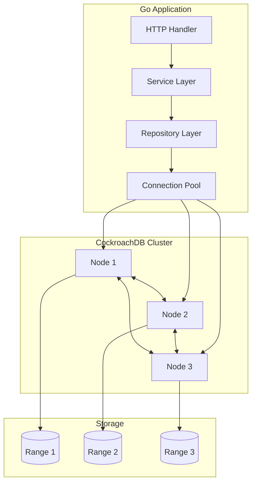
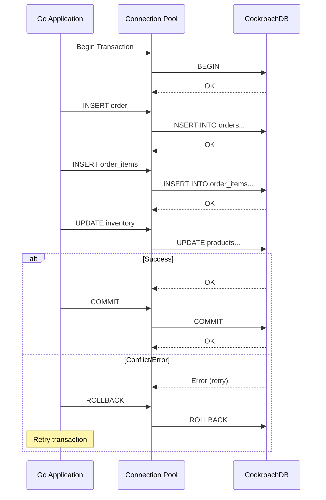

# How to Use CockroachDB with Go

Author: [nawazdhandala](https://github.com/nawazdhandala)

Tags: CockroachDB, Go, Golang, Database, Distributed Systems, SQL, PostgreSQL

Description: Learn how to integrate CockroachDB with Go applications. Covers connection setup, CRUD operations, transactions, connection pooling, retry logic for distributed databases, and production best practices.

---

CockroachDB is a distributed SQL database built for cloud-native applications that require horizontal scalability, strong consistency, and resilience. Go, with its excellent concurrency support and performance characteristics, makes an ideal pairing for building applications on CockroachDB.

## Architecture Overview

The following diagram illustrates the architecture of a Go application interacting with a CockroachDB cluster.



## Setting Up the Project

### Prerequisites

Before starting, ensure you have Go 1.21 or later installed. CockroachDB uses the PostgreSQL wire protocol, so you can use the standard `pgx` driver.

Install the required dependencies using Go modules.

```bash
go mod init myapp
go get github.com/jackc/pgx/v5
go get github.com/jackc/pgx/v5/pgxpool
```

### Connection Configuration

CockroachDB supports secure connections using TLS certificates. For local development, you can disable TLS, but production deployments should always use encrypted connections.

Create a configuration struct that holds your database connection parameters.

```go
package config

import (
    "fmt"
    "os"
    "time"
)

// DatabaseConfig holds CockroachDB connection parameters
type DatabaseConfig struct {
    Host            string
    Port            int
    User            string
    Password        string
    Database        string
    SSLMode         string
    SSLRootCert     string
    MaxConns        int32
    MinConns        int32
    MaxConnLifetime time.Duration
    MaxConnIdleTime time.Duration
}

// ConnectionString builds the PostgreSQL-compatible connection string
// CockroachDB uses the same wire protocol as PostgreSQL
func (c *DatabaseConfig) ConnectionString() string {
    connStr := fmt.Sprintf(
        "postgresql://%s:%s@%s:%d/%s?sslmode=%s",
        c.User,
        c.Password,
        c.Host,
        c.Port,
        c.Database,
        c.SSLMode,
    )

    // Add SSL certificate path for secure connections
    if c.SSLRootCert != "" {
        connStr += fmt.Sprintf("&sslrootcert=%s", c.SSLRootCert)
    }

    return connStr
}

// LoadFromEnv creates a DatabaseConfig from environment variables
func LoadFromEnv() *DatabaseConfig {
    return &DatabaseConfig{
        Host:            getEnv("CRDB_HOST", "localhost"),
        Port:            getEnvAsInt("CRDB_PORT", 26257),
        User:            getEnv("CRDB_USER", "root"),
        Password:        getEnv("CRDB_PASSWORD", ""),
        Database:        getEnv("CRDB_DATABASE", "defaultdb"),
        SSLMode:         getEnv("CRDB_SSL_MODE", "verify-full"),
        SSLRootCert:     getEnv("CRDB_SSL_ROOT_CERT", ""),
        MaxConns:        int32(getEnvAsInt("CRDB_MAX_CONNS", 25)),
        MinConns:        int32(getEnvAsInt("CRDB_MIN_CONNS", 5)),
        MaxConnLifetime: time.Hour,
        MaxConnIdleTime: 30 * time.Minute,
    }
}
```

### Establishing a Connection Pool

Connection pooling is essential for production applications. The `pgxpool` package provides an efficient connection pool that handles connection lifecycle management.

```go
package database

import (
    "context"
    "fmt"
    "time"

    "github.com/jackc/pgx/v5/pgxpool"
)

// DB wraps the connection pool and provides helper methods
type DB struct {
    Pool *pgxpool.Pool
}

// Connect establishes a connection pool to CockroachDB
// The pool automatically manages connection lifecycle and health checks
func Connect(ctx context.Context, cfg *DatabaseConfig) (*DB, error) {
    // Parse the connection string into a pool config
    poolConfig, err := pgxpool.ParseConfig(cfg.ConnectionString())
    if err != nil {
        return nil, fmt.Errorf("parsing connection string: %w", err)
    }

    // Configure pool settings for optimal performance
    poolConfig.MaxConns = cfg.MaxConns
    poolConfig.MinConns = cfg.MinConns
    poolConfig.MaxConnLifetime = cfg.MaxConnLifetime
    poolConfig.MaxConnIdleTime = cfg.MaxConnIdleTime

    // Health check interval determines how often idle connections are verified
    poolConfig.HealthCheckPeriod = 1 * time.Minute

    // Create the connection pool
    pool, err := pgxpool.NewWithConfig(ctx, poolConfig)
    if err != nil {
        return nil, fmt.Errorf("creating connection pool: %w", err)
    }

    // Verify connectivity with a ping
    if err := pool.Ping(ctx); err != nil {
        pool.Close()
        return nil, fmt.Errorf("pinging database: %w", err)
    }

    return &DB{Pool: pool}, nil
}

// Close gracefully shuts down the connection pool
func (db *DB) Close() {
    db.Pool.Close()
}

// Health checks if the database is reachable
func (db *DB) Health(ctx context.Context) error {
    return db.Pool.Ping(ctx)
}
```

## Schema Definition

CockroachDB supports standard SQL DDL with additional features like hash-sharded indexes for high-throughput workloads. Define your schema using SQL migrations.

```sql
-- migrations/001_create_users.sql
-- Create the users table with a UUID primary key
-- UUIDs distribute evenly across the cluster, avoiding hot spots

CREATE TABLE IF NOT EXISTS users (
    id UUID PRIMARY KEY DEFAULT gen_random_uuid(),
    email STRING NOT NULL UNIQUE,
    name STRING NOT NULL,
    password_hash STRING NOT NULL,
    created_at TIMESTAMPTZ NOT NULL DEFAULT now(),
    updated_at TIMESTAMPTZ NOT NULL DEFAULT now(),

    -- Index for email lookups during authentication
    INDEX idx_users_email (email)
);

-- Create the orders table with foreign key relationship
CREATE TABLE IF NOT EXISTS orders (
    id UUID PRIMARY KEY DEFAULT gen_random_uuid(),
    user_id UUID NOT NULL REFERENCES users(id) ON DELETE CASCADE,
    status STRING NOT NULL DEFAULT 'pending',
    total_amount DECIMAL(10, 2) NOT NULL,
    created_at TIMESTAMPTZ NOT NULL DEFAULT now(),
    updated_at TIMESTAMPTZ NOT NULL DEFAULT now(),

    -- Composite index for user order history queries
    INDEX idx_orders_user_status (user_id, status),
    INDEX idx_orders_created (created_at DESC)
);

-- Create the order_items table for order line items
CREATE TABLE IF NOT EXISTS order_items (
    id UUID PRIMARY KEY DEFAULT gen_random_uuid(),
    order_id UUID NOT NULL REFERENCES orders(id) ON DELETE CASCADE,
    product_id UUID NOT NULL,
    quantity INT NOT NULL CHECK (quantity > 0),
    unit_price DECIMAL(10, 2) NOT NULL,

    INDEX idx_order_items_order (order_id)
);
```

## Model Definitions

Define Go structs that map to your database tables. Use struct tags for JSON serialization and database column mapping.

```go
package models

import (
    "time"

    "github.com/google/uuid"
)

// User represents a user account in the system
type User struct {
    ID           uuid.UUID `json:"id" db:"id"`
    Email        string    `json:"email" db:"email"`
    Name         string    `json:"name" db:"name"`
    PasswordHash string    `json:"-" db:"password_hash"` // Never serialize password
    CreatedAt    time.Time `json:"created_at" db:"created_at"`
    UpdatedAt    time.Time `json:"updated_at" db:"updated_at"`
}

// Order represents a customer order
type Order struct {
    ID          uuid.UUID   `json:"id" db:"id"`
    UserID      uuid.UUID   `json:"user_id" db:"user_id"`
    Status      OrderStatus `json:"status" db:"status"`
    TotalAmount float64     `json:"total_amount" db:"total_amount"`
    CreatedAt   time.Time   `json:"created_at" db:"created_at"`
    UpdatedAt   time.Time   `json:"updated_at" db:"updated_at"`
    Items       []OrderItem `json:"items,omitempty"`
}

// OrderStatus represents the lifecycle state of an order
type OrderStatus string

const (
    OrderStatusPending   OrderStatus = "pending"
    OrderStatusConfirmed OrderStatus = "confirmed"
    OrderStatusShipped   OrderStatus = "shipped"
    OrderStatusDelivered OrderStatus = "delivered"
    OrderStatusCancelled OrderStatus = "cancelled"
)

// OrderItem represents a line item within an order
type OrderItem struct {
    ID        uuid.UUID `json:"id" db:"id"`
    OrderID   uuid.UUID `json:"order_id" db:"order_id"`
    ProductID uuid.UUID `json:"product_id" db:"product_id"`
    Quantity  int       `json:"quantity" db:"quantity"`
    UnitPrice float64   `json:"unit_price" db:"unit_price"`
}
```

## Repository Pattern Implementation

The repository pattern provides a clean abstraction over database operations. Each repository handles CRUD operations for a specific entity.

### User Repository

```go
package repository

import (
    "context"
    "errors"
    "fmt"

    "github.com/google/uuid"
    "github.com/jackc/pgx/v5"
    "github.com/jackc/pgx/v5/pgxpool"
    "myapp/models"
)

// UserRepository handles database operations for users
type UserRepository struct {
    pool *pgxpool.Pool
}

// NewUserRepository creates a new UserRepository instance
func NewUserRepository(pool *pgxpool.Pool) *UserRepository {
    return &UserRepository{pool: pool}
}

// Create inserts a new user and returns the created user with generated ID
func (r *UserRepository) Create(ctx context.Context, user *models.User) (*models.User, error) {
    query := `
        INSERT INTO users (email, name, password_hash)
        VALUES ($1, $2, $3)
        RETURNING id, email, name, created_at, updated_at
    `

    var created models.User
    err := r.pool.QueryRow(ctx, query, user.Email, user.Name, user.PasswordHash).Scan(
        &created.ID,
        &created.Email,
        &created.Name,
        &created.CreatedAt,
        &created.UpdatedAt,
    )

    if err != nil {
        return nil, fmt.Errorf("creating user: %w", err)
    }

    return &created, nil
}

// GetByID retrieves a user by their unique identifier
func (r *UserRepository) GetByID(ctx context.Context, id uuid.UUID) (*models.User, error) {
    query := `
        SELECT id, email, name, password_hash, created_at, updated_at
        FROM users
        WHERE id = $1
    `

    var user models.User
    err := r.pool.QueryRow(ctx, query, id).Scan(
        &user.ID,
        &user.Email,
        &user.Name,
        &user.PasswordHash,
        &user.CreatedAt,
        &user.UpdatedAt,
    )

    if errors.Is(err, pgx.ErrNoRows) {
        return nil, nil // Return nil to indicate not found
    }

    if err != nil {
        return nil, fmt.Errorf("getting user by id: %w", err)
    }

    return &user, nil
}

// GetByEmail retrieves a user by their email address
func (r *UserRepository) GetByEmail(ctx context.Context, email string) (*models.User, error) {
    query := `
        SELECT id, email, name, password_hash, created_at, updated_at
        FROM users
        WHERE email = $1
    `

    var user models.User
    err := r.pool.QueryRow(ctx, query, email).Scan(
        &user.ID,
        &user.Email,
        &user.Name,
        &user.PasswordHash,
        &user.CreatedAt,
        &user.UpdatedAt,
    )

    if errors.Is(err, pgx.ErrNoRows) {
        return nil, nil
    }

    if err != nil {
        return nil, fmt.Errorf("getting user by email: %w", err)
    }

    return &user, nil
}

// Update modifies an existing user's information
func (r *UserRepository) Update(ctx context.Context, user *models.User) error {
    query := `
        UPDATE users
        SET name = $2, email = $3, updated_at = now()
        WHERE id = $1
    `

    result, err := r.pool.Exec(ctx, query, user.ID, user.Name, user.Email)
    if err != nil {
        return fmt.Errorf("updating user: %w", err)
    }

    if result.RowsAffected() == 0 {
        return errors.New("user not found")
    }

    return nil
}

// Delete removes a user by their ID
func (r *UserRepository) Delete(ctx context.Context, id uuid.UUID) error {
    query := `DELETE FROM users WHERE id = $1`

    result, err := r.pool.Exec(ctx, query, id)
    if err != nil {
        return fmt.Errorf("deleting user: %w", err)
    }

    if result.RowsAffected() == 0 {
        return errors.New("user not found")
    }

    return nil
}

// List retrieves users with pagination support
func (r *UserRepository) List(ctx context.Context, limit, offset int) ([]*models.User, error) {
    query := `
        SELECT id, email, name, created_at, updated_at
        FROM users
        ORDER BY created_at DESC
        LIMIT $1 OFFSET $2
    `

    rows, err := r.pool.Query(ctx, query, limit, offset)
    if err != nil {
        return nil, fmt.Errorf("listing users: %w", err)
    }
    defer rows.Close()

    var users []*models.User
    for rows.Next() {
        var user models.User
        err := rows.Scan(
            &user.ID,
            &user.Email,
            &user.Name,
            &user.CreatedAt,
            &user.UpdatedAt,
        )
        if err != nil {
            return nil, fmt.Errorf("scanning user row: %w", err)
        }
        users = append(users, &user)
    }

    return users, rows.Err()
}
```

## Transaction Management

CockroachDB supports ACID transactions with serializable isolation by default. Proper transaction handling is critical for data integrity.

### Transaction Flow



### Transaction Helper

Create a helper function that handles transaction lifecycle and automatic retries for transient errors.

```go
package database

import (
    "context"
    "errors"
    "fmt"
    "time"

    "github.com/jackc/pgx/v5"
    "github.com/jackc/pgx/v5/pgconn"
    "github.com/jackc/pgx/v5/pgxpool"
)

// TxFunc is a function that runs within a transaction
type TxFunc func(tx pgx.Tx) error

// ExecuteInTransaction runs a function within a database transaction
// It handles commit, rollback, and retries for transient errors
func (db *DB) ExecuteInTransaction(ctx context.Context, fn TxFunc) error {
    const maxRetries = 3
    const baseDelay = 100 * time.Millisecond

    var lastErr error

    for attempt := 0; attempt < maxRetries; attempt++ {
        err := db.executeTransaction(ctx, fn)
        if err == nil {
            return nil
        }

        // Check if the error is retryable
        if !isRetryableError(err) {
            return err
        }

        lastErr = err

        // Exponential backoff with jitter
        delay := baseDelay * time.Duration(1<<attempt)
        select {
        case <-ctx.Done():
            return ctx.Err()
        case <-time.After(delay):
            // Continue to next retry
        }
    }

    return fmt.Errorf("transaction failed after %d retries: %w", maxRetries, lastErr)
}

// executeTransaction performs a single transaction attempt
func (db *DB) executeTransaction(ctx context.Context, fn TxFunc) error {
    tx, err := db.Pool.Begin(ctx)
    if err != nil {
        return fmt.Errorf("beginning transaction: %w", err)
    }

    // Ensure rollback on panic or error
    defer func() {
        if p := recover(); p != nil {
            tx.Rollback(ctx)
            panic(p)
        }
    }()

    if err := fn(tx); err != nil {
        if rbErr := tx.Rollback(ctx); rbErr != nil {
            return fmt.Errorf("rolling back after error %v: %w", err, rbErr)
        }
        return err
    }

    if err := tx.Commit(ctx); err != nil {
        return fmt.Errorf("committing transaction: %w", err)
    }

    return nil
}

// isRetryableError checks if an error indicates a transient condition
// CockroachDB uses specific error codes for serialization conflicts
func isRetryableError(err error) bool {
    var pgErr *pgconn.PgError
    if errors.As(err, &pgErr) {
        // 40001: serialization_failure - retry the transaction
        // 40003: statement_completion_unknown - connection issue
        // CR000: CockroachDB-specific retry code
        switch pgErr.Code {
        case "40001", "40003", "CR000":
            return true
        }
    }
    return false
}
```

### Using Transactions for Complex Operations

Use transactions to ensure atomicity when creating orders with multiple line items.

```go
package repository

import (
    "context"
    "fmt"

    "github.com/google/uuid"
    "github.com/jackc/pgx/v5"
    "myapp/database"
    "myapp/models"
)

// OrderRepository handles database operations for orders
type OrderRepository struct {
    db *database.DB
}

// NewOrderRepository creates a new OrderRepository instance
func NewOrderRepository(db *database.DB) *OrderRepository {
    return &OrderRepository{db: db}
}

// CreateWithItems creates an order and its items atomically
// The entire operation succeeds or fails as a unit
func (r *OrderRepository) CreateWithItems(
    ctx context.Context,
    order *models.Order,
    items []models.OrderItem,
) (*models.Order, error) {
    var createdOrder models.Order

    err := r.db.ExecuteInTransaction(ctx, func(tx pgx.Tx) error {
        // Insert the order first
        orderQuery := `
            INSERT INTO orders (user_id, status, total_amount)
            VALUES ($1, $2, $3)
            RETURNING id, user_id, status, total_amount, created_at, updated_at
        `

        err := tx.QueryRow(ctx, orderQuery,
            order.UserID,
            order.Status,
            order.TotalAmount,
        ).Scan(
            &createdOrder.ID,
            &createdOrder.UserID,
            &createdOrder.Status,
            &createdOrder.TotalAmount,
            &createdOrder.CreatedAt,
            &createdOrder.UpdatedAt,
        )

        if err != nil {
            return fmt.Errorf("inserting order: %w", err)
        }

        // Insert all order items
        itemQuery := `
            INSERT INTO order_items (order_id, product_id, quantity, unit_price)
            VALUES ($1, $2, $3, $4)
            RETURNING id
        `

        createdOrder.Items = make([]models.OrderItem, len(items))

        for i, item := range items {
            var itemID uuid.UUID
            err := tx.QueryRow(ctx, itemQuery,
                createdOrder.ID,
                item.ProductID,
                item.Quantity,
                item.UnitPrice,
            ).Scan(&itemID)

            if err != nil {
                return fmt.Errorf("inserting order item: %w", err)
            }

            createdOrder.Items[i] = models.OrderItem{
                ID:        itemID,
                OrderID:   createdOrder.ID,
                ProductID: item.ProductID,
                Quantity:  item.Quantity,
                UnitPrice: item.UnitPrice,
            }
        }

        return nil
    })

    if err != nil {
        return nil, err
    }

    return &createdOrder, nil
}

// UpdateStatus changes the order status atomically
func (r *OrderRepository) UpdateStatus(
    ctx context.Context,
    orderID uuid.UUID,
    newStatus models.OrderStatus,
) error {
    return r.db.ExecuteInTransaction(ctx, func(tx pgx.Tx) error {
        // Lock the row and verify current status
        var currentStatus models.OrderStatus
        selectQuery := `
            SELECT status FROM orders WHERE id = $1 FOR UPDATE
        `

        err := tx.QueryRow(ctx, selectQuery, orderID).Scan(&currentStatus)
        if err != nil {
            return fmt.Errorf("selecting order for update: %w", err)
        }

        // Validate state transition
        if !isValidStatusTransition(currentStatus, newStatus) {
            return fmt.Errorf(
                "invalid status transition from %s to %s",
                currentStatus,
                newStatus,
            )
        }

        // Update the status
        updateQuery := `
            UPDATE orders
            SET status = $2, updated_at = now()
            WHERE id = $1
        `

        _, err = tx.Exec(ctx, updateQuery, orderID, newStatus)
        if err != nil {
            return fmt.Errorf("updating order status: %w", err)
        }

        return nil
    })
}

// isValidStatusTransition enforces order status workflow rules
func isValidStatusTransition(from, to models.OrderStatus) bool {
    validTransitions := map[models.OrderStatus][]models.OrderStatus{
        models.OrderStatusPending:   {models.OrderStatusConfirmed, models.OrderStatusCancelled},
        models.OrderStatusConfirmed: {models.OrderStatusShipped, models.OrderStatusCancelled},
        models.OrderStatusShipped:   {models.OrderStatusDelivered},
        models.OrderStatusDelivered: {},
        models.OrderStatusCancelled: {},
    }

    allowed, exists := validTransitions[from]
    if !exists {
        return false
    }

    for _, status := range allowed {
        if status == to {
            return true
        }
    }

    return false
}
```

## Batch Operations

For high-throughput scenarios, batch operations reduce round trips to the database.

```go
package repository

import (
    "context"
    "fmt"

    "github.com/jackc/pgx/v5"
    "myapp/models"
)

// BatchInsertOrderItems efficiently inserts multiple order items using COPY
func (r *OrderRepository) BatchInsertOrderItems(
    ctx context.Context,
    items []models.OrderItem,
) error {
    // Use CopyFrom for efficient bulk inserts
    // CockroachDB optimizes COPY protocol for high throughput
    columns := []string{"order_id", "product_id", "quantity", "unit_price"}

    rows := make([][]interface{}, len(items))
    for i, item := range items {
        rows[i] = []interface{}{
            item.OrderID,
            item.ProductID,
            item.Quantity,
            item.UnitPrice,
        }
    }

    copyCount, err := r.db.Pool.CopyFrom(
        ctx,
        pgx.Identifier{"order_items"},
        columns,
        pgx.CopyFromRows(rows),
    )

    if err != nil {
        return fmt.Errorf("batch inserting order items: %w", err)
    }

    if copyCount != int64(len(items)) {
        return fmt.Errorf("expected to insert %d rows, inserted %d", len(items), copyCount)
    }

    return nil
}

// BatchUpdateStatuses updates multiple orders in a single query
func (r *OrderRepository) BatchUpdateStatuses(
    ctx context.Context,
    updates map[string]models.OrderStatus,
) error {
    if len(updates) == 0 {
        return nil
    }

    return r.db.ExecuteInTransaction(ctx, func(tx pgx.Tx) error {
        batch := &pgx.Batch{}

        query := `UPDATE orders SET status = $2, updated_at = now() WHERE id = $1`

        for orderID, status := range updates {
            batch.Queue(query, orderID, status)
        }

        results := tx.SendBatch(ctx, batch)
        defer results.Close()

        for i := 0; i < len(updates); i++ {
            _, err := results.Exec()
            if err != nil {
                return fmt.Errorf("batch update failed at index %d: %w", i, err)
            }
        }

        return nil
    })
}
```

## Query Optimization

CockroachDB provides powerful query analysis tools. Understanding query plans helps optimize performance.

### Explain and Analyze

```go
package database

import (
    "context"
    "fmt"
    "strings"
)

// ExplainQuery returns the query execution plan
// Use this during development to understand query performance
func (db *DB) ExplainQuery(ctx context.Context, query string, args ...interface{}) (string, error) {
    explainQuery := fmt.Sprintf("EXPLAIN ANALYZE %s", query)

    rows, err := db.Pool.Query(ctx, explainQuery, args...)
    if err != nil {
        return "", fmt.Errorf("explaining query: %w", err)
    }
    defer rows.Close()

    var plan strings.Builder
    for rows.Next() {
        var line string
        if err := rows.Scan(&line); err != nil {
            return "", fmt.Errorf("scanning explain row: %w", err)
        }
        plan.WriteString(line)
        plan.WriteString("\n")
    }

    return plan.String(), rows.Err()
}
```

### Index Usage Example

Verify your queries use the expected indexes.

```go
// Example: Check if the user email lookup uses the index
func (r *UserRepository) VerifyEmailLookupPerformance(ctx context.Context) error {
    plan, err := r.db.ExplainQuery(ctx,
        "SELECT id FROM users WHERE email = $1",
        "test@example.com",
    )
    if err != nil {
        return err
    }

    // The plan should show "idx_users_email" being used
    if !strings.Contains(plan, "idx_users_email") {
        return fmt.Errorf("email lookup not using index: %s", plan)
    }

    return nil
}
```

## Connection Health and Monitoring

Monitor your database connections to detect issues early.

```go
package database

import (
    "context"
    "fmt"
    "time"
)

// PoolStats represents connection pool statistics
type PoolStats struct {
    TotalConns     int32         `json:"total_conns"`
    AcquiredConns  int32         `json:"acquired_conns"`
    IdleConns      int32         `json:"idle_conns"`
    MaxConns       int32         `json:"max_conns"`
    AcquireCount   int64         `json:"acquire_count"`
    AcquireDuration time.Duration `json:"acquire_duration"`
}

// GetPoolStats returns current connection pool statistics
func (db *DB) GetPoolStats() PoolStats {
    stats := db.Pool.Stat()
    return PoolStats{
        TotalConns:      stats.TotalConns(),
        AcquiredConns:   stats.AcquiredConns(),
        IdleConns:       stats.IdleConns(),
        MaxConns:        stats.MaxConns(),
        AcquireCount:    stats.AcquireCount(),
        AcquireDuration: stats.AcquireDuration(),
    }
}

// HealthCheck performs a comprehensive health check
func (db *DB) HealthCheck(ctx context.Context) error {
    // Test connectivity with a simple query
    var result int
    err := db.Pool.QueryRow(ctx, "SELECT 1").Scan(&result)
    if err != nil {
        return fmt.Errorf("connectivity check failed: %w", err)
    }

    // Check pool health
    stats := db.Pool.Stat()
    if stats.TotalConns() == 0 {
        return fmt.Errorf("no connections in pool")
    }

    // Warn if pool is near capacity
    utilizationPercent := float64(stats.AcquiredConns()) / float64(stats.MaxConns()) * 100
    if utilizationPercent > 90 {
        return fmt.Errorf("connection pool at %.1f%% capacity", utilizationPercent)
    }

    return nil
}
```

## Putting It All Together

Here is a complete example that ties everything together.

```go
package main

import (
    "context"
    "encoding/json"
    "log"
    "net/http"
    "os"
    "os/signal"
    "syscall"
    "time"

    "github.com/google/uuid"
    "myapp/config"
    "myapp/database"
    "myapp/models"
    "myapp/repository"
)

func main() {
    // Load configuration from environment
    cfg := config.LoadFromEnv()

    // Create a context that cancels on shutdown signal
    ctx, cancel := context.WithCancel(context.Background())
    defer cancel()

    // Connect to CockroachDB
    db, err := database.Connect(ctx, cfg)
    if err != nil {
        log.Fatalf("Failed to connect to database: %v", err)
    }
    defer db.Close()

    log.Println("Connected to CockroachDB")

    // Initialize repositories
    userRepo := repository.NewUserRepository(db.Pool)
    orderRepo := repository.NewOrderRepository(db)

    // Set up HTTP routes
    http.HandleFunc("/health", healthHandler(db))
    http.HandleFunc("/users", usersHandler(userRepo))
    http.HandleFunc("/orders", ordersHandler(orderRepo))

    // Start server
    server := &http.Server{
        Addr:         ":8080",
        ReadTimeout:  10 * time.Second,
        WriteTimeout: 10 * time.Second,
    }

    go func() {
        log.Println("Starting server on :8080")
        if err := server.ListenAndServe(); err != http.ErrServerClosed {
            log.Fatalf("Server error: %v", err)
        }
    }()

    // Wait for shutdown signal
    quit := make(chan os.Signal, 1)
    signal.Notify(quit, syscall.SIGINT, syscall.SIGTERM)
    <-quit

    log.Println("Shutting down server...")

    // Graceful shutdown
    shutdownCtx, shutdownCancel := context.WithTimeout(context.Background(), 30*time.Second)
    defer shutdownCancel()

    if err := server.Shutdown(shutdownCtx); err != nil {
        log.Printf("Server shutdown error: %v", err)
    }

    log.Println("Server stopped")
}

// healthHandler returns a health check endpoint
func healthHandler(db *database.DB) http.HandlerFunc {
    return func(w http.ResponseWriter, r *http.Request) {
        ctx := r.Context()

        if err := db.HealthCheck(ctx); err != nil {
            http.Error(w, err.Error(), http.StatusServiceUnavailable)
            return
        }

        stats := db.GetPoolStats()
        json.NewEncoder(w).Encode(map[string]interface{}{
            "status": "healthy",
            "pool":   stats,
        })
    }
}

// usersHandler handles user-related requests
func usersHandler(repo *repository.UserRepository) http.HandlerFunc {
    return func(w http.ResponseWriter, r *http.Request) {
        ctx := r.Context()

        switch r.Method {
        case http.MethodPost:
            var user models.User
            if err := json.NewDecoder(r.Body).Decode(&user); err != nil {
                http.Error(w, "invalid request body", http.StatusBadRequest)
                return
            }

            created, err := repo.Create(ctx, &user)
            if err != nil {
                http.Error(w, err.Error(), http.StatusInternalServerError)
                return
            }

            w.WriteHeader(http.StatusCreated)
            json.NewEncoder(w).Encode(created)

        case http.MethodGet:
            users, err := repo.List(ctx, 20, 0)
            if err != nil {
                http.Error(w, err.Error(), http.StatusInternalServerError)
                return
            }
            json.NewEncoder(w).Encode(users)

        default:
            http.Error(w, "method not allowed", http.StatusMethodNotAllowed)
        }
    }
}

// ordersHandler handles order-related requests
func ordersHandler(repo *repository.OrderRepository) http.HandlerFunc {
    return func(w http.ResponseWriter, r *http.Request) {
        ctx := r.Context()

        if r.Method != http.MethodPost {
            http.Error(w, "method not allowed", http.StatusMethodNotAllowed)
            return
        }

        var request struct {
            UserID uuid.UUID          `json:"user_id"`
            Items  []models.OrderItem `json:"items"`
        }

        if err := json.NewDecoder(r.Body).Decode(&request); err != nil {
            http.Error(w, "invalid request body", http.StatusBadRequest)
            return
        }

        // Calculate total amount
        var total float64
        for _, item := range request.Items {
            total += float64(item.Quantity) * item.UnitPrice
        }

        order := &models.Order{
            UserID:      request.UserID,
            Status:      models.OrderStatusPending,
            TotalAmount: total,
        }

        created, err := repo.CreateWithItems(ctx, order, request.Items)
        if err != nil {
            http.Error(w, err.Error(), http.StatusInternalServerError)
            return
        }

        w.WriteHeader(http.StatusCreated)
        json.NewEncoder(w).Encode(created)
    }
}
```

## Best Practices Summary

| Practice | Description |
|----------|-------------|
| **Use UUIDs** | Distribute data evenly across nodes to avoid hot spots |
| **Connection Pooling** | Reuse connections to reduce overhead |
| **Retry Logic** | Handle serialization conflicts with exponential backoff |
| **Batch Operations** | Use COPY and batch queries for bulk operations |
| **Index Carefully** | Add indexes based on query patterns, verify with EXPLAIN |
| **Transaction Scope** | Keep transactions short to reduce conflict probability |
| **Health Checks** | Monitor pool statistics and connection health |

## Additional Resources

- [CockroachDB Go Documentation](https://www.cockroachlabs.com/docs/stable/build-a-go-app-with-cockroachdb.html)
- [pgx Driver Documentation](https://pkg.go.dev/github.com/jackc/pgx/v5)
- [CockroachDB Transaction Handling](https://www.cockroachlabs.com/docs/stable/transactions.html)

Building Go applications with CockroachDB requires understanding both the distributed nature of CockroachDB and proper Go database patterns. By following these patterns for connection management, transactions, and error handling, you can build resilient applications that take full advantage of CockroachDB's scalability and consistency guarantees.
