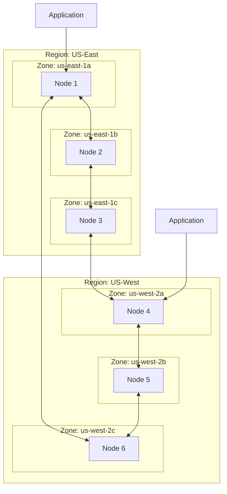
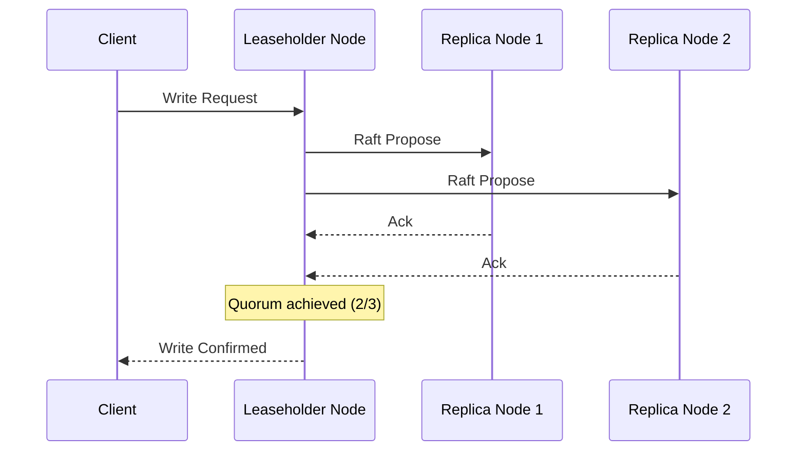
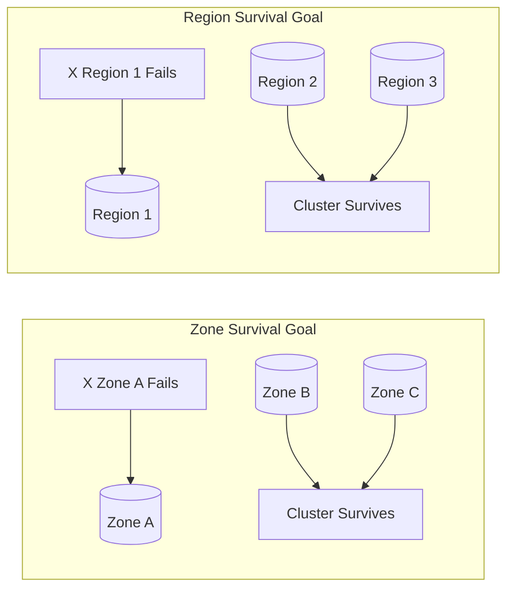
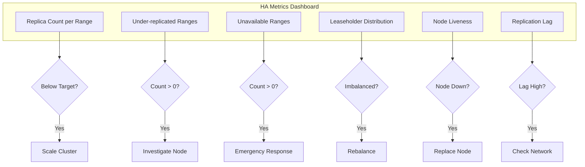
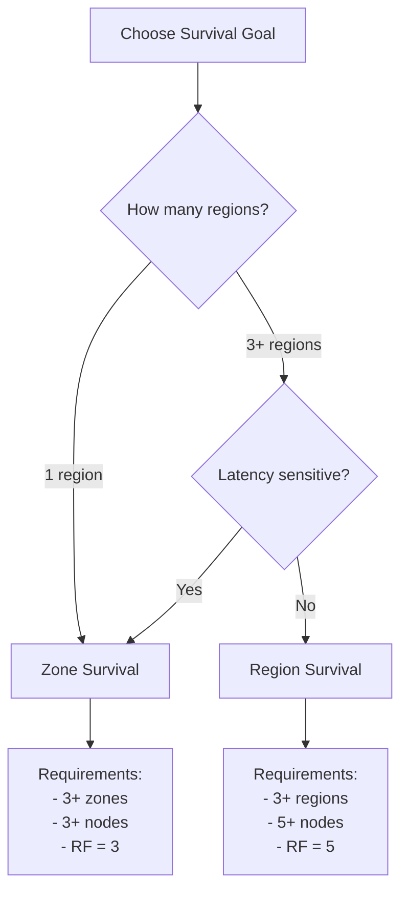

# How to Configure CockroachDB for High Availability

Author: [nawazdhandala](https://www.github.com/nawazdhandala)

Tags: CockroachDB, High Availability, Distributed Database, SQL, Kubernetes, Replication

Description: Learn how to configure CockroachDB for high availability with multi-region clusters, replication zones, and automated failover. Covers deployment strategies, survival goals, and production best practices.

---

CockroachDB is built from the ground up for high availability, using a distributed architecture that survives node, zone, and even region failures. By understanding and properly configuring its replication and topology features, you can achieve impressive uptime guarantees while maintaining strong consistency.

## CockroachDB Architecture Overview



### Key High Availability Concepts

| Concept | Description | Default |
|---------|-------------|---------|
| Replication Factor | Number of copies of each range | 3 |
| Raft Consensus | Ensures data consistency across replicas | Always on |
| Leaseholder | Node that coordinates reads/writes for a range | Automatic |
| Survival Goal | Zone or region failure tolerance | Zone |

## Setting Up a Multi-Node Cluster

### Starting Nodes with Locality Configuration

Locality flags help CockroachDB understand your topology and place replicas appropriately for maximum availability.

```bash
# Start node 1 in us-east-1a
cockroach start \
  --insecure \
  --advertise-addr=node1.example.com:26257 \
  --join=node1.example.com:26257,node2.example.com:26257,node3.example.com:26257 \
  --locality=region=us-east,zone=us-east-1a \
  --store=path=/data/cockroach \
  --background

# Start node 2 in us-east-1b
cockroach start \
  --insecure \
  --advertise-addr=node2.example.com:26257 \
  --join=node1.example.com:26257,node2.example.com:26257,node3.example.com:26257 \
  --locality=region=us-east,zone=us-east-1b \
  --store=path=/data/cockroach \
  --background

# Start node 3 in us-east-1c
cockroach start \
  --insecure \
  --advertise-addr=node3.example.com:26257 \
  --join=node1.example.com:26257,node2.example.com:26257,node3.example.com:26257 \
  --locality=region=us-east,zone=us-east-1c \
  --store=path=/data/cockroach \
  --background

# Initialize the cluster (run once)
cockroach init --insecure --host=node1.example.com:26257
```

### Production TLS Configuration

For production environments, always enable TLS encryption. Generate certificates using the cockroach cert commands.

```bash
# Create CA certificate
cockroach cert create-ca \
  --certs-dir=certs \
  --ca-key=my-safe-directory/ca.key

# Create node certificate for each node
cockroach cert create-node \
  node1.example.com \
  localhost \
  127.0.0.1 \
  --certs-dir=certs \
  --ca-key=my-safe-directory/ca.key

# Create client certificate for root user
cockroach cert create-client \
  root \
  --certs-dir=certs \
  --ca-key=my-safe-directory/ca.key

# Start node with TLS enabled
cockroach start \
  --certs-dir=certs \
  --advertise-addr=node1.example.com:26257 \
  --join=node1.example.com:26257,node2.example.com:26257,node3.example.com:26257 \
  --locality=region=us-east,zone=us-east-1a \
  --store=path=/data/cockroach \
  --background
```

## Deploying on Kubernetes

### CockroachDB Operator Installation

The CockroachDB Kubernetes Operator simplifies deployment and management of highly available clusters.

```bash
# Install the CockroachDB Operator
kubectl apply -f https://raw.githubusercontent.com/cockroachdb/cockroach-operator/v2.14.0/install/crds.yaml
kubectl apply -f https://raw.githubusercontent.com/cockroachdb/cockroach-operator/v2.14.0/install/operator.yaml

# Verify the operator is running
kubectl get pods -n cockroach-operator-system
```

### Multi-Zone Cluster Configuration

Define a CrdbCluster custom resource with topology spread constraints to ensure replicas are distributed across zones.

```yaml
# cockroachdb-cluster.yaml
apiVersion: crdb.cockroachlabs.com/v1alpha1
kind: CrdbCluster
metadata:
  name: cockroachdb
  namespace: cockroachdb
spec:
  dataStore:
    pvc:
      spec:
        accessModes:
          - ReadWriteOnce
        resources:
          requests:
            storage: 100Gi
        storageClassName: premium-rwo
  resources:
    requests:
      cpu: "4"
      memory: "16Gi"
    limits:
      cpu: "8"
      memory: "32Gi"
  tlsEnabled: true
  image:
    name: cockroachdb/cockroach:v24.1.0
  nodes: 9
  topology:
    - key: topology.kubernetes.io/zone
      values:
        - us-east1-a
        - us-east1-b
        - us-east1-c
  additionalArgs:
    - --locality=region=us-east,zone=$(POD_ZONE)
```

### Pod Anti-Affinity for Zone Distribution

Ensure pods are spread across zones using topology spread constraints for maximum availability.

```yaml
# cockroachdb-statefulset-patch.yaml
apiVersion: apps/v1
kind: StatefulSet
metadata:
  name: cockroachdb
spec:
  template:
    spec:
      topologySpreadConstraints:
        - maxSkew: 1
          topologyKey: topology.kubernetes.io/zone
          whenUnsatisfiable: DoNotSchedule
          labelSelector:
            matchLabels:
              app.kubernetes.io/name: cockroachdb
      affinity:
        podAntiAffinity:
          requiredDuringSchedulingIgnoredDuringExecution:
            - labelSelector:
                matchLabels:
                  app.kubernetes.io/name: cockroachdb
              topologyKey: kubernetes.io/hostname
```

## Configuring Replication Zones

### Understanding Replication Flow



### Default Cluster Replication Settings

Configure the default replication factor and constraints for all data in the cluster.

```sql
-- Set default replication factor to 5 for higher durability
ALTER RANGE default CONFIGURE ZONE USING
  num_replicas = 5,
  gc.ttlseconds = 90000;

-- View current zone configuration
SHOW ZONE CONFIGURATION FOR RANGE default;

-- Configure constraints to spread replicas across zones
ALTER RANGE default CONFIGURE ZONE USING
  num_replicas = 5,
  constraints = '{"+zone=us-east-1a": 1, "+zone=us-east-1b": 1, "+zone=us-east-1c": 1}';
```

### Database-Level Replication

Apply specific replication settings to individual databases based on their availability requirements.

```sql
-- Create a highly available database with 5 replicas
CREATE DATABASE critical_app;

ALTER DATABASE critical_app CONFIGURE ZONE USING
  num_replicas = 5,
  constraints = '{"+region=us-east": 2, "+region=us-west": 2, "+region=eu-west": 1}',
  lease_preferences = '[[+region=us-east]]';

-- Create a lower-priority database with 3 replicas
CREATE DATABASE analytics;

ALTER DATABASE analytics CONFIGURE ZONE USING
  num_replicas = 3,
  constraints = '[+region=us-east]';
```

### Table-Level Replication

Fine-tune replication for specific tables that require different availability characteristics.

```sql
-- User data needs high availability across regions
CREATE TABLE users (
  id UUID PRIMARY KEY DEFAULT gen_random_uuid(),
  email STRING NOT NULL UNIQUE,
  name STRING NOT NULL,
  created_at TIMESTAMPTZ DEFAULT now()
);

ALTER TABLE users CONFIGURE ZONE USING
  num_replicas = 5,
  constraints = '{"+region=us-east": 2, "+region=us-west": 2, "+region=eu-west": 1}',
  lease_preferences = '[[+region=us-east], [+region=us-west]]';

-- Session data can tolerate regional loss
CREATE TABLE sessions (
  id UUID PRIMARY KEY DEFAULT gen_random_uuid(),
  user_id UUID REFERENCES users(id),
  token STRING NOT NULL,
  expires_at TIMESTAMPTZ NOT NULL
);

ALTER TABLE sessions CONFIGURE ZONE USING
  num_replicas = 3,
  constraints = '[+region=us-east]';
```

## Multi-Region Configuration

### Regional Survival Goals



### Creating a Multi-Region Database

Multi-region databases automatically handle replica placement and failover across regions.

```sql
-- Create a multi-region database
CREATE DATABASE global_app PRIMARY REGION "us-east" REGIONS "us-west", "eu-west";

-- View the database regions
SHOW REGIONS FROM DATABASE global_app;

-- Set the survival goal to region (requires 3+ regions)
ALTER DATABASE global_app SURVIVE REGION FAILURE;

-- For zone-level survival (default, lower latency)
ALTER DATABASE global_app SURVIVE ZONE FAILURE;
```

### Regional Tables

Regional tables keep data close to users in specific regions, reducing latency while maintaining availability.

```sql
-- Use the multi-region database
USE global_app;

-- Regional by row: each row lives in its home region
CREATE TABLE user_profiles (
  id UUID PRIMARY KEY DEFAULT gen_random_uuid(),
  region crdb_internal_region NOT NULL DEFAULT 'us-east',
  email STRING NOT NULL,
  profile_data JSONB
) LOCALITY REGIONAL BY ROW;

-- Regional table: entire table in one region
CREATE TABLE us_east_configs (
  key STRING PRIMARY KEY,
  value STRING
) LOCALITY REGIONAL BY TABLE IN "us-east";

-- Global table: replicated to all regions for low-latency reads
CREATE TABLE feature_flags (
  id UUID PRIMARY KEY DEFAULT gen_random_uuid(),
  name STRING NOT NULL UNIQUE,
  enabled BOOLEAN DEFAULT false,
  updated_at TIMESTAMPTZ DEFAULT now()
) LOCALITY GLOBAL;
```

### Leaseholder Preferences

Control which region handles reads and writes for specific data to optimize latency.

```sql
-- Prefer leaseholders in us-east, fallback to us-west
ALTER TABLE orders CONFIGURE ZONE USING
  num_replicas = 5,
  lease_preferences = '[[+region=us-east], [+region=us-west], [+region=eu-west]]';

-- Pin system ranges to a specific region for consistent admin performance
ALTER RANGE meta CONFIGURE ZONE USING
  lease_preferences = '[[+region=us-east]]';
```

## Load Balancing and Connection Management

### HAProxy Configuration

Use HAProxy to distribute connections across CockroachDB nodes and handle failover automatically.

```haproxy
# haproxy.cfg
global
    maxconn 4096

defaults
    mode tcp
    timeout connect 10s
    timeout client 30m
    timeout server 30m
    option clitcpka
    option srvtcpka

listen cockroachdb
    bind *:26257
    mode tcp
    balance roundrobin
    option httpchk GET /health?ready=1
    http-check expect status 200

    server cockroach1 node1.example.com:26257 check port 8080 inter 5s fall 3 rise 2
    server cockroach2 node2.example.com:26257 check port 8080 inter 5s fall 3 rise 2
    server cockroach3 node3.example.com:26257 check port 8080 inter 5s fall 3 rise 2
    server cockroach4 node4.example.com:26257 check port 8080 inter 5s fall 3 rise 2
    server cockroach5 node5.example.com:26257 check port 8080 inter 5s fall 3 rise 2

listen cockroachdb_ui
    bind *:8080
    mode http
    balance roundrobin
    option httpchk GET /health

    server cockroach1 node1.example.com:8080 check inter 5s fall 3 rise 2
    server cockroach2 node2.example.com:8080 check inter 5s fall 3 rise 2
    server cockroach3 node3.example.com:8080 check inter 5s fall 3 rise 2
```

### Kubernetes Service Configuration

Configure a headless service for direct pod access and a load-balanced service for application connections.

```yaml
# cockroachdb-services.yaml
---
# Headless service for internal cluster communication
apiVersion: v1
kind: Service
metadata:
  name: cockroachdb-internal
  namespace: cockroachdb
  labels:
    app: cockroachdb
spec:
  clusterIP: None
  publishNotReadyAddresses: true
  ports:
    - name: grpc
      port: 26257
      targetPort: 26257
    - name: http
      port: 8080
      targetPort: 8080
  selector:
    app: cockroachdb

---
# Load-balanced service for client connections
apiVersion: v1
kind: Service
metadata:
  name: cockroachdb-public
  namespace: cockroachdb
  labels:
    app: cockroachdb
spec:
  type: ClusterIP
  ports:
    - name: sql
      port: 26257
      targetPort: 26257
    - name: http
      port: 8080
      targetPort: 8080
  selector:
    app: cockroachdb
```

## Application Connection Patterns

### Connection String with Retry Logic

Configure your application to handle transient failures gracefully with retry logic and connection pooling.

```python
# Python example with psycopg2 and retry logic
import psycopg2
from psycopg2 import pool
from tenacity import retry, stop_after_attempt, wait_exponential
import logging

logging.basicConfig(level=logging.INFO)
logger = logging.getLogger(__name__)

# Create a connection pool for efficient connection management
connection_pool = psycopg2.pool.ThreadedConnectionPool(
    minconn=5,
    maxconn=20,
    host="cockroachdb-public.cockroachdb.svc.cluster.local",
    port=26257,
    database="myapp",
    user="app_user",
    password="secure_password",
    sslmode="verify-full",
    sslrootcert="/certs/ca.crt",
    # Connection timeout for faster failover detection
    connect_timeout=10,
    # Application name for debugging
    application_name="myapp-backend",
    # Target session attributes for read-write or read-only
    target_session_attrs="read-write"
)


@retry(
    stop=stop_after_attempt(3),
    wait=wait_exponential(multiplier=1, min=1, max=10),
    reraise=True
)
def execute_with_retry(query, params=None):
    """Execute a query with automatic retry on transient failures."""
    conn = None
    try:
        conn = connection_pool.getconn()
        with conn.cursor() as cur:
            cur.execute(query, params)
            if cur.description:
                result = cur.fetchall()
            else:
                result = None
            conn.commit()
            return result
    except psycopg2.OperationalError as e:
        logger.warning(f"Transient error, retrying: {e}")
        if conn:
            connection_pool.putconn(conn, close=True)
            conn = None
        raise
    finally:
        if conn:
            connection_pool.putconn(conn)


# Usage example
def get_user(user_id):
    result = execute_with_retry(
        "SELECT id, email, name FROM users WHERE id = %s",
        (user_id,)
    )
    return result[0] if result else None
```

### Node.js Connection with Automatic Failover

Configure the node-postgres client with connection pooling and automatic reconnection.

```javascript
// db.js - Node.js connection configuration
const { Pool } = require('pg');

// Configure the connection pool with failover settings
const pool = new Pool({
  host: 'cockroachdb-public.cockroachdb.svc.cluster.local',
  port: 26257,
  database: 'myapp',
  user: 'app_user',
  password: process.env.DB_PASSWORD,
  ssl: {
    rejectUnauthorized: true,
    ca: fs.readFileSync('/certs/ca.crt').toString(),
  },
  // Pool configuration
  max: 20,                    // Maximum connections in pool
  min: 5,                     // Minimum connections to maintain
  idleTimeoutMillis: 30000,   // Close idle connections after 30s
  connectionTimeoutMillis: 10000,  // Fail fast on connection issues
  // Retry configuration
  allowExitOnIdle: false,
});

// Handle pool errors gracefully
pool.on('error', (err) => {
  console.error('Unexpected pool error:', err);
});

// Retry wrapper for transient failures
async function queryWithRetry(text, params, maxRetries = 3) {
  let lastError;

  for (let attempt = 1; attempt <= maxRetries; attempt++) {
    try {
      const result = await pool.query(text, params);
      return result;
    } catch (error) {
      lastError = error;

      // Retry on connection and serialization errors
      const retryableCodes = ['40001', '08006', '08001', '08004'];
      if (retryableCodes.includes(error.code) && attempt < maxRetries) {
        const delay = Math.min(1000 * Math.pow(2, attempt - 1), 10000);
        console.warn(`Query failed (attempt ${attempt}), retrying in ${delay}ms:`, error.message);
        await new Promise(resolve => setTimeout(resolve, delay));
        continue;
      }

      throw error;
    }
  }

  throw lastError;
}

module.exports = { pool, queryWithRetry };
```

## Monitoring High Availability

### Key Metrics to Track



### Prometheus Monitoring Setup

Configure Prometheus to scrape CockroachDB metrics for monitoring cluster health.

```yaml
# prometheus-config.yaml
apiVersion: v1
kind: ConfigMap
metadata:
  name: prometheus-config
data:
  prometheus.yml: |
    global:
      scrape_interval: 15s
      evaluation_interval: 15s

    scrape_configs:
      - job_name: 'cockroachdb'
        metrics_path: '/_status/vars'
        scheme: https
        tls_config:
          ca_file: /certs/ca.crt
          insecure_skip_verify: false
        static_configs:
          - targets:
            - 'cockroachdb-0.cockroachdb-internal:8080'
            - 'cockroachdb-1.cockroachdb-internal:8080'
            - 'cockroachdb-2.cockroachdb-internal:8080'
```

### Critical Alert Rules

Set up alerts for conditions that threaten high availability.

```yaml
# cockroachdb-alerts.yaml
apiVersion: monitoring.coreos.com/v1
kind: PrometheusRule
metadata:
  name: cockroachdb-ha-alerts
  namespace: monitoring
spec:
  groups:
    - name: cockroachdb-availability
      interval: 30s
      rules:
        # Alert when ranges are under-replicated
        - alert: CockroachDBUnderReplicatedRanges
          expr: ranges_underreplicated > 0
          for: 5m
          labels:
            severity: warning
          annotations:
            summary: "CockroachDB has under-replicated ranges"
            description: "{{ $value }} ranges are under-replicated on {{ $labels.instance }}"

        # Critical alert for unavailable ranges
        - alert: CockroachDBUnavailableRanges
          expr: ranges_unavailable > 0
          for: 1m
          labels:
            severity: critical
          annotations:
            summary: "CockroachDB has unavailable ranges"
            description: "{{ $value }} ranges are unavailable - data loss risk!"

        # Alert when node count drops
        - alert: CockroachDBNodeDown
          expr: count(liveness_livenodes) < 3
          for: 2m
          labels:
            severity: critical
          annotations:
            summary: "CockroachDB cluster has fewer than 3 live nodes"
            description: "Only {{ $value }} nodes are alive"

        # Alert on high replication lag
        - alert: CockroachDBReplicationLag
          expr: replicas_quiescent < (replicas_leaders * 0.9)
          for: 10m
          labels:
            severity: warning
          annotations:
            summary: "CockroachDB replication may be lagging"
            description: "Quiescent replicas are significantly lower than leaders"

        # Alert when leaseholders are imbalanced
        - alert: CockroachDBLeaseholderImbalance
          expr: |
            (max(replicas_leaseholders) - min(replicas_leaseholders))
            / avg(replicas_leaseholders) > 0.3
          for: 15m
          labels:
            severity: warning
          annotations:
            summary: "CockroachDB leaseholder distribution is imbalanced"
            description: "Leaseholders are not evenly distributed across nodes"
```

## Testing High Availability

### Chaos Engineering with Node Failures

Test your cluster's resilience by simulating node failures.

```bash
#!/bin/bash
# ha-test.sh - Test CockroachDB high availability

set -e

echo "=== CockroachDB HA Test Suite ==="

# Check initial cluster health
echo "Checking initial cluster status..."
cockroach node status --certs-dir=certs --host=node1.example.com:26257

# Count initial ranges
INITIAL_RANGES=$(cockroach sql --certs-dir=certs --host=node1.example.com:26257 \
  -e "SELECT count(*) FROM crdb_internal.ranges" --format=csv | tail -1)
echo "Initial range count: $INITIAL_RANGES"

# Simulate node failure
echo "Simulating node failure (stopping node 2)..."
ssh node2.example.com "pkill -f 'cockroach start'" || true

# Wait for cluster to detect failure
sleep 30

# Verify cluster is still operational
echo "Verifying cluster operations..."
cockroach sql --certs-dir=certs --host=node1.example.com:26257 \
  -e "INSERT INTO test_table (name) VALUES ('ha-test-$(date +%s)')"

cockroach sql --certs-dir=certs --host=node1.example.com:26257 \
  -e "SELECT * FROM test_table ORDER BY created_at DESC LIMIT 5"

# Check for under-replicated ranges
UNDER_REP=$(cockroach sql --certs-dir=certs --host=node1.example.com:26257 \
  -e "SELECT count(*) FROM crdb_internal.ranges WHERE array_length(replicas, 1) < 3" \
  --format=csv | tail -1)
echo "Under-replicated ranges: $UNDER_REP"

# Restart the failed node
echo "Restarting node 2..."
ssh node2.example.com "cockroach start \
  --certs-dir=certs \
  --advertise-addr=node2.example.com:26257 \
  --join=node1.example.com:26257,node2.example.com:26257,node3.example.com:26257 \
  --locality=region=us-east,zone=us-east-1b \
  --store=path=/data/cockroach \
  --background"

# Wait for rebalancing
echo "Waiting for cluster rebalancing..."
sleep 60

# Verify full recovery
FINAL_UNDER_REP=$(cockroach sql --certs-dir=certs --host=node1.example.com:26257 \
  -e "SELECT count(*) FROM crdb_internal.ranges WHERE array_length(replicas, 1) < 3" \
  --format=csv | tail -1)
echo "Final under-replicated ranges: $FINAL_UNDER_REP"

if [ "$FINAL_UNDER_REP" -eq "0" ]; then
  echo "=== HA Test PASSED ==="
else
  echo "=== HA Test WARNING: Some ranges still under-replicated ==="
fi
```

### Kubernetes Chaos Testing

Use Chaos Mesh to test resilience in Kubernetes environments.

```yaml
# chaos-node-failure.yaml
apiVersion: chaos-mesh.org/v1alpha1
kind: PodChaos
metadata:
  name: cockroachdb-pod-failure
  namespace: chaos-testing
spec:
  action: pod-kill
  mode: one
  selector:
    namespaces:
      - cockroachdb
    labelSelectors:
      app: cockroachdb
  scheduler:
    cron: '@every 1h'
  duration: '5m'

---
# chaos-network-partition.yaml
apiVersion: chaos-mesh.org/v1alpha1
kind: NetworkChaos
metadata:
  name: cockroachdb-network-partition
  namespace: chaos-testing
spec:
  action: partition
  mode: one
  selector:
    namespaces:
      - cockroachdb
    labelSelectors:
      app: cockroachdb
  direction: both
  duration: '2m'
```

## Best Practices Summary

### Deployment Checklist

| Practice | Recommendation |
|----------|----------------|
| Minimum Nodes | 3 nodes across 3 zones minimum |
| Replication Factor | 3 for zone survival, 5 for region survival |
| Locality Configuration | Always set region and zone |
| TLS | Enable in production |
| Load Balancing | Use HAProxy or cloud LB with health checks |
| Monitoring | Track under-replicated and unavailable ranges |
| Backups | Schedule regular full and incremental backups |
| Testing | Run chaos tests monthly |

### Survival Goals Quick Reference



---

CockroachDB provides excellent high availability out of the box, but proper configuration is essential to fully realize its potential. Start with a multi-zone deployment, configure appropriate replication zones, and implement robust monitoring. Regular chaos testing will validate your configuration and build confidence in your system's resilience. With these practices in place, your CockroachDB cluster can survive node, zone, and even region failures while maintaining strong consistency and minimal downtime.
