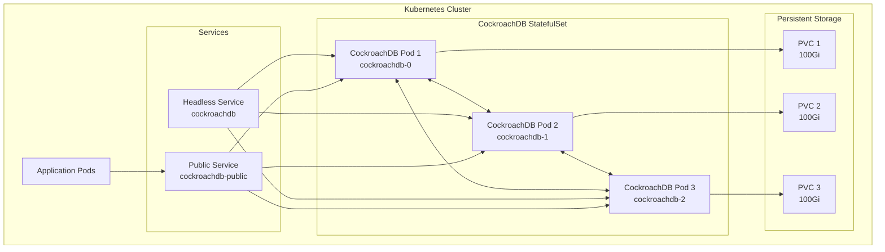
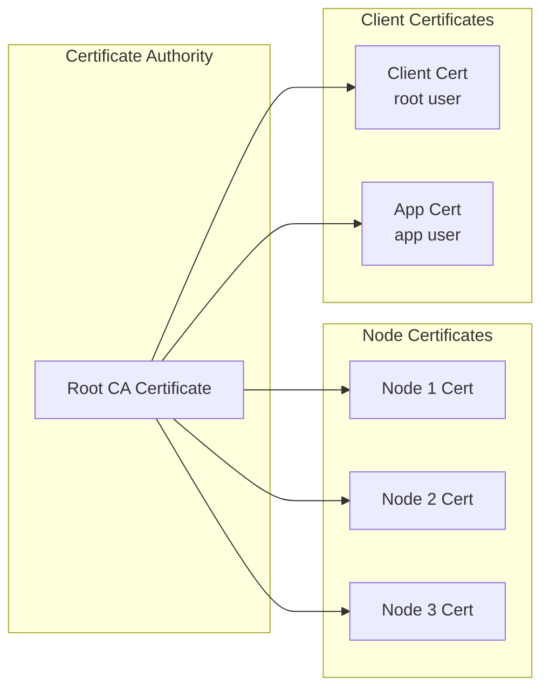
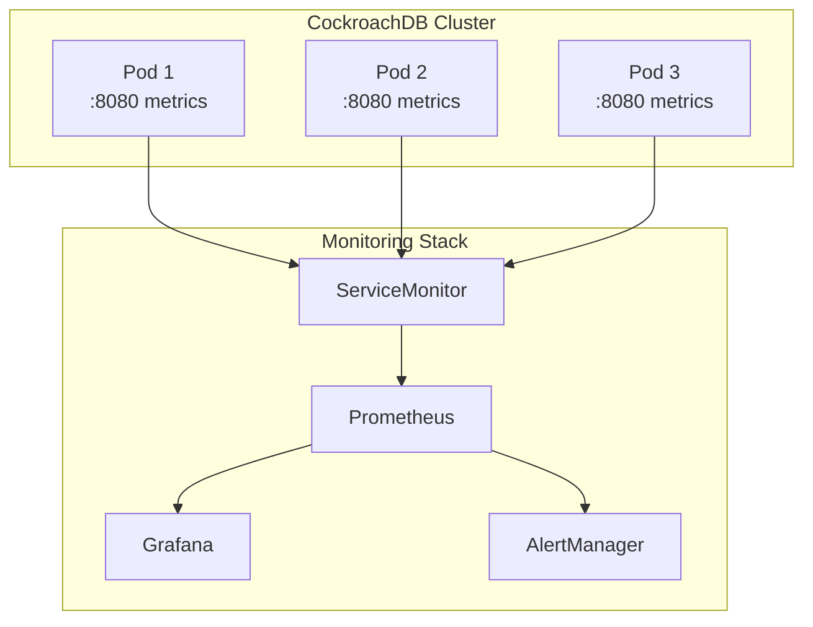
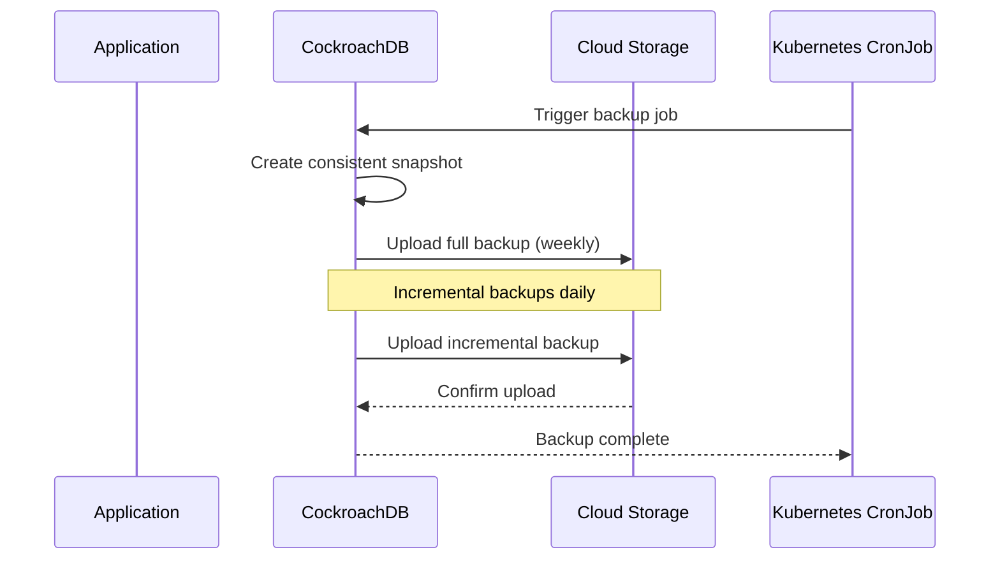

# How to Configure CockroachDB for Kubernetes

Author: [nawazdhandala](https://www.github.com/nawazdhandala)

Tags: CockroachDB, Kubernetes, Distributed Database, SQL, DevOps, StatefulSet

Description: Learn how to deploy and configure CockroachDB on Kubernetes for production-ready distributed SQL workloads.

CockroachDB is a distributed SQL database designed for cloud-native environments, making it an excellent choice for Kubernetes deployments. Its built-in replication, automatic failover, and horizontal scaling capabilities align perfectly with Kubernetes' orchestration features. In this guide, you'll learn how to deploy and configure CockroachDB on Kubernetes for production-ready workloads.

## Architecture Overview

Before diving into the configuration, let's understand how CockroachDB operates within a Kubernetes cluster.



## Prerequisites

Ensure you have the following before proceeding:

- A running Kubernetes cluster (version 1.25 or later)
- kubectl configured to communicate with your cluster
- Helm 3.x installed
- At least 3 nodes for high availability
- Storage class that supports dynamic provisioning

## Method 1: Deploy Using the CockroachDB Operator

The CockroachDB Kubernetes Operator simplifies deployment and management of CockroachDB clusters.

### Step 1: Install the CockroachDB Operator

The following command installs the CockroachDB Operator using kubectl. The operator manages the lifecycle of CockroachDB clusters.

```bash
# Apply the CockroachDB Operator CRDs and deployment
kubectl apply -f https://raw.githubusercontent.com/cockroachdb/cockroach-operator/v2.14.0/install/crds.yaml
kubectl apply -f https://raw.githubusercontent.com/cockroachdb/cockroach-operator/v2.14.0/install/operator.yaml

# Verify the operator is running
kubectl get pods -n cockroach-operator-system
```

### Step 2: Create the CockroachDB Cluster Resource

Save the following configuration as `cockroachdb-cluster.yaml`. The spec defines a 3-node cluster with 100Gi storage per node and resource limits appropriate for production workloads.

```yaml
# cockroachdb-cluster.yaml
# Defines a CockroachDB cluster with 3 nodes for high availability
apiVersion: crdb.cockroachlabs.com/v1alpha1
kind: CrdbCluster
metadata:
  name: cockroachdb
  namespace: cockroachdb
spec:
  # Number of CockroachDB nodes - minimum 3 for production
  nodes: 3

  # CockroachDB version to deploy
  cockroachDBVersion: v23.2.0

  # Enable TLS for secure communication between nodes
  tlsEnabled: true

  # Resource allocation per pod
  resources:
    requests:
      cpu: "2"
      memory: "8Gi"
    limits:
      cpu: "4"
      memory: "16Gi"

  # Storage configuration using dynamic provisioning
  dataStore:
    pvc:
      spec:
        accessModes:
          - ReadWriteOnce
        resources:
          requests:
            storage: 100Gi
        # Replace with your storage class name
        storageClassName: standard

  # Topology spread for high availability across zones
  topologySpreadConstraints:
    - maxSkew: 1
      topologyKey: topology.kubernetes.io/zone
      whenUnsatisfiable: DoNotSchedule
      labelSelector:
        matchLabels:
          app.kubernetes.io/instance: cockroachdb
```

### Step 3: Apply the Cluster Configuration

Apply the namespace and cluster configuration to create the CockroachDB deployment.

```bash
# Create the namespace for CockroachDB
kubectl create namespace cockroachdb

# Apply the cluster configuration
kubectl apply -f cockroachdb-cluster.yaml

# Watch the pods come up (takes 2-5 minutes)
kubectl get pods -n cockroachdb -w
```

## Method 2: Deploy Using Helm

Helm provides a flexible way to deploy CockroachDB with customizable values.

### Step 1: Add the CockroachDB Helm Repository

Add the official CockroachDB Helm repository to access the charts.

```bash
# Add the CockroachDB Helm repository
helm repo add cockroachdb https://charts.cockroachdb.com/
helm repo update

# Search for available versions
helm search repo cockroachdb
```

### Step 2: Create Custom Values File

Create a values file with production-ready settings. Each section is documented to explain its purpose.

```yaml
# values.yaml
# Custom Helm values for CockroachDB production deployment

# StatefulSet configuration
statefulset:
  # Number of replicas - 3 minimum for production HA
  replicas: 3

  # Resource requests and limits
  resources:
    requests:
      cpu: "2"
      memory: "8Gi"
    limits:
      cpu: "4"
      memory: "16Gi"

  # Budget for pod disruptions during maintenance
  budget:
    maxUnavailable: 1

# Persistent storage configuration
storage:
  # Storage class for dynamic provisioning
  persistentVolume:
    enabled: true
    size: 100Gi
    storageClass: "standard"

# TLS configuration for secure communication
tls:
  enabled: true
  # Use cert-manager for automatic certificate management
  certs:
    provided: false
    certManager: true
    certManagerIssuer:
      kind: ClusterIssuer
      name: letsencrypt-prod

# CockroachDB configuration
conf:
  # Enable cluster-wide settings
  cluster-name: "my-cockroachdb-cluster"
  # Maximum SQL memory per node (25% of memory limit)
  max-sql-memory: "4Gi"
  # Cache size for frequently accessed data (25% of memory limit)
  cache: "4Gi"
  # Log configuration
  logtostderr: INFO

# Networking configuration
service:
  public:
    type: ClusterIP
    # External access port for SQL connections
    ports:
      sql: 26257
      http: 8080

# Pod anti-affinity for high availability
affinity:
  podAntiAffinity:
    preferredDuringSchedulingIgnoredDuringExecution:
      - weight: 100
        podAffinityTerm:
          labelSelector:
            matchLabels:
              app.kubernetes.io/name: cockroachdb
          topologyKey: kubernetes.io/hostname
```

### Step 3: Install CockroachDB with Helm

Deploy the CockroachDB cluster using Helm with the custom values file.

```bash
# Create the namespace
kubectl create namespace cockroachdb

# Install CockroachDB with custom values
helm install cockroachdb cockroachdb/cockroachdb \
  --namespace cockroachdb \
  --values values.yaml \
  --wait

# Verify the installation
kubectl get all -n cockroachdb
```

## Configure TLS Certificates

Secure communication is essential for production deployments. CockroachDB supports TLS for both inter-node and client-server communication.

### Certificate Architecture



### Generate Certificates Using cockroach cert

Use the cockroach binary to generate certificates for your cluster. Store these securely as they control access to your database.

```bash
# Create directory structure for certificates
mkdir -p certs my-safe-directory

# Generate the Certificate Authority (CA)
# The CA signs all other certificates in the cluster
cockroach cert create-ca \
  --certs-dir=certs \
  --ca-key=my-safe-directory/ca.key

# Generate node certificates for each CockroachDB pod
# Include all possible DNS names the node might be accessed by
cockroach cert create-node \
  localhost \
  127.0.0.1 \
  cockroachdb-public \
  cockroachdb-public.cockroachdb \
  cockroachdb-public.cockroachdb.svc.cluster.local \
  "*.cockroachdb" \
  "*.cockroachdb.cockroachdb" \
  "*.cockroachdb.cockroachdb.svc.cluster.local" \
  --certs-dir=certs \
  --ca-key=my-safe-directory/ca.key

# Generate client certificate for the root user
# Required for administrative access
cockroach cert create-client \
  root \
  --certs-dir=certs \
  --ca-key=my-safe-directory/ca.key
```

### Create Kubernetes Secrets for Certificates

Store the certificates as Kubernetes secrets for the pods to access.

```bash
# Create secret containing the CA certificate
kubectl create secret generic cockroachdb-ca \
  --namespace cockroachdb \
  --from-file=ca.crt=certs/ca.crt

# Create secret containing node certificates
kubectl create secret generic cockroachdb-node \
  --namespace cockroachdb \
  --from-file=ca.crt=certs/ca.crt \
  --from-file=node.crt=certs/node.crt \
  --from-file=node.key=certs/node.key

# Create secret containing client certificates for root user
kubectl create secret generic cockroachdb-client-root \
  --namespace cockroachdb \
  --from-file=ca.crt=certs/ca.crt \
  --from-file=client.root.crt=certs/client.root.crt \
  --from-file=client.root.key=certs/client.root.key
```

## Initialize the Cluster

After deploying the pods, initialize the CockroachDB cluster to enable it to accept connections.

```bash
# Run the initialization job
# Only needed once when first creating the cluster
kubectl exec -it cockroachdb-0 -n cockroachdb -- \
  /cockroach/cockroach init \
  --certs-dir=/cockroach/cockroach-certs

# Verify cluster health
kubectl exec -it cockroachdb-0 -n cockroachdb -- \
  /cockroach/cockroach node status \
  --certs-dir=/cockroach/cockroach-certs
```

## Configure Database Users and Roles

Create application-specific users with appropriate permissions instead of using the root account.

### Create Application User

Connect to the SQL shell and create users with role-based access control.

```bash
# Connect to the SQL shell as root
kubectl exec -it cockroachdb-0 -n cockroachdb -- \
  /cockroach/cockroach sql \
  --certs-dir=/cockroach/cockroach-certs
```

Execute the following SQL commands to set up users and databases.

```sql
-- Create a database for your application
-- Using IF NOT EXISTS prevents errors on re-runs
CREATE DATABASE IF NOT EXISTS myapp;

-- Create an application user with a secure password
-- Store this password securely in a secrets manager
CREATE USER IF NOT EXISTS app_user WITH PASSWORD 'your-secure-password-here';

-- Grant appropriate permissions to the application user
-- Avoid granting admin privileges to application users
GRANT ALL ON DATABASE myapp TO app_user;

-- Create a read-only user for reporting or analytics
CREATE USER IF NOT EXISTS readonly_user WITH PASSWORD 'another-secure-password';
GRANT SELECT ON DATABASE myapp TO readonly_user;

-- Verify the users were created
SHOW USERS;

-- View granted privileges
SHOW GRANTS ON DATABASE myapp;
```

## Configure Connection Pooling

Connection pooling reduces overhead and improves performance for applications with many concurrent connections.

### Deploy PgBouncer for Connection Pooling

PgBouncer works with CockroachDB since CockroachDB uses the PostgreSQL wire protocol.

```yaml
# pgbouncer-deployment.yaml
# Deploys PgBouncer as a connection pooler in front of CockroachDB
apiVersion: apps/v1
kind: Deployment
metadata:
  name: pgbouncer
  namespace: cockroachdb
spec:
  replicas: 2
  selector:
    matchLabels:
      app: pgbouncer
  template:
    metadata:
      labels:
        app: pgbouncer
    spec:
      containers:
        - name: pgbouncer
          image: bitnami/pgbouncer:1.21.0
          ports:
            - containerPort: 6432
          env:
            # CockroachDB connection settings
            - name: POSTGRESQL_HOST
              value: "cockroachdb-public.cockroachdb.svc.cluster.local"
            - name: POSTGRESQL_PORT
              value: "26257"
            - name: POSTGRESQL_DATABASE
              value: "myapp"
            # Pooling configuration
            - name: PGBOUNCER_POOL_MODE
              value: "transaction"
            - name: PGBOUNCER_MAX_CLIENT_CONN
              value: "1000"
            - name: PGBOUNCER_DEFAULT_POOL_SIZE
              value: "20"
            - name: PGBOUNCER_MIN_POOL_SIZE
              value: "5"
            # Authentication - use secrets in production
            - name: PGBOUNCER_AUTH_TYPE
              value: "scram-sha-256"
          resources:
            requests:
              cpu: "100m"
              memory: "128Mi"
            limits:
              cpu: "500m"
              memory: "256Mi"
---
# Service to expose PgBouncer to applications
apiVersion: v1
kind: Service
metadata:
  name: pgbouncer
  namespace: cockroachdb
spec:
  selector:
    app: pgbouncer
  ports:
    - port: 6432
      targetPort: 6432
  type: ClusterIP
```

## Monitor CockroachDB

Observability is critical for maintaining database health in production.

### Monitoring Architecture



### Create ServiceMonitor for Prometheus

Configure Prometheus to scrape CockroachDB metrics automatically.

```yaml
# servicemonitor.yaml
# Configures Prometheus to scrape CockroachDB metrics
apiVersion: monitoring.coreos.com/v1
kind: ServiceMonitor
metadata:
  name: cockroachdb
  namespace: cockroachdb
  labels:
    release: prometheus
spec:
  selector:
    matchLabels:
      app.kubernetes.io/name: cockroachdb
  namespaceSelector:
    matchNames:
      - cockroachdb
  endpoints:
    - port: http
      path: /_status/vars
      interval: 30s
      # Relabel configurations for better metric organization
      relabelings:
        - sourceLabels: [__meta_kubernetes_pod_name]
          targetLabel: pod
        - sourceLabels: [__meta_kubernetes_namespace]
          targetLabel: namespace
```

### Configure Alerting Rules

Set up alerts for critical CockroachDB conditions.

```yaml
# alerting-rules.yaml
# PrometheusRule for CockroachDB alerting
apiVersion: monitoring.coreos.com/v1
kind: PrometheusRule
metadata:
  name: cockroachdb-alerts
  namespace: cockroachdb
spec:
  groups:
    - name: cockroachdb.rules
      rules:
        # Alert when a node is down
        - alert: CockroachDBNodeDown
          expr: up{job="cockroachdb"} == 0
          for: 5m
          labels:
            severity: critical
          annotations:
            summary: "CockroachDB node is down"
            description: "CockroachDB node {{ $labels.instance }} has been down for more than 5 minutes."

        # Alert on high storage usage
        - alert: CockroachDBStorageWarning
          expr: (capacity_used{job="cockroachdb"} / capacity{job="cockroachdb"}) > 0.8
          for: 10m
          labels:
            severity: warning
          annotations:
            summary: "CockroachDB storage usage high"
            description: "Storage usage on {{ $labels.instance }} is above 80%."

        # Alert on replication lag
        - alert: CockroachDBReplicationLag
          expr: replicas_quiescent{job="cockroachdb"} < replicas{job="cockroachdb"}
          for: 15m
          labels:
            severity: warning
          annotations:
            summary: "CockroachDB replication lag detected"
            description: "Replication lag detected on {{ $labels.instance }}."

        # Alert on high query latency
        - alert: CockroachDBHighLatency
          expr: histogram_quantile(0.99, rate(sql_exec_latency_bucket{job="cockroachdb"}[5m])) > 1
          for: 10m
          labels:
            severity: warning
          annotations:
            summary: "CockroachDB query latency high"
            description: "99th percentile query latency is above 1 second."
```

## Configure Backup and Recovery

Regular backups are essential for data protection. CockroachDB supports incremental backups to cloud storage.

### Backup Flow



### Create Backup CronJob

Schedule automated backups using a Kubernetes CronJob.

```yaml
# backup-cronjob.yaml
# Automated daily backup job for CockroachDB
apiVersion: batch/v1
kind: CronJob
metadata:
  name: cockroachdb-backup
  namespace: cockroachdb
spec:
  # Run daily at 2 AM UTC
  schedule: "0 2 * * *"
  concurrencyPolicy: Forbid
  successfulJobsHistoryLimit: 3
  failedJobsHistoryLimit: 3
  jobTemplate:
    spec:
      template:
        spec:
          restartPolicy: OnFailure
          containers:
            - name: backup
              image: cockroachdb/cockroach:v23.2.0
              command:
                - /bin/bash
                - -c
                - |
                  # Perform incremental backup to S3
                  # Full backups are taken weekly, incrementals daily
                  /cockroach/cockroach sql \
                    --certs-dir=/cockroach/cockroach-certs \
                    --host=cockroachdb-public \
                    --execute="BACKUP INTO LATEST IN 's3://my-backup-bucket/cockroachdb?AUTH=implicit' AS OF SYSTEM TIME '-10s';"
              volumeMounts:
                - name: client-certs
                  mountPath: /cockroach/cockroach-certs
                  readOnly: true
              env:
                # AWS credentials for S3 access
                - name: AWS_REGION
                  value: "us-east-1"
              resources:
                requests:
                  cpu: "100m"
                  memory: "256Mi"
                limits:
                  cpu: "500m"
                  memory: "512Mi"
          volumes:
            - name: client-certs
              secret:
                secretName: cockroachdb-client-root
                defaultMode: 0400
```

### Restore from Backup

Execute a restore operation when needed. Always test restores in a non-production environment first.

```bash
# Connect to SQL shell
kubectl exec -it cockroachdb-0 -n cockroachdb -- \
  /cockroach/cockroach sql \
  --certs-dir=/cockroach/cockroach-certs

# View available backups
SHOW BACKUPS IN 's3://my-backup-bucket/cockroachdb?AUTH=implicit';

# Restore a specific database from the latest backup
# Warning: this will overwrite existing data
RESTORE DATABASE myapp FROM LATEST IN 's3://my-backup-bucket/cockroachdb?AUTH=implicit';

# Restore to a specific point in time
RESTORE DATABASE myapp FROM LATEST IN 's3://my-backup-bucket/cockroachdb?AUTH=implicit'
  AS OF SYSTEM TIME '2024-01-15 10:00:00';
```

## Configure Network Policies

Restrict network access to CockroachDB pods for enhanced security.

```yaml
# network-policy.yaml
# Restricts network access to CockroachDB pods
apiVersion: networking.k8s.io/v1
kind: NetworkPolicy
metadata:
  name: cockroachdb-network-policy
  namespace: cockroachdb
spec:
  podSelector:
    matchLabels:
      app.kubernetes.io/name: cockroachdb
  policyTypes:
    - Ingress
    - Egress
  ingress:
    # Allow inter-node communication for replication
    - from:
        - podSelector:
            matchLabels:
              app.kubernetes.io/name: cockroachdb
      ports:
        - port: 26257
          protocol: TCP
    # Allow SQL connections from application namespace
    - from:
        - namespaceSelector:
            matchLabels:
              name: application
      ports:
        - port: 26257
          protocol: TCP
    # Allow admin UI access from monitoring namespace
    - from:
        - namespaceSelector:
            matchLabels:
              name: monitoring
      ports:
        - port: 8080
          protocol: TCP
  egress:
    # Allow inter-node communication
    - to:
        - podSelector:
            matchLabels:
              app.kubernetes.io/name: cockroachdb
      ports:
        - port: 26257
          protocol: TCP
    # Allow DNS resolution
    - to:
        - namespaceSelector: {}
          podSelector:
            matchLabels:
              k8s-app: kube-dns
      ports:
        - port: 53
          protocol: UDP
```

## Scale the Cluster

CockroachDB supports online scaling without downtime. The cluster automatically rebalances data when nodes are added or removed.

### Scale Up

Add more nodes to increase capacity and performance.

```bash
# Using the Operator - update the CrdbCluster resource
kubectl patch crdbcluster cockroachdb -n cockroachdb \
  --type='json' \
  -p='[{"op": "replace", "path": "/spec/nodes", "value": 5}]'

# Using Helm - update replica count
helm upgrade cockroachdb cockroachdb/cockroachdb \
  --namespace cockroachdb \
  --set statefulset.replicas=5 \
  --reuse-values

# Monitor the scaling operation
kubectl get pods -n cockroachdb -w

# Check rebalancing progress in SQL shell
SHOW RANGES FROM DATABASE myapp;
```

### Scale Down

Remove nodes carefully to avoid data loss. CockroachDB will migrate data before the node is removed.

```bash
# Decommission a node before removing it
# Get the node ID first
kubectl exec -it cockroachdb-0 -n cockroachdb -- \
  /cockroach/cockroach node status \
  --certs-dir=/cockroach/cockroach-certs

# Decommission the node (replace 5 with actual node ID)
kubectl exec -it cockroachdb-0 -n cockroachdb -- \
  /cockroach/cockroach node decommission 5 \
  --certs-dir=/cockroach/cockroach-certs

# Wait for decommissioning to complete, then scale down
kubectl patch crdbcluster cockroachdb -n cockroachdb \
  --type='json' \
  -p='[{"op": "replace", "path": "/spec/nodes", "value": 3}]'
```

## Performance Tuning

Optimize CockroachDB for your specific workload patterns.

### Configure SQL Settings

Apply performance-related SQL settings based on your workload characteristics.

```sql
-- Increase parallelism for analytical queries
-- Default is based on CPU count, increase for analytics workloads
SET CLUSTER SETTING sql.defaults.distsql_workmem = '64MiB';

-- Configure statement timeout to prevent runaway queries
SET CLUSTER SETTING sql.defaults.statement_timeout = '300s';

-- Enable automatic statistics collection for query optimization
SET CLUSTER SETTING sql.stats.automatic_collection.enabled = true;

-- Configure garbage collection for time-series data
-- Reduce for faster cleanup, increase for longer history
SET CLUSTER SETTING kv.gc.ttlseconds = 86400;

-- Optimize for OLTP workloads
SET CLUSTER SETTING kv.range_merge.queue_enabled = true;
SET CLUSTER SETTING kv.range_split.by_load.enabled = true;

-- View current settings
SHOW ALL CLUSTER SETTINGS;
```

## Troubleshooting

Common issues and their solutions when running CockroachDB on Kubernetes.

### Check Cluster Health

Verify the cluster is operating correctly with these diagnostic commands.

```bash
# Check pod status and events
kubectl get pods -n cockroachdb -o wide
kubectl describe pods -n cockroachdb

# View CockroachDB logs
kubectl logs cockroachdb-0 -n cockroachdb --tail=100

# Check node status from SQL
kubectl exec -it cockroachdb-0 -n cockroachdb -- \
  /cockroach/cockroach node status \
  --certs-dir=/cockroach/cockroach-certs

# Check for under-replicated ranges
kubectl exec -it cockroachdb-0 -n cockroachdb -- \
  /cockroach/cockroach sql \
  --certs-dir=/cockroach/cockroach-certs \
  --execute="SELECT * FROM crdb_internal.ranges WHERE array_length(replicas, 1) < 3;"
```

### Access the Admin UI

The CockroachDB Admin UI provides visual cluster monitoring and management.

```bash
# Port-forward to access the Admin UI locally
kubectl port-forward svc/cockroachdb-public -n cockroachdb 8080:8080

# Access in browser at https://localhost:8080
# Login with the root user credentials
```

### Debug Network Issues

Diagnose connectivity problems between pods and services.

```bash
# Test DNS resolution
kubectl run -it --rm debug --image=busybox -n cockroachdb -- \
  nslookup cockroachdb-public.cockroachdb.svc.cluster.local

# Test connectivity between pods
kubectl exec -it cockroachdb-0 -n cockroachdb -- \
  /cockroach/cockroach node status \
  --certs-dir=/cockroach/cockroach-certs \
  --host=cockroachdb-1.cockroachdb.cockroachdb.svc.cluster.local
```

## Summary

Deploying CockroachDB on Kubernetes combines the resilience of a distributed SQL database with the orchestration capabilities of Kubernetes. Key takeaways from this guide include:

1. **Choose Your Deployment Method**: Use the CockroachDB Operator for simplified management or Helm for flexibility
2. **Secure Your Cluster**: Enable TLS for all communications and create role-based users
3. **Plan for Persistence**: Configure appropriate storage classes and PVC sizes
4. **Monitor Proactively**: Set up Prometheus metrics and alerting rules
5. **Automate Backups**: Schedule regular backups to cloud storage
6. **Scale Thoughtfully**: Decommission nodes properly before scaling down

Following these practices ensures a production-ready CockroachDB deployment that leverages the full potential of both CockroachDB's distributed architecture and Kubernetes' container orchestration.
