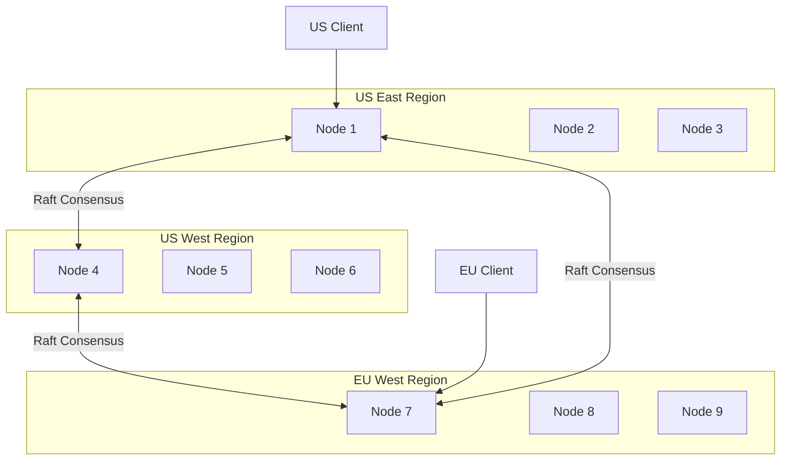
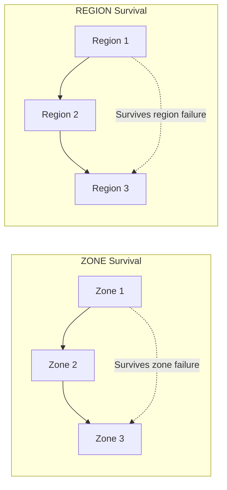
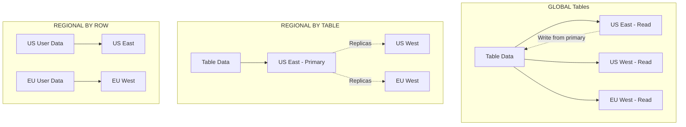
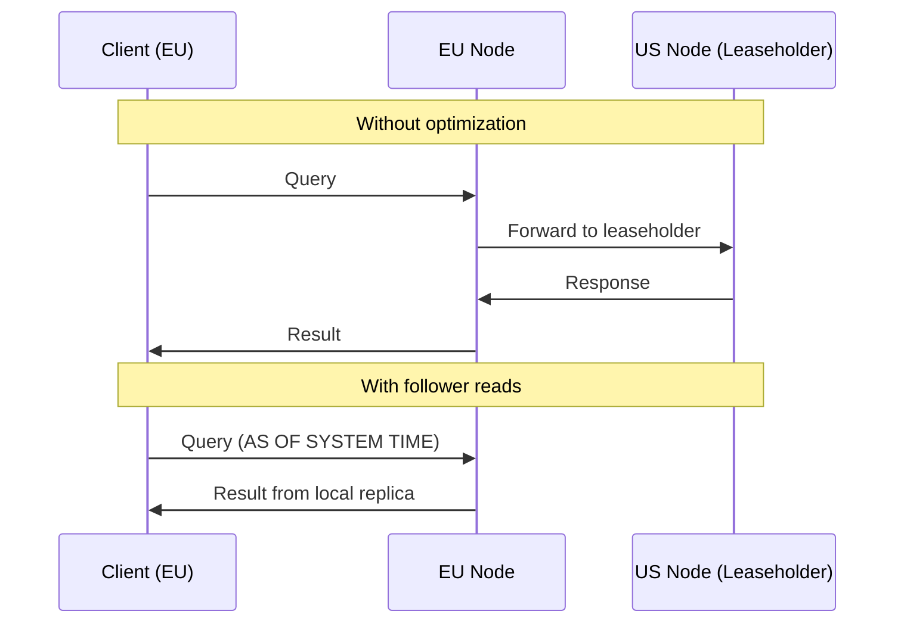

# How to Handle Multi-Region Deployments in CockroachDB

Author: [nawazdhandala](https://www.github.com/nawazdhandala)

Tags: CockroachDB, Multi-Region, Distributed Database, High Availability, PostgreSQL, Database

Description: Learn how to configure and optimize multi-region deployments in CockroachDB for global applications. Covers topology patterns, survival goals, table localities, and performance tuning strategies.

---

CockroachDB was built from the ground up for multi-region deployments. Unlike traditional databases that bolt on replication as an afterthought, CockroachDB treats geographic distribution as a first-class feature, giving you fine-grained control over data placement, latency optimization, and survival guarantees.

## Understanding Multi-Region Architecture

CockroachDB distributes data across regions using a concept called ranges. Each range is a contiguous chunk of key-value data that gets replicated across nodes. In a multi-region setup, you control where these replicas live.



### Key Concepts

| Concept | Description |
|---------|-------------|
| Region | A geographic area containing one or more zones |
| Zone | A failure domain within a region (availability zone) |
| Locality | Labels that describe where a node is located |
| Leaseholder | The node that coordinates reads and writes for a range |

## Setting Up a Multi-Region Cluster

### Node Configuration with Localities

When starting CockroachDB nodes, specify locality information to help the database make intelligent placement decisions.

```bash
# Start a node in US East region, zone us-east-1a
cockroach start \
  --insecure \
  --advertise-addr=node1.us-east.example.com \
  --join=node1.us-east.example.com,node4.us-west.example.com,node7.eu-west.example.com \
  --locality=region=us-east,zone=us-east-1a \
  --store=path=/mnt/cockroach-data

# Start a node in US West region, zone us-west-2a
cockroach start \
  --insecure \
  --advertise-addr=node4.us-west.example.com \
  --join=node1.us-east.example.com,node4.us-west.example.com,node7.eu-west.example.com \
  --locality=region=us-west,zone=us-west-2a \
  --store=path=/mnt/cockroach-data

# Start a node in EU West region, zone eu-west-1a
cockroach start \
  --insecure \
  --advertise-addr=node7.eu-west.example.com \
  --join=node1.us-east.example.com,node4.us-west.example.com,node7.eu-west.example.com \
  --locality=region=eu-west,zone=eu-west-1a \
  --store=path=/mnt/cockroach-data
```

### Enabling Multi-Region on Your Database

After your cluster is running across multiple regions, enable multi-region features on your database.

```sql
-- Add regions to your database
ALTER DATABASE myapp PRIMARY REGION "us-east";
ALTER DATABASE myapp ADD REGION "us-west";
ALTER DATABASE myapp ADD REGION "eu-west";

-- Verify region configuration
SHOW REGIONS FROM DATABASE myapp;
```

## Survival Goals

CockroachDB offers two survival goals that determine how your database handles failures.



### Zone Survival (Default)

Zone survival ensures your database remains available if any single availability zone fails.

```sql
-- Set zone survival (default, requires 3+ zones per region)
ALTER DATABASE myapp SURVIVE ZONE FAILURE;
```

### Region Survival

Region survival provides the highest level of durability, keeping your database available even if an entire region goes offline.

```sql
-- Set region survival (requires 3+ regions)
ALTER DATABASE myapp SURVIVE REGION FAILURE;

-- Check current survival goal
SHOW SURVIVAL GOAL FROM DATABASE myapp;
```

## Table Locality Patterns

CockroachDB provides three table locality options to optimize for different access patterns.



### Global Tables

Global tables are optimized for read-heavy, rarely-updated data like configuration or reference tables.

```sql
-- Create a global table for configuration data
CREATE TABLE app_config (
    key STRING PRIMARY KEY,
    value JSONB,
    updated_at TIMESTAMPTZ DEFAULT now()
) LOCALITY GLOBAL;

-- Reads are fast from any region
-- Writes require coordination across all regions
```

### Regional by Table

Regional tables pin all data to a specific region, ideal for data with a clear geographic affinity.

```sql
-- Create a regional table pinned to US East
CREATE TABLE us_orders (
    id UUID PRIMARY KEY DEFAULT gen_random_uuid(),
    customer_id UUID,
    total DECIMAL(10,2),
    created_at TIMESTAMPTZ DEFAULT now()
) LOCALITY REGIONAL BY TABLE IN "us-east";

-- All reads and writes are fast when accessing from US East
```

### Regional by Row

Regional by row tables store each row in its home region based on a column value - perfect for multi-tenant applications.

```sql
-- Create a table with row-level regional locality
CREATE TABLE user_profiles (
    id UUID PRIMARY KEY DEFAULT gen_random_uuid(),
    email STRING UNIQUE,
    name STRING,
    region crdb_internal_region NOT NULL DEFAULT 'us-east',
    created_at TIMESTAMPTZ DEFAULT now()
) LOCALITY REGIONAL BY ROW;

-- The hidden crdb_region column determines where each row lives
-- Insert data with explicit region
INSERT INTO user_profiles (email, name, region)
VALUES ('user@example.com', 'John Doe', 'eu-west');
```

## Optimizing Query Performance

### Understanding Latency

Cross-region queries incur network latency. Use these strategies to minimize round trips.



### Follower Reads

Enable follower reads to serve slightly stale data from the nearest replica.

```sql
-- Enable follower reads for a session
SET default_transaction_use_follower_reads = on;

-- Or use AS OF SYSTEM TIME for specific queries
SELECT * FROM user_profiles
AS OF SYSTEM TIME follower_read_timestamp()
WHERE region = 'eu-west';

-- Bounded staleness reads (within 10 seconds)
SELECT * FROM user_profiles
AS OF SYSTEM TIME with_max_staleness('10s')
WHERE id = 'abc123';
```

### Query Tuning for Multi-Region

Filter queries by region to ensure they execute locally.

```sql
-- Always include region in queries for REGIONAL BY ROW tables
-- Good: Fast local query
SELECT * FROM user_profiles
WHERE region = 'us-east' AND email LIKE '%@company.com';

-- Bad: Full table scan across all regions
SELECT * FROM user_profiles
WHERE email LIKE '%@company.com';

-- Create partial indexes for region-specific queries
CREATE INDEX idx_us_users_email ON user_profiles (email)
WHERE region = 'us-east';
```

## Monitoring Multi-Region Health

### Key Metrics to Track

Monitor these metrics to ensure your multi-region deployment is healthy.

```sql
-- Check range distribution across regions
SELECT
    locality,
    count(*) as range_count
FROM crdb_internal.ranges_no_leases
GROUP BY locality;

-- Monitor replication lag
SELECT
    node_id,
    locality,
    round(extract(epoch from (now() - last_up_at)))::int as seconds_behind
FROM crdb_internal.gossip_nodes;

-- Identify hot ranges
SELECT
    range_id,
    start_pretty,
    end_pretty,
    qps
FROM crdb_internal.ranges
ORDER BY qps DESC
LIMIT 10;
```

### Prometheus Metrics

Configure Prometheus to scrape CockroachDB metrics for comprehensive monitoring.

```yaml
# prometheus.yml
scrape_configs:
  - job_name: 'cockroachdb'
    metrics_path: '/_status/vars'
    scheme: 'http'
    static_configs:
      - targets:
          - 'node1.us-east.example.com:8080'
          - 'node4.us-west.example.com:8080'
          - 'node7.eu-west.example.com:8080'
    relabel_configs:
      - source_labels: [__address__]
        regex: '(.+)\.(.+)\.example\.com:8080'
        target_label: region
        replacement: '${2}'
```

### Alerting Rules

Set up alerts for common multi-region issues.

```yaml
# alerting_rules.yml
groups:
  - name: cockroachdb_multi_region
    rules:
      - alert: ReplicationLagHigh
        expr: replication_lag_seconds > 30
        for: 5m
        labels:
          severity: warning
        annotations:
          summary: "High replication lag detected"

      - alert: RegionUnavailable
        expr: count(up{job="cockroachdb"}) by (region) < 2
        for: 1m
        labels:
          severity: critical
        annotations:
          summary: "Region {{ $labels.region }} has fewer than 2 healthy nodes"

      - alert: CrossRegionLatencyHigh
        expr: histogram_quantile(0.99, rate(sql_service_latency_bucket[5m])) > 500
        for: 10m
        labels:
          severity: warning
        annotations:
          summary: "P99 query latency exceeds 500ms"
```

## Connection Management

### Region-Aware Connection Strings

Configure your application to connect to the nearest region.

```javascript
// Node.js example with pg-pool and region-aware routing
const { Pool } = require('pg');

const pools = {
  'us-east': new Pool({
    host: 'cockroach.us-east.example.com',
    port: 26257,
    database: 'myapp',
    max: 20,
  }),
  'us-west': new Pool({
    host: 'cockroach.us-west.example.com',
    port: 26257,
    database: 'myapp',
    max: 20,
  }),
  'eu-west': new Pool({
    host: 'cockroach.eu-west.example.com',
    port: 26257,
    database: 'myapp',
    max: 20,
  }),
};

// Get pool based on user's region
function getPool(userRegion) {
  return pools[userRegion] || pools['us-east'];
}

// Use in application code
async function getUserProfile(userId, userRegion) {
  const pool = getPool(userRegion);
  const result = await pool.query(
    'SELECT * FROM user_profiles WHERE id = $1 AND region = $2',
    [userId, userRegion]
  );
  return result.rows[0];
}
```

### Load Balancer Configuration

Configure HAProxy to route traffic to the nearest healthy region.

```haproxy
# haproxy.cfg
global
    maxconn 4096

defaults
    mode tcp
    timeout connect 10s
    timeout client 30s
    timeout server 30s

frontend cockroach_front
    bind *:26257
    default_backend cockroach_nodes

backend cockroach_nodes
    balance roundrobin
    option httpchk GET /health?ready=1

    # US East nodes - prefer for US East clients
    server node1 node1.us-east.example.com:26257 check port 8080
    server node2 node2.us-east.example.com:26257 check port 8080
    server node3 node3.us-east.example.com:26257 check port 8080

    # US West nodes - backup for US East
    server node4 node4.us-west.example.com:26257 check port 8080 backup
    server node5 node5.us-west.example.com:26257 check port 8080 backup

    # EU West nodes - backup for both US regions
    server node7 node7.eu-west.example.com:26257 check port 8080 backup
    server node8 node8.eu-west.example.com:26257 check port 8080 backup
```

## Schema Migration Strategies

### Rolling Schema Changes

CockroachDB handles schema changes online, but multi-region deployments require extra consideration.

```sql
-- Add columns with defaults - fast, no rewrite
ALTER TABLE user_profiles ADD COLUMN preferences JSONB DEFAULT '{}';

-- Create indexes concurrently
CREATE INDEX CONCURRENTLY idx_profiles_created
ON user_profiles (created_at);

-- Check schema change progress
SELECT
    job_id,
    description,
    status,
    fraction_completed
FROM crdb_internal.jobs
WHERE job_type = 'SCHEMA CHANGE'
ORDER BY created DESC
LIMIT 5;
```

### Changing Table Locality

Modify table locality settings as your access patterns evolve.

```sql
-- Convert a regional table to regional by row
ALTER TABLE orders SET LOCALITY REGIONAL BY ROW;

-- Pin a regional by row table to a specific region
ALTER TABLE legacy_data SET LOCALITY REGIONAL BY TABLE IN "us-east";

-- Monitor the transition progress
SHOW JOBS;
```

## Disaster Recovery

### Backup Strategy

Configure automated backups with geographic redundancy.

```sql
-- Create a scheduled backup to cloud storage
CREATE SCHEDULE daily_backup
FOR BACKUP INTO 's3://my-bucket/backups?AUTH=implicit'
WITH revision_history
RECURRING '@daily'
FULL BACKUP '@weekly';

-- Incremental backups between full backups save storage and time
-- Restore with point-in-time recovery
RESTORE DATABASE myapp
FROM LATEST IN 's3://my-bucket/backups?AUTH=implicit'
AS OF SYSTEM TIME '2024-01-15 10:30:00';
```

### Failover Testing

Regularly test your failover procedures to ensure region survival works as expected.

```sql
-- Simulate region failure by draining nodes
-- Run from a node NOT in the region being tested
ALTER RANGE default CONFIGURE ZONE USING
    constraints = '{"+region=us-east": 1, "+region=us-west": 1, "+region=eu-west": 1}',
    lease_preferences = '[[+region=us-west]]';

-- Verify the cluster remains operational
SELECT count(*) FROM user_profiles;

-- Restore normal operation
ALTER RANGE default CONFIGURE ZONE USING
    constraints = '{"+region=us-east": 1, "+region=us-west": 1, "+region=eu-west": 1}',
    lease_preferences = '[[+region=us-east]]';
```

## Best Practices Summary

1. **Start with ZONE survival** - Region survival adds latency to every write
2. **Use REGIONAL BY ROW for user data** - Keep data close to users
3. **Use GLOBAL for reference data** - Optimize reads for slowly-changing data
4. **Always filter by region** - Avoid cross-region scans in queries
5. **Enable follower reads** - Accept slight staleness for read-heavy workloads
6. **Monitor replication lag** - Alert before users notice
7. **Test failovers regularly** - Verify your survival goals actually work
8. **Use connection pooling** - Reduce connection overhead across regions

---

Multi-region deployments in CockroachDB provide a powerful foundation for globally distributed applications. By understanding locality patterns, survival goals, and query optimization techniques, you can build systems that serve users worldwide with low latency while maintaining strong consistency guarantees. Start with a simple regional setup and evolve your topology as your application's needs grow.
