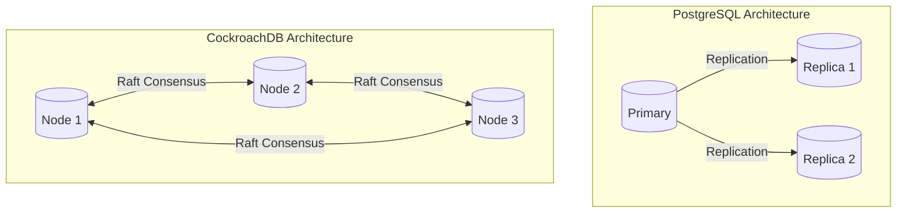
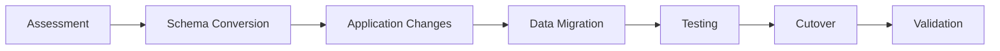
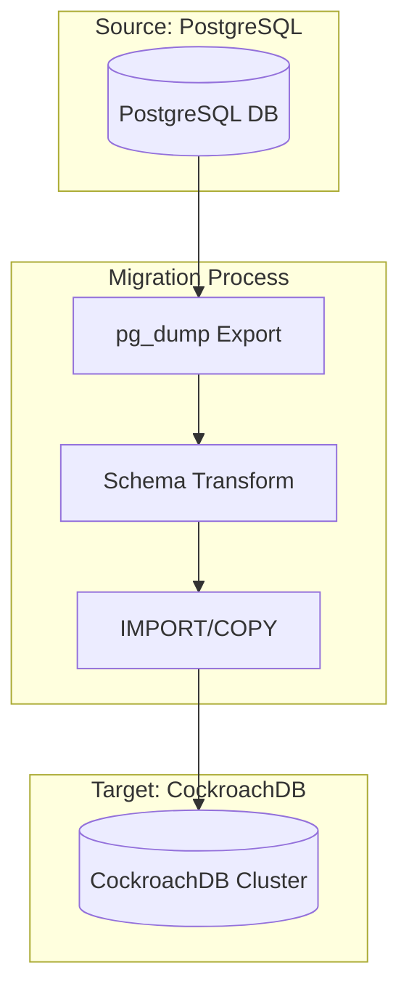
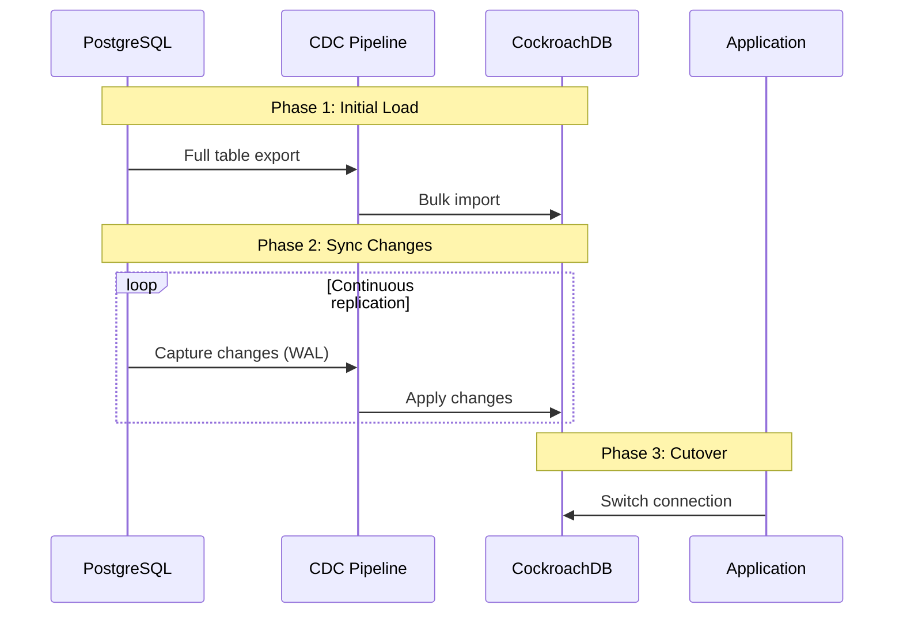
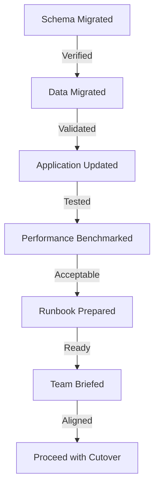

# How to Migrate from PostgreSQL to CockroachDB

Author: [nawazdhandala](https://www.github.com/nawazdhandala)

Tags: PostgreSQL, CockroachDB, Database Migration, Distributed Database, SQL, DevOps

Description: A comprehensive guide to migrating from PostgreSQL to CockroachDB, covering schema conversion, data migration strategies, application compatibility changes, and best practices for a successful transition.

---

Moving from PostgreSQL to CockroachDB offers significant advantages for distributed systems, including automatic sharding, built-in high availability, and geo-distributed deployments. CockroachDB speaks the PostgreSQL wire protocol, making migration straightforward, but several considerations require attention for a smooth transition.

## Understanding the Architecture Differences



PostgreSQL uses a primary-replica model where writes go to one server and replicate to read replicas. CockroachDB distributes data across all nodes, with each node capable of handling reads and writes for the data ranges it owns.

## Migration Overview



## Step 1: Assessment and Planning

### Evaluate PostgreSQL Features in Use

Before starting migration, inventory the PostgreSQL-specific features your application uses. CockroachDB supports most PostgreSQL syntax but has some differences.

```sql
-- Check for unsupported features: stored procedures with complex PL/pgSQL
SELECT proname, prokind
FROM pg_proc
WHERE prokind = 'p'
AND pronamespace = (SELECT oid FROM pg_namespace WHERE nspname = 'public');

-- List all triggers in the database
SELECT trigger_name, event_object_table, action_statement
FROM information_schema.triggers
WHERE trigger_schema = 'public';

-- Find tables using inheritance, which CockroachDB does not support
SELECT c.relname AS child, p.relname AS parent
FROM pg_inherits
JOIN pg_class AS c ON (inhrelid = c.oid)
JOIN pg_class AS p ON (inhparent = p.oid);

-- Check for unsupported data types
SELECT column_name, data_type, table_name
FROM information_schema.columns
WHERE table_schema = 'public'
AND data_type IN ('xml', 'money', 'bit varying', 'tsquery', 'tsvector');
```

### CockroachDB Feature Compatibility Matrix

| Feature | PostgreSQL | CockroachDB | Notes |
|---------|------------|-------------|-------|
| JSON/JSONB | Yes | Yes | Full support |
| Arrays | Yes | Yes | Full support |
| CTEs | Yes | Yes | Full support |
| Window Functions | Yes | Yes | Full support |
| Stored Procedures | Yes | Limited | Use UDFs instead |
| Triggers | Yes | No | Implement in application |
| Table Inheritance | Yes | No | Use partitioning |
| Full-text Search | Yes | Limited | Consider external service |
| XML Type | Yes | No | Use JSONB |

## Step 2: Schema Conversion

### Export PostgreSQL Schema

Extract your existing schema using pg_dump, then modify it for CockroachDB compatibility.

```bash
# Export schema only from PostgreSQL
pg_dump --schema-only \
    --no-owner \
    --no-privileges \
    --no-tablespaces \
    -h localhost \
    -U postgres \
    -d myapp \
    > schema.sql
```

### Convert Data Types

Several PostgreSQL types need conversion for CockroachDB compatibility.

```sql
-- PostgreSQL SERIAL becomes CockroachDB INT with DEFAULT
-- Before (PostgreSQL)
CREATE TABLE users (
    id SERIAL PRIMARY KEY,
    email VARCHAR(255) NOT NULL
);

-- After (CockroachDB) - using unique_rowid() for distributed-safe IDs
CREATE TABLE users (
    id INT8 DEFAULT unique_rowid() PRIMARY KEY,
    email VARCHAR(255) NOT NULL
);

-- Alternative: Use UUID for better distribution
CREATE TABLE users (
    id UUID DEFAULT gen_random_uuid() PRIMARY KEY,
    email VARCHAR(255) NOT NULL
);
```

### Handle Sequences

CockroachDB supports sequences but unique_rowid() or UUIDs are preferred for distributed environments.

```sql
-- If you must use sequences, create them explicitly
CREATE SEQUENCE user_id_seq;

CREATE TABLE users (
    id INT8 DEFAULT nextval('user_id_seq') PRIMARY KEY,
    email VARCHAR(255) NOT NULL
);

-- Better approach: Use UUID primary keys for global uniqueness
CREATE TABLE orders (
    id UUID DEFAULT gen_random_uuid() PRIMARY KEY,
    user_id UUID NOT NULL,
    total_amount DECIMAL(10, 2),
    created_at TIMESTAMPTZ DEFAULT now()
);
```

### Convert Indexes

CockroachDB handles indexes differently, especially for primary keys which are automatically distributed.

```sql
-- PostgreSQL B-tree indexes work the same way
CREATE INDEX idx_users_email ON users(email);

-- Hash indexes in PostgreSQL should become regular indexes
-- PostgreSQL hash index (not recommended to migrate)
-- CREATE INDEX idx_users_hash ON users USING hash(email);
-- CockroachDB equivalent - just use B-tree
CREATE INDEX idx_users_email ON users(email);

-- GIN indexes for JSONB work similarly
CREATE INDEX idx_orders_metadata ON orders USING GIN(metadata);

-- Partial indexes are supported
CREATE INDEX idx_active_users ON users(email) WHERE active = true;

-- Covering indexes for index-only scans
CREATE INDEX idx_users_email_covering ON users(email) STORING (name, created_at);
```

### Convert Constraints

Foreign key and check constraints work similarly but have subtle differences.

```sql
-- Foreign keys with cascading deletes
CREATE TABLE orders (
    id UUID DEFAULT gen_random_uuid() PRIMARY KEY,
    user_id UUID NOT NULL REFERENCES users(id) ON DELETE CASCADE,
    status VARCHAR(50) DEFAULT 'pending',
    created_at TIMESTAMPTZ DEFAULT now()
);

-- Check constraints
ALTER TABLE orders ADD CONSTRAINT check_status
    CHECK (status IN ('pending', 'processing', 'shipped', 'delivered', 'cancelled'));

-- Unique constraints
ALTER TABLE users ADD CONSTRAINT unique_email UNIQUE (email);
```

## Step 3: Application Code Changes

### Update Connection Strings

CockroachDB uses the PostgreSQL wire protocol, so connection strings are similar.

```python
# Python with psycopg2 - PostgreSQL connection
import psycopg2

# PostgreSQL connection
pg_conn = psycopg2.connect(
    host="localhost",
    port=5432,
    database="myapp",
    user="postgres",
    password="secret"
)

# CockroachDB connection - note the port and SSL requirement
crdb_conn = psycopg2.connect(
    host="localhost",
    port=26257,
    database="myapp",
    user="root",
    sslmode="verify-full",
    sslrootcert="certs/ca.crt",
    sslcert="certs/client.root.crt",
    sslkey="certs/client.root.key"
)
```

### Handle Transaction Retries

CockroachDB uses optimistic concurrency control, which can cause transaction retries. Wrap transactions in retry logic.

```python
# Python transaction retry wrapper for CockroachDB
import psycopg2
from psycopg2 import errors
import time
import random

def run_transaction(conn, operation, max_retries=3):
    """
    Execute a transaction with automatic retry on serialization failures.
    CockroachDB may abort transactions due to contention.
    """
    for attempt in range(max_retries):
        try:
            with conn.cursor() as cur:
                result = operation(cur)
                conn.commit()
                return result
        except errors.SerializationFailure as e:
            # Rollback and retry with exponential backoff
            conn.rollback()
            if attempt == max_retries - 1:
                raise
            sleep_time = (2 ** attempt) * 0.1 * (1 + random.random())
            time.sleep(sleep_time)
        except Exception as e:
            conn.rollback()
            raise

# Usage example
def transfer_funds(cur):
    cur.execute("UPDATE accounts SET balance = balance - 100 WHERE id = 1")
    cur.execute("UPDATE accounts SET balance = balance + 100 WHERE id = 2")
    return True

run_transaction(conn, transfer_funds)
```

### Node.js Transaction Retry Example

```javascript
// Node.js transaction retry logic using pg library
const { Pool } = require('pg');

const pool = new Pool({
  host: 'localhost',
  port: 26257,
  database: 'myapp',
  user: 'root',
  ssl: {
    rejectUnauthorized: true,
    ca: fs.readFileSync('certs/ca.crt'),
    cert: fs.readFileSync('certs/client.root.crt'),
    key: fs.readFileSync('certs/client.root.key')
  }
});

// Retry wrapper for CockroachDB transactions
async function runTransaction(client, operation, maxRetries = 3) {
  for (let attempt = 0; attempt < maxRetries; attempt++) {
    try {
      await client.query('BEGIN');
      const result = await operation(client);
      await client.query('COMMIT');
      return result;
    } catch (err) {
      await client.query('ROLLBACK');

      // Error code 40001 indicates serialization failure
      if (err.code === '40001' && attempt < maxRetries - 1) {
        const sleepTime = Math.pow(2, attempt) * 100 * (1 + Math.random());
        await new Promise(resolve => setTimeout(resolve, sleepTime));
        continue;
      }
      throw err;
    }
  }
}

// Usage example
async function transferFunds(fromId, toId, amount) {
  const client = await pool.connect();
  try {
    return await runTransaction(client, async (client) => {
      await client.query(
        'UPDATE accounts SET balance = balance - $1 WHERE id = $2',
        [amount, fromId]
      );
      await client.query(
        'UPDATE accounts SET balance = balance + $1 WHERE id = $2',
        [amount, toId]
      );
      return { success: true };
    });
  } finally {
    client.release();
  }
}
```

### Update ORM Configurations

#### SQLAlchemy Configuration

```python
# SQLAlchemy configuration for CockroachDB
from sqlalchemy import create_engine
from sqlalchemy.orm import sessionmaker
from sqlalchemy.dialects import registry

# Register CockroachDB dialect
registry.register('cockroachdb', 'sqlalchemy_cockroachdb', 'CockroachDBDialect')

# Connection string format for CockroachDB
DATABASE_URL = (
    "cockroachdb://root@localhost:26257/myapp"
    "?sslmode=verify-full"
    "&sslrootcert=certs/ca.crt"
    "&sslcert=certs/client.root.crt"
    "&sslkey=certs/client.root.key"
)

engine = create_engine(
    DATABASE_URL,
    pool_size=10,
    pool_pre_ping=True,  # Enable connection health checks
    pool_recycle=3600    # Recycle connections every hour
)

Session = sessionmaker(bind=engine)
```

#### TypeORM Configuration

```typescript
// TypeORM configuration for CockroachDB
import { DataSource } from 'typeorm';

export const AppDataSource = new DataSource({
  type: 'cockroachdb',
  host: 'localhost',
  port: 26257,
  username: 'root',
  database: 'myapp',
  ssl: {
    rejectUnauthorized: true,
    ca: fs.readFileSync('certs/ca.crt'),
    cert: fs.readFileSync('certs/client.root.crt'),
    key: fs.readFileSync('certs/client.root.key')
  },
  entities: ['src/entities/*.ts'],
  synchronize: false,  // Never use in production
  logging: true,
  extra: {
    // CockroachDB-specific settings
    max: 20,
    idleTimeoutMillis: 30000,
    connectionTimeoutMillis: 2000
  }
});
```

## Step 4: Data Migration

### Migration Architecture



### Option 1: IMPORT Statement (Recommended for Large Datasets)

Export data to CSV and use CockroachDB's IMPORT for high-performance bulk loading.

```bash
# Export each table to CSV from PostgreSQL
psql -h localhost -U postgres -d myapp -c "\COPY users TO '/tmp/users.csv' WITH CSV HEADER"
psql -h localhost -U postgres -d myapp -c "\COPY orders TO '/tmp/orders.csv' WITH CSV HEADER"
psql -h localhost -U postgres -d myapp -c "\COPY products TO '/tmp/products.csv' WITH CSV HEADER"
```

Upload CSVs to cloud storage or serve via HTTP, then import into CockroachDB.

```sql
-- Import users table from cloud storage
IMPORT INTO users (id, email, name, created_at)
CSV DATA (
    'gs://mybucket/migration/users.csv'
)
WITH skip = '1';  -- Skip header row

-- Import with more options
IMPORT INTO orders (id, user_id, total_amount, status, created_at)
CSV DATA (
    'gs://mybucket/migration/orders.csv'
)
WITH
    skip = '1',
    nullif = '',
    decompress = 'gzip';

-- For local files, use nodelocal storage
IMPORT INTO users (id, email, name, created_at)
CSV DATA (
    'nodelocal://1/users.csv'
)
WITH skip = '1';
```

### Option 2: pg_dump and psql (Small to Medium Datasets)

For smaller datasets, use pg_dump with data and import directly.

```bash
# Export schema and data from PostgreSQL
pg_dump --no-owner \
    --no-privileges \
    --no-tablespaces \
    --inserts \
    -h localhost \
    -U postgres \
    -d myapp \
    > full_dump.sql

# Import into CockroachDB
cockroach sql --url "postgresql://root@localhost:26257/myapp?sslmode=disable" < full_dump.sql
```

### Option 3: Real-time Replication with CDC

For zero-downtime migration, use change data capture to replicate changes during migration.



Set up Debezium for CDC from PostgreSQL.

```yaml
# docker-compose.yml for Debezium CDC pipeline
version: '3'
services:
  zookeeper:
    image: confluentinc/cp-zookeeper:7.4.0
    environment:
      ZOOKEEPER_CLIENT_PORT: 2181

  kafka:
    image: confluentinc/cp-kafka:7.4.0
    depends_on:
      - zookeeper
    environment:
      KAFKA_BROKER_ID: 1
      KAFKA_ZOOKEEPER_CONNECT: zookeeper:2181
      KAFKA_ADVERTISED_LISTENERS: PLAINTEXT://kafka:9092
      KAFKA_OFFSETS_TOPIC_REPLICATION_FACTOR: 1

  debezium:
    image: debezium/connect:2.4
    depends_on:
      - kafka
    environment:
      BOOTSTRAP_SERVERS: kafka:9092
      GROUP_ID: 1
      CONFIG_STORAGE_TOPIC: connect_configs
      OFFSET_STORAGE_TOPIC: connect_offsets
      STATUS_STORAGE_TOPIC: connect_statuses
    ports:
      - "8083:8083"
```

Configure the PostgreSQL connector.

```json
{
  "name": "postgres-connector",
  "config": {
    "connector.class": "io.debezium.connector.postgresql.PostgresConnector",
    "database.hostname": "postgres",
    "database.port": "5432",
    "database.user": "postgres",
    "database.password": "secret",
    "database.dbname": "myapp",
    "database.server.name": "myapp",
    "table.include.list": "public.users,public.orders,public.products",
    "plugin.name": "pgoutput",
    "publication.name": "dbz_publication",
    "slot.name": "debezium_slot",
    "transforms": "unwrap",
    "transforms.unwrap.type": "io.debezium.transforms.ExtractNewRecordState"
  }
}
```

### Data Validation Script

After migration, validate data integrity between source and target.

```python
# Data validation script comparing PostgreSQL and CockroachDB
import psycopg2
import hashlib

def get_table_checksum(conn, table_name, order_column='id'):
    """
    Calculate a checksum for a table to verify data integrity.
    Orders by primary key for consistent comparison.
    """
    with conn.cursor() as cur:
        cur.execute(f"""
            SELECT md5(string_agg(row_hash, ''))
            FROM (
                SELECT md5(CAST(row_to_json(t) AS TEXT)) as row_hash
                FROM {table_name} t
                ORDER BY {order_column}
            ) subquery
        """)
        return cur.fetchone()[0]

def compare_row_counts(pg_conn, crdb_conn, tables):
    """Compare row counts between PostgreSQL and CockroachDB."""
    results = []
    for table in tables:
        with pg_conn.cursor() as pg_cur, crdb_conn.cursor() as crdb_cur:
            pg_cur.execute(f"SELECT COUNT(*) FROM {table}")
            pg_count = pg_cur.fetchone()[0]

            crdb_cur.execute(f"SELECT COUNT(*) FROM {table}")
            crdb_count = crdb_cur.fetchone()[0]

            results.append({
                'table': table,
                'pg_count': pg_count,
                'crdb_count': crdb_count,
                'match': pg_count == crdb_count
            })
    return results

def validate_migration(pg_conn, crdb_conn, tables):
    """Run full validation suite."""
    print("Comparing row counts...")
    count_results = compare_row_counts(pg_conn, crdb_conn, tables)

    for result in count_results:
        status = "OK" if result['match'] else "MISMATCH"
        print(f"  {result['table']}: PG={result['pg_count']}, "
              f"CRDB={result['crdb_count']} [{status}]")

    print("\nComparing checksums...")
    for table in tables:
        pg_checksum = get_table_checksum(pg_conn, table)
        crdb_checksum = get_table_checksum(crdb_conn, table)
        status = "OK" if pg_checksum == crdb_checksum else "MISMATCH"
        print(f"  {table}: [{status}]")

# Run validation
tables = ['users', 'orders', 'products']
validate_migration(pg_conn, crdb_conn, tables)
```

## Step 5: Performance Optimization

### Configure Table Localities

CockroachDB supports geo-partitioning for global deployments.

```sql
-- Create a multi-region database
ALTER DATABASE myapp PRIMARY REGION "us-east1";
ALTER DATABASE myapp ADD REGION "us-west1";
ALTER DATABASE myapp ADD REGION "eu-west1";

-- Set table locality for global reads
ALTER TABLE products SET LOCALITY GLOBAL;

-- Set table locality for regional data
ALTER TABLE users SET LOCALITY REGIONAL BY ROW AS region;

-- Regional by table for tables accessed from specific regions
ALTER TABLE audit_logs SET LOCALITY REGIONAL IN "us-east1";
```

### Optimize Query Performance

Review and optimize queries for CockroachDB's distributed architecture.

```sql
-- Use EXPLAIN ANALYZE to understand query execution
EXPLAIN ANALYZE SELECT * FROM orders
WHERE user_id = '550e8400-e29b-41d4-a716-446655440000'
AND created_at > '2024-01-01';

-- Create appropriate indexes based on query patterns
CREATE INDEX idx_orders_user_date ON orders(user_id, created_at DESC);

-- Use index hints when necessary
SELECT * FROM orders@idx_orders_user_date
WHERE user_id = '550e8400-e29b-41d4-a716-446655440000';

-- Optimize JOIN queries with proper indexes
EXPLAIN ANALYZE
SELECT u.email, COUNT(o.id) as order_count
FROM users u
JOIN orders o ON u.id = o.user_id
WHERE o.created_at > '2024-01-01'
GROUP BY u.email
ORDER BY order_count DESC
LIMIT 10;
```

### Connection Pooling Configuration

```yaml
# PgBouncer configuration for CockroachDB
# pgbouncer.ini
[databases]
myapp = host=localhost port=26257 dbname=myapp

[pgbouncer]
listen_port = 6432
listen_addr = 0.0.0.0
auth_type = hba
auth_file = /etc/pgbouncer/userlist.txt
pool_mode = transaction
max_client_conn = 1000
default_pool_size = 20
min_pool_size = 5
reserve_pool_size = 5
reserve_pool_timeout = 3
server_lifetime = 3600
server_idle_timeout = 600
```

## Step 6: Cutover Process

### Pre-cutover Checklist



### Cutover Script

```bash
#!/bin/bash
# cutover.sh - Migration cutover script

set -e

POSTGRES_HOST="postgres.example.com"
CRDB_HOST="cockroach.example.com"
APP_SERVERS=("app1.example.com" "app2.example.com" "app3.example.com")

echo "=== Starting CockroachDB Migration Cutover ==="
echo "Timestamp: $(date -u +%Y-%m-%dT%H:%M:%SZ)"

# Step 1: Enable maintenance mode
echo "Step 1: Enabling maintenance mode..."
for server in "${APP_SERVERS[@]}"; do
    ssh "$server" "touch /var/www/maintenance.flag"
done

# Step 2: Wait for in-flight requests to complete
echo "Step 2: Waiting for in-flight requests (60s)..."
sleep 60

# Step 3: Capture final PostgreSQL state
echo "Step 3: Capturing final PostgreSQL state..."
FINAL_COUNT=$(psql -h "$POSTGRES_HOST" -U postgres -d myapp -t -c "SELECT COUNT(*) FROM orders")
echo "Final PostgreSQL order count: $FINAL_COUNT"

# Step 4: Final data sync (if using CDC)
echo "Step 4: Waiting for CDC sync to complete (30s)..."
sleep 30

# Step 5: Validate data in CockroachDB
echo "Step 5: Validating CockroachDB data..."
CRDB_COUNT=$(cockroach sql --url "postgresql://root@$CRDB_HOST:26257/myapp" -e "SELECT COUNT(*) FROM orders" --format=csv | tail -1)
echo "CockroachDB order count: $CRDB_COUNT"

if [ "$FINAL_COUNT" != "$CRDB_COUNT" ]; then
    echo "ERROR: Row count mismatch! Aborting cutover."
    for server in "${APP_SERVERS[@]}"; do
        ssh "$server" "rm /var/www/maintenance.flag"
    done
    exit 1
fi

# Step 6: Update application configuration
echo "Step 6: Updating application database configuration..."
for server in "${APP_SERVERS[@]}"; do
    ssh "$server" "sed -i 's/postgres.example.com/cockroach.example.com/g' /etc/app/database.conf"
    ssh "$server" "sed -i 's/5432/26257/g' /etc/app/database.conf"
done

# Step 7: Restart application servers
echo "Step 7: Restarting application servers..."
for server in "${APP_SERVERS[@]}"; do
    ssh "$server" "systemctl restart app"
done

# Step 8: Disable maintenance mode
echo "Step 8: Disabling maintenance mode..."
for server in "${APP_SERVERS[@]}"; do
    ssh "$server" "rm /var/www/maintenance.flag"
done

# Step 9: Verify application health
echo "Step 9: Verifying application health..."
sleep 10
for server in "${APP_SERVERS[@]}"; do
    STATUS=$(curl -s -o /dev/null -w "%{http_code}" "http://$server/health")
    if [ "$STATUS" != "200" ]; then
        echo "WARNING: $server health check failed with status $STATUS"
    else
        echo "$server: healthy"
    fi
done

echo "=== Cutover Complete ==="
echo "Timestamp: $(date -u +%Y-%m-%dT%H:%M:%SZ)"
```

### Rollback Script

```bash
#!/bin/bash
# rollback.sh - Emergency rollback to PostgreSQL

set -e

POSTGRES_HOST="postgres.example.com"
APP_SERVERS=("app1.example.com" "app2.example.com" "app3.example.com")

echo "=== EMERGENCY ROLLBACK TO POSTGRESQL ==="
echo "Timestamp: $(date -u +%Y-%m-%dT%H:%M:%SZ)"

# Step 1: Enable maintenance mode
echo "Step 1: Enabling maintenance mode..."
for server in "${APP_SERVERS[@]}"; do
    ssh "$server" "touch /var/www/maintenance.flag"
done

# Step 2: Wait for in-flight requests
echo "Step 2: Waiting for in-flight requests (30s)..."
sleep 30

# Step 3: Restore PostgreSQL configuration
echo "Step 3: Restoring PostgreSQL configuration..."
for server in "${APP_SERVERS[@]}"; do
    ssh "$server" "cp /etc/app/database.conf.backup /etc/app/database.conf"
done

# Step 4: Restart application servers
echo "Step 4: Restarting application servers..."
for server in "${APP_SERVERS[@]}"; do
    ssh "$server" "systemctl restart app"
done

# Step 5: Disable maintenance mode
echo "Step 5: Disabling maintenance mode..."
for server in "${APP_SERVERS[@]}"; do
    ssh "$server" "rm /var/www/maintenance.flag"
done

echo "=== Rollback Complete - Running on PostgreSQL ==="
```

## Common Migration Issues and Solutions

### Issue 1: Sequence Value Conflicts

After migration, sequences may conflict with existing IDs.

```sql
-- Find the maximum ID in a table
SELECT MAX(id) FROM users;

-- Set the sequence to start after the maximum value
ALTER SEQUENCE user_id_seq RESTART WITH 1000001;

-- Or if using unique_rowid(), no action needed - values are globally unique
```

### Issue 2: Timezone Handling Differences

CockroachDB stores all timestamps in UTC internally.

```sql
-- Check session timezone
SHOW timezone;

-- Set timezone for session
SET timezone = 'America/New_York';

-- Convert timestamps explicitly
SELECT created_at AT TIME ZONE 'UTC' AT TIME ZONE 'America/New_York'
FROM orders;
```

### Issue 3: NULL Handling in Unique Constraints

CockroachDB allows multiple NULL values in unique constraints by default.

```sql
-- Create unique constraint that treats NULLs as equal
CREATE UNIQUE INDEX idx_users_email_unique ON users(email)
WHERE email IS NOT NULL;
```

### Issue 4: Large Transaction Limits

CockroachDB has default limits on transaction size.

```sql
-- Increase transaction memory limit for large operations
SET kv.transaction.max_intents_bytes = 4194304;  -- 4MB

-- For bulk operations, use IMPORT or batch your changes
-- Instead of one large INSERT, batch into smaller chunks
```

## Monitoring and Observability

### Key Metrics to Monitor

```sql
-- Check cluster health
SELECT node_id, address, is_live, ranges, leases
FROM crdb_internal.gossip_nodes;

-- Monitor replication lag
SELECT range_id, lease_holder, replicas,
       split_enforced_until, crdb_internal.range_stats(start_key)->'stats'
FROM crdb_internal.ranges_no_leases
LIMIT 10;

-- Query performance statistics
SELECT query, calls, total_time, mean_time, rows
FROM crdb_internal.node_statement_statistics
ORDER BY total_time DESC
LIMIT 20;

-- Check for transaction contention
SELECT key, txn_id, ts, duration
FROM crdb_internal.transaction_contention_events
ORDER BY duration DESC
LIMIT 10;
```

### Alerting Configuration

```yaml
# Prometheus alerting rules for CockroachDB
groups:
  - name: cockroachdb
    rules:
      - alert: CockroachDBNodeDown
        expr: up{job="cockroachdb"} == 0
        for: 1m
        labels:
          severity: critical
        annotations:
          summary: CockroachDB node is down

      - alert: CockroachDBHighReplicationLag
        expr: replication_lag_seconds > 10
        for: 5m
        labels:
          severity: warning
        annotations:
          summary: CockroachDB replication lag is high

      - alert: CockroachDBHighTransactionRetries
        expr: rate(txn_restarts_total[5m]) > 10
        for: 5m
        labels:
          severity: warning
        annotations:
          summary: High transaction retry rate detected
```

## Best Practices Summary

1. **Test thoroughly in staging** - Run your full test suite against CockroachDB before production migration
2. **Use UUIDs for primary keys** - Better distribution across nodes than sequential IDs
3. **Implement retry logic** - Handle serialization failures gracefully in application code
4. **Batch large operations** - Break bulk inserts and updates into smaller transactions
5. **Monitor transaction latencies** - CockroachDB's distributed nature may increase latency for some queries
6. **Configure connection pooling** - Use PgBouncer or similar to manage connections efficiently
7. **Plan for rollback** - Keep PostgreSQL running until confident in the migration
8. **Update ORMs and drivers** - Use CockroachDB-specific drivers when available for best compatibility

---

Migrating from PostgreSQL to CockroachDB requires careful planning, but the PostgreSQL wire protocol compatibility makes the transition manageable. Focus on schema conversion, transaction retry handling, and thorough testing. Once migrated, you gain automatic scaling, built-in high availability, and geo-distribution capabilities that simplify operating databases at scale.
