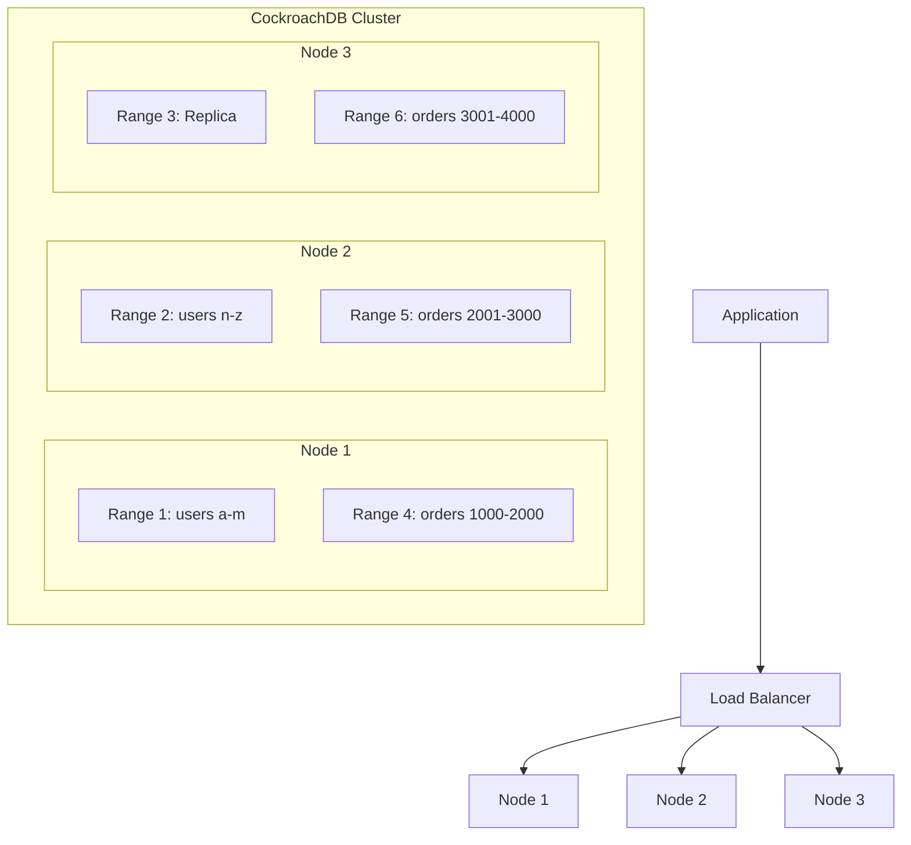
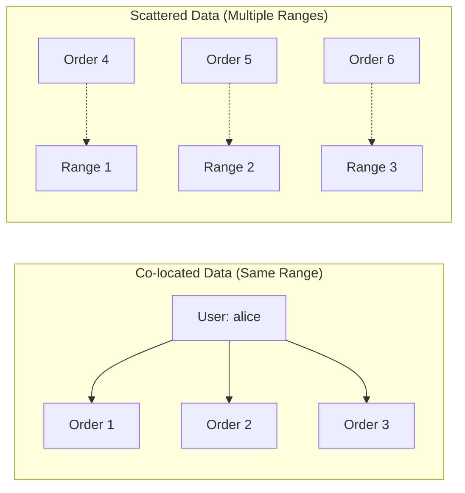
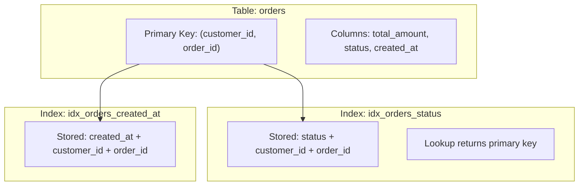
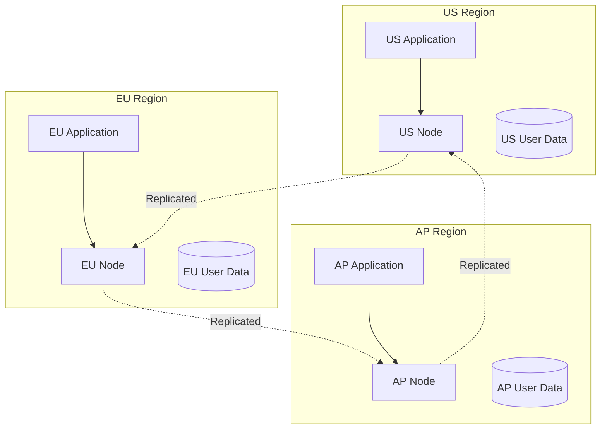
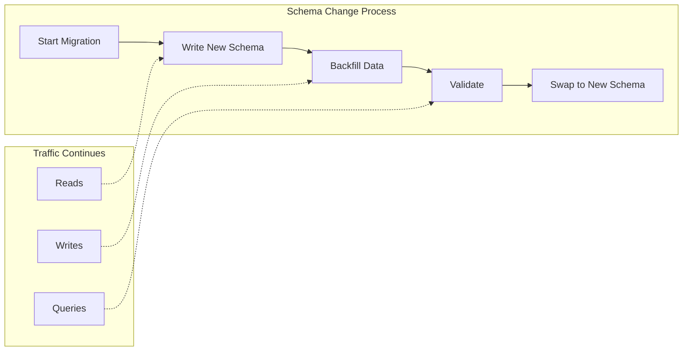

# How to Design Schemas for CockroachDB

Author: [nawazdhandala](https://www.github.com/nawazdhandala)

Tags: CockroachDB, Database, Schema Design, Distributed Systems, SQL, PostgreSQL

Description: Learn how to design effective schemas for CockroachDB. From primary key selection to data locality, secondary indexes to schema migrations, discover practical patterns that leverage CockroachDB's distributed architecture for performance and scalability.

---

CockroachDB is a distributed SQL database that automatically replicates data across nodes for high availability. Designing schemas for CockroachDB requires understanding how data distribution affects performance. Traditional single-node PostgreSQL patterns often need adaptation to work well in a distributed environment.

## Understanding Data Distribution

Before diving into schema design, you need to understand how CockroachDB distributes data.



CockroachDB splits tables into 512MB ranges and distributes them across nodes. Each range is replicated (typically 3 copies) for fault tolerance. Your schema design directly impacts how efficiently queries can access data across these distributed ranges.

## Primary Key Design

Primary key selection is the most critical schema design decision in CockroachDB. The primary key determines how data is physically stored and distributed.

### Avoid Sequential Primary Keys

Sequential keys like auto-increment integers create hotspots. All inserts go to the same range, limiting write throughput to a single node.

The following example shows how sequential IDs cause write hotspots by directing all new inserts to the same range.

```sql
-- BAD: Sequential ID causes all inserts to hit the same range
CREATE TABLE orders_bad (
    id SERIAL PRIMARY KEY,
    customer_id UUID NOT NULL,
    total_amount DECIMAL(10,2),
    created_at TIMESTAMPTZ DEFAULT now()
);

-- Insert pattern creates hotspot
-- id=1000001 -> Range X
-- id=1000002 -> Range X
-- id=1000003 -> Range X (all hitting same range!)
```

### Use UUIDs for Distributed Writes

UUIDs distribute writes randomly across all ranges, utilizing cluster capacity evenly.

```sql
-- GOOD: UUID distributes writes across all nodes
CREATE TABLE orders (
    id UUID PRIMARY KEY DEFAULT gen_random_uuid(),
    customer_id UUID NOT NULL,
    total_amount DECIMAL(10,2),
    created_at TIMESTAMPTZ DEFAULT now()
);

-- Insert pattern distributes evenly
-- id=a1b2c3... -> Range A
-- id=x9y8z7... -> Range M
-- id=f5e4d3... -> Range Z (spread across cluster!)
```

### Use Hash-Sharded Indexes for Sequential Data

When you need sequential ordering (like time-series data), use hash-sharded indexes to distribute writes while maintaining sort order for reads.

The following configuration creates a hash-sharded index that spreads writes across 16 buckets while preserving the ability to query by time range.

```sql
-- Hash-sharded index for time-series data
CREATE TABLE events (
    id UUID PRIMARY KEY DEFAULT gen_random_uuid(),
    event_type VARCHAR(50) NOT NULL,
    payload JSONB,
    created_at TIMESTAMPTZ DEFAULT now(),
    INDEX idx_events_created_at (created_at) USING HASH WITH (bucket_count = 16)
);

-- Writes distribute across 16 buckets
-- Range queries on created_at still work efficiently
SELECT * FROM events
WHERE created_at > now() - INTERVAL '1 hour'
ORDER BY created_at DESC;
```

### Composite Primary Keys for Related Data

Composite primary keys co-locate related data in the same range, reducing cross-node queries.



The composite primary key below ensures all orders for a customer are stored together, making customer order queries extremely fast.

```sql
-- Orders co-located with their customer
CREATE TABLE orders (
    customer_id UUID NOT NULL,
    order_id UUID NOT NULL DEFAULT gen_random_uuid(),
    total_amount DECIMAL(10,2),
    status VARCHAR(20) DEFAULT 'pending',
    created_at TIMESTAMPTZ DEFAULT now(),
    PRIMARY KEY (customer_id, order_id)
);

-- Order items co-located with their order
CREATE TABLE order_items (
    customer_id UUID NOT NULL,
    order_id UUID NOT NULL,
    item_id UUID NOT NULL DEFAULT gen_random_uuid(),
    product_id UUID NOT NULL,
    quantity INT NOT NULL,
    unit_price DECIMAL(10,2),
    PRIMARY KEY (customer_id, order_id, item_id),
    FOREIGN KEY (customer_id, order_id) REFERENCES orders(customer_id, order_id)
);

-- Query hits single range - very fast!
SELECT o.*, oi.*
FROM orders o
JOIN order_items oi ON o.customer_id = oi.customer_id AND o.order_id = oi.order_id
WHERE o.customer_id = 'a1b2c3d4-...'
ORDER BY o.created_at DESC;
```

## Secondary Index Design

Secondary indexes in CockroachDB are stored separately from the primary table. Understanding their storage model helps you design efficient indexes.

### Index Storage Model

Every secondary index stores a copy of the indexed columns plus the primary key columns.



### Use Covering Indexes to Avoid Table Lookups

Covering indexes include all columns needed by a query, eliminating the need to fetch data from the primary table.

The following covering index includes the total_amount column, allowing the query to be satisfied entirely from the index.

```sql
-- Without covering index: requires table lookup
CREATE INDEX idx_orders_status ON orders(status);

-- Query needs total_amount, must fetch from table
SELECT status, SUM(total_amount)
FROM orders
GROUP BY status;

-- With covering index: no table lookup needed
CREATE INDEX idx_orders_status_covering ON orders(status) STORING (total_amount);

-- Query satisfied entirely from index - much faster!
SELECT status, SUM(total_amount)
FROM orders
GROUP BY status;
```

### Partial Indexes for Filtered Queries

Partial indexes only include rows matching a predicate, reducing storage and improving write performance.

```sql
-- Full index includes all orders (large, slow to maintain)
CREATE INDEX idx_all_orders ON orders(created_at);

-- Partial index only includes pending orders (small, fast)
CREATE INDEX idx_pending_orders ON orders(created_at)
WHERE status = 'pending';

-- Query uses partial index automatically
SELECT * FROM orders
WHERE status = 'pending'
AND created_at > now() - INTERVAL '24 hours';

-- Completed orders don't slow down the index
UPDATE orders SET status = 'completed' WHERE order_id = '...';
```

### Expression Indexes for Computed Values

Expression indexes let you index computed values for efficient lookups.

```sql
-- Index on lowercase email for case-insensitive lookups
CREATE INDEX idx_users_email_lower ON users(lower(email));

-- Query uses the expression index
SELECT * FROM users WHERE lower(email) = 'alice@example.com';

-- Index on JSONB field extraction
CREATE TABLE products (
    id UUID PRIMARY KEY DEFAULT gen_random_uuid(),
    name VARCHAR(255),
    attributes JSONB
);

CREATE INDEX idx_products_category ON products((attributes->>'category'));

-- Efficient category lookup
SELECT * FROM products WHERE attributes->>'category' = 'electronics';
```

## Data Locality with Multi-Region

For globally distributed applications, CockroachDB supports data locality configurations that keep data close to users.



### Regional By Row Tables

Regional by row tables store each row in its designated region based on a region column.

```sql
-- Enable multi-region features
ALTER DATABASE mydb PRIMARY REGION "us-east1";
ALTER DATABASE mydb ADD REGION "eu-west1";
ALTER DATABASE mydb ADD REGION "ap-southeast1";

-- Create a regional by row table
CREATE TABLE users (
    id UUID PRIMARY KEY DEFAULT gen_random_uuid(),
    email VARCHAR(255) UNIQUE NOT NULL,
    name VARCHAR(255),
    region crdb_internal_region NOT NULL DEFAULT 'us-east1',
    created_at TIMESTAMPTZ DEFAULT now()
) LOCALITY REGIONAL BY ROW;

-- Insert user in their region
INSERT INTO users (email, name, region)
VALUES ('alice@example.com', 'Alice', 'eu-west1');

-- Query is fast when user's region matches their data location
SELECT * FROM users WHERE id = 'a1b2c3...' AND region = 'eu-west1';
```

### Global Tables for Reference Data

Global tables replicate data to all regions for fast reads everywhere. Use them for infrequently changing reference data.

```sql
-- Global table for configuration and reference data
CREATE TABLE countries (
    code VARCHAR(2) PRIMARY KEY,
    name VARCHAR(100) NOT NULL,
    currency_code VARCHAR(3)
) LOCALITY GLOBAL;

-- Global table for feature flags
CREATE TABLE feature_flags (
    flag_name VARCHAR(100) PRIMARY KEY,
    enabled BOOLEAN DEFAULT false,
    config JSONB
) LOCALITY GLOBAL;

-- Reads are fast from any region
-- Writes are slower (must reach all regions)
SELECT * FROM countries WHERE code = 'US';
```

## JSONB Column Design

CockroachDB supports JSONB columns for semi-structured data. Proper design balances flexibility with query performance.

### When to Use JSONB

JSONB works well for variable attributes that differ between rows, but avoid putting heavily queried fields in JSONB.

```sql
-- Product attributes vary by category - good use of JSONB
CREATE TABLE products (
    id UUID PRIMARY KEY DEFAULT gen_random_uuid(),
    name VARCHAR(255) NOT NULL,
    category VARCHAR(50) NOT NULL,
    price DECIMAL(10,2) NOT NULL,  -- Frequently queried, keep as column
    attributes JSONB  -- Variable attributes in JSONB
);

-- Electronics have different attributes than clothing
INSERT INTO products (name, category, price, attributes) VALUES
('Laptop Pro', 'electronics', 1299.99,
 '{"cpu": "M2", "ram_gb": 16, "storage_gb": 512}'::jsonb),
('Winter Jacket', 'clothing', 199.99,
 '{"size": "L", "color": "blue", "material": "wool"}'::jsonb);
```

### Indexing JSONB for Performance

Create expression indexes on frequently queried JSONB fields.

```sql
-- Index specific JSONB fields you query often
CREATE INDEX idx_products_cpu ON products((attributes->>'cpu'))
WHERE category = 'electronics';

CREATE INDEX idx_products_size ON products((attributes->>'size'))
WHERE category = 'clothing';

-- GIN index for containment queries
CREATE INDEX idx_products_attrs_gin ON products USING GIN(attributes);

-- Containment query uses GIN index
SELECT * FROM products
WHERE attributes @> '{"color": "blue"}'::jsonb;
```

### Inverted Indexes for Full JSONB Search

Inverted indexes support efficient queries on any JSONB path.

```sql
-- Event log with variable event data
CREATE TABLE event_log (
    id UUID PRIMARY KEY DEFAULT gen_random_uuid(),
    event_type VARCHAR(50) NOT NULL,
    event_data JSONB NOT NULL,
    created_at TIMESTAMPTZ DEFAULT now()
);

-- Inverted index supports any path query
CREATE INVERTED INDEX idx_event_data ON event_log(event_data);

-- Query any path efficiently
SELECT * FROM event_log
WHERE event_data @> '{"user": {"role": "admin"}}'::jsonb;

SELECT * FROM event_log
WHERE event_data ? 'error_code';
```

## Table Interleaving Patterns

While CockroachDB deprecated formal interleaving, you can achieve similar co-location with composite primary keys.

### Parent-Child Co-location

Structure primary keys to keep related data together.

```sql
-- Parent table
CREATE TABLE tenants (
    tenant_id UUID PRIMARY KEY DEFAULT gen_random_uuid(),
    name VARCHAR(255) NOT NULL,
    plan VARCHAR(50) DEFAULT 'free'
);

-- Child tables include tenant_id in primary key for co-location
CREATE TABLE tenant_users (
    tenant_id UUID NOT NULL REFERENCES tenants(tenant_id),
    user_id UUID NOT NULL DEFAULT gen_random_uuid(),
    email VARCHAR(255) NOT NULL,
    role VARCHAR(50) DEFAULT 'member',
    PRIMARY KEY (tenant_id, user_id)
);

CREATE TABLE tenant_settings (
    tenant_id UUID NOT NULL REFERENCES tenants(tenant_id),
    setting_key VARCHAR(100) NOT NULL,
    setting_value JSONB,
    PRIMARY KEY (tenant_id, setting_key)
);

-- All tenant data co-located - single range access
SELECT u.*, s.*
FROM tenant_users u
JOIN tenant_settings s ON u.tenant_id = s.tenant_id
WHERE u.tenant_id = 'a1b2c3...';
```

## Schema Migration Strategies

CockroachDB supports online schema changes, but understanding the process helps you plan migrations.

### Online Schema Changes

Most schema changes in CockroachDB are online and non-blocking.



### Adding Columns and Indexes

Adding columns with defaults and creating indexes are online operations.

```sql
-- Add column with default - online, non-blocking
ALTER TABLE orders ADD COLUMN priority INT DEFAULT 0;

-- Create index concurrently - online, non-blocking
CREATE INDEX CONCURRENTLY idx_orders_priority ON orders(priority);

-- Add constraint - validates existing data online
ALTER TABLE orders ADD CONSTRAINT chk_priority
CHECK (priority >= 0 AND priority <= 10);
```

### Careful with Column Type Changes

Column type changes that require data conversion can be expensive.

```sql
-- Safe type changes (widening)
ALTER TABLE products ALTER COLUMN name TYPE VARCHAR(500);

-- Potentially expensive (narrowing or changing type)
-- Consider adding new column and migrating instead
ALTER TABLE products ADD COLUMN price_new DECIMAL(12,4);

UPDATE products SET price_new = price;

-- Verify data migrated correctly
SELECT COUNT(*) FROM products WHERE price_new IS NULL;

-- After verification, drop old and rename
ALTER TABLE products DROP COLUMN price;
ALTER TABLE products RENAME COLUMN price_new TO price;
```

### Batched Data Migrations

For large data migrations, process in batches to avoid overwhelming the cluster.

```sql
-- Migration function that processes in batches
CREATE OR REPLACE FUNCTION migrate_orders_batch(
    batch_size INT DEFAULT 1000
) RETURNS INT AS $$
DECLARE
    migrated INT := 0;
    batch INT;
BEGIN
    LOOP
        -- Process one batch
        WITH batch_rows AS (
            SELECT customer_id, order_id
            FROM orders
            WHERE migrated_at IS NULL
            LIMIT batch_size
        )
        UPDATE orders o
        SET
            migrated_at = now(),
            new_field = compute_new_value(o.old_field)
        FROM batch_rows b
        WHERE o.customer_id = b.customer_id
        AND o.order_id = b.order_id;

        GET DIAGNOSTICS batch = ROW_COUNT;
        migrated := migrated + batch;

        -- Exit when done
        EXIT WHEN batch = 0;

        -- Brief pause to reduce cluster load
        PERFORM pg_sleep(0.1);
    END LOOP;

    RETURN migrated;
END;
$$ LANGUAGE plpgsql;
```

## Performance Optimization Patterns

### Computed Columns for Derived Values

Computed columns calculate values automatically, reducing application complexity.

```sql
-- Computed column for full name
CREATE TABLE customers (
    id UUID PRIMARY KEY DEFAULT gen_random_uuid(),
    first_name VARCHAR(100),
    last_name VARCHAR(100),
    full_name VARCHAR(201) AS (first_name || ' ' || last_name) STORED,
    email VARCHAR(255) UNIQUE
);

-- Computed column for order total
CREATE TABLE orders (
    customer_id UUID NOT NULL,
    order_id UUID NOT NULL DEFAULT gen_random_uuid(),
    subtotal DECIMAL(10,2),
    tax_rate DECIMAL(4,4) DEFAULT 0.08,
    tax_amount DECIMAL(10,2) AS (subtotal * tax_rate) STORED,
    total DECIMAL(10,2) AS (subtotal + (subtotal * tax_rate)) STORED,
    PRIMARY KEY (customer_id, order_id)
);

-- Index computed columns for fast lookups
CREATE INDEX idx_orders_total ON orders(total);
```

### Enum Types for Constrained Values

Use enums for columns with a fixed set of values.

```sql
-- Create enum type
CREATE TYPE order_status AS ENUM (
    'pending',
    'processing',
    'shipped',
    'delivered',
    'cancelled'
);

CREATE TABLE orders (
    customer_id UUID NOT NULL,
    order_id UUID NOT NULL DEFAULT gen_random_uuid(),
    status order_status DEFAULT 'pending',
    PRIMARY KEY (customer_id, order_id)
);

-- Enum validates values automatically
INSERT INTO orders (customer_id, status)
VALUES ('a1b2c3...', 'invalid'); -- ERROR: invalid input value

-- Enums are stored efficiently (integers internally)
SELECT * FROM orders WHERE status = 'pending';
```

### Prepared Statements for Repeated Queries

Prepared statements reduce parsing overhead for frequently executed queries.

```sql
-- Prepare a statement for repeated execution
PREPARE get_customer_orders (UUID) AS
SELECT order_id, total, status, created_at
FROM orders
WHERE customer_id = $1
ORDER BY created_at DESC
LIMIT 10;

-- Execute with different parameters
EXECUTE get_customer_orders('a1b2c3d4-e5f6-7890-abcd-ef1234567890');
EXECUTE get_customer_orders('x9y8z7w6-v5u4-3210-fedc-ba0987654321');

-- Deallocate when done
DEALLOCATE get_customer_orders;
```

## Common Anti-Patterns to Avoid

Understanding what not to do is as important as knowing best practices.

### Anti-Pattern: Over-Normalization

Excessive normalization causes many cross-range joins.

```sql
-- OVER-NORMALIZED: Each query requires multiple range lookups
CREATE TABLE orders (
    order_id UUID PRIMARY KEY,
    customer_id UUID REFERENCES customers(customer_id),
    shipping_address_id UUID REFERENCES addresses(address_id),
    billing_address_id UUID REFERENCES addresses(address_id),
    shipping_method_id UUID REFERENCES shipping_methods(method_id)
);

-- BETTER: Denormalize frequently accessed data
CREATE TABLE orders (
    customer_id UUID NOT NULL,
    order_id UUID NOT NULL DEFAULT gen_random_uuid(),
    customer_email VARCHAR(255),  -- Denormalized for quick access
    shipping_address JSONB,       -- Embedded, not referenced
    billing_address JSONB,
    shipping_method VARCHAR(50),
    PRIMARY KEY (customer_id, order_id)
);
```

### Anti-Pattern: Large Row Sizes

Large rows reduce range efficiency and increase replication overhead.

```sql
-- BAD: Large blobs in main table
CREATE TABLE documents_bad (
    id UUID PRIMARY KEY,
    title VARCHAR(255),
    content BYTEA,  -- Could be megabytes
    metadata JSONB
);

-- BETTER: Separate large data
CREATE TABLE documents (
    id UUID PRIMARY KEY DEFAULT gen_random_uuid(),
    title VARCHAR(255),
    content_size INT,
    metadata JSONB
);

CREATE TABLE document_content (
    document_id UUID PRIMARY KEY REFERENCES documents(id),
    content BYTEA
);

-- Queries on metadata don't load content
SELECT id, title, metadata FROM documents
WHERE metadata->>'category' = 'reports';
```

### Anti-Pattern: Too Many Indexes

Each index adds write overhead and storage cost.

```sql
-- BAD: Index everything
CREATE TABLE orders (
    order_id UUID PRIMARY KEY,
    customer_id UUID,
    status VARCHAR(20),
    created_at TIMESTAMPTZ,
    updated_at TIMESTAMPTZ,
    total DECIMAL(10,2)
);

CREATE INDEX idx1 ON orders(customer_id);
CREATE INDEX idx2 ON orders(status);
CREATE INDEX idx3 ON orders(created_at);
CREATE INDEX idx4 ON orders(total);
CREATE INDEX idx5 ON orders(status, created_at);
CREATE INDEX idx6 ON orders(customer_id, status);
-- ... 10 more indexes

-- BETTER: Only index what you query
-- Analyze actual query patterns first
CREATE INDEX idx_orders_customer ON orders(customer_id);
CREATE INDEX idx_orders_status_created ON orders(status, created_at)
WHERE status IN ('pending', 'processing');
```

## Summary

Designing schemas for CockroachDB requires balancing distribution, locality, and query efficiency:

1. **Primary Keys Matter Most** - Use UUIDs or hash-sharded indexes to distribute writes. Use composite keys to co-locate related data.

2. **Design Indexes Thoughtfully** - Use covering indexes to avoid table lookups. Create partial indexes for filtered queries. Avoid over-indexing.

3. **Leverage Data Locality** - For multi-region deployments, use regional by row tables for user data and global tables for reference data.

4. **JSONB With Care** - Use JSONB for variable attributes but index frequently queried paths. Keep heavily queried fields as proper columns.

5. **Plan Migrations** - Understand which schema changes are online. Batch large data migrations to avoid cluster overload.

6. **Avoid Anti-Patterns** - Prevent over-normalization, large rows, and excessive indexes.

The key insight is that CockroachDB is PostgreSQL-compatible but not PostgreSQL. Patterns that work well on single-node databases may cause performance issues in a distributed system. Design with distribution in mind from the start.

---

**Need visibility into your CockroachDB cluster performance?** [OneUptime](https://oneuptime.com) provides comprehensive database monitoring with query performance tracking, replica lag alerts, and real-time dashboards. Monitor your distributed database clusters with confidence and catch performance issues before they impact users. Get started free with OneUptime today.
