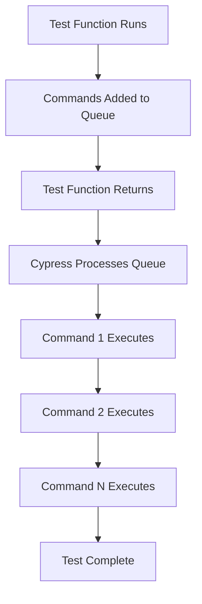
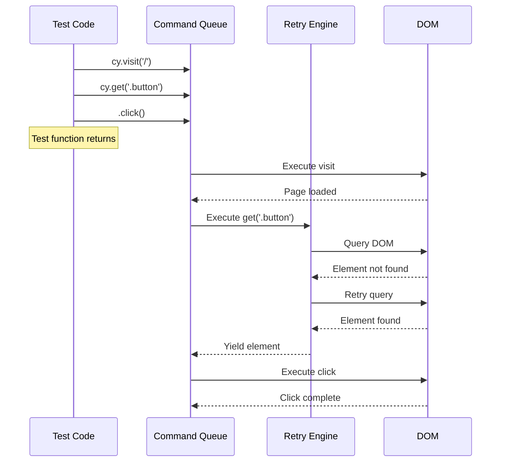
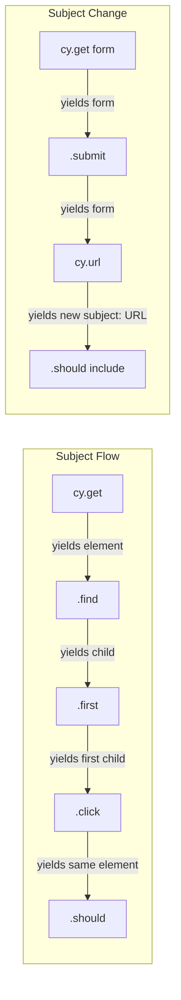
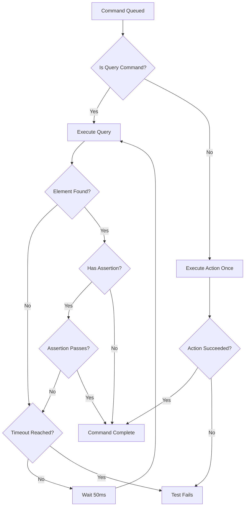

# How to Handle Cypress Commands

Author: [nawazdhandala](https://github.com/nawazdhandala)

Tags: Cypress, Testing, E2E, Commands

Description: A comprehensive guide to understanding and handling Cypress commands, covering the command queue, asynchronous execution, retry-ability, chaining patterns, and best practices for reliable end-to-end tests.

---

Cypress commands behave differently from regular JavaScript code. They do not execute immediately. Instead, they queue up and run asynchronously. Understanding how Cypress handles commands is essential for writing reliable, maintainable tests. This guide explains the command queue, asynchronous patterns, retry mechanisms, and practical techniques for handling commands effectively.

## Understanding the Cypress Command Queue

When you write Cypress code, commands do not run immediately. They get added to a queue and execute in sequence after your test function returns.



### How the Queue Works

The following example demonstrates how commands queue rather than execute immediately:

```javascript
// cypress/e2e/queue-demo.cy.js

describe('Command Queue Demo', () => {
  it('demonstrates command queueing', () => {
    // These commands do NOT run in this order relative to console.log
    // Console.log runs immediately, commands queue for later
    console.log('1 - Synchronous: Before visit');

    // cy.visit gets added to the queue
    cy.visit('/');
    console.log('2 - Synchronous: After visit (but visit has not run yet)');

    // cy.get gets added to the queue after visit
    cy.get('[data-testid="header"]');
    console.log('3 - Synchronous: After get (but get has not run yet)');

    // cy.log gets added to the queue after get
    cy.log('4 - Cypress Log: This runs after get completes');
    console.log('5 - Synchronous: End of test function');

    // Actual execution order:
    // Console: 1, 2, 3, 5 (all synchronous code)
    // Then Cypress: visit -> get -> log (4)
  });
});
```

### Why the Queue Matters

The command queue enables Cypress to:

- Retry commands automatically when assertions fail
- Wait for elements to appear before interacting with them
- Provide time-travel debugging in the Test Runner
- Handle asynchronous DOM updates gracefully

## Asynchronous Command Execution

Cypress commands are asynchronous but they do not return Promises you can await directly. They return Chainable objects that manage their own execution flow.

### The Wrong Way: Treating Commands as Synchronous

This code will not work because commands have not executed yet when the variable is accessed:

```javascript
// cypress/e2e/wrong-approach.cy.js

describe('Incorrect Pattern', () => {
  it('fails because commands are asynchronous', () => {
    // BAD: This does not work
    cy.visit('/users');

    // The text variable is undefined because cy.get().invoke()
    // has not actually run yet - it is just queued
    const text = cy.get('[data-testid="user-count"]').invoke('text');

    // This fails: text is a Chainable, not the actual text value
    if (text === '5') {
      cy.log('Found 5 users');
    }
  });
});
```

### The Right Way: Using then() Callbacks

Access values from commands using the then() callback:

```javascript
// cypress/e2e/correct-approach.cy.js

describe('Correct Pattern', () => {
  it('uses then() to access command results', () => {
    cy.visit('/users');

    // Use .then() to access the yielded value after the command runs
    // The callback receives the result of invoke('text')
    cy.get('[data-testid="user-count"]')
      .invoke('text')
      .then((text) => {
        // Now text contains the actual string value
        // This code runs AFTER the DOM has been queried
        if (text === '5') {
          cy.log('Found 5 users');
        }
      });
  });
});
```

### Chaining Commands Properly

Commands chain together, with each command operating on the result of the previous one:

```javascript
// cypress/e2e/chaining.cy.js

describe('Command Chaining', () => {
  it('chains commands to build complex interactions', () => {
    cy.visit('/products');

    // Each command passes its result to the next
    // get() yields the element
    // find() yields child elements
    // first() yields the first match
    // click() yields the same element for further chaining
    cy.get('[data-testid="product-list"]')
      .find('.product-card')
      .first()
      .click();

    // Commands that yield new subjects change what subsequent commands operate on
    cy.get('[data-testid="product-modal"]')
      .should('be.visible')
      .find('[data-testid="add-to-cart"]')
      .click();
  });
});
```

## Command Flow Visualization

The following diagram shows how commands flow through the Cypress execution pipeline:



## Retry-ability: The Core of Reliable Tests

Cypress automatically retries commands that query the DOM until they succeed or timeout. This makes tests resilient to timing issues.

### Commands That Retry

Query commands retry automatically:

```javascript
// cypress/e2e/retry-commands.cy.js

describe('Retrying Commands', () => {
  it('demonstrates automatic retry on DOM queries', () => {
    cy.visit('/dashboard');

    // cy.get() retries until element exists or timeout
    // If the element appears after 2 seconds, the test still passes
    cy.get('[data-testid="stats-widget"]');

    // cy.contains() retries looking for text content
    cy.contains('Welcome back');

    // cy.find() retries within a parent element
    cy.get('[data-testid="sidebar"]')
      .find('.nav-link');
  });
});
```

### Commands That Do NOT Retry

Action commands execute once and do not retry:

```javascript
// cypress/e2e/non-retry-commands.cy.js

describe('Non-Retrying Commands', () => {
  it('shows commands that execute immediately', () => {
    cy.visit('/form');

    // .click() does not retry - it clicks once
    // If the element is not clickable, it fails immediately
    cy.get('[data-testid="submit-btn"]').click();

    // .type() does not retry - it types once
    cy.get('[data-testid="email-input"]').type('user@example.com');

    // .clear() does not retry - it clears once
    cy.get('[data-testid="search-input"]').clear();

    // .select() does not retry - it selects once
    cy.get('[data-testid="country-select"]').select('USA');
  });
});
```

### Making Assertions Retry-able

Assertions attached to queries inherit retry-ability:

```javascript
// cypress/e2e/retry-assertions.cy.js

describe('Retry-able Assertions', () => {
  it('retries queries until assertion passes', () => {
    cy.visit('/async-page');

    // The entire chain retries until should() passes
    // This handles elements that take time to update
    cy.get('[data-testid="loading-status"]')
      .should('contain', 'Complete');

    // Multiple assertions in a chain all benefit from retry
    cy.get('[data-testid="user-card"]')
      .should('be.visible')
      .and('contain', 'John Doe');

    // Using should() with a callback for complex assertions
    // The callback re-runs on each retry
    cy.get('[data-testid="item-count"]')
      .should(($el) => {
        const count = parseInt($el.text(), 10);
        expect(count).to.be.greaterThan(0);
      });
  });
});
```

## Understanding Command Subjects

Each Cypress command either yields a new subject or passes through the current subject. Understanding this flow is critical for effective chaining.



### Yielding vs Passing Through

Some commands change the subject, others preserve it:

```javascript
// cypress/e2e/subject-flow.cy.js

describe('Subject Flow', () => {
  it('shows how subjects flow through commands', () => {
    cy.visit('/products');

    // cy.get yields the matched elements
    cy.get('[data-testid="product-grid"]')
      // .find yields the child elements it finds
      .find('.product-item')
      // .first yields only the first element
      .first()
      // .click yields the same element (pass-through)
      .click()
      // .should yields the same element (pass-through)
      .should('have.class', 'selected');
  });

  it('shows subject changes with parent commands', () => {
    cy.visit('/checkout');

    // After interacting with a form, use cy.url to check navigation
    cy.get('[data-testid="checkout-form"]')
      .find('[data-testid="submit"]')
      .click();

    // cy.url() starts a new chain with URL as subject
    // This is a parent command - it does not use the previous subject
    cy.url().should('include', '/confirmation');

    // cy.title() also starts fresh with document title as subject
    cy.title().should('contain', 'Order Confirmed');
  });
});
```

### Using wrap() to Control Subjects

The wrap() command lets you introduce any value as a subject:

```javascript
// cypress/e2e/wrap-usage.cy.js

describe('Using wrap()', () => {
  it('wraps values to use in command chain', () => {
    const user = {
      name: 'John Doe',
      email: 'john@example.com',
      role: 'admin'
    };

    // Wrap the object to make assertions using Cypress commands
    cy.wrap(user)
      .its('name')
      .should('equal', 'John Doe');

    cy.wrap(user)
      .its('role')
      .should('equal', 'admin');
  });

  it('wraps jQuery elements from callbacks', () => {
    cy.visit('/users');

    cy.get('[data-testid="user-list"]').then(($list) => {
      // Inside .then(), we have a jQuery object
      // Wrap it to continue using Cypress commands
      const $firstUser = $list.find('.user-item').first();

      cy.wrap($firstUser)
        .should('contain', 'User 1')
        .click();
    });
  });
});
```

## Handling Asynchronous Operations

### Waiting for Network Requests

Use intercept() and wait() to synchronize with API calls:

```javascript
// cypress/e2e/network-handling.cy.js

describe('Network Request Handling', () => {
  it('waits for API response before asserting', () => {
    // Set up intercept before the action that triggers the request
    cy.intercept('GET', '/api/users').as('getUsers');

    cy.visit('/users');

    // Wait for the request to complete before checking the UI
    // This ensures data has loaded before we make assertions
    cy.wait('@getUsers').then((interception) => {
      // Access the response data if needed
      const userCount = interception.response.body.length;
      cy.log(`Loaded ${userCount} users`);
    });

    // Now the data is loaded, we can safely assert
    cy.get('[data-testid="user-list"]')
      .find('.user-item')
      .should('have.length.greaterThan', 0);
  });

  it('handles multiple sequential requests', () => {
    cy.intercept('POST', '/api/orders').as('createOrder');
    cy.intercept('GET', '/api/orders/*').as('getOrder');

    cy.visit('/checkout');

    cy.get('[data-testid="place-order"]').click();

    // Wait for requests in order
    cy.wait('@createOrder');
    cy.wait('@getOrder');

    cy.get('[data-testid="order-confirmation"]')
      .should('be.visible');
  });
});
```

### Handling Timeouts

Configure timeouts for commands that may take longer:

```javascript
// cypress/e2e/timeout-handling.cy.js

describe('Timeout Configuration', () => {
  it('uses custom timeout for slow elements', () => {
    cy.visit('/slow-page');

    // Override the default timeout for this specific command
    // Useful for elements that take longer to appear
    cy.get('[data-testid="lazy-loaded-content"]', { timeout: 15000 })
      .should('be.visible');
  });

  it('configures timeout in should()', () => {
    cy.visit('/processing');

    cy.get('[data-testid="status"]')
      // The timeout applies to the entire assertion chain
      .should('contain', 'Complete', { timeout: 20000 });
  });

  it('uses cy.wait() for explicit delays (use sparingly)', () => {
    cy.visit('/animation-page');

    // Wait for animation to complete
    // Prefer waiting for specific conditions over arbitrary delays
    cy.wait(1000);

    // Better approach: wait for the animation class to be removed
    cy.get('[data-testid="animated-element"]')
      .should('not.have.class', 'animating');
  });
});
```

## Best Practices for Command Handling

### Practice 1: Prefer Assertions Over Arbitrary Waits

```javascript
// cypress/e2e/best-practices.cy.js

describe('Assertion-Based Waiting', () => {
  it('BAD: uses arbitrary wait', () => {
    cy.visit('/dashboard');
    cy.wait(3000); // Do not do this
    cy.get('[data-testid="data-loaded"]').click();
  });

  it('GOOD: uses assertion to wait for ready state', () => {
    cy.visit('/dashboard');

    // Wait for specific condition that indicates readiness
    cy.get('[data-testid="loading-spinner"]')
      .should('not.exist');

    // Or wait for the target element to be ready
    cy.get('[data-testid="data-loaded"]')
      .should('be.visible')
      .and('not.be.disabled')
      .click();
  });
});
```

### Practice 2: Keep Assertions Close to Actions

```javascript
// cypress/e2e/assertion-placement.cy.js

describe('Assertion Placement', () => {
  it('BAD: assertions far from related actions', () => {
    cy.visit('/form');
    cy.get('[data-testid="name"]').type('John');
    cy.get('[data-testid="email"]').type('john@example.com');
    cy.get('[data-testid="submit"]').click();

    // Many lines later...
    cy.get('[data-testid="success-message"]').should('be.visible');
  });

  it('GOOD: assertions immediately follow actions', () => {
    cy.visit('/form');

    // Type and verify the input accepted the value
    cy.get('[data-testid="name"]')
      .type('John')
      .should('have.value', 'John');

    cy.get('[data-testid="email"]')
      .type('john@example.com')
      .should('have.value', 'john@example.com');

    // Submit and immediately verify success
    cy.get('[data-testid="submit"]').click();
    cy.get('[data-testid="success-message"]')
      .should('be.visible');
  });
});
```

### Practice 3: Use Aliases for Repeated References

```javascript
// cypress/e2e/aliases.cy.js

describe('Using Aliases Effectively', () => {
  beforeEach(() => {
    // Set up intercepts and alias them for later reference
    cy.intercept('GET', '/api/products').as('getProducts');
    cy.intercept('POST', '/api/cart').as('addToCart');
  });

  it('uses aliases for elements accessed multiple times', () => {
    cy.visit('/products');
    cy.wait('@getProducts');

    // Alias an element you will interact with multiple times
    cy.get('[data-testid="product-card"]').first().as('firstProduct');

    // Reference the alias instead of querying again
    cy.get('@firstProduct')
      .find('[data-testid="product-name"]')
      .should('exist');

    cy.get('@firstProduct')
      .find('[data-testid="add-to-cart"]')
      .click();

    cy.wait('@addToCart');

    cy.get('@firstProduct')
      .should('have.class', 'in-cart');
  });

  it('uses aliases to store values between commands', () => {
    cy.visit('/products');

    // Store a value for use later in the test
    cy.get('[data-testid="product-price"]')
      .first()
      .invoke('text')
      .as('originalPrice');

    // Apply discount
    cy.get('[data-testid="apply-discount"]').click();

    // Compare with stored value
    cy.get('[data-testid="product-price"]')
      .first()
      .invoke('text')
      .then(function(newPrice) {
        // Access alias with this.originalPrice (note: must use function, not arrow)
        expect(parseFloat(newPrice)).to.be.lessThan(parseFloat(this.originalPrice));
      });
  });
});
```

### Practice 4: Handle Conditional Logic Carefully

```javascript
// cypress/e2e/conditional-logic.cy.js

describe('Conditional Logic in Tests', () => {
  it('handles elements that may or may not exist', () => {
    cy.visit('/dashboard');

    // Use cy.get().then() to check element existence without failing
    cy.get('body').then(($body) => {
      // Check if element exists in the DOM
      if ($body.find('[data-testid="cookie-banner"]').length > 0) {
        cy.get('[data-testid="accept-cookies"]').click();
      }
    });

    // Continue with test
    cy.get('[data-testid="main-content"]').should('be.visible');
  });

  it('uses conditional actions based on element state', () => {
    cy.visit('/settings');

    cy.get('[data-testid="notification-toggle"]').then(($toggle) => {
      // Check current state before acting
      if (!$toggle.hasClass('enabled')) {
        cy.wrap($toggle).click();
      }
    });

    // Verify the desired state
    cy.get('[data-testid="notification-toggle"]')
      .should('have.class', 'enabled');
  });
});
```

## Command Retry Strategy

The following diagram illustrates how Cypress handles command retries with assertions:



## Organizing Commands in Large Test Suites

### Group Related Commands in Support Files

```javascript
// cypress/support/commands/auth.js

// Authentication-related commands grouped together
Cypress.Commands.add('login', (email, password) => {
  cy.session([email, password], () => {
    cy.visit('/login');
    cy.get('[data-testid="email"]').type(email);
    cy.get('[data-testid="password"]').type(password);
    cy.get('[data-testid="submit"]').click();
    cy.url().should('include', '/dashboard');
  });
});

Cypress.Commands.add('logout', () => {
  cy.get('[data-testid="user-menu"]').click();
  cy.get('[data-testid="logout"]').click();
  cy.url().should('include', '/login');
});

Cypress.Commands.add('loginViaApi', (email, password) => {
  cy.request({
    method: 'POST',
    url: '/api/auth/login',
    body: { email, password }
  }).then((response) => {
    window.localStorage.setItem('authToken', response.body.token);
  });
});
```

```javascript
// cypress/support/commands/navigation.js

// Navigation commands grouped separately
Cypress.Commands.add('visitDashboard', () => {
  cy.visit('/dashboard');
  cy.get('[data-testid="dashboard-header"]').should('be.visible');
});

Cypress.Commands.add('visitSettings', () => {
  cy.visit('/settings');
  cy.get('[data-testid="settings-page"]').should('be.visible');
});

Cypress.Commands.add('navigateTo', (section) => {
  cy.get(`[data-testid="nav-${section}"]`).click();
  cy.url().should('include', `/${section}`);
});
```

```javascript
// cypress/support/e2e.js

// Import all command groups
import './commands/auth';
import './commands/navigation';
import './commands/forms';
import './commands/api';
```

### Create Reusable Test Utilities

```javascript
// cypress/support/utils/testData.js

// Utility functions for generating test data
export const generateUser = (overrides = {}) => ({
  email: `test-${Date.now()}@example.com`,
  password: 'TestPassword123!',
  name: 'Test User',
  ...overrides
});

export const generateProduct = (overrides = {}) => ({
  name: `Product ${Date.now()}`,
  price: Math.floor(Math.random() * 100) + 1,
  category: 'general',
  ...overrides
});
```

```javascript
// cypress/e2e/checkout.cy.js

import { generateUser, generateProduct } from '../support/utils/testData';

describe('Checkout Flow', () => {
  const testUser = generateUser();
  const testProduct = generateProduct({ price: 49.99 });

  beforeEach(() => {
    // Seed test data via API
    cy.request('POST', '/api/test/seed', {
      users: [testUser],
      products: [testProduct]
    });
  });

  it('completes checkout successfully', () => {
    cy.loginViaApi(testUser.email, testUser.password);
    cy.visit(`/products/${testProduct.id}`);

    cy.get('[data-testid="add-to-cart"]').click();
    cy.get('[data-testid="cart-count"]').should('contain', '1');

    cy.navigateTo('checkout');
    cy.get('[data-testid="order-total"]')
      .should('contain', testProduct.price.toFixed(2));
  });
});
```

## Common Mistakes and Solutions

### Mistake 1: Mixing Synchronous and Asynchronous Code

```javascript
// cypress/e2e/common-mistakes.cy.js

describe('Common Mistakes', () => {
  it('BAD: mixing sync and async incorrectly', () => {
    let itemCount = 0;

    cy.visit('/items');
    cy.get('.item').its('length').then((count) => {
      itemCount = count;
    });

    // This runs BEFORE the .then() callback above
    // itemCount is still 0 here
    console.log(itemCount); // Logs: 0
  });

  it('GOOD: keeping all logic in callbacks', () => {
    cy.visit('/items');

    cy.get('.item').its('length').then((count) => {
      // All logic that depends on count goes here
      expect(count).to.be.greaterThan(0);
      cy.log(`Found ${count} items`);

      if (count > 10) {
        cy.get('[data-testid="load-more"]').should('exist');
      }
    });
  });
});
```

### Mistake 2: Breaking the Command Chain

```javascript
describe('Command Chain Mistakes', () => {
  it('BAD: breaking the chain loses the subject', () => {
    cy.visit('/form');

    // This assigns the Chainable, not the element
    const input = cy.get('[data-testid="email"]');

    // Later trying to use input will not work as expected
    // because the chain was broken
    input.type('test@example.com'); // This might fail unexpectedly
  });

  it('GOOD: maintain the chain or use aliases', () => {
    cy.visit('/form');

    // Option 1: Keep the chain connected
    cy.get('[data-testid="email"]')
      .type('test@example.com')
      .should('have.value', 'test@example.com');

    // Option 2: Use alias for multiple references
    cy.get('[data-testid="password"]').as('passwordField');

    cy.get('@passwordField').type('secret123');
    cy.get('@passwordField').should('have.value', 'secret123');
  });
});
```

### Mistake 3: Not Handling Detached Elements

```javascript
describe('Detached Element Handling', () => {
  it('BAD: element becomes detached after DOM update', () => {
    cy.visit('/dynamic-list');

    cy.get('.list-item').first().as('firstItem');

    // This click causes the list to re-render
    cy.get('[data-testid="refresh"]').click();

    // The aliased element is now detached from DOM
    // cy.get('@firstItem').click(); // This will fail
  });

  it('GOOD: re-query after DOM updates', () => {
    cy.visit('/dynamic-list');

    cy.get('[data-testid="refresh"]').click();

    // Wait for update to complete, then query fresh
    cy.get('[data-testid="list-updated"]').should('exist');

    // Now get the element fresh
    cy.get('.list-item').first().click();
  });
});
```

## Reference Table: Command Behaviors

| Command Type | Retries | Yields | Example |
|-------------|---------|--------|---------|
| Query | Yes | Element(s) | `cy.get()`, `cy.contains()`, `cy.find()` |
| Assertion | Yes | Same subject | `should()`, `and()` |
| Action | No | Same subject | `click()`, `type()`, `clear()` |
| Parent | No | New subject | `cy.visit()`, `cy.request()`, `cy.url()` |
| Child | Varies | Varies | `first()`, `last()`, `eq()` |
| Utility | No | Varies | `cy.wait()`, `cy.wrap()`, `cy.log()` |

## Summary

Understanding how Cypress handles commands is fundamental to writing reliable tests:

- Commands queue up and execute asynchronously after your test function returns
- Query commands retry automatically until they succeed or timeout
- Action commands execute once and do not retry
- Use `.then()` callbacks to access values yielded by commands
- Assertions attached to queries inherit retry-ability
- Avoid mixing synchronous JavaScript with asynchronous command expectations
- Use aliases to store and reference elements or values across commands
- Prefer assertion-based waiting over arbitrary delays
- Keep assertions close to the actions they verify
- Re-query elements after DOM updates to avoid detached element errors

Mastering these concepts transforms your tests from brittle scripts into reliable specifications that handle real-world application behavior gracefully.

---

*Reliable testing requires robust monitoring. Track your application health and get instant alerts when issues arise with [OneUptime](https://oneuptime.com) - the complete observability platform for modern engineering teams.*
