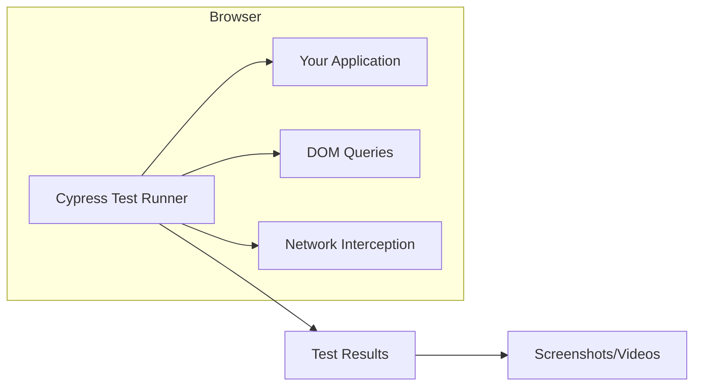
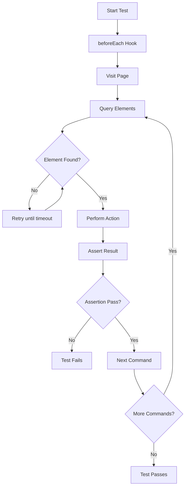

# How to Get Started with Cypress

Author: [nawazdhandala](https://www.github.com/nawazdhandala)

Tags: Cypress, Testing, E2E, Automation, JavaScript

Description: Learn how to set up Cypress for end-to-end testing, write your first tests, and build a solid foundation for automated browser testing in your JavaScript projects.

---

> Cypress is a modern end-to-end testing framework that runs directly in the browser. Unlike Selenium-based tools, Cypress gives you real-time reloading, automatic waiting, and debugging that actually makes sense. This guide walks you through everything you need to start testing with Cypress.

End-to-end testing can feel like a chore. Tests are flaky, debugging is painful, and the feedback loop is slow. Cypress changes that by running tests in the same run loop as your application.

---

## Why Cypress?

| Feature | Cypress | Selenium |
|---------|---------|----------|
| **Setup** | npm install | Browser drivers, bindings |
| **Execution** | In-browser | Remote WebDriver |
| **Automatic Waiting** | Built-in | Manual waits needed |
| **Time Travel** | Yes | No |
| **Network Control** | Native | Proxy setup |
| **Debugging** | Browser DevTools | Limited |

---

## How Cypress Works



Cypress runs inside the browser alongside your application. This architecture gives it direct access to everything happening in your app, including network requests, DOM changes, and JavaScript execution.

---

## Installation

Cypress requires Node.js 18 or higher. Let's set up a new project from scratch.

Initialize a new project and install Cypress as a dev dependency:

```bash
# Create a new project directory
mkdir my-cypress-project
cd my-cypress-project

# Initialize npm project
npm init -y

# Install Cypress
npm install cypress --save-dev
```

Open Cypress for the first time to generate the default folder structure:

```bash
npx cypress open
```

This creates the following structure:

```
my-cypress-project/
├── cypress/
│   ├── e2e/           # Your test files go here
│   ├── fixtures/      # Test data (JSON files)
│   ├── support/       # Custom commands and setup
│   │   ├── commands.js
│   │   └── e2e.js
│   └── downloads/     # Downloaded files during tests
├── cypress.config.js  # Main configuration file
└── package.json
```

---

## Configuration

Cypress uses `cypress.config.js` for all settings. Here's a practical configuration for most projects:

```javascript
// cypress.config.js
const { defineConfig } = require('cypress');

module.exports = defineConfig({
  e2e: {
    // Base URL for your application - avoids repeating full URLs
    baseUrl: 'http://localhost:3000',

    // Where to find test files
    specPattern: 'cypress/e2e/**/*.cy.{js,jsx,ts,tsx}',

    // Viewport settings for consistent screenshots
    viewportWidth: 1280,
    viewportHeight: 720,

    // Timeouts - increase if your app is slow
    defaultCommandTimeout: 10000,
    pageLoadTimeout: 60000,

    // Video and screenshots
    video: true,
    screenshotOnRunFailure: true,

    // Retry failed tests (useful for CI)
    retries: {
      runMode: 2,      // Retries when running in CI
      openMode: 0      // No retries in interactive mode
    },

    setupNodeEvents(on, config) {
      // Register plugins here
      return config;
    },
  },
});
```

---

## Writing Your First Test

Let's write a test that verifies a login flow. Create a new file in the e2e directory:

```javascript
// cypress/e2e/login.cy.js

describe('Login Page', () => {
  // Runs before each test in this describe block
  beforeEach(() => {
    // Visit the login page using baseUrl from config
    cy.visit('/login');
  });

  it('should display the login form', () => {
    // Check that form elements exist
    cy.get('input[name="email"]').should('be.visible');
    cy.get('input[name="password"]').should('be.visible');
    cy.get('button[type="submit"]').should('contain', 'Log In');
  });

  it('should show error for invalid credentials', () => {
    // Type into form fields
    cy.get('input[name="email"]').type('wrong@example.com');
    cy.get('input[name="password"]').type('wrongpassword');

    // Submit the form
    cy.get('button[type="submit"]').click();

    // Verify error message appears
    cy.get('.error-message')
      .should('be.visible')
      .and('contain', 'Invalid credentials');
  });

  it('should redirect to dashboard on successful login', () => {
    // Use valid test credentials
    cy.get('input[name="email"]').type('user@example.com');
    cy.get('input[name="password"]').type('correctpassword');

    cy.get('button[type="submit"]').click();

    // Verify redirect happened
    cy.url().should('include', '/dashboard');

    // Verify dashboard content loaded
    cy.get('h1').should('contain', 'Welcome');
  });
});
```

Run your test interactively:

```bash
npx cypress open
```

Or run headlessly for CI:

```bash
npx cypress run
```

---

## Cypress Commands Explained

Cypress has a chainable API where each command yields a subject to the next. Here are the essential commands:

### Navigation

```javascript
// cypress/e2e/navigation.cy.js

describe('Navigation Commands', () => {
  it('demonstrates navigation', () => {
    // Visit a URL - uses baseUrl if path starts with /
    cy.visit('/products');

    // Go back in browser history
    cy.go('back');

    // Go forward
    cy.go('forward');

    // Reload the page
    cy.reload();
  });
});
```

### Querying Elements

```javascript
// cypress/e2e/querying.cy.js

describe('Querying Elements', () => {
  beforeEach(() => {
    cy.visit('/products');
  });

  it('demonstrates different selectors', () => {
    // By CSS selector
    cy.get('.product-card');

    // By data attribute - recommended for stability
    cy.get('[data-testid="product-list"]');

    // Contains text
    cy.contains('Add to Cart');

    // Find within an element
    cy.get('.product-card').first().find('.price');

    // Get by ID
    cy.get('#search-input');

    // Multiple selectors
    cy.get('button, a.button');
  });

  it('filters elements', () => {
    // Get first element
    cy.get('.product-card').first();

    // Get last element
    cy.get('.product-card').last();

    // Get by index
    cy.get('.product-card').eq(2);

    // Filter by selector
    cy.get('.product-card').filter('.featured');

    // Get parent
    cy.get('.price').parent();

    // Get siblings
    cy.get('.active').siblings();
  });
});
```

### Actions

```javascript
// cypress/e2e/actions.cy.js

describe('User Actions', () => {
  beforeEach(() => {
    cy.visit('/form');
  });

  it('demonstrates form interactions', () => {
    // Type into input - clears first by default
    cy.get('input[name="username"]').type('johndoe');

    // Type without clearing
    cy.get('input[name="search"]').type('laptop', { delay: 100 });

    // Clear an input
    cy.get('input[name="username"]').clear();

    // Click a button
    cy.get('button[type="submit"]').click();

    // Double click
    cy.get('.item').dblclick();

    // Right click
    cy.get('.item').rightclick();

    // Check a checkbox
    cy.get('input[type="checkbox"]').check();

    // Uncheck
    cy.get('input[type="checkbox"]').uncheck();

    // Select from dropdown
    cy.get('select').select('option-value');

    // Select multiple options
    cy.get('select[multiple]').select(['opt1', 'opt2']);
  });

  it('demonstrates special key combinations', () => {
    // Type special keys
    cy.get('input').type('{enter}');
    cy.get('input').type('{backspace}');

    // Keyboard shortcuts
    cy.get('input').type('{ctrl+a}');
    cy.get('input').type('{shift+home}');

    // Type and press enter
    cy.get('input[name="search"]').type('cypress testing{enter}');
  });
});
```

### Assertions

```javascript
// cypress/e2e/assertions.cy.js

describe('Assertions', () => {
  beforeEach(() => {
    cy.visit('/products');
  });

  it('demonstrates common assertions', () => {
    // Element should exist
    cy.get('.product-list').should('exist');

    // Element should be visible
    cy.get('.header').should('be.visible');

    // Element should not exist
    cy.get('.error').should('not.exist');

    // Text content
    cy.get('h1').should('contain', 'Products');
    cy.get('h1').should('have.text', 'All Products');

    // CSS properties
    cy.get('.button').should('have.css', 'background-color', 'rgb(0, 123, 255)');

    // Classes
    cy.get('.nav-item').should('have.class', 'active');

    // Attributes
    cy.get('input').should('have.attr', 'placeholder', 'Search...');

    // Value
    cy.get('input[name="quantity"]').should('have.value', '1');

    // Length of elements
    cy.get('.product-card').should('have.length', 10);
    cy.get('.product-card').should('have.length.greaterThan', 5);

    // Chain multiple assertions
    cy.get('.product-card')
      .should('be.visible')
      .and('have.length', 10)
      .and('contain', 'Add to Cart');
  });
});
```

---

## Test Flow Diagram



---

## Working with Network Requests

Cypress can intercept and stub network requests, which is essential for reliable tests.

### Intercepting API Calls

```javascript
// cypress/e2e/network.cy.js

describe('Network Interception', () => {
  it('waits for API response', () => {
    // Set up intercept before visiting
    cy.intercept('GET', '/api/products').as('getProducts');

    cy.visit('/products');

    // Wait for the request to complete
    cy.wait('@getProducts').then((interception) => {
      // Access response data
      expect(interception.response.statusCode).to.equal(200);
      expect(interception.response.body).to.have.length.greaterThan(0);
    });
  });

  it('stubs API response', () => {
    // Return mock data instead of real API
    cy.intercept('GET', '/api/products', {
      statusCode: 200,
      body: [
        { id: 1, name: 'Mock Product', price: 29.99 },
        { id: 2, name: 'Another Product', price: 49.99 }
      ]
    }).as('getProducts');

    cy.visit('/products');

    cy.wait('@getProducts');

    // Verify mock data is displayed
    cy.get('.product-card').should('have.length', 2);
    cy.contains('Mock Product').should('be.visible');
  });

  it('simulates network error', () => {
    // Force a network error
    cy.intercept('GET', '/api/products', {
      statusCode: 500,
      body: { error: 'Internal Server Error' }
    }).as('getProducts');

    cy.visit('/products');

    cy.wait('@getProducts');

    // Verify error handling
    cy.get('.error-message').should('contain', 'Failed to load products');
  });

  it('delays response', () => {
    // Simulate slow network
    cy.intercept('GET', '/api/products', (req) => {
      req.reply({
        delay: 2000,
        body: []
      });
    }).as('getProducts');

    cy.visit('/products');

    // Verify loading state appears
    cy.get('.loading-spinner').should('be.visible');

    cy.wait('@getProducts');

    // Loading should disappear
    cy.get('.loading-spinner').should('not.exist');
  });
});
```

### Using Fixtures

Store test data in fixture files for reusability:

```json
// cypress/fixtures/products.json
[
  {
    "id": 1,
    "name": "Wireless Keyboard",
    "price": 79.99,
    "category": "Electronics"
  },
  {
    "id": 2,
    "name": "USB Mouse",
    "price": 29.99,
    "category": "Electronics"
  }
]
```

Load fixtures in your tests:

```javascript
// cypress/e2e/fixtures.cy.js

describe('Using Fixtures', () => {
  it('loads fixture data', () => {
    // Load fixture and use it to stub API
    cy.fixture('products.json').then((products) => {
      cy.intercept('GET', '/api/products', products).as('getProducts');
    });

    cy.visit('/products');
    cy.wait('@getProducts');

    cy.get('.product-card').should('have.length', 2);
  });

  // Shorthand syntax
  it('uses fixture shorthand', () => {
    cy.intercept('GET', '/api/products', { fixture: 'products.json' }).as('getProducts');

    cy.visit('/products');
    cy.wait('@getProducts');
  });
});
```

---

## Custom Commands

Custom commands help you avoid repetition. Add them to `cypress/support/commands.js`:

```javascript
// cypress/support/commands.js

// Custom login command - reuse across all tests
Cypress.Commands.add('login', (email, password) => {
  cy.session([email, password], () => {
    cy.visit('/login');
    cy.get('input[name="email"]').type(email);
    cy.get('input[name="password"]').type(password);
    cy.get('button[type="submit"]').click();
    cy.url().should('include', '/dashboard');
  });
});

// Custom command to select by data-testid
Cypress.Commands.add('getByTestId', (testId) => {
  return cy.get(`[data-testid="${testId}"]`);
});

// Custom command to fill a form
Cypress.Commands.add('fillForm', (formData) => {
  Object.entries(formData).forEach(([field, value]) => {
    cy.get(`input[name="${field}"], textarea[name="${field}"], select[name="${field}"]`)
      .then(($el) => {
        if ($el.is('select')) {
          cy.wrap($el).select(value);
        } else if ($el.attr('type') === 'checkbox') {
          if (value) {
            cy.wrap($el).check();
          } else {
            cy.wrap($el).uncheck();
          }
        } else {
          cy.wrap($el).clear().type(value);
        }
      });
  });
});

// Custom assertion command
Cypress.Commands.add('shouldBeWithinRange', { prevSubject: 'element' }, (subject, min, max) => {
  const value = parseFloat(subject.text());
  expect(value).to.be.within(min, max);
});
```

Use custom commands in tests:

```javascript
// cypress/e2e/using-commands.cy.js

describe('Using Custom Commands', () => {
  it('uses login command', () => {
    cy.login('user@example.com', 'password123');
    cy.visit('/dashboard');
    cy.contains('Welcome').should('be.visible');
  });

  it('uses getByTestId command', () => {
    cy.visit('/products');
    cy.getByTestId('product-list').should('be.visible');
  });

  it('uses fillForm command', () => {
    cy.visit('/contact');
    cy.fillForm({
      name: 'John Doe',
      email: 'john@example.com',
      message: 'Hello from Cypress!'
    });
    cy.get('button[type="submit"]').click();
  });
});
```

---

## Page Object Model

For larger test suites, organize code using page objects:

```javascript
// cypress/support/pages/LoginPage.js

class LoginPage {
  // Element selectors
  elements = {
    emailInput: () => cy.get('input[name="email"]'),
    passwordInput: () => cy.get('input[name="password"]'),
    submitButton: () => cy.get('button[type="submit"]'),
    errorMessage: () => cy.get('.error-message'),
    forgotPasswordLink: () => cy.get('a[href="/forgot-password"]')
  };

  // Actions
  visit() {
    cy.visit('/login');
    return this;
  }

  typeEmail(email) {
    this.elements.emailInput().clear().type(email);
    return this;
  }

  typePassword(password) {
    this.elements.passwordInput().clear().type(password);
    return this;
  }

  submit() {
    this.elements.submitButton().click();
    return this;
  }

  login(email, password) {
    this.typeEmail(email);
    this.typePassword(password);
    this.submit();
    return this;
  }

  // Assertions
  assertErrorVisible(message) {
    this.elements.errorMessage()
      .should('be.visible')
      .and('contain', message);
    return this;
  }

  assertRedirectedToDashboard() {
    cy.url().should('include', '/dashboard');
    return this;
  }
}

export default new LoginPage();
```

Use the page object in tests:

```javascript
// cypress/e2e/login-pom.cy.js
import LoginPage from '../support/pages/LoginPage';

describe('Login Page (POM)', () => {
  beforeEach(() => {
    LoginPage.visit();
  });

  it('shows error for invalid credentials', () => {
    LoginPage
      .login('invalid@example.com', 'wrongpassword')
      .assertErrorVisible('Invalid credentials');
  });

  it('redirects on successful login', () => {
    LoginPage
      .login('user@example.com', 'correctpassword')
      .assertRedirectedToDashboard();
  });
});
```

---

## Running in CI/CD

Configure Cypress to run in your CI pipeline. Here's an example for GitHub Actions:

```yaml
# .github/workflows/e2e.yml
name: E2E Tests

on:
  push:
    branches: [main]
  pull_request:
    branches: [main]

jobs:
  cypress-run:
    runs-on: ubuntu-latest
    steps:
      - name: Checkout
        uses: actions/checkout@v4

      - name: Setup Node
        uses: actions/setup-node@v4
        with:
          node-version: 20
          cache: 'npm'

      - name: Install dependencies
        run: npm ci

      - name: Start application
        run: npm start &
        env:
          CI: true

      - name: Wait for app to start
        run: npx wait-on http://localhost:3000

      - name: Run Cypress tests
        uses: cypress-io/github-action@v6
        with:
          browser: chrome
          record: true
        env:
          CYPRESS_RECORD_KEY: ${{ secrets.CYPRESS_RECORD_KEY }}

      - name: Upload screenshots on failure
        uses: actions/upload-artifact@v4
        if: failure()
        with:
          name: cypress-screenshots
          path: cypress/screenshots

      - name: Upload videos
        uses: actions/upload-artifact@v4
        if: always()
        with:
          name: cypress-videos
          path: cypress/videos
```

---

## Debugging Tips

### Using cy.log() and cy.debug()

```javascript
// cypress/e2e/debugging.cy.js

describe('Debugging', () => {
  it('demonstrates debugging tools', () => {
    cy.visit('/products');

    // Log messages to Command Log
    cy.log('About to fetch products');

    cy.get('.product-card').then(($cards) => {
      cy.log(`Found ${$cards.length} products`);
    });

    // Pause execution and open DevTools
    cy.get('.product-card').first().debug();

    // Pause test execution
    cy.pause();
  });
});
```

### Taking Screenshots

```javascript
// cypress/e2e/screenshots.cy.js

describe('Screenshots', () => {
  it('takes screenshots manually', () => {
    cy.visit('/products');

    // Full page screenshot
    cy.screenshot('products-page');

    // Element screenshot
    cy.get('.product-card').first().screenshot('first-product');

    // Custom options
    cy.screenshot('custom', {
      capture: 'viewport',
      clip: { x: 0, y: 0, width: 500, height: 500 }
    });
  });
});
```

---

## Best Practices

### 1. Use data-testid Attributes

```html
<!-- In your application -->
<button data-testid="submit-order">Place Order</button>
```

```javascript
// In your tests - stable selector that won't break
cy.get('[data-testid="submit-order"]').click();
```

### 2. Avoid Hard-Coded Waits

```javascript
// Bad - arbitrary wait time
cy.wait(3000);
cy.get('.result').should('exist');

// Good - wait for specific condition
cy.get('.loading').should('not.exist');
cy.get('.result').should('exist');

// Good - wait for network request
cy.intercept('POST', '/api/orders').as('createOrder');
cy.get('button').click();
cy.wait('@createOrder');
```

### 3. Keep Tests Independent

```javascript
// Each test should be able to run in isolation
describe('Products', () => {
  beforeEach(() => {
    // Reset state before each test
    cy.intercept('GET', '/api/products', { fixture: 'products.json' });
    cy.visit('/products');
  });

  it('filters by category', () => {
    // Test logic
  });

  it('sorts by price', () => {
    // Test logic - doesn't depend on previous test
  });
});
```

### 4. Use Aliases for Readability

```javascript
cy.get('[data-testid="product-list"]').as('productList');
cy.get('[data-testid="cart-count"]').as('cartCount');

cy.get('@productList').find('.product-card').should('have.length', 10);
cy.get('@cartCount').should('have.text', '0');
```

---

## Conclusion

Cypress makes end-to-end testing enjoyable. Here's what we covered:

- **Installation and setup** - Get running in minutes with npm
- **Writing tests** - Use Cypress commands for navigation, querying, and assertions
- **Network control** - Intercept and stub API calls for reliable tests
- **Custom commands** - Build reusable testing utilities
- **Page objects** - Organize tests for maintainability
- **CI integration** - Run tests automatically on every commit

Start small, focus on critical user flows, and expand coverage over time. Cypress's interactive runner makes debugging fast, so don't be afraid to experiment.

---

*Running Cypress in CI and want to know when tests fail? [OneUptime](https://oneuptime.com) integrates with your CI pipeline to alert you instantly when E2E tests break, helping you catch regressions before they reach production.*
