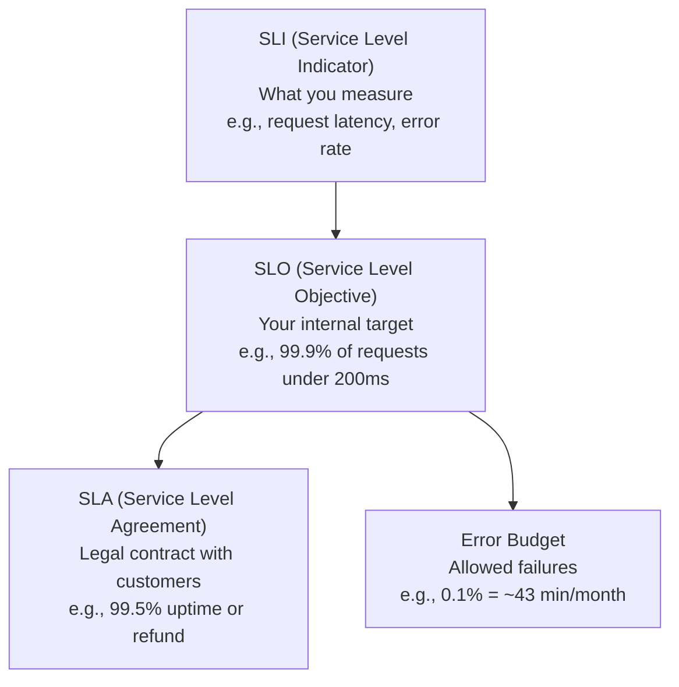
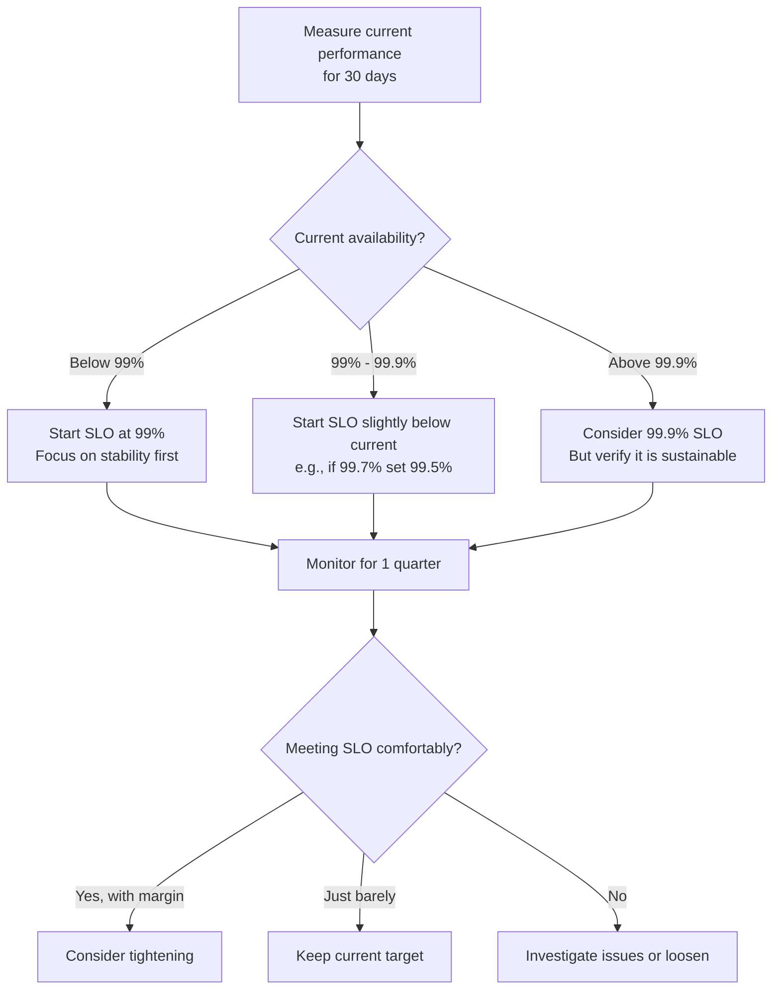
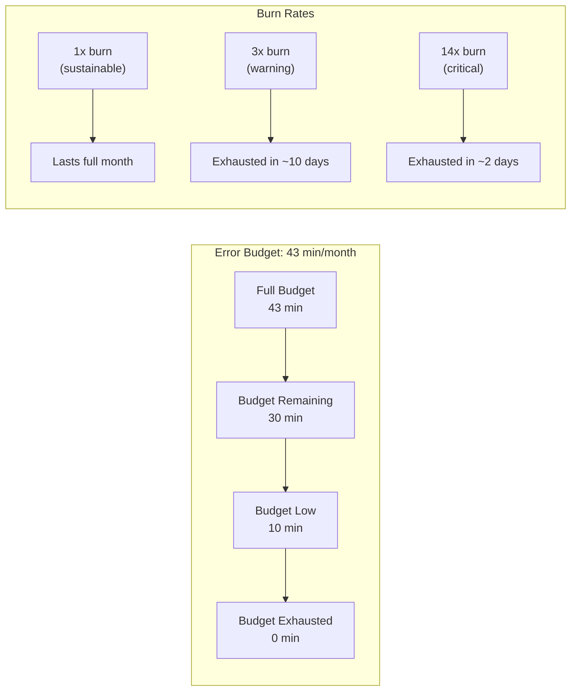
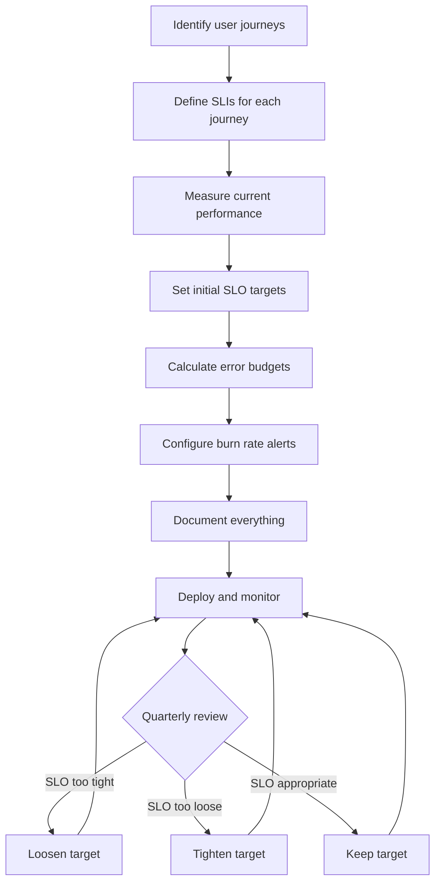

# How to Define Service Level Objectives (SLOs)

Author: [nawazdhandala](https://www.github.com/nawazdhandala)

Tags: SRE, SLO, Reliability, Monitoring, DevOps

Description: A practical guide to defining meaningful SLOs that actually improve your service reliability and help your team make better engineering decisions.

---

SLOs are one of those concepts that sounds simple until you try to implement them. Teams often struggle because they jump straight into picking percentages without first understanding what they are trying to measure or why.

This guide walks through the entire process of defining SLOs, from identifying what matters to your users to implementing alerts that actually help you take action.

## What is an SLO and Why Should You Care?

A Service Level Objective (SLO) is a target for how well your service should perform over a given time period. It answers the question: "How reliable does this service need to be?"

The key difference between SLOs and traditional monitoring is focus. Traditional monitoring tracks everything (CPU, memory, disk, network). SLOs track what users actually experience.

Here is the relationship between the key terms:



Your SLO should always be stricter than your SLA. If your SLA promises 99.5% availability, your internal SLO should be 99.9% or higher. This gives you a buffer before you breach your contractual obligations.

## Step 1: Identify Critical User Journeys

Do not start by picking metrics. Start by understanding how users interact with your service.

List the key user journeys that matter most to your business:

| User Journey | Why It Matters | Primary Concern |
|--------------|----------------|-----------------|
| User login | First interaction, sets tone | Latency, success rate |
| Checkout flow | Direct revenue impact | Success rate, latency |
| Search results | Core product value | Latency, relevance |
| API response | Third-party integrations | Latency, error rate |
| Dashboard load | Daily user workflow | Latency, completeness |

For each journey, ask yourself: "If this breaks, what does the user experience?"

A user does not care if your CPU is at 90%. They care if the page loads slowly or returns an error. Your SLOs should reflect what users care about.

## Step 2: Choose Your Service Level Indicators (SLIs)

SLIs are the metrics that feed your SLOs. The most common categories are:

**Availability**: Did the request succeed or fail?
```
availability = (successful_requests / total_requests) * 100
```

**Latency**: How long did it take?
```
latency = time_at_percentile(requests, 99)
```

**Throughput**: How many requests can we handle?
```
throughput = requests_per_second
```

**Quality**: Did the response contain the right data?
```
quality = (correct_responses / total_responses) * 100
```

Here is a Python example showing how to calculate these SLIs from your request data:

```python
# Example: Calculating SLIs from request logs
# This class helps you track and compute SLI values
# from your application's request history

from dataclasses import dataclass
from typing import List
import statistics

@dataclass
class RequestMetric:
    """Represents a single request with its outcome and timing."""
    timestamp: float
    latency_ms: float
    success: bool
    endpoint: str

class SLICalculator:
    """
    Calculates Service Level Indicators from request metrics.

    Usage:
        calculator = SLICalculator()
        calculator.add_request(RequestMetric(...))
        print(calculator.availability())
        print(calculator.latency_p99())
    """

    def __init__(self):
        self.requests: List[RequestMetric] = []

    def add_request(self, metric: RequestMetric):
        """Add a request metric to the calculation window."""
        self.requests.append(metric)

    def availability(self) -> float:
        """
        Calculate availability as percentage of successful requests.
        Returns a value between 0 and 100.
        """
        if not self.requests:
            return 100.0

        successful = sum(1 for r in self.requests if r.success)
        return (successful / len(self.requests)) * 100

    def latency_p99(self) -> float:
        """
        Calculate the 99th percentile latency in milliseconds.
        This shows what the slowest 1% of users experience.
        """
        if not self.requests:
            return 0.0

        latencies = sorted(r.latency_ms for r in self.requests)
        # Find the index for 99th percentile
        index = int(len(latencies) * 0.99)
        return latencies[min(index, len(latencies) - 1)]

    def latency_p50(self) -> float:
        """
        Calculate median latency - what the typical user sees.
        """
        if not self.requests:
            return 0.0

        latencies = [r.latency_ms for r in self.requests]
        return statistics.median(latencies)

    def error_rate(self) -> float:
        """
        Calculate error rate as percentage of failed requests.
        This is the inverse of availability.
        """
        return 100.0 - self.availability()


# Example usage showing real calculations
calculator = SLICalculator()

# Simulate some request data
import random
for i in range(1000):
    calculator.add_request(RequestMetric(
        timestamp=i,
        latency_ms=random.gauss(150, 50),  # Normal distribution around 150ms
        success=random.random() > 0.001,    # 99.9% success rate
        endpoint="/api/users"
    ))

print(f"Availability: {calculator.availability():.3f}%")
print(f"P50 Latency: {calculator.latency_p50():.1f}ms")
print(f"P99 Latency: {calculator.latency_p99():.1f}ms")
print(f"Error Rate: {calculator.error_rate():.3f}%")
```

## Step 3: Set Realistic SLO Targets

The hardest part of defining SLOs is picking the right target. Too aggressive and you will be constantly firefighting. Too lenient and your SLO provides no useful signal.

**The 99.9% myth**: Many teams default to "three nines" (99.9%) without thinking. But 99.9% means you can only have 43 minutes of downtime per month. Is that realistic for your service?

Here is a breakdown of what different SLO targets actually mean:

| SLO Target | Downtime per Month | Downtime per Year | Realistic For |
|------------|-------------------|-------------------|---------------|
| 99% | 7.2 hours | 3.65 days | Non-critical services |
| 99.5% | 3.6 hours | 1.83 days | Most web apps |
| 99.9% | 43 minutes | 8.76 hours | Production APIs |
| 99.95% | 22 minutes | 4.38 hours | Core infrastructure |
| 99.99% | 4.3 minutes | 52.6 minutes | Payment systems |

**Start conservative**. It is much easier to tighten an SLO than to loosen one. If you are unsure, start at 99% and measure what your actual performance looks like over a few months.

Here is a process for choosing your initial target:



## Step 4: Define Your Error Budget

Your error budget is the flip side of your SLO. If your SLO is 99.9% availability, your error budget is 0.1% - the amount of failure you are willing to accept.

Error budgets serve two purposes:

1. **They quantify acceptable risk.** Instead of "we want high availability," you have "we can tolerate 43 minutes of downtime per month."

2. **They enable velocity vs reliability trade-offs.** When you have budget remaining, you can ship faster. When budget is depleted, you focus on reliability.

Here is how to calculate and track error budget:

```python
# Error Budget Calculator
# Use this to track how much of your monthly budget
# you have consumed and remaining

from datetime import datetime, timedelta
from dataclasses import dataclass

@dataclass
class ErrorBudgetStatus:
    """Current state of your error budget."""
    total_budget_minutes: float
    consumed_minutes: float
    remaining_minutes: float
    burn_rate: float  # How fast you're consuming budget
    projected_exhaustion: datetime | None

class ErrorBudgetTracker:
    """
    Tracks error budget consumption over a time window.

    Error budget = (1 - SLO) * window_duration

    Example:
        99.9% SLO over 30 days = 0.1% * 43200 minutes = 43.2 minutes of allowed downtime
    """

    def __init__(self, slo_target: float, window_days: int = 30):
        """
        Initialize tracker with SLO target and measurement window.

        Args:
            slo_target: SLO as decimal (e.g., 0.999 for 99.9%)
            window_days: Rolling window for measurement
        """
        self.slo_target = slo_target
        self.window_days = window_days
        self.window_minutes = window_days * 24 * 60

        # Total error budget in minutes
        self.total_budget = (1 - slo_target) * self.window_minutes

        # Track downtime incidents
        self.incidents: list[tuple[datetime, float]] = []

    def record_downtime(self, timestamp: datetime, duration_minutes: float):
        """Record a period of downtime that consumes error budget."""
        self.incidents.append((timestamp, duration_minutes))
        # Remove incidents outside the window
        cutoff = datetime.now() - timedelta(days=self.window_days)
        self.incidents = [
            (ts, dur) for ts, dur in self.incidents
            if ts > cutoff
        ]

    def get_status(self) -> ErrorBudgetStatus:
        """Calculate current error budget status."""
        consumed = sum(duration for _, duration in self.incidents)
        remaining = max(0, self.total_budget - consumed)

        # Calculate burn rate (budget consumed per day)
        if self.incidents:
            days_tracked = (datetime.now() - min(ts for ts, _ in self.incidents)).days
            days_tracked = max(days_tracked, 1)
            burn_rate = consumed / days_tracked
        else:
            burn_rate = 0

        # Project when budget will be exhausted at current burn rate
        if burn_rate > 0 and remaining > 0:
            days_until_exhaustion = remaining / burn_rate
            projected_exhaustion = datetime.now() + timedelta(days=days_until_exhaustion)
        else:
            projected_exhaustion = None

        return ErrorBudgetStatus(
            total_budget_minutes=self.total_budget,
            consumed_minutes=consumed,
            remaining_minutes=remaining,
            burn_rate=burn_rate,
            projected_exhaustion=projected_exhaustion
        )

    def budget_remaining_percent(self) -> float:
        """Return percentage of budget remaining."""
        status = self.get_status()
        return (status.remaining_minutes / status.total_budget_minutes) * 100


# Example: Track a 99.9% SLO over 30 days
tracker = ErrorBudgetTracker(slo_target=0.999, window_days=30)

# Record some incidents
tracker.record_downtime(datetime.now() - timedelta(days=5), duration_minutes=15)
tracker.record_downtime(datetime.now() - timedelta(days=2), duration_minutes=8)

status = tracker.get_status()
print(f"Total budget: {status.total_budget_minutes:.1f} minutes")
print(f"Consumed: {status.consumed_minutes:.1f} minutes")
print(f"Remaining: {status.remaining_minutes:.1f} minutes")
print(f"Burn rate: {status.burn_rate:.2f} minutes/day")
print(f"Budget remaining: {tracker.budget_remaining_percent():.1f}%")

if status.projected_exhaustion:
    print(f"Projected exhaustion: {status.projected_exhaustion.strftime('%Y-%m-%d')}")
```

## Step 5: Create Burn Rate Alerts

Traditional threshold alerts (like "alert if error rate > 1%") are noisy and often fire too late. Burn rate alerts solve this by asking: "At the current rate, when will we exhaust our error budget?"

There are two types of burn rate alerts you should configure:

**Fast burn alert**: Catches sudden spikes that will exhaust your budget quickly. Use a short window (5 minutes to 1 hour) with a high burn rate multiplier (like 14x).

**Slow burn alert**: Catches gradual degradation that adds up over time. Use a longer window (6 to 24 hours) with a lower burn rate multiplier (like 1x to 3x).

```yaml
# Example: Prometheus alerting rules for SLO burn rate
# These rules implement multi-window burn rate alerting

groups:
  - name: slo-burn-rate-alerts
    rules:
      # Fast burn: 14x burn rate over 1 hour
      # This will exhaust monthly budget in ~2 days
      # Fires quickly on major incidents
      - alert: HighErrorBudgetBurn
        expr: |
          (
            sum(rate(http_requests_total{status=~"5.."}[1h]))
            /
            sum(rate(http_requests_total[1h]))
          ) > (14 * 0.001)
        for: 2m
        labels:
          severity: critical
        annotations:
          summary: "High error budget burn rate detected"
          description: |
            Error rate is {{ $value | humanizePercentage }} which is
            consuming error budget at 14x the sustainable rate.
            At this rate, monthly budget will be exhausted in ~2 days.
          runbook: "https://wiki.example.com/runbooks/high-error-rate"

      # Slow burn: 3x burn rate over 6 hours
      # This catches gradual degradation
      # Will exhaust budget in ~10 days
      - alert: ElevatedErrorBudgetBurn
        expr: |
          (
            sum(rate(http_requests_total{status=~"5.."}[6h]))
            /
            sum(rate(http_requests_total[6h]))
          ) > (3 * 0.001)
        for: 15m
        labels:
          severity: warning
        annotations:
          summary: "Elevated error budget consumption"
          description: |
            Error rate has been elevated for 6+ hours at {{ $value | humanizePercentage }}.
            Budget is being consumed at 3x sustainable rate.
          runbook: "https://wiki.example.com/runbooks/elevated-errors"

      # Latency SLO: P99 latency exceeding target
      # 99% of requests should complete in under 200ms
      - alert: LatencySLOBreach
        expr: |
          histogram_quantile(0.99,
            sum(rate(http_request_duration_seconds_bucket[5m])) by (le)
          ) > 0.2
        for: 5m
        labels:
          severity: warning
        annotations:
          summary: "P99 latency exceeding SLO target"
          description: |
            99th percentile latency is {{ $value | humanizeDuration }}
            which exceeds the 200ms SLO target.
```

Here is a visual representation of how burn rate alerting works:



## Step 6: Document Your SLOs

An SLO is only useful if people know about it. Document each SLO with:

- What user journey it measures
- The SLI formula
- The target and time window
- Who owns it
- What to do when budget is low

Here is a template:

```markdown
## SLO: API Availability

**Owner**: Platform Team
**Last Updated**: 2026-02-02

### Definition
99.9% of API requests return a successful response (2xx or 4xx status code)
over a rolling 30-day window.

### SLI Calculation
```
availability = (
    requests with status 2xx or 4xx
    / total requests
) * 100
```

### Target
- SLO: 99.9%
- Error Budget: 43.2 minutes per 30-day window

### Measurement
- Data source: Prometheus metrics (http_requests_total)
- Dashboard: [API SLO Dashboard](https://grafana.example.com/d/api-slo)

### Alerting
- Critical: >14x burn rate for 2 minutes
- Warning: >3x burn rate for 15 minutes

### Error Budget Policy
- >50% budget remaining: Ship normally
- 25-50% budget remaining: Extra review for risky changes
- <25% budget remaining: Freeze non-critical deploys
- Budget exhausted: Focus entirely on reliability work
```

## Step 7: Review and Iterate

SLOs are not set-and-forget. Schedule quarterly reviews to ask:

1. **Is the SLO at the right level?** Too tight means constant firefighting. Too loose means no useful signal.

2. **Are we measuring the right thing?** Maybe latency matters more than availability for this service.

3. **Is the error budget policy working?** Are teams actually slowing down when budget is low?

4. **What incidents breached the SLO?** Use these as input for reliability improvements.

Track your SLO compliance over time:

| Quarter | SLO Target | Actual | Budget Used | Major Incidents |
|---------|------------|--------|-------------|-----------------|
| Q1 2026 | 99.9% | 99.95% | 50% | Database failover |
| Q2 2026 | 99.9% | 99.85% | 150% | Payment provider outage |
| Q3 2026 | 99.9% | 99.92% | 80% | Memory leak in auth service |

When you consistently exceed your SLO with margin to spare, consider tightening it. When you consistently miss it, either loosen the target or invest in reliability work.

## Common Mistakes to Avoid

**Measuring infrastructure instead of user experience**. CPU utilization is not an SLO. Request success rate is.

**Setting targets without data**. Measure your current performance before picking a target. You cannot hit 99.99% if you are currently at 99%.

**Too many SLOs**. Start with 2-3 per service. More SLOs means more noise and less focus.

**No error budget policy**. An SLO without consequences is just a dashboard. Define what happens when budget runs low.

**Never updating SLOs**. Business needs change. A quarterly review keeps SLOs relevant.

## Putting It All Together

Here is the complete workflow for defining and operating SLOs:



The goal is not perfection. The goal is making reliability measurable so you can make informed decisions about where to invest your engineering time.

---

*Want to implement SLOs without building everything from scratch? [OneUptime](https://oneuptime.com) provides built-in SLO tracking, error budget monitoring, and burn rate alerting. It integrates with your existing observability stack via OpenTelemetry, so you can start measuring what matters to your users in minutes.*
