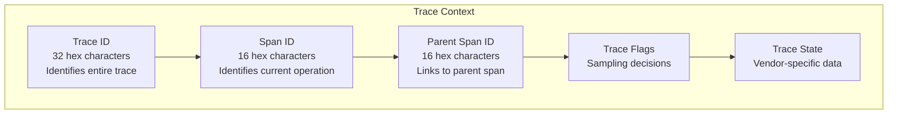
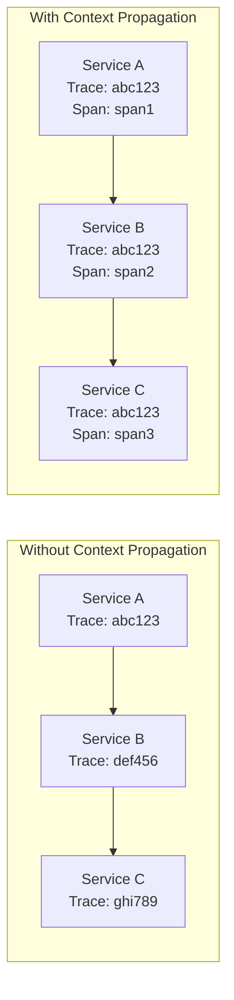
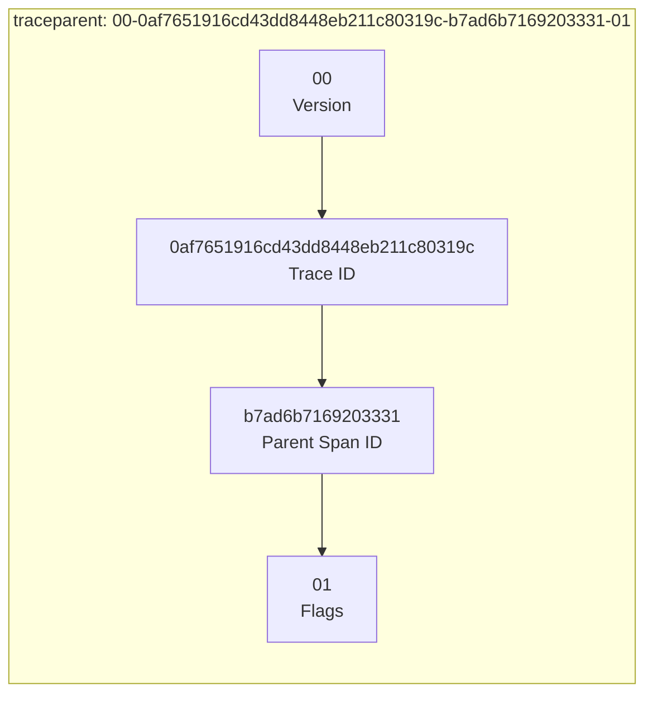
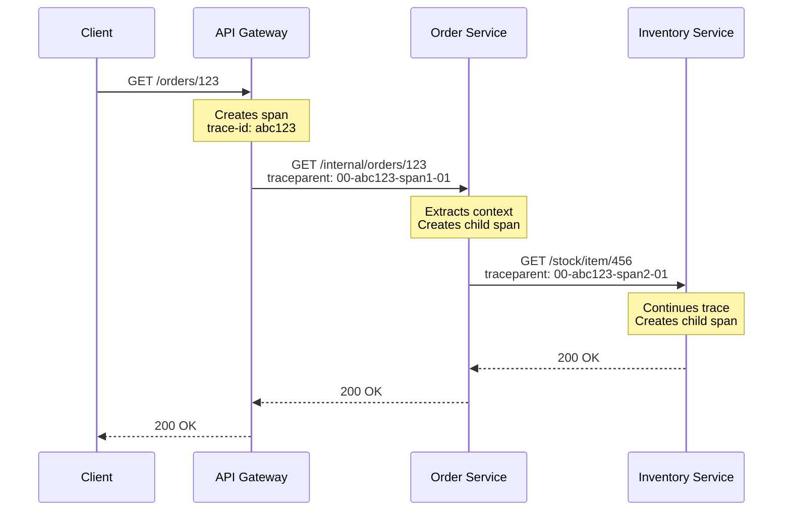
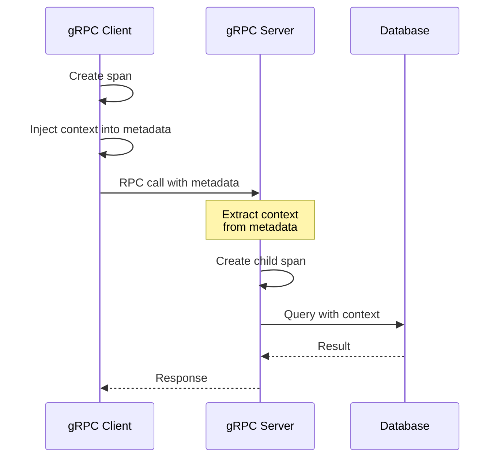
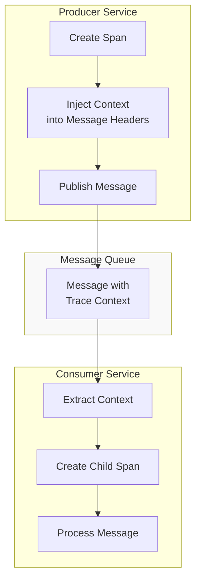
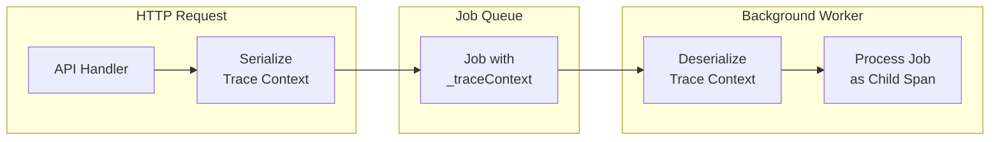

# How to Implement Distributed Tracing Context Propagation

Author: [nawazdhandala](https://github.com/nawazdhandala)

Tags: Distributed Tracing, Observability, OpenTelemetry, Microservices, Context Propagation, W3C Trace Context, Span Context

Description: A comprehensive guide to implementing distributed tracing context propagation across microservices. Learn W3C Trace Context standards, propagation patterns for HTTP, gRPC, and message queues, and best practices for maintaining trace continuity.

---

In modern microservices architectures, a single user request can traverse dozens of services before completing. Without proper context propagation, you lose visibility into how requests flow through your system. Distributed tracing context propagation is the mechanism that connects all the pieces together, allowing you to follow a request from its origin through every service it touches.

This guide covers everything you need to know about implementing context propagation effectively, from understanding the underlying standards to practical implementation patterns across different communication protocols.

## Understanding Trace Context

Before diving into implementation, it is essential to understand what trace context contains and why it matters.

### The Anatomy of Trace Context

Trace context consists of several key components that work together to maintain trace continuity across service boundaries.



The trace context carries:

- **Trace ID**: A globally unique identifier that remains constant across all spans in a trace
- **Span ID**: Identifies the current operation within the trace
- **Parent Span ID**: Links the current span to its parent, establishing the hierarchy
- **Trace Flags**: Contains sampling decisions and other control information
- **Trace State**: Carries vendor-specific trace data without breaking interoperability

### Why Context Propagation Matters

Without context propagation, each service creates isolated traces that cannot be connected. This makes it impossible to understand end-to-end latency, identify bottlenecks, or correlate errors across service boundaries.



## W3C Trace Context Standard

The W3C Trace Context specification defines a standard format for propagating trace context. OpenTelemetry uses this standard by default, ensuring interoperability between different tracing systems.

### The traceparent Header

The `traceparent` header is the primary carrier of trace context. It uses a compact, hyphen-delimited format.



Each component has a specific format:

- **Version**: 2 hex digits, currently always "00"
- **Trace ID**: 32 lowercase hex characters (16 bytes)
- **Parent Span ID**: 16 lowercase hex characters (8 bytes)
- **Flags**: 2 hex digits encoding trace flags (01 = sampled)

### The tracestate Header

The `tracestate` header carries vendor-specific trace data. It is a comma-separated list of key-value pairs.

```
tracestate: vendor1=value1,vendor2=value2
```

This header allows different tracing systems to coexist while maintaining interoperability. Each vendor can store its own trace metadata without affecting others.

## Core OpenTelemetry Setup

Before implementing context propagation, you need a properly configured OpenTelemetry setup. This configuration serves as the foundation for all tracing operations.

The following configuration creates a tracer provider with W3C Trace Context propagation enabled. This setup works for any language but is shown here in TypeScript for clarity.

```typescript
// otel-config.ts
// Core OpenTelemetry configuration with W3C Trace Context propagation
// This module should be imported before any other application code

import { NodeSDK } from '@opentelemetry/sdk-node';
import { Resource } from '@opentelemetry/resources';
import {
  SEMRESATTRS_SERVICE_NAME,
  SEMRESATTRS_SERVICE_VERSION,
  SEMRESATTRS_DEPLOYMENT_ENVIRONMENT
} from '@opentelemetry/semantic-conventions';
import { OTLPTraceExporter } from '@opentelemetry/exporter-trace-otlp-http';
import { BatchSpanProcessor } from '@opentelemetry/sdk-trace-base';
import {
  W3CTraceContextPropagator,
  W3CBaggagePropagator,
  CompositePropagator
} from '@opentelemetry/core';
import { getNodeAutoInstrumentations } from '@opentelemetry/auto-instrumentations-node';

export function initializeTracing(serviceName: string): NodeSDK {
  // Create the OTLP exporter pointing to your collector
  const exporter = new OTLPTraceExporter({
    url: process.env.OTEL_EXPORTER_OTLP_ENDPOINT || 'http://localhost:4318/v1/traces',
  });

  // Configure composite propagator for both trace context and baggage
  // This allows propagating additional metadata alongside trace context
  const propagator = new CompositePropagator({
    propagators: [
      new W3CTraceContextPropagator(),
      new W3CBaggagePropagator(),
    ],
  });

  // Initialize the SDK with all necessary components
  const sdk = new NodeSDK({
    resource: new Resource({
      [SEMRESATTRS_SERVICE_NAME]: serviceName,
      [SEMRESATTRS_SERVICE_VERSION]: process.env.SERVICE_VERSION || '1.0.0',
      [SEMRESATTRS_DEPLOYMENT_ENVIRONMENT]: process.env.NODE_ENV || 'development',
    }),
    spanProcessor: new BatchSpanProcessor(exporter, {
      maxQueueSize: 2048,
      maxExportBatchSize: 512,
      scheduledDelayMillis: 5000,
    }),
    textMapPropagator: propagator,
    instrumentations: [getNodeAutoInstrumentations()],
  });

  sdk.start();

  // Ensure graceful shutdown
  process.on('SIGTERM', async () => {
    await sdk.shutdown();
    process.exit(0);
  });

  return sdk;
}
```

## HTTP Context Propagation

HTTP is the most common protocol for inter-service communication. OpenTelemetry provides automatic instrumentation for most HTTP libraries, but understanding manual propagation is crucial for edge cases.

### Automatic HTTP Propagation

With auto-instrumentation enabled, trace context propagates automatically through HTTP headers. The instrumentation intercepts outgoing requests and injects the `traceparent` header.



The following example shows how auto-instrumentation handles context propagation transparently.

```typescript
// service-a.ts
// API Gateway service demonstrating automatic context propagation
// Auto-instrumentation handles header injection for fetch/axios calls

import './otel-config'; // Initialize tracing first
import express, { Request, Response } from 'express';
import { trace, SpanStatusCode } from '@opentelemetry/api';

const app = express();
const tracer = trace.getTracer('api-gateway');

// This endpoint demonstrates automatic propagation
// No manual header injection needed - auto-instrumentation handles it
app.get('/orders/:id', async (req: Request, res: Response) => {
  const span = trace.getActiveSpan();

  if (span) {
    // Add business context to the span
    span.setAttribute('order.id', req.params.id);
    span.setAttribute('http.route', '/orders/:id');
  }

  try {
    // Fetch from order service
    // traceparent header is automatically injected
    const orderResponse = await fetch(
      `http://order-service:3001/orders/${req.params.id}`
    );

    if (!orderResponse.ok) {
      throw new Error(`Order service returned ${orderResponse.status}`);
    }

    const order = await orderResponse.json();

    // Fetch from user service for additional data
    // Context continues to propagate
    const userResponse = await fetch(
      `http://user-service:3002/users/${order.userId}`
    );

    const user = await userResponse.json();

    res.json({ order, user });
  } catch (error) {
    if (span) {
      span.recordException(error as Error);
      span.setStatus({ code: SpanStatusCode.ERROR });
    }
    res.status(500).json({ error: (error as Error).message });
  }
});

app.listen(3000, () => {
  console.log('API Gateway listening on port 3000');
});
```

### Manual HTTP Context Propagation

When auto-instrumentation is not available or you need fine-grained control, manual propagation gives you complete control over the process.

```typescript
// manual-http-propagation.ts
// Manual context propagation for custom HTTP clients
// Use this when auto-instrumentation cannot handle your use case

import {
  trace,
  context,
  propagation,
  SpanStatusCode,
  Span
} from '@opentelemetry/api';

interface HttpRequestOptions {
  method?: string;
  headers?: Record<string, string>;
  body?: string;
}

// Helper function that manually injects trace context
// This is useful for custom HTTP clients or edge cases
async function tracedFetch(
  url: string,
  options: HttpRequestOptions = {}
): Promise<Response> {
  const tracer = trace.getTracer('http-client');
  const parsedUrl = new URL(url);

  // Create a span for this outgoing request
  return tracer.startActiveSpan(
    `HTTP ${options.method || 'GET'} ${parsedUrl.hostname}`,
    async (span: Span) => {
      // Initialize headers object
      const headers: Record<string, string> = { ...options.headers };

      // Inject trace context into the headers
      // This adds traceparent and tracestate headers
      propagation.inject(context.active(), headers);

      // Set semantic attributes for the span
      span.setAttributes({
        'http.method': options.method || 'GET',
        'http.url': url,
        'http.target': parsedUrl.pathname,
        'net.peer.name': parsedUrl.hostname,
        'net.peer.port': parsedUrl.port || '443',
      });

      try {
        const response = await fetch(url, {
          ...options,
          headers
        });

        // Record response information
        span.setAttribute('http.status_code', response.status);

        if (!response.ok) {
          span.setStatus({
            code: SpanStatusCode.ERROR,
            message: `HTTP ${response.status}`
          });
        } else {
          span.setStatus({ code: SpanStatusCode.OK });
        }

        return response;
      } catch (error) {
        span.recordException(error as Error);
        span.setStatus({
          code: SpanStatusCode.ERROR,
          message: (error as Error).message
        });
        throw error;
      } finally {
        span.end();
      }
    }
  );
}

// Usage example showing manual propagation in action
async function fetchOrderWithRetry(orderId: string): Promise<object> {
  const maxRetries = 3;
  let lastError: Error | null = null;

  for (let attempt = 1; attempt <= maxRetries; attempt++) {
    try {
      const response = await tracedFetch(
        `http://order-service:3001/orders/${orderId}`,
        { method: 'GET' }
      );
      return await response.json();
    } catch (error) {
      lastError = error as Error;
      // Exponential backoff
      await new Promise(resolve =>
        setTimeout(resolve, Math.pow(2, attempt) * 100)
      );
    }
  }

  throw lastError;
}
```

### Extracting Context on the Server Side

The receiving service must extract the trace context from incoming requests. Auto-instrumentation handles this automatically, but manual extraction is sometimes necessary.

```typescript
// context-extraction.ts
// Manual context extraction for incoming HTTP requests
// Useful when auto-instrumentation is not available

import {
  trace,
  context,
  propagation,
  ROOT_CONTEXT,
  SpanKind
} from '@opentelemetry/api';
import { Request, Response, NextFunction } from 'express';

// Middleware that extracts trace context from incoming requests
// Use this when you need manual control over context extraction
function traceContextMiddleware(
  req: Request,
  res: Response,
  next: NextFunction
): void {
  const tracer = trace.getTracer('http-server');

  // Extract trace context from incoming headers
  // This reads traceparent and tracestate headers
  const parentContext = propagation.extract(ROOT_CONTEXT, req.headers);

  // Create a new span as a child of the extracted context
  const span = tracer.startSpan(
    `${req.method} ${req.path}`,
    {
      kind: SpanKind.SERVER,
      attributes: {
        'http.method': req.method,
        'http.url': req.url,
        'http.target': req.path,
        'http.user_agent': req.get('user-agent'),
      },
    },
    parentContext
  );

  // Set the span in the active context
  const ctx = trace.setSpan(parentContext, span);

  // Store context for later use
  (req as any).otelContext = ctx;
  (req as any).otelSpan = span;

  // Ensure span ends when response finishes
  res.on('finish', () => {
    span.setAttribute('http.status_code', res.statusCode);
    if (res.statusCode >= 400) {
      span.setStatus({
        code: SpanStatusCode.ERROR,
        message: `HTTP ${res.statusCode}`
      });
    }
    span.end();
  });

  // Run the rest of the request in the extracted context
  context.with(ctx, () => next());
}
```

## gRPC Context Propagation

gRPC uses metadata (similar to HTTP headers) for context propagation. OpenTelemetry provides automatic instrumentation for gRPC, but understanding the underlying mechanism is valuable.

### gRPC Propagation Flow



### gRPC Client Implementation

The following example demonstrates manual context injection for gRPC clients when auto-instrumentation is insufficient.

```typescript
// grpc-client.ts
// gRPC client with manual context propagation
// Demonstrates how to inject trace context into gRPC metadata

import * as grpc from '@grpc/grpc-js';
import {
  trace,
  context,
  propagation,
  SpanStatusCode,
  SpanKind
} from '@opentelemetry/api';

// Custom carrier for gRPC metadata
// Maps OpenTelemetry's TextMap interface to gRPC Metadata
const grpcMetadataGetter = {
  get(carrier: grpc.Metadata, key: string): string | undefined {
    const values = carrier.get(key);
    return values.length > 0 ? values[0].toString() : undefined;
  },
  keys(carrier: grpc.Metadata): string[] {
    return Object.keys(carrier.getMap());
  },
};

const grpcMetadataSetter = {
  set(carrier: grpc.Metadata, key: string, value: string): void {
    carrier.set(key, value);
  },
};

// Wrapper function for traced gRPC calls
// Handles span creation and context propagation
async function tracedGrpcCall<T>(
  serviceName: string,
  methodName: string,
  callFn: (metadata: grpc.Metadata) => Promise<T>
): Promise<T> {
  const tracer = trace.getTracer('grpc-client');

  return tracer.startActiveSpan(
    `grpc.${serviceName}/${methodName}`,
    { kind: SpanKind.CLIENT },
    async (span) => {
      const metadata = new grpc.Metadata();

      // Inject trace context into gRPC metadata
      propagation.inject(context.active(), metadata, grpcMetadataSetter);

      span.setAttributes({
        'rpc.system': 'grpc',
        'rpc.service': serviceName,
        'rpc.method': methodName,
      });

      try {
        const result = await callFn(metadata);
        span.setStatus({ code: SpanStatusCode.OK });
        return result;
      } catch (error) {
        const grpcError = error as grpc.ServiceError;
        span.setAttributes({
          'rpc.grpc.status_code': grpcError.code,
        });
        span.recordException(grpcError);
        span.setStatus({ code: SpanStatusCode.ERROR });
        throw error;
      } finally {
        span.end();
      }
    }
  );
}

// Example usage with a hypothetical OrderService
interface Order {
  id: string;
  userId: string;
  items: string[];
}

async function getOrder(orderId: string): Promise<Order> {
  return tracedGrpcCall('OrderService', 'GetOrder', (metadata) => {
    return new Promise((resolve, reject) => {
      // Assuming orderClient is a generated gRPC client
      orderClient.getOrder(
        { orderId },
        metadata,
        (error: grpc.ServiceError | null, response: Order) => {
          if (error) {
            reject(error);
          } else {
            resolve(response);
          }
        }
      );
    });
  });
}
```

### gRPC Server Implementation

The server side extracts context from incoming metadata and creates child spans.

```typescript
// grpc-server.ts
// gRPC server with context extraction
// Demonstrates how to extract and use trace context from incoming calls

import * as grpc from '@grpc/grpc-js';
import {
  trace,
  context,
  propagation,
  ROOT_CONTEXT,
  SpanStatusCode,
  SpanKind
} from '@opentelemetry/api';

// Extract trace context from gRPC metadata
function extractContextFromMetadata(
  metadata: grpc.Metadata
): typeof ROOT_CONTEXT {
  const carrier: Record<string, string> = {};

  // Convert gRPC metadata to a plain object for extraction
  const metadataMap = metadata.getMap();
  for (const [key, value] of Object.entries(metadataMap)) {
    if (typeof value === 'string') {
      carrier[key] = value;
    } else if (Buffer.isBuffer(value)) {
      carrier[key] = value.toString();
    }
  }

  return propagation.extract(ROOT_CONTEXT, carrier);
}

// Server implementation with tracing
const orderServiceImpl = {
  getOrder: async (
    call: grpc.ServerUnaryCall<{ orderId: string }, Order>,
    callback: grpc.sendUnaryData<Order>
  ) => {
    const tracer = trace.getTracer('order-service');

    // Extract trace context from incoming metadata
    const parentContext = extractContextFromMetadata(call.metadata);

    // Create span as child of extracted context
    const span = tracer.startSpan(
      'OrderService/GetOrder',
      {
        kind: SpanKind.SERVER,
        attributes: {
          'rpc.system': 'grpc',
          'rpc.service': 'OrderService',
          'rpc.method': 'GetOrder',
          'order.id': call.request.orderId,
        },
      },
      parentContext
    );

    // Run handler in the traced context
    await context.with(
      trace.setSpan(parentContext, span),
      async () => {
        try {
          // Perform database lookup
          const order = await tracer.startActiveSpan(
            'db.query.order',
            async (dbSpan) => {
              dbSpan.setAttribute('db.system', 'postgresql');
              dbSpan.setAttribute('db.operation', 'SELECT');

              const result = await db.orders.findById(call.request.orderId);
              dbSpan.end();
              return result;
            }
          );

          if (!order) {
            span.setStatus({
              code: SpanStatusCode.ERROR,
              message: 'Order not found'
            });
            callback({
              code: grpc.status.NOT_FOUND,
              message: 'Order not found',
            });
          } else {
            span.setStatus({ code: SpanStatusCode.OK });
            callback(null, order);
          }
        } catch (error) {
          span.recordException(error as Error);
          span.setStatus({ code: SpanStatusCode.ERROR });
          callback({
            code: grpc.status.INTERNAL,
            message: (error as Error).message,
          });
        } finally {
          span.end();
        }
      }
    );
  },
};
```

## Message Queue Context Propagation

Message queues introduce asynchronous communication where the producer and consumer run at different times. Context propagation across message queues requires embedding trace context in message headers or payload.

### Message Queue Propagation Architecture



### RabbitMQ Producer

The producer injects trace context into message headers before publishing.

```typescript
// rabbitmq-producer.ts
// RabbitMQ producer with trace context propagation
// Embeds trace context in message headers for downstream consumers

import * as amqp from 'amqplib';
import {
  trace,
  context,
  propagation,
  SpanStatusCode,
  SpanKind
} from '@opentelemetry/api';

interface OrderEvent {
  orderId: string;
  userId: string;
  items: Array<{ productId: string; quantity: number }>;
  totalAmount: number;
}

class TracedRabbitMQPublisher {
  private channel: amqp.Channel | null = null;
  private tracer = trace.getTracer('order-service');

  async connect(url: string): Promise<void> {
    const connection = await amqp.connect(url);
    this.channel = await connection.createChannel();

    // Declare exchanges and queues
    await this.channel.assertExchange('orders', 'topic', { durable: true });
  }

  // Publish an order event with trace context
  // The trace context allows consumers to continue the trace
  async publishOrderCreated(order: OrderEvent): Promise<void> {
    if (!this.channel) {
      throw new Error('Not connected to RabbitMQ');
    }

    await this.tracer.startActiveSpan(
      'rabbitmq.publish orders.created',
      {
        kind: SpanKind.PRODUCER,
        attributes: {
          'messaging.system': 'rabbitmq',
          'messaging.destination': 'orders',
          'messaging.destination_kind': 'exchange',
          'messaging.rabbitmq.routing_key': 'orders.created',
          'messaging.operation': 'publish',
          'order.id': order.orderId,
        },
      },
      async (span) => {
        // Create headers object for trace context injection
        const headers: Record<string, string> = {};
        propagation.inject(context.active(), headers);

        const message = Buffer.from(JSON.stringify({
          event: 'order.created',
          data: order,
          timestamp: new Date().toISOString(),
        }));

        try {
          // Publish with trace context in headers
          this.channel!.publish(
            'orders',
            'orders.created',
            message,
            {
              persistent: true,
              contentType: 'application/json',
              headers, // Trace context headers
              messageId: `order-${order.orderId}-${Date.now()}`,
            }
          );

          span.setStatus({ code: SpanStatusCode.OK });
        } catch (error) {
          span.recordException(error as Error);
          span.setStatus({ code: SpanStatusCode.ERROR });
          throw error;
        } finally {
          span.end();
        }
      }
    );
  }
}
```

### RabbitMQ Consumer

The consumer extracts trace context from message headers and creates a child span.

```typescript
// rabbitmq-consumer.ts
// RabbitMQ consumer with trace context extraction
// Continues the trace started by the producer

import * as amqp from 'amqplib';
import {
  trace,
  context,
  propagation,
  ROOT_CONTEXT,
  SpanStatusCode,
  SpanKind
} from '@opentelemetry/api';

class TracedRabbitMQConsumer {
  private channel: amqp.Channel | null = null;
  private tracer = trace.getTracer('notification-service');

  async connect(url: string): Promise<void> {
    const connection = await amqp.connect(url);
    this.channel = await connection.createChannel();

    // Set prefetch for load balancing
    await this.channel.prefetch(10);
  }

  async startConsuming(queue: string): Promise<void> {
    if (!this.channel) {
      throw new Error('Not connected to RabbitMQ');
    }

    await this.channel.assertQueue(queue, { durable: true });
    await this.channel.bindQueue(queue, 'orders', 'orders.created');

    this.channel.consume(queue, async (msg) => {
      if (!msg) return;

      // Extract trace context from message headers
      // The headers contain traceparent and tracestate
      const headers = msg.properties.headers || {};
      const parentContext = propagation.extract(ROOT_CONTEXT, headers);

      // Create processing span as child of the producer span
      const span = this.tracer.startSpan(
        'rabbitmq.consume orders.created',
        {
          kind: SpanKind.CONSUMER,
          attributes: {
            'messaging.system': 'rabbitmq',
            'messaging.destination': queue,
            'messaging.operation': 'process',
            'messaging.message_id': msg.properties.messageId,
          },
        },
        parentContext
      );

      // Process message within the traced context
      await context.with(
        trace.setSpan(parentContext, span),
        async () => {
          try {
            const content = JSON.parse(msg.content.toString());

            span.setAttribute('order.id', content.data.orderId);

            // Process the order event
            await this.processOrderCreated(content.data);

            span.setStatus({ code: SpanStatusCode.OK });
            this.channel!.ack(msg);
          } catch (error) {
            span.recordException(error as Error);
            span.setStatus({ code: SpanStatusCode.ERROR });

            // Requeue on failure for retry
            this.channel!.nack(msg, false, true);
          } finally {
            span.end();
          }
        }
      );
    });
  }

  private async processOrderCreated(order: any): Promise<void> {
    // Processing logic here
    // Any downstream calls will automatically include trace context
    await this.tracer.startActiveSpan(
      'send-order-confirmation-email',
      async (span) => {
        span.setAttribute('email.recipient', order.userId);
        // Send email logic
        span.end();
      }
    );
  }
}
```

### Kafka Context Propagation

Kafka requires similar handling but with its own header format.

```typescript
// kafka-propagation.ts
// Kafka producer and consumer with trace context propagation
// Handles Kafka's binary header format

import { Kafka, Producer, Consumer, EachMessagePayload } from 'kafkajs';
import {
  trace,
  context,
  propagation,
  ROOT_CONTEXT,
  SpanStatusCode,
  SpanKind
} from '@opentelemetry/api';

const kafka = new Kafka({
  clientId: 'traced-app',
  brokers: ['kafka:9092'],
});

class TracedKafkaClient {
  private producer: Producer;
  private consumer: Consumer;
  private tracer = trace.getTracer('kafka-client');

  constructor() {
    this.producer = kafka.producer();
    this.consumer = kafka.consumer({ groupId: 'traced-consumers' });
  }

  // Convert string headers to Kafka's Buffer format
  private stringToKafkaHeaders(
    headers: Record<string, string>
  ): Record<string, Buffer> {
    const kafkaHeaders: Record<string, Buffer> = {};
    for (const [key, value] of Object.entries(headers)) {
      kafkaHeaders[key] = Buffer.from(value);
    }
    return kafkaHeaders;
  }

  // Convert Kafka headers back to strings for extraction
  private kafkaHeadersToString(
    headers: Record<string, Buffer | string | undefined>
  ): Record<string, string> {
    const stringHeaders: Record<string, string> = {};
    for (const [key, value] of Object.entries(headers)) {
      if (Buffer.isBuffer(value)) {
        stringHeaders[key] = value.toString();
      } else if (typeof value === 'string') {
        stringHeaders[key] = value;
      }
    }
    return stringHeaders;
  }

  // Publish message with trace context
  async publish(topic: string, key: string, value: object): Promise<void> {
    await this.tracer.startActiveSpan(
      `kafka.publish ${topic}`,
      {
        kind: SpanKind.PRODUCER,
        attributes: {
          'messaging.system': 'kafka',
          'messaging.destination': topic,
          'messaging.kafka.message.key': key,
        },
      },
      async (span) => {
        const headers: Record<string, string> = {};
        propagation.inject(context.active(), headers);

        try {
          await this.producer.send({
            topic,
            messages: [{
              key,
              value: JSON.stringify(value),
              headers: this.stringToKafkaHeaders(headers),
            }],
          });

          span.setStatus({ code: SpanStatusCode.OK });
        } catch (error) {
          span.recordException(error as Error);
          span.setStatus({ code: SpanStatusCode.ERROR });
          throw error;
        } finally {
          span.end();
        }
      }
    );
  }

  // Consume messages with trace context extraction
  async consume(
    topic: string,
    handler: (data: object) => Promise<void>
  ): Promise<void> {
    await this.consumer.subscribe({ topic, fromBeginning: false });

    await this.consumer.run({
      eachMessage: async (payload: EachMessagePayload) => {
        const { topic, partition, message } = payload;

        // Extract trace context from Kafka headers
        const headers = this.kafkaHeadersToString(
          (message.headers as Record<string, Buffer>) || {}
        );
        const parentContext = propagation.extract(ROOT_CONTEXT, headers);

        const span = this.tracer.startSpan(
          `kafka.consume ${topic}`,
          {
            kind: SpanKind.CONSUMER,
            attributes: {
              'messaging.system': 'kafka',
              'messaging.destination': topic,
              'messaging.kafka.partition': partition,
              'messaging.kafka.message.key': message.key?.toString(),
            },
          },
          parentContext
        );

        await context.with(
          trace.setSpan(parentContext, span),
          async () => {
            try {
              const data = JSON.parse(message.value!.toString());
              await handler(data);
              span.setStatus({ code: SpanStatusCode.OK });
            } catch (error) {
              span.recordException(error as Error);
              span.setStatus({ code: SpanStatusCode.ERROR });
              throw error;
            } finally {
              span.end();
            }
          }
        );
      },
    });
  }
}
```

## Background Job Context Propagation

Background jobs present a unique challenge because they execute outside the original request context. You must serialize and store trace context with the job data.



```typescript
// background-jobs.ts
// Background job processing with trace context preservation
// Enables tracing across async job execution

import {
  trace,
  context,
  propagation,
  ROOT_CONTEXT,
  SpanStatusCode,
  SpanKind
} from '@opentelemetry/api';
import Queue from 'bull';

const jobQueue = new Queue('reports', 'redis://localhost:6379');
const tracer = trace.getTracer('job-service');

interface ReportJobData {
  reportId: string;
  userId: string;
  parameters: Record<string, any>;
  _traceContext?: Record<string, string>;
}

// Enqueue a job with trace context
// The trace context is serialized into the job data
async function enqueueReportJob(
  reportId: string,
  userId: string,
  parameters: Record<string, any>
): Promise<void> {
  await tracer.startActiveSpan(
    'enqueue-report-job',
    {
      kind: SpanKind.PRODUCER,
      attributes: {
        'job.type': 'report-generation',
        'report.id': reportId,
        'user.id': userId,
      },
    },
    async (span) => {
      // Serialize current trace context
      const traceContext: Record<string, string> = {};
      propagation.inject(context.active(), traceContext);

      const jobData: ReportJobData = {
        reportId,
        userId,
        parameters,
        _traceContext: traceContext,
      };

      try {
        await jobQueue.add('generate-report', jobData, {
          attempts: 3,
          backoff: {
            type: 'exponential',
            delay: 1000,
          },
        });

        span.setStatus({ code: SpanStatusCode.OK });
      } catch (error) {
        span.recordException(error as Error);
        span.setStatus({ code: SpanStatusCode.ERROR });
        throw error;
      } finally {
        span.end();
      }
    }
  );
}

// Process jobs with restored trace context
// The span becomes a child of the original request span
jobQueue.process('generate-report', async (job) => {
  const data = job.data as ReportJobData;

  // Restore trace context from job data
  const parentContext = data._traceContext
    ? propagation.extract(ROOT_CONTEXT, data._traceContext)
    : ROOT_CONTEXT;

  const span = tracer.startSpan(
    'process-report-job',
    {
      kind: SpanKind.CONSUMER,
      attributes: {
        'job.type': 'report-generation',
        'job.id': job.id?.toString(),
        'report.id': data.reportId,
        'user.id': data.userId,
      },
    },
    parentContext
  );

  await context.with(
    trace.setSpan(parentContext, span),
    async () => {
      try {
        // Generate the report
        // Any downstream operations will be part of this trace
        await tracer.startActiveSpan(
          'generate-report-content',
          async (contentSpan) => {
            await generateReportContent(data);
            contentSpan.end();
          }
        );

        // Save the report
        await tracer.startActiveSpan(
          'save-report',
          async (saveSpan) => {
            await saveReport(data.reportId);
            saveSpan.end();
          }
        );

        span.setStatus({ code: SpanStatusCode.OK });
      } catch (error) {
        span.recordException(error as Error);
        span.setStatus({ code: SpanStatusCode.ERROR });
        throw error;
      } finally {
        span.end();
      }
    }
  );
});
```

## Using Baggage for Cross-Service Data

While trace context handles span correlation, baggage allows you to propagate arbitrary key-value pairs across services. This is useful for data that multiple services need but should not be in every span attribute.

```typescript
// baggage-propagation.ts
// Baggage propagation for cross-service data sharing
// Useful for tenant IDs, feature flags, and request metadata

import {
  context,
  propagation,
  Baggage,
  baggageEntryMetadataFromString
} from '@opentelemetry/api';

// Set baggage in the current context
// This data will propagate to all downstream services
function setBaggage(key: string, value: string): typeof context {
  const currentBaggage = propagation.getBaggage(context.active())
    || propagation.createBaggage();

  const newBaggage = currentBaggage.setEntry(key, {
    value,
    metadata: baggageEntryMetadataFromString(''),
  });

  return propagation.setBaggage(context.active(), newBaggage);
}

// Get baggage value from current context
function getBaggage(key: string): string | undefined {
  const baggage = propagation.getBaggage(context.active());
  return baggage?.getEntry(key)?.value;
}

// Middleware that extracts baggage and makes it available
function baggageMiddleware(req: Request, res: Response, next: NextFunction) {
  // Extract baggage from incoming headers
  const baggage = propagation.getBaggage(context.active());

  if (baggage) {
    // Store commonly accessed values in request
    const tenantId = baggage.getEntry('tenant.id')?.value;
    const featureFlags = baggage.getEntry('feature.flags')?.value;

    (req as any).tenantId = tenantId;
    (req as any).featureFlags = featureFlags
      ? JSON.parse(featureFlags)
      : {};
  }

  next();
}

// Example: Setting baggage at the edge
async function handleRequest(req: Request, res: Response) {
  // Set tenant context that propagates everywhere
  const ctxWithBaggage = setBaggage('tenant.id', req.headers['x-tenant-id'] as string);

  await context.with(ctxWithBaggage, async () => {
    // All downstream calls will include tenant.id in baggage
    await processRequest(req);
  });
}
```

## Composite Propagation

In heterogeneous environments, you may need to support multiple propagation formats simultaneously. OpenTelemetry's CompositePropagator handles this elegantly.

```typescript
// composite-propagation.ts
// Support multiple propagation formats for interoperability
// Useful in environments with mixed tracing systems

import {
  CompositePropagator,
  W3CTraceContextPropagator,
  W3CBaggagePropagator
} from '@opentelemetry/core';
import {
  JaegerPropagator
} from '@opentelemetry/propagator-jaeger';
import {
  B3Propagator,
  B3InjectEncoding
} from '@opentelemetry/propagator-b3';

// Create a composite propagator that supports multiple formats
// This allows interoperability with different tracing systems
const compositePropagator = new CompositePropagator({
  propagators: [
    // W3C standard - primary format
    new W3CTraceContextPropagator(),
    new W3CBaggagePropagator(),

    // B3 format - for Zipkin compatibility
    new B3Propagator({
      injectEncoding: B3InjectEncoding.MULTI_HEADER,
    }),

    // Jaeger format - for legacy Jaeger systems
    new JaegerPropagator(),
  ],
});

// Headers injected will include:
// - traceparent, tracestate (W3C)
// - baggage (W3C Baggage)
// - x-b3-traceid, x-b3-spanid, x-b3-sampled (B3)
// - uber-trace-id (Jaeger)

// When extracting, the propagator tries each format
// until one successfully extracts context
```

## Best Practices

Following these best practices ensures reliable context propagation across your distributed system.

### 1. Initialize Tracing Early

Always initialize OpenTelemetry before importing other modules. This ensures auto-instrumentation can patch libraries before they are used.

```typescript
// Correct: Tracing initialized first
require('./tracing');
const express = require('express');

// Incorrect: Express imported before tracing
const express = require('express');
require('./tracing');
```

### 2. Always Propagate Context

Never break the context chain. If a service does not propagate context, all downstream traces become disconnected.

### 3. Use Semantic Conventions

Follow OpenTelemetry semantic conventions for consistent attribute naming across services.

```typescript
// Good: Using semantic conventions
span.setAttributes({
  'http.method': 'GET',
  'http.url': url,
  'http.status_code': 200,
});

// Avoid: Custom attribute names
span.setAttributes({
  'method': 'GET',
  'requestUrl': url,
  'statusCode': 200,
});
```

### 4. Handle Propagation Failures Gracefully

If context extraction fails, create a new root span rather than failing the request.

```typescript
let parentContext = propagation.extract(ROOT_CONTEXT, headers);

// If extraction produced no valid context, parentContext is ROOT_CONTEXT
// A new root trace will be started, which is acceptable
const span = tracer.startSpan('operation', {}, parentContext);
```

### 5. Sample Appropriately

Configure sampling to balance observability with cost. Not every trace needs to be collected.

```typescript
import { TraceIdRatioBasedSampler } from '@opentelemetry/sdk-trace-base';

// Sample 10% of traces in production
const sampler = new TraceIdRatioBasedSampler(0.1);
```

## Common Pitfalls and Solutions

| Pitfall | Solution |
|---------|----------|
| Broken traces across async boundaries | Use `context.with()` to propagate context |
| Missing context in message queues | Always inject context into message headers |
| Inconsistent service names | Centralize service name configuration |
| Context lost in thread pools | Pass context explicitly or use context-aware executors |
| Missing spans in error paths | Ensure spans end in `finally` blocks |

## Debugging Context Propagation Issues

When traces appear disconnected, use these debugging techniques:

```typescript
// Debug helper to log current context state
function debugContext(): void {
  const span = trace.getActiveSpan();
  const baggage = propagation.getBaggage(context.active());

  console.log('Active span:', span ? {
    traceId: span.spanContext().traceId,
    spanId: span.spanContext().spanId,
    isRecording: span.isRecording(),
  } : 'none');

  console.log('Baggage entries:', baggage ?
    Array.from(baggage.getAllEntries()).map(([k, v]) => `${k}=${v.value}`) :
    'none'
  );
}

// Verify headers contain trace context
function verifyHeaders(headers: Record<string, string>): void {
  console.log('traceparent:', headers['traceparent'] || 'MISSING');
  console.log('tracestate:', headers['tracestate'] || 'MISSING');
  console.log('baggage:', headers['baggage'] || 'MISSING');
}
```

## Summary

Distributed tracing context propagation is the foundation of observability in microservices architectures. By properly implementing context propagation across HTTP, gRPC, message queues, and background jobs, you gain complete visibility into how requests flow through your system.

Key takeaways:

- Use W3C Trace Context as the standard propagation format
- Leverage auto-instrumentation where possible
- Manually propagate context for unsupported libraries and message queues
- Serialize trace context with background job data
- Use baggage for cross-service data that should not be span attributes
- Support multiple propagation formats in heterogeneous environments

With proper context propagation in place, debugging distributed systems transforms from guesswork into systematic analysis. You can follow any request from its origin through every service it touches, understand where time is spent, and quickly identify the root cause of issues.
