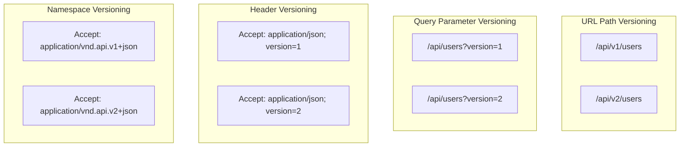
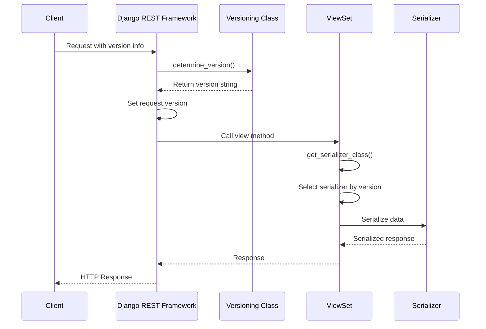

# How to Implement API Versioning in Django REST Framework

Author: [nawazdhandala](https://www.github.com/nawazdhandala)

Tags: Django, Django REST Framework, API Versioning, Python, REST API, Backend Development

Description: Learn how to implement API versioning in Django REST Framework using URL path, query parameter, header, and namespace approaches. This guide covers versioning strategies, configuration, version-specific views, and best practices for maintaining backward compatibility.

---

> API versioning is essential for evolving your API while maintaining backward compatibility. Django REST Framework provides built-in support for multiple versioning schemes, allowing you to choose the approach that best fits your needs.

When your API evolves, breaking changes are inevitable. Versioning lets you introduce new functionality without disrupting existing clients.

---

## Why Version Your API?

| Reason | Description |
|--------|-------------|
| **Backward Compatibility** | Old clients continue working with older versions |
| **Gradual Migration** | Clients migrate at their own pace |
| **Feature Isolation** | New features don't break existing integrations |
| **Documentation Clarity** | Clear separation between API generations |
| **Deprecation Control** | Sunset old versions on your schedule |

---

## Versioning Strategies Comparison



| Strategy | Pros | Cons | Best For |
|----------|------|------|----------|
| **URL Path** | Simple, cacheable, visible | Clutters URLs | Public APIs |
| **Query Parameter** | Easy to test | Not RESTful, cache issues | Internal APIs |
| **Header** | Clean URLs | Less visible | Mobile apps |
| **Namespace** | RESTful, flexible | Complex clients | Enterprise APIs |

---

## Project Setup

First, set up a Django project with Django REST Framework installed.

```bash
# Create project structure
pip install django djangorestframework
django-admin startproject myapi
cd myapi
python manage.py startapp products
```

Add DRF to your installed apps in settings.py.

```python
# myapi/settings.py
INSTALLED_APPS = [
    'django.contrib.admin',
    'django.contrib.auth',
    'django.contrib.contenttypes',
    'django.contrib.sessions',
    'django.contrib.messages',
    'django.contrib.staticfiles',
    'rest_framework',
    'products',
]
```

---

## URL Path Versioning

URL path versioning is the most common and visible approach. The version appears directly in the URL path.

### Configure DRF Settings

Add the versioning configuration to your Django settings file.

```python
# myapi/settings.py
REST_FRAMEWORK = {
    # Use URL path versioning (e.g., /api/v1/products/)
    'DEFAULT_VERSIONING_CLASS': 'rest_framework.versioning.URLPathVersioning',

    # Default version when none specified
    'DEFAULT_VERSION': 'v1',

    # Allowed versions
    'ALLOWED_VERSIONS': ['v1', 'v2', 'v3'],

    # URL parameter name (matches regex group)
    'VERSION_PARAM': 'version',
}
```

### Create Models

Define a simple Product model to demonstrate versioning across different API versions.

```python
# products/models.py
from django.db import models

class Product(models.Model):
    """Product model with fields that evolved across API versions"""

    # Original fields (v1)
    name = models.CharField(max_length=255)
    price = models.DecimalField(max_digits=10, decimal_places=2)

    # Added in v2
    description = models.TextField(blank=True, default='')
    sku = models.CharField(max_length=50, blank=True, default='')

    # Added in v3
    category = models.CharField(max_length=100, blank=True, default='')
    stock_quantity = models.IntegerField(default=0)
    is_active = models.BooleanField(default=True)

    created_at = models.DateTimeField(auto_now_add=True)
    updated_at = models.DateTimeField(auto_now=True)

    def __str__(self):
        return self.name
```

### Create Version-Specific Serializers

Create different serializers for each API version to control which fields are exposed.

```python
# products/serializers.py
from rest_framework import serializers
from .models import Product


class ProductSerializerV1(serializers.ModelSerializer):
    """
    Version 1 serializer - basic fields only.
    This was the original API release.
    """

    class Meta:
        model = Product
        fields = ['id', 'name', 'price', 'created_at']
        read_only_fields = ['id', 'created_at']


class ProductSerializerV2(serializers.ModelSerializer):
    """
    Version 2 serializer - adds description and SKU.
    Introduced for inventory management features.
    """

    # Computed field showing formatted price
    formatted_price = serializers.SerializerMethodField()

    class Meta:
        model = Product
        fields = [
            'id', 'name', 'price', 'formatted_price',
            'description', 'sku', 'created_at', 'updated_at'
        ]
        read_only_fields = ['id', 'created_at', 'updated_at', 'formatted_price']

    def get_formatted_price(self, obj):
        """Return price with currency symbol"""
        return f"${obj.price}"


class ProductSerializerV3(serializers.ModelSerializer):
    """
    Version 3 serializer - full feature set.
    Adds category, stock management, and active status.
    """

    formatted_price = serializers.SerializerMethodField()
    availability = serializers.SerializerMethodField()

    class Meta:
        model = Product
        fields = [
            'id', 'name', 'price', 'formatted_price',
            'description', 'sku', 'category',
            'stock_quantity', 'is_active', 'availability',
            'created_at', 'updated_at'
        ]
        read_only_fields = ['id', 'created_at', 'updated_at', 'formatted_price', 'availability']

    def get_formatted_price(self, obj):
        return f"${obj.price}"

    def get_availability(self, obj):
        """Return human-readable availability status"""
        if not obj.is_active:
            return "unavailable"
        if obj.stock_quantity > 10:
            return "in_stock"
        if obj.stock_quantity > 0:
            return "low_stock"
        return "out_of_stock"
```

### Create Version-Aware Views

Build views that automatically select the appropriate serializer based on the request version.

```python
# products/views.py
from rest_framework import viewsets, status
from rest_framework.response import Response
from rest_framework.decorators import action
from .models import Product
from .serializers import (
    ProductSerializerV1,
    ProductSerializerV2,
    ProductSerializerV3,
)


class ProductViewSet(viewsets.ModelViewSet):
    """
    Version-aware ViewSet that selects serializer based on API version.

    Supported versions:
    - v1: Basic product info (name, price)
    - v2: Adds description, SKU, formatted price
    - v3: Full features with stock and availability
    """

    queryset = Product.objects.all()

    def get_serializer_class(self):
        """
        Return the appropriate serializer class based on request version.
        Falls back to v1 if version is not recognized.
        """
        version = self.request.version

        if version == 'v3':
            return ProductSerializerV3
        elif version == 'v2':
            return ProductSerializerV2
        else:
            # Default to v1 for backward compatibility
            return ProductSerializerV1

    def get_queryset(self):
        """
        Version-specific queryset filtering.
        V3 can filter by active status, earlier versions return all.
        """
        queryset = Product.objects.all()

        # V3 supports filtering inactive products
        if self.request.version == 'v3':
            show_inactive = self.request.query_params.get('show_inactive', 'false')
            if show_inactive.lower() != 'true':
                queryset = queryset.filter(is_active=True)

        return queryset.order_by('-created_at')

    @action(detail=False, methods=['get'])
    def summary(self, request):
        """
        Version-specific summary endpoint.
        Returns different statistics based on API version.
        """
        products = self.get_queryset()

        # Base summary for all versions
        summary = {
            'total_products': products.count(),
        }

        # V2 and V3 add price statistics
        if request.version in ['v2', 'v3']:
            from django.db.models import Avg, Min, Max
            stats = products.aggregate(
                avg_price=Avg('price'),
                min_price=Min('price'),
                max_price=Max('price'),
            )
            summary.update({
                'average_price': float(stats['avg_price'] or 0),
                'price_range': {
                    'min': float(stats['min_price'] or 0),
                    'max': float(stats['max_price'] or 0),
                }
            })

        # V3 adds stock information
        if request.version == 'v3':
            from django.db.models import Sum
            stock_stats = products.aggregate(
                total_stock=Sum('stock_quantity'),
            )
            in_stock = products.filter(stock_quantity__gt=0).count()
            summary.update({
                'total_stock': stock_stats['total_stock'] or 0,
                'products_in_stock': in_stock,
                'products_out_of_stock': products.count() - in_stock,
            })

        return Response(summary)
```

### Configure URL Routing

Set up URL patterns with version prefixes in the path.

```python
# products/urls.py
from django.urls import path, include
from rest_framework.routers import DefaultRouter
from .views import ProductViewSet

router = DefaultRouter()
router.register(r'products', ProductViewSet)

urlpatterns = [
    path('', include(router.urls)),
]
```

```python
# myapi/urls.py
from django.contrib import admin
from django.urls import path, include, re_path

urlpatterns = [
    path('admin/', admin.site.urls),

    # Versioned API endpoints
    # Matches: /api/v1/, /api/v2/, /api/v3/
    re_path(
        r'^api/(?P<version>(v1|v2|v3))/',
        include('products.urls')
    ),
]
```

### Testing URL Path Versioning

Test different API versions using curl or your preferred HTTP client.

```bash
# V1 returns basic fields
curl http://localhost:8000/api/v1/products/
# Response: [{"id": 1, "name": "Widget", "price": "29.99", "created_at": "..."}]

# V2 returns additional fields
curl http://localhost:8000/api/v2/products/
# Response: [{"id": 1, "name": "Widget", "price": "29.99", "formatted_price": "$29.99", "description": "...", "sku": "..."}]

# V3 returns full data with availability
curl http://localhost:8000/api/v3/products/
# Response: [{"id": 1, ..., "stock_quantity": 50, "availability": "in_stock"}]
```

---

## Query Parameter Versioning

Query parameter versioning passes the version as a URL query parameter.

### Configure Query Parameter Versioning

Update your DRF settings to use query parameter versioning.

```python
# myapi/settings.py
REST_FRAMEWORK = {
    'DEFAULT_VERSIONING_CLASS': 'rest_framework.versioning.QueryParameterVersioning',
    'DEFAULT_VERSION': 'v1',
    'ALLOWED_VERSIONS': ['v1', 'v2', 'v3'],
    'VERSION_PARAM': 'version',  # ?version=v1
}
```

### Simplified URL Configuration

With query parameter versioning, URLs don't need version prefixes.

```python
# myapi/urls.py
from django.contrib import admin
from django.urls import path, include

urlpatterns = [
    path('admin/', admin.site.urls),

    # No version in URL path
    path('api/', include('products.urls')),
]
```

### Testing Query Parameter Versioning

Pass the version as a query parameter in your requests.

```bash
# Default version (v1)
curl http://localhost:8000/api/products/

# Explicit v1
curl http://localhost:8000/api/products/?version=v1

# Request v2
curl http://localhost:8000/api/products/?version=v2

# Request v3
curl http://localhost:8000/api/products/?version=v3
```

---

## Header Versioning

Header versioning uses HTTP headers to specify the API version, keeping URLs clean.

### Configure Accept Header Versioning

Set up DRF to read the version from the Accept header.

```python
# myapi/settings.py
REST_FRAMEWORK = {
    'DEFAULT_VERSIONING_CLASS': 'rest_framework.versioning.AcceptHeaderVersioning',
    'DEFAULT_VERSION': 'v1',
    'ALLOWED_VERSIONS': ['v1', 'v2', 'v3'],
    'VERSION_PARAM': 'version',
}
```

### Testing Header Versioning

Include the version in the Accept header of your HTTP requests.

```bash
# V1 via Accept header
curl -H "Accept: application/json; version=v1" \
     http://localhost:8000/api/products/

# V2 via Accept header
curl -H "Accept: application/json; version=v2" \
     http://localhost:8000/api/products/

# V3 via Accept header
curl -H "Accept: application/json; version=v3" \
     http://localhost:8000/api/products/
```

---

## Namespace Versioning

Namespace versioning uses vendor media types in the Accept header for a more RESTful approach.

### Configure Namespace Versioning

Set up DRF to parse vendor media types from the Accept header.

```python
# myapi/settings.py
REST_FRAMEWORK = {
    'DEFAULT_VERSIONING_CLASS': 'rest_framework.versioning.NamespaceVersioning',
    'DEFAULT_VERSION': 'v1',
    'ALLOWED_VERSIONS': ['v1', 'v2', 'v3'],
}
```

### URL Configuration for Namespace Versioning

Define separate namespaces for each version in your URL configuration.

```python
# myapi/urls.py
from django.contrib import admin
from django.urls import path, include

urlpatterns = [
    path('admin/', admin.site.urls),

    # Each version has its own namespace
    path('api/v1/', include('products.urls', namespace='v1')),
    path('api/v2/', include('products.urls', namespace='v2')),
    path('api/v3/', include('products.urls', namespace='v3')),
]
```

```python
# products/urls.py
from django.urls import path, include
from rest_framework.routers import DefaultRouter
from .views import ProductViewSet

# Support multiple app namespaces
app_name = 'products'

router = DefaultRouter()
router.register(r'products', ProductViewSet, basename='product')

urlpatterns = [
    path('', include(router.urls)),
]
```

### Testing Namespace Versioning

Use vendor media types in the Accept header to specify the version.

```bash
# V1 using vendor media type
curl -H "Accept: application/vnd.myapi.v1+json" \
     http://localhost:8000/api/v1/products/

# V2 using vendor media type
curl -H "Accept: application/vnd.myapi.v2+json" \
     http://localhost:8000/api/v2/products/
```

---

## Custom Versioning Scheme

Create a custom versioning class when built-in options do not meet your requirements.

```python
# products/versioning.py
from rest_framework.versioning import BaseVersioning
from rest_framework.exceptions import APIException


class InvalidVersion(APIException):
    """Custom exception for invalid API versions"""
    status_code = 400
    default_detail = 'Invalid API version specified.'
    default_code = 'invalid_version'


class CustomHeaderVersioning(BaseVersioning):
    """
    Custom versioning that reads from X-API-Version header.
    Supports version aliases and deprecation warnings.
    """

    # Version aliases for flexibility
    VERSION_ALIASES = {
        'latest': 'v3',
        'stable': 'v2',
        'legacy': 'v1',
    }

    # Deprecated versions that still work but warn
    DEPRECATED_VERSIONS = {'v1'}

    def determine_version(self, request, *args, **kwargs):
        """
        Extract and validate version from X-API-Version header.
        Returns the resolved version string.
        """
        # Get version from custom header
        version = request.META.get('HTTP_X_API_VERSION', self.default_version)

        # Handle aliases
        version = self.VERSION_ALIASES.get(version, version)

        # Validate version
        if version not in self.allowed_versions:
            raise InvalidVersion(
                detail=f"Version '{version}' is not supported. "
                       f"Allowed versions: {', '.join(self.allowed_versions)}"
            )

        # Track deprecation (for logging/metrics)
        if version in self.DEPRECATED_VERSIONS:
            request._deprecated_version = True

        return version

    def reverse(self, viewname, args=None, kwargs=None, request=None, format=None, **extra):
        """
        Generate URL for a given view.
        Used by DRF's reverse function.
        """
        from django.urls import reverse

        url = reverse(viewname, args=args, kwargs=kwargs, **extra)

        if request and request.version:
            # Could append version info if needed
            pass

        return url
```

### Configure Custom Versioning

Use your custom versioning class in the DRF settings.

```python
# myapi/settings.py
REST_FRAMEWORK = {
    'DEFAULT_VERSIONING_CLASS': 'products.versioning.CustomHeaderVersioning',
    'DEFAULT_VERSION': 'v2',  # Default to stable
    'ALLOWED_VERSIONS': ['v1', 'v2', 'v3'],
}
```

### Deprecation Warning Middleware

Add middleware to warn clients about deprecated API versions.

```python
# products/middleware.py
from django.utils.deprecation import MiddlewareMixin


class VersionDeprecationMiddleware(MiddlewareMixin):
    """
    Add deprecation warnings to responses for old API versions.
    Helps clients know when to upgrade.
    """

    DEPRECATION_MESSAGES = {
        'v1': 'API v1 is deprecated and will be removed on 2025-06-01. Please migrate to v2 or v3.',
    }

    def process_response(self, request, response):
        """Add deprecation headers if using deprecated version"""

        # Check if request used a deprecated version
        if hasattr(request, '_deprecated_version') and request._deprecated_version:
            version = getattr(request, 'version', None)

            if version in self.DEPRECATION_MESSAGES:
                response['X-API-Deprecated'] = 'true'
                response['X-API-Deprecation-Message'] = self.DEPRECATION_MESSAGES[version]
                response['Sunset'] = '2025-06-01T00:00:00Z'

        return response
```

---

## Version-Specific Business Logic

Handle version differences in your business logic layer for more complex scenarios.

```python
# products/services.py
from typing import Dict, Any, List
from decimal import Decimal
from .models import Product


class ProductService:
    """
    Service layer with version-aware business logic.
    Encapsulates version differences outside of views.
    """

    def __init__(self, api_version: str):
        self.version = api_version

    def calculate_discount(self, product: Product, quantity: int) -> Dict[str, Any]:
        """
        Calculate discount based on API version capabilities.

        V1: No discounts
        V2: Volume discounts
        V3: Volume + category-based discounts
        """
        base_price = product.price * quantity
        discount = Decimal('0')
        discount_details = []

        if self.version == 'v1':
            # V1 returns simple calculation
            return {
                'total': float(base_price),
            }

        # V2+ volume discounts
        if quantity >= 100:
            discount = base_price * Decimal('0.15')
            discount_details.append({'type': 'volume', 'percent': 15})
        elif quantity >= 50:
            discount = base_price * Decimal('0.10')
            discount_details.append({'type': 'volume', 'percent': 10})
        elif quantity >= 10:
            discount = base_price * Decimal('0.05')
            discount_details.append({'type': 'volume', 'percent': 5})

        if self.version == 'v2':
            return {
                'subtotal': float(base_price),
                'discount': float(discount),
                'total': float(base_price - discount),
                'discount_applied': len(discount_details) > 0,
            }

        # V3 adds category discounts
        category_discounts = {
            'electronics': Decimal('0.05'),
            'clearance': Decimal('0.20'),
        }

        if product.category.lower() in category_discounts:
            category_discount = base_price * category_discounts[product.category.lower()]
            discount += category_discount
            discount_details.append({
                'type': 'category',
                'category': product.category,
                'percent': float(category_discounts[product.category.lower()] * 100)
            })

        return {
            'subtotal': float(base_price),
            'discount': float(discount),
            'total': float(base_price - discount),
            'discount_details': discount_details,
            'savings_percent': float((discount / base_price * 100)) if base_price else 0,
        }

    def search_products(self, query: str, filters: Dict[str, Any]) -> List[Product]:
        """
        Search products with version-specific filtering capabilities.
        """
        queryset = Product.objects.all()

        # All versions support name search
        if query:
            queryset = queryset.filter(name__icontains=query)

        # V2+ supports price range filtering
        if self.version in ['v2', 'v3']:
            if 'min_price' in filters:
                queryset = queryset.filter(price__gte=filters['min_price'])
            if 'max_price' in filters:
                queryset = queryset.filter(price__lte=filters['max_price'])

        # V3 supports category and stock filtering
        if self.version == 'v3':
            if 'category' in filters:
                queryset = queryset.filter(category__iexact=filters['category'])
            if 'in_stock' in filters and filters['in_stock']:
                queryset = queryset.filter(stock_quantity__gt=0)
            if not filters.get('include_inactive', False):
                queryset = queryset.filter(is_active=True)

        return list(queryset)
```

### Use Services in Views

Integrate the version-aware service into your API views.

```python
# products/views.py (additional methods)
from rest_framework.decorators import action
from rest_framework.response import Response
from .services import ProductService


class ProductViewSet(viewsets.ModelViewSet):
    # ... previous code ...

    @action(detail=True, methods=['post'])
    def calculate_price(self, request, pk=None):
        """
        Calculate price with discounts.
        Uses version-aware ProductService.
        """
        product = self.get_object()
        quantity = int(request.data.get('quantity', 1))

        # Create version-aware service
        service = ProductService(api_version=request.version)

        # Calculate with version-specific logic
        result = service.calculate_discount(product, quantity)

        return Response(result)

    @action(detail=False, methods=['get'])
    def search(self, request):
        """
        Search products with version-specific filtering.
        """
        query = request.query_params.get('q', '')
        filters = {
            'min_price': request.query_params.get('min_price'),
            'max_price': request.query_params.get('max_price'),
            'category': request.query_params.get('category'),
            'in_stock': request.query_params.get('in_stock', '').lower() == 'true',
            'include_inactive': request.query_params.get('include_inactive', '').lower() == 'true',
        }

        # Remove None values
        filters = {k: v for k, v in filters.items() if v is not None}

        service = ProductService(api_version=request.version)
        products = service.search_products(query, filters)

        serializer = self.get_serializer(products, many=True)
        return Response(serializer.data)
```

---

## Version Request Flow

Understanding how DRF processes versioned requests helps with debugging and customization.



---

## Testing Versioned APIs

Write comprehensive tests covering all API versions.

```python
# products/tests.py
from django.test import TestCase
from rest_framework.test import APITestCase, APIClient
from rest_framework import status
from decimal import Decimal
from .models import Product


class ProductVersioningTestCase(APITestCase):
    """Test suite for versioned Product API"""

    def setUp(self):
        """Create test products"""
        self.product = Product.objects.create(
            name='Test Widget',
            price=Decimal('29.99'),
            description='A test widget for testing',
            sku='TEST-001',
            category='electronics',
            stock_quantity=50,
            is_active=True,
        )
        self.client = APIClient()

    def test_v1_returns_basic_fields(self):
        """V1 should only return basic fields"""
        response = self.client.get('/api/v1/products/')

        self.assertEqual(response.status_code, status.HTTP_200_OK)

        product = response.data[0]

        # V1 fields should be present
        self.assertIn('id', product)
        self.assertIn('name', product)
        self.assertIn('price', product)
        self.assertIn('created_at', product)

        # V2+ fields should NOT be present
        self.assertNotIn('description', product)
        self.assertNotIn('sku', product)
        self.assertNotIn('formatted_price', product)

    def test_v2_returns_extended_fields(self):
        """V2 should return extended fields"""
        response = self.client.get('/api/v2/products/')

        self.assertEqual(response.status_code, status.HTTP_200_OK)

        product = response.data[0]

        # V2 fields should be present
        self.assertIn('description', product)
        self.assertIn('sku', product)
        self.assertIn('formatted_price', product)

        # V3 fields should NOT be present
        self.assertNotIn('stock_quantity', product)
        self.assertNotIn('availability', product)

    def test_v3_returns_full_fields(self):
        """V3 should return all fields"""
        response = self.client.get('/api/v3/products/')

        self.assertEqual(response.status_code, status.HTTP_200_OK)

        product = response.data[0]

        # All fields should be present
        self.assertIn('stock_quantity', product)
        self.assertIn('availability', product)
        self.assertIn('category', product)
        self.assertIn('is_active', product)

        # Check availability logic
        self.assertEqual(product['availability'], 'in_stock')

    def test_v3_filters_inactive_products(self):
        """V3 should filter inactive products by default"""
        # Create inactive product
        Product.objects.create(
            name='Inactive Widget',
            price=Decimal('19.99'),
            is_active=False,
        )

        # V3 should not include inactive
        response = self.client.get('/api/v3/products/')
        self.assertEqual(len(response.data), 1)

        # V3 with flag should include inactive
        response = self.client.get('/api/v3/products/?show_inactive=true')
        self.assertEqual(len(response.data), 2)

        # V1 returns all (no filtering)
        response = self.client.get('/api/v1/products/')
        self.assertEqual(len(response.data), 2)

    def test_invalid_version_returns_error(self):
        """Invalid version should return 404"""
        response = self.client.get('/api/v99/products/')

        self.assertEqual(response.status_code, status.HTTP_404_NOT_FOUND)

    def test_summary_endpoint_version_differences(self):
        """Summary endpoint should return version-specific data"""
        # V1 summary
        response = self.client.get('/api/v1/products/summary/')
        self.assertIn('total_products', response.data)
        self.assertNotIn('average_price', response.data)

        # V2 summary
        response = self.client.get('/api/v2/products/summary/')
        self.assertIn('average_price', response.data)
        self.assertNotIn('total_stock', response.data)

        # V3 summary
        response = self.client.get('/api/v3/products/summary/')
        self.assertIn('total_stock', response.data)
        self.assertIn('products_in_stock', response.data)


class HeaderVersioningTestCase(APITestCase):
    """Test header-based versioning"""

    def setUp(self):
        self.product = Product.objects.create(
            name='Test Product',
            price=Decimal('49.99'),
        )
        self.client = APIClient()

    def test_accept_header_versioning(self):
        """Test version selection via Accept header"""
        # Configure for header versioning in test
        with self.settings(REST_FRAMEWORK={
            'DEFAULT_VERSIONING_CLASS': 'rest_framework.versioning.AcceptHeaderVersioning',
            'DEFAULT_VERSION': 'v1',
            'ALLOWED_VERSIONS': ['v1', 'v2', 'v3'],
        }):
            response = self.client.get(
                '/api/products/',
                HTTP_ACCEPT='application/json; version=v2'
            )

            self.assertEqual(response.status_code, status.HTTP_200_OK)
```

---

## Best Practices

### 1. Document All Versions

Maintain clear documentation for each API version.

```python
# products/views.py
class ProductViewSet(viewsets.ModelViewSet):
    """
    API endpoint for managing products.

    Versions:
        - v1 (deprecated): Basic CRUD operations
        - v2 (stable): Adds filtering, search, descriptions
        - v3 (latest): Full feature set with inventory management

    Deprecation Schedule:
        - v1: Sunset 2025-06-01
    """
    pass
```

### 2. Use Semantic Versioning in Responses

Include version information in API responses.

```python
# products/views.py
from rest_framework.response import Response

class ProductViewSet(viewsets.ModelViewSet):

    def list(self, request, *args, **kwargs):
        response = super().list(request, *args, **kwargs)

        # Add version metadata
        return Response({
            'api_version': request.version,
            'count': len(response.data),
            'results': response.data,
        })
```

### 3. Version Your Error Responses

Keep error format consistent within versions but allow evolution.

```python
# products/exceptions.py
from rest_framework.views import exception_handler
from rest_framework.response import Response


def versioned_exception_handler(exc, context):
    """Custom exception handler with versioned error format"""
    response = exception_handler(exc, context)

    if response is not None:
        request = context.get('request')
        version = getattr(request, 'version', 'v1')

        if version == 'v1':
            # V1: Simple error format
            response.data = {
                'error': response.data.get('detail', str(response.data))
            }
        else:
            # V2+: Detailed error format
            response.data = {
                'error': {
                    'code': response.status_code,
                    'message': response.data.get('detail', 'An error occurred'),
                    'details': response.data if isinstance(response.data, dict) else None,
                },
                'api_version': version,
            }

    return response
```

### 4. Plan for Deprecation

Implement a clear deprecation strategy with advance notice.

```python
# products/decorators.py
import warnings
from functools import wraps
from rest_framework.response import Response


def deprecated_in_version(version, message=None, sunset_date=None):
    """
    Mark a view or action as deprecated in a specific version.
    """
    def decorator(func):
        @wraps(func)
        def wrapper(self, request, *args, **kwargs):
            response = func(self, request, *args, **kwargs)

            if request.version == version:
                deprecation_msg = message or f"This endpoint is deprecated in {version}"

                if hasattr(response, 'headers'):
                    response['X-Deprecated'] = 'true'
                    response['X-Deprecation-Message'] = deprecation_msg
                    if sunset_date:
                        response['Sunset'] = sunset_date

            return response
        return wrapper
    return decorator
```

---

## Conclusion

API versioning is crucial for maintaining backward compatibility while evolving your API. Key takeaways:

- **URL path versioning** is the most visible and cacheable approach
- **Header versioning** keeps URLs clean for internal APIs
- **Version-specific serializers** control field exposure per version
- **Service layer abstraction** handles business logic differences
- **Comprehensive tests** ensure all versions work correctly
- **Deprecation warnings** help clients plan migrations

Choose the versioning strategy that best fits your API consumers and maintainability needs.

---

*Need to monitor your Django REST Framework APIs in production? [OneUptime](https://oneuptime.com) provides comprehensive API monitoring with endpoint health checks, response time tracking, and alerting for versioned APIs.*

**Related Reading:**
- [How to Implement Rate Limiting in Django](https://oneuptime.com/blog/post/django-rate-limiting/view)
- [How to Add Background Tasks to Django](https://oneuptime.com/blog/post/2026-02-02-django-background-tasks/view)
