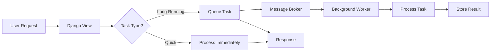
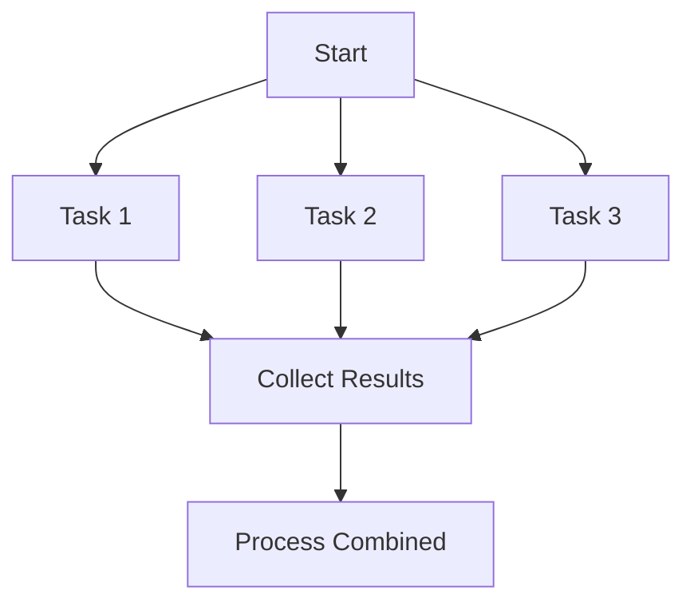
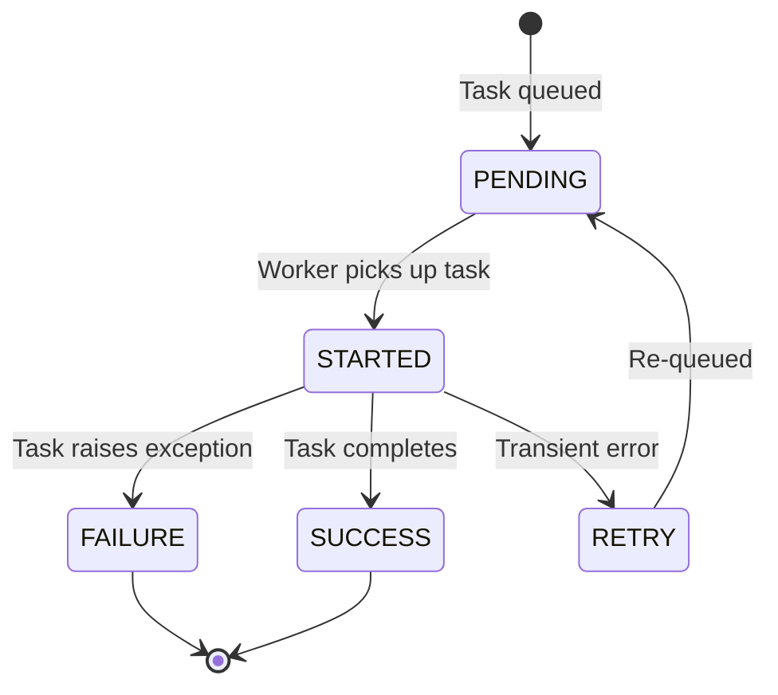

# How to Add Background Tasks to Django

Author: [nawazdhandala](https://www.github.com/nawazdhandala)

Tags: Django, Python, Background Tasks, Async, Celery, Django-Q, Django-RQ, Redis

Description: A comprehensive guide to implementing background tasks in Django applications. Learn multiple approaches including Celery, Django-Q, Django-RQ, and native async support with practical examples and production considerations.

---

> Web applications often need to handle tasks that take too long for a typical HTTP request. Background task processing lets your application stay responsive while heavy operations run asynchronously.

When a user uploads a large file, requests a complex report, or triggers an email campaign, making them wait for completion creates a poor experience. Background tasks solve this by moving work off the main request-response cycle.

---

## Why Background Tasks Matter

Django handles HTTP requests synchronously by default. Each request occupies a worker process until completion. Long-running operations block other users and risk timeouts.

Background tasks provide several benefits:

- **Better user experience** - Respond immediately, process later
- **Reliability** - Retry failed tasks automatically
- **Scalability** - Scale workers independently from web servers
- **Resource management** - Control concurrency and priorities



---

## Choosing the Right Approach

Django offers several options for background task processing, each with different trade-offs:

| Approach | Complexity | Use Case | Dependencies |
|----------|------------|----------|--------------|
| Celery | High | Production systems, complex workflows | Redis/RabbitMQ |
| Django-Q | Medium | Simpler setups, Django admin integration | Redis/Database |
| Django-RQ | Low | Simple queues, Redis already in use | Redis |
| Huey | Low | Lightweight needs, minimal setup | Redis/SQLite |
| Native async | Low | I/O-bound tasks, Django 4.1+ | None |

---

## Approach 1: Celery (Production Standard)

Celery is the most popular choice for Django background tasks. It handles complex workflows, scheduled tasks, and provides robust monitoring.

### Installation

Install Celery with Redis support. Redis serves as the message broker and result backend.

```bash
pip install celery[redis] django-celery-results django-celery-beat
```

### Project Configuration

Create the Celery application file in your project directory.

```python
# myproject/celery.py

import os
from celery import Celery

# Set the default Django settings module for Celery
os.environ.setdefault('DJANGO_SETTINGS_MODULE', 'myproject.settings')

# Create the Celery application instance
app = Celery('myproject')

# Load configuration from Django settings
# All Celery settings should be prefixed with CELERY_ in settings.py
app.config_from_object('django.conf:settings', namespace='CELERY')

# Auto-discover tasks from all installed Django apps
# Celery looks for a tasks.py file in each app directory
app.autodiscover_tasks()
```

Ensure Celery loads when Django starts.

```python
# myproject/__init__.py

# Import the Celery app so it initializes with Django
from .celery import app as celery_app

__all__ = ('celery_app',)
```

Add Celery settings to your Django configuration.

```python
# myproject/settings.py

INSTALLED_APPS = [
    # ... existing apps
    'django_celery_results',
    'django_celery_beat',
]

# Celery broker configuration - Redis is recommended for production
CELERY_BROKER_URL = 'redis://localhost:6379/0'

# Store task results in Django database for easy querying
CELERY_RESULT_BACKEND = 'django-db'

# Use JSON serialization for security (pickle can execute arbitrary code)
CELERY_ACCEPT_CONTENT = ['json']
CELERY_TASK_SERIALIZER = 'json'
CELERY_RESULT_SERIALIZER = 'json'

# Set timezone to match Django settings
CELERY_TIMEZONE = 'UTC'

# Track when tasks start executing, not just when they complete
CELERY_TASK_TRACK_STARTED = True

# Prevent workers from prefetching too many tasks at once
CELERY_WORKER_PREFETCH_MULTIPLIER = 1

# Acknowledge tasks after they complete, not when received
# This prevents task loss if a worker crashes mid-execution
CELERY_TASK_ACKS_LATE = True
```

### Creating Tasks

Tasks are decorated functions that run in the background worker.

```python
# myapp/tasks.py

from celery import shared_task
from django.core.mail import send_mail
from django.conf import settings
import logging

logger = logging.getLogger(__name__)


# The shared_task decorator registers this function with Celery
# It can be called from any Django app without circular imports
@shared_task
def send_notification_email(user_id, subject, message):
    """
    Send an email notification to a user.

    We pass user_id instead of the User object because:
    1. Task arguments must be JSON-serializable
    2. We want fresh data from the database when the task runs
    """
    from django.contrib.auth import get_user_model
    User = get_user_model()

    try:
        user = User.objects.get(id=user_id)

        send_mail(
            subject=subject,
            message=message,
            from_email=settings.DEFAULT_FROM_EMAIL,
            recipient_list=[user.email],
            fail_silently=False,
        )

        logger.info(f'Email sent to user {user_id}: {subject}')
        return {'status': 'sent', 'user_id': user_id}

    except User.DoesNotExist:
        logger.error(f'User {user_id} not found')
        return {'status': 'error', 'reason': 'user not found'}
```

### Calling Tasks

Queue tasks from views, signals, or management commands.

```python
# myapp/views.py

from django.http import JsonResponse
from django.views.decorators.http import require_POST
from .tasks import send_notification_email


@require_POST
def notify_user(request, user_id):
    """Queue a notification email for a user"""

    subject = request.POST.get('subject', 'Notification')
    message = request.POST.get('message', '')

    # delay() queues the task immediately and returns an AsyncResult
    # The task runs in a separate worker process
    result = send_notification_email.delay(user_id, subject, message)

    return JsonResponse({
        'status': 'queued',
        'task_id': result.id
    })
```

### Running Workers

Start workers to process queued tasks.

```bash
# Start a Celery worker with 4 concurrent processes
celery -A myproject worker --loglevel=info --concurrency=4

# Start the beat scheduler for periodic tasks
celery -A myproject beat --loglevel=info
```

---

## Approach 2: Django-Q (Django-Native)

Django-Q integrates tightly with Django and uses the Django ORM for scheduling and results. It requires less configuration than Celery.

### Installation

```bash
pip install django-q2
```

Note: Use `django-q2` which is the maintained fork of the original `django-q`.

### Configuration

Add Django-Q to your installed apps and configure the broker.

```python
# myproject/settings.py

INSTALLED_APPS = [
    # ... existing apps
    'django_q',
]

# Django-Q configuration dictionary
Q_CLUSTER = {
    # Name for this cluster of workers
    'name': 'myproject',

    # Number of worker processes
    'workers': 4,

    # Number of tasks a worker handles before recycling
    'recycle': 500,

    # Timeout in seconds for task execution
    'timeout': 60,

    # Use Redis as the message broker
    'redis': {
        'host': 'localhost',
        'port': 6379,
        'db': 0,
    }
}
```

For simpler setups, you can use Django ORM as the broker (no Redis required).

```python
# myproject/settings.py

Q_CLUSTER = {
    'name': 'myproject',
    'workers': 4,
    'timeout': 60,

    # Use Django ORM as broker - simpler but less performant
    'orm': 'default',
}
```

Run migrations to create the required tables.

```bash
python manage.py migrate django_q
```

### Creating and Calling Tasks

Django-Q tasks are regular Python functions.

```python
# myapp/tasks.py

from django.core.mail import send_mail
from django.conf import settings
import logging

logger = logging.getLogger(__name__)


def process_order(order_id):
    """
    Process an order after payment confirmation.

    Unlike Celery, Django-Q tasks don't need decorators.
    Any importable function can be queued as a task.
    """
    from .models import Order

    order = Order.objects.get(id=order_id)
    order.status = 'processing'
    order.save()

    # Perform order processing logic
    # ...

    order.status = 'completed'
    order.save()

    logger.info(f'Order {order_id} processed successfully')
    return order_id
```

Queue tasks using the async_task function.

```python
# myapp/views.py

from django.http import JsonResponse
from django_q.tasks import async_task, result


def start_order_processing(request, order_id):
    """Queue order processing as a background task"""

    # async_task returns a task ID immediately
    # The function runs in a Django-Q worker process
    task_id = async_task(
        'myapp.tasks.process_order',  # Dotted path to the function
        order_id,                       # Positional arguments
        task_name=f'process-order-{order_id}',  # Optional descriptive name
        hook='myapp.tasks.order_complete_hook',  # Called when task completes
    )

    return JsonResponse({
        'status': 'queued',
        'task_id': task_id
    })


def check_task_status(request, task_id):
    """Check the status of a queued task"""

    # result() returns the task result or None if not complete
    task_result = result(task_id, wait=0)

    if task_result is None:
        return JsonResponse({'status': 'pending'})

    return JsonResponse({
        'status': 'complete',
        'result': task_result
    })
```

### Scheduled Tasks

Django-Q provides a Django admin interface for scheduling recurring tasks.

```python
# myapp/tasks.py

def daily_cleanup():
    """Remove old records from the database"""
    from django.utils import timezone
    from datetime import timedelta
    from .models import TempFile

    cutoff = timezone.now() - timedelta(days=7)
    deleted_count, _ = TempFile.objects.filter(created_at__lt=cutoff).delete()

    return f'Deleted {deleted_count} temporary files'
```

Create schedules programmatically or through Django admin.

```python
# Create a schedule programmatically
from django_q.models import Schedule

Schedule.objects.create(
    func='myapp.tasks.daily_cleanup',
    schedule_type=Schedule.DAILY,
    repeats=-1,  # Repeat indefinitely
    next_run=timezone.now(),
)
```

### Running Workers

```bash
# Start Django-Q cluster (workers + scheduler)
python manage.py qcluster
```

---

## Approach 3: Django-RQ (Simple Redis Queues)

Django-RQ wraps Python RQ (Redis Queue) with Django integration. It provides a straightforward approach when you need basic background tasks without Celery's complexity.

### Installation

```bash
pip install django-rq
```

### Configuration

```python
# myproject/settings.py

INSTALLED_APPS = [
    # ... existing apps
    'django_rq',
]

# Define Redis queues with different priorities
RQ_QUEUES = {
    # Default queue for most tasks
    'default': {
        'HOST': 'localhost',
        'PORT': 6379,
        'DB': 0,
        'DEFAULT_TIMEOUT': 360,  # 6 minutes
    },

    # High priority queue for urgent tasks
    'high': {
        'HOST': 'localhost',
        'PORT': 6379,
        'DB': 0,
        'DEFAULT_TIMEOUT': 60,
    },

    # Low priority queue for batch jobs
    'low': {
        'HOST': 'localhost',
        'PORT': 6379,
        'DB': 0,
        'DEFAULT_TIMEOUT': 3600,  # 1 hour
    },
}
```

Add the RQ dashboard URL for monitoring.

```python
# myproject/urls.py

from django.urls import path, include

urlpatterns = [
    # ... existing urls
    path('django-rq/', include('django_rq.urls')),
]
```

### Creating and Calling Tasks

Use the @job decorator or queue tasks directly.

```python
# myapp/tasks.py

import django_rq
from django_rq import job
import logging

logger = logging.getLogger(__name__)


# The @job decorator marks this function as an RQ task
# Specify which queue to use (defaults to 'default')
@job('default')
def generate_report(report_id):
    """Generate a PDF report in the background"""
    from .models import Report
    from .services import PDFGenerator

    report = Report.objects.get(id=report_id)
    report.status = 'generating'
    report.save()

    try:
        pdf_path = PDFGenerator.create(report)
        report.status = 'complete'
        report.file_path = pdf_path
        report.save()

        logger.info(f'Report {report_id} generated at {pdf_path}')
        return pdf_path

    except Exception as e:
        report.status = 'failed'
        report.error = str(e)
        report.save()
        raise


# Queue tasks to specific queues based on priority
@job('high')
def send_urgent_alert(message):
    """Send an urgent alert immediately"""
    # Alert logic here
    pass


@job('low')
def cleanup_old_files():
    """Non-urgent maintenance task"""
    # Cleanup logic here
    pass
```

Call tasks from your views.

```python
# myapp/views.py

from django.http import JsonResponse
import django_rq
from .tasks import generate_report


def request_report(request, report_id):
    """Queue a report generation task"""

    # Method 1: Use the decorated function with delay()
    job = generate_report.delay(report_id)

    # Method 2: Get a queue and enqueue directly
    # queue = django_rq.get_queue('default')
    # job = queue.enqueue(generate_report, report_id)

    return JsonResponse({
        'status': 'queued',
        'job_id': job.id
    })


def check_report_status(request, job_id):
    """Check status of a report generation job"""

    queue = django_rq.get_queue('default')
    job = queue.fetch_job(job_id)

    if job is None:
        return JsonResponse({'status': 'not_found'}, status=404)

    return JsonResponse({
        'status': job.get_status(),
        'result': job.result if job.is_finished else None
    })
```

### Running Workers

```bash
# Start a worker for the default queue
python manage.py rqworker default

# Start workers for multiple queues (processes high priority first)
python manage.py rqworker high default low
```

---

## Approach 4: Huey (Lightweight Alternative)

Huey is a lightweight task queue that supports Redis and SQLite backends. It works well for smaller applications that do not need Celery's full feature set.

### Installation

```bash
pip install huey
```

### Configuration

```python
# myproject/settings.py

from huey import RedisHuey

# Create the Huey instance with Redis backend
HUEY = RedisHuey(
    name='myproject',
    host='localhost',
    port=6379,
    db=0,
)

INSTALLED_APPS = [
    # ... existing apps
    'huey.contrib.djhuey',
]
```

For development or simple deployments, use SQLite instead of Redis.

```python
# myproject/settings.py

from huey import SqliteHuey

# SQLite backend - no Redis required
HUEY = SqliteHuey(filename='huey.db')
```

### Creating and Calling Tasks

Huey uses decorators similar to Celery.

```python
# myapp/tasks.py

from huey.contrib.djhuey import task, periodic_task, db_task
from huey import crontab
import logging

logger = logging.getLogger(__name__)


# db_task automatically closes database connections after execution
# This prevents connection leaks in long-running workers
@db_task()
def process_upload(upload_id):
    """Process an uploaded file"""
    from .models import Upload

    upload = Upload.objects.get(id=upload_id)
    upload.status = 'processing'
    upload.save()

    # Processing logic here

    upload.status = 'complete'
    upload.save()

    logger.info(f'Upload {upload_id} processed')
    return upload_id


# periodic_task runs on a schedule (like Celery Beat)
@periodic_task(crontab(minute='0', hour='0'))
def nightly_maintenance():
    """Run maintenance tasks every night at midnight"""
    from .models import TempFile
    from django.utils import timezone
    from datetime import timedelta

    cutoff = timezone.now() - timedelta(days=1)
    TempFile.objects.filter(created_at__lt=cutoff).delete()


# Regular task without database connection management
@task()
def send_webhook(url, payload):
    """Send a webhook to an external service"""
    import requests

    response = requests.post(url, json=payload, timeout=30)
    return response.status_code
```

### Running Workers

```bash
# Start the Huey consumer (worker)
python manage.py run_huey
```

---

## Approach 5: Native Async (Django 4.1+)

Django 4.1 introduced native async view support. For I/O-bound tasks that do not require persistence or retries, you can use Python asyncio directly.

### Async Views

```python
# myapp/views.py

import asyncio
import httpx
from django.http import JsonResponse


async def fetch_external_data(request):
    """
    Fetch data from multiple external APIs concurrently.

    This is useful for I/O-bound operations where you need
    the results immediately in the response.
    """

    async with httpx.AsyncClient() as client:
        # Run multiple HTTP requests concurrently
        tasks = [
            client.get('https://api.example.com/users'),
            client.get('https://api.example.com/orders'),
            client.get('https://api.example.com/products'),
        ]

        # asyncio.gather runs all tasks concurrently
        responses = await asyncio.gather(*tasks)

    return JsonResponse({
        'users': responses[0].json(),
        'orders': responses[1].json(),
        'products': responses[2].json(),
    })
```

### Background Tasks with asyncio

For fire-and-forget async tasks within a request, use asyncio.create_task. Note that these tasks only run while the server process is active.

```python
# myapp/views.py

import asyncio
from django.http import JsonResponse

# Store for background tasks (in production, use a proper task queue)
background_tasks = set()


async def log_analytics_event(event_data):
    """Send analytics event to external service"""
    import httpx

    async with httpx.AsyncClient() as client:
        await client.post(
            'https://analytics.example.com/events',
            json=event_data,
            timeout=10
        )


async def handle_request(request):
    """Handle a request and fire off analytics in the background"""

    # Create a background task that runs independently
    task = asyncio.create_task(log_analytics_event({
        'event': 'page_view',
        'path': request.path,
        'user_id': request.user.id if request.user.is_authenticated else None,
    }))

    # Keep a reference to prevent garbage collection
    background_tasks.add(task)
    task.add_done_callback(background_tasks.discard)

    # Respond immediately without waiting for analytics
    return JsonResponse({'status': 'ok'})
```

### Limitations of Native Async

Native async works well for concurrent I/O but has limitations for background tasks:

- Tasks do not survive server restarts
- No built-in retry mechanism
- No task persistence or result storage
- No distributed processing across multiple servers

For production background task needs, use a dedicated task queue like Celery or Django-Q.

---

## Error Handling and Retries

Robust error handling is essential for production background tasks.

### Celery Retry Pattern

```python
# myapp/tasks.py

from celery import shared_task
from celery.exceptions import MaxRetriesExceededError
import requests
import logging

logger = logging.getLogger(__name__)


@shared_task(
    bind=True,
    max_retries=5,
    autoretry_for=(requests.RequestException,),
    retry_backoff=True,       # Exponential backoff: 1s, 2s, 4s, 8s, 16s
    retry_backoff_max=300,    # Maximum 5 minute delay
    retry_jitter=True,        # Add randomness to prevent thundering herd
)
def sync_to_external_api(self, record_id):
    """
    Sync a record to an external API with automatic retries.

    bind=True gives access to self for retry information.
    autoretry_for specifies which exceptions trigger automatic retry.
    retry_backoff enables exponential backoff between retries.
    """
    from .models import Record

    record = Record.objects.get(id=record_id)

    response = requests.post(
        'https://api.external.com/records',
        json=record.to_dict(),
        timeout=30
    )
    response.raise_for_status()

    record.external_id = response.json()['id']
    record.synced = True
    record.save()

    logger.info(f'Record {record_id} synced successfully')
    return record.external_id
```

### Manual Retry with Fallback

```python
# myapp/tasks.py

from celery import shared_task
from celery.exceptions import MaxRetriesExceededError
import logging

logger = logging.getLogger(__name__)


@shared_task(bind=True, max_retries=3)
def process_payment(self, payment_id):
    """
    Process a payment with manual retry handling.

    This approach gives fine-grained control over retry behavior
    and allows custom handling when all retries are exhausted.
    """
    from .models import Payment
    from .services import PaymentGateway

    payment = Payment.objects.get(id=payment_id)

    try:
        result = PaymentGateway.charge(
            amount=payment.amount,
            card_token=payment.card_token
        )

        payment.status = 'completed'
        payment.transaction_id = result.id
        payment.save()

        return {'status': 'success', 'transaction_id': result.id}

    except PaymentGateway.TransientError as exc:
        # Transient error - retry with exponential backoff
        retry_count = self.request.retries
        countdown = 60 * (2 ** retry_count)  # 60s, 120s, 240s

        logger.warning(
            f'Payment {payment_id} failed (attempt {retry_count + 1}/3), '
            f'retrying in {countdown}s: {exc}'
        )

        try:
            raise self.retry(exc=exc, countdown=countdown)
        except MaxRetriesExceededError:
            # All retries exhausted - mark as failed
            payment.status = 'failed'
            payment.error = f'Max retries exceeded: {exc}'
            payment.save()

            # Notify support team
            notify_support.delay(f'Payment {payment_id} failed after all retries')
            raise

    except PaymentGateway.PermanentError as exc:
        # Permanent error - do not retry
        payment.status = 'failed'
        payment.error = str(exc)
        payment.save()

        logger.error(f'Payment {payment_id} failed permanently: {exc}')
        return {'status': 'failed', 'error': str(exc)}
```

---

## Task Flow Patterns

Complex applications often need coordinated task execution.

### Task Chains

Execute tasks sequentially, passing results between them.


```python
# myapp/tasks.py

from celery import shared_task, chain


@shared_task
def download_file(url):
    """Download a file and return the local path"""
    # Download logic
    return '/tmp/downloaded_file.csv'


@shared_task
def process_file(file_path):
    """Process the file and return results"""
    # Processing logic
    return {'processed': True, 'rows': 1000}


@shared_task
def upload_results(results):
    """Upload processed results"""
    # Upload logic
    return 'https://storage.example.com/results.json'


@shared_task
def notify_completion(result_url, user_id):
    """Notify user that processing is complete"""
    # Notification logic
    pass


# Chain tasks together - each task's result feeds into the next
def start_processing_pipeline(url, user_id):
    """Start the processing pipeline"""

    # Create a chain of tasks
    # The result of each task is passed to the next
    pipeline = chain(
        download_file.s(url),
        process_file.s(),
        upload_results.s(),
        notify_completion.s(user_id=user_id)
    )

    # Execute the chain
    result = pipeline.apply_async()
    return result.id
```

### Task Groups

Execute tasks in parallel and collect results.



```python
# myapp/tasks.py

from celery import shared_task, group, chord


@shared_task
def fetch_user_data(user_id):
    """Fetch data for a single user"""
    # Fetch logic
    return {'user_id': user_id, 'data': '...'}


@shared_task
def aggregate_results(results):
    """Combine results from all parallel tasks"""
    # Aggregation logic
    return {'total_users': len(results), 'combined_data': results}


def fetch_all_users(user_ids):
    """
    Fetch data for multiple users in parallel.

    chord() creates a group of parallel tasks followed by a callback
    that receives all results.
    """

    # Create a group of parallel tasks
    fetch_tasks = group(fetch_user_data.s(uid) for uid in user_ids)

    # Create a chord: parallel tasks followed by aggregation
    workflow = chord(fetch_tasks, aggregate_results.s())

    # Execute and return the final result ID
    result = workflow.apply_async()
    return result.id
```

---

## Monitoring and Observability

Production background tasks require proper monitoring.

### Task Lifecycle Diagram



### Logging Best Practices

```python
# myapp/tasks.py

from celery import shared_task
from celery.utils.log import get_task_logger
import time

# Use Celery's task logger for structured logging
logger = get_task_logger(__name__)


@shared_task(bind=True)
def monitored_task(self, data_id):
    """A task with comprehensive logging"""

    start_time = time.time()

    # Log task start with context
    logger.info(
        'Task started',
        extra={
            'task_id': self.request.id,
            'data_id': data_id,
            'retry_count': self.request.retries,
        }
    )

    try:
        # Task logic here
        result = process_data(data_id)

        # Log successful completion with timing
        duration = time.time() - start_time
        logger.info(
            'Task completed',
            extra={
                'task_id': self.request.id,
                'data_id': data_id,
                'duration_seconds': duration,
                'result_size': len(result),
            }
        )

        return result

    except Exception as exc:
        # Log failure with full context
        duration = time.time() - start_time
        logger.error(
            'Task failed',
            extra={
                'task_id': self.request.id,
                'data_id': data_id,
                'duration_seconds': duration,
                'error': str(exc),
                'error_type': type(exc).__name__,
            },
            exc_info=True
        )
        raise
```

### Custom Task Metrics

```python
# myapp/tasks.py

from celery import shared_task
from celery.signals import task_prerun, task_postrun, task_failure
import time

# Track task execution times (integrate with your metrics system)
task_timings = {}


@task_prerun.connect
def task_prerun_handler(task_id, task, *args, **kwargs):
    """Record when a task starts"""
    task_timings[task_id] = time.time()


@task_postrun.connect
def task_postrun_handler(task_id, task, retval, state, *args, **kwargs):
    """Record task completion and calculate duration"""
    if task_id in task_timings:
        duration = time.time() - task_timings.pop(task_id)

        # Send to your metrics system
        # metrics.histogram('celery.task.duration', duration, tags=[f'task:{task.name}'])
        # metrics.increment('celery.task.completed', tags=[f'task:{task.name}', f'state:{state}'])


@task_failure.connect
def task_failure_handler(task_id, exception, *args, **kwargs):
    """Track task failures"""
    # metrics.increment('celery.task.failed', tags=[f'exception:{type(exception).__name__}'])
    pass
```

---

## Production Deployment

### Docker Compose Setup

Deploy Django with Celery workers using Docker Compose.

```yaml
# docker-compose.yml

version: '3.8'

services:
  # Django web application
  web:
    build: .
    command: gunicorn myproject.wsgi:application --bind 0.0.0.0:8000 --workers 4
    volumes:
      - .:/app
    environment:
      - CELERY_BROKER_URL=redis://redis:6379/0
      - DATABASE_URL=postgres://postgres:postgres@db:5432/myproject
    depends_on:
      - redis
      - db
    ports:
      - "8000:8000"

  # Celery worker for processing tasks
  celery-worker:
    build: .
    command: celery -A myproject worker --loglevel=info --concurrency=4
    volumes:
      - .:/app
    environment:
      - CELERY_BROKER_URL=redis://redis:6379/0
      - DATABASE_URL=postgres://postgres:postgres@db:5432/myproject
    depends_on:
      - redis
      - db

  # Celery beat for scheduled tasks
  celery-beat:
    build: .
    command: celery -A myproject beat --loglevel=info --scheduler django_celery_beat.schedulers:DatabaseScheduler
    volumes:
      - .:/app
    environment:
      - CELERY_BROKER_URL=redis://redis:6379/0
      - DATABASE_URL=postgres://postgres:postgres@db:5432/myproject
    depends_on:
      - redis
      - db
      - celery-worker

  # Redis message broker
  redis:
    image: redis:7-alpine
    volumes:
      - redis_data:/data

  # PostgreSQL database
  db:
    image: postgres:15
    environment:
      - POSTGRES_DB=myproject
      - POSTGRES_USER=postgres
      - POSTGRES_PASSWORD=postgres
    volumes:
      - postgres_data:/var/lib/postgresql/data

volumes:
  redis_data:
  postgres_data:
```

### Kubernetes Deployment

```yaml
# celery-worker-deployment.yaml

apiVersion: apps/v1
kind: Deployment
metadata:
  name: celery-worker
spec:
  replicas: 3
  selector:
    matchLabels:
      app: celery-worker
  template:
    metadata:
      labels:
        app: celery-worker
    spec:
      containers:
      - name: celery-worker
        image: myproject:latest
        command: ["celery", "-A", "myproject", "worker", "--loglevel=info", "--concurrency=4"]
        env:
        - name: CELERY_BROKER_URL
          valueFrom:
            secretKeyRef:
              name: celery-secrets
              key: broker-url
        - name: DATABASE_URL
          valueFrom:
            secretKeyRef:
              name: db-secrets
              key: database-url
        resources:
          requests:
            memory: "256Mi"
            cpu: "250m"
          limits:
            memory: "512Mi"
            cpu: "500m"
```

---

## Best Practices Summary

1. **Pass IDs, not objects** - Task arguments must be JSON-serializable. Pass primary keys and fetch fresh data in the task.

2. **Make tasks idempotent** - Tasks may run multiple times due to retries. Design them to produce the same result on repeated execution.

3. **Set time limits** - Configure task timeouts to prevent runaway processes from consuming resources indefinitely.

4. **Use appropriate queues** - Separate fast tasks from slow ones. Use priority queues for urgent work.

5. **Log comprehensively** - Include task IDs, timing information, and relevant context in all log messages.

6. **Handle failures gracefully** - Use retries for transient errors. Notify stakeholders when tasks fail permanently.

7. **Monitor queue depth** - Alert when queues back up. This often indicates worker capacity issues.

8. **Test tasks in isolation** - Write unit tests for task logic separate from the queuing mechanism.

---

## Conclusion

Django offers multiple approaches for background task processing:

- **Celery** for production systems needing complex workflows and robust monitoring
- **Django-Q** for simpler setups with tight Django integration
- **Django-RQ** for basic Redis-based queuing
- **Huey** for lightweight deployments
- **Native async** for I/O-bound operations within request handling

Choose based on your complexity requirements, existing infrastructure, and team familiarity. Start simple and scale up as needs grow.

---

*Running background tasks in production? [OneUptime](https://oneuptime.com) provides comprehensive monitoring for task queues, including queue depth tracking, worker health monitoring, failure alerting, and performance metrics. Keep your background jobs running smoothly with real-time visibility into your entire task processing pipeline.*
