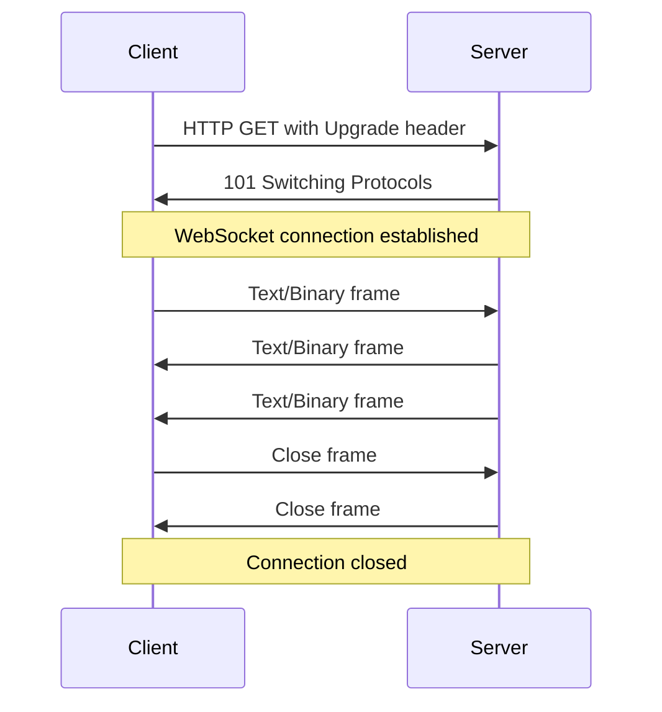
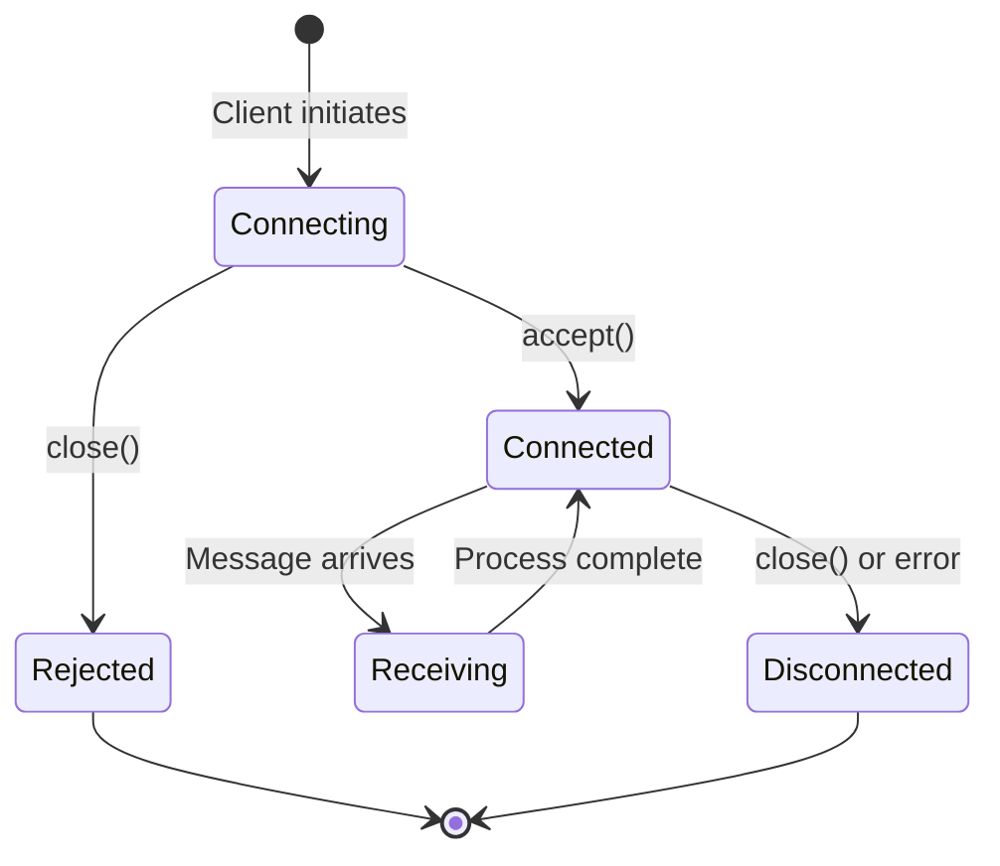
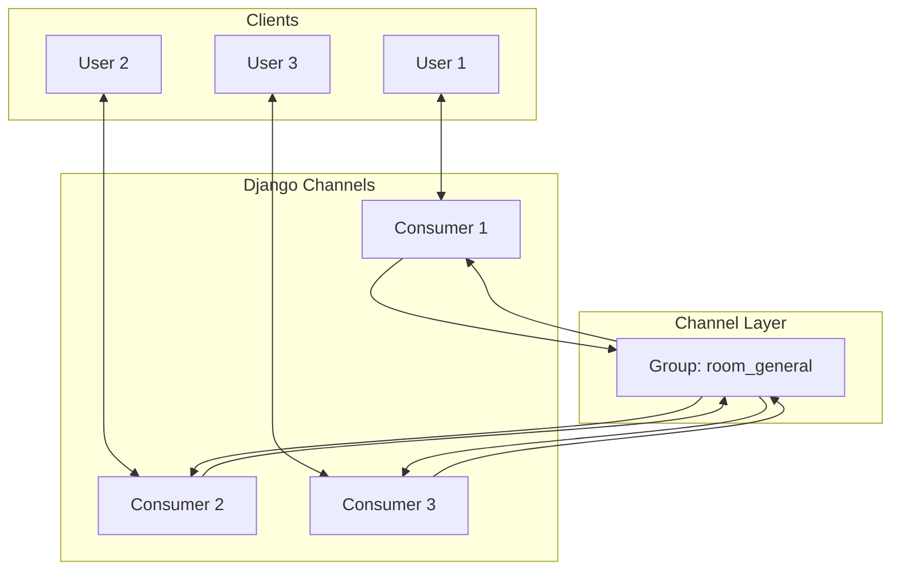
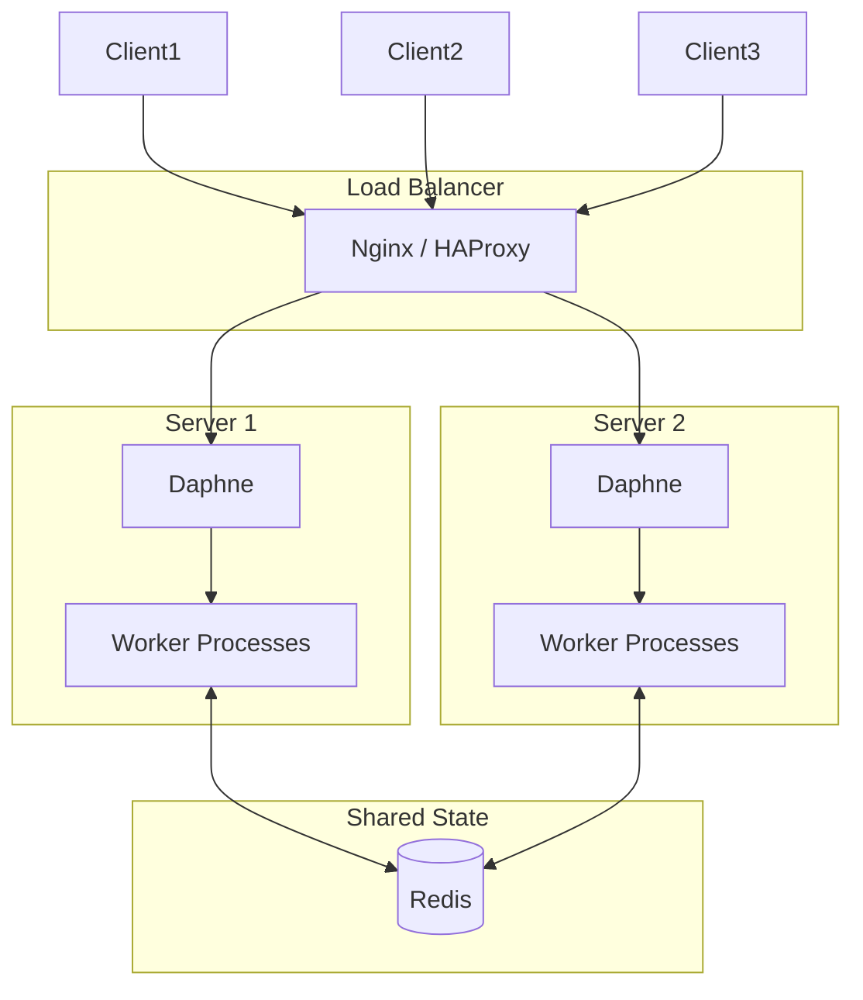

# How to Implement WebSockets with Django Channels

Author: [nawazdhandala](https://www.github.com/nawazdhandala)

Tags: Django, Python, WebSockets, Channels, Real-time

Description: A comprehensive guide to implementing WebSockets in Django using Django Channels. Learn connection lifecycle management, message protocols, authentication, scaling strategies, and testing patterns with production-ready code examples.

---

> WebSockets enable real-time, bidirectional communication between clients and servers. Django Channels extends Django to support WebSockets natively, letting you build chat applications, live dashboards, collaborative tools, and more while keeping your familiar Django patterns.

HTTP works great for request-response interactions, but falls short when you need instant updates. Polling wastes bandwidth. Server-Sent Events only go one direction. WebSockets solve this by maintaining a persistent connection where both sides can send messages at any time. Django Channels brings this capability to Django in a way that feels natural if you already know the framework.

---

## Understanding the WebSocket Protocol

Before implementing WebSockets, understanding the protocol helps you debug issues and make better design decisions.



WebSocket connections start as HTTP requests with special headers requesting an upgrade. Once upgraded, the connection stays open and both parties can send messages freely. This differs fundamentally from HTTP where the server can only respond to client requests.

Key characteristics of WebSockets:

| Feature | HTTP | WebSocket |
|---------|------|-----------|
| Connection | New per request | Persistent |
| Direction | Client-initiated | Bidirectional |
| Overhead | Headers per request | Minimal framing |
| State | Stateless | Stateful |
| Use case | CRUD operations | Real-time updates |

---

## Project Setup and Installation

Let us set up a Django project with Channels support from scratch.

The following commands install Django, Channels, and the Redis channel layer backend which is necessary for production deployments.

```bash
# Create a virtual environment and activate it
python -m venv venv
source venv/bin/activate

# Install Django and Channels with Redis support
pip install django channels channels-redis

# Create a new Django project
django-admin startproject websocket_project
cd websocket_project

# Create an app for WebSocket functionality
python manage.py startapp chat
```

Configure Django to use Channels by updating settings.py. The ASGI_APPLICATION setting tells Django where to find your async application, and CHANNEL_LAYERS configures the message-passing backend.

```python
# websocket_project/settings.py
# Core Django and Channels configuration

INSTALLED_APPS = [
    'django.contrib.admin',
    'django.contrib.auth',
    'django.contrib.contenttypes',
    'django.contrib.sessions',
    'django.contrib.messages',
    'django.contrib.staticfiles',
    'channels',  # Add Channels to installed apps
    'chat',      # Your WebSocket app
]

# Point to your ASGI application
ASGI_APPLICATION = 'websocket_project.asgi.application'

# Channel layer configuration
# Use Redis for production - it enables communication across processes
CHANNEL_LAYERS = {
    'default': {
        'BACKEND': 'channels_redis.core.RedisChannelLayer',
        'CONFIG': {
            'hosts': [('127.0.0.1', 6379)],
            # Optional: Configure connection pool for better performance
            'capacity': 1500,  # Maximum messages per channel
            'expiry': 10,      # Message expiry in seconds
        },
    },
}

# For development without Redis, use in-memory layer
# WARNING: Only works with single process - not for production
# CHANNEL_LAYERS = {
#     'default': {
#         'BACKEND': 'channels.layers.InMemoryChannelLayer',
#     },
# }
```

Create the ASGI application file. This is the entry point for all async protocols including WebSocket connections.

```python
# websocket_project/asgi.py
# ASGI application configuration for handling HTTP and WebSocket protocols

import os
from django.core.asgi import get_asgi_application
from channels.routing import ProtocolTypeRouter, URLRouter
from channels.auth import AuthMiddlewareStack
from channels.security.websocket import AllowedHostsOriginValidator

os.environ.setdefault('DJANGO_SETTINGS_MODULE', 'websocket_project.settings')

# Import routing after Django setup to avoid import errors
django_asgi_app = get_asgi_application()

from chat import routing

# ProtocolTypeRouter dispatches connections based on protocol type
application = ProtocolTypeRouter({
    # HTTP requests go to standard Django ASGI application
    'http': django_asgi_app,

    # WebSocket connections go through auth middleware and URL routing
    # AllowedHostsOriginValidator checks Origin header against ALLOWED_HOSTS
    'websocket': AllowedHostsOriginValidator(
        AuthMiddlewareStack(
            URLRouter(
                routing.websocket_urlpatterns
            )
        )
    ),
})
```

---

## WebSocket Consumer Fundamentals

Consumers are the WebSocket equivalent of Django views. They handle connection lifecycle events and incoming messages.



Here is a basic consumer that demonstrates the connection lifecycle. Each method corresponds to a specific event in the WebSocket connection.

```python
# chat/consumers.py
# Basic WebSocket consumer demonstrating connection lifecycle

import json
from channels.generic.websocket import AsyncWebsocketConsumer
from datetime import datetime

class BasicConsumer(AsyncWebsocketConsumer):
    """
    Basic WebSocket consumer showing the three core methods:
    - connect: Called when client initiates WebSocket connection
    - disconnect: Called when connection closes (for any reason)
    - receive: Called when message arrives from client
    """

    async def connect(self):
        # Connection attempt - decide whether to accept or reject
        # Access request info via self.scope (similar to request object)

        # Log connection details for debugging
        print(f"Connection from: {self.scope['client']}")
        print(f"Path: {self.scope['path']}")
        print(f"User: {self.scope['user']}")

        # Accept the WebSocket connection
        # This sends the 101 Switching Protocols response
        await self.accept()

        # Send a welcome message after accepting
        await self.send(text_data=json.dumps({
            'type': 'connection_established',
            'message': 'Welcome! You are now connected.',
            'timestamp': datetime.now().isoformat()
        }))

    async def disconnect(self, close_code):
        # Connection closed - clean up resources
        # close_code indicates reason:
        # 1000 = normal closure
        # 1001 = going away (page navigation)
        # 1006 = abnormal closure (network issue)
        # 4000+ = application-specific codes

        print(f"Connection closed with code: {close_code}")
        # Perform cleanup here (leave groups, update user status, etc.)

    async def receive(self, text_data):
        # Message received from WebSocket client
        # text_data contains the raw string sent by client

        try:
            # Parse JSON message
            data = json.loads(text_data)
            message_type = data.get('type', 'unknown')

            # Route to appropriate handler based on message type
            if message_type == 'ping':
                await self.handle_ping(data)
            elif message_type == 'echo':
                await self.handle_echo(data)
            else:
                await self.handle_unknown(data)

        except json.JSONDecodeError:
            # Handle invalid JSON
            await self.send(text_data=json.dumps({
                'type': 'error',
                'message': 'Invalid JSON format'
            }))

    async def handle_ping(self, data):
        """Respond to ping messages with pong"""
        await self.send(text_data=json.dumps({
            'type': 'pong',
            'timestamp': datetime.now().isoformat()
        }))

    async def handle_echo(self, data):
        """Echo the message content back to client"""
        content = data.get('content', '')
        await self.send(text_data=json.dumps({
            'type': 'echo_response',
            'content': content,
            'timestamp': datetime.now().isoformat()
        }))

    async def handle_unknown(self, data):
        """Handle unrecognized message types"""
        await self.send(text_data=json.dumps({
            'type': 'error',
            'message': f"Unknown message type: {data.get('type')}"
        }))
```

Set up URL routing for WebSocket connections. This works similarly to Django URL patterns but routes WebSocket connections to consumers.

```python
# chat/routing.py
# WebSocket URL routing configuration

from django.urls import re_path
from . import consumers

# WebSocket URL patterns
# These are separate from HTTP URL patterns in urls.py
websocket_urlpatterns = [
    # Route /ws/basic/ to BasicConsumer
    re_path(r'ws/basic/$', consumers.BasicConsumer.as_asgi()),
]
```

---

## Implementing a Chat Application

Let us build a practical chat room application that demonstrates group messaging, user presence, and message history.



This consumer handles chat room functionality including joining rooms, sending messages, and tracking online users.

```python
# chat/consumers.py
# Chat room consumer with group messaging and user presence

import json
from channels.generic.websocket import AsyncWebsocketConsumer
from channels.db import database_sync_to_async
from datetime import datetime
from django.contrib.auth import get_user_model

User = get_user_model()

class ChatRoomConsumer(AsyncWebsocketConsumer):
    """
    Chat room consumer supporting:
    - Multiple chat rooms via URL parameter
    - Group broadcasting to all room members
    - User presence tracking (join/leave notifications)
    - Message persistence to database
    """

    # Class-level storage for online users per room
    # In production, use Redis for this instead
    online_users = {}

    async def connect(self):
        # Extract room name from URL route kwargs
        self.room_name = self.scope['url_route']['kwargs']['room_name']

        # Create a valid group name (alphanumeric and underscores only)
        self.room_group_name = f'chat_{self.room_name}'

        # Get the authenticated user
        self.user = self.scope['user']

        # Reject anonymous users
        if not self.user.is_authenticated:
            await self.close(code=4001)
            return

        # Join the room group
        # This registers our channel to receive group broadcasts
        await self.channel_layer.group_add(
            self.room_group_name,
            self.channel_name
        )

        # Accept the WebSocket connection
        await self.accept()

        # Track online user
        await self.add_online_user()

        # Notify room that user joined
        await self.channel_layer.group_send(
            self.room_group_name,
            {
                'type': 'user_joined',
                'user_id': self.user.id,
                'username': self.user.username,
                'timestamp': datetime.now().isoformat()
            }
        )

        # Send current online users to the new connection
        await self.send(text_data=json.dumps({
            'type': 'online_users',
            'users': await self.get_online_users()
        }))

    async def disconnect(self, close_code):
        # Only process if user was authenticated
        if hasattr(self, 'user') and self.user.is_authenticated:
            # Remove from online users
            await self.remove_online_user()

            # Notify room that user left
            await self.channel_layer.group_send(
                self.room_group_name,
                {
                    'type': 'user_left',
                    'user_id': self.user.id,
                    'username': self.user.username,
                    'timestamp': datetime.now().isoformat()
                }
            )

            # Leave the room group
            await self.channel_layer.group_discard(
                self.room_group_name,
                self.channel_name
            )

    async def receive(self, text_data):
        """Handle incoming messages from WebSocket"""
        try:
            data = json.loads(text_data)
            message_type = data.get('type')

            if message_type == 'chat_message':
                await self.handle_chat_message(data)
            elif message_type == 'typing':
                await self.handle_typing(data)
            else:
                await self.send_error(f'Unknown message type: {message_type}')

        except json.JSONDecodeError:
            await self.send_error('Invalid JSON')

    async def handle_chat_message(self, data):
        """Process and broadcast a chat message"""
        message = data.get('message', '').strip()

        # Validate message
        if not message:
            await self.send_error('Message cannot be empty')
            return

        if len(message) > 1000:
            await self.send_error('Message too long (max 1000 characters)')
            return

        # Save message to database
        saved_message = await self.save_message(message)

        # Broadcast to all users in the room
        await self.channel_layer.group_send(
            self.room_group_name,
            {
                'type': 'chat_message',
                'message_id': saved_message.id,
                'message': message,
                'user_id': self.user.id,
                'username': self.user.username,
                'timestamp': datetime.now().isoformat()
            }
        )

    async def handle_typing(self, data):
        """Broadcast typing indicator to other users"""
        is_typing = data.get('is_typing', False)

        # Send to everyone except the sender
        await self.channel_layer.group_send(
            self.room_group_name,
            {
                'type': 'typing_indicator',
                'user_id': self.user.id,
                'username': self.user.username,
                'is_typing': is_typing
            }
        )

    # Event handlers - called when receiving group_send messages

    async def chat_message(self, event):
        """Send chat message to WebSocket"""
        await self.send(text_data=json.dumps({
            'type': 'chat_message',
            'message_id': event['message_id'],
            'message': event['message'],
            'user_id': event['user_id'],
            'username': event['username'],
            'timestamp': event['timestamp']
        }))

    async def user_joined(self, event):
        """Send user joined notification"""
        await self.send(text_data=json.dumps({
            'type': 'user_joined',
            'user_id': event['user_id'],
            'username': event['username'],
            'timestamp': event['timestamp']
        }))

    async def user_left(self, event):
        """Send user left notification"""
        await self.send(text_data=json.dumps({
            'type': 'user_left',
            'user_id': event['user_id'],
            'username': event['username'],
            'timestamp': event['timestamp']
        }))

    async def typing_indicator(self, event):
        """Send typing indicator - exclude sender"""
        if event['user_id'] != self.user.id:
            await self.send(text_data=json.dumps({
                'type': 'typing',
                'user_id': event['user_id'],
                'username': event['username'],
                'is_typing': event['is_typing']
            }))

    # Helper methods

    async def send_error(self, message):
        """Send error message to client"""
        await self.send(text_data=json.dumps({
            'type': 'error',
            'message': message
        }))

    async def add_online_user(self):
        """Add user to online users list"""
        if self.room_name not in self.online_users:
            self.online_users[self.room_name] = set()
        self.online_users[self.room_name].add(self.user.id)

    async def remove_online_user(self):
        """Remove user from online users list"""
        if self.room_name in self.online_users:
            self.online_users[self.room_name].discard(self.user.id)

    async def get_online_users(self):
        """Get list of online users in the room"""
        user_ids = self.online_users.get(self.room_name, set())
        users = await self.get_users_by_ids(list(user_ids))
        return [{'id': u.id, 'username': u.username} for u in users]

    @database_sync_to_async
    def get_users_by_ids(self, user_ids):
        """Fetch users from database"""
        return list(User.objects.filter(id__in=user_ids))

    @database_sync_to_async
    def save_message(self, content):
        """Save message to database"""
        from .models import Message
        return Message.objects.create(
            room_name=self.room_name,
            user=self.user,
            content=content
        )
```

Define the Message model for persistence.

```python
# chat/models.py
# Database models for chat message storage

from django.db import models
from django.contrib.auth import get_user_model

User = get_user_model()

class Message(models.Model):
    """
    Chat message storage model
    Stores messages with room, user, content, and timestamp
    """
    room_name = models.CharField(max_length=100, db_index=True)
    user = models.ForeignKey(
        User,
        on_delete=models.CASCADE,
        related_name='chat_messages'
    )
    content = models.TextField()
    timestamp = models.DateTimeField(auto_now_add=True, db_index=True)

    class Meta:
        ordering = ['-timestamp']
        indexes = [
            models.Index(fields=['room_name', 'timestamp']),
        ]

    def __str__(self):
        return f'{self.user.username}: {self.content[:50]}'
```

Update the routing to include the chat room consumer.

```python
# chat/routing.py
# WebSocket URL routing with room name parameter

from django.urls import re_path
from . import consumers

websocket_urlpatterns = [
    re_path(r'ws/basic/$', consumers.BasicConsumer.as_asgi()),
    # Room name captured as URL parameter
    re_path(
        r'ws/chat/(?P<room_name>\w+)/$',
        consumers.ChatRoomConsumer.as_asgi()
    ),
]
```

---

## Authentication Strategies

Django Channels supports multiple authentication approaches. Choose based on your application architecture.

### Session-Based Authentication

Session authentication works automatically with AuthMiddlewareStack for browser-based clients.

```python
# websocket_project/asgi.py
# Session authentication is built into AuthMiddlewareStack

from channels.auth import AuthMiddlewareStack

application = ProtocolTypeRouter({
    'http': django_asgi_app,
    'websocket': AllowedHostsOriginValidator(
        AuthMiddlewareStack(  # Reads session cookie automatically
            URLRouter(routing.websocket_urlpatterns)
        )
    ),
})
```

### Token-Based Authentication

For API clients or mobile apps, implement custom token authentication middleware.

```python
# chat/middleware.py
# Custom WebSocket authentication middleware for JWT or token auth

from channels.middleware import BaseMiddleware
from channels.db import database_sync_to_async
from django.contrib.auth.models import AnonymousUser
from django.contrib.auth import get_user_model
from urllib.parse import parse_qs
import jwt
from django.conf import settings

User = get_user_model()

class JWTAuthMiddleware(BaseMiddleware):
    """
    Custom middleware for JWT authentication on WebSocket connections.
    Reads token from query string: ws://host/ws/path/?token=<jwt>
    """

    async def __call__(self, scope, receive, send):
        # Parse query string to extract token
        query_string = scope.get('query_string', b'').decode()
        query_params = parse_qs(query_string)
        token = query_params.get('token', [None])[0]

        if token:
            # Validate JWT and get user
            scope['user'] = await self.get_user_from_jwt(token)
        else:
            scope['user'] = AnonymousUser()

        return await super().__call__(scope, receive, send)

    @database_sync_to_async
    def get_user_from_jwt(self, token):
        """Validate JWT token and return user"""
        try:
            # Decode the JWT token
            payload = jwt.decode(
                token,
                settings.SECRET_KEY,
                algorithms=['HS256']
            )

            # Get user from payload
            user_id = payload.get('user_id')
            if user_id:
                return User.objects.get(id=user_id)

        except jwt.ExpiredSignatureError:
            # Token has expired
            pass
        except jwt.InvalidTokenError:
            # Invalid token
            pass
        except User.DoesNotExist:
            # User not found
            pass

        return AnonymousUser()


class TokenAuthMiddleware(BaseMiddleware):
    """
    Alternative middleware for simple token authentication.
    Uses Django REST Framework tokens or custom token model.
    """

    async def __call__(self, scope, receive, send):
        query_string = scope.get('query_string', b'').decode()
        query_params = parse_qs(query_string)
        token_key = query_params.get('token', [None])[0]

        if token_key:
            scope['user'] = await self.get_user_from_token(token_key)
        else:
            scope['user'] = AnonymousUser()

        return await super().__call__(scope, receive, send)

    @database_sync_to_async
    def get_user_from_token(self, token_key):
        """Look up user from auth token"""
        try:
            # Using Django REST Framework's Token model
            from rest_framework.authtoken.models import Token
            token = Token.objects.select_related('user').get(key=token_key)
            return token.user
        except:
            return AnonymousUser()
```

Apply the custom middleware in your ASGI configuration.

```python
# websocket_project/asgi.py
# Using custom JWT authentication middleware

from chat.middleware import JWTAuthMiddleware

application = ProtocolTypeRouter({
    'http': django_asgi_app,
    'websocket': AllowedHostsOriginValidator(
        JWTAuthMiddleware(  # Use JWT auth instead of session
            URLRouter(routing.websocket_urlpatterns)
        )
    ),
})
```

---

## Frontend WebSocket Client

Here is a robust JavaScript client with reconnection logic, heartbeat, and message queuing.

```javascript
// static/js/websocket-client.js
// Production-ready WebSocket client with reconnection and heartbeat

class WebSocketClient {
    constructor(url, options = {}) {
        this.url = url;
        this.options = {
            reconnectInterval: 1000,      // Start with 1 second
            maxReconnectInterval: 30000,  // Cap at 30 seconds
            reconnectDecay: 1.5,          // Exponential backoff factor
            maxReconnectAttempts: 10,     // Give up after 10 attempts
            heartbeatInterval: 30000,     // Send ping every 30 seconds
            ...options
        };

        this.socket = null;
        this.reconnectAttempts = 0;
        this.messageQueue = [];
        this.heartbeatTimer = null;
        this.handlers = {
            open: [],
            close: [],
            message: [],
            error: []
        };
    }

    connect() {
        // Create WebSocket connection
        this.socket = new WebSocket(this.url);

        this.socket.onopen = (event) => {
            console.log('WebSocket connected');
            this.reconnectAttempts = 0;

            // Send queued messages
            this.flushMessageQueue();

            // Start heartbeat
            this.startHeartbeat();

            // Notify handlers
            this.handlers.open.forEach(handler => handler(event));
        };

        this.socket.onclose = (event) => {
            console.log(`WebSocket closed: ${event.code} ${event.reason}`);

            // Stop heartbeat
            this.stopHeartbeat();

            // Notify handlers
            this.handlers.close.forEach(handler => handler(event));

            // Attempt reconnection (unless intentional close)
            if (event.code !== 1000) {
                this.scheduleReconnect();
            }
        };

        this.socket.onmessage = (event) => {
            const data = JSON.parse(event.data);

            // Handle pong (heartbeat response)
            if (data.type === 'pong') {
                return;
            }

            // Notify handlers
            this.handlers.message.forEach(handler => handler(data));
        };

        this.socket.onerror = (error) => {
            console.error('WebSocket error:', error);
            this.handlers.error.forEach(handler => handler(error));
        };
    }

    disconnect() {
        // Clean close - pass code 1000 for normal closure
        if (this.socket) {
            this.socket.close(1000, 'Client disconnecting');
        }
        this.stopHeartbeat();
    }

    send(data) {
        const message = JSON.stringify(data);

        if (this.socket && this.socket.readyState === WebSocket.OPEN) {
            this.socket.send(message);
        } else {
            // Queue message if not connected
            this.messageQueue.push(message);
        }
    }

    on(event, handler) {
        if (this.handlers[event]) {
            this.handlers[event].push(handler);
        }
    }

    off(event, handler) {
        if (this.handlers[event]) {
            const index = this.handlers[event].indexOf(handler);
            if (index > -1) {
                this.handlers[event].splice(index, 1);
            }
        }
    }

    scheduleReconnect() {
        if (this.reconnectAttempts >= this.options.maxReconnectAttempts) {
            console.error('Max reconnection attempts reached');
            return;
        }

        // Calculate delay with exponential backoff
        const delay = Math.min(
            this.options.reconnectInterval * Math.pow(
                this.options.reconnectDecay,
                this.reconnectAttempts
            ),
            this.options.maxReconnectInterval
        );

        console.log(`Reconnecting in ${delay}ms (attempt ${this.reconnectAttempts + 1})`);

        setTimeout(() => {
            this.reconnectAttempts++;
            this.connect();
        }, delay);
    }

    flushMessageQueue() {
        while (this.messageQueue.length > 0) {
            const message = this.messageQueue.shift();
            this.socket.send(message);
        }
    }

    startHeartbeat() {
        this.heartbeatTimer = setInterval(() => {
            if (this.socket && this.socket.readyState === WebSocket.OPEN) {
                this.send({ type: 'ping' });
            }
        }, this.options.heartbeatInterval);
    }

    stopHeartbeat() {
        if (this.heartbeatTimer) {
            clearInterval(this.heartbeatTimer);
            this.heartbeatTimer = null;
        }
    }
}

// Usage example for chat application
const chatClient = new WebSocketClient('ws://localhost:8000/ws/chat/general/');

chatClient.on('open', () => {
    console.log('Connected to chat room');
});

chatClient.on('message', (data) => {
    switch (data.type) {
        case 'chat_message':
            displayMessage(data.username, data.message);
            break;
        case 'user_joined':
            displaySystemMessage(`${data.username} joined the room`);
            break;
        case 'user_left':
            displaySystemMessage(`${data.username} left the room`);
            break;
        case 'typing':
            updateTypingIndicator(data.username, data.is_typing);
            break;
    }
});

chatClient.on('close', () => {
    displaySystemMessage('Disconnected from chat');
});

chatClient.connect();

// Send a chat message
function sendMessage(text) {
    chatClient.send({
        type: 'chat_message',
        message: text
    });
}
```

---

## Scaling WebSocket Connections

WebSocket connections are stateful and long-lived. Scaling requires careful consideration of connection limits and message routing.



### Redis Channel Layer Configuration

Configure Redis for high availability and performance in production.

```python
# websocket_project/settings.py
# Production Redis channel layer configuration

CHANNEL_LAYERS = {
    'default': {
        'BACKEND': 'channels_redis.core.RedisChannelLayer',
        'CONFIG': {
            # Use Redis Sentinel for high availability
            'hosts': [
                {
                    'address': ('redis-sentinel-host', 26379),
                    'master_name': 'mymaster',
                }
            ],
            # Or use Redis Cluster
            # 'hosts': [
            #     ('redis-node-1', 6379),
            #     ('redis-node-2', 6379),
            #     ('redis-node-3', 6379),
            # ],

            # Performance tuning
            'capacity': 1500,      # Max messages per channel
            'expiry': 10,          # Message TTL in seconds

            # Connection pool settings
            'symmetric_encryption_keys': [
                'your-secret-key-here'  # Encrypt channel layer messages
            ],
        },
    },
}
```

### Load Balancer Configuration

Nginx configuration for WebSocket proxying with sticky sessions.

```nginx
# nginx.conf
# Load balancer configuration for Django Channels

upstream channels_backend {
    # Sticky sessions ensure WebSocket connections stay on same server
    ip_hash;

    server django-app-1:8000;
    server django-app-2:8000;
    server django-app-3:8000;
}

server {
    listen 80;
    server_name example.com;

    # Redirect HTTP to HTTPS
    return 301 https://$server_name$request_uri;
}

server {
    listen 443 ssl http2;
    server_name example.com;

    ssl_certificate /etc/ssl/certs/example.com.crt;
    ssl_certificate_key /etc/ssl/private/example.com.key;

    # Regular HTTP requests
    location / {
        proxy_pass http://channels_backend;
        proxy_set_header Host $host;
        proxy_set_header X-Real-IP $remote_addr;
        proxy_set_header X-Forwarded-For $proxy_add_x_forwarded_for;
        proxy_set_header X-Forwarded-Proto $scheme;
    }

    # WebSocket connections
    location /ws/ {
        proxy_pass http://channels_backend;
        proxy_http_version 1.1;

        # Required headers for WebSocket upgrade
        proxy_set_header Upgrade $http_upgrade;
        proxy_set_header Connection "upgrade";

        proxy_set_header Host $host;
        proxy_set_header X-Real-IP $remote_addr;
        proxy_set_header X-Forwarded-For $proxy_add_x_forwarded_for;
        proxy_set_header X-Forwarded-Proto $scheme;

        # Timeout settings for long-lived connections
        proxy_connect_timeout 7d;
        proxy_send_timeout 7d;
        proxy_read_timeout 7d;
    }
}
```

### Connection Limits and Resource Management

Monitor and limit connections to prevent server overload.

```python
# chat/consumers.py
# Consumer with connection limiting

import asyncio
from channels.generic.websocket import AsyncWebsocketConsumer

class LimitedConsumer(AsyncWebsocketConsumer):
    """Consumer with connection limiting per user"""

    # Track connections per user (use Redis in production)
    user_connections = {}
    max_connections_per_user = 5

    async def connect(self):
        user = self.scope['user']

        if not user.is_authenticated:
            await self.close(code=4001)
            return

        # Check connection limit
        user_id = str(user.id)
        current_connections = self.user_connections.get(user_id, 0)

        if current_connections >= self.max_connections_per_user:
            await self.close(code=4002)  # Too many connections
            return

        # Increment connection count
        self.user_connections[user_id] = current_connections + 1

        await self.accept()

    async def disconnect(self, close_code):
        user = self.scope.get('user')
        if user and user.is_authenticated:
            user_id = str(user.id)
            if user_id in self.user_connections:
                self.user_connections[user_id] -= 1
                if self.user_connections[user_id] <= 0:
                    del self.user_connections[user_id]
```

---

## Testing WebSocket Consumers

Test your WebSocket consumers using Django Channels testing utilities.

```python
# chat/tests/test_consumers.py
# Comprehensive tests for WebSocket consumers

import pytest
from channels.testing import WebsocketCommunicator
from channels.db import database_sync_to_async
from django.contrib.auth import get_user_model
from chat.consumers import ChatRoomConsumer
from websocket_project.asgi import application

User = get_user_model()

@pytest.fixture
def user(db):
    """Create a test user"""
    return User.objects.create_user(
        username='testuser',
        password='testpass123'
    )

@pytest.mark.asyncio
@pytest.mark.django_db(transaction=True)
class TestChatRoomConsumer:
    """Tests for ChatRoomConsumer"""

    async def test_connect_authenticated(self, user):
        """Test that authenticated users can connect"""
        # Create communicator with authenticated user
        communicator = WebsocketCommunicator(
            application,
            '/ws/chat/testroom/'
        )
        # Set the user in scope
        communicator.scope['user'] = user

        # Connect to WebSocket
        connected, _ = await communicator.connect()

        assert connected is True

        # Should receive online users message
        response = await communicator.receive_json_from()
        assert response['type'] == 'online_users'

        # Clean up
        await communicator.disconnect()

    async def test_connect_unauthenticated(self):
        """Test that anonymous users are rejected"""
        from django.contrib.auth.models import AnonymousUser

        communicator = WebsocketCommunicator(
            application,
            '/ws/chat/testroom/'
        )
        communicator.scope['user'] = AnonymousUser()

        connected, close_code = await communicator.connect()

        # Connection should be rejected
        assert connected is False
        assert close_code == 4001

    async def test_send_message(self, user):
        """Test sending a chat message"""
        communicator = WebsocketCommunicator(
            application,
            '/ws/chat/testroom/'
        )
        communicator.scope['user'] = user

        await communicator.connect()

        # Receive initial online users message
        await communicator.receive_json_from()

        # Skip user_joined message
        await communicator.receive_json_from()

        # Send a message
        await communicator.send_json_to({
            'type': 'chat_message',
            'message': 'Hello, world!'
        })

        # Receive the broadcast message
        response = await communicator.receive_json_from()

        assert response['type'] == 'chat_message'
        assert response['message'] == 'Hello, world!'
        assert response['username'] == user.username

        await communicator.disconnect()

    async def test_message_validation(self, user):
        """Test message validation"""
        communicator = WebsocketCommunicator(
            application,
            '/ws/chat/testroom/'
        )
        communicator.scope['user'] = user

        await communicator.connect()
        await communicator.receive_json_from()  # online users
        await communicator.receive_json_from()  # user joined

        # Send empty message
        await communicator.send_json_to({
            'type': 'chat_message',
            'message': ''
        })

        # Should receive error
        response = await communicator.receive_json_from()
        assert response['type'] == 'error'

        await communicator.disconnect()

    async def test_multiple_users(self, user, db):
        """Test multiple users in same room"""
        # Create second user
        user2 = await database_sync_to_async(User.objects.create_user)(
            username='testuser2',
            password='testpass123'
        )

        # Connect first user
        comm1 = WebsocketCommunicator(application, '/ws/chat/testroom/')
        comm1.scope['user'] = user
        await comm1.connect()
        await comm1.receive_json_from()  # online users
        await comm1.receive_json_from()  # user1 joined

        # Connect second user
        comm2 = WebsocketCommunicator(application, '/ws/chat/testroom/')
        comm2.scope['user'] = user2
        await comm2.connect()
        await comm2.receive_json_from()  # online users for user2

        # User1 should receive user2 joined notification
        response = await comm1.receive_json_from()
        assert response['type'] == 'user_joined'
        assert response['username'] == 'testuser2'

        # User2 sends a message
        await comm2.send_json_to({
            'type': 'chat_message',
            'message': 'Hello from user2'
        })

        # Skip user2's own joined notification
        await comm2.receive_json_from()

        # Both users should receive the message
        msg1 = await comm1.receive_json_from()
        msg2 = await comm2.receive_json_from()

        assert msg1['message'] == 'Hello from user2'
        assert msg2['message'] == 'Hello from user2'

        await comm1.disconnect()
        await comm2.disconnect()
```

---

## Error Handling and Debugging

Implement comprehensive error handling for production reliability.

```python
# chat/consumers.py
# Consumer with comprehensive error handling

import json
import logging
import traceback
from channels.generic.websocket import AsyncWebsocketConsumer
from channels.exceptions import StopConsumer

logger = logging.getLogger(__name__)

class RobustConsumer(AsyncWebsocketConsumer):
    """
    Production-ready consumer with comprehensive error handling.
    Handles network issues, invalid data, and unexpected errors gracefully.
    """

    async def connect(self):
        try:
            self.user = self.scope['user']
            self.room_name = self.scope['url_route']['kwargs'].get('room_name')

            if not self.room_name:
                logger.warning('Connection attempt without room name')
                await self.close(code=4000)
                return

            if not self.user.is_authenticated:
                logger.info(f'Unauthenticated connection attempt to {self.room_name}')
                await self.close(code=4001)
                return

            self.room_group = f'chat_{self.room_name}'

            await self.channel_layer.group_add(
                self.room_group,
                self.channel_name
            )
            await self.accept()

            logger.info(f'User {self.user.username} connected to {self.room_name}')

        except Exception as e:
            logger.error(f'Error in connect: {e}', exc_info=True)
            await self.close(code=4500)

    async def disconnect(self, close_code):
        try:
            if hasattr(self, 'room_group'):
                await self.channel_layer.group_discard(
                    self.room_group,
                    self.channel_name
                )

            username = getattr(self.user, 'username', 'unknown')
            logger.info(f'User {username} disconnected with code {close_code}')

        except Exception as e:
            # Log but do not raise - we're already disconnecting
            logger.error(f'Error in disconnect: {e}', exc_info=True)

    async def receive(self, text_data=None, bytes_data=None):
        try:
            if text_data is None:
                return

            try:
                data = json.loads(text_data)
            except json.JSONDecodeError as e:
                await self.send_error('INVALID_JSON', 'Could not parse message')
                logger.warning(f'Invalid JSON from {self.user.username}: {e}')
                return

            message_type = data.get('type')
            if not message_type:
                await self.send_error('MISSING_TYPE', 'Message type required')
                return

            # Route to handler
            handler = getattr(self, f'handle_{message_type}', None)
            if handler:
                await handler(data)
            else:
                await self.send_error('UNKNOWN_TYPE', f'Unknown type: {message_type}')

        except Exception as e:
            # Catch-all for unexpected errors
            logger.error(
                f'Error processing message from {self.user.username}: {e}',
                exc_info=True
            )
            await self.send_error('INTERNAL_ERROR', 'An error occurred')

    async def send_error(self, code, message):
        """Send structured error message to client"""
        try:
            await self.send(text_data=json.dumps({
                'type': 'error',
                'error': {
                    'code': code,
                    'message': message
                }
            }))
        except Exception as e:
            logger.error(f'Error sending error message: {e}')

    async def handle_chat_message(self, data):
        """Process chat message with validation"""
        message = data.get('message', '')

        # Validate
        if not message or not message.strip():
            await self.send_error('EMPTY_MESSAGE', 'Message cannot be empty')
            return

        message = message.strip()

        if len(message) > 2000:
            await self.send_error('MESSAGE_TOO_LONG', 'Message exceeds 2000 characters')
            return

        # Broadcast
        await self.channel_layer.group_send(
            self.room_group,
            {
                'type': 'chat_message',
                'message': message,
                'user_id': self.user.id,
                'username': self.user.username,
            }
        )

    async def chat_message(self, event):
        """Receive chat message from group"""
        try:
            await self.send(text_data=json.dumps({
                'type': 'chat_message',
                'message': event['message'],
                'user_id': event['user_id'],
                'username': event['username'],
            }))
        except Exception as e:
            logger.error(f'Error sending chat message: {e}')
```

---

## Best Practices Summary

1. **Always validate input** - Never trust data from WebSocket clients. Validate message types, lengths, and content.

2. **Use Redis in production** - The in-memory channel layer only works with a single process. Redis is required for multi-process or multi-server deployments.

3. **Implement heartbeats** - Send periodic ping/pong messages to detect dead connections early.

4. **Handle reconnection gracefully** - Clients should implement exponential backoff reconnection. Servers should handle duplicate connections.

5. **Authenticate before accepting** - Check authentication and permissions before calling `accept()`. Reject unauthorized connections immediately.

6. **Use database_sync_to_async** - Django ORM is synchronous. Wrap database calls with `database_sync_to_async` in async consumers.

7. **Log connection events** - Track connects, disconnects, and errors for debugging and monitoring.

8. **Set appropriate timeouts** - Configure nginx/load balancer timeouts for long-lived WebSocket connections.

9. **Monitor connection counts** - Track active connections to detect leaks and plan capacity.

10. **Test with WebsocketCommunicator** - Django Channels provides excellent testing utilities. Write tests for all message flows.

---

## Conclusion

Django Channels transforms Django into a real-time application platform without abandoning the framework you know. Key takeaways:

- **Consumers** handle WebSocket connections using familiar Django patterns
- **Channel layers** enable cross-process communication through Redis
- **Groups** allow broadcasting to multiple connections efficiently
- **Custom middleware** supports various authentication strategies
- **Testing utilities** make it easy to verify WebSocket behavior

With these patterns, you can build chat applications, live dashboards, collaborative editing, real-time notifications, and more - all while keeping your existing Django codebase and deployment infrastructure.

---

*Need to monitor your Django application's WebSocket connections? [OneUptime](https://oneuptime.com) provides comprehensive monitoring for real-time applications, including connection tracking, latency monitoring, and instant alerting when issues occur.*

**Related Reading:**
- [How to Build Real-Time Features with Django Channels](https://oneuptime.com/blog/post/2026-01-26-django-channels-realtime/view)
- [How to Implement Rate Limiting in FastAPI](https://oneuptime.com/blog/post/2025-01-06-fastapi-rate-limiting/view)
