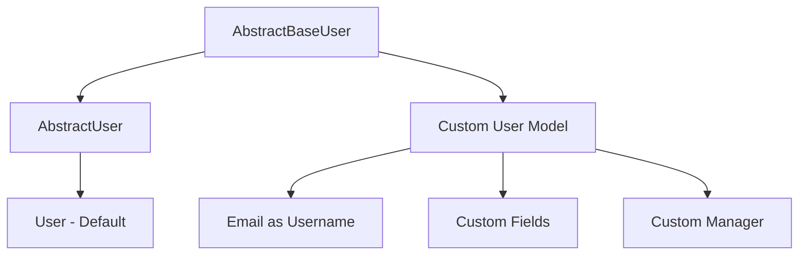

# How to Implement Custom User Models in Django

Author: [nawazdhandala](https://www.github.com/nawazdhandala)

Tags: Python, Django, Authentication, User Model, Security

Description: Learn how to create custom user models in Django to use email-based authentication, add custom fields, and extend user functionality while following best practices.

---

> Django's built-in User model works fine for many projects, but real-world applications often need something different. Maybe you want email-based login instead of usernames, or you need custom fields like phone numbers or organization IDs. Creating a custom user model from the start saves you from painful migrations later.

The most important thing to know: **always create a custom user model at the start of your project**. Changing the user model after you've created migrations and populated your database is a world of pain you don't want to experience.

---

## Why Create a Custom User Model?

| Scenario | Default User | Custom User |
|----------|--------------|-------------|
| Username-based login | Works out of the box | Optional |
| Email-based login | Requires workarounds | Native support |
| Additional fields (phone, company) | Separate profile table needed | Built into the model |
| Different authentication logic | Limited customization | Full control |
| Third-party integrations | May conflict with assumptions | Design for your needs |

---

## Project Setup

Before we dive in, let's understand how Django's user model works.



Django provides two base classes for creating custom user models:

- **AbstractUser**: Extends the default user with all standard fields (username, email, first_name, etc.). Use this when you just need to add extra fields.
- **AbstractBaseUser**: Provides only authentication functionality. Use this when you want complete control, like using email instead of username.

---

## Option 1: Extending AbstractUser (Simple Approach)

If you just need to add extra fields while keeping the username-based authentication, extend AbstractUser. This approach is simpler and keeps all the built-in functionality.

```python
# accounts/models.py
# Extending AbstractUser to add custom fields while keeping username authentication
from django.contrib.auth.models import AbstractUser
from django.db import models

class CustomUser(AbstractUser):
    """
    Custom user model that extends the default Django user.
    Keeps username-based auth but adds extra fields.
    """
    # Add your custom fields here
    phone_number = models.CharField(max_length=15, blank=True, null=True)
    organization = models.CharField(max_length=100, blank=True, null=True)
    bio = models.TextField(blank=True, null=True)

    # Track when the profile was last updated
    profile_updated_at = models.DateTimeField(auto_now=True)

    # For soft-delete functionality
    is_active_account = models.BooleanField(default=True)

    class Meta:
        # Useful for admin and debugging
        verbose_name = 'User'
        verbose_name_plural = 'Users'

    def __str__(self):
        return self.email or self.username

    def get_full_name(self):
        """Return first and last name with a space, or username if not set"""
        full_name = f"{self.first_name} {self.last_name}".strip()
        return full_name if full_name else self.username
```

---

## Option 2: Custom User with Email Authentication (Recommended)

Most modern applications use email for authentication. This requires extending AbstractBaseUser and creating a custom manager. It's more work but gives you a cleaner authentication flow.

### Step 1: Create the User Manager

The manager handles user creation. We need to define how to create regular users and superusers.

```python
# accounts/managers.py
# Custom user manager for email-based authentication
from django.contrib.auth.base_user import BaseUserManager
from django.utils.translation import gettext_lazy as _

class CustomUserManager(BaseUserManager):
    """
    Custom user manager where email is the unique identifier
    for authentication instead of username.
    """

    def create_user(self, email, password=None, **extra_fields):
        """
        Create and save a regular user with the given email and password.
        """
        if not email:
            raise ValueError(_('Users must have an email address'))

        # Normalize the email address by lowercasing the domain part
        email = self.normalize_email(email)

        # Create the user instance
        user = self.model(email=email, **extra_fields)

        # Hash the password - never store plain text!
        user.set_password(password)

        # Save to the database using the default database
        user.save(using=self._db)
        return user

    def create_superuser(self, email, password=None, **extra_fields):
        """
        Create and save a superuser with the given email and password.
        """
        # Set default values for superuser flags
        extra_fields.setdefault('is_staff', True)
        extra_fields.setdefault('is_superuser', True)
        extra_fields.setdefault('is_active', True)

        # Validate the flags - superuser must have these set
        if extra_fields.get('is_staff') is not True:
            raise ValueError(_('Superuser must have is_staff=True.'))
        if extra_fields.get('is_superuser') is not True:
            raise ValueError(_('Superuser must have is_superuser=True.'))

        return self.create_user(email, password, **extra_fields)
```

### Step 2: Create the Custom User Model

Now we create the user model that uses email as the primary identifier.

```python
# accounts/models.py
# Custom user model with email-based authentication
from django.contrib.auth.models import AbstractBaseUser, PermissionsMixin
from django.db import models
from django.utils import timezone
from django.utils.translation import gettext_lazy as _

from .managers import CustomUserManager

class CustomUser(AbstractBaseUser, PermissionsMixin):
    """
    Custom user model that uses email instead of username for authentication.
    Includes common fields needed for most applications.
    """
    # Primary identifier - must be unique
    email = models.EmailField(
        _('email address'),
        unique=True,
        error_messages={
            'unique': _('A user with this email already exists.'),
        }
    )

    # Basic profile information
    first_name = models.CharField(_('first name'), max_length=150, blank=True)
    last_name = models.CharField(_('last name'), max_length=150, blank=True)

    # Custom fields for your application
    phone_number = models.CharField(max_length=15, blank=True, null=True)
    organization = models.ForeignKey(
        'organizations.Organization',
        on_delete=models.SET_NULL,
        null=True,
        blank=True,
        related_name='users'
    )
    job_title = models.CharField(max_length=100, blank=True)
    avatar = models.ImageField(upload_to='avatars/', null=True, blank=True)

    # Account status flags
    is_staff = models.BooleanField(
        _('staff status'),
        default=False,
        help_text=_('Designates whether the user can log into the admin site.')
    )
    is_active = models.BooleanField(
        _('active'),
        default=True,
        help_text=_('Designates whether this user account is active.')
    )
    is_verified = models.BooleanField(
        _('email verified'),
        default=False,
        help_text=_('Designates whether the user has verified their email.')
    )

    # Timestamps
    date_joined = models.DateTimeField(_('date joined'), default=timezone.now)
    last_login = models.DateTimeField(_('last login'), null=True, blank=True)

    # Specify the custom manager
    objects = CustomUserManager()

    # Tell Django to use email for authentication
    USERNAME_FIELD = 'email'

    # Fields required when creating a superuser (besides email and password)
    REQUIRED_FIELDS = ['first_name', 'last_name']

    class Meta:
        verbose_name = _('user')
        verbose_name_plural = _('users')
        # Add indexes for common queries
        indexes = [
            models.Index(fields=['email']),
            models.Index(fields=['is_active', 'is_verified']),
        ]

    def __str__(self):
        return self.email

    def get_full_name(self):
        """Return the first_name plus the last_name, with a space in between."""
        full_name = f'{self.first_name} {self.last_name}'.strip()
        return full_name if full_name else self.email

    def get_short_name(self):
        """Return the short name for the user."""
        return self.first_name or self.email.split('@')[0]
```

---

## Configure Django Settings

Tell Django to use your custom user model by adding this to your settings file. This must be done before running your first migration.

```python
# settings.py
# Point Django to your custom user model

# This is the most important setting - format is 'app_label.model_name'
AUTH_USER_MODEL = 'accounts.CustomUser'

# Configure authentication backends
AUTHENTICATION_BACKENDS = [
    'django.contrib.auth.backends.ModelBackend',  # Default backend
]

# Optional: Configure password validation
AUTH_PASSWORD_VALIDATORS = [
    {
        # Checks password similarity to user attributes
        'NAME': 'django.contrib.auth.password_validation.UserAttributeSimilarityValidator',
        'OPTIONS': {
            'user_attributes': ['email', 'first_name', 'last_name'],
        }
    },
    {
        # Minimum length requirement
        'NAME': 'django.contrib.auth.password_validation.MinimumLengthValidator',
        'OPTIONS': {
            'min_length': 10,  # Stronger than default 8
        }
    },
    {
        # Prevents common passwords
        'NAME': 'django.contrib.auth.password_validation.CommonPasswordValidator',
    },
    {
        # Requires mixed content
        'NAME': 'django.contrib.auth.password_validation.NumericPasswordValidator',
    },
]
```

---

## Create Custom Admin Configuration

Django admin needs to know how to display your custom user model. This configuration provides a clean admin interface for managing users.

```python
# accounts/admin.py
# Custom admin configuration for the user model
from django.contrib import admin
from django.contrib.auth.admin import UserAdmin
from django.utils.translation import gettext_lazy as _

from .models import CustomUser

@admin.register(CustomUser)
class CustomUserAdmin(UserAdmin):
    """
    Custom admin interface for the CustomUser model.
    Organizes fields into logical sections and provides search/filter capabilities.
    """

    # Fields shown in the list view
    list_display = (
        'email',
        'first_name',
        'last_name',
        'is_active',
        'is_verified',
        'is_staff',
        'date_joined'
    )

    # Filters in the sidebar
    list_filter = ('is_active', 'is_verified', 'is_staff', 'is_superuser', 'date_joined')

    # Fields that can be searched
    search_fields = ('email', 'first_name', 'last_name', 'organization__name')

    # Default ordering
    ordering = ('-date_joined',)

    # Read-only fields that shouldn't be edited
    readonly_fields = ('date_joined', 'last_login')

    # Organize the detail view into fieldsets
    fieldsets = (
        (None, {
            'fields': ('email', 'password')
        }),
        (_('Personal info'), {
            'fields': ('first_name', 'last_name', 'phone_number', 'avatar')
        }),
        (_('Organization'), {
            'fields': ('organization', 'job_title')
        }),
        (_('Permissions'), {
            'fields': ('is_active', 'is_verified', 'is_staff', 'is_superuser', 'groups', 'user_permissions'),
            'classes': ('collapse',)  # Collapsed by default
        }),
        (_('Important dates'), {
            'fields': ('last_login', 'date_joined'),
            'classes': ('collapse',)
        }),
    )

    # Fields shown when creating a new user
    add_fieldsets = (
        (None, {
            'classes': ('wide',),
            'fields': (
                'email',
                'first_name',
                'last_name',
                'password1',
                'password2',
                'is_active',
                'is_staff'
            ),
        }),
    )
```

---

## Create User Registration and Authentication Forms

Custom forms handle user registration and authentication with your email-based user model.

```python
# accounts/forms.py
# Custom forms for user registration and authentication
from django import forms
from django.contrib.auth.forms import UserCreationForm, AuthenticationForm
from django.contrib.auth import get_user_model
from django.utils.translation import gettext_lazy as _

User = get_user_model()

class CustomUserCreationForm(UserCreationForm):
    """
    Form for creating new users with email-based authentication.
    Includes additional fields beyond just email and password.
    """

    email = forms.EmailField(
        label=_('Email'),
        max_length=254,
        widget=forms.EmailInput(attrs={
            'class': 'form-control',
            'placeholder': 'email@example.com',
            'autocomplete': 'email'
        })
    )

    first_name = forms.CharField(
        label=_('First Name'),
        max_length=150,
        widget=forms.TextInput(attrs={
            'class': 'form-control',
            'placeholder': 'First name'
        })
    )

    last_name = forms.CharField(
        label=_('Last Name'),
        max_length=150,
        widget=forms.TextInput(attrs={
            'class': 'form-control',
            'placeholder': 'Last name'
        })
    )

    class Meta:
        model = User
        fields = ('email', 'first_name', 'last_name', 'password1', 'password2')

    def clean_email(self):
        """Normalize and validate email uniqueness"""
        email = self.cleaned_data.get('email')
        if email:
            email = email.lower()  # Normalize to lowercase
            if User.objects.filter(email=email).exists():
                raise forms.ValidationError(_('A user with this email already exists.'))
        return email

    def save(self, commit=True):
        """Save the user with normalized email"""
        user = super().save(commit=False)
        user.email = self.cleaned_data['email'].lower()
        if commit:
            user.save()
        return user


class CustomAuthenticationForm(AuthenticationForm):
    """
    Custom login form that uses email instead of username.
    """

    username = forms.EmailField(
        label=_('Email'),
        widget=forms.EmailInput(attrs={
            'class': 'form-control',
            'placeholder': 'email@example.com',
            'autocomplete': 'email',
            'autofocus': True
        })
    )

    password = forms.CharField(
        label=_('Password'),
        strip=False,
        widget=forms.PasswordInput(attrs={
            'class': 'form-control',
            'placeholder': 'Password',
            'autocomplete': 'current-password'
        })
    )

    error_messages = {
        'invalid_login': _(
            'Please enter a correct email and password. '
            'Note that both fields are case-sensitive.'
        ),
        'inactive': _('This account is inactive.'),
    }
```

---

## Create Views for Authentication

These views handle user registration, login, and profile updates using Django's class-based views.

```python
# accounts/views.py
# Views for user authentication and profile management
from django.contrib.auth import login, logout, get_user_model
from django.contrib.auth.mixins import LoginRequiredMixin
from django.contrib.auth.views import LoginView, LogoutView
from django.contrib import messages
from django.shortcuts import redirect
from django.urls import reverse_lazy
from django.views.generic import CreateView, UpdateView, DetailView

from .forms import CustomUserCreationForm, CustomAuthenticationForm

User = get_user_model()

class RegisterView(CreateView):
    """
    Handle user registration with email-based authentication.
    """
    model = User
    form_class = CustomUserCreationForm
    template_name = 'accounts/register.html'
    success_url = reverse_lazy('accounts:login')

    def dispatch(self, request, *args, **kwargs):
        # Redirect authenticated users away from registration page
        if request.user.is_authenticated:
            return redirect('home')
        return super().dispatch(request, *args, **kwargs)

    def form_valid(self, form):
        # Save the user and add a success message
        response = super().form_valid(form)
        messages.success(
            self.request,
            'Account created successfully! Please log in.'
        )
        return response


class CustomLoginView(LoginView):
    """
    Custom login view using email authentication.
    """
    form_class = CustomAuthenticationForm
    template_name = 'accounts/login.html'
    redirect_authenticated_user = True

    def form_valid(self, form):
        # Update last login timestamp
        response = super().form_valid(form)
        messages.success(self.request, f'Welcome back, {self.request.user.get_short_name()}!')
        return response

    def form_invalid(self, form):
        messages.error(self.request, 'Invalid email or password.')
        return super().form_invalid(form)


class CustomLogoutView(LogoutView):
    """
    Handle user logout with a success message.
    """
    next_page = reverse_lazy('accounts:login')

    def dispatch(self, request, *args, **kwargs):
        if request.user.is_authenticated:
            messages.info(request, 'You have been logged out.')
        return super().dispatch(request, *args, **kwargs)


class ProfileView(LoginRequiredMixin, DetailView):
    """
    Display the current user's profile.
    """
    model = User
    template_name = 'accounts/profile.html'
    context_object_name = 'profile_user'

    def get_object(self, queryset=None):
        # Always return the logged-in user
        return self.request.user


class ProfileUpdateView(LoginRequiredMixin, UpdateView):
    """
    Allow users to update their profile information.
    """
    model = User
    template_name = 'accounts/profile_edit.html'
    fields = ['first_name', 'last_name', 'phone_number', 'job_title', 'avatar']
    success_url = reverse_lazy('accounts:profile')

    def get_object(self, queryset=None):
        return self.request.user

    def form_valid(self, form):
        messages.success(self.request, 'Profile updated successfully!')
        return super().form_valid(form)
```

---

## Configure URL Patterns

Set up URL routing for the authentication views.

```python
# accounts/urls.py
# URL patterns for user authentication
from django.urls import path
from . import views

app_name = 'accounts'

urlpatterns = [
    # Registration
    path('register/', views.RegisterView.as_view(), name='register'),

    # Login/Logout
    path('login/', views.CustomLoginView.as_view(), name='login'),
    path('logout/', views.CustomLogoutView.as_view(), name='logout'),

    # Profile
    path('profile/', views.ProfileView.as_view(), name='profile'),
    path('profile/edit/', views.ProfileUpdateView.as_view(), name='profile_edit'),
]
```

Don't forget to include these URLs in your main project urls.py.

```python
# project/urls.py
from django.contrib import admin
from django.urls import path, include

urlpatterns = [
    path('admin/', admin.site.urls),
    path('accounts/', include('accounts.urls', namespace='accounts')),
    # ... other URLs
]
```

---

## Add Email Verification (Optional but Recommended)

Email verification ensures users provide a valid email address. This implementation uses tokens for secure verification links.

```python
# accounts/tokens.py
# Token generator for email verification
from django.contrib.auth.tokens import PasswordResetTokenGenerator

class EmailVerificationTokenGenerator(PasswordResetTokenGenerator):
    """
    Generate secure tokens for email verification.
    The token includes the user's verification status to invalidate
    old tokens once the email is verified.
    """

    def _make_hash_value(self, user, timestamp):
        # Include is_verified in hash so token becomes invalid after verification
        return f'{user.pk}{timestamp}{user.is_verified}'

email_verification_token = EmailVerificationTokenGenerator()
```

```python
# accounts/utils.py
# Utility functions for sending verification emails
from django.contrib.sites.shortcuts import get_current_site
from django.template.loader import render_to_string
from django.utils.http import urlsafe_base64_encode
from django.utils.encoding import force_bytes
from django.core.mail import send_mail
from django.conf import settings

from .tokens import email_verification_token

def send_verification_email(request, user):
    """
    Send an email verification link to the user.
    The link contains a secure token that expires after use.
    """
    current_site = get_current_site(request)

    # Build the verification URL
    uid = urlsafe_base64_encode(force_bytes(user.pk))
    token = email_verification_token.make_token(user)

    # Render the email template
    subject = 'Verify your email address'
    message = render_to_string('accounts/emails/verify_email.html', {
        'user': user,
        'domain': current_site.domain,
        'uid': uid,
        'token': token,
        'protocol': 'https' if request.is_secure() else 'http',
    })

    # Send the email
    send_mail(
        subject=subject,
        message=message,
        from_email=settings.DEFAULT_FROM_EMAIL,
        recipient_list=[user.email],
        fail_silently=False,
    )
```

```python
# accounts/views.py (add this view)
# Email verification view
from django.utils.http import urlsafe_base64_decode
from django.utils.encoding import force_str
from django.views import View
from django.http import HttpResponse

from .tokens import email_verification_token

class VerifyEmailView(View):
    """
    Handle email verification links.
    """

    def get(self, request, uidb64, token):
        User = get_user_model()

        try:
            # Decode the user ID from the URL
            uid = force_str(urlsafe_base64_decode(uidb64))
            user = User.objects.get(pk=uid)
        except (TypeError, ValueError, OverflowError, User.DoesNotExist):
            user = None

        # Check if the token is valid
        if user is not None and email_verification_token.check_token(user, token):
            # Mark the user as verified
            user.is_verified = True
            user.save(update_fields=['is_verified'])
            messages.success(request, 'Email verified successfully! You can now log in.')
            return redirect('accounts:login')
        else:
            messages.error(request, 'Verification link is invalid or has expired.')
            return redirect('accounts:login')
```

---

## Running Migrations

After setting up your custom user model, create and run migrations.

```bash
# Create the migrations for your accounts app
python manage.py makemigrations accounts

# Apply all migrations
python manage.py migrate

# Create a superuser to test admin access
python manage.py createsuperuser
```

If you're starting a new project, this will work smoothly. If you're converting an existing project with data, you'll need a more complex migration strategy - search for "Django custom user model migration existing project" for detailed guides.

---

## Testing Your Custom User Model

Write tests to ensure your user model works correctly.

```python
# accounts/tests.py
# Tests for custom user model and authentication
from django.test import TestCase, Client
from django.contrib.auth import get_user_model
from django.urls import reverse

User = get_user_model()

class CustomUserModelTests(TestCase):
    """Test cases for the custom user model"""

    def test_create_user_with_email(self):
        """Test creating a user with email succeeds"""
        email = 'test@example.com'
        password = 'testpassword123'

        user = User.objects.create_user(
            email=email,
            password=password,
            first_name='Test',
            last_name='User'
        )

        self.assertEqual(user.email, email)
        self.assertTrue(user.check_password(password))
        self.assertFalse(user.is_staff)
        self.assertFalse(user.is_superuser)
        self.assertTrue(user.is_active)

    def test_create_user_without_email_raises_error(self):
        """Test that creating a user without email raises ValueError"""
        with self.assertRaises(ValueError):
            User.objects.create_user(email='', password='test123')

    def test_create_superuser(self):
        """Test creating a superuser"""
        user = User.objects.create_superuser(
            email='admin@example.com',
            password='adminpassword123',
            first_name='Admin',
            last_name='User'
        )

        self.assertTrue(user.is_staff)
        self.assertTrue(user.is_superuser)

    def test_email_normalized(self):
        """Test that email is normalized to lowercase"""
        email = 'Test@EXAMPLE.COM'
        user = User.objects.create_user(email=email, password='test123')

        # Domain should be lowercase
        self.assertEqual(user.email, 'Test@example.com')

    def test_get_full_name(self):
        """Test the get_full_name method"""
        user = User.objects.create_user(
            email='test@example.com',
            password='test123',
            first_name='John',
            last_name='Doe'
        )

        self.assertEqual(user.get_full_name(), 'John Doe')


class AuthenticationTests(TestCase):
    """Test cases for authentication flows"""

    def setUp(self):
        self.client = Client()
        self.user = User.objects.create_user(
            email='user@example.com',
            password='testpassword123',
            first_name='Test',
            last_name='User'
        )

    def test_login_with_email(self):
        """Test that users can log in with email"""
        response = self.client.post(reverse('accounts:login'), {
            'username': 'user@example.com',  # Form field is 'username'
            'password': 'testpassword123'
        })

        # Should redirect after successful login
        self.assertEqual(response.status_code, 302)

    def test_login_with_wrong_password(self):
        """Test that wrong password fails authentication"""
        response = self.client.post(reverse('accounts:login'), {
            'username': 'user@example.com',
            'password': 'wrongpassword'
        })

        # Should return to login page with error
        self.assertEqual(response.status_code, 200)
        self.assertContains(response, 'Please enter a correct email')
```

---

## Best Practices Summary

| Practice | Why It Matters |
|----------|---------------|
| Create custom user model before first migration | Changing later is extremely difficult |
| Use email as the identifier | More intuitive for users, reduces forgotten username issues |
| Normalize email addresses | Prevents duplicate accounts with case variations |
| Add is_verified field | Ensures valid email addresses |
| Use get_user_model() instead of direct imports | Ensures compatibility if model changes |
| Write comprehensive tests | Catches authentication issues before production |

---

## Common Pitfalls to Avoid

1. **Don't change the user model after migrations** - Start with a custom user model, even if it's identical to the default.

2. **Don't forget AUTH_USER_MODEL** - This setting must be configured before the first migration.

3. **Don't import User directly** - Always use `get_user_model()` or `settings.AUTH_USER_MODEL` in foreign keys.

4. **Don't skip email normalization** - Users will create duplicate accounts with different email casing.

5. **Don't make password field accessible** - The password field should never appear in forms or APIs (except for password change).

---

*Building a Django application with custom authentication? [OneUptime](https://oneuptime.com) can help you monitor your application's health, track user authentication metrics, and alert you to security issues before they impact your users.*
