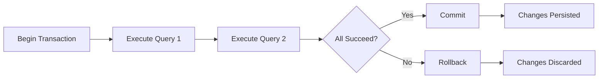
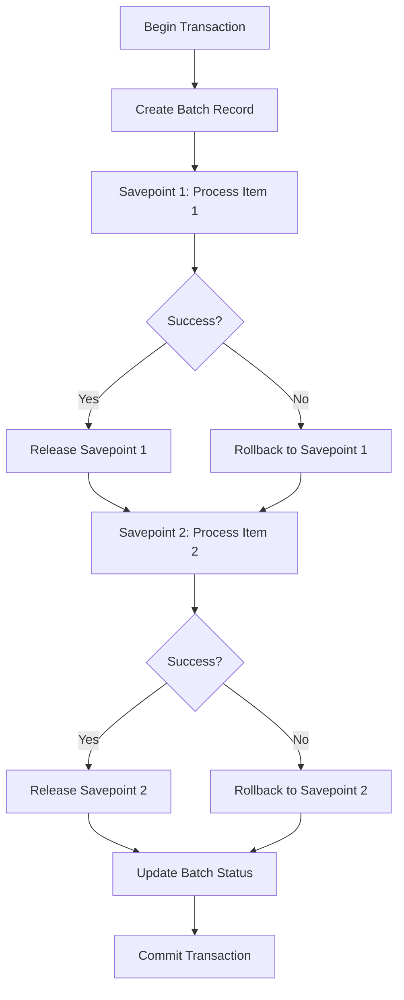
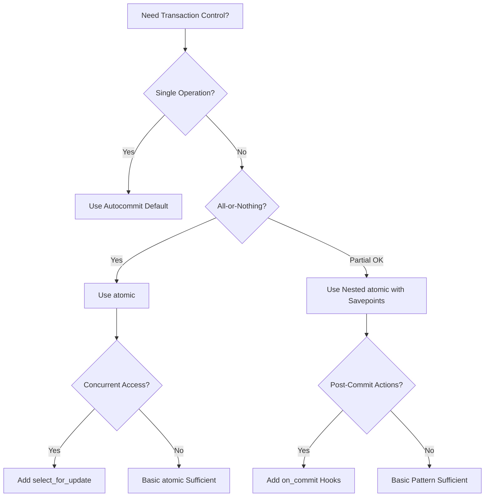

# How to Handle Database Transactions in Django

Author: [nawazdhandala](https://github.com/nawazdhandala)

Tags: Python, Django, Database, Transactions, PostgreSQL, Atomic

Description: A comprehensive guide to handling database transactions in Django, covering atomic operations, savepoints, transaction hooks, error handling, and best practices for data integrity.

---

Database transactions are fundamental to building reliable applications. When your Django app needs to update multiple related records, you need to guarantee that either all changes succeed or none of them do. Without proper transaction handling, you risk ending up with partial updates that leave your database in an inconsistent state.

Django provides excellent tools for managing transactions, from simple atomic blocks to fine-grained savepoint control. This guide walks you through everything you need to know to handle transactions correctly in production applications.

## Understanding Transactions

A transaction groups multiple database operations into a single unit of work. The classic example is a bank transfer: debiting one account and crediting another must happen together or not at all.

Here is how transaction lifecycle works in Django:



Transactions follow ACID properties:

| Property | Description |
|----------|-------------|
| Atomicity | All operations succeed or all fail together |
| Consistency | Database moves from one valid state to another |
| Isolation | Concurrent transactions don't interfere |
| Durability | Committed changes survive system failures |

## Django's Default Transaction Behavior

By default, Django runs in autocommit mode. Each database query runs in its own transaction and is committed immediately:

```python
# myapp/views.py
from django.http import JsonResponse
from .models import Account

def update_balance(request, account_id):
    # Each query auto-commits immediately
    account = Account.objects.get(id=account_id)  # Query 1: commits
    account.balance += 100                         # Python only
    account.save()                                 # Query 2: commits

    return JsonResponse({'balance': account.balance})
```

This works fine for simple operations, but becomes problematic when you need multiple queries to succeed together.

## Using atomic() for Transaction Control

Django's `transaction.atomic()` wraps database operations in a transaction. If any operation fails, all changes roll back:

```python
# myapp/services.py
from django.db import transaction
from decimal import Decimal
from .models import Account, TransactionLog

def transfer_funds(from_account_id, to_account_id, amount):
    """
    Transfer funds between accounts atomically.
    If any step fails, all changes are rolled back.
    """
    # The atomic block ensures all-or-nothing behavior
    with transaction.atomic():
        # Lock rows to prevent race conditions with select_for_update()
        from_account = Account.objects.select_for_update().get(id=from_account_id)
        to_account = Account.objects.select_for_update().get(id=to_account_id)

        # Validate sufficient funds
        if from_account.balance < amount:
            raise ValueError("Insufficient funds")

        # Perform the transfer
        from_account.balance -= amount
        from_account.save()

        to_account.balance += amount
        to_account.save()

        # Log the transaction
        TransactionLog.objects.create(
            from_account=from_account,
            to_account=to_account,
            amount=amount,
            status='completed'
        )

    # If we reach here, the transaction committed successfully
    return True
```

You can also use `atomic()` as a decorator:

```python
# myapp/services.py
from django.db import transaction

# Using atomic as a decorator - entire function runs in a transaction
@transaction.atomic
def create_order_with_items(user, cart_items):
    """
    Create an order and its items atomically.
    Any exception rolls back the entire operation.
    """
    order = Order.objects.create(
        user=user,
        status='pending',
        total=Decimal('0.00')
    )

    total = Decimal('0.00')
    for item in cart_items:
        # Reduce inventory
        product = Product.objects.select_for_update().get(id=item['product_id'])
        if product.stock < item['quantity']:
            raise ValueError(f"Insufficient stock for {product.name}")

        product.stock -= item['quantity']
        product.save()

        # Create order item
        item_total = product.price * item['quantity']
        OrderItem.objects.create(
            order=order,
            product=product,
            quantity=item['quantity'],
            price=product.price
        )
        total += item_total

    order.total = total
    order.save()

    return order
```

## Nesting Transactions with Savepoints

Django supports nested atomic blocks through savepoints. Each nested `atomic()` creates a savepoint that can be rolled back independently:

```python
# myapp/services.py
from django.db import transaction

def process_batch_with_partial_failures(items):
    """
    Process items allowing some to fail without losing all progress.
    Uses savepoints to roll back individual failures.
    """
    results = {'success': [], 'failed': []}

    # Outer transaction wraps the entire batch
    with transaction.atomic():
        # Create a batch record
        batch = ProcessingBatch.objects.create(status='processing')

        for item in items:
            try:
                # Inner atomic block creates a savepoint
                # Failures here only roll back to this savepoint
                with transaction.atomic():
                    processed = process_single_item(item, batch)
                    results['success'].append(processed.id)
            except Exception as e:
                # This item failed, but savepoint rolled back
                # Other items in the batch are unaffected
                results['failed'].append({
                    'item': item,
                    'error': str(e)
                })

        # Update batch with final counts
        batch.success_count = len(results['success'])
        batch.failure_count = len(results['failed'])
        batch.status = 'completed'
        batch.save()

    return results
```

Here is how savepoints work:



## Manual Savepoint Control

For fine-grained control, you can manage savepoints manually:

```python
# myapp/services.py
from django.db import transaction

def complex_migration_task():
    """
    Demonstrates manual savepoint management for complex operations.
    Useful when you need conditional rollbacks mid-operation.
    """
    with transaction.atomic():
        # Phase 1: Create base records
        parent = ParentModel.objects.create(name='Parent')

        # Create a named savepoint after critical setup
        sid = transaction.savepoint()

        try:
            # Phase 2: Risky operations that might fail
            for i in range(10):
                ChildModel.objects.create(
                    parent=parent,
                    value=perform_risky_calculation(i)
                )
        except CalculationError:
            # Roll back to savepoint, keeping parent record
            transaction.savepoint_rollback(sid)

            # Try alternative approach
            ChildModel.objects.create(
                parent=parent,
                value=0,
                note='Created with default due to calculation failure'
            )
        else:
            # Success - commit the savepoint
            transaction.savepoint_commit(sid)

        # Continue with more operations...
        parent.status = 'processed'
        parent.save()
```

## Transaction Hooks with on_commit()

Sometimes you need to run code only after a transaction commits successfully. Sending emails or triggering webhooks should not happen if the transaction rolls back:

```python
# myapp/services.py
from django.db import transaction
from .tasks import send_notification_email, trigger_webhook

def create_user_account(user_data):
    """
    Create a user and schedule post-commit actions.
    Emails and webhooks only fire after successful commit.
    """
    with transaction.atomic():
        # Create the user record
        user = User.objects.create_user(
            username=user_data['username'],
            email=user_data['email'],
            password=user_data['password']
        )

        # Create related profile
        Profile.objects.create(
            user=user,
            bio=user_data.get('bio', '')
        )

        # Schedule email to send AFTER commit
        # If transaction rolls back, this never executes
        transaction.on_commit(
            lambda: send_notification_email.delay(user.id)
        )

        # Schedule webhook after commit
        transaction.on_commit(
            lambda: trigger_webhook.delay('user.created', user.id)
        )

        return user

# The email and webhook tasks only run after the transaction commits
# If any error occurs and rolls back, they are discarded
```

You can also specify the database for multi-database setups:

```python
# myapp/services.py
from django.db import transaction

def multi_db_operation():
    """
    Handle on_commit hooks for different databases.
    """
    with transaction.atomic(using='default'):
        user = User.objects.create(username='test')

        # Hook for default database
        transaction.on_commit(
            lambda: print(f"User {user.id} created"),
            using='default'
        )

    with transaction.atomic(using='analytics'):
        AnalyticsEvent.objects.using('analytics').create(
            event_type='user_created'
        )

        # Hook for analytics database
        transaction.on_commit(
            lambda: sync_to_warehouse.delay(),
            using='analytics'
        )
```

## Error Handling Patterns

Proper error handling is critical when working with transactions:

```python
# myapp/services.py
from django.db import transaction, IntegrityError, DatabaseError
import logging

logger = logging.getLogger(__name__)

def robust_transaction_handler(data):
    """
    Demonstrates comprehensive error handling for transactions.
    Catches specific exceptions and handles them appropriately.
    """
    try:
        with transaction.atomic():
            # Perform database operations
            result = perform_complex_operation(data)
            return {'status': 'success', 'result': result}

    except IntegrityError as e:
        # Constraint violation (duplicate key, foreign key, etc.)
        logger.warning(f"Integrity error: {e}")
        return {'status': 'error', 'message': 'Data conflict detected'}

    except DatabaseError as e:
        # Connection issues, deadlocks, etc.
        logger.error(f"Database error: {e}")
        return {'status': 'error', 'message': 'Database unavailable'}

    except ValueError as e:
        # Business logic validation errors
        # Transaction already rolled back
        logger.info(f"Validation failed: {e}")
        return {'status': 'error', 'message': str(e)}
```

When dealing with deadlocks, implement retry logic:

```python
# myapp/services.py
from django.db import transaction, OperationalError
import time
import random

def with_retry(max_attempts=3, initial_delay=0.1):
    """
    Decorator that retries operations on transient database errors.
    Uses exponential backoff with jitter.
    """
    def decorator(func):
        def wrapper(*args, **kwargs):
            last_exception = None
            delay = initial_delay

            for attempt in range(max_attempts):
                try:
                    return func(*args, **kwargs)
                except OperationalError as e:
                    last_exception = e
                    if 'deadlock' in str(e).lower() or 'lock' in str(e).lower():
                        # Add jitter to prevent thundering herd
                        sleep_time = delay + random.uniform(0, delay)
                        logger.warning(
                            f"Attempt {attempt + 1} failed with lock error, "
                            f"retrying in {sleep_time:.2f}s"
                        )
                        time.sleep(sleep_time)
                        delay *= 2  # Exponential backoff
                    else:
                        raise

            raise last_exception
        return wrapper
    return decorator

@with_retry(max_attempts=3)
@transaction.atomic
def update_inventory(product_id, quantity_change):
    """
    Update inventory with automatic retry on deadlock.
    """
    product = Product.objects.select_for_update().get(id=product_id)
    product.stock += quantity_change
    if product.stock < 0:
        raise ValueError("Cannot reduce stock below zero")
    product.save()
    return product.stock
```

## select_for_update() for Row Locking

When multiple processes might update the same rows, use `select_for_update()` to prevent race conditions:

```python
# myapp/services.py
from django.db import transaction

def reserve_seat(event_id, seat_number, user):
    """
    Reserve a seat atomically, preventing double-booking.
    select_for_update() locks the row until transaction ends.
    """
    with transaction.atomic():
        # Lock the seat row - other transactions will wait
        seat = Seat.objects.select_for_update().get(
            event_id=event_id,
            number=seat_number
        )

        if seat.is_reserved:
            raise ValueError("Seat already reserved")

        seat.is_reserved = True
        seat.reserved_by = user
        seat.reserved_at = timezone.now()
        seat.save()

        return seat
```

Different locking options:

```python
# myapp/services.py

# Basic lock - wait for lock indefinitely
seats = Seat.objects.select_for_update().filter(event_id=event_id)

# Skip locked rows instead of waiting (PostgreSQL, Oracle)
# Useful for job queues where any available row works
available = Task.objects.select_for_update(skip_locked=True).filter(
    status='pending'
).first()

# Fail immediately if lock unavailable (PostgreSQL, Oracle)
# Raises DatabaseError instead of waiting
try:
    seat = Seat.objects.select_for_update(nowait=True).get(id=seat_id)
except DatabaseError:
    return "Seat is currently being reserved by another user"

# Lock related objects too (SELECT ... FOR UPDATE OF)
# Only locks the specific tables mentioned
orders = Order.objects.select_for_update(of=('self',)).select_related(
    'user'
).filter(status='pending')
```

## Database-Specific Transaction Configuration

Configure transaction isolation levels in `settings.py`:

```python
# settings.py

DATABASES = {
    'default': {
        'ENGINE': 'django.db.backends.postgresql',
        'NAME': 'mydb',
        'USER': 'myuser',
        'PASSWORD': 'mypassword',
        'HOST': 'localhost',
        'PORT': '5432',
        'OPTIONS': {
            # Set default isolation level for all transactions
            # Options: 'read uncommitted', 'read committed',
            # 'repeatable read', 'serializable'
            'isolation_level': 'read committed',
        },
        'ATOMIC_REQUESTS': False,  # Set True to wrap all views in transactions
    }
}
```

For per-transaction isolation control (PostgreSQL):

```python
# myapp/services.py
from django.db import connection

def serializable_transaction():
    """
    Run with serializable isolation for maximum consistency.
    Use sparingly as it can cause more rollbacks.
    """
    with connection.cursor() as cursor:
        cursor.execute("SET TRANSACTION ISOLATION LEVEL SERIALIZABLE")

    with transaction.atomic():
        # Operations here run with serializable isolation
        perform_critical_operation()
```

## Testing Transactions

Django's test framework handles transactions automatically, but you need to understand its behavior:

```python
# myapp/tests.py
from django.test import TestCase, TransactionTestCase
from django.db import transaction
from .models import Account
from .services import transfer_funds

class TransactionTests(TransactionTestCase):
    """
    Use TransactionTestCase when testing transaction behavior.
    Regular TestCase wraps each test in a transaction which can mask issues.
    """

    def test_transfer_commits_on_success(self):
        # Create test accounts
        account1 = Account.objects.create(balance=1000)
        account2 = Account.objects.create(balance=500)

        # Perform transfer
        transfer_funds(account1.id, account2.id, 200)

        # Verify changes persisted
        account1.refresh_from_db()
        account2.refresh_from_db()
        self.assertEqual(account1.balance, 800)
        self.assertEqual(account2.balance, 700)

    def test_transfer_rolls_back_on_insufficient_funds(self):
        account1 = Account.objects.create(balance=100)
        account2 = Account.objects.create(balance=500)

        # Attempt transfer greater than balance
        with self.assertRaises(ValueError):
            transfer_funds(account1.id, account2.id, 200)

        # Verify no changes occurred
        account1.refresh_from_db()
        account2.refresh_from_db()
        self.assertEqual(account1.balance, 100)  # Unchanged
        self.assertEqual(account2.balance, 500)  # Unchanged

    def test_on_commit_hook_executes(self):
        executed = []

        with transaction.atomic():
            Account.objects.create(balance=1000)
            transaction.on_commit(lambda: executed.append(True))

        # Hook should have executed after commit
        self.assertEqual(executed, [True])

    def test_on_commit_hook_skipped_on_rollback(self):
        executed = []

        try:
            with transaction.atomic():
                Account.objects.create(balance=1000)
                transaction.on_commit(lambda: executed.append(True))
                raise ValueError("Force rollback")
        except ValueError:
            pass

        # Hook should not have executed
        self.assertEqual(executed, [])
```

## ATOMIC_REQUESTS for Views

Enable `ATOMIC_REQUESTS` to wrap all view functions in transactions:

```python
# settings.py

DATABASES = {
    'default': {
        'ENGINE': 'django.db.backends.postgresql',
        'NAME': 'mydb',
        'ATOMIC_REQUESTS': True,  # Wrap all views in transactions
    }
}
```

Opt out specific views with `non_atomic_requests`:

```python
# myapp/views.py
from django.db import transaction
from django.http import JsonResponse

# This view runs outside the automatic transaction
@transaction.non_atomic_requests
def streaming_view(request):
    """
    Long-running views or streaming responses should opt out.
    Holding transactions open too long causes lock contention.
    """
    # Handle streaming response without holding a transaction
    pass

# Regular views automatically wrapped in a transaction
def create_item(request):
    """
    With ATOMIC_REQUESTS=True, this entire view is atomic.
    Any exception rolls back all database changes.
    """
    item = Item.objects.create(name=request.POST['name'])
    RelatedModel.objects.create(item=item, data='test')
    return JsonResponse({'id': item.id})
```

## Best Practices

Following these guidelines will help you avoid common transaction pitfalls:

**Keep transactions short.** Long-running transactions hold locks and block other operations:

```python
# myapp/services.py

# Bad: Transaction includes slow external API call
def bad_example(order_id):
    with transaction.atomic():
        order = Order.objects.get(id=order_id)
        order.status = 'processing'
        order.save()

        # Don't do this - API call holds the transaction open
        response = requests.post('https://api.example.com/process', data={})

        order.external_id = response.json()['id']
        order.save()

# Good: Minimize transaction scope
def good_example(order_id):
    with transaction.atomic():
        order = Order.objects.select_for_update().get(id=order_id)
        order.status = 'processing'
        order.save()

    # API call outside transaction
    response = requests.post('https://api.example.com/process', data={})

    with transaction.atomic():
        order = Order.objects.get(id=order_id)
        order.external_id = response.json()['id']
        order.save()
```

**Use select_for_update() for concurrent updates.** Prevent race conditions when multiple processes update the same data:

```python
# myapp/services.py

# Bad: Race condition possible
def increment_counter_bad(counter_id):
    with transaction.atomic():
        counter = Counter.objects.get(id=counter_id)
        counter.value += 1  # Another process might read stale value
        counter.save()

# Good: Lock prevents concurrent reads
def increment_counter_good(counter_id):
    with transaction.atomic():
        counter = Counter.objects.select_for_update().get(id=counter_id)
        counter.value += 1
        counter.save()
```

**Schedule side effects with on_commit().** External actions should only happen after successful commit:

```python
# myapp/services.py

# Bad: Email sent even if transaction rolls back
def create_user_bad(data):
    with transaction.atomic():
        user = User.objects.create_user(**data)
        send_welcome_email(user.email)  # Sent immediately
        create_related_records(user)    # This might fail

# Good: Email only sent after commit
def create_user_good(data):
    with transaction.atomic():
        user = User.objects.create_user(**data)
        create_related_records(user)
        transaction.on_commit(lambda: send_welcome_email.delay(user.email))
```

**Handle IntegrityError for constraint violations:**

```python
# myapp/services.py
from django.db import IntegrityError, transaction

def create_unique_record(data):
    """
    Handle unique constraint violations gracefully.
    """
    try:
        with transaction.atomic():
            return MyModel.objects.create(**data)
    except IntegrityError:
        # Record already exists, fetch it instead
        return MyModel.objects.get(unique_field=data['unique_field'])
```

## Common Transaction Patterns

Here is a summary of when to use each transaction pattern:



| Pattern | Use Case |
|---------|----------|
| `@transaction.atomic` decorator | Entire function needs atomicity |
| `with transaction.atomic():` context manager | Part of function needs atomicity |
| Nested `atomic()` blocks | Allow partial failures in batch operations |
| `select_for_update()` | Prevent race conditions on concurrent updates |
| `on_commit()` hooks | Schedule side effects after commit |
| Manual savepoints | Complex conditional rollback logic |

## Conclusion

Database transactions are essential for maintaining data integrity in Django applications. The framework provides flexible tools ranging from simple `atomic()` blocks to sophisticated savepoint management.

Start with the basics: wrap related operations in `atomic()` blocks and use `select_for_update()` when concurrent access is possible. Add `on_commit()` hooks for side effects like sending emails or triggering webhooks. As your application grows more complex, leverage nested transactions and manual savepoints for fine-grained control.

Remember that transactions have performance implications. Keep them short, avoid holding locks during slow operations, and always test your transaction logic with `TransactionTestCase` to ensure correct behavior.

For production Django applications, reliable monitoring is essential to catch transaction issues like deadlocks, long-running queries, and connection pool exhaustion before they impact users. [OneUptime](https://oneuptime.com) provides comprehensive monitoring for your Django applications, including database performance tracking, error alerting, and uptime monitoring to keep your transaction-heavy workloads running smoothly.
