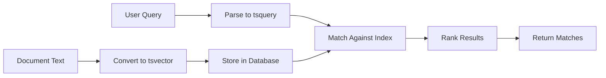

# How to Implement Full-text Search in Django

Author: [nawazdhandala](https://www.github.com/nawazdhandala)

Tags: Python, Django, Search, Full-text Search, PostgreSQL

Description: A comprehensive guide to implementing full-text search in Django using PostgreSQL's built-in capabilities, covering search vectors, ranking, and query optimization.

---

> Full-text search lets users find content by matching words and phrases rather than exact strings. Django ships with excellent PostgreSQL full-text search support out of the box, making it easy to build powerful search features without external services like Elasticsearch.

If you're building a Django application that needs search functionality, you have several options: basic `LIKE` queries, third-party search engines, or PostgreSQL's native full-text search. For most applications, PostgreSQL full-text search hits the sweet spot between simplicity and power.

---

## Why PostgreSQL Full-text Search?

| Approach | Pros | Cons | Best For |
|----------|------|------|----------|
| **LIKE/icontains** | Simple | Slow, no ranking | Tiny datasets |
| **PostgreSQL FTS** | Fast, built-in, ranked | Requires PostgreSQL | Most Django apps |
| **Elasticsearch** | Very powerful | Complex setup | Large-scale search |
| **Algolia/Typesense** | Instant, hosted | Cost, vendor lock-in | Consumer products |

PostgreSQL full-text search works well because:
- No additional infrastructure to maintain
- Transactions include search index updates automatically
- Good enough performance for millions of rows
- Django's ORM has first-class support

---

## How Full-text Search Works



PostgreSQL full-text search uses two key concepts:

- **tsvector**: A sorted list of distinct words (lexemes) extracted from a document
- **tsquery**: A search query containing lexemes and operators like AND, OR, NOT

When you search, PostgreSQL matches the tsquery against stored tsvectors and ranks results by relevance.

---

## Basic Setup

First, make sure you're using PostgreSQL as your database backend.

The following settings.py configuration ensures Django connects to PostgreSQL:

```python
# settings.py
DATABASES = {
    'default': {
        'ENGINE': 'django.db.backends.postgresql',
        'NAME': 'myapp',
        'USER': 'myuser',
        'PASSWORD': 'mypassword',
        'HOST': 'localhost',
        'PORT': '5432',
    }
}
```

---

## Simple Full-text Search

Let's start with a basic blog post model and add search functionality.

This model represents a blog post with title and content fields:

```python
# models.py
from django.db import models

class Post(models.Model):
    title = models.CharField(max_length=200)
    content = models.TextField()
    author = models.CharField(max_length=100)
    published_at = models.DateTimeField(auto_now_add=True)

    def __str__(self):
        return self.title
```

The simplest way to search uses Django's `search` lookup.

This view demonstrates basic full-text search on the content field:

```python
# views.py
from django.db.models import Q
from .models import Post

def search_posts(query):
    """
    Basic full-text search using Django's search lookup.
    This works but doesn't rank results by relevance.
    """
    if not query:
        return Post.objects.none()

    # Search the content field using PostgreSQL full-text search
    return Post.objects.filter(content__search=query)
```

The `__search` lookup converts your query to a tsquery and matches it against a tsvector created from the field.

---

## Searching Multiple Fields

Real applications need to search across multiple fields. Django provides `SearchVector` for this.

SearchVector combines multiple fields into a single searchable unit:

```python
# views.py
from django.contrib.postgres.search import SearchVector

def search_posts_multiple_fields(query):
    """
    Search across title, content, and author fields.
    Results are combined from all fields.
    """
    if not query:
        return Post.objects.none()

    # Create a search vector spanning multiple fields
    return Post.objects.annotate(
        search=SearchVector('title', 'content', 'author')
    ).filter(search=query)
```

---

## Ranking Search Results

Users expect the most relevant results first. `SearchRank` scores each result.

This implementation ranks results by how well they match the query:

```python
# views.py
from django.contrib.postgres.search import (
    SearchVector,
    SearchQuery,
    SearchRank
)

def search_posts_ranked(query):
    """
    Search with relevance ranking.
    Results are ordered by how well they match the query.
    """
    if not query:
        return Post.objects.none()

    # Create search vector and query objects
    search_vector = SearchVector('title', 'content')
    search_query = SearchQuery(query)

    # Annotate with rank and filter matches
    return Post.objects.annotate(
        search=search_vector,
        rank=SearchRank(search_vector, search_query)
    ).filter(
        search=search_query
    ).order_by('-rank')
```

---

## Weighting Fields

Some fields matter more than others. A match in the title should rank higher than a match in the content.

PostgreSQL supports four weight classes (A, B, C, D) with A being the highest:

```python
# views.py
from django.contrib.postgres.search import (
    SearchVector,
    SearchQuery,
    SearchRank
)

def search_posts_weighted(query):
    """
    Weighted search where title matches rank higher than content.
    Weight A is highest, D is lowest.
    """
    if not query:
        return Post.objects.none()

    # Apply weights: title gets A (highest), content gets B
    search_vector = SearchVector('title', weight='A') + \
                    SearchVector('content', weight='B') + \
                    SearchVector('author', weight='C')

    search_query = SearchQuery(query)

    return Post.objects.annotate(
        rank=SearchRank(search_vector, search_query)
    ).filter(
        rank__gte=0.1  # Filter out very low matches
    ).order_by('-rank')
```

The weight values translate to multipliers:
- A: 1.0
- B: 0.4
- C: 0.2
- D: 0.1

---

## Using SearchVectorField for Better Performance

Calculating search vectors on every query is expensive. For better performance, store the vector in a dedicated field.

This model stores the pre-computed search vector:

```python
# models.py
from django.db import models
from django.contrib.postgres.search import SearchVectorField
from django.contrib.postgres.indexes import GinIndex

class Post(models.Model):
    title = models.CharField(max_length=200)
    content = models.TextField()
    author = models.CharField(max_length=100)
    published_at = models.DateTimeField(auto_now_add=True)

    # Store pre-computed search vector
    search_vector = SearchVectorField(null=True)

    class Meta:
        indexes = [
            # GIN index for fast full-text search
            GinIndex(fields=['search_vector']),
        ]

    def __str__(self):
        return self.title
```

Run migrations after adding the field:

```bash
python manage.py makemigrations
python manage.py migrate
```

---

## Keeping Search Vector Updated

The search vector needs to be updated when the content changes. There are several approaches.

### Option 1: Override save() Method

This approach updates the search vector whenever the model is saved:

```python
# models.py
from django.db import models
from django.contrib.postgres.search import SearchVector, SearchVectorField
from django.contrib.postgres.indexes import GinIndex

class Post(models.Model):
    title = models.CharField(max_length=200)
    content = models.TextField()
    author = models.CharField(max_length=100)
    published_at = models.DateTimeField(auto_now_add=True)
    search_vector = SearchVectorField(null=True)

    class Meta:
        indexes = [
            GinIndex(fields=['search_vector']),
        ]

    def save(self, *args, **kwargs):
        # Save first to get the ID
        super().save(*args, **kwargs)

        # Update the search vector
        Post.objects.filter(pk=self.pk).update(
            search_vector=(
                SearchVector('title', weight='A') +
                SearchVector('content', weight='B') +
                SearchVector('author', weight='C')
            )
        )
```

### Option 2: Database Trigger (Recommended)

For better performance, use a PostgreSQL trigger.

Create a migration file with the trigger:

```python
# migrations/XXXX_add_search_trigger.py
from django.db import migrations

class Migration(migrations.Migration):
    dependencies = [
        ('blog', '0002_post_search_vector'),
    ]

    operations = [
        migrations.RunSQL(
            # Create the trigger function
            sql='''
                CREATE OR REPLACE FUNCTION post_search_vector_trigger()
                RETURNS trigger AS $$
                BEGIN
                    NEW.search_vector :=
                        setweight(to_tsvector('english', COALESCE(NEW.title, '')), 'A') ||
                        setweight(to_tsvector('english', COALESCE(NEW.content, '')), 'B') ||
                        setweight(to_tsvector('english', COALESCE(NEW.author, '')), 'C');
                    RETURN NEW;
                END;
                $$ LANGUAGE plpgsql;

                CREATE TRIGGER post_search_vector_update
                    BEFORE INSERT OR UPDATE ON blog_post
                    FOR EACH ROW
                    EXECUTE FUNCTION post_search_vector_trigger();
            ''',
            # Drop the trigger if rolling back
            reverse_sql='''
                DROP TRIGGER IF EXISTS post_search_vector_update ON blog_post;
                DROP FUNCTION IF EXISTS post_search_vector_trigger();
            ''',
        ),
    ]
```

### Option 3: Django Signals

Signals provide a middle ground between simplicity and performance:

```python
# signals.py
from django.db.models.signals import post_save
from django.dispatch import receiver
from django.contrib.postgres.search import SearchVector
from .models import Post

@receiver(post_save, sender=Post)
def update_search_vector(sender, instance, **kwargs):
    """
    Update search vector after saving a post.
    Uses update() to avoid triggering another save signal.
    """
    Post.objects.filter(pk=instance.pk).update(
        search_vector=(
            SearchVector('title', weight='A') +
            SearchVector('content', weight='B') +
            SearchVector('author', weight='C')
        )
    )
```

Register signals in your app config:

```python
# apps.py
from django.apps import AppConfig

class BlogConfig(AppConfig):
    default_auto_field = 'django.db.models.BigAutoField'
    name = 'blog'

    def ready(self):
        # Import signals when app is ready
        import blog.signals
```

---

## Querying the Stored Search Vector

With the search vector stored, queries become much faster.

This function searches against the pre-computed search vector:

```python
# views.py
from django.contrib.postgres.search import SearchQuery, SearchRank
from .models import Post

def search_posts_optimized(query):
    """
    Fast search using pre-computed search vector.
    The GIN index makes this very efficient.
    """
    if not query:
        return Post.objects.none()

    search_query = SearchQuery(query)

    return Post.objects.annotate(
        rank=SearchRank('search_vector', search_query)
    ).filter(
        search_vector=search_query
    ).order_by('-rank')
```

---

## Advanced Query Features

PostgreSQL full-text search supports powerful query syntax.

### Phrase Search

Search for exact phrases by using `SearchQuery` with `search_type='phrase'`:

```python
# views.py
from django.contrib.postgres.search import SearchQuery, SearchRank
from .models import Post

def search_phrase(phrase):
    """
    Search for an exact phrase rather than individual words.
    """
    search_query = SearchQuery(phrase, search_type='phrase')

    return Post.objects.annotate(
        rank=SearchRank('search_vector', search_query)
    ).filter(
        search_vector=search_query
    ).order_by('-rank')
```

### Boolean Queries

Combine multiple search terms with AND, OR, NOT:

```python
# views.py
from django.contrib.postgres.search import SearchQuery, SearchRank
from .models import Post

def search_boolean(must_have, nice_to_have=None, must_not_have=None):
    """
    Boolean search with required, optional, and excluded terms.
    """
    # Required terms (AND)
    search_query = SearchQuery(must_have)

    # Optional terms (OR) - boosts rank but not required
    if nice_to_have:
        search_query = search_query | SearchQuery(nice_to_have)

    # Excluded terms (NOT)
    if must_not_have:
        search_query = search_query & ~SearchQuery(must_not_have)

    return Post.objects.annotate(
        rank=SearchRank('search_vector', search_query)
    ).filter(
        search_vector=search_query
    ).order_by('-rank')
```

### Prefix Search

Support autocomplete with prefix matching:

```python
# views.py
from django.contrib.postgres.search import SearchQuery, SearchRank
from .models import Post

def search_prefix(partial_word):
    """
    Prefix search for autocomplete functionality.
    Matches words starting with the given prefix.
    """
    # Use raw search type for prefix matching
    search_query = SearchQuery(f'{partial_word}:*', search_type='raw')

    return Post.objects.annotate(
        rank=SearchRank('search_vector', search_query)
    ).filter(
        search_vector=search_query
    ).order_by('-rank')[:10]  # Limit for autocomplete
```

---

## Search Highlighting

Show users where their search terms matched with `SearchHeadline`.

This function returns search results with highlighted matches:

```python
# views.py
from django.contrib.postgres.search import (
    SearchQuery,
    SearchRank,
    SearchHeadline
)
from .models import Post

def search_with_highlights(query):
    """
    Search with highlighted snippets showing where matches occurred.
    """
    if not query:
        return Post.objects.none()

    search_query = SearchQuery(query)

    return Post.objects.annotate(
        rank=SearchRank('search_vector', search_query),
        # Highlight matches in title
        title_headline=SearchHeadline(
            'title',
            search_query,
            start_sel='<mark>',
            stop_sel='</mark>',
        ),
        # Highlight matches in content with context
        content_headline=SearchHeadline(
            'content',
            search_query,
            start_sel='<mark>',
            stop_sel='</mark>',
            max_words=35,
            min_words=15,
        ),
    ).filter(
        search_vector=search_query
    ).order_by('-rank')
```

---

## Building a Complete Search View

Here's a complete example with a Django view and form.

The search form handles user input:

```python
# forms.py
from django import forms

class SearchForm(forms.Form):
    q = forms.CharField(
        max_length=200,
        required=False,
        widget=forms.TextInput(attrs={
            'placeholder': 'Search posts...',
            'class': 'search-input',
        })
    )
```

The view combines everything into a working search page:

```python
# views.py
from django.shortcuts import render
from django.core.paginator import Paginator
from django.contrib.postgres.search import (
    SearchQuery,
    SearchRank,
    SearchHeadline
)
from .models import Post
from .forms import SearchForm

def search_view(request):
    """
    Complete search view with ranking, highlighting, and pagination.
    """
    form = SearchForm(request.GET)
    results = Post.objects.none()
    query = ''

    if form.is_valid():
        query = form.cleaned_data.get('q', '').strip()

        if query:
            search_query = SearchQuery(query)

            results = Post.objects.annotate(
                rank=SearchRank('search_vector', search_query),
                title_headline=SearchHeadline(
                    'title',
                    search_query,
                    start_sel='<mark>',
                    stop_sel='</mark>',
                ),
                content_headline=SearchHeadline(
                    'content',
                    search_query,
                    start_sel='<mark>',
                    stop_sel='</mark>',
                    max_words=50,
                    min_words=20,
                ),
            ).filter(
                search_vector=search_query
            ).order_by('-rank')

    # Paginate results
    paginator = Paginator(results, 10)
    page_number = request.GET.get('page')
    page_obj = paginator.get_page(page_number)

    return render(request, 'blog/search.html', {
        'form': form,
        'page_obj': page_obj,
        'query': query,
        'result_count': results.count() if query else 0,
    })
```

The template displays search results:

```html
<!-- templates/blog/search.html -->



<div class="search-page">
    <form method="get" action="">
        {{ form.q }}
        <button type="submit">Search</button>
    </form>

    
        <p>{{ result_count }} result{{ result_count|pluralize }} for "{{ query }}"</p>

        
            <article class="search-result">
                <h2>
                    <a href="">
                        {{ post.title_headline|safe }}
                    </a>
                </h2>
                <p class="snippet">{{ post.content_headline|safe }}</p>
                <p class="meta">
                    By {{ post.author }} | {{ post.published_at|date:"F j, Y" }}
                </p>
            </article>
        
            <p>No results found.</p>
        

        
            <nav class="pagination">
                
                    <a href="?q={{ query }}&page={{ page_obj.previous_page_number }}">Previous</a>
                

                <span>Page {{ page_obj.number }} of {{ page_obj.paginator.num_pages }}</span>

                
                    <a href="?q={{ query }}&page={{ page_obj.next_page_number }}">Next</a>
                
            </nav>
        
    
</div>

```

---

## Performance Optimization Tips

### 1. Always Use GIN Indexes

GIN indexes are essential for fast full-text search:

```python
# models.py
class Meta:
    indexes = [
        GinIndex(fields=['search_vector']),
    ]
```

### 2. Use select_related and prefetch_related

Avoid N+1 queries when displaying results:

```python
results = Post.objects.annotate(
    rank=SearchRank('search_vector', search_query)
).filter(
    search_vector=search_query
).select_related('category').prefetch_related('tags').order_by('-rank')
```

### 3. Limit Result Count for Autocomplete

Don't retrieve all matches for autocomplete:

```python
def autocomplete(query):
    search_query = SearchQuery(f'{query}:*', search_type='raw')
    return Post.objects.filter(
        search_vector=search_query
    ).values('id', 'title')[:10]
```

### 4. Consider Search Result Caching

Cache frequent searches:

```python
from django.core.cache import cache

def cached_search(query):
    cache_key = f'search:{query}'
    results = cache.get(cache_key)

    if results is None:
        results = list(search_posts_optimized(query)[:100])
        cache.set(cache_key, results, 300)  # Cache for 5 minutes

    return results
```

---

## Handling Multiple Languages

PostgreSQL supports different text search configurations for various languages.

Specify the language configuration in your queries:

```python
# views.py
from django.contrib.postgres.search import SearchVector, SearchQuery

def search_multilingual(query, language='english'):
    """
    Search using a specific language configuration.
    Supported: english, spanish, french, german, etc.
    """
    search_vector = SearchVector('title', 'content', config=language)
    search_query = SearchQuery(query, config=language)

    return Post.objects.annotate(
        search=search_vector
    ).filter(
        search=search_query
    )
```

For the stored search vector field, you'll need separate triggers per language or a configurable approach.

---

## Conclusion

PostgreSQL full-text search in Django provides a solid foundation for search functionality:

- **Start simple**: Use `__search` for basic needs
- **Add ranking**: Use `SearchRank` to order by relevance
- **Weight fields**: Prioritize title matches over content
- **Optimize performance**: Store the search vector and add a GIN index
- **Enhance UX**: Add highlighting with `SearchHeadline`

For most Django applications, PostgreSQL full-text search is all you need. It scales well to millions of documents and integrates seamlessly with Django's ORM.

---

*Building a Django application that needs reliable monitoring? [OneUptime](https://oneuptime.com) provides comprehensive observability for your Django apps, including uptime monitoring, error tracking, and performance metrics.*
