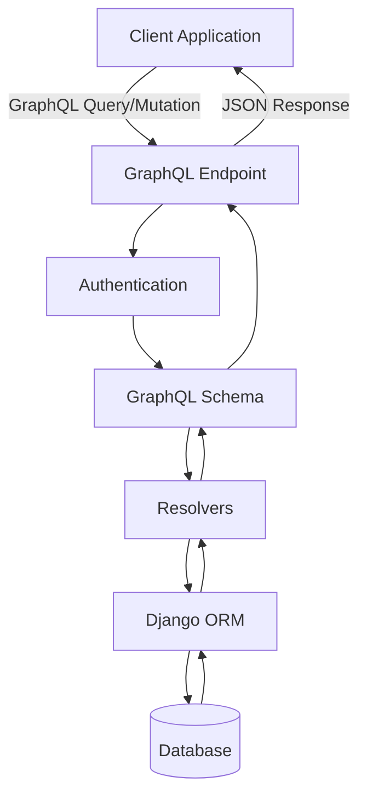

# How to Build GraphQL APIs with Graphene-Django

Author: [nawazdhandala](https://www.github.com/nawazdhandala)

Tags: Django, Python, GraphQL, Graphene, API

Description: Learn how to build powerful GraphQL APIs with Graphene-Django. This comprehensive guide covers schema design, queries, mutations, subscriptions, authentication, and performance optimization with practical examples.

---

> GraphQL provides a flexible, efficient alternative to REST APIs by allowing clients to request exactly the data they need. Graphene-Django brings this power to Django applications with seamless ORM integration, automatic type generation, and Django-native patterns.

GraphQL has revolutionized how we think about APIs. Instead of multiple endpoints returning fixed data structures, GraphQL exposes a single endpoint where clients can query precisely what they need. This reduces over-fetching, eliminates under-fetching, and provides a strongly-typed contract between client and server.

---

## Why GraphQL with Django?

| Feature | REST API | GraphQL API |
|---------|----------|-------------|
| **Endpoints** | Multiple endpoints | Single endpoint |
| **Data Fetching** | Fixed response structure | Client specifies fields |
| **Versioning** | URL or header-based | Schema evolution |
| **Documentation** | External tools (Swagger) | Self-documenting schema |
| **Type Safety** | Manual validation | Built-in type system |
| **Batching** | Multiple requests | Single request |

Graphene-Django provides deep integration with Django's ORM, authentication system, and middleware, making it the natural choice for Django developers.

---

## Architecture Overview

The following diagram shows how GraphQL requests flow through a Graphene-Django application:



---

## Installation and Setup

First, install the required packages for your Django project:

```bash
pip install graphene-django django-filter
```

Add Graphene-Django to your installed apps and configure the schema path in your Django settings file:

```python
# settings.py
INSTALLED_APPS = [
    'django.contrib.admin',
    'django.contrib.auth',
    'django.contrib.contenttypes',
    'django.contrib.sessions',
    'django.contrib.messages',
    'django.contrib.staticfiles',
    # Third-party apps
    'graphene_django',
    'django_filters',
    # Your apps
    'books',
    'authors',
]

# Configure Graphene-Django with the path to your schema
GRAPHENE = {
    'SCHEMA': 'myproject.schema.schema',
    'MIDDLEWARE': [
        'graphql_jwt.middleware.JSONWebTokenMiddleware',
    ],
}
```

---

## Defining Django Models

Let us create a book catalog application with authors and books. These models will serve as the foundation for our GraphQL API:

```python
# books/models.py
from django.db import models
from django.contrib.auth import get_user_model

User = get_user_model()


class Author(models.Model):
    """
    Represents a book author with biographical information.
    The user field links to Django's authentication system for author accounts.
    """
    user = models.OneToOneField(
        User,
        on_delete=models.CASCADE,
        related_name='author_profile',
        null=True,
        blank=True
    )
    name = models.CharField(max_length=200)
    bio = models.TextField(blank=True)
    birth_date = models.DateField(null=True, blank=True)
    country = models.CharField(max_length=100, blank=True)
    website = models.URLField(blank=True)
    created_at = models.DateTimeField(auto_now_add=True)
    updated_at = models.DateTimeField(auto_now=True)

    class Meta:
        ordering = ['name']

    def __str__(self):
        return self.name

    @property
    def book_count(self):
        """Returns the total number of books by this author."""
        return self.books.count()


class Category(models.Model):
    """
    Book categories for organizing the catalog.
    Supports hierarchical categories through the parent field.
    """
    name = models.CharField(max_length=100, unique=True)
    slug = models.SlugField(unique=True)
    description = models.TextField(blank=True)
    parent = models.ForeignKey(
        'self',
        on_delete=models.CASCADE,
        null=True,
        blank=True,
        related_name='subcategories'
    )

    class Meta:
        verbose_name_plural = 'Categories'
        ordering = ['name']

    def __str__(self):
        return self.name


class Book(models.Model):
    """
    Represents a book in the catalog with full metadata.
    Supports multiple authors and categories through many-to-many relationships.
    """
    LANGUAGE_CHOICES = [
        ('en', 'English'),
        ('es', 'Spanish'),
        ('fr', 'French'),
        ('de', 'German'),
        ('zh', 'Chinese'),
        ('ja', 'Japanese'),
    ]

    title = models.CharField(max_length=300)
    isbn = models.CharField(max_length=13, unique=True)
    authors = models.ManyToManyField(Author, related_name='books')
    categories = models.ManyToManyField(Category, related_name='books')
    description = models.TextField(blank=True)
    publication_date = models.DateField()
    publisher = models.CharField(max_length=200)
    page_count = models.PositiveIntegerField()
    language = models.CharField(max_length=2, choices=LANGUAGE_CHOICES, default='en')
    cover_image = models.URLField(blank=True)
    price = models.DecimalField(max_digits=10, decimal_places=2)
    is_available = models.BooleanField(default=True)
    created_at = models.DateTimeField(auto_now_add=True)
    updated_at = models.DateTimeField(auto_now=True)

    class Meta:
        ordering = ['-publication_date']

    def __str__(self):
        return self.title


class Review(models.Model):
    """
    User reviews for books with ratings and comments.
    Each user can only review a book once (enforced by unique_together).
    """
    book = models.ForeignKey(Book, on_delete=models.CASCADE, related_name='reviews')
    user = models.ForeignKey(User, on_delete=models.CASCADE, related_name='reviews')
    rating = models.PositiveSmallIntegerField(choices=[(i, i) for i in range(1, 6)])
    title = models.CharField(max_length=200)
    content = models.TextField()
    created_at = models.DateTimeField(auto_now_add=True)
    updated_at = models.DateTimeField(auto_now=True)

    class Meta:
        unique_together = ['book', 'user']
        ordering = ['-created_at']

    def __str__(self):
        return f"{self.user.username}'s review of {self.book.title}"
```

---

## Creating GraphQL Types

GraphQL types define the shape of your data. Graphene-Django can automatically generate types from Django models using DjangoObjectType:

```python
# books/types.py
import graphene
from graphene_django import DjangoObjectType
from graphene_django.filter import DjangoFilterConnectionField
from django.contrib.auth import get_user_model

from .models import Author, Category, Book, Review

User = get_user_model()


class UserType(DjangoObjectType):
    """
    GraphQL type for Django's User model.
    Excludes sensitive fields like password from the API.
    """
    class Meta:
        model = User
        # Only expose safe fields - never expose password
        fields = ['id', 'username', 'email', 'first_name', 'last_name', 'date_joined']
        # Enable filtering on specific fields
        filter_fields = {
            'username': ['exact', 'icontains'],
            'email': ['exact', 'icontains'],
        }
        # Use Node interface for Relay-style pagination
        interfaces = (graphene.relay.Node,)


class AuthorType(DjangoObjectType):
    """
    GraphQL type for Author model with computed fields.
    Includes a custom resolver for the book_count field.
    """
    # Add a computed field not directly on the model
    book_count = graphene.Int(description="Total number of books by this author")

    class Meta:
        model = Author
        fields = '__all__'
        filter_fields = {
            'name': ['exact', 'icontains', 'istartswith'],
            'country': ['exact', 'icontains'],
            'birth_date': ['exact', 'year', 'year__gt', 'year__lt'],
        }
        interfaces = (graphene.relay.Node,)

    def resolve_book_count(self, info):
        """
        Custom resolver for the book_count field.
        Accesses the model's property to return the count.
        """
        return self.book_count


class CategoryType(DjangoObjectType):
    """
    GraphQL type for Category model with nested subcategories.
    Supports hierarchical category browsing.
    """
    # Expose subcategories as a list
    subcategories = graphene.List(lambda: CategoryType)
    book_count = graphene.Int()

    class Meta:
        model = Category
        fields = ['id', 'name', 'slug', 'description', 'parent', 'subcategories', 'books']
        filter_fields = {
            'name': ['exact', 'icontains'],
            'slug': ['exact'],
        }
        interfaces = (graphene.relay.Node,)

    def resolve_subcategories(self, info):
        """Returns all child categories of this category."""
        return self.subcategories.all()

    def resolve_book_count(self, info):
        """Returns the number of books in this category."""
        return self.books.count()


class BookType(DjangoObjectType):
    """
    GraphQL type for Book model with full filtering support.
    Includes relationships to authors, categories, and reviews.
    """
    # Add computed fields
    average_rating = graphene.Float()
    review_count = graphene.Int()

    class Meta:
        model = Book
        fields = '__all__'
        filter_fields = {
            'title': ['exact', 'icontains', 'istartswith'],
            'isbn': ['exact'],
            'authors__name': ['exact', 'icontains'],
            'categories__slug': ['exact'],
            'publication_date': ['exact', 'year', 'year__gt', 'year__lt', 'gte', 'lte'],
            'language': ['exact'],
            'is_available': ['exact'],
            'price': ['exact', 'gte', 'lte', 'range'],
        }
        interfaces = (graphene.relay.Node,)

    def resolve_average_rating(self, info):
        """
        Calculates the average rating from all reviews.
        Returns None if no reviews exist.
        """
        reviews = self.reviews.all()
        if not reviews:
            return None
        return sum(r.rating for r in reviews) / len(reviews)

    def resolve_review_count(self, info):
        """Returns the total number of reviews for this book."""
        return self.reviews.count()


class ReviewType(DjangoObjectType):
    """
    GraphQL type for Review model.
    Links reviews to both books and users.
    """
    class Meta:
        model = Review
        fields = '__all__'
        filter_fields = {
            'rating': ['exact', 'gte', 'lte'],
            'book__title': ['exact', 'icontains'],
            'user__username': ['exact'],
            'created_at': ['gte', 'lte'],
        }
        interfaces = (graphene.relay.Node,)
```

---

## Building Queries

Queries are the read operations in GraphQL. They define how clients can fetch data from your API:

```python
# books/queries.py
import graphene
from graphene_django.filter import DjangoFilterConnectionField
from django.db.models import Avg, Count

from .models import Author, Category, Book, Review
from .types import AuthorType, CategoryType, BookType, ReviewType


class BookQueries(graphene.ObjectType):
    """
    Root queries for the book catalog API.
    Provides both individual lookup and list queries with filtering.
    """

    # Single item queries - fetch by ID or unique field
    author = graphene.Field(
        AuthorType,
        id=graphene.ID(),
        name=graphene.String(),
        description="Fetch a single author by ID or name"
    )

    book = graphene.Field(
        BookType,
        id=graphene.ID(),
        isbn=graphene.String(),
        description="Fetch a single book by ID or ISBN"
    )

    category = graphene.Field(
        CategoryType,
        id=graphene.ID(),
        slug=graphene.String(),
        description="Fetch a single category by ID or slug"
    )

    # List queries with filtering and pagination
    all_authors = DjangoFilterConnectionField(
        AuthorType,
        description="Fetch all authors with optional filtering"
    )

    all_books = DjangoFilterConnectionField(
        BookType,
        description="Fetch all books with optional filtering"
    )

    all_categories = DjangoFilterConnectionField(
        CategoryType,
        description="Fetch all categories with optional filtering"
    )

    all_reviews = DjangoFilterConnectionField(
        ReviewType,
        description="Fetch all reviews with optional filtering"
    )

    # Custom queries for specific use cases
    featured_books = graphene.List(
        BookType,
        limit=graphene.Int(default_value=10),
        description="Fetch featured books sorted by average rating"
    )

    search_books = graphene.List(
        BookType,
        query=graphene.String(required=True),
        description="Search books by title, author, or description"
    )

    books_by_price_range = graphene.List(
        BookType,
        min_price=graphene.Float(required=True),
        max_price=graphene.Float(required=True),
        description="Fetch books within a price range"
    )

    def resolve_author(self, info, id=None, name=None):
        """
        Resolves a single author by ID or name.
        At least one parameter must be provided.
        """
        if id:
            return Author.objects.filter(pk=id).first()
        if name:
            return Author.objects.filter(name__iexact=name).first()
        return None

    def resolve_book(self, info, id=None, isbn=None):
        """
        Resolves a single book by ID or ISBN.
        ISBN lookup is useful for external integrations.
        """
        if id:
            return Book.objects.filter(pk=id).first()
        if isbn:
            return Book.objects.filter(isbn=isbn).first()
        return None

    def resolve_category(self, info, id=None, slug=None):
        """
        Resolves a single category by ID or slug.
        Slug lookup enables SEO-friendly URLs.
        """
        if id:
            return Category.objects.filter(pk=id).first()
        if slug:
            return Category.objects.filter(slug=slug).first()
        return None

    def resolve_featured_books(self, info, limit):
        """
        Returns books sorted by average rating.
        Uses Django ORM aggregation for efficient calculation.
        """
        return Book.objects.annotate(
            avg_rating=Avg('reviews__rating'),
            num_reviews=Count('reviews')
        ).filter(
            is_available=True,
            num_reviews__gte=1
        ).order_by('-avg_rating')[:limit]

    def resolve_search_books(self, info, query):
        """
        Full-text search across book title, author names, and description.
        Returns books matching any of the search criteria.
        """
        from django.db.models import Q

        return Book.objects.filter(
            Q(title__icontains=query) |
            Q(authors__name__icontains=query) |
            Q(description__icontains=query)
        ).distinct()

    def resolve_books_by_price_range(self, info, min_price, max_price):
        """
        Returns available books within the specified price range.
        Useful for budget-conscious shoppers.
        """
        return Book.objects.filter(
            price__gte=min_price,
            price__lte=max_price,
            is_available=True
        ).order_by('price')
```

---

## Implementing Mutations

Mutations handle create, update, and delete operations. Here is how to implement them with proper validation and error handling:

```python
# books/mutations.py
import graphene
from graphene_django.forms.mutation import DjangoFormMutation
from django.core.exceptions import ValidationError
from django.db import transaction

from .models import Author, Category, Book, Review
from .types import AuthorType, CategoryType, BookType, ReviewType


class AuthorInput(graphene.InputObjectType):
    """Input type for creating or updating an author."""
    name = graphene.String(required=True)
    bio = graphene.String()
    birth_date = graphene.Date()
    country = graphene.String()
    website = graphene.String()


class CreateAuthor(graphene.Mutation):
    """
    Creates a new author in the database.
    Returns the created author or error messages.
    """
    class Arguments:
        input = AuthorInput(required=True)

    # Define return fields
    author = graphene.Field(AuthorType)
    success = graphene.Boolean()
    errors = graphene.List(graphene.String)

    @classmethod
    def mutate(cls, root, info, input):
        """
        Creates an author from the input data.
        Performs validation before saving.
        """
        errors = []

        # Validate required fields
        if not input.name or len(input.name.strip()) < 2:
            errors.append("Author name must be at least 2 characters")

        # Check for duplicate names
        if Author.objects.filter(name__iexact=input.name).exists():
            errors.append("An author with this name already exists")

        if errors:
            return CreateAuthor(author=None, success=False, errors=errors)

        try:
            author = Author.objects.create(
                name=input.name,
                bio=input.bio or '',
                birth_date=input.birth_date,
                country=input.country or '',
                website=input.website or ''
            )
            return CreateAuthor(author=author, success=True, errors=[])
        except Exception as e:
            return CreateAuthor(author=None, success=False, errors=[str(e)])


class UpdateAuthor(graphene.Mutation):
    """
    Updates an existing author.
    Only provided fields are updated.
    """
    class Arguments:
        id = graphene.ID(required=True)
        input = AuthorInput(required=True)

    author = graphene.Field(AuthorType)
    success = graphene.Boolean()
    errors = graphene.List(graphene.String)

    @classmethod
    def mutate(cls, root, info, id, input):
        """
        Updates author fields from input.
        Returns error if author not found.
        """
        try:
            author = Author.objects.get(pk=id)
        except Author.DoesNotExist:
            return UpdateAuthor(
                author=None,
                success=False,
                errors=["Author not found"]
            )

        # Update only provided fields
        if input.name:
            author.name = input.name
        if input.bio is not None:
            author.bio = input.bio
        if input.birth_date:
            author.birth_date = input.birth_date
        if input.country is not None:
            author.country = input.country
        if input.website is not None:
            author.website = input.website

        author.save()
        return UpdateAuthor(author=author, success=True, errors=[])


class DeleteAuthor(graphene.Mutation):
    """
    Deletes an author from the database.
    Fails if author has associated books.
    """
    class Arguments:
        id = graphene.ID(required=True)

    success = graphene.Boolean()
    errors = graphene.List(graphene.String)

    @classmethod
    def mutate(cls, root, info, id):
        """
        Deletes author after checking for dependencies.
        Prevents deletion if author has books.
        """
        try:
            author = Author.objects.get(pk=id)
        except Author.DoesNotExist:
            return DeleteAuthor(success=False, errors=["Author not found"])

        # Check for associated books
        if author.books.exists():
            return DeleteAuthor(
                success=False,
                errors=["Cannot delete author with associated books"]
            )

        author.delete()
        return DeleteAuthor(success=True, errors=[])


class BookInput(graphene.InputObjectType):
    """Input type for creating or updating a book."""
    title = graphene.String(required=True)
    isbn = graphene.String(required=True)
    author_ids = graphene.List(graphene.ID, required=True)
    category_ids = graphene.List(graphene.ID)
    description = graphene.String()
    publication_date = graphene.Date(required=True)
    publisher = graphene.String(required=True)
    page_count = graphene.Int(required=True)
    language = graphene.String()
    cover_image = graphene.String()
    price = graphene.Float(required=True)
    is_available = graphene.Boolean()


class CreateBook(graphene.Mutation):
    """
    Creates a new book with all its relationships.
    Uses a database transaction for data integrity.
    """
    class Arguments:
        input = BookInput(required=True)

    book = graphene.Field(BookType)
    success = graphene.Boolean()
    errors = graphene.List(graphene.String)

    @classmethod
    @transaction.atomic
    def mutate(cls, root, info, input):
        """
        Creates a book and associates it with authors and categories.
        Validates ISBN uniqueness and author existence.
        """
        errors = []

        # Validate ISBN
        if len(input.isbn) not in [10, 13]:
            errors.append("ISBN must be 10 or 13 characters")

        if Book.objects.filter(isbn=input.isbn).exists():
            errors.append("A book with this ISBN already exists")

        # Validate authors exist
        authors = Author.objects.filter(pk__in=input.author_ids)
        if authors.count() != len(input.author_ids):
            errors.append("One or more authors not found")

        # Validate price
        if input.price <= 0:
            errors.append("Price must be positive")

        if errors:
            return CreateBook(book=None, success=False, errors=errors)

        try:
            book = Book.objects.create(
                title=input.title,
                isbn=input.isbn,
                description=input.description or '',
                publication_date=input.publication_date,
                publisher=input.publisher,
                page_count=input.page_count,
                language=input.language or 'en',
                cover_image=input.cover_image or '',
                price=input.price,
                is_available=input.is_available if input.is_available is not None else True
            )

            # Set many-to-many relationships
            book.authors.set(authors)

            if input.category_ids:
                categories = Category.objects.filter(pk__in=input.category_ids)
                book.categories.set(categories)

            return CreateBook(book=book, success=True, errors=[])
        except Exception as e:
            return CreateBook(book=None, success=False, errors=[str(e)])


class ReviewInput(graphene.InputObjectType):
    """Input type for creating a book review."""
    book_id = graphene.ID(required=True)
    rating = graphene.Int(required=True)
    title = graphene.String(required=True)
    content = graphene.String(required=True)


class CreateReview(graphene.Mutation):
    """
    Creates a review for a book.
    Requires authentication and prevents duplicate reviews.
    """
    class Arguments:
        input = ReviewInput(required=True)

    review = graphene.Field(ReviewType)
    success = graphene.Boolean()
    errors = graphene.List(graphene.String)

    @classmethod
    def mutate(cls, root, info, input):
        """
        Creates a review from authenticated user.
        Validates rating range and prevents duplicates.
        """
        # Check authentication
        user = info.context.user
        if not user.is_authenticated:
            return CreateReview(
                review=None,
                success=False,
                errors=["Authentication required"]
            )

        errors = []

        # Validate rating
        if not 1 <= input.rating <= 5:
            errors.append("Rating must be between 1 and 5")

        # Get the book
        try:
            book = Book.objects.get(pk=input.book_id)
        except Book.DoesNotExist:
            errors.append("Book not found")
            return CreateReview(review=None, success=False, errors=errors)

        # Check for existing review
        if Review.objects.filter(book=book, user=user).exists():
            errors.append("You have already reviewed this book")

        if errors:
            return CreateReview(review=None, success=False, errors=errors)

        review = Review.objects.create(
            book=book,
            user=user,
            rating=input.rating,
            title=input.title,
            content=input.content
        )

        return CreateReview(review=review, success=True, errors=[])


class BookMutations(graphene.ObjectType):
    """
    Root mutations for the book catalog API.
    Groups all mutation operations together.
    """
    create_author = CreateAuthor.Field()
    update_author = UpdateAuthor.Field()
    delete_author = DeleteAuthor.Field()
    create_book = CreateBook.Field()
    create_review = CreateReview.Field()
```

---

## Authentication and Authorization

Secure your GraphQL API using Django's authentication system with JWT tokens:

```python
# authentication.py
import graphene
import graphql_jwt
from graphql_jwt.decorators import login_required, permission_required
from django.contrib.auth import get_user_model

from books.types import UserType

User = get_user_model()


class ObtainJSONWebToken(graphql_jwt.ObtainJSONWebToken):
    """
    Custom JWT mutation that returns user data along with the token.
    Extends the default behavior to include user information.
    """
    user = graphene.Field(UserType)

    @classmethod
    def resolve(cls, root, info, **kwargs):
        """Returns the authenticated user with the token."""
        return cls(user=info.context.user)


class AuthMutations(graphene.ObjectType):
    """
    Authentication mutations for JWT-based auth.
    Provides login, token refresh, and token verification.
    """
    # Obtain a new token pair
    token_auth = ObtainJSONWebToken.Field()
    # Verify an existing token
    verify_token = graphql_jwt.Verify.Field()
    # Refresh an expiring token
    refresh_token = graphql_jwt.Refresh.Field()
    # Revoke a refresh token
    revoke_token = graphql_jwt.Revoke.Field()
```

Create a decorator for protecting mutations that require specific permissions:

```python
# decorators.py
from functools import wraps
from graphql import GraphQLError


def login_required(func):
    """
    Decorator that ensures user is authenticated.
    Raises GraphQLError if not authenticated.
    """
    @wraps(func)
    def wrapper(cls, root, info, *args, **kwargs):
        user = info.context.user
        if not user.is_authenticated:
            raise GraphQLError("Authentication required")
        return func(cls, root, info, *args, **kwargs)
    return wrapper


def permission_required(permission):
    """
    Decorator that checks for specific permission.
    Use with Django's permission system.
    """
    def decorator(func):
        @wraps(func)
        def wrapper(cls, root, info, *args, **kwargs):
            user = info.context.user
            if not user.is_authenticated:
                raise GraphQLError("Authentication required")
            if not user.has_perm(permission):
                raise GraphQLError(f"Permission denied: {permission}")
            return func(cls, root, info, *args, **kwargs)
        return wrapper
    return decorator


def owner_required(get_owner_func):
    """
    Decorator that ensures user owns the resource.
    The get_owner_func extracts the owner from the object.
    """
    def decorator(func):
        @wraps(func)
        def wrapper(cls, root, info, *args, **kwargs):
            user = info.context.user
            if not user.is_authenticated:
                raise GraphQLError("Authentication required")

            # Get the object and check ownership
            obj = get_owner_func(*args, **kwargs)
            if obj and obj != user and not user.is_staff:
                raise GraphQLError("You do not own this resource")

            return func(cls, root, info, *args, **kwargs)
        return wrapper
    return decorator
```

---

## Performance Optimization

The N+1 query problem is common in GraphQL. Use DataLoader and select_related/prefetch_related to optimize database queries:

```python
# dataloaders.py
from collections import defaultdict
from promise import Promise
from promise.dataloader import DataLoader
from django.db.models import Prefetch

from .models import Author, Book, Review


class AuthorLoader(DataLoader):
    """
    DataLoader for batching author queries.
    Reduces N+1 queries when loading authors for multiple books.
    """
    def batch_load_fn(self, author_ids):
        """
        Loads all requested authors in a single query.
        Returns authors in the same order as requested IDs.
        """
        authors = Author.objects.filter(pk__in=author_ids)
        author_map = {author.pk: author for author in authors}
        return Promise.resolve([author_map.get(id) for id in author_ids])


class BooksByAuthorLoader(DataLoader):
    """
    DataLoader for loading books by author.
    Efficiently fetches books for multiple authors at once.
    """
    def batch_load_fn(self, author_ids):
        """
        Loads books for multiple authors in a single query.
        Groups books by author_id for efficient lookup.
        """
        books = Book.objects.filter(
            authors__pk__in=author_ids
        ).prefetch_related('authors', 'categories')

        # Group books by author
        books_by_author = defaultdict(list)
        for book in books:
            for author in book.authors.all():
                if author.pk in author_ids:
                    books_by_author[author.pk].append(book)

        return Promise.resolve([books_by_author[id] for id in author_ids])


class ReviewsByBookLoader(DataLoader):
    """
    DataLoader for loading reviews by book.
    Batches review queries across multiple books.
    """
    def batch_load_fn(self, book_ids):
        """
        Loads reviews for multiple books efficiently.
        Includes user data to prevent additional queries.
        """
        reviews = Review.objects.filter(
            book_id__in=book_ids
        ).select_related('user').order_by('-created_at')

        # Group reviews by book
        reviews_by_book = defaultdict(list)
        for review in reviews:
            reviews_by_book[review.book_id].append(review)

        return Promise.resolve([reviews_by_book[id] for id in book_ids])


def get_loaders():
    """
    Factory function that creates fresh DataLoader instances.
    Call this for each request to ensure proper caching.
    """
    return {
        'author_loader': AuthorLoader(),
        'books_by_author_loader': BooksByAuthorLoader(),
        'reviews_by_book_loader': ReviewsByBookLoader(),
    }
```

Integrate DataLoaders into your GraphQL context through custom middleware:

```python
# middleware.py
from .dataloaders import get_loaders


class DataLoaderMiddleware:
    """
    Middleware that attaches DataLoaders to the request context.
    Creates fresh loaders for each request to avoid stale cache.
    """
    def resolve(self, next, root, info, **args):
        """
        Adds loaders to info.context before resolution.
        Loaders are shared across all resolvers in a request.
        """
        if not hasattr(info.context, 'loaders'):
            info.context.loaders = get_loaders()
        return next(root, info, **args)
```

Update your types to use DataLoaders for efficient relationship loading:

```python
# optimized_types.py
import graphene
from graphene_django import DjangoObjectType

from .models import Author, Book


class OptimizedAuthorType(DjangoObjectType):
    """
    Author type with DataLoader optimization.
    Uses batched queries for related books.
    """
    books = graphene.List(lambda: OptimizedBookType)

    class Meta:
        model = Author
        fields = '__all__'

    def resolve_books(self, info):
        """
        Uses DataLoader instead of direct ORM query.
        Batches book loading across all authors in the query.
        """
        return info.context.loaders['books_by_author_loader'].load(self.pk)


class OptimizedBookType(DjangoObjectType):
    """
    Book type with DataLoader optimization.
    Uses batched queries for reviews.
    """
    reviews = graphene.List(lambda: ReviewType)

    class Meta:
        model = Book
        fields = '__all__'

    def resolve_reviews(self, info):
        """
        Uses DataLoader for efficient review loading.
        Prevents N+1 queries when fetching multiple books.
        """
        return info.context.loaders['reviews_by_book_loader'].load(self.pk)
```

---

## Query Complexity and Depth Limiting

Protect your API from expensive queries by limiting depth and complexity:

```python
# complexity.py
from graphene_django.views import GraphQLView
from graphql import parse, validate
from graphql.validation import NoSchemaIntrospectionCustomRule


class QueryComplexityValidator:
    """
    Validates query complexity before execution.
    Prevents resource exhaustion from deeply nested queries.
    """
    def __init__(self, max_depth=10, max_complexity=100):
        self.max_depth = max_depth
        self.max_complexity = max_complexity

    def calculate_depth(self, node, current_depth=0):
        """
        Recursively calculates the maximum depth of a query.
        Counts nested selection sets.
        """
        if not hasattr(node, 'selection_set') or not node.selection_set:
            return current_depth

        max_child_depth = current_depth
        for selection in node.selection_set.selections:
            child_depth = self.calculate_depth(selection, current_depth + 1)
            max_child_depth = max(max_child_depth, child_depth)

        return max_child_depth

    def calculate_complexity(self, node, multiplier=1):
        """
        Calculates query complexity based on fields and arguments.
        List fields multiply the complexity of their children.
        """
        if not hasattr(node, 'selection_set') or not node.selection_set:
            return multiplier

        complexity = 0
        for selection in node.selection_set.selections:
            field_multiplier = multiplier

            # Check for pagination arguments that increase complexity
            if hasattr(selection, 'arguments'):
                for arg in selection.arguments:
                    if arg.name.value in ['first', 'last']:
                        try:
                            field_multiplier *= int(arg.value.value)
                        except (AttributeError, ValueError):
                            field_multiplier *= 10  # Default multiplier

            complexity += self.calculate_complexity(selection, field_multiplier)

        return complexity + multiplier

    def validate(self, query_string):
        """
        Validates a query against depth and complexity limits.
        Returns tuple of (is_valid, error_message).
        """
        try:
            document = parse(query_string)
        except Exception as e:
            return False, f"Parse error: {str(e)}"

        for definition in document.definitions:
            depth = self.calculate_depth(definition)
            if depth > self.max_depth:
                return False, f"Query depth {depth} exceeds maximum {self.max_depth}"

            complexity = self.calculate_complexity(definition)
            if complexity > self.max_complexity:
                return False, f"Query complexity {complexity} exceeds maximum {self.max_complexity}"

        return True, None


class ProtectedGraphQLView(GraphQLView):
    """
    GraphQL view with query validation.
    Rejects queries that exceed complexity limits.
    """
    validator = QueryComplexityValidator(max_depth=7, max_complexity=500)

    def execute_graphql_request(self, request, data, query, *args, **kwargs):
        """
        Validates query before execution.
        Returns error response for invalid queries.
        """
        if query:
            is_valid, error = self.validator.validate(query)
            if not is_valid:
                return self.json_response(request, {"errors": [{"message": error}]})

        return super().execute_graphql_request(request, data, query, *args, **kwargs)
```

---

## Complete Schema Assembly

Combine all components into a complete schema:

```python
# schema.py
import graphene

from books.queries import BookQueries
from books.mutations import BookMutations
from authentication import AuthMutations


class Query(BookQueries, graphene.ObjectType):
    """
    Root query combining all query types.
    Add additional query classes here as the API grows.
    """
    pass


class Mutation(BookMutations, AuthMutations, graphene.ObjectType):
    """
    Root mutation combining all mutation types.
    Includes both domain and authentication mutations.
    """
    pass


# Create the schema instance that Django will use
schema = graphene.Schema(
    query=Query,
    mutation=Mutation,
    # Enable automatic type discovery
    auto_camelcase=True
)
```

Configure the URL routing to expose the GraphQL endpoint:

```python
# urls.py
from django.urls import path
from graphene_django.views import GraphQLView
from django.views.decorators.csrf import csrf_exempt

from .complexity import ProtectedGraphQLView
from .schema import schema

urlpatterns = [
    # GraphQL endpoint with GraphiQL interface for development
    path(
        'graphql/',
        csrf_exempt(ProtectedGraphQLView.as_view(
            graphiql=True,
            schema=schema
        ))
    ),
]
```

---

## Query Examples

Here are practical examples showing how clients interact with your GraphQL API.

Fetch a list of books with author information and reviews:

```graphql
query GetBooksWithDetails {
  allBooks(first: 10, isAvailable: true) {
    edges {
      node {
        id
        title
        isbn
        price
        publicationDate
        averageRating
        reviewCount
        authors {
          edges {
            node {
              name
              country
            }
          }
        }
        categories {
          edges {
            node {
              name
              slug
            }
          }
        }
      }
    }
    pageInfo {
      hasNextPage
      endCursor
    }
  }
}
```

Search for books by a specific term:

```graphql
query SearchBooks {
  searchBooks(query: "python programming") {
    id
    title
    authors {
      edges {
        node {
          name
        }
      }
    }
    price
    averageRating
  }
}
```

Create a new book with a mutation:

```graphql
mutation CreateNewBook {
  createBook(input: {
    title: "GraphQL with Django"
    isbn: "9781234567890"
    authorIds: ["1", "2"]
    categoryIds: ["3"]
    description: "A comprehensive guide to building GraphQL APIs with Django"
    publicationDate: "2026-01-15"
    publisher: "Tech Books Publishing"
    pageCount: 450
    language: "en"
    price: 49.99
    isAvailable: true
  }) {
    success
    errors
    book {
      id
      title
      authors {
        edges {
          node {
            name
          }
        }
      }
    }
  }
}
```

Submit a book review:

```graphql
mutation SubmitReview {
  createReview(input: {
    bookId: "Qm9va1R5cGU6MQ=="
    rating: 5
    title: "Excellent resource for Django developers"
    content: "This book provides clear explanations and practical examples. Highly recommended for anyone building APIs with Django."
  }) {
    success
    errors
    review {
      id
      rating
      title
      createdAt
    }
  }
}
```

---

## Testing GraphQL APIs

Write comprehensive tests for your GraphQL schema:

```python
# tests/test_queries.py
from django.test import TestCase
from graphene_django.utils.testing import GraphQLTestCase

from books.models import Author, Book, Category
from myproject.schema import schema


class BookQueryTests(GraphQLTestCase):
    """
    Test cases for book-related GraphQL queries.
    Uses GraphQLTestCase for convenient query execution.
    """
    GRAPHQL_SCHEMA = schema

    def setUp(self):
        """Create test data before each test."""
        self.author = Author.objects.create(
            name="Test Author",
            bio="A test author biography",
            country="USA"
        )
        self.category = Category.objects.create(
            name="Programming",
            slug="programming"
        )
        self.book = Book.objects.create(
            title="Test Book",
            isbn="1234567890123",
            description="A test book",
            publication_date="2026-01-01",
            publisher="Test Publisher",
            page_count=200,
            price=29.99
        )
        self.book.authors.add(self.author)
        self.book.categories.add(self.category)

    def test_query_all_books(self):
        """Test fetching all books returns expected data."""
        response = self.query(
            '''
            query {
              allBooks {
                edges {
                  node {
                    title
                    isbn
                    price
                  }
                }
              }
            }
            '''
        )

        self.assertResponseNoErrors(response)
        content = response.json()

        books = content['data']['allBooks']['edges']
        self.assertEqual(len(books), 1)
        self.assertEqual(books[0]['node']['title'], "Test Book")

    def test_query_book_by_isbn(self):
        """Test fetching a book by ISBN."""
        response = self.query(
            '''
            query GetBook($isbn: String!) {
              book(isbn: $isbn) {
                title
                authors {
                  edges {
                    node {
                      name
                    }
                  }
                }
              }
            }
            ''',
            variables={'isbn': '1234567890123'}
        )

        self.assertResponseNoErrors(response)
        content = response.json()

        book = content['data']['book']
        self.assertEqual(book['title'], "Test Book")
        self.assertEqual(len(book['authors']['edges']), 1)

    def test_query_nonexistent_book(self):
        """Test querying a book that does not exist returns null."""
        response = self.query(
            '''
            query {
              book(isbn: "0000000000000") {
                title
              }
            }
            '''
        )

        self.assertResponseNoErrors(response)
        content = response.json()
        self.assertIsNone(content['data']['book'])


class BookMutationTests(GraphQLTestCase):
    """
    Test cases for book-related GraphQL mutations.
    Tests both successful operations and error handling.
    """
    GRAPHQL_SCHEMA = schema

    def setUp(self):
        """Create prerequisite data for mutations."""
        self.author = Author.objects.create(
            name="Existing Author",
            country="UK"
        )

    def test_create_author(self):
        """Test creating a new author through mutation."""
        response = self.query(
            '''
            mutation {
              createAuthor(input: {
                name: "New Author"
                bio: "A new author bio"
                country: "Canada"
              }) {
                success
                errors
                author {
                  name
                  country
                }
              }
            }
            '''
        )

        self.assertResponseNoErrors(response)
        content = response.json()

        result = content['data']['createAuthor']
        self.assertTrue(result['success'])
        self.assertEqual(result['author']['name'], "New Author")
        self.assertEqual(Author.objects.count(), 2)

    def test_create_duplicate_author_fails(self):
        """Test that creating a duplicate author returns an error."""
        response = self.query(
            '''
            mutation {
              createAuthor(input: {
                name: "Existing Author"
              }) {
                success
                errors
              }
            }
            '''
        )

        self.assertResponseNoErrors(response)
        content = response.json()

        result = content['data']['createAuthor']
        self.assertFalse(result['success'])
        self.assertIn("already exists", result['errors'][0])
```

---

## Best Practices Summary

Following these best practices will help you build robust, maintainable GraphQL APIs:

1. **Use DataLoaders** - Always batch database queries to prevent N+1 problems
2. **Implement depth limiting** - Protect against deeply nested malicious queries
3. **Add complexity analysis** - Prevent resource exhaustion from expensive queries
4. **Validate inputs thoroughly** - Check data before database operations
5. **Use transactions** - Wrap related mutations in database transactions
6. **Return meaningful errors** - Help clients understand what went wrong
7. **Document your schema** - Add descriptions to types, fields, and arguments
8. **Test comprehensively** - Cover queries, mutations, and edge cases
9. **Monitor performance** - Track query execution times and complexity
10. **Version carefully** - Use schema evolution instead of breaking changes

---

## Conclusion

Graphene-Django provides a powerful foundation for building GraphQL APIs with Django. By combining Django's robust ORM with GraphQL's flexible query language, you can create APIs that are both developer-friendly and performant.

Key takeaways from this guide:

- **Types map directly to models** - DjangoObjectType simplifies schema definition
- **Filtering is built-in** - DjangoFilterConnectionField handles complex queries
- **Authentication integrates seamlessly** - Use Django's auth with JWT tokens
- **Performance requires attention** - DataLoaders and query limits are essential
- **Testing is straightforward** - GraphQLTestCase provides convenient utilities

Start with simple queries and mutations, then gradually add complexity as your application grows. The strong typing and self-documenting nature of GraphQL will make your API easier to maintain and evolve over time.

---

*Need to monitor your GraphQL API performance? [OneUptime](https://oneuptime.com) provides comprehensive API monitoring with support for GraphQL endpoints, query performance tracking, and alerting.*

**Related Reading:**
- [How to Instrument Python Applications with OpenTelemetry](https://oneuptime.com/blog/post/2025-01-06-instrument-python-opentelemetry/view)
- [How to Secure FastAPI Applications Against OWASP Top 10](https://oneuptime.com/blog/post/2025-01-06-fastapi-owasp-security/view)
