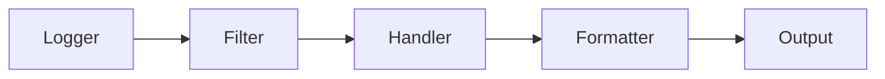

# How to Add Logging to Django Applications

Author: [nawazdhandala](https://github.com/nawazdhandala)

Tags: Python, Django, Logging, Observability, Best Practices

Description: Learn how to configure Django's logging system for development and production, including formatters, handlers, log rotation, and structured logging.

---

Logging is one of those things you don't think about until something breaks in production at 2 AM. Django ships with Python's built-in logging module, which is powerful but can be confusing if you've never configured it properly. In this post, I'll walk you through setting up logging that actually helps you debug problems.

## Understanding Django's Logging Architecture

Django's logging system has four main components:

- **Loggers** - Entry points where you write log messages
- **Handlers** - Destinations for log messages (files, console, external services)
- **Formatters** - Define the structure of log output
- **Filters** - Add extra logic for which messages get logged

Here's how they connect:



## Basic LOGGING Configuration

Django uses a dictionary-based configuration. Add this to your `settings.py`:

```python
# settings.py

LOGGING = {
    'version': 1,
    'disable_existing_loggers': False,  # Keep Django's default loggers active

    'formatters': {
        'verbose': {
            'format': '{levelname} {asctime} {module} {process:d} {thread:d} {message}',
            'style': '{',
        },
        'simple': {
            'format': '{levelname} {message}',
            'style': '{',
        },
    },

    'handlers': {
        'console': {
            'level': 'DEBUG',
            'class': 'logging.StreamHandler',
            'formatter': 'simple',
        },
        'file': {
            'level': 'INFO',
            'class': 'logging.FileHandler',
            'filename': '/var/log/django/app.log',
            'formatter': 'verbose',
        },
    },

    'loggers': {
        'django': {
            'handlers': ['console'],
            'level': 'INFO',
            'propagate': True,
        },
        'myapp': {
            'handlers': ['console', 'file'],
            'level': 'DEBUG',
            'propagate': False,
        },
    },
}
```

## Using Loggers in Your Code

Now you can use logging throughout your application:

```python
# views.py
import logging

# Get a logger for this module
logger = logging.getLogger(__name__)

def process_order(request, order_id):
    logger.info(f"Processing order {order_id}")

    try:
        order = Order.objects.get(id=order_id)
        logger.debug(f"Order details: {order.total}, {order.items.count()} items")

        # Process the order
        result = charge_payment(order)
        logger.info(f"Payment successful for order {order_id}")

        return JsonResponse({'status': 'success'})

    except Order.DoesNotExist:
        logger.warning(f"Order {order_id} not found")
        return JsonResponse({'error': 'Order not found'}, status=404)

    except PaymentError as e:
        # Include exception info with exc_info=True
        logger.error(f"Payment failed for order {order_id}", exc_info=True)
        return JsonResponse({'error': 'Payment failed'}, status=500)
```

## Log Levels Reference

| Level | Value | When to Use |
|-------|-------|-------------|
| DEBUG | 10 | Detailed diagnostic info, only in development |
| INFO | 20 | Confirmation that things work as expected |
| WARNING | 30 | Something unexpected, but app still works |
| ERROR | 40 | A function failed to execute |
| CRITICAL | 50 | App might not be able to continue |

## Setting Up Log Rotation

Logs can eat up disk space fast. Use `RotatingFileHandler` to manage file sizes:

```python
# settings.py

LOGGING = {
    'version': 1,
    'disable_existing_loggers': False,

    'formatters': {
        'verbose': {
            'format': '{levelname} {asctime} {module} {message}',
            'style': '{',
        },
    },

    'handlers': {
        # Rotate based on file size
        'rotating_file': {
            'level': 'INFO',
            'class': 'logging.handlers.RotatingFileHandler',
            'filename': '/var/log/django/app.log',
            'maxBytes': 10485760,  # 10 MB
            'backupCount': 5,      # Keep 5 backup files
            'formatter': 'verbose',
        },
        # Rotate daily
        'timed_rotating': {
            'level': 'INFO',
            'class': 'logging.handlers.TimedRotatingFileHandler',
            'filename': '/var/log/django/app.log',
            'when': 'midnight',
            'interval': 1,
            'backupCount': 30,     # Keep 30 days
            'formatter': 'verbose',
        },
    },

    'loggers': {
        'myapp': {
            'handlers': ['rotating_file'],
            'level': 'INFO',
        },
    },
}
```

## JSON Structured Logging

Plain text logs are hard to parse at scale. JSON logging makes it easier to search and analyze logs with tools like ELK or Datadog. Install `python-json-logger`:

```bash
pip install python-json-logger
```

Then configure it:

```python
# settings.py

LOGGING = {
    'version': 1,
    'disable_existing_loggers': False,

    'formatters': {
        'json': {
            '()': 'pythonjsonlogger.jsonlogger.JsonFormatter',
            'format': '%(asctime)s %(levelname)s %(name)s %(message)s',
        },
    },

    'handlers': {
        'json_file': {
            'level': 'INFO',
            'class': 'logging.FileHandler',
            'filename': '/var/log/django/app.json',
            'formatter': 'json',
        },
    },

    'loggers': {
        'myapp': {
            'handlers': ['json_file'],
            'level': 'INFO',
        },
    },
}
```

You can also add custom fields to every log entry:

```python
# views.py
import logging

logger = logging.getLogger(__name__)

def api_endpoint(request):
    # Add extra context that will appear in JSON output
    logger.info(
        "API request received",
        extra={
            'user_id': request.user.id,
            'endpoint': request.path,
            'method': request.method,
            'ip': request.META.get('REMOTE_ADDR'),
        }
    )
```

## Sending Errors to External Services

For production, you want errors sent somewhere you'll actually see them. Here's how to send errors to an external logging service via HTTP:

```python
# settings.py
import logging.handlers

LOGGING = {
    'version': 1,
    'disable_existing_loggers': False,

    'handlers': {
        'http': {
            'level': 'ERROR',
            'class': 'logging.handlers.HTTPHandler',
            'host': 'logs.example.com',
            'url': '/api/logs',
            'method': 'POST',
        },
        'mail_admins': {
            'level': 'ERROR',
            'class': 'django.utils.log.AdminEmailHandler',
            'include_html': True,
        },
    },

    'loggers': {
        'django': {
            'handlers': ['mail_admins'],
            'level': 'ERROR',
        },
    },
}
```

## Creating a Custom Handler

Sometimes you need something specific. Here's a custom handler that sends logs to a webhook:

```python
# utils/logging.py
import logging
import requests
import json

class WebhookHandler(logging.Handler):
    """Send log records to a webhook endpoint."""

    def __init__(self, webhook_url, *args, **kwargs):
        super().__init__(*args, **kwargs)
        self.webhook_url = webhook_url

    def emit(self, record):
        try:
            payload = {
                'level': record.levelname,
                'message': self.format(record),
                'logger': record.name,
                'timestamp': record.created,
            }

            # Add exception info if present
            if record.exc_info:
                payload['exception'] = self.formatter.formatException(record.exc_info)

            requests.post(
                self.webhook_url,
                json=payload,
                timeout=5
            )
        except Exception:
            # Don't let logging errors crash the app
            self.handleError(record)
```

Use it in your settings:

```python
# settings.py

LOGGING = {
    'version': 1,
    'handlers': {
        'webhook': {
            'level': 'ERROR',
            'class': 'utils.logging.WebhookHandler',
            'webhook_url': 'https://hooks.example.com/log',
            'formatter': 'verbose',
        },
    },
    'loggers': {
        'myapp': {
            'handlers': ['webhook'],
            'level': 'ERROR',
        },
    },
}
```

## Environment-Specific Configuration

Different log levels for development and production:

```python
# settings.py
import os

DEBUG = os.environ.get('DEBUG', 'False') == 'True'

LOGGING = {
    'version': 1,
    'disable_existing_loggers': False,

    'formatters': {
        'verbose': {
            'format': '{levelname} {asctime} {module} {message}',
            'style': '{',
        },
    },

    'handlers': {
        'console': {
            'class': 'logging.StreamHandler',
            'formatter': 'verbose',
        },
    },

    'root': {
        'handlers': ['console'],
        'level': 'DEBUG' if DEBUG else 'INFO',
    },

    'loggers': {
        # Quiet down noisy Django loggers in production
        'django.db.backends': {
            'level': 'DEBUG' if DEBUG else 'WARNING',
        },
        'django.request': {
            'handlers': ['console'],
            'level': 'DEBUG' if DEBUG else 'ERROR',
            'propagate': False,
        },
    },
}
```

## Quick Reference: Common Handlers

| Handler | Use Case |
|---------|----------|
| `StreamHandler` | Console output |
| `FileHandler` | Write to a single file |
| `RotatingFileHandler` | Rotate by file size |
| `TimedRotatingFileHandler` | Rotate by time |
| `SMTPHandler` | Send emails |
| `HTTPHandler` | POST to a URL |
| `SysLogHandler` | System logging |

## Wrapping Up

Good logging saves hours of debugging time. Start simple with console and file handlers, then add structured JSON logging and external services as your application grows. The key is to log the right amount of context - enough to debug problems, but not so much that you're drowning in noise.

Remember to review your logs regularly. Logs you never look at are just wasted disk space.
