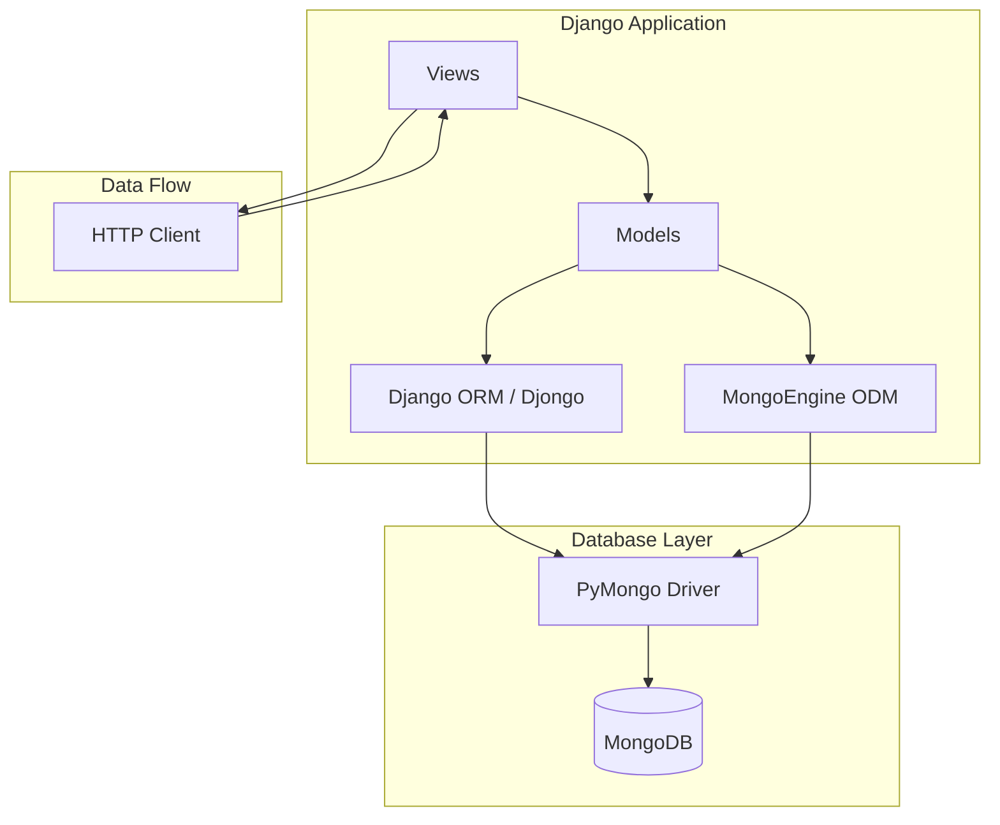
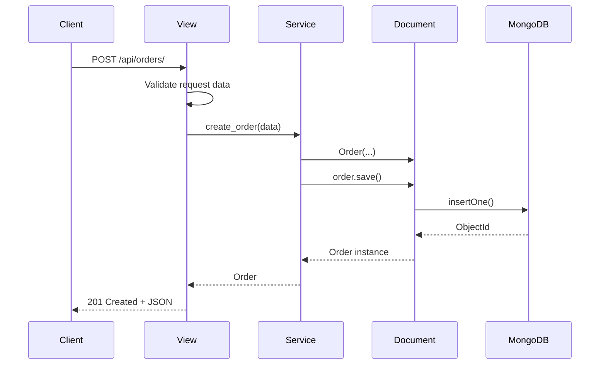
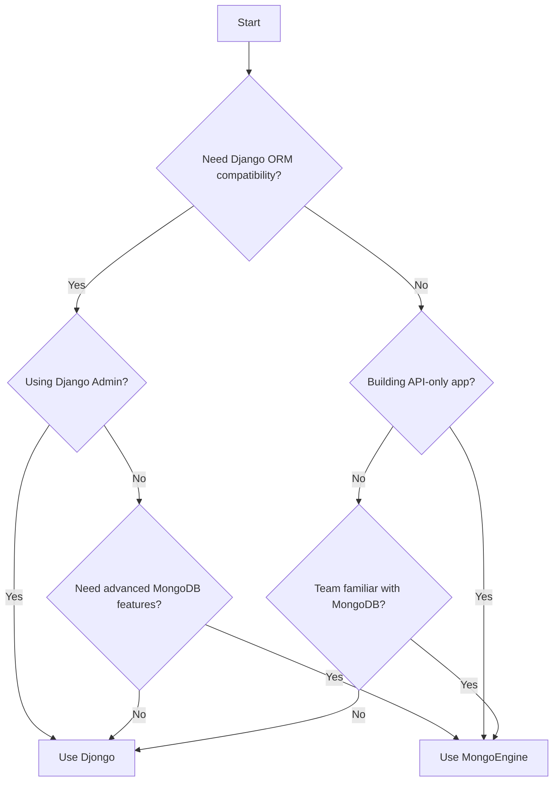

# How to Use MongoDB with Django

Author: [nawazdhandala](https://github.com/nawazdhandala)

Tags: Django, MongoDB, Python, Database, Djongo, MongoEngine

Description: A comprehensive guide to integrating MongoDB with Django applications. Learn how to connect Django to MongoDB using Djongo and MongoEngine, define models, perform CRUD operations, and implement best practices for production deployments.

---

Django is built with relational databases in mind, but many projects benefit from MongoDB's flexible document model. Whether you need schema flexibility, horizontal scaling, or native JSON storage, MongoDB can be a powerful choice for Django applications. This guide covers two popular approaches: Djongo (which lets you use Django's ORM) and MongoEngine (a dedicated MongoDB ODM).

## Why Use MongoDB with Django?

Before diving into implementation, here are common reasons to pair MongoDB with Django:

- **Schema flexibility**: Documents can evolve without complex migrations
- **Nested data structures**: Store complex, hierarchical data naturally
- **Horizontal scaling**: MongoDB handles sharding for large datasets
- **JSON-native storage**: Perfect for APIs that work with JSON data
- **Rapid prototyping**: Change your data model without migration headaches

## Architecture Overview

Here is how Django connects to MongoDB with different libraries:



## Option 1: Using Djongo

Djongo acts as a database connector that translates Django ORM queries to MongoDB queries. This approach lets you keep using Django's familiar ORM while storing data in MongoDB.

### Installation

Install Djongo and PyMongo. Djongo requires specific versions for compatibility.

```bash
pip install djongo pymongo==3.12.3
```

### Database Configuration

Configure your Django settings to use Djongo as the database engine. Replace the default SQLite or PostgreSQL settings with MongoDB connection details.

```python
# settings.py
DATABASES = {
    'default': {
        'ENGINE': 'djongo',
        'NAME': 'mydatabase',
        'ENFORCE_SCHEMA': False,
        'CLIENT': {
            'host': 'mongodb://localhost:27017',
            'username': 'your_username',
            'password': 'your_password',
            'authSource': 'admin',
            'authMechanism': 'SCRAM-SHA-1',
        }
    }
}
```

### Production Configuration

For production environments, use environment variables and connection pooling options.

```python
# settings.py
import os

DATABASES = {
    'default': {
        'ENGINE': 'djongo',
        'NAME': os.environ.get('MONGODB_NAME', 'mydatabase'),
        'ENFORCE_SCHEMA': True,
        'CLIENT': {
            'host': os.environ.get('MONGODB_URI', 'mongodb://localhost:27017'),
            'username': os.environ.get('MONGODB_USER'),
            'password': os.environ.get('MONGODB_PASSWORD'),
            'authSource': os.environ.get('MONGODB_AUTH_SOURCE', 'admin'),
            'authMechanism': 'SCRAM-SHA-256',
            # Connection pool settings
            'maxPoolSize': 50,
            'minPoolSize': 10,
            'maxIdleTimeMS': 30000,
            # Timeouts
            'connectTimeoutMS': 5000,
            'socketTimeoutMS': 30000,
            'serverSelectionTimeoutMS': 5000,
            # Write concern for durability
            'w': 'majority',
            'j': True,
            # Read preference for replica sets
            'readPreference': 'primaryPreferred',
            # Retry configuration
            'retryWrites': True,
            'retryReads': True,
        }
    }
}
```

### Defining Models with Djongo

Djongo supports standard Django model fields plus special fields for embedded documents and arrays.

```python
# models.py
from django.db import models
from djongo import models as djongo_models

# Standard Django model works with Djongo
class Author(models.Model):
    """
    Basic model using standard Django fields.
    Djongo translates these to MongoDB documents automatically.
    """
    name = models.CharField(max_length=100)
    email = models.EmailField(unique=True)
    bio = models.TextField(blank=True)
    created_at = models.DateTimeField(auto_now_add=True)
    updated_at = models.DateTimeField(auto_now=True)
    is_active = models.BooleanField(default=True)

    class Meta:
        # Specify collection name (optional)
        db_table = 'authors'

    def __str__(self):
        return self.name
```

### Embedded Documents

MongoDB excels at storing nested data. Djongo provides EmbeddedField for this purpose.

```python
# models.py
from django.db import models
from djongo import models as djongo_models

# Define the embedded document structure as an abstract model
class Address(models.Model):
    """
    Embedded document for address information.
    This will be stored inside the parent document, not as a separate collection.
    """
    street = models.CharField(max_length=200)
    city = models.CharField(max_length=100)
    state = models.CharField(max_length=100)
    zip_code = models.CharField(max_length=20)
    country = models.CharField(max_length=100)

    class Meta:
        # Mark as abstract so Django does not create a separate table
        abstract = True


class Customer(models.Model):
    """
    Customer model with an embedded address document.
    The address is stored within the customer document itself.
    """
    name = models.CharField(max_length=100)
    email = models.EmailField(unique=True)
    phone = models.CharField(max_length=20, blank=True)

    # Embedded document field - stores address inside the customer document
    shipping_address = djongo_models.EmbeddedField(
        model_container=Address
    )
    billing_address = djongo_models.EmbeddedField(
        model_container=Address
    )

    created_at = models.DateTimeField(auto_now_add=True)
    is_active = models.BooleanField(default=True)

    class Meta:
        db_table = 'customers'

    def __str__(self):
        return self.name
```

### Array Fields

Store lists of values or embedded documents using ArrayField.

```python
# models.py
from django.db import models
from djongo import models as djongo_models

# Embedded document for order items
class OrderItem(models.Model):
    """
    Represents a single item in an order.
    Stored as part of an array within the Order document.
    """
    product_id = models.CharField(max_length=50)
    product_name = models.CharField(max_length=200)
    quantity = models.IntegerField(default=1)
    unit_price = models.DecimalField(max_digits=10, decimal_places=2)

    class Meta:
        abstract = True


class Order(models.Model):
    """
    Order model demonstrating array fields for embedded documents.
    Items are stored as an array within the order document.
    """
    order_number = models.CharField(max_length=50, unique=True)
    customer = models.ForeignKey(
        Customer,
        on_delete=models.CASCADE,
        related_name='orders'
    )

    # Array of embedded documents
    items = djongo_models.ArrayField(
        model_container=OrderItem
    )

    # Simple array of strings
    tags = djongo_models.ArrayField(
        model_container=models.CharField(max_length=50)
    )

    status = models.CharField(
        max_length=20,
        choices=[
            ('pending', 'Pending'),
            ('processing', 'Processing'),
            ('shipped', 'Shipped'),
            ('delivered', 'Delivered'),
            ('cancelled', 'Cancelled'),
        ],
        default='pending'
    )
    total_amount = models.DecimalField(max_digits=10, decimal_places=2)
    created_at = models.DateTimeField(auto_now_add=True)
    updated_at = models.DateTimeField(auto_now=True)

    class Meta:
        db_table = 'orders'
        ordering = ['-created_at']

    def __str__(self):
        return f"Order {self.order_number}"
```

### CRUD Operations with Djongo

Djongo uses the standard Django ORM syntax for database operations.

```python
# views.py or services.py
from django.shortcuts import get_object_or_404
from .models import Author, Customer, Order, Address, OrderItem

# Create operations
def create_author(name, email, bio=''):
    """
    Create a new author using standard Django ORM syntax.
    Djongo translates this to a MongoDB insertOne operation.
    """
    author = Author.objects.create(
        name=name,
        email=email,
        bio=bio
    )
    return author


def create_customer_with_address(name, email, street, city, state, zip_code, country):
    """
    Create a customer with an embedded address document.
    The address is stored within the customer document.
    """
    customer = Customer.objects.create(
        name=name,
        email=email,
        shipping_address=Address(
            street=street,
            city=city,
            state=state,
            zip_code=zip_code,
            country=country
        ),
        billing_address=Address(
            street=street,
            city=city,
            state=state,
            zip_code=zip_code,
            country=country
        )
    )
    return customer


def create_order(customer_id, order_number, items_data):
    """
    Create an order with an array of embedded item documents.
    Each item in items_data should be a dict with product details.
    """
    customer = get_object_or_404(Customer, pk=customer_id)

    # Convert item dictionaries to OrderItem instances
    items = [
        OrderItem(
            product_id=item['product_id'],
            product_name=item['product_name'],
            quantity=item['quantity'],
            unit_price=item['unit_price']
        )
        for item in items_data
    ]

    # Calculate total
    total = sum(
        item['quantity'] * item['unit_price']
        for item in items_data
    )

    order = Order.objects.create(
        order_number=order_number,
        customer=customer,
        items=items,
        tags=['new'],
        total_amount=total
    )
    return order


# Read operations
def get_active_authors():
    """
    Query authors with filtering and ordering.
    Standard Django QuerySet methods work with Djongo.
    """
    return Author.objects.filter(
        is_active=True
    ).order_by('-created_at')


def get_customer_orders(customer_id):
    """
    Get all orders for a specific customer.
    Uses Django's related_name for reverse lookup.
    """
    customer = get_object_or_404(Customer, pk=customer_id)
    return customer.orders.filter(
        status__in=['pending', 'processing', 'shipped']
    ).order_by('-created_at')


def search_orders(status=None, min_amount=None, max_amount=None):
    """
    Search orders with multiple filter conditions.
    Build querysets dynamically based on provided parameters.
    """
    queryset = Order.objects.all()

    if status:
        queryset = queryset.filter(status=status)

    if min_amount is not None:
        queryset = queryset.filter(total_amount__gte=min_amount)

    if max_amount is not None:
        queryset = queryset.filter(total_amount__lte=max_amount)

    return queryset.order_by('-created_at')


# Update operations
def update_order_status(order_id, new_status):
    """
    Update a single field on a document.
    Uses update() for efficient partial updates.
    """
    updated_count = Order.objects.filter(pk=order_id).update(
        status=new_status
    )
    if updated_count == 0:
        raise ValueError(f"Order {order_id} not found")
    return Order.objects.get(pk=order_id)


def add_order_tag(order_id, tag):
    """
    Add a tag to an order's tags array.
    Note: Array operations may require direct MongoDB access for complex cases.
    """
    order = get_object_or_404(Order, pk=order_id)
    if tag not in order.tags:
        order.tags.append(tag)
        order.save()
    return order


# Delete operations
def soft_delete_author(author_id):
    """
    Soft delete by setting is_active to False.
    Preserves data for audit purposes.
    """
    Author.objects.filter(pk=author_id).update(is_active=False)


def hard_delete_order(order_id):
    """
    Permanently delete an order document.
    Use with caution in production.
    """
    order = get_object_or_404(Order, pk=order_id)
    order.delete()
```

## Option 2: Using MongoEngine

MongoEngine is a dedicated MongoDB ODM (Object-Document Mapper) that provides more MongoDB-native features than Djongo.

### Installation

Install MongoEngine and its Django integration package.

```bash
pip install mongoengine django-mongoengine
```

### Database Configuration

MongoEngine uses its own connection management separate from Django's database settings.

```python
# settings.py
import mongoengine

# MongoDB connection settings
MONGODB_SETTINGS = {
    'db': 'mydatabase',
    'host': 'localhost',
    'port': 27017,
    'username': 'your_username',
    'password': 'your_password',
    'authentication_source': 'admin',
}

# Connect to MongoDB when Django starts
mongoengine.connect(**MONGODB_SETTINGS)
```

### Production Configuration with MongoEngine

For production, use connection pooling and replica set configuration.

```python
# settings.py
import os
import mongoengine

MONGODB_SETTINGS = {
    'db': os.environ.get('MONGODB_NAME', 'mydatabase'),
    'host': os.environ.get('MONGODB_HOST', 'localhost'),
    'port': int(os.environ.get('MONGODB_PORT', 27017)),
    'username': os.environ.get('MONGODB_USER'),
    'password': os.environ.get('MONGODB_PASSWORD'),
    'authentication_source': os.environ.get('MONGODB_AUTH_SOURCE', 'admin'),
    # Connection pool settings
    'maxPoolSize': 50,
    'minPoolSize': 10,
    # Timeouts
    'connectTimeoutMS': 5000,
    'socketTimeoutMS': 30000,
    'serverSelectionTimeoutMS': 5000,
    # Write concern
    'w': 'majority',
    'j': True,
    # Read preference
    'read_preference': 'primaryPreferred',
    # Replica set (if applicable)
    # 'replicaSet': 'myReplicaSet',
}

# For replica set connection string
MONGODB_URI = os.environ.get('MONGODB_URI')
if MONGODB_URI:
    mongoengine.connect(host=MONGODB_URI)
else:
    mongoengine.connect(**MONGODB_SETTINGS)
```

### Defining Documents with MongoEngine

MongoEngine uses Document classes instead of Django Models.

```python
# documents.py
from mongoengine import (
    Document, EmbeddedDocument,
    StringField, EmailField, IntField, DecimalField,
    DateTimeField, BooleanField, ListField,
    EmbeddedDocumentField, ReferenceField, ObjectIdField,
    CASCADE, PULL
)
from datetime import datetime

class Author(Document):
    """
    MongoEngine Document representing an author.
    Fields are explicitly typed with validation options.
    """
    name = StringField(required=True, max_length=100)
    email = EmailField(required=True, unique=True)
    bio = StringField(default='')
    created_at = DateTimeField(default=datetime.utcnow)
    updated_at = DateTimeField(default=datetime.utcnow)
    is_active = BooleanField(default=True)

    # Specify collection name
    meta = {
        'collection': 'authors',
        'indexes': [
            'email',
            '-created_at',
            {'fields': ['$name', '$bio'], 'default_language': 'english'}
        ],
        'ordering': ['-created_at']
    }

    def save(self, *args, **kwargs):
        """Update the updated_at timestamp on every save."""
        self.updated_at = datetime.utcnow()
        return super().save(*args, **kwargs)

    def __str__(self):
        return self.name
```

### Embedded Documents with MongoEngine

MongoEngine provides native support for embedded documents.

```python
# documents.py
from mongoengine import (
    Document, EmbeddedDocument,
    StringField, EmailField, IntField, DecimalField,
    DateTimeField, BooleanField, ListField,
    EmbeddedDocumentField, EmbeddedDocumentListField,
    ReferenceField
)
from datetime import datetime

class Address(EmbeddedDocument):
    """
    Embedded document for address information.
    Will be stored inside the parent document.
    """
    street = StringField(required=True, max_length=200)
    city = StringField(required=True, max_length=100)
    state = StringField(required=True, max_length=100)
    zip_code = StringField(required=True, max_length=20)
    country = StringField(required=True, max_length=100)

    def __str__(self):
        return f"{self.street}, {self.city}, {self.state} {self.zip_code}"


class Customer(Document):
    """
    Customer document with embedded addresses.
    Addresses are stored within the customer document.
    """
    name = StringField(required=True, max_length=100)
    email = EmailField(required=True, unique=True)
    phone = StringField(max_length=20)

    # Embedded documents
    shipping_address = EmbeddedDocumentField(Address)
    billing_address = EmbeddedDocumentField(Address)

    # List of additional addresses
    saved_addresses = EmbeddedDocumentListField(Address)

    created_at = DateTimeField(default=datetime.utcnow)
    is_active = BooleanField(default=True)

    meta = {
        'collection': 'customers',
        'indexes': [
            'email',
            'shipping_address.city',
            '-created_at'
        ]
    }

    def __str__(self):
        return self.name


class OrderItem(EmbeddedDocument):
    """
    Embedded document representing an item in an order.
    """
    product_id = StringField(required=True)
    product_name = StringField(required=True, max_length=200)
    quantity = IntField(required=True, min_value=1)
    unit_price = DecimalField(required=True, min_value=0, precision=2)

    @property
    def subtotal(self):
        """Calculate subtotal for this item."""
        return self.quantity * self.unit_price


class Order(Document):
    """
    Order document with embedded items and customer reference.
    Demonstrates various MongoEngine field types.
    """
    order_number = StringField(required=True, unique=True, max_length=50)

    # Reference to another document
    customer = ReferenceField(Customer, required=True)

    # List of embedded documents
    items = EmbeddedDocumentListField(OrderItem, required=True)

    # Simple list field
    tags = ListField(StringField(max_length=50))

    status = StringField(
        required=True,
        choices=['pending', 'processing', 'shipped', 'delivered', 'cancelled'],
        default='pending'
    )
    total_amount = DecimalField(required=True, min_value=0, precision=2)
    notes = StringField()

    created_at = DateTimeField(default=datetime.utcnow)
    updated_at = DateTimeField(default=datetime.utcnow)

    meta = {
        'collection': 'orders',
        'indexes': [
            'order_number',
            'customer',
            'status',
            '-created_at',
            ('customer', 'status'),
            ('status', '-created_at')
        ],
        'ordering': ['-created_at']
    }

    def save(self, *args, **kwargs):
        """Update timestamp and recalculate total on save."""
        self.updated_at = datetime.utcnow()
        self.total_amount = sum(item.subtotal for item in self.items)
        return super().save(*args, **kwargs)

    def __str__(self):
        return f"Order {self.order_number}"
```

### CRUD Operations with MongoEngine

MongoEngine provides a rich query API with MongoDB-native operations.

```python
# services.py
from datetime import datetime, timedelta
from .documents import Author, Customer, Order, Address, OrderItem
from mongoengine.errors import NotUniqueError, DoesNotExist

# Create operations
def create_author(name, email, bio=''):
    """
    Create a new author document.
    MongoEngine validates fields before saving.
    """
    try:
        author = Author(
            name=name,
            email=email,
            bio=bio
        )
        author.save()
        return author
    except NotUniqueError:
        raise ValueError(f"Author with email {email} already exists")


def create_customer_with_address(name, email, address_data):
    """
    Create a customer with embedded address documents.
    Address data should be a dict with address fields.
    """
    address = Address(**address_data)

    customer = Customer(
        name=name,
        email=email,
        shipping_address=address,
        billing_address=address
    )
    customer.save()
    return customer


def create_order(customer_id, order_number, items_data):
    """
    Create an order with embedded item documents.
    Automatically calculates total from items.
    """
    try:
        customer = Customer.objects.get(id=customer_id)
    except DoesNotExist:
        raise ValueError(f"Customer {customer_id} not found")

    items = [OrderItem(**item) for item in items_data]

    order = Order(
        order_number=order_number,
        customer=customer,
        items=items,
        tags=['new'],
        total_amount=0  # Will be calculated in save()
    )
    order.save()
    return order


# Read operations with MongoEngine query syntax
def get_active_authors():
    """
    Query authors with MongoEngine's QuerySet API.
    Returns a lazy QuerySet that can be further filtered.
    """
    return Author.objects(is_active=True).order_by('-created_at')


def get_author_by_email(email):
    """
    Get a single document by field value.
    Raises DoesNotExist if not found.
    """
    try:
        return Author.objects.get(email=email)
    except DoesNotExist:
        return None


def search_customers(city=None, is_active=True):
    """
    Search customers with embedded document field queries.
    Use double underscore notation for embedded fields.
    """
    queryset = Customer.objects(is_active=is_active)

    if city:
        # Query on embedded document field
        queryset = queryset.filter(shipping_address__city=city)

    return queryset.order_by('-created_at')


def get_orders_by_status(status, page=1, per_page=20):
    """
    Paginated query with MongoEngine.
    Uses skip and limit for pagination.
    """
    offset = (page - 1) * per_page

    return Order.objects(
        status=status
    ).skip(offset).limit(per_page).order_by('-created_at')


def get_customer_orders(customer_id, include_cancelled=False):
    """
    Get orders for a customer with optional status filtering.
    Uses the ne (not equal) operator to exclude cancelled orders.
    """
    try:
        customer = Customer.objects.get(id=customer_id)
    except DoesNotExist:
        raise ValueError(f"Customer {customer_id} not found")

    queryset = Order.objects(customer=customer)

    if not include_cancelled:
        queryset = queryset.filter(status__ne='cancelled')

    return queryset.order_by('-created_at')


def search_orders_advanced(
    status=None,
    min_amount=None,
    max_amount=None,
    start_date=None,
    end_date=None,
    tags=None
):
    """
    Advanced search with multiple filter conditions.
    Demonstrates various MongoEngine query operators.
    """
    queryset = Order.objects()

    if status:
        if isinstance(status, list):
            # Match any of the provided statuses
            queryset = queryset.filter(status__in=status)
        else:
            queryset = queryset.filter(status=status)

    if min_amount is not None:
        queryset = queryset.filter(total_amount__gte=min_amount)

    if max_amount is not None:
        queryset = queryset.filter(total_amount__lte=max_amount)

    if start_date:
        queryset = queryset.filter(created_at__gte=start_date)

    if end_date:
        queryset = queryset.filter(created_at__lte=end_date)

    if tags:
        # Match orders containing any of the specified tags
        queryset = queryset.filter(tags__in=tags)

    return queryset.order_by('-created_at')


# Update operations
def update_order_status(order_id, new_status):
    """
    Update a single field using atomic update.
    More efficient than fetching, modifying, and saving.
    """
    result = Order.objects(id=order_id).update_one(
        set__status=new_status,
        set__updated_at=datetime.utcnow()
    )
    if result == 0:
        raise ValueError(f"Order {order_id} not found")
    return Order.objects.get(id=order_id)


def add_order_tag(order_id, tag):
    """
    Add a tag to the tags array using atomic push.
    add_to_set prevents duplicates.
    """
    result = Order.objects(id=order_id).update_one(
        add_to_set__tags=tag,
        set__updated_at=datetime.utcnow()
    )
    if result == 0:
        raise ValueError(f"Order {order_id} not found")
    return Order.objects.get(id=order_id)


def remove_order_tag(order_id, tag):
    """
    Remove a tag from the tags array using atomic pull.
    """
    result = Order.objects(id=order_id).update_one(
        pull__tags=tag,
        set__updated_at=datetime.utcnow()
    )
    if result == 0:
        raise ValueError(f"Order {order_id} not found")
    return Order.objects.get(id=order_id)


def add_item_to_order(order_id, item_data):
    """
    Add an item to the order's items array.
    Uses push for atomic array append.
    """
    item = OrderItem(**item_data)

    result = Order.objects(id=order_id).update_one(
        push__items=item,
        set__updated_at=datetime.utcnow()
    )
    if result == 0:
        raise ValueError(f"Order {order_id} not found")

    # Recalculate total
    order = Order.objects.get(id=order_id)
    order.save()  # This triggers total recalculation
    return order


def add_customer_address(customer_id, address_data, set_as_shipping=False):
    """
    Add an address to customer's saved_addresses array.
    Optionally set as the new shipping address.
    """
    address = Address(**address_data)

    update_ops = {
        'push__saved_addresses': address
    }

    if set_as_shipping:
        update_ops['set__shipping_address'] = address

    result = Customer.objects(id=customer_id).update_one(**update_ops)
    if result == 0:
        raise ValueError(f"Customer {customer_id} not found")

    return Customer.objects.get(id=customer_id)


# Delete operations
def soft_delete_author(author_id):
    """
    Soft delete by updating is_active flag.
    """
    result = Author.objects(id=author_id).update_one(
        set__is_active=False,
        set__updated_at=datetime.utcnow()
    )
    if result == 0:
        raise ValueError(f"Author {author_id} not found")


def hard_delete_order(order_id):
    """
    Permanently delete an order document.
    """
    try:
        order = Order.objects.get(id=order_id)
        order.delete()
    except DoesNotExist:
        raise ValueError(f"Order {order_id} not found")


def delete_cancelled_orders_older_than(days):
    """
    Bulk delete old cancelled orders.
    Returns the number of deleted documents.
    """
    cutoff_date = datetime.utcnow() - timedelta(days=days)

    result = Order.objects(
        status='cancelled',
        created_at__lt=cutoff_date
    ).delete()

    return result
```

## Aggregation Pipelines

MongoDB's aggregation framework enables complex data analysis. Both Djongo and MongoEngine support aggregations.

### Aggregations with MongoEngine

```python
# analytics.py
from datetime import datetime, timedelta
from .documents import Order, Customer

def get_revenue_by_status():
    """
    Aggregate orders by status with revenue totals.
    Uses MongoEngine's aggregation pipeline.
    """
    pipeline = [
        {
            '$group': {
                '_id': '$status',
                'total_orders': {'$sum': 1},
                'total_revenue': {'$sum': {'$toDouble': '$total_amount'}},
                'avg_order_value': {'$avg': {'$toDouble': '$total_amount'}}
            }
        },
        {
            '$project': {
                '_id': 0,
                'status': '$_id',
                'total_orders': 1,
                'total_revenue': {'$round': ['$total_revenue', 2]},
                'avg_order_value': {'$round': ['$avg_order_value', 2]}
            }
        },
        {'$sort': {'total_revenue': -1}}
    ]

    return list(Order.objects.aggregate(pipeline))


def get_monthly_revenue(year):
    """
    Calculate monthly revenue for a given year.
    Groups orders by month with revenue statistics.
    """
    start_date = datetime(year, 1, 1)
    end_date = datetime(year + 1, 1, 1)

    pipeline = [
        {
            '$match': {
                'created_at': {'$gte': start_date, '$lt': end_date},
                'status': {'$ne': 'cancelled'}
            }
        },
        {
            '$group': {
                '_id': {'$month': '$created_at'},
                'total_orders': {'$sum': 1},
                'total_revenue': {'$sum': {'$toDouble': '$total_amount'}},
                'items_sold': {'$sum': {'$size': '$items'}}
            }
        },
        {
            '$addFields': {
                'month_name': {
                    '$arrayElemAt': [
                        ['', 'January', 'February', 'March', 'April',
                         'May', 'June', 'July', 'August', 'September',
                         'October', 'November', 'December'],
                        '$_id'
                    ]
                }
            }
        },
        {
            '$project': {
                '_id': 0,
                'month_number': '$_id',
                'month_name': 1,
                'total_orders': 1,
                'total_revenue': {'$round': ['$total_revenue', 2]},
                'items_sold': 1
            }
        },
        {'$sort': {'month_number': 1}}
    ]

    return list(Order.objects.aggregate(pipeline))


def get_top_customers(limit=10):
    """
    Find top customers by total order value.
    Uses lookup to join customer details.
    """
    pipeline = [
        {'$match': {'status': {'$ne': 'cancelled'}}},
        {
            '$group': {
                '_id': '$customer',
                'total_orders': {'$sum': 1},
                'total_spent': {'$sum': {'$toDouble': '$total_amount'}},
                'avg_order_value': {'$avg': {'$toDouble': '$total_amount'}}
            }
        },
        {'$sort': {'total_spent': -1}},
        {'$limit': limit},
        {
            '$lookup': {
                'from': 'customers',
                'localField': '_id',
                'foreignField': '_id',
                'as': 'customer_info'
            }
        },
        {'$unwind': '$customer_info'},
        {
            '$project': {
                '_id': 0,
                'customer_id': '$_id',
                'customer_name': '$customer_info.name',
                'customer_email': '$customer_info.email',
                'total_orders': 1,
                'total_spent': {'$round': ['$total_spent', 2]},
                'avg_order_value': {'$round': ['$avg_order_value', 2]}
            }
        }
    ]

    return list(Order.objects.aggregate(pipeline))


def get_popular_products(limit=10):
    """
    Find most frequently ordered products.
    Unwinds the items array to count product occurrences.
    """
    pipeline = [
        {'$match': {'status': {'$in': ['processing', 'shipped', 'delivered']}}},
        {'$unwind': '$items'},
        {
            '$group': {
                '_id': '$items.product_id',
                'product_name': {'$first': '$items.product_name'},
                'times_ordered': {'$sum': 1},
                'total_quantity': {'$sum': '$items.quantity'},
                'total_revenue': {
                    '$sum': {
                        '$multiply': [
                            '$items.quantity',
                            {'$toDouble': '$items.unit_price'}
                        ]
                    }
                }
            }
        },
        {'$sort': {'total_quantity': -1}},
        {'$limit': limit},
        {
            '$project': {
                '_id': 0,
                'product_id': '$_id',
                'product_name': 1,
                'times_ordered': 1,
                'total_quantity': 1,
                'total_revenue': {'$round': ['$total_revenue', 2]}
            }
        }
    ]

    return list(Order.objects.aggregate(pipeline))


def get_orders_by_city():
    """
    Aggregate orders by customer's shipping city.
    Demonstrates querying through referenced documents.
    """
    pipeline = [
        {
            '$lookup': {
                'from': 'customers',
                'localField': 'customer',
                'foreignField': '_id',
                'as': 'customer_info'
            }
        },
        {'$unwind': '$customer_info'},
        {
            '$group': {
                '_id': '$customer_info.shipping_address.city',
                'total_orders': {'$sum': 1},
                'total_revenue': {'$sum': {'$toDouble': '$total_amount'}}
            }
        },
        {'$sort': {'total_orders': -1}},
        {
            '$project': {
                '_id': 0,
                'city': '$_id',
                'total_orders': 1,
                'total_revenue': {'$round': ['$total_revenue', 2]}
            }
        }
    ]

    return list(Order.objects.aggregate(pipeline))
```

## Data Flow Visualization

Here is how a typical request flows through a Django-MongoDB application:



## Using Django REST Framework with MongoDB

Integrate MongoEngine with Django REST Framework for API development.

```python
# serializers.py
from rest_framework import serializers
from rest_framework_mongoengine import serializers as mongo_serializers
from .documents import Author, Customer, Order, Address, OrderItem

class AuthorSerializer(mongo_serializers.DocumentSerializer):
    """
    Serializer for Author documents.
    Uses rest_framework_mongoengine for automatic field mapping.
    """
    class Meta:
        model = Author
        fields = ['id', 'name', 'email', 'bio', 'is_active', 'created_at']
        read_only_fields = ['id', 'created_at']


class AddressSerializer(mongo_serializers.EmbeddedDocumentSerializer):
    """
    Serializer for embedded Address documents.
    """
    class Meta:
        model = Address
        fields = ['street', 'city', 'state', 'zip_code', 'country']


class CustomerSerializer(mongo_serializers.DocumentSerializer):
    """
    Serializer for Customer documents with embedded addresses.
    """
    shipping_address = AddressSerializer()
    billing_address = AddressSerializer(required=False)
    saved_addresses = AddressSerializer(many=True, required=False)

    class Meta:
        model = Customer
        fields = [
            'id', 'name', 'email', 'phone',
            'shipping_address', 'billing_address', 'saved_addresses',
            'is_active', 'created_at'
        ]
        read_only_fields = ['id', 'created_at']

    def create(self, validated_data):
        """
        Handle nested embedded document creation.
        """
        shipping_data = validated_data.pop('shipping_address', None)
        billing_data = validated_data.pop('billing_address', None)
        saved_data = validated_data.pop('saved_addresses', [])

        if shipping_data:
            validated_data['shipping_address'] = Address(**shipping_data)
        if billing_data:
            validated_data['billing_address'] = Address(**billing_data)
        if saved_data:
            validated_data['saved_addresses'] = [
                Address(**addr) for addr in saved_data
            ]

        return Customer.objects.create(**validated_data)


class OrderItemSerializer(mongo_serializers.EmbeddedDocumentSerializer):
    """
    Serializer for embedded OrderItem documents.
    """
    subtotal = serializers.DecimalField(
        max_digits=10, decimal_places=2, read_only=True
    )

    class Meta:
        model = OrderItem
        fields = ['product_id', 'product_name', 'quantity', 'unit_price', 'subtotal']


class OrderSerializer(mongo_serializers.DocumentSerializer):
    """
    Serializer for Order documents with nested items.
    """
    items = OrderItemSerializer(many=True)
    customer_name = serializers.CharField(
        source='customer.name', read_only=True
    )
    customer_email = serializers.CharField(
        source='customer.email', read_only=True
    )

    class Meta:
        model = Order
        fields = [
            'id', 'order_number', 'customer', 'customer_name', 'customer_email',
            'items', 'tags', 'status', 'total_amount', 'notes',
            'created_at', 'updated_at'
        ]
        read_only_fields = ['id', 'total_amount', 'created_at', 'updated_at']

    def create(self, validated_data):
        """
        Handle nested embedded document creation for order items.
        """
        items_data = validated_data.pop('items', [])
        validated_data['items'] = [
            OrderItem(**item) for item in items_data
        ]
        validated_data['total_amount'] = 0  # Will be calculated in save()

        order = Order.objects.create(**validated_data)
        order.save()  # Trigger total calculation
        return order
```

```python
# views.py
from rest_framework import viewsets, status
from rest_framework.decorators import action
from rest_framework.response import Response
from rest_framework_mongoengine import viewsets as mongo_viewsets
from .documents import Author, Customer, Order
from .serializers import AuthorSerializer, CustomerSerializer, OrderSerializer

class AuthorViewSet(mongo_viewsets.ModelViewSet):
    """
    ViewSet for Author CRUD operations.
    Uses MongoEngine-compatible viewset from rest_framework_mongoengine.
    """
    lookup_field = 'id'
    serializer_class = AuthorSerializer

    def get_queryset(self):
        """
        Return active authors by default.
        """
        return Author.objects(is_active=True).order_by('-created_at')


class CustomerViewSet(mongo_viewsets.ModelViewSet):
    """
    ViewSet for Customer CRUD operations.
    """
    lookup_field = 'id'
    serializer_class = CustomerSerializer

    def get_queryset(self):
        """
        Filter customers based on query parameters.
        """
        queryset = Customer.objects(is_active=True)

        city = self.request.query_params.get('city')
        if city:
            queryset = queryset.filter(shipping_address__city__icontains=city)

        return queryset.order_by('-created_at')


class OrderViewSet(mongo_viewsets.ModelViewSet):
    """
    ViewSet for Order CRUD operations with custom actions.
    """
    lookup_field = 'id'
    serializer_class = OrderSerializer

    def get_queryset(self):
        """
        Filter orders based on query parameters.
        """
        queryset = Order.objects()

        status_filter = self.request.query_params.get('status')
        if status_filter:
            queryset = queryset.filter(status=status_filter)

        customer_id = self.request.query_params.get('customer')
        if customer_id:
            queryset = queryset.filter(customer=customer_id)

        return queryset.order_by('-created_at')

    @action(detail=True, methods=['post'])
    def update_status(self, request, id=None):
        """
        Custom action to update order status.
        POST /api/orders/{id}/update_status/
        """
        order = self.get_object()
        new_status = request.data.get('status')

        if not new_status:
            return Response(
                {'error': 'Status is required'},
                status=status.HTTP_400_BAD_REQUEST
            )

        valid_statuses = ['pending', 'processing', 'shipped', 'delivered', 'cancelled']
        if new_status not in valid_statuses:
            return Response(
                {'error': f'Invalid status. Must be one of: {valid_statuses}'},
                status=status.HTTP_400_BAD_REQUEST
            )

        order.status = new_status
        order.save()

        serializer = self.get_serializer(order)
        return Response(serializer.data)

    @action(detail=True, methods=['post'])
    def add_tag(self, request, id=None):
        """
        Add a tag to the order.
        POST /api/orders/{id}/add_tag/
        """
        order = self.get_object()
        tag = request.data.get('tag')

        if not tag:
            return Response(
                {'error': 'Tag is required'},
                status=status.HTTP_400_BAD_REQUEST
            )

        if tag not in order.tags:
            order.tags.append(tag)
            order.save()

        serializer = self.get_serializer(order)
        return Response(serializer.data)
```

## Indexing Strategies

Proper indexing is crucial for MongoDB performance. Define indexes in your document meta.

```python
# documents.py - Index examples
from mongoengine import Document, StringField, DateTimeField, IntField

class Product(Document):
    """
    Product document with comprehensive indexing strategy.
    """
    sku = StringField(required=True, unique=True)
    name = StringField(required=True, max_length=200)
    description = StringField()
    category = StringField(required=True)
    subcategory = StringField()
    price = IntField(required=True, min_value=0)
    stock = IntField(default=0, min_value=0)
    is_active = BooleanField(default=True)
    created_at = DateTimeField(default=datetime.utcnow)

    meta = {
        'collection': 'products',
        'indexes': [
            # Single field indexes for common queries
            'sku',
            'category',
            '-created_at',

            # Compound index for category + subcategory queries
            ('category', 'subcategory'),

            # Compound index for filtered, sorted queries
            ('is_active', '-created_at'),

            # Compound index for price range queries within category
            ('category', 'price'),

            # Text index for search functionality
            {
                'fields': ['$name', '$description'],
                'default_language': 'english',
                'weights': {'name': 10, 'description': 5}
            },

            # Partial index for active products only
            {
                'fields': ['stock'],
                'partialFilterExpression': {'is_active': True}
            },

            # TTL index example (for session-like documents)
            # {'fields': ['expires_at'], 'expireAfterSeconds': 0}
        ]
    }
```

## Connection Health Monitoring

Monitor your MongoDB connection health for production reliability.

```python
# health.py
from mongoengine import get_connection
from django.http import JsonResponse
import time

def mongodb_health_check(request):
    """
    Health check endpoint to verify MongoDB connectivity.
    Returns connection status and latency.
    """
    try:
        connection = get_connection()

        # Measure ping latency
        start_time = time.time()
        connection.admin.command('ping')
        latency_ms = (time.time() - start_time) * 1000

        # Get server info
        server_info = connection.server_info()

        return JsonResponse({
            'status': 'healthy',
            'database': 'mongodb',
            'latency_ms': round(latency_ms, 2),
            'version': server_info.get('version'),
            'ok': True
        })
    except Exception as e:
        return JsonResponse({
            'status': 'unhealthy',
            'database': 'mongodb',
            'error': str(e),
            'ok': False
        }, status=503)


def detailed_health_check(request):
    """
    Detailed health check with collection statistics.
    Use for monitoring dashboards.
    """
    try:
        connection = get_connection()
        db = connection.get_database()

        # Get database statistics
        db_stats = db.command('dbStats')

        # Get collection counts
        collections = {}
        for name in db.list_collection_names():
            collections[name] = db[name].count_documents({})

        return JsonResponse({
            'status': 'healthy',
            'database': db.name,
            'storage_size_mb': round(db_stats.get('storageSize', 0) / 1024 / 1024, 2),
            'data_size_mb': round(db_stats.get('dataSize', 0) / 1024 / 1024, 2),
            'collections': collections,
            'ok': True
        })
    except Exception as e:
        return JsonResponse({
            'status': 'unhealthy',
            'error': str(e),
            'ok': False
        }, status=503)
```

## Best Practices Summary

| Area | Recommendation |
|------|----------------|
| **Library Choice** | Use Djongo for Django ORM compatibility, MongoEngine for full MongoDB features |
| **Connection Pooling** | Configure maxPoolSize and minPoolSize for production workloads |
| **Indexing** | Create indexes for all query patterns, use compound indexes for filtered sorts |
| **Embedded vs References** | Embed data that is always accessed together, reference data that changes independently |
| **Validation** | Define field constraints at the document level and in serializers |
| **Error Handling** | Catch DoesNotExist and NotUniqueError exceptions appropriately |
| **Pagination** | Always paginate list queries, use skip/limit or cursor-based pagination |
| **Aggregations** | Use aggregation pipelines for analytics instead of fetching all documents |
| **Health Checks** | Implement health endpoints that verify MongoDB connectivity |
| **Testing** | Use mongomock for unit tests, a test database for integration tests |

## Choosing Between Djongo and MongoEngine



**Choose Djongo when:**
- You want to use Django Admin with MongoDB
- Your team is more familiar with Django ORM than MongoDB
- You need to migrate an existing Django app to MongoDB
- You prefer Django's migration system

**Choose MongoEngine when:**
- You need advanced MongoDB features like aggregation pipelines
- You are building an API-only application
- Performance is critical and you want direct MongoDB control
- You need fine-grained control over document structure

## Conclusion

Integrating MongoDB with Django opens up new possibilities for handling flexible, document-oriented data. Djongo provides a familiar Django ORM experience while MongoEngine offers full access to MongoDB's capabilities. Choose the approach that best fits your team's expertise and project requirements.

Start with simple document structures and add complexity as needed. Use embedded documents for data that belongs together and references for shared or frequently changing data. Most importantly, design your indexes based on your actual query patterns.

---

Need to monitor your Django-MongoDB application in production? [OneUptime](https://oneuptime.com) provides comprehensive monitoring for your application stack. Track database performance, set up alerts for slow queries, and get notified when your MongoDB connection has issues. Sign up for a free trial to keep your Django applications running smoothly.
