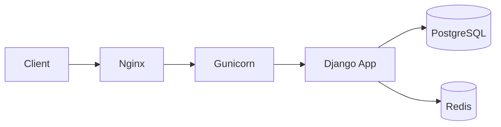

# How to Deploy Django to Production Servers

Author: [nawazdhandala](https://github.com/nawazdhandala)

Tags: Python, Django, Deployment, Production, DevOps

Description: Learn how to deploy Django applications to production servers with Gunicorn, Nginx, PostgreSQL, SSL, and security hardening best practices.

---

Deploying Django to production is more than just running `python manage.py runserver` on a server. The development server is single-threaded, not secure, and will fall over under any real traffic. This guide walks through setting up a production-ready Django deployment with Gunicorn, Nginx, PostgreSQL, and proper security hardening.

## Production Architecture Overview

A typical Django production setup looks like this:



Nginx handles SSL termination, static files, and reverse proxying. Gunicorn runs your Python code as multiple worker processes. PostgreSQL stores your data, and Redis handles caching and sessions.

## Pre-Deployment Checklist

Before deploying, run through this checklist:

| Task | Command/Action | Why It Matters |
|------|----------------|----------------|
| Run deployment check | `python manage.py check --deploy` | Catches common security misconfigurations |
| Collect static files | `python manage.py collectstatic` | Gathers static files for Nginx to serve |
| Run migrations | `python manage.py migrate` | Ensures database schema is current |
| Set DEBUG=False | `DEBUG = False` in settings | Prevents sensitive info leaking |
| Configure ALLOWED_HOSTS | `ALLOWED_HOSTS = ['yourdomain.com']` | Prevents HTTP Host header attacks |

## Django Production Settings

Create a separate settings file for production. Never use development settings in production.

```python
# settings/production.py
import os
from .base import *

# SECURITY: Never run with DEBUG in production
DEBUG = False

# Only allow requests from your domain
ALLOWED_HOSTS = [
    'yourdomain.com',
    'www.yourdomain.com',
]

# Use environment variables for secrets - never hardcode them
SECRET_KEY = os.environ.get('DJANGO_SECRET_KEY')

# PostgreSQL database configuration
DATABASES = {
    'default': {
        'ENGINE': 'django.db.backends.postgresql',
        'NAME': os.environ.get('DB_NAME'),
        'USER': os.environ.get('DB_USER'),
        'PASSWORD': os.environ.get('DB_PASSWORD'),
        'HOST': os.environ.get('DB_HOST', 'localhost'),
        'PORT': os.environ.get('DB_PORT', '5432'),
        'CONN_MAX_AGE': 60,  # Keep connections alive for 60 seconds
        'OPTIONS': {
            'connect_timeout': 10,
        },
    }
}

# Static files served by Nginx
STATIC_URL = '/static/'
STATIC_ROOT = '/var/www/myproject/static/'

# Media files (user uploads)
MEDIA_URL = '/media/'
MEDIA_ROOT = '/var/www/myproject/media/'

# Security settings - all of these should be True in production
SECURE_BROWSER_XSS_FILTER = True
SECURE_CONTENT_TYPE_NOSNIFF = True
X_FRAME_OPTIONS = 'DENY'
CSRF_COOKIE_SECURE = True
SESSION_COOKIE_SECURE = True

# HTTPS settings
SECURE_SSL_REDIRECT = True
SECURE_HSTS_SECONDS = 31536000  # 1 year
SECURE_HSTS_INCLUDE_SUBDOMAINS = True
SECURE_HSTS_PRELOAD = True

# Logging configuration
LOGGING = {
    'version': 1,
    'disable_existing_loggers': False,
    'formatters': {
        'verbose': {
            'format': '{levelname} {asctime} {module} {message}',
            'style': '{',
        },
    },
    'handlers': {
        'file': {
            'level': 'WARNING',
            'class': 'logging.FileHandler',
            'filename': '/var/log/django/myproject.log',
            'formatter': 'verbose',
        },
    },
    'root': {
        'handlers': ['file'],
        'level': 'WARNING',
    },
}
```

## Installing and Configuring Gunicorn

Gunicorn is a Python WSGI HTTP server. It spawns multiple worker processes to handle concurrent requests.

```bash
# Install Gunicorn
pip install gunicorn

# Test that it works - run from your project directory
gunicorn myproject.wsgi:application --bind 0.0.0.0:8000
```

Create a Gunicorn configuration file for production:

```python
# gunicorn.conf.py
import multiprocessing

# Bind to a Unix socket for better performance with Nginx
bind = 'unix:/run/gunicorn/myproject.sock'

# Number of workers - rule of thumb: (2 x CPU cores) + 1
workers = multiprocessing.cpu_count() * 2 + 1

# Worker class - sync is fine for most apps
worker_class = 'sync'

# Timeout for worker processes
timeout = 30

# Restart workers after this many requests to prevent memory leaks
max_requests = 1000
max_requests_jitter = 50

# Logging
accesslog = '/var/log/gunicorn/access.log'
errorlog = '/var/log/gunicorn/error.log'
loglevel = 'warning'

# Process naming
proc_name = 'myproject-gunicorn'

# Run as specific user/group
user = 'www-data'
group = 'www-data'
```

## Systemd Service for Gunicorn

Create a systemd service to manage Gunicorn:

```ini
# /etc/systemd/system/gunicorn-myproject.service
[Unit]
Description=Gunicorn daemon for myproject
After=network.target

[Service]
User=www-data
Group=www-data
WorkingDirectory=/var/www/myproject
RuntimeDirectory=gunicorn

# Load environment variables from file
EnvironmentFile=/etc/myproject/env

# Start Gunicorn with the config file
ExecStart=/var/www/myproject/venv/bin/gunicorn \
    --config /var/www/myproject/gunicorn.conf.py \
    myproject.wsgi:application

# Restart on failure
Restart=on-failure
RestartSec=5

# Resource limits
LimitNOFILE=65535

[Install]
WantedBy=multi-user.target
```

Enable and start the service:

```bash
# Reload systemd to pick up the new service
sudo systemctl daemon-reload

# Enable the service to start on boot
sudo systemctl enable gunicorn-myproject

# Start the service
sudo systemctl start gunicorn-myproject

# Check status
sudo systemctl status gunicorn-myproject
```

## Nginx Configuration

Nginx sits in front of Gunicorn, handling SSL, static files, and load balancing.

```nginx
# /etc/nginx/sites-available/myproject
upstream django {
    # Connect to Gunicorn via Unix socket
    server unix:/run/gunicorn/myproject.sock fail_timeout=0;
}

# Redirect HTTP to HTTPS
server {
    listen 80;
    server_name yourdomain.com www.yourdomain.com;
    return 301 https://$server_name$request_uri;
}

server {
    listen 443 ssl http2;
    server_name yourdomain.com www.yourdomain.com;

    # SSL certificate paths - use Let's Encrypt
    ssl_certificate /etc/letsencrypt/live/yourdomain.com/fullchain.pem;
    ssl_certificate_key /etc/letsencrypt/live/yourdomain.com/privkey.pem;

    # SSL settings
    ssl_protocols TLSv1.2 TLSv1.3;
    ssl_prefer_server_ciphers on;
    ssl_ciphers ECDHE-ECDSA-AES128-GCM-SHA256:ECDHE-RSA-AES128-GCM-SHA256;

    # Security headers
    add_header X-Frame-Options "SAMEORIGIN" always;
    add_header X-Content-Type-Options "nosniff" always;
    add_header X-XSS-Protection "1; mode=block" always;

    # Logging
    access_log /var/log/nginx/myproject.access.log;
    error_log /var/log/nginx/myproject.error.log;

    # Max upload size
    client_max_body_size 10M;

    # Static files - served directly by Nginx
    location /static/ {
        alias /var/www/myproject/static/;
        expires 30d;
        add_header Cache-Control "public, immutable";
    }

    # Media files
    location /media/ {
        alias /var/www/myproject/media/;
        expires 7d;
    }

    # Proxy everything else to Gunicorn
    location / {
        proxy_pass http://django;
        proxy_set_header Host $http_host;
        proxy_set_header X-Real-IP $remote_addr;
        proxy_set_header X-Forwarded-For $proxy_add_x_forwarded_for;
        proxy_set_header X-Forwarded-Proto $scheme;
        proxy_redirect off;

        # Timeouts
        proxy_connect_timeout 60s;
        proxy_send_timeout 60s;
        proxy_read_timeout 60s;
    }
}
```

Enable the site and test the configuration:

```bash
# Create symlink to enable the site
sudo ln -s /etc/nginx/sites-available/myproject /etc/nginx/sites-enabled/

# Test Nginx configuration
sudo nginx -t

# Reload Nginx
sudo systemctl reload nginx
```

## Setting Up SSL with Let's Encrypt

Use Certbot to get free SSL certificates:

```bash
# Install Certbot
sudo apt install certbot python3-certbot-nginx

# Get certificate - Certbot will modify your Nginx config
sudo certbot --nginx -d yourdomain.com -d www.yourdomain.com

# Test automatic renewal
sudo certbot renew --dry-run
```

## PostgreSQL Setup

Set up PostgreSQL for production:

```bash
# Install PostgreSQL
sudo apt install postgresql postgresql-contrib

# Switch to postgres user and create database
sudo -u postgres psql
```

```sql
-- Create database and user
CREATE DATABASE myproject;
CREATE USER myproject_user WITH PASSWORD 'your-secure-password';

-- Grant privileges
GRANT ALL PRIVILEGES ON DATABASE myproject TO myproject_user;

-- Optimize for Django
ALTER ROLE myproject_user SET client_encoding TO 'utf8';
ALTER ROLE myproject_user SET default_transaction_isolation TO 'read committed';
ALTER ROLE myproject_user SET timezone TO 'UTC';
```

## Collecting Static Files

Before going live, collect all static files:

```bash
# Activate your virtual environment
source /var/www/myproject/venv/bin/activate

# Set the settings module
export DJANGO_SETTINGS_MODULE=myproject.settings.production

# Collect static files
python manage.py collectstatic --noinput

# Set proper permissions
sudo chown -R www-data:www-data /var/www/myproject/static/
```

## Environment Variables File

Store your secrets in an environment file:

```bash
# /etc/myproject/env
DJANGO_SETTINGS_MODULE=myproject.settings.production
DJANGO_SECRET_KEY=your-50-character-random-string-here
DB_NAME=myproject
DB_USER=myproject_user
DB_PASSWORD=your-secure-password
DB_HOST=localhost
DB_PORT=5432
```

Set secure permissions:

```bash
sudo chmod 600 /etc/myproject/env
sudo chown root:www-data /etc/myproject/env
```

## Deployment Verification

After deploying, verify everything works:

| Check | How to Verify |
|-------|---------------|
| Site loads | Visit https://yourdomain.com |
| SSL working | Check for padlock in browser, no mixed content warnings |
| Static files | Inspect network tab, static files should return 200 |
| Admin works | Log into /admin/ |
| Logs are clean | Check /var/log/gunicorn/ and /var/log/nginx/ |
| Database connected | Create a test object through admin |

Run Django's deployment check one more time:

```bash
python manage.py check --deploy
```

## Restarting After Code Changes

When you deploy new code:

```bash
# Pull new code
cd /var/www/myproject
git pull origin main

# Install any new dependencies
source venv/bin/activate
pip install -r requirements.txt

# Run migrations
python manage.py migrate

# Collect static files
python manage.py collectstatic --noinput

# Restart Gunicorn to pick up code changes
sudo systemctl restart gunicorn-myproject
```

## Summary

Deploying Django to production requires multiple components working together. Gunicorn handles Python execution, Nginx serves static files and terminates SSL, PostgreSQL stores your data, and systemd keeps everything running. The key points to remember are: never run with DEBUG=True, use environment variables for secrets, serve static files through Nginx, and always use HTTPS. With this setup, your Django app is ready to handle real production traffic.
