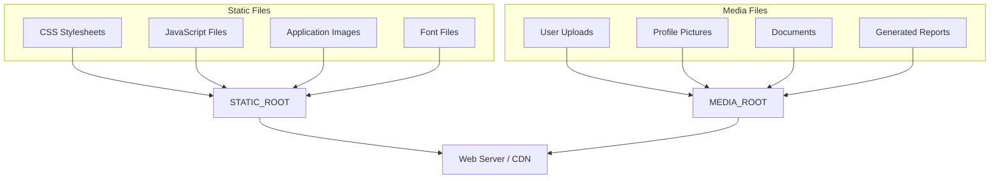
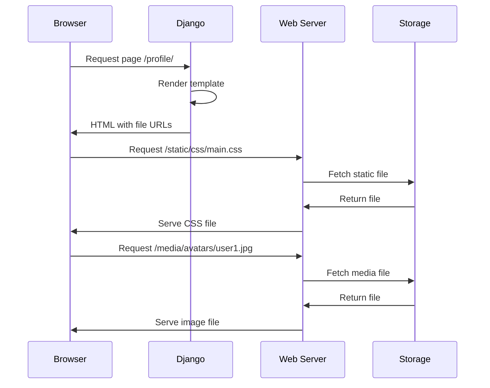
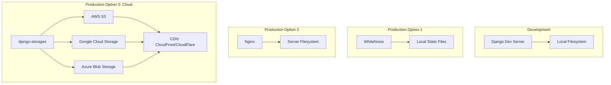

# How to Handle Static and Media Files in Django

Author: [nawazdhandala](https://www.github.com/nawazdhandala)

Tags: Django, Python, Static Files, Media, Storage

Description: Learn how to properly configure and manage static files (CSS, JavaScript, images) and media files (user uploads) in Django applications, from development to production deployment.

---

> Managing static and media files correctly is essential for any Django application. Static files include your CSS, JavaScript, and fixed images, while media files are user-uploaded content. This guide covers everything from basic configuration to production-ready storage solutions.

Handling files in Django might seem straightforward, but getting it right for production environments requires understanding several concepts. Poor file handling can lead to slow page loads, security vulnerabilities, and deployment headaches.

---

## Understanding Static vs Media Files

Before diving into configuration, let's clarify the difference between these two types of files.

| Type | Description | Example | Storage Location |
|------|-------------|---------|------------------|
| **Static Files** | Application assets, part of your codebase | CSS, JS, images, fonts | `STATIC_ROOT` |
| **Media Files** | User-uploaded content, dynamic | Profile photos, documents | `MEDIA_ROOT` |



---

## Configuring Static Files

### Basic Settings Configuration

The following settings control how Django finds and serves static files. Add these to your `settings.py` file.

```python
# settings.py
import os
from pathlib import Path

# Build paths inside the project like this: BASE_DIR / 'subdir'
BASE_DIR = Path(__file__).resolve().parent.parent

# URL prefix for static files
# This is the URL path where static files will be accessible
STATIC_URL = '/static/'

# Directory where collectstatic will gather all static files
# This should be outside your project directory for production
STATIC_ROOT = BASE_DIR / 'staticfiles'

# Additional directories where Django will look for static files
# These are searched in addition to the 'static' folder in each app
STATICFILES_DIRS = [
    BASE_DIR / 'static',  # Project-level static files
]

# Finders tell Django where to look for static files
# The default finders search app directories and STATICFILES_DIRS
STATICFILES_FINDERS = [
    'django.contrib.staticfiles.finders.FileSystemFinder',
    'django.contrib.staticfiles.finders.AppDirectoriesFinder',
]
```

### Project Structure for Static Files

Understanding where to place your static files is crucial for proper organization.

```
myproject/
    manage.py
    myproject/
        settings.py
        urls.py
    static/                    # Project-level static files
        css/
            main.css
        js/
            app.js
        images/
            logo.png
    myapp/
        static/               # App-level static files
            myapp/            # Namespaced directory
                css/
                    styles.css
                js/
                    scripts.js
    staticfiles/              # STATIC_ROOT (created by collectstatic)
```

### Using Static Files in Templates

Django provides template tags to reference static files. Always use these tags instead of hardcoding paths.

```html
<!-- templates/base.html -->

<!DOCTYPE html>
<html>
<head>
    <title>My Django App</title>

    <!-- Reference CSS files using the static template tag -->
    <!-- This ensures the correct URL is generated regardless of deployment -->
    <link rel="stylesheet" href="">

    <!-- Reference app-specific static files with namespace -->
    <link rel="stylesheet" href="">
</head>
<body>
    <!-- Reference images using the static tag -->
    

    <div id="app"></div>

    <!-- JavaScript files at the end of body for faster page loads -->
    <script src=""></script>
    <script src=""></script>
</body>
</html>
```

### Collecting Static Files for Production

The `collectstatic` command gathers all static files into `STATIC_ROOT` for production serving.

```bash
# Collect all static files into STATIC_ROOT
python manage.py collectstatic

# Skip the confirmation prompt in automated deployments
python manage.py collectstatic --noinput

# Clear existing files before collecting
python manage.py collectstatic --clear --noinput
```

---

## Configuring Media Files

### Basic Media Settings

Media files require separate configuration since they are user-uploaded and dynamic.

```python
# settings.py

# URL prefix for media files
# This is the URL path where uploaded files will be accessible
MEDIA_URL = '/media/'

# Absolute filesystem path where uploaded files will be stored
# This should have appropriate write permissions
MEDIA_ROOT = BASE_DIR / 'media'

# Optional: Set maximum upload size (in bytes)
# 5MB limit shown here
DATA_UPLOAD_MAX_MEMORY_SIZE = 5242880
FILE_UPLOAD_MAX_MEMORY_SIZE = 5242880
```

### Serving Media Files in Development

During development, Django can serve media files. Configure your URLs to enable this.

```python
# urls.py
from django.conf import settings
from django.conf.urls.static import static
from django.contrib import admin
from django.urls import path, include

urlpatterns = [
    path('admin/', admin.site.urls),
    path('api/', include('myapp.urls')),
]

# Only serve media files through Django in development
# In production, use a web server or cloud storage
if settings.DEBUG:
    urlpatterns += static(settings.MEDIA_URL, document_root=settings.MEDIA_ROOT)
    urlpatterns += static(settings.STATIC_URL, document_root=settings.STATIC_ROOT)
```

### Creating Models with File Fields

Django provides `FileField` and `ImageField` for handling uploads in models.

```python
# models.py
from django.db import models
from django.contrib.auth.models import User
import uuid
import os

def user_upload_path(instance, filename):
    """
    Generate a unique path for user uploads.
    Files will be stored in: media/uploads/user_<id>/<uuid>_<filename>
    This prevents filename conflicts and organizes files by user.
    """
    # Get file extension
    ext = filename.split('.')[-1]
    # Generate unique filename
    new_filename = f"{uuid.uuid4().hex}.{ext}"
    # Return the upload path
    return os.path.join('uploads', f'user_{instance.user.id}', new_filename)


class UserProfile(models.Model):
    """User profile model with avatar image upload"""

    user = models.OneToOneField(User, on_delete=models.CASCADE)

    # ImageField requires Pillow library: pip install Pillow
    # upload_to specifies the subdirectory within MEDIA_ROOT
    avatar = models.ImageField(
        upload_to='avatars/',
        blank=True,
        null=True,
        help_text='Profile picture'
    )

    # Using a callable for dynamic upload paths
    resume = models.FileField(
        upload_to=user_upload_path,
        blank=True,
        null=True,
        help_text='Resume document'
    )

    def __str__(self):
        return f"{self.user.username}'s profile"


class Document(models.Model):
    """Document model with file upload and metadata"""

    DOCUMENT_TYPES = [
        ('pdf', 'PDF Document'),
        ('doc', 'Word Document'),
        ('img', 'Image'),
        ('other', 'Other'),
    ]

    title = models.CharField(max_length=255)
    document_type = models.CharField(max_length=10, choices=DOCUMENT_TYPES)

    # Store file with timestamp-based organization
    file = models.FileField(upload_to='documents/%Y/%m/%d/')

    # Track upload metadata
    uploaded_at = models.DateTimeField(auto_now_add=True)
    file_size = models.PositiveIntegerField(editable=False, null=True)

    def save(self, *args, **kwargs):
        """Override save to calculate file size before saving"""
        if self.file:
            self.file_size = self.file.size
        super().save(*args, **kwargs)

    def __str__(self):
        return self.title
```

### Using Media Files in Templates

Access uploaded files through the model field's `url` attribute.

```html
<!-- templates/profile.html -->


<div class="profile-card">
    
        <!-- Access the file URL through the .url attribute -->
        
    
        <!-- Fallback to a default static image -->
        
    

    <h2>{{ user.username }}</h2>

    
        <a href="{{ user.userprofile.resume.url }}"
           download
           class="download-link">
            Download Resume
        </a>
    
</div>
```

---

## File Request Flow

Understanding how Django processes file requests helps with debugging and optimization.



---

## Production Configuration

### Using WhiteNoise for Static Files

WhiteNoise allows Django to serve static files efficiently without a separate web server.

```bash
# Install WhiteNoise
pip install whitenoise
```

```python
# settings.py

MIDDLEWARE = [
    'django.middleware.security.SecurityMiddleware',
    # Add WhiteNoise right after SecurityMiddleware
    'whitenoise.middleware.WhiteNoiseMiddleware',
    'django.contrib.sessions.middleware.SessionMiddleware',
    'django.middleware.common.CommonMiddleware',
    # ... rest of middleware
]

# Enable WhiteNoise compression and caching
# This adds far-future cache headers and gzip compression
STATICFILES_STORAGE = 'whitenoise.storage.CompressedManifestStaticFilesStorage'

# Alternative: Use manifest storage without compression
# STATICFILES_STORAGE = 'whitenoise.storage.CompressedStaticFilesStorage'
```

### Nginx Configuration for Production

For high-traffic sites, use Nginx to serve static and media files directly.

```nginx
# /etc/nginx/sites-available/myproject

upstream django {
    server unix:///var/run/gunicorn.sock;
}

server {
    listen 80;
    server_name example.com;

    # Serve static files directly through Nginx
    # This bypasses Django entirely for better performance
    location /static/ {
        alias /var/www/myproject/staticfiles/;

        # Enable gzip compression for text-based files
        gzip on;
        gzip_types text/css application/javascript application/json;

        # Cache static files for 1 year (they have hashed filenames)
        expires 1y;
        add_header Cache-Control "public, immutable";
    }

    # Serve media files directly through Nginx
    location /media/ {
        alias /var/www/myproject/media/;

        # Cache media files for 1 month
        expires 1M;
        add_header Cache-Control "public";
    }

    # Proxy all other requests to Django/Gunicorn
    location / {
        proxy_pass http://django;
        proxy_set_header Host $host;
        proxy_set_header X-Real-IP $remote_addr;
        proxy_set_header X-Forwarded-For $proxy_add_x_forwarded_for;
        proxy_set_header X-Forwarded-Proto $scheme;
    }
}
```

---

## Cloud Storage with django-storages

For production applications, cloud storage provides scalability, reliability, and CDN integration.

### Amazon S3 Configuration

Set up S3 for storing both static and media files.

```bash
# Install required packages
pip install django-storages boto3
```

```python
# settings.py

INSTALLED_APPS = [
    # ... other apps
    'storages',
]

# AWS Credentials
# Store these in environment variables, never in code
AWS_ACCESS_KEY_ID = os.environ.get('AWS_ACCESS_KEY_ID')
AWS_SECRET_ACCESS_KEY = os.environ.get('AWS_SECRET_ACCESS_KEY')
AWS_STORAGE_BUCKET_NAME = os.environ.get('AWS_STORAGE_BUCKET_NAME')
AWS_S3_REGION_NAME = 'us-east-1'

# S3 Settings
AWS_S3_CUSTOM_DOMAIN = f'{AWS_STORAGE_BUCKET_NAME}.s3.amazonaws.com'
AWS_DEFAULT_ACL = None  # Use bucket ACL
AWS_S3_OBJECT_PARAMETERS = {
    'CacheControl': 'max-age=86400',  # 1 day cache
}

# Prevent overwriting files with same name
AWS_S3_FILE_OVERWRITE = False

# Use S3 for static files
STATICFILES_STORAGE = 'storages.backends.s3boto3.S3Boto3Storage'
STATIC_URL = f'https://{AWS_S3_CUSTOM_DOMAIN}/static/'

# Use S3 for media files
DEFAULT_FILE_STORAGE = 'storages.backends.s3boto3.S3Boto3Storage'
MEDIA_URL = f'https://{AWS_S3_CUSTOM_DOMAIN}/media/'
```

### Separate Storage Backends

Use different storage locations for static and media files for better organization.

```python
# storage_backends.py
from storages.backends.s3boto3 import S3Boto3Storage


class StaticStorage(S3Boto3Storage):
    """
    Storage backend for static files.
    Uses a separate 'static' prefix in the S3 bucket.
    """
    location = 'static'
    default_acl = 'public-read'
    file_overwrite = True  # Overwrite is fine for static files

    # Set far-future cache headers for static files
    object_parameters = {
        'CacheControl': 'max-age=31536000',  # 1 year
    }


class MediaStorage(S3Boto3Storage):
    """
    Storage backend for media files.
    Uses a separate 'media' prefix in the S3 bucket.
    """
    location = 'media'
    default_acl = 'public-read'
    file_overwrite = False  # Never overwrite user uploads

    # Shorter cache for user uploads
    object_parameters = {
        'CacheControl': 'max-age=86400',  # 1 day
    }


class PrivateMediaStorage(S3Boto3Storage):
    """
    Storage backend for private media files.
    Files are not publicly accessible and require signed URLs.
    """
    location = 'private'
    default_acl = 'private'
    file_overwrite = False
    custom_domain = False  # Don't use custom domain for private files

    def url(self, name, parameters=None, expire=3600):
        """Generate a signed URL that expires after 1 hour"""
        return super().url(name, parameters={'ResponseContentDisposition': 'attachment'}, expire=expire)
```

```python
# settings.py

# Use custom storage backends
STATICFILES_STORAGE = 'myproject.storage_backends.StaticStorage'
DEFAULT_FILE_STORAGE = 'myproject.storage_backends.MediaStorage'

# For private files, use in specific model fields
# file = models.FileField(storage=PrivateMediaStorage())
```

### Google Cloud Storage Configuration

Set up Google Cloud Storage as an alternative to S3.

```bash
# Install required packages
pip install django-storages google-cloud-storage
```

```python
# settings.py

# Google Cloud Storage settings
GS_BUCKET_NAME = os.environ.get('GS_BUCKET_NAME')
GS_PROJECT_ID = os.environ.get('GS_PROJECT_ID')

# Path to service account credentials JSON file
GS_CREDENTIALS = os.environ.get('GOOGLE_APPLICATION_CREDENTIALS')

# Use GCS for file storage
DEFAULT_FILE_STORAGE = 'storages.backends.gcloud.GoogleCloudStorage'
STATICFILES_STORAGE = 'storages.backends.gcloud.GoogleCloudStorage'

# Custom domain (if using Cloud CDN)
GS_CUSTOM_ENDPOINT = f'https://storage.googleapis.com/{GS_BUCKET_NAME}'
```

---

## Storage Architecture Overview



---

## Handling File Uploads Securely

### Form-Based File Uploads

Create secure forms for handling file uploads with validation.

```python
# forms.py
from django import forms
from django.core.validators import FileExtensionValidator
from .models import Document, UserProfile

class DocumentUploadForm(forms.ModelForm):
    """Form for uploading documents with validation"""

    class Meta:
        model = Document
        fields = ['title', 'document_type', 'file']

    def clean_file(self):
        """Validate uploaded file"""
        file = self.cleaned_data.get('file')

        if file:
            # Check file size (limit to 10MB)
            max_size = 10 * 1024 * 1024  # 10MB in bytes
            if file.size > max_size:
                raise forms.ValidationError(
                    f'File size must be under 10MB. Your file is {file.size / (1024*1024):.2f}MB.'
                )

            # Validate file extension
            allowed_extensions = ['pdf', 'doc', 'docx', 'txt', 'jpg', 'png']
            ext = file.name.split('.')[-1].lower()
            if ext not in allowed_extensions:
                raise forms.ValidationError(
                    f'File type .{ext} is not allowed. Allowed types: {", ".join(allowed_extensions)}'
                )

        return file


class AvatarUploadForm(forms.ModelForm):
    """Form for uploading profile avatars"""

    class Meta:
        model = UserProfile
        fields = ['avatar']

    def clean_avatar(self):
        """Validate avatar image"""
        avatar = self.cleaned_data.get('avatar')

        if avatar:
            # Check file size (limit to 2MB for images)
            max_size = 2 * 1024 * 1024
            if avatar.size > max_size:
                raise forms.ValidationError('Avatar must be under 2MB.')

            # Check image dimensions using Pillow
            from PIL import Image
            img = Image.open(avatar)

            max_dimension = 2000
            if img.width > max_dimension or img.height > max_dimension:
                raise forms.ValidationError(
                    f'Image dimensions must be under {max_dimension}x{max_dimension} pixels.'
                )

        return avatar
```

### View for File Uploads

Handle file uploads in views with proper validation and error handling.

```python
# views.py
from django.shortcuts import render, redirect
from django.contrib.auth.decorators import login_required
from django.contrib import messages
from django.http import JsonResponse
from .forms import DocumentUploadForm, AvatarUploadForm
from .models import Document

@login_required
def upload_document(request):
    """
    Handle document upload with form validation.
    Returns JSON response for AJAX uploads or redirects for standard forms.
    """
    if request.method == 'POST':
        form = DocumentUploadForm(request.POST, request.FILES)

        if form.is_valid():
            # Save the document but don't commit yet
            document = form.save(commit=False)
            document.uploaded_by = request.user
            document.save()

            # Check if this is an AJAX request
            if request.headers.get('X-Requested-With') == 'XMLHttpRequest':
                return JsonResponse({
                    'success': True,
                    'message': 'Document uploaded successfully',
                    'document_id': document.id,
                    'file_url': document.file.url
                })

            messages.success(request, 'Document uploaded successfully!')
            return redirect('document_list')
        else:
            # Handle form errors
            if request.headers.get('X-Requested-With') == 'XMLHttpRequest':
                return JsonResponse({
                    'success': False,
                    'errors': form.errors
                }, status=400)
    else:
        form = DocumentUploadForm()

    return render(request, 'documents/upload.html', {'form': form})


@login_required
def upload_avatar(request):
    """Handle avatar upload with image processing"""
    if request.method == 'POST':
        # Get or create user profile
        profile, created = UserProfile.objects.get_or_create(user=request.user)
        form = AvatarUploadForm(request.POST, request.FILES, instance=profile)

        if form.is_valid():
            # Delete old avatar if it exists
            if profile.avatar:
                profile.avatar.delete(save=False)

            form.save()
            messages.success(request, 'Avatar updated successfully!')
            return redirect('profile')
    else:
        form = AvatarUploadForm()

    return render(request, 'profile/avatar_upload.html', {'form': form})
```

---

## Image Processing and Optimization

### Automatic Image Resizing

Resize images automatically when saving to reduce storage and bandwidth.

```python
# utils.py
from PIL import Image
from io import BytesIO
from django.core.files.uploadedfile import InMemoryUploadedFile
import sys

def resize_image(image_field, max_size=(800, 800), quality=85):
    """
    Resize an image to fit within max_size while maintaining aspect ratio.

    Args:
        image_field: Django ImageField or uploaded file
        max_size: Tuple of (max_width, max_height)
        quality: JPEG quality (1-100)

    Returns:
        Resized InMemoryUploadedFile
    """
    # Open the image
    img = Image.open(image_field)

    # Convert to RGB if necessary (for PNG with transparency)
    if img.mode in ('RGBA', 'P'):
        img = img.convert('RGB')

    # Calculate new size maintaining aspect ratio
    img.thumbnail(max_size, Image.Resampling.LANCZOS)

    # Save to BytesIO
    output = BytesIO()
    img.save(output, format='JPEG', quality=quality, optimize=True)
    output.seek(0)

    # Create new InMemoryUploadedFile
    return InMemoryUploadedFile(
        output,
        'ImageField',
        f"{image_field.name.split('.')[0]}.jpg",
        'image/jpeg',
        sys.getsizeof(output),
        None
    )


def create_thumbnail(image_field, size=(150, 150)):
    """
    Create a square thumbnail from an image.

    Args:
        image_field: Django ImageField or uploaded file
        size: Tuple of (width, height) for thumbnail

    Returns:
        Thumbnail as InMemoryUploadedFile
    """
    img = Image.open(image_field)

    # Convert to RGB
    if img.mode in ('RGBA', 'P'):
        img = img.convert('RGB')

    # Calculate crop box for square thumbnail
    width, height = img.size
    min_dimension = min(width, height)

    left = (width - min_dimension) // 2
    top = (height - min_dimension) // 2
    right = left + min_dimension
    bottom = top + min_dimension

    # Crop to square and resize
    img = img.crop((left, top, right, bottom))
    img = img.resize(size, Image.Resampling.LANCZOS)

    # Save to BytesIO
    output = BytesIO()
    img.save(output, format='JPEG', quality=85, optimize=True)
    output.seek(0)

    return InMemoryUploadedFile(
        output,
        'ImageField',
        f"thumb_{image_field.name.split('.')[0]}.jpg",
        'image/jpeg',
        sys.getsizeof(output),
        None
    )
```

### Model with Automatic Thumbnail

Create a model that automatically generates thumbnails on save.

```python
# models.py
from django.db import models
from django.db.models.signals import post_save, pre_delete
from django.dispatch import receiver
from .utils import resize_image, create_thumbnail

class Photo(models.Model):
    """Photo model with automatic thumbnail generation"""

    title = models.CharField(max_length=255)

    # Original image (will be resized on upload)
    image = models.ImageField(upload_to='photos/%Y/%m/')

    # Automatically generated thumbnail
    thumbnail = models.ImageField(
        upload_to='photos/thumbnails/%Y/%m/',
        blank=True,
        null=True
    )

    uploaded_at = models.DateTimeField(auto_now_add=True)

    def save(self, *args, **kwargs):
        """Override save to process images"""
        # Check if this is a new upload
        if self.pk is None and self.image:
            # Resize main image
            self.image = resize_image(self.image, max_size=(1920, 1080))

            # Create thumbnail
            self.thumbnail = create_thumbnail(self.image, size=(300, 300))

        super().save(*args, **kwargs)

    def __str__(self):
        return self.title


@receiver(pre_delete, sender=Photo)
def delete_photo_files(sender, instance, **kwargs):
    """Delete image files when Photo instance is deleted"""
    if instance.image:
        instance.image.delete(save=False)
    if instance.thumbnail:
        instance.thumbnail.delete(save=False)
```

---

## Best Practices

### Security Considerations

```python
# settings.py

# Limit upload size to prevent denial of service
DATA_UPLOAD_MAX_MEMORY_SIZE = 10485760  # 10MB
FILE_UPLOAD_MAX_MEMORY_SIZE = 10485760  # 10MB

# Set allowed file types at the model/form level
# Never trust client-side validation alone

# Use secure file naming
import uuid
import os

def secure_filename(instance, filename):
    """
    Generate secure filename to prevent directory traversal attacks.
    Original filename is preserved in metadata, not filesystem.
    """
    ext = os.path.splitext(filename)[1].lower()
    new_filename = f"{uuid.uuid4().hex}{ext}"
    return os.path.join('uploads', new_filename)
```

### Performance Optimization

```python
# settings.py

# Use ManifestStaticFilesStorage for cache-busting
# This appends content hash to filenames
STATICFILES_STORAGE = 'django.contrib.staticfiles.storage.ManifestStaticFilesStorage'

# For WhiteNoise with compression
STATICFILES_STORAGE = 'whitenoise.storage.CompressedManifestStaticFilesStorage'

# Configure file upload handlers for large files
FILE_UPLOAD_HANDLERS = [
    # For small files, keep in memory
    'django.core.files.uploadhandler.MemoryFileUploadHandler',
    # For large files, write to temp directory
    'django.core.files.uploadhandler.TemporaryFileUploadHandler',
]

# Threshold for switching to temp file (default is 2.5MB)
FILE_UPLOAD_MAX_MEMORY_SIZE = 2621440  # 2.5MB
```

### Cleanup Management Command

Create a management command to clean up orphaned files.

```python
# management/commands/cleanup_media.py
from django.core.management.base import BaseCommand
from django.conf import settings
from myapp.models import Document, UserProfile, Photo
import os

class Command(BaseCommand):
    """Remove orphaned media files not referenced by any model"""

    help = 'Clean up orphaned media files'

    def add_arguments(self, parser):
        parser.add_argument(
            '--dry-run',
            action='store_true',
            help='Show what would be deleted without actually deleting'
        )

    def handle(self, *args, **options):
        dry_run = options['dry_run']

        # Collect all referenced files from models
        referenced_files = set()

        # Add files from each model with file fields
        for doc in Document.objects.exclude(file=''):
            referenced_files.add(doc.file.name)

        for profile in UserProfile.objects.exclude(avatar=''):
            referenced_files.add(profile.avatar.name)

        for photo in Photo.objects.all():
            if photo.image:
                referenced_files.add(photo.image.name)
            if photo.thumbnail:
                referenced_files.add(photo.thumbnail.name)

        # Walk through media directory
        media_root = settings.MEDIA_ROOT
        orphaned_files = []
        total_size = 0

        for root, dirs, files in os.walk(media_root):
            for filename in files:
                filepath = os.path.join(root, filename)
                relative_path = os.path.relpath(filepath, media_root)

                if relative_path not in referenced_files:
                    orphaned_files.append(filepath)
                    total_size += os.path.getsize(filepath)

        # Report findings
        self.stdout.write(f'Found {len(orphaned_files)} orphaned files')
        self.stdout.write(f'Total size: {total_size / (1024*1024):.2f} MB')

        if dry_run:
            self.stdout.write('Dry run - no files deleted')
            for f in orphaned_files[:10]:
                self.stdout.write(f'  Would delete: {f}')
            if len(orphaned_files) > 10:
                self.stdout.write(f'  ... and {len(orphaned_files) - 10} more')
        else:
            # Delete orphaned files
            for filepath in orphaned_files:
                os.remove(filepath)
            self.stdout.write(
                self.style.SUCCESS(f'Deleted {len(orphaned_files)} orphaned files')
            )
```

---

## Testing File Handling

Write tests to ensure your file handling works correctly.

```python
# tests.py
from django.test import TestCase, Client, override_settings
from django.core.files.uploadedfile import SimpleUploadedFile
from django.contrib.auth.models import User
from django.urls import reverse
from .models import Document, UserProfile
import tempfile
import shutil
from PIL import Image
from io import BytesIO

# Use temporary directory for test media files
TEMP_MEDIA_ROOT = tempfile.mkdtemp()


@override_settings(MEDIA_ROOT=TEMP_MEDIA_ROOT)
class DocumentUploadTest(TestCase):
    """Test document upload functionality"""

    @classmethod
    def setUpClass(cls):
        super().setUpClass()
        cls.user = User.objects.create_user(
            username='testuser',
            password='testpass123'
        )

    @classmethod
    def tearDownClass(cls):
        # Clean up temp media directory
        shutil.rmtree(TEMP_MEDIA_ROOT, ignore_errors=True)
        super().tearDownClass()

    def setUp(self):
        self.client = Client()
        self.client.login(username='testuser', password='testpass123')

    def test_upload_valid_document(self):
        """Test uploading a valid PDF document"""
        # Create a simple PDF-like file
        pdf_content = b'%PDF-1.4 test content'
        uploaded_file = SimpleUploadedFile(
            'test_document.pdf',
            pdf_content,
            content_type='application/pdf'
        )

        response = self.client.post(
            reverse('upload_document'),
            {
                'title': 'Test Document',
                'document_type': 'pdf',
                'file': uploaded_file
            }
        )

        # Should redirect on success
        self.assertEqual(response.status_code, 302)

        # Document should be created
        self.assertTrue(Document.objects.filter(title='Test Document').exists())

    def test_reject_oversized_file(self):
        """Test that oversized files are rejected"""
        # Create a file larger than the limit
        large_content = b'x' * (11 * 1024 * 1024)  # 11MB
        uploaded_file = SimpleUploadedFile(
            'large_file.pdf',
            large_content,
            content_type='application/pdf'
        )

        response = self.client.post(
            reverse('upload_document'),
            {
                'title': 'Large Document',
                'document_type': 'pdf',
                'file': uploaded_file
            }
        )

        # Should return form with errors
        self.assertEqual(response.status_code, 200)
        self.assertContains(response, 'File size must be under')


@override_settings(MEDIA_ROOT=TEMP_MEDIA_ROOT)
class AvatarUploadTest(TestCase):
    """Test avatar upload with image processing"""

    def setUp(self):
        self.user = User.objects.create_user(
            username='testuser',
            password='testpass123'
        )
        self.client = Client()
        self.client.login(username='testuser', password='testpass123')

    def create_test_image(self, width=100, height=100, format='PNG'):
        """Create a test image file"""
        img = Image.new('RGB', (width, height), color='red')
        buffer = BytesIO()
        img.save(buffer, format=format)
        buffer.seek(0)
        return SimpleUploadedFile(
            f'test_image.{format.lower()}',
            buffer.read(),
            content_type=f'image/{format.lower()}'
        )

    def test_upload_valid_avatar(self):
        """Test uploading a valid avatar image"""
        image = self.create_test_image(200, 200)

        response = self.client.post(
            reverse('upload_avatar'),
            {'avatar': image}
        )

        self.assertEqual(response.status_code, 302)

        profile = UserProfile.objects.get(user=self.user)
        self.assertTrue(profile.avatar)

    def test_reject_oversized_image(self):
        """Test that oversized images are rejected"""
        # Create a large image
        image = self.create_test_image(5000, 5000)

        response = self.client.post(
            reverse('upload_avatar'),
            {'avatar': image}
        )

        self.assertEqual(response.status_code, 200)
        self.assertContains(response, 'dimensions must be under')
```

---

## Summary

| Aspect | Static Files | Media Files |
|--------|-------------|-------------|
| **Purpose** | Application assets | User uploads |
| **Settings** | `STATIC_URL`, `STATIC_ROOT` | `MEDIA_URL`, `MEDIA_ROOT` |
| **Collection** | `collectstatic` command | N/A |
| **Development** | Served by Django | Served via URL config |
| **Production** | WhiteNoise or Nginx | Nginx or Cloud Storage |
| **Version Control** | Yes (usually) | No |

Key takeaways for handling static and media files in Django:

1. **Always use template tags** for static file URLs to ensure portability
2. **Namespace app static files** to prevent collisions
3. **Use WhiteNoise** for simple production deployments
4. **Consider cloud storage** for scalability and reliability
5. **Validate uploads** thoroughly on the server side
6. **Process images** to reduce storage and bandwidth costs
7. **Clean up orphaned files** periodically
8. **Test file handling** with proper test isolation

---

*Need to monitor your Django application's performance? [OneUptime](https://oneuptime.com) provides comprehensive application monitoring with file storage metrics and alerting.*

**Related Reading:**
- [How to Implement File Uploads in Django](https://oneuptime.com/blog/post/2026-01-26-django-file-uploads/view)
