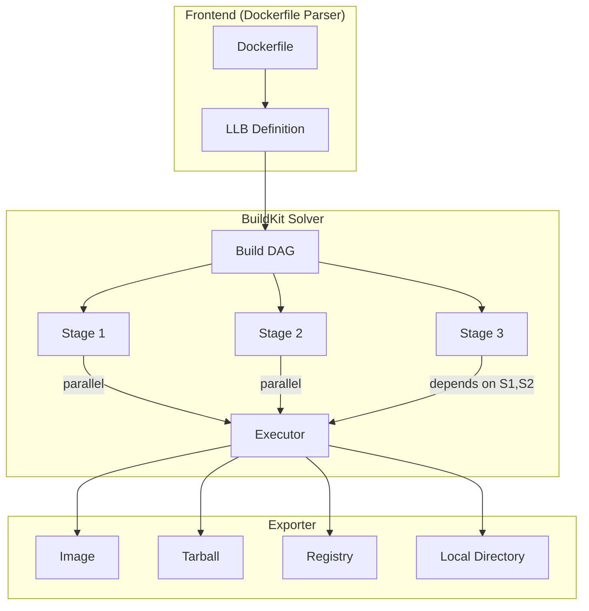
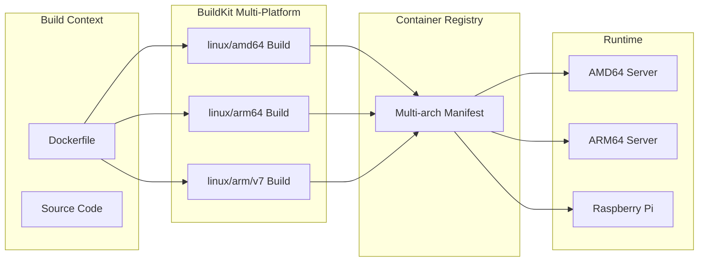
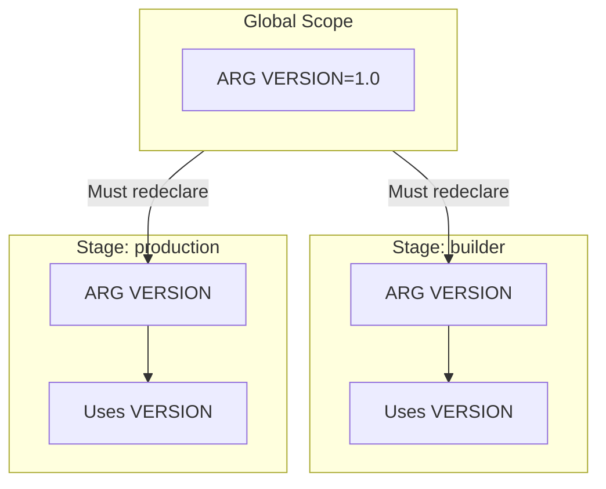

# How to Use Docker BuildKit Features

Author: [nawazdhandala](https://www.github.com/nawazdhandala)

Tags: Docker, BuildKit, Containers, DevOps, CI/CD, Multi-platform

Description: Master Docker BuildKit features including multi-platform builds, custom frontends, output formats, here-documents, and advanced build configurations for modern container workflows.

---

Docker BuildKit represents a complete reimagining of how container images are built. Beyond basic speed improvements, BuildKit introduces architectural changes that enable multi-platform builds, custom build frontends, flexible output formats, and sophisticated dependency graphs. Understanding these features unlocks powerful workflows that simply are not possible with the legacy builder.

## BuildKit Architecture Overview

BuildKit operates fundamentally differently from the legacy Docker builder. Instead of executing Dockerfile instructions sequentially, BuildKit constructs a directed acyclic graph (DAG) of build operations and executes them optimally.

The following diagram illustrates how BuildKit processes a multi-stage Dockerfile:



BuildKit separates the build process into three distinct phases: frontend parsing, build solving, and result exporting. Each phase can be customized independently, giving you tremendous flexibility.

## Enabling BuildKit

Modern Docker installations have BuildKit enabled by default. You can verify and configure BuildKit in several ways.

Check if BuildKit is active with this command:

```bash
# Check current builder
docker buildx ls

# Output shows available builders
# * default           docker
#   desktop-linux     docker
#   mybuilder         docker-container
```

Enable BuildKit explicitly through environment variables:

```bash
# Enable for current session
export DOCKER_BUILDKIT=1

# Or for a single build
DOCKER_BUILDKIT=1 docker build -t myapp .
```

Configure BuildKit permanently in the Docker daemon configuration file:

```json
{
  "features": {
    "buildkit": true
  },
  "builder": {
    "gc": {
      "enabled": true,
      "defaultKeepStorage": "20GB"
    }
  }
}
```

## Dockerfile Syntax Directive

Every BuildKit-enabled Dockerfile should start with a syntax directive. The directive tells BuildKit which frontend to use for parsing the Dockerfile.

```dockerfile
# syntax=docker/dockerfile:1.6

FROM alpine:3.19
RUN echo "Using BuildKit features"
```

The syntax directive enables several important capabilities:

```dockerfile
# Use the latest stable features
# syntax=docker/dockerfile:1

# Pin to a specific version for reproducibility
# syntax=docker/dockerfile:1.6.0

# Use experimental features from labs channel
# syntax=docker/dockerfile:1.6-labs

# Use a custom frontend from a registry
# syntax=myregistry.io/custom-frontend:latest
```

Pinning the syntax version ensures your builds remain reproducible even as BuildKit evolves.

## Here-Documents for Multi-line Scripts

BuildKit introduced here-document support, making complex shell scripts in Dockerfiles much cleaner. Instead of escaping newlines with backslashes, you can write natural multi-line scripts.

The traditional approach requires awkward line continuation:

```dockerfile
# Old approach with backslashes
RUN apt-get update && \
    apt-get install -y \
        curl \
        git \
        vim && \
    rm -rf /var/lib/apt/lists/*
```

Here-documents provide a cleaner alternative:

```dockerfile
# syntax=docker/dockerfile:1.6

FROM ubuntu:22.04

# Multi-line script using here-document
# Each line executes as part of the same shell session
RUN <<EOF
set -e
apt-get update
apt-get install -y curl git vim
rm -rf /var/lib/apt/lists/*
echo "Installation complete"
EOF
```

You can specify different interpreters for here-documents:

```dockerfile
# syntax=docker/dockerfile:1.6

FROM python:3.12-slim

# Execute Python code directly in the Dockerfile
RUN <<EOF python3
import os
import json

config = {
    "app_name": "myservice",
    "version": "1.0.0",
    "environment": os.environ.get("ENV", "production")
}

with open("/etc/app-config.json", "w") as f:
    json.dump(config, f, indent=2)

print(f"Configuration written: {config}")
EOF
```

Here-documents also work with COPY instructions for creating files inline:

```dockerfile
# syntax=docker/dockerfile:1.6

FROM nginx:alpine

# Create nginx configuration inline
COPY <<EOF /etc/nginx/conf.d/default.conf
server {
    listen 80;
    server_name localhost;

    location / {
        root /usr/share/nginx/html;
        index index.html;
        try_files \$uri \$uri/ /index.html;
    }

    location /api {
        proxy_pass http://backend:3000;
        proxy_set_header Host \$host;
    }
}
EOF
```

## Multi-Platform Builds

BuildKit enables building images for multiple CPU architectures from a single machine. Your ARM MacBook can build images for AMD64 Linux servers, and vice versa.

The following diagram shows the multi-platform build process:



Create a multi-platform builder instance first:

```bash
# Create a new builder that supports multi-platform builds
docker buildx create --name multiarch --driver docker-container --use

# Bootstrap the builder to download necessary components
docker buildx inspect --bootstrap

# Verify available platforms
docker buildx ls
```

Build for multiple platforms simultaneously:

```bash
# Build and push multi-arch image
docker buildx build \
    --platform linux/amd64,linux/arm64,linux/arm/v7 \
    --tag myregistry/myapp:latest \
    --push \
    .
```

Handle platform-specific code in your Dockerfile using build arguments:

```dockerfile
# syntax=docker/dockerfile:1.6

FROM --platform=$BUILDPLATFORM golang:1.22-alpine AS builder

# TARGETOS and TARGETARCH are automatically set by BuildKit
ARG TARGETOS
ARG TARGETARCH

WORKDIR /src
COPY go.mod go.sum ./
RUN go mod download

COPY . .

# Cross-compile for the target platform
RUN CGO_ENABLED=0 GOOS=$TARGETOS GOARCH=$TARGETARCH \
    go build -o /app/server ./cmd/server

FROM alpine:3.19
COPY --from=builder /app/server /usr/local/bin/server
ENTRYPOINT ["server"]
```

The available platform-related build arguments are:

```dockerfile
# syntax=docker/dockerfile:1.6

# BUILDPLATFORM - Platform of the build node (e.g., linux/amd64)
# BUILDOS - OS component of BUILDPLATFORM
# BUILDARCH - Architecture of BUILDPLATFORM
# BUILDVARIANT - Variant of BUILDPLATFORM (e.g., v7 for arm)

# TARGETPLATFORM - Platform of the target image (e.g., linux/arm64)
# TARGETOS - OS component of TARGETPLATFORM
# TARGETARCH - Architecture of TARGETPLATFORM
# TARGETVARIANT - Variant of TARGETPLATFORM
```

## Output Formats and Exporters

BuildKit supports multiple output formats beyond just Docker images. You can export build results as tarballs, OCI images, or directly to the filesystem.

Export to different formats using the output flag:

```bash
# Export as Docker image (default)
docker buildx build --output type=docker -t myapp:latest .

# Export as OCI image tarball
docker buildx build --output type=oci,dest=./myapp.tar .

# Export filesystem to local directory
docker buildx build --output type=local,dest=./output .

# Export specific files from the build
docker buildx build \
    --target=artifacts \
    --output type=local,dest=./dist \
    .
```

Create a Dockerfile that produces build artifacts without an image:

```dockerfile
# syntax=docker/dockerfile:1.6

FROM golang:1.22-alpine AS builder
WORKDIR /src
COPY . .
RUN go build -o /out/myapp ./cmd/myapp
RUN go test -coverprofile=/out/coverage.txt ./...

# Artifact stage for extraction
FROM scratch AS artifacts
COPY --from=builder /out/myapp /
COPY --from=builder /out/coverage.txt /
```

Extract just the artifacts:

```bash
# Build and extract artifacts to local directory
docker buildx build \
    --target artifacts \
    --output type=local,dest=./artifacts \
    .

# Results in:
# ./artifacts/myapp
# ./artifacts/coverage.txt
```

## Build Arguments and Variable Scoping

BuildKit handles build arguments with precise scoping rules. Understanding these rules prevents common mistakes with variable availability.

The following diagram illustrates ARG scoping:



Proper ARG usage across stages:

```dockerfile
# syntax=docker/dockerfile:1.6

# Global ARG - defined before any FROM
ARG BASE_IMAGE=node:20-alpine
ARG APP_VERSION=1.0.0

# ARGs before FROM are only available in FROM instructions
FROM ${BASE_IMAGE} AS builder

# Must redeclare ARG to use it in this stage
ARG APP_VERSION
ENV VERSION=${APP_VERSION}

WORKDIR /app
COPY package*.json ./
RUN npm ci
COPY . .
RUN npm run build

FROM ${BASE_IMAGE} AS production

# Redeclare again for this stage
ARG APP_VERSION
LABEL version=${APP_VERSION}

WORKDIR /app
COPY --from=builder /app/dist ./dist
COPY --from=builder /app/node_modules ./node_modules

CMD ["node", "dist/index.js"]
```

Pass build arguments at build time:

```bash
# Override default values
docker build \
    --build-arg BASE_IMAGE=node:20-slim \
    --build-arg APP_VERSION=2.0.0 \
    -t myapp:2.0.0 \
    .
```

## Build Progress and Debugging

BuildKit provides detailed progress output that helps diagnose build issues. Different output modes suit different use cases.

Configure progress output format:

```bash
# Auto-detect best format (default)
docker build --progress=auto -t myapp .

# Plain text output - best for CI/CD logs
docker build --progress=plain -t myapp .

# TTY output with live updates
docker build --progress=tty -t myapp .
```

Enable verbose debugging for troubleshooting:

```bash
# Show detailed BuildKit logs
BUILDKIT_PROGRESS=plain docker build -t myapp .

# Enable BuildKit debug logging
docker buildx build --progress=plain --no-cache -t myapp .
```

Inspect build cache and storage usage:

```bash
# Show cache disk usage
docker buildx du

# Show verbose cache information
docker buildx du --verbose

# Show cache usage by builder
docker buildx du --builder mybuilder
```

## BuildKit Garbage Collection

BuildKit maintains a build cache that can grow large over time. Proper garbage collection configuration keeps disk usage manageable.

Configure automatic garbage collection in the BuildKit daemon:

```toml
# /etc/buildkit/buildkitd.toml

[worker.oci]
  gc = true
  gckeepstorage = 20000000000  # 20GB

[[worker.oci.gcpolicy]]
  keepBytes = 10000000000      # Keep 10GB minimum
  keepDuration = 604800        # Keep for 7 days
  all = true
```

Manually clean build cache when needed:

```bash
# Remove all build cache
docker builder prune --all

# Remove cache older than 24 hours
docker builder prune --filter "until=24h"

# Remove cache for a specific builder
docker buildx prune --builder mybuilder

# Show what would be removed without actually removing
docker builder prune --all --dry-run
```

## Custom BuildKit Configuration

Create dedicated builders with custom configurations for different use cases.

Create a builder configuration file:

```toml
# buildkitd.toml

# Enable debug logging
debug = true

[log]
  format = "json"

[worker.oci]
  enabled = true
  gc = true
  gckeepstorage = 50000000000  # 50GB for CI builders

  [[worker.oci.gcpolicy]]
    all = true
    keepBytes = 20000000000
    keepDuration = 1209600      # 14 days

[registry."docker.io"]
  mirrors = ["mirror.gcr.io"]

[registry."myregistry.io"]
  http = false
  insecure = false
  ca = ["/etc/ssl/certs/my-ca.crt"]
```

Create and use a custom builder:

```bash
# Create builder with custom config
docker buildx create \
    --name ci-builder \
    --driver docker-container \
    --config ./buildkitd.toml \
    --driver-opt network=host

# Set as default builder
docker buildx use ci-builder

# Verify configuration
docker buildx inspect ci-builder
```

## Buildx Bake for Complex Builds

For projects with multiple images or complex build matrices, Buildx Bake provides declarative build configuration.

Create a bake file for multi-image builds:

```hcl
# docker-bake.hcl

variable "REGISTRY" {
  default = "myregistry.io"
}

variable "TAG" {
  default = "latest"
}

# Build all targets
group "default" {
  targets = ["api", "worker", "frontend"]
}

# API service
target "api" {
  dockerfile = "Dockerfile.api"
  tags = ["${REGISTRY}/myapp-api:${TAG}"]
  platforms = ["linux/amd64", "linux/arm64"]
  cache-from = ["type=registry,ref=${REGISTRY}/myapp-api:cache"]
  cache-to = ["type=registry,ref=${REGISTRY}/myapp-api:cache,mode=max"]
}

# Worker service
target "worker" {
  dockerfile = "Dockerfile.worker"
  tags = ["${REGISTRY}/myapp-worker:${TAG}"]
  platforms = ["linux/amd64", "linux/arm64"]
  cache-from = ["type=registry,ref=${REGISTRY}/myapp-worker:cache"]
  cache-to = ["type=registry,ref=${REGISTRY}/myapp-worker:cache,mode=max"]
}

# Frontend service
target "frontend" {
  context = "./frontend"
  dockerfile = "Dockerfile"
  tags = ["${REGISTRY}/myapp-frontend:${TAG}"]
  platforms = ["linux/amd64", "linux/arm64"]
  args = {
    NODE_ENV = "production"
  }
}

# Development builds - no cache push, local only
target "dev" {
  inherits = ["api"]
  tags = ["myapp-api:dev"]
  platforms = ["linux/amd64"]
  cache-to = []
}
```

Execute bake builds:

```bash
# Build all targets in the default group
docker buildx bake

# Build specific targets
docker buildx bake api worker

# Build with variable overrides
docker buildx bake --set "*.platform=linux/amd64" --set TAG=v1.2.3

# Print build plan without executing
docker buildx bake --print
```

## Attestations and SBOMs

BuildKit can generate Software Bill of Materials (SBOM) and provenance attestations for supply chain security.

Enable attestations during build:

```bash
# Generate SBOM attestation
docker buildx build \
    --sbom=true \
    --tag myregistry/myapp:latest \
    --push \
    .

# Generate provenance attestation
docker buildx build \
    --provenance=true \
    --tag myregistry/myapp:latest \
    --push \
    .

# Generate both attestations
docker buildx build \
    --sbom=true \
    --provenance=mode=max \
    --tag myregistry/myapp:latest \
    --push \
    .
```

Inspect attestations on built images:

```bash
# View image attestations
docker buildx imagetools inspect myregistry/myapp:latest --format "{{json .SBOM}}"

# View provenance
docker buildx imagetools inspect myregistry/myapp:latest --format "{{json .Provenance}}"
```

## CI/CD Integration Example

Integrate BuildKit features into a GitHub Actions workflow:

```yaml
# .github/workflows/build.yml
name: Build and Push

on:
  push:
    branches: [main]
    tags: ['v*']

jobs:
  build:
    runs-on: ubuntu-latest
    steps:
      - name: Checkout
        uses: actions/checkout@v4

      - name: Set up QEMU for multi-platform builds
        uses: docker/setup-qemu-action@v3

      - name: Set up Docker Buildx
        uses: docker/setup-buildx-action@v3
        with:
          driver-opts: |
            image=moby/buildkit:latest
            network=host

      - name: Login to Registry
        uses: docker/login-action@v3
        with:
          registry: ghcr.io
          username: ${{ github.actor }}
          password: ${{ secrets.GITHUB_TOKEN }}

      - name: Extract metadata
        id: meta
        uses: docker/metadata-action@v5
        with:
          images: ghcr.io/${{ github.repository }}
          tags: |
            type=ref,event=branch
            type=semver,pattern={{version}}
            type=sha

      - name: Build and push
        uses: docker/build-push-action@v5
        with:
          context: .
          platforms: linux/amd64,linux/arm64
          push: true
          tags: ${{ steps.meta.outputs.tags }}
          labels: ${{ steps.meta.outputs.labels }}
          cache-from: type=gha
          cache-to: type=gha,mode=max
          sbom: true
          provenance: mode=max
```

## Performance Best Practices

Maximize BuildKit performance with these configuration recommendations:

```dockerfile
# syntax=docker/dockerfile:1.6

# 1. Use specific base image tags for cache stability
FROM node:20.11.0-alpine AS builder

# 2. Order instructions from least to most frequently changed
WORKDIR /app

# 3. Copy dependency files first for better layer caching
COPY package.json package-lock.json ./

# 4. Use cache mounts for package managers
RUN --mount=type=cache,target=/root/.npm \
    npm ci --prefer-offline

# 5. Copy source code after dependencies
COPY . .

# 6. Use cache mounts for build artifacts
RUN --mount=type=cache,target=/app/.next/cache \
    npm run build

# 7. Use minimal final image
FROM node:20.11.0-alpine AS production

# 8. Create non-root user for security
RUN addgroup -S appgroup && adduser -S appuser -G appgroup
USER appuser

WORKDIR /app

# 9. Copy only necessary files from builder
COPY --from=builder --chown=appuser:appgroup /app/dist ./dist
COPY --from=builder --chown=appuser:appgroup /app/node_modules ./node_modules
COPY --from=builder --chown=appuser:appgroup /app/package.json ./

EXPOSE 3000
CMD ["node", "dist/index.js"]
```

---

BuildKit transforms Docker image building from a simple sequential process into a sophisticated build system with parallel execution, multi-platform support, and flexible outputs. By leveraging features like here-documents, custom builders, and declarative bake files, you can create efficient, reproducible build pipelines that scale from local development to enterprise CI/CD. Start by enabling the syntax directive in your Dockerfiles and progressively adopt features like multi-platform builds and attestations as your needs grow.
