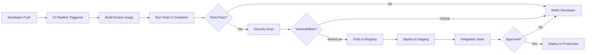
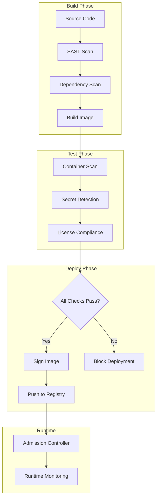

# How to Configure Docker for CI/CD

Author: [nawazdhandala](https://www.github.com/nawazdhandala)

Tags: Docker, CI/CD, DevOps, Containers, GitHub Actions, GitLab CI, Jenkins, Automation

Description: Learn how to configure Docker for CI/CD pipelines across multiple platforms. Covers image building, caching strategies, registry management, security scanning, and production deployment patterns.

---

Docker transforms CI/CD pipelines by providing consistent, reproducible environments from development to production. Building containerized applications through automated pipelines eliminates the classic "works on my machine" problem and accelerates deployment cycles.

## Docker CI/CD Architecture Overview

The following diagram illustrates a typical Docker-based CI/CD workflow.



## 1. Dockerfile Optimization for CI/CD

A well-structured Dockerfile directly impacts build times and pipeline efficiency. Multi-stage builds separate build dependencies from runtime, producing smaller, more secure images.

The following Dockerfile demonstrates a multi-stage build for a Node.js application, separating build-time dependencies from the final runtime image.

```dockerfile
# Stage 1: Build stage with all development dependencies
# Using a specific version tag ensures reproducible builds across CI runs
FROM node:20-alpine AS builder

# Set working directory for all subsequent commands
WORKDIR /app

# Copy package files first to leverage Docker layer caching
# Changes to source code won't invalidate the npm install layer
COPY package*.json ./

# Install all dependencies including devDependencies needed for build
RUN npm ci --include=dev

# Copy source code after dependencies are installed
COPY . .

# Build the application (TypeScript compilation, bundling, etc.)
RUN npm run build

# Stage 2: Production stage with minimal footprint
FROM node:20-alpine AS production

# Create non-root user for security
# Running as root inside containers is a security anti-pattern
RUN addgroup -g 1001 -S nodejs && \
    adduser -S nodejs -u 1001

WORKDIR /app

# Copy only package files needed for production install
COPY package*.json ./

# Install only production dependencies, skip dev dependencies
RUN npm ci --only=production && \
    npm cache clean --force

# Copy built artifacts from builder stage
COPY --from=builder /app/dist ./dist

# Switch to non-root user before running the application
USER nodejs

# Expose the application port
EXPOSE 3000

# Define health check for container orchestration
HEALTHCHECK --interval=30s --timeout=3s --start-period=5s --retries=3 \
    CMD wget --no-verbose --tries=1 --spider http://localhost:3000/health || exit 1

# Start the application
CMD ["node", "dist/index.js"]
```

## 2. GitHub Actions Docker Pipeline

GitHub Actions provides native Docker support with excellent caching capabilities. The following workflow builds, tests, scans, and pushes Docker images on every commit.

Each step in the workflow is designed to fail fast, caching is configured for optimal reuse, and security scanning gates the pipeline before any push to the registry.

```yaml
name: Docker CI/CD Pipeline

on:
  push:
    branches: [main, develop]
  pull_request:
    branches: [main]

env:
  REGISTRY: ghcr.io
  IMAGE_NAME: ${{ github.repository }}

jobs:
  build-and-test:
    runs-on: ubuntu-latest
    permissions:
      contents: read
      packages: write
      security-events: write

    steps:
      # Checkout repository code
      - name: Checkout repository
        uses: actions/checkout@v4

      # Set up Docker Buildx for advanced build features
      # Buildx enables BuildKit, multi-platform builds, and cache exports
      - name: Set up Docker Buildx
        uses: docker/setup-buildx-action@v3

      # Authenticate to GitHub Container Registry
      # Uses the built-in GITHUB_TOKEN for secure authentication
      - name: Log in to Container Registry
        if: github.event_name != 'pull_request'
        uses: docker/login-action@v3
        with:
          registry: ${{ env.REGISTRY }}
          username: ${{ github.actor }}
          password: ${{ secrets.GITHUB_TOKEN }}

      # Extract metadata for Docker image tags and labels
      # Generates semantic version tags based on git refs
      - name: Extract Docker metadata
        id: meta
        uses: docker/metadata-action@v5
        with:
          images: ${{ env.REGISTRY }}/${{ env.IMAGE_NAME }}
          tags: |
            type=ref,event=branch
            type=ref,event=pr
            type=sha,prefix=
            type=raw,value=latest,enable=${{ github.ref == 'refs/heads/main' }}

      # Build Docker image with layer caching
      # Cache is stored in GitHub Actions cache for reuse across runs
      - name: Build Docker image
        uses: docker/build-push-action@v5
        with:
          context: .
          file: ./Dockerfile
          push: false
          load: true
          tags: ${{ steps.meta.outputs.tags }}
          labels: ${{ steps.meta.outputs.labels }}
          cache-from: type=gha
          cache-to: type=gha,mode=max

      # Run unit tests inside the built container
      # Tests execute in the same environment as production
      - name: Run tests
        run: |
          docker run --rm ${{ env.REGISTRY }}/${{ env.IMAGE_NAME }}:${{ github.sha }} \
            npm test

      # Scan for vulnerabilities using Trivy
      # Blocks pipeline on critical or high severity CVEs
      - name: Run security scan
        uses: aquasecurity/trivy-action@master
        with:
          image-ref: ${{ env.REGISTRY }}/${{ env.IMAGE_NAME }}:${{ github.sha }}
          format: sarif
          output: trivy-results.sarif
          severity: CRITICAL,HIGH

      # Upload scan results to GitHub Security tab
      - name: Upload scan results
        uses: github/codeql-action/upload-sarif@v3
        with:
          sarif_file: trivy-results.sarif

      # Push image only on main branch after all checks pass
      - name: Push Docker image
        if: github.ref == 'refs/heads/main' && github.event_name != 'pull_request'
        uses: docker/build-push-action@v5
        with:
          context: .
          push: true
          tags: ${{ steps.meta.outputs.tags }}
          labels: ${{ steps.meta.outputs.labels }}
          cache-from: type=gha
```

## 3. GitLab CI Docker Pipeline

GitLab CI uses Docker-in-Docker or Kaniko for building images. The following configuration demonstrates a complete pipeline with stages for building, testing, and deploying.

Kaniko builds images without requiring privileged mode, making it safer for shared runners and compliant environments.

```yaml
# Define pipeline stages that run sequentially
stages:
  - build
  - test
  - security
  - deploy

# Global variables available to all jobs
variables:
  DOCKER_IMAGE: $CI_REGISTRY_IMAGE:$CI_COMMIT_SHA
  DOCKER_IMAGE_LATEST: $CI_REGISTRY_IMAGE:latest

# Build job uses Kaniko for unprivileged image building
build:
  stage: build
  image:
    name: gcr.io/kaniko-project/executor:v1.19.0-debug
    entrypoint: [""]
  script:
    # Create Docker config for registry authentication
    - mkdir -p /kaniko/.docker
    - echo "{\"auths\":{\"${CI_REGISTRY}\":{\"auth\":\"$(printf "%s:%s" "${CI_REGISTRY_USER}" "${CI_REGISTRY_PASSWORD}" | base64 | tr -d '\n')\"}}}" > /kaniko/.docker/config.json
    # Build and push image using Kaniko
    # Kaniko builds from Dockerfile without Docker daemon
    - /kaniko/executor
      --context "${CI_PROJECT_DIR}"
      --dockerfile "${CI_PROJECT_DIR}/Dockerfile"
      --destination "${DOCKER_IMAGE}"
      --destination "${DOCKER_IMAGE_LATEST}"
      --cache=true
      --cache-ttl=24h
  rules:
    - if: $CI_COMMIT_BRANCH == "main"
    - if: $CI_PIPELINE_SOURCE == "merge_request_event"

# Run tests inside the built container
test:
  stage: test
  image: docker:24
  services:
    - docker:24-dind
  variables:
    DOCKER_TLS_CERTDIR: "/certs"
  before_script:
    # Authenticate to GitLab Container Registry
    - docker login -u $CI_REGISTRY_USER -p $CI_REGISTRY_PASSWORD $CI_REGISTRY
  script:
    # Pull the image built in previous stage
    - docker pull $DOCKER_IMAGE
    # Execute test suite inside container
    - docker run --rm $DOCKER_IMAGE npm test
  needs:
    - build

# Security scanning with Trivy
security_scan:
  stage: security
  image:
    name: aquasec/trivy:latest
    entrypoint: [""]
  script:
    # Scan image for vulnerabilities
    # Exit code 1 if critical vulnerabilities found
    - trivy image
      --exit-code 1
      --severity CRITICAL,HIGH
      --no-progress
      $DOCKER_IMAGE
  needs:
    - build
  allow_failure: false

# Deploy to staging environment
deploy_staging:
  stage: deploy
  image: bitnami/kubectl:latest
  script:
    # Update Kubernetes deployment with new image
    - kubectl set image deployment/app app=$DOCKER_IMAGE -n staging
    - kubectl rollout status deployment/app -n staging --timeout=300s
  environment:
    name: staging
    url: https://staging.example.com
  needs:
    - test
    - security_scan
  rules:
    - if: $CI_COMMIT_BRANCH == "main"

# Deploy to production with manual approval
deploy_production:
  stage: deploy
  image: bitnami/kubectl:latest
  script:
    - kubectl set image deployment/app app=$DOCKER_IMAGE -n production
    - kubectl rollout status deployment/app -n production --timeout=300s
  environment:
    name: production
    url: https://app.example.com
  needs:
    - deploy_staging
  rules:
    - if: $CI_COMMIT_BRANCH == "main"
      when: manual
```

## 4. Jenkins Docker Pipeline

Jenkins pipelines integrate Docker through the Docker Pipeline plugin. The following Jenkinsfile demonstrates building, testing, and deploying containerized applications.

Each stage uses Docker agents where appropriate, ensuring consistent build environments and parallel execution capabilities.

```groovy
pipeline {
    // Use any available agent for orchestration
    agent any

    // Environment variables for the entire pipeline
    environment {
        REGISTRY = 'registry.example.com'
        IMAGE_NAME = 'myapp'
        DOCKER_CREDENTIALS = credentials('docker-registry-creds')
    }

    // Pipeline options for timeouts and build retention
    options {
        timeout(time: 30, unit: 'MINUTES')
        buildDiscarder(logRotator(numToKeepStr: '10'))
        disableConcurrentBuilds()
    }

    stages {
        // Build Docker image with unique tag
        stage('Build') {
            steps {
                script {
                    // Generate unique image tag from build metadata
                    def imageTag = "${env.REGISTRY}/${env.IMAGE_NAME}:${env.BUILD_NUMBER}"

                    // Build image using Docker BuildKit for improved performance
                    sh """
                        DOCKER_BUILDKIT=1 docker build \
                            --build-arg BUILDKIT_INLINE_CACHE=1 \
                            --cache-from ${env.REGISTRY}/${env.IMAGE_NAME}:latest \
                            -t ${imageTag} \
                            -t ${env.REGISTRY}/${env.IMAGE_NAME}:latest \
                            .
                    """

                    // Store image tag for later stages
                    env.IMAGE_TAG = imageTag
                }
            }
        }

        // Run automated tests inside container
        stage('Test') {
            steps {
                script {
                    // Execute test suite in isolated container
                    // Remove container after tests complete
                    sh """
                        docker run --rm \
                            --name test-${env.BUILD_NUMBER} \
                            ${env.IMAGE_TAG} \
                            npm test
                    """
                }
            }
        }

        // Scan image for security vulnerabilities
        stage('Security Scan') {
            steps {
                script {
                    // Run Trivy scanner against built image
                    // Pipeline fails if critical vulnerabilities detected
                    sh """
                        docker run --rm \
                            -v /var/run/docker.sock:/var/run/docker.sock \
                            aquasec/trivy:latest image \
                            --exit-code 1 \
                            --severity CRITICAL,HIGH \
                            ${env.IMAGE_TAG}
                    """
                }
            }
        }

        // Push image to registry after all checks pass
        stage('Push') {
            when {
                branch 'main'
            }
            steps {
                script {
                    // Authenticate to Docker registry
                    sh """
                        echo ${DOCKER_CREDENTIALS_PSW} | docker login \
                            -u ${DOCKER_CREDENTIALS_USR} \
                            --password-stdin ${env.REGISTRY}
                    """

                    // Push both versioned and latest tags
                    sh """
                        docker push ${env.IMAGE_TAG}
                        docker push ${env.REGISTRY}/${env.IMAGE_NAME}:latest
                    """
                }
            }
        }

        // Deploy to Kubernetes cluster
        stage('Deploy') {
            when {
                branch 'main'
            }
            steps {
                script {
                    // Update deployment with new image
                    sh """
                        kubectl set image deployment/myapp \
                            myapp=${env.IMAGE_TAG} \
                            --namespace=production

                        kubectl rollout status deployment/myapp \
                            --namespace=production \
                            --timeout=300s
                    """
                }
            }
        }
    }

    // Post-build actions for cleanup and notifications
    post {
        always {
            // Clean up Docker resources to prevent disk exhaustion
            sh 'docker system prune -f'
        }
        failure {
            // Notify team of build failures
            slackSend(
                channel: '#deployments',
                color: 'danger',
                message: "Build failed: ${env.JOB_NAME} #${env.BUILD_NUMBER}"
            )
        }
        success {
            slackSend(
                channel: '#deployments',
                color: 'good',
                message: "Build succeeded: ${env.JOB_NAME} #${env.BUILD_NUMBER}"
            )
        }
    }
}
```

## 5. Docker Layer Caching Strategies

Effective caching dramatically reduces build times. The following diagram shows how Docker layer caching works in CI/CD pipelines.

```mermaid
flowchart TD
    A[Dockerfile Instructions] --> B{Layer Changed?}
    B -->|No| C[Use Cached Layer]
    B -->|Yes| D[Rebuild Layer]
    D --> E[Invalidate All Subsequent Layers]
    C --> F[Continue to Next Layer]
    E --> F
    F --> G{More Layers?}
    G -->|Yes| A
    G -->|No| H[Final Image]

    subgraph Cache Storage
        I[Registry Cache]
        J[Local Build Cache]
        K[CI Cache Service]
    end

    C -.-> Cache Storage
    D -.-> Cache Storage
```

Optimizing Dockerfile instruction order maximizes cache reuse. Dependencies change less frequently than application code, so copying dependency manifests before source files keeps the expensive installation step cached.

The following script demonstrates a cache-aware build approach that pulls previous images to seed the build cache.

```bash
#!/bin/bash
# cache-aware-build.sh
# Builds Docker images with intelligent cache seeding from registry

set -euo pipefail

# Configuration variables
REGISTRY="${REGISTRY:-ghcr.io}"
IMAGE_NAME="${IMAGE_NAME:-myorg/myapp}"
BRANCH="${GITHUB_REF_NAME:-main}"
SHA="${GITHUB_SHA:-$(git rev-parse HEAD)}"

# Normalize branch name for use as Docker tag
# Replace slashes with dashes for feature branches
BRANCH_TAG=$(echo "$BRANCH" | sed 's/\//-/g')

echo "Building image with cache from registry..."

# Attempt to pull existing images for cache seeding
# Failures are acceptable - builds will just take longer
docker pull "${REGISTRY}/${IMAGE_NAME}:${BRANCH_TAG}" 2>/dev/null || true
docker pull "${REGISTRY}/${IMAGE_NAME}:main" 2>/dev/null || true

# Build with multiple cache sources
# BuildKit tries each source in order until a cache hit
DOCKER_BUILDKIT=1 docker build \
    --cache-from "${REGISTRY}/${IMAGE_NAME}:${BRANCH_TAG}" \
    --cache-from "${REGISTRY}/${IMAGE_NAME}:main" \
    --build-arg BUILDKIT_INLINE_CACHE=1 \
    --tag "${REGISTRY}/${IMAGE_NAME}:${SHA}" \
    --tag "${REGISTRY}/${IMAGE_NAME}:${BRANCH_TAG}" \
    .

echo "Build complete: ${REGISTRY}/${IMAGE_NAME}:${SHA}"
```

## 6. Multi-Architecture Builds

Modern deployments often require images for multiple architectures. ARM-based cloud instances and Apple Silicon development machines need native images for optimal performance.

The following workflow demonstrates building multi-architecture images using Docker Buildx and QEMU emulation.

```yaml
name: Multi-Arch Build

on:
  push:
    tags:
      - 'v*'

jobs:
  build-multiarch:
    runs-on: ubuntu-latest
    steps:
      - name: Checkout
        uses: actions/checkout@v4

      # QEMU enables building for architectures different from the runner
      # Supports ARM64, ARMv7, and other platforms
      - name: Set up QEMU
        uses: docker/setup-qemu-action@v3

      # Buildx with QEMU can target multiple platforms in single build
      - name: Set up Docker Buildx
        uses: docker/setup-buildx-action@v3

      - name: Login to Registry
        uses: docker/login-action@v3
        with:
          registry: ghcr.io
          username: ${{ github.actor }}
          password: ${{ secrets.GITHUB_TOKEN }}

      # Build and push images for AMD64 and ARM64 simultaneously
      # Docker creates a manifest list pointing to architecture-specific images
      - name: Build and push multi-arch
        uses: docker/build-push-action@v5
        with:
          context: .
          platforms: linux/amd64,linux/arm64
          push: true
          tags: |
            ghcr.io/${{ github.repository }}:${{ github.ref_name }}
            ghcr.io/${{ github.repository }}:latest
          cache-from: type=gha
          cache-to: type=gha,mode=max
```

## 7. Container Registry Management

Managing images across registries requires consistent tagging strategies and lifecycle policies. The following script demonstrates registry operations for CI/CD pipelines.

```bash
#!/bin/bash
# registry-management.sh
# Manages Docker images across multiple registries

set -euo pipefail

# Source and destination registries
SOURCE_REGISTRY="ghcr.io"
DEST_REGISTRIES=("docker.io" "gcr.io/myproject" "123456789.dkr.ecr.us-east-1.amazonaws.com")

IMAGE_NAME="myorg/myapp"
TAG="${1:-latest}"

# Authenticate to all registries
echo "Authenticating to registries..."

# GitHub Container Registry
echo "$GHCR_TOKEN" | docker login ghcr.io -u "$GITHUB_USER" --password-stdin

# Docker Hub
echo "$DOCKERHUB_TOKEN" | docker login docker.io -u "$DOCKERHUB_USER" --password-stdin

# Google Container Registry
gcloud auth configure-docker gcr.io --quiet

# Amazon ECR
aws ecr get-login-password --region us-east-1 | \
    docker login --username AWS --password-stdin 123456789.dkr.ecr.us-east-1.amazonaws.com

# Pull source image
echo "Pulling source image..."
docker pull "${SOURCE_REGISTRY}/${IMAGE_NAME}:${TAG}"

# Tag and push to each destination registry
for registry in "${DEST_REGISTRIES[@]}"; do
    echo "Pushing to ${registry}..."
    docker tag "${SOURCE_REGISTRY}/${IMAGE_NAME}:${TAG}" "${registry}/${IMAGE_NAME}:${TAG}"
    docker push "${registry}/${IMAGE_NAME}:${TAG}"
done

echo "Image replicated to all registries"
```

## 8. Docker Compose for Integration Testing

Integration testing in CI/CD requires spinning up dependent services. Docker Compose orchestrates multi-container test environments consistently.

The following compose file defines a test environment with application, database, and cache services.

```yaml
# docker-compose.ci.yaml
# Test environment for CI/CD pipeline integration testing

services:
  # Application under test
  app:
    build:
      context: .
      dockerfile: Dockerfile
      target: production
    environment:
      - NODE_ENV=test
      - DATABASE_URL=postgres://test:test@db:5432/testdb
      - REDIS_URL=redis://cache:6379
    depends_on:
      db:
        condition: service_healthy
      cache:
        condition: service_started
    healthcheck:
      test: ["CMD", "wget", "-q", "--spider", "http://localhost:3000/health"]
      interval: 5s
      timeout: 3s
      retries: 5
      start_period: 10s

  # PostgreSQL database for testing
  db:
    image: postgres:16-alpine
    environment:
      POSTGRES_USER: test
      POSTGRES_PASSWORD: test
      POSTGRES_DB: testdb
    healthcheck:
      test: ["CMD-SHELL", "pg_isready -U test -d testdb"]
      interval: 5s
      timeout: 3s
      retries: 5
    # Use tmpfs for faster test database operations
    tmpfs:
      - /var/lib/postgresql/data

  # Redis cache for testing
  cache:
    image: redis:7-alpine
    healthcheck:
      test: ["CMD", "redis-cli", "ping"]
      interval: 5s
      timeout: 3s
      retries: 5

  # Test runner service
  test-runner:
    build:
      context: .
      dockerfile: Dockerfile
      target: builder
    command: npm run test:integration
    environment:
      - DATABASE_URL=postgres://test:test@db:5432/testdb
      - REDIS_URL=redis://cache:6379
      - APP_URL=http://app:3000
    depends_on:
      app:
        condition: service_healthy
```

The following script runs integration tests using the compose environment.

```bash
#!/bin/bash
# run-integration-tests.sh
# Executes integration tests in Docker Compose environment

set -euo pipefail

COMPOSE_FILE="docker-compose.ci.yaml"
PROJECT_NAME="ci-test-${CI_JOB_ID:-local}"

# Cleanup function runs on exit regardless of test outcome
cleanup() {
    echo "Cleaning up test environment..."
    docker compose -p "$PROJECT_NAME" -f "$COMPOSE_FILE" down -v --remove-orphans
}

# Register cleanup function to run on script exit
trap cleanup EXIT

echo "Starting test environment..."
docker compose -p "$PROJECT_NAME" -f "$COMPOSE_FILE" up -d --build

echo "Waiting for services to be healthy..."
docker compose -p "$PROJECT_NAME" -f "$COMPOSE_FILE" up -d --wait --wait-timeout 120

echo "Running integration tests..."
docker compose -p "$PROJECT_NAME" -f "$COMPOSE_FILE" run --rm test-runner

echo "Tests completed successfully"
```

## 9. Security Scanning Pipeline

Security scanning must be integrated at multiple points in the CI/CD pipeline. The following diagram shows a comprehensive security scanning strategy.



The following workflow integrates multiple security scanning tools.

```yaml
name: Security Pipeline

on:
  push:
    branches: [main]
  pull_request:
    branches: [main]

jobs:
  security-scan:
    runs-on: ubuntu-latest
    steps:
      - uses: actions/checkout@v4

      # Scan source code for security issues
      - name: SAST Scan with Semgrep
        uses: returntocorp/semgrep-action@v1
        with:
          config: p/security-audit

      # Check dependencies for known vulnerabilities
      - name: Dependency Scan
        run: |
          npm audit --audit-level=high
          npx better-npm-audit audit

      # Build the Docker image
      - name: Build Image
        run: docker build -t app:scan .

      # Scan container image for vulnerabilities
      - name: Container Vulnerability Scan
        uses: aquasecurity/trivy-action@master
        with:
          image-ref: app:scan
          format: table
          exit-code: 1
          severity: CRITICAL,HIGH
          vuln-type: os,library

      # Scan for hardcoded secrets
      - name: Secret Detection
        uses: trufflesecurity/trufflehog@main
        with:
          path: ./
          base: ${{ github.event.repository.default_branch }}
          head: HEAD

      # Check Dockerfile best practices
      - name: Dockerfile Linting
        uses: hadolint/hadolint-action@v3.1.0
        with:
          dockerfile: Dockerfile
          failure-threshold: warning

      # Generate SBOM for supply chain security
      - name: Generate SBOM
        uses: anchore/sbom-action@v0
        with:
          image: app:scan
          format: spdx-json
          output-file: sbom.spdx.json

      # Upload SBOM as artifact
      - name: Upload SBOM
        uses: actions/upload-artifact@v4
        with:
          name: sbom
          path: sbom.spdx.json
```

## 10. Production Deployment Patterns

Deploying containers to production requires careful orchestration. The following script demonstrates a blue-green deployment pattern using Docker.

```bash
#!/bin/bash
# blue-green-deploy.sh
# Implements blue-green deployment for Docker containers

set -euo pipefail

IMAGE="${1:?Image tag required}"
APP_NAME="myapp"
HEALTH_ENDPOINT="http://localhost:3000/health"

# Determine current and target environments
CURRENT=$(docker ps --filter "name=${APP_NAME}" --format "{{.Names}}" | grep -oE "(blue|green)" | head -1)
TARGET=$([[ "$CURRENT" == "blue" ]] && echo "green" || echo "blue")

echo "Current environment: ${CURRENT:-none}"
echo "Deploying to: ${TARGET}"

# Start new container in target environment
echo "Starting ${TARGET} container..."
docker run -d \
    --name "${APP_NAME}-${TARGET}" \
    --network app-network \
    --restart unless-stopped \
    -e NODE_ENV=production \
    -p "300$([[ "$TARGET" == "blue" ]] && echo 1 || echo 2):3000" \
    "$IMAGE"

# Wait for health check to pass
echo "Waiting for ${TARGET} to become healthy..."
RETRIES=30
until docker exec "${APP_NAME}-${TARGET}" wget -q --spider "$HEALTH_ENDPOINT" 2>/dev/null; do
    RETRIES=$((RETRIES - 1))
    if [[ $RETRIES -eq 0 ]]; then
        echo "Health check failed, rolling back..."
        docker stop "${APP_NAME}-${TARGET}" && docker rm "${APP_NAME}-${TARGET}"
        exit 1
    fi
    sleep 2
done

echo "${TARGET} is healthy"

# Update load balancer to point to new container
echo "Switching traffic to ${TARGET}..."
# Update nginx upstream or load balancer configuration
docker exec nginx nginx -s reload

# Stop old container if exists
if [[ -n "$CURRENT" ]]; then
    echo "Stopping ${CURRENT} container..."
    # Graceful shutdown with drain period
    sleep 10
    docker stop "${APP_NAME}-${CURRENT}"
    docker rm "${APP_NAME}-${CURRENT}"
fi

echo "Deployment complete: ${IMAGE} running as ${TARGET}"
```

## Best Practices Summary

Following these practices ensures robust Docker CI/CD pipelines:

1. **Use multi-stage builds** to minimize image size and attack surface
2. **Implement layer caching** with proper instruction ordering
3. **Run security scans** before pushing images to any registry
4. **Sign images** using Docker Content Trust or Sigstore
5. **Use specific tags** instead of `latest` in production deployments
6. **Implement health checks** for reliable container orchestration
7. **Clean up resources** to prevent disk exhaustion on CI runners
8. **Test in containers** to ensure consistency with production
9. **Generate SBOMs** for supply chain transparency
10. **Monitor deployments** with rollback capabilities

---

Docker-based CI/CD pipelines provide consistency, reproducibility, and security from development to production. Proper configuration of caching, security scanning, and deployment strategies transforms container workflows into reliable delivery mechanisms for modern applications.
