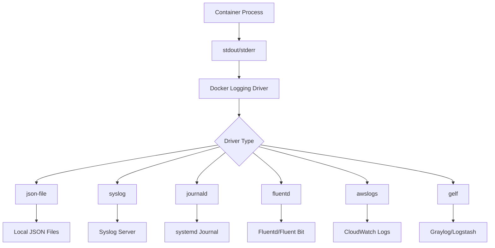
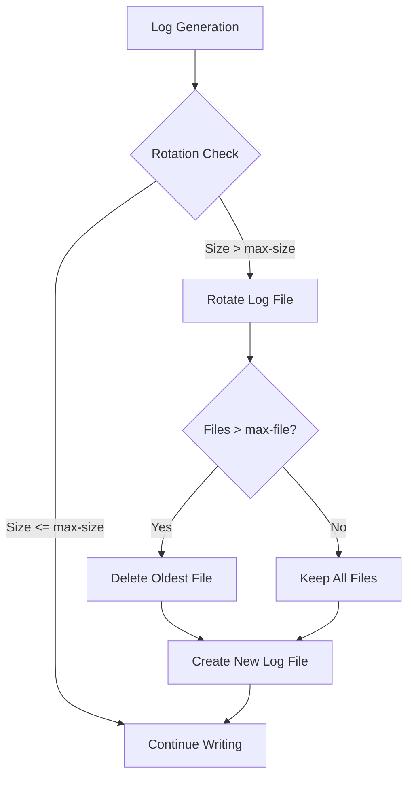
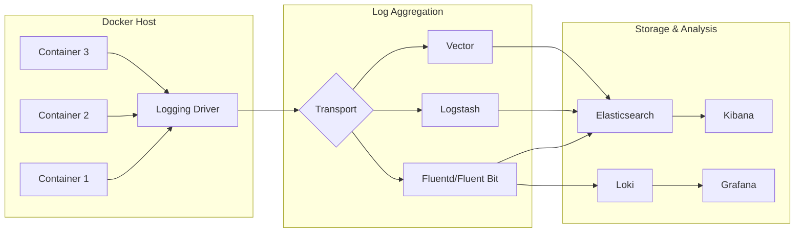
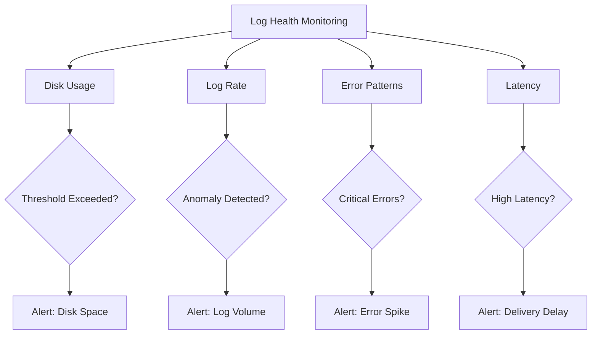
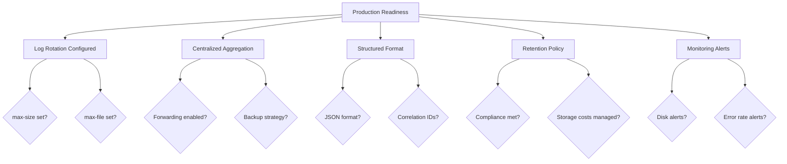

# How to Handle Docker Container Logs

Author: [nawazdhandala](https://www.github.com/nawazdhandala)

Tags: Docker, Logging, Containers, DevOps, Monitoring, Observability

Description: Learn how to configure and manage Docker container logs using various logging drivers and best practices.

Docker containers generate logs that are essential for debugging, monitoring, and understanding application behavior. Managing these logs effectively is crucial for maintaining healthy containerized applications in development and production environments.

## Understanding Docker Logging Architecture

Docker captures stdout and stderr streams from containers and stores them using logging drivers. The default json-file driver writes logs to JSON files on the host filesystem, but several other drivers are available for different use cases.



## Viewing Container Logs

The `docker logs` command is the primary way to access container logs. Here are several practical ways to use it.

The following command shows basic log output from a container:

```bash
# View all logs from a container
docker logs my-container

# View logs with timestamps
docker logs --timestamps my-container

# Follow log output in real-time (similar to tail -f)
docker logs -f my-container

# Show only the last 100 lines
docker logs --tail 100 my-container

# Show logs since a specific time
docker logs --since 2026-02-01T10:00:00 my-container

# Show logs from the last 30 minutes
docker logs --since 30m my-container

# Combine options: follow logs with timestamps, starting from the last 50 lines
docker logs -f --timestamps --tail 50 my-container
```

## Configuring Logging Drivers

Docker supports multiple logging drivers that determine how logs are stored and forwarded. You can configure the default driver daemon-wide or per-container.

```mermaid
flowchart LR
    subgraph "Configuration Levels"
        A[Daemon Level] --> B[/etc/docker/daemon.json]
        C[Container Level] --> D[docker run --log-driver]
        E[Compose Level] --> F[logging: in docker-compose.yml]
    end

    subgraph "Priority"
        G[Container config] --> H[Overrides]
        H --> I[Daemon config]
    end
```

### Setting the Default Logging Driver

Edit the Docker daemon configuration to set a default logging driver for all containers:

```json
{
  "log-driver": "json-file",
  "log-opts": {
    "max-size": "10m",
    "max-file": "3",
    "labels": "production_status",
    "env": "os,customer"
  }
}
```

After modifying `/etc/docker/daemon.json`, restart the Docker daemon:

```bash
# Restart Docker to apply changes
sudo systemctl restart docker
```

### Configuring Per-Container Logging

Override the default logging driver for specific containers using the --log-driver flag:

```bash
# Use the json-file driver with custom options
docker run -d \
  --name web-app \
  --log-driver json-file \
  --log-opt max-size=50m \
  --log-opt max-file=5 \
  nginx:latest

# Use syslog driver to send logs to a syslog server
docker run -d \
  --name api-service \
  --log-driver syslog \
  --log-opt syslog-address=udp://logserver:514 \
  --log-opt tag="api-service" \
  my-api:latest

# Disable logging entirely for a container
docker run -d \
  --name temp-worker \
  --log-driver none \
  worker:latest
```

### Docker Compose Logging Configuration

Define logging settings in your docker-compose.yml file:

```yaml
# docker-compose.yml with comprehensive logging configuration
version: '3.8'

services:
  web:
    image: nginx:latest
    logging:
      driver: json-file
      options:
        max-size: "10m"
        max-file: "3"
        labels: "service,environment"

  api:
    image: my-api:latest
    logging:
      driver: fluentd
      options:
        fluentd-address: localhost:24224
        tag: "docker.{{.Name}}"
        fluentd-async: "true"

  database:
    image: postgres:15
    logging:
      driver: syslog
      options:
        syslog-address: "tcp://logserver:514"
        syslog-facility: "daemon"
        tag: "postgres"
```

## Log Rotation Strategies

Without proper rotation, container logs can consume all available disk space. Implementing log rotation is essential for production environments.



### JSON File Driver Rotation

Configure rotation for the default json-file driver:

```bash
# Run a container with log rotation settings
docker run -d \
  --name production-app \
  --log-driver json-file \
  --log-opt max-size=100m \
  --log-opt max-file=5 \
  --log-opt compress=true \
  my-app:latest
```

The configuration above limits each log file to 100MB, keeps up to 5 rotated files, and compresses rotated files.

### Daemon-Level Rotation Settings

Set rotation defaults for all containers in daemon.json:

```json
{
  "log-driver": "json-file",
  "log-opts": {
    "max-size": "50m",
    "max-file": "3",
    "compress": "true"
  }
}
```

## Structured Logging Best Practices

Structured logs in JSON format make parsing and analysis significantly easier. Configure your applications to output structured logs.

The following Python example demonstrates structured JSON logging:

```python
# app.py - Structured logging configuration for Docker containers
import logging
import json
import sys
from datetime import datetime

class JSONFormatter(logging.Formatter):
    """
    Custom formatter that outputs log records as JSON objects.
    Each log entry includes timestamp, level, message, and additional context.
    """
    def format(self, record):
        log_entry = {
            "timestamp": datetime.utcnow().isoformat() + "Z",
            "level": record.levelname,
            "logger": record.name,
            "message": record.getMessage(),
            "module": record.module,
            "function": record.funcName,
            "line": record.lineno
        }

        # Include exception info if present
        if record.exc_info:
            log_entry["exception"] = self.formatException(record.exc_info)

        # Include any extra fields passed to the logger
        if hasattr(record, "extra_fields"):
            log_entry.update(record.extra_fields)

        return json.dumps(log_entry)

def setup_logging():
    """
    Configure the root logger to output JSON to stdout.
    Docker captures stdout, making it accessible via docker logs.
    """
    handler = logging.StreamHandler(sys.stdout)
    handler.setFormatter(JSONFormatter())

    root_logger = logging.getLogger()
    root_logger.addHandler(handler)
    root_logger.setLevel(logging.INFO)

    return root_logger

# Usage example
logger = setup_logging()

# Standard log message
logger.info("Application started")

# Log with additional context using LoggerAdapter
class ContextAdapter(logging.LoggerAdapter):
    def process(self, msg, kwargs):
        extra = kwargs.get("extra", {})
        extra["extra_fields"] = self.extra
        kwargs["extra"] = extra
        return msg, kwargs

# Create adapter with request context
request_logger = ContextAdapter(logger, {
    "request_id": "abc-123",
    "user_id": "user-456"
})
request_logger.info("Processing request")
```

The output from the above code appears as JSON in Docker logs:

```json
{"timestamp": "2026-02-02T10:30:00.000Z", "level": "INFO", "logger": "root", "message": "Processing request", "module": "app", "function": "<module>", "line": 52, "request_id": "abc-123", "user_id": "user-456"}
```

## Forwarding Logs to External Systems

Production environments typically require centralized log aggregation. Docker supports several methods for forwarding logs to external systems.



### Fluentd Logging Driver

Configure containers to send logs directly to Fluentd:

```bash
# Start a Fluentd container first
docker run -d \
  --name fluentd \
  -p 24224:24224 \
  -p 24224:24224/udp \
  -v /path/to/fluent.conf:/fluentd/etc/fluent.conf \
  fluent/fluentd:latest

# Run application containers with fluentd driver
docker run -d \
  --name web-app \
  --log-driver fluentd \
  --log-opt fluentd-address=localhost:24224 \
  --log-opt tag="docker.web-app" \
  --log-opt fluentd-async="true" \
  --log-opt fluentd-buffer-limit="8MB" \
  nginx:latest
```

### AWS CloudWatch Logs Driver

Send container logs directly to AWS CloudWatch:

```bash
# Run a container with CloudWatch logging
docker run -d \
  --name production-api \
  --log-driver awslogs \
  --log-opt awslogs-region=us-east-1 \
  --log-opt awslogs-group=/ecs/my-application \
  --log-opt awslogs-stream=api-container \
  --log-opt awslogs-create-group=true \
  my-api:latest
```

Ensure the host has appropriate IAM credentials for CloudWatch access.

### Sidecar Pattern for Log Collection

Use a sidecar container to collect and forward logs without changing the application:

```yaml
# docker-compose.yml with sidecar log collector
version: '3.8'

services:
  # Main application writes logs to a shared volume
  application:
    image: my-app:latest
    volumes:
      - app-logs:/var/log/app
    command: >
      sh -c "while true; do
        echo '{\"timestamp\":\"'$(date -Iseconds)'\",\"message\":\"Application log entry\"}' >> /var/log/app/app.log;
        sleep 5;
      done"

  # Fluent Bit sidecar reads logs from the shared volume
  log-collector:
    image: fluent/fluent-bit:latest
    volumes:
      - app-logs:/var/log/app:ro
      - ./fluent-bit.conf:/fluent-bit/etc/fluent-bit.conf
    depends_on:
      - application

volumes:
  app-logs:
```

The corresponding Fluent Bit configuration file:

```ini
# fluent-bit.conf - Configuration for sidecar log collection
[SERVICE]
    Flush         5
    Daemon        Off
    Log_Level     info
    Parsers_File  parsers.conf

[INPUT]
    # Read logs from the shared volume
    Name              tail
    Path              /var/log/app/*.log
    Tag               app.logs
    Parser            json
    Refresh_Interval  5
    Mem_Buf_Limit     5MB
    Skip_Long_Lines   On

[FILTER]
    # Add hostname and container metadata
    Name          record_modifier
    Match         *
    Record        hostname ${HOSTNAME}
    Record        environment production

[OUTPUT]
    # Forward to Elasticsearch
    Name            es
    Match           *
    Host            elasticsearch
    Port            9200
    Index           docker-logs
    Type            _doc
    Logstash_Format On
    Retry_Limit     5
```

## Monitoring Log Health

Monitoring your logging infrastructure helps identify issues before they impact your ability to debug problems.



Create a script to monitor Docker log health:

```bash
#!/bin/bash
# monitor-docker-logs.sh - Monitor Docker container log sizes and health

# Set thresholds
MAX_LOG_SIZE_MB=500
WARNING_THRESHOLD_MB=400

# Get the Docker data root directory
DOCKER_ROOT=$(docker info --format '{{.DockerRootDir}}')
LOG_DIR="${DOCKER_ROOT}/containers"

echo "Docker Log Health Report"
echo "========================"
echo "Generated: $(date)"
echo ""

# Check each container's log size
for container_dir in ${LOG_DIR}/*/; do
    container_id=$(basename "$container_dir")
    short_id="${container_id:0:12}"

    # Get container name
    container_name=$(docker inspect --format '{{.Name}}' "$container_id" 2>/dev/null | sed 's/^\///')

    if [ -z "$container_name" ]; then
        continue
    fi

    # Find log files and calculate total size
    log_file="${container_dir}${container_id}-json.log"

    if [ -f "$log_file" ]; then
        log_size_bytes=$(stat -f%z "$log_file" 2>/dev/null || stat -c%s "$log_file" 2>/dev/null)
        log_size_mb=$((log_size_bytes / 1024 / 1024))

        # Determine status
        if [ "$log_size_mb" -gt "$MAX_LOG_SIZE_MB" ]; then
            status="CRITICAL"
        elif [ "$log_size_mb" -gt "$WARNING_THRESHOLD_MB" ]; then
            status="WARNING"
        else
            status="OK"
        fi

        printf "%-30s %8s MB  [%s]\n" "$container_name" "$log_size_mb" "$status"
    fi
done

echo ""
echo "Total Docker disk usage:"
docker system df
```

## Troubleshooting Common Log Issues

### Logs Not Appearing

When container logs are empty or missing, follow these troubleshooting steps:

```bash
# Verify the container is running and check its status
docker ps -a --filter name=my-container

# Check if the application is writing to stdout/stderr
docker inspect my-container --format '{{.Config.Tty}}'

# Inspect the logging driver configuration
docker inspect my-container --format '{{.HostConfig.LogConfig}}'

# Check if logs exist on the filesystem (for json-file driver)
sudo ls -la /var/lib/docker/containers/$(docker inspect --format '{{.Id}}' my-container)/

# Verify the container can write to stdout
docker exec my-container sh -c "echo 'test log' && echo 'test error' >&2"
docker logs --tail 5 my-container
```

### Recovering Logs from Stopped Containers

Container logs persist even after a container stops, unless the container is removed:

```bash
# View logs from a stopped container
docker logs stopped-container

# Copy logs before removing the container
docker logs stopped-container > /backup/container-logs.txt 2>&1

# Export container filesystem including any file-based logs
docker export stopped-container > container-backup.tar
```

### Dealing with Large Log Files

When logs consume excessive disk space, take immediate action:

```bash
# Check current log size for a container
docker inspect my-container --format '{{.LogPath}}' | xargs sudo ls -lh

# Truncate logs without stopping the container (use with caution)
docker inspect my-container --format '{{.LogPath}}' | xargs sudo truncate -s 0

# Better approach: update container with rotation settings
docker update --log-opt max-size=50m --log-opt max-file=3 my-container

# Recreate container with proper log limits
docker stop my-container
docker rm my-container
docker run -d \
  --name my-container \
  --log-opt max-size=50m \
  --log-opt max-file=3 \
  my-image:latest
```

## Multi-Container Log Aggregation

When running multiple containers, aggregate logs for unified viewing:

```bash
# View logs from multiple containers simultaneously using docker-compose
docker-compose logs -f

# Follow logs from specific services
docker-compose logs -f web api

# View combined logs with timestamps
docker-compose logs -f --timestamps

# Filter logs by time range
docker-compose logs --since 1h --until 30m
```

Create a log aggregation script for containers not managed by Compose:

```bash
#!/bin/bash
# aggregate-logs.sh - Aggregate logs from multiple containers

# Define containers to monitor
CONTAINERS=("web-app" "api-service" "worker" "database")

# Color codes for different containers
COLORS=("\033[0;31m" "\033[0;32m" "\033[0;33m" "\033[0;34m")
RESET="\033[0m"

# Function to prefix output with container name
prefix_output() {
    local container=$1
    local color=$2
    while IFS= read -r line; do
        echo -e "${color}[${container}]${RESET} ${line}"
    done
}

# Start tailing all containers
index=0
for container in "${CONTAINERS[@]}"; do
    color="${COLORS[$((index % ${#COLORS[@]}))]}"
    docker logs -f "$container" 2>&1 | prefix_output "$container" "$color" &
    ((index++))
done

# Wait for all background processes
wait
```

## Production Logging Checklist

Before deploying containers to production, verify your logging configuration meets these requirements:



Use the following checklist script to verify your logging setup:

```bash
#!/bin/bash
# check-logging-config.sh - Verify Docker logging configuration

echo "Docker Logging Configuration Checker"
echo "====================================="

# Check daemon configuration
echo ""
echo "1. Daemon Configuration:"
if [ -f /etc/docker/daemon.json ]; then
    echo "   Found /etc/docker/daemon.json"
    cat /etc/docker/daemon.json | python3 -m json.tool 2>/dev/null || cat /etc/docker/daemon.json
else
    echo "   WARNING: No daemon.json found - using defaults"
fi

# Check running containers
echo ""
echo "2. Container Log Configurations:"
for container in $(docker ps -q); do
    name=$(docker inspect --format '{{.Name}}' "$container" | sed 's/^\///')
    log_config=$(docker inspect --format '{{json .HostConfig.LogConfig}}' "$container")
    echo "   $name: $log_config"
done

# Check disk usage
echo ""
echo "3. Log Disk Usage:"
docker_root=$(docker info --format '{{.DockerRootDir}}')
if [ -d "$docker_root/containers" ]; then
    sudo du -sh "$docker_root/containers"/* 2>/dev/null | sort -hr | head -10
fi

# Verify log forwarding (if using fluentd)
echo ""
echo "4. Log Forwarding Status:"
if docker ps --format '{{.Names}}' | grep -q fluentd; then
    echo "   Fluentd container is running"
else
    echo "   No Fluentd container detected"
fi

echo ""
echo "Verification complete."
```

## Summary

Effective Docker container log management requires a combination of proper configuration, rotation policies, and centralized aggregation. Key takeaways include:

- Configure log rotation at the daemon level to prevent disk exhaustion
- Use structured JSON logging for easier parsing and analysis
- Forward logs to centralized systems for production environments
- Monitor log health as part of your overall observability strategy
- Choose the appropriate logging driver based on your infrastructure needs

Implementing these practices ensures your containerized applications remain observable and debuggable throughout their lifecycle.
