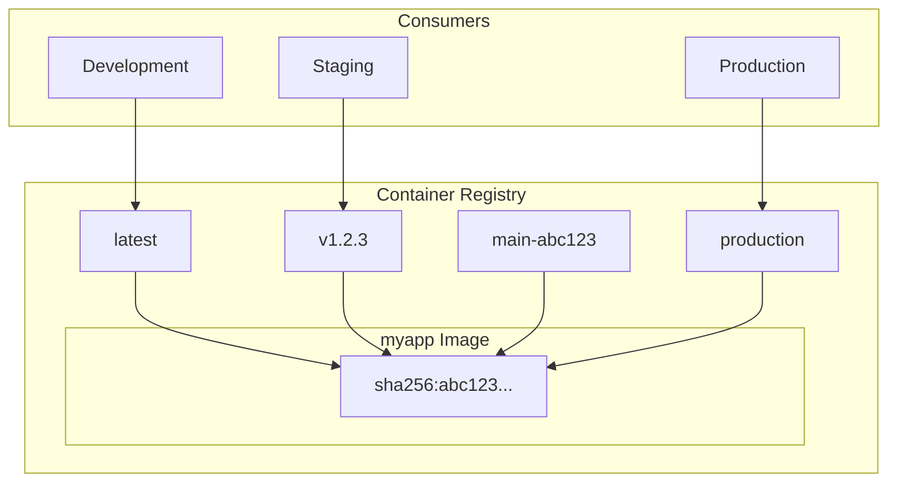
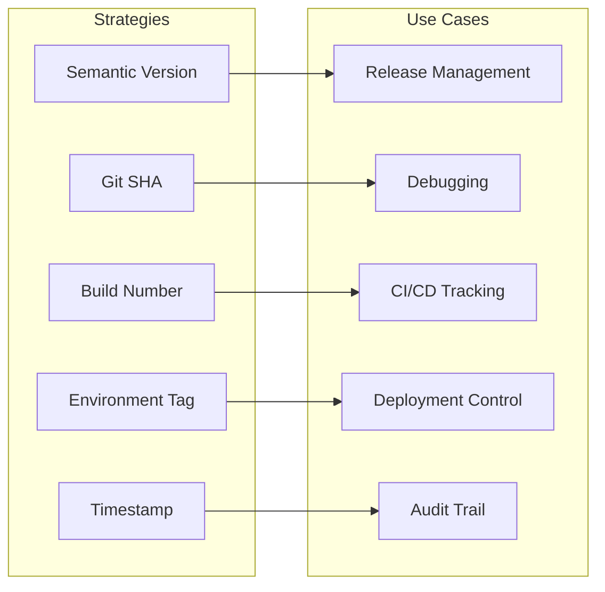
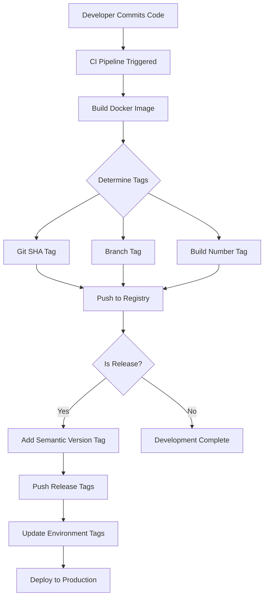
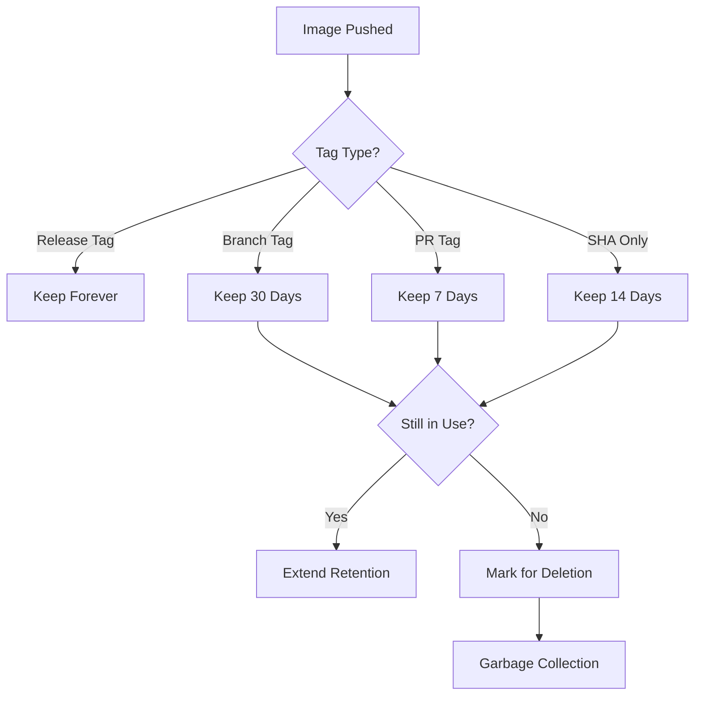

# How to Handle Docker Image Tagging

Author: [nawazdhandala](https://www.github.com/nawazdhandala)

Tags: Docker, Container Registry, DevOps, CI/CD, Versioning, Kubernetes, Deployment

Description: A comprehensive guide to Docker image tagging strategies, covering semantic versioning, Git-based tags, environment tags, and best practices for production deployments.

---

Docker image tagging is a critical aspect of container management that directly impacts deployment reliability, rollback capabilities, and team collaboration. A well-designed tagging strategy makes it easy to identify which version of your application is running and enables quick recovery when issues arise.

## Understanding Docker Image Tags

Docker image tags serve as human-readable identifiers for specific image versions. Each image can have multiple tags pointing to the same underlying image digest.



### Tag Anatomy

A fully qualified image reference consists of several components:

```
registry.example.com/namespace/repository:tag
```

The following command shows how to tag an image with multiple identifiers:

```bash
# Build and tag an image with multiple tags
# The -t flag specifies the tag for the built image
docker build -t myapp:latest \
             -t myapp:v1.2.3 \
             -t myapp:main-abc1234 \
             -t registry.example.com/team/myapp:v1.2.3 .
```

## Tagging Strategies

Different tagging strategies serve different purposes. Most production environments benefit from combining multiple approaches.



### Semantic Versioning

Semantic versioning (SemVer) follows the format MAJOR.MINOR.PATCH. Use semantic versions for release artifacts that need clear version identification.

```bash
# Tag images using semantic versioning
# v1.2.3 indicates version 1, minor release 2, patch 3
docker tag myapp:build-123 myapp:v1.2.3
docker tag myapp:build-123 myapp:v1.2
docker tag myapp:build-123 myapp:v1

# Push all version tags to registry
docker push myapp:v1.2.3
docker push myapp:v1.2
docker push myapp:v1
```

Rolling tags like `v1` and `v1.2` automatically point to the latest patch version, making updates seamless for consumers who want automatic minor updates.

### Git SHA-Based Tags

Git-based tags provide exact traceability from a running container back to source code. Include both the short SHA and branch name for context.

The following script demonstrates automatic tagging based on Git metadata:

```bash
#!/bin/bash
# build-and-tag.sh - Build Docker image with Git-based tags

# Extract Git information for tagging
GIT_SHA=$(git rev-parse --short HEAD)
GIT_BRANCH=$(git rev-parse --abbrev-ref HEAD | sed 's/\//-/g')
BUILD_DATE=$(date -u +%Y%m%d)

# Define image name and registry
IMAGE_NAME="myapp"
REGISTRY="registry.example.com/team"

# Build image with multiple tags for traceability
docker build \
    -t "${REGISTRY}/${IMAGE_NAME}:${GIT_BRANCH}-${GIT_SHA}" \
    -t "${REGISTRY}/${IMAGE_NAME}:${GIT_SHA}" \
    -t "${REGISTRY}/${IMAGE_NAME}:${GIT_BRANCH}-latest" \
    --build-arg GIT_SHA="${GIT_SHA}" \
    --build-arg BUILD_DATE="${BUILD_DATE}" \
    .

echo "Built image with tags:"
echo "  - ${GIT_BRANCH}-${GIT_SHA}"
echo "  - ${GIT_SHA}"
echo "  - ${GIT_BRANCH}-latest"
```

### Build Number Tags

CI/CD systems often use incrementing build numbers. Combine build numbers with other identifiers for comprehensive tagging.

```bash
# CI/CD build tagging example
# BUILD_NUMBER is typically provided by CI system (Jenkins, GitLab CI, etc.)
BUILD_NUMBER="${BUILD_NUMBER:-local}"
GIT_SHA=$(git rev-parse --short HEAD)

docker build \
    -t "myapp:build-${BUILD_NUMBER}" \
    -t "myapp:build-${BUILD_NUMBER}-${GIT_SHA}" \
    .
```

### Environment Tags

Environment-specific tags indicate which image is currently deployed to each environment. Use these tags to track deployments without modifying Kubernetes manifests.

```bash
# Promote image through environments by retagging
# Pull the specific version from staging
docker pull myapp:v1.2.3

# Retag for production deployment
docker tag myapp:v1.2.3 myapp:production
docker tag myapp:v1.2.3 myapp:production-v1.2.3

# Push production tags
docker push myapp:production
docker push myapp:production-v1.2.3
```

## Implementing a Comprehensive Tagging Strategy

Combine multiple tag types to address different needs in your deployment pipeline.



### Docker Build Arguments for Metadata

Embed build metadata directly in your images using build arguments and labels:

```dockerfile
# Dockerfile with build-time metadata
FROM node:20-alpine AS builder

# Build arguments for metadata injection
ARG GIT_SHA=unknown
ARG BUILD_DATE=unknown
ARG VERSION=dev

# Set labels for image inspection
LABEL org.opencontainers.image.revision="${GIT_SHA}" \
      org.opencontainers.image.created="${BUILD_DATE}" \
      org.opencontainers.image.version="${VERSION}" \
      org.opencontainers.image.source="https://github.com/example/myapp"

WORKDIR /app
COPY package*.json ./
RUN npm ci --only=production
COPY . .

# Embed version information in the application
RUN echo "{\"version\":\"${VERSION}\",\"gitSha\":\"${GIT_SHA}\",\"buildDate\":\"${BUILD_DATE}\"}" > version.json

FROM node:20-alpine
WORKDIR /app
COPY --from=builder /app .
CMD ["node", "server.js"]
```

### CI/CD Pipeline Example

The following GitHub Actions workflow demonstrates a complete tagging strategy:

```yaml
# .github/workflows/build.yml
name: Build and Push Docker Image

on:
  push:
    branches: [main, develop]
    tags: ['v*']
  pull_request:
    branches: [main]

env:
  REGISTRY: ghcr.io
  IMAGE_NAME: ${{ github.repository }}

jobs:
  build:
    runs-on: ubuntu-latest
    permissions:
      contents: read
      packages: write

    steps:
      - name: Checkout repository
        uses: actions/checkout@v4

      - name: Set up Docker Buildx
        uses: docker/setup-buildx-action@v3

      - name: Log in to Container Registry
        uses: docker/login-action@v3
        with:
          registry: ${{ env.REGISTRY }}
          username: ${{ github.actor }}
          password: ${{ secrets.GITHUB_TOKEN }}

      # Generate comprehensive tags based on Git context
      - name: Extract metadata for Docker
        id: meta
        uses: docker/metadata-action@v5
        with:
          images: ${{ env.REGISTRY }}/${{ env.IMAGE_NAME }}
          tags: |
            # Tag with branch name and short SHA
            type=ref,event=branch,suffix=-{{sha}}
            # Tag with branch name only (rolling tag)
            type=ref,event=branch
            # Tag with PR number
            type=ref,event=pr
            # Tag with semantic version for releases
            type=semver,pattern={{version}}
            type=semver,pattern={{major}}.{{minor}}
            type=semver,pattern={{major}}
            # Always include SHA for traceability
            type=sha,prefix=sha-

      - name: Build and push Docker image
        uses: docker/build-push-action@v5
        with:
          context: .
          push: ${{ github.event_name != 'pull_request' }}
          tags: ${{ steps.meta.outputs.tags }}
          labels: ${{ steps.meta.outputs.labels }}
          build-args: |
            GIT_SHA=${{ github.sha }}
            BUILD_DATE=${{ github.event.head_commit.timestamp }}
            VERSION=${{ steps.meta.outputs.version }}
          cache-from: type=gha
          cache-to: type=gha,mode=max
```

## Kubernetes Deployment Patterns

Integrate your tagging strategy with Kubernetes deployments for reliable releases and rollbacks.

### Using Specific Tags

Always use specific tags in production deployments rather than rolling tags like `latest`:

```yaml
# kubernetes/deployment.yaml
apiVersion: apps/v1
kind: Deployment
metadata:
  name: myapp
  labels:
    app: myapp
spec:
  replicas: 3
  selector:
    matchLabels:
      app: myapp
  template:
    metadata:
      labels:
        app: myapp
      # Annotations help track which version is deployed
      annotations:
        app.kubernetes.io/version: "v1.2.3"
        git.commit.sha: "abc1234"
    spec:
      containers:
        - name: myapp
          # Use specific version tag, not :latest
          image: registry.example.com/team/myapp:v1.2.3
          imagePullPolicy: IfNotPresent
          ports:
            - containerPort: 8080
```

### Image Tag Update Script

Automate image tag updates in your Kubernetes manifests:

```bash
#!/bin/bash
# update-deployment.sh - Update deployment with new image tag

set -euo pipefail

# Configuration
DEPLOYMENT_NAME="myapp"
CONTAINER_NAME="myapp"
NAMESPACE="production"
REGISTRY="registry.example.com/team"

# Get new tag from argument or environment
NEW_TAG="${1:-${NEW_IMAGE_TAG:-}}"

if [[ -z "${NEW_TAG}" ]]; then
    echo "Usage: $0 <image-tag>"
    echo "Example: $0 v1.2.3"
    exit 1
fi

# Update the deployment with the new image
kubectl set image deployment/${DEPLOYMENT_NAME} \
    ${CONTAINER_NAME}=${REGISTRY}/${DEPLOYMENT_NAME}:${NEW_TAG} \
    -n ${NAMESPACE}

# Wait for rollout to complete
kubectl rollout status deployment/${DEPLOYMENT_NAME} -n ${NAMESPACE}

echo "Successfully deployed ${DEPLOYMENT_NAME}:${NEW_TAG}"
```

## Registry Cleanup and Retention

Without cleanup policies, registries accumulate unused images. Implement retention policies to manage storage costs.



### Docker Registry Cleanup Script

The following script removes old, unused tags while preserving important versions:

```bash
#!/bin/bash
# cleanup-registry.sh - Clean up old Docker image tags

set -euo pipefail

REGISTRY="registry.example.com"
REPOSITORY="team/myapp"
KEEP_LAST=10
DRY_RUN="${DRY_RUN:-true}"

# Get list of tags from registry
TAGS=$(curl -s "https://${REGISTRY}/v2/${REPOSITORY}/tags/list" | jq -r '.tags[]')

# Separate tags by type
RELEASE_TAGS=()
BRANCH_TAGS=()
SHA_TAGS=()

for tag in ${TAGS}; do
    if [[ "${tag}" =~ ^v[0-9]+\.[0-9]+\.[0-9]+$ ]]; then
        RELEASE_TAGS+=("${tag}")
    elif [[ "${tag}" =~ ^[a-f0-9]{7,40}$ ]]; then
        SHA_TAGS+=("${tag}")
    else
        BRANCH_TAGS+=("${tag}")
    fi
done

echo "Found ${#RELEASE_TAGS[@]} release tags (keeping all)"
echo "Found ${#BRANCH_TAGS[@]} branch tags"
echo "Found ${#SHA_TAGS[@]} SHA tags"

# Keep recent SHA tags, delete old ones
DELETE_COUNT=0
if [[ ${#SHA_TAGS[@]} -gt ${KEEP_LAST} ]]; then
    TAGS_TO_DELETE=("${SHA_TAGS[@]:${KEEP_LAST}}")

    for tag in "${TAGS_TO_DELETE[@]}"; do
        echo "Would delete: ${tag}"
        DELETE_COUNT=$((DELETE_COUNT + 1))

        if [[ "${DRY_RUN}" != "true" ]]; then
            # Get manifest digest
            DIGEST=$(curl -s -H "Accept: application/vnd.docker.distribution.manifest.v2+json" \
                "https://${REGISTRY}/v2/${REPOSITORY}/manifests/${tag}" | jq -r '.config.digest')

            # Delete by digest
            curl -X DELETE "https://${REGISTRY}/v2/${REPOSITORY}/manifests/${DIGEST}"
        fi
    done
fi

echo "Total tags to delete: ${DELETE_COUNT}"
if [[ "${DRY_RUN}" == "true" ]]; then
    echo "Dry run mode. Set DRY_RUN=false to actually delete."
fi
```

## Best Practices

### Avoid the Latest Tag in Production

The `latest` tag is mutable and provides no version information. Production deployments should always use immutable tags.

```yaml
# Bad - using latest tag
containers:
  - name: myapp
    image: myapp:latest  # Which version is this?

# Good - using specific version
containers:
  - name: myapp
    image: myapp:v1.2.3  # Clear version identification
```

### Use Multi-Tag Strategy

Apply multiple tags to each image to serve different purposes:

```bash
# Comprehensive tagging for a release
VERSION="1.2.3"
GIT_SHA=$(git rev-parse --short HEAD)
BUILD_NUM="${BUILD_NUMBER}"

docker tag myapp:build myapp:v${VERSION}        # Semantic version
docker tag myapp:build myapp:v${VERSION%.*}     # Minor version (v1.2)
docker tag myapp:build myapp:${GIT_SHA}         # Git SHA for debugging
docker tag myapp:build myapp:build-${BUILD_NUM} # Build number for CI
```

### Immutable Tags

Configure your registry to prevent tag overwriting for release versions:

```bash
# Google Container Registry - enable tag immutability
gcloud artifacts repositories update myrepo \
    --location=us-central1 \
    --immutable-tags

# AWS ECR - enable tag immutability
aws ecr put-image-tag-mutability \
    --repository-name myapp \
    --image-tag-mutability IMMUTABLE
```

### Document Your Tagging Convention

Create a clear convention document for your team:

```markdown
## Image Tagging Convention

| Tag Pattern | Example | Purpose | Retention |
|------------|---------|---------|-----------|
| v{major}.{minor}.{patch} | v1.2.3 | Release version | Forever |
| v{major}.{minor} | v1.2 | Latest patch | Forever |
| {branch}-{sha} | main-abc1234 | Branch builds | 30 days |
| sha-{sha} | sha-abc1234 | Exact commit | 14 days |
| {env} | production | Current deployment | N/A (mutable) |
```

## Troubleshooting

### Identifying Running Versions

Query running containers to identify which image version is deployed:

```bash
# Get image details from running container
kubectl get pods -l app=myapp -o jsonpath='{.items[*].spec.containers[*].image}'

# Get full image details including digest
kubectl get pods -l app=myapp -o jsonpath='{range .items[*]}{.metadata.name}{"\t"}{.status.containerStatuses[*].imageID}{"\n"}{end}'
```

### Comparing Images Across Environments

Compare image digests to verify consistency across environments:

```bash
#!/bin/bash
# compare-deployments.sh - Compare image versions across environments

NAMESPACES=("staging" "production")
DEPLOYMENT="myapp"

for ns in "${NAMESPACES[@]}"; do
    echo "Environment: ${ns}"
    kubectl get deployment ${DEPLOYMENT} -n ${ns} \
        -o jsonpath='  Image: {.spec.template.spec.containers[0].image}{"\n"}'

    # Get actual running image digest
    kubectl get pods -l app=${DEPLOYMENT} -n ${ns} \
        -o jsonpath='  Digest: {.items[0].status.containerStatuses[0].imageID}{"\n"}'
    echo ""
done
```

## Conclusion

Effective Docker image tagging requires balancing traceability, usability, and maintainability. Combine semantic versioning for releases with Git-based tags for debugging. Avoid mutable tags in production and implement retention policies to manage registry storage.

Key takeaways:
- Use semantic versioning for release artifacts
- Include Git SHA for traceability back to source code
- Avoid `latest` in production environments
- Configure tag immutability for release versions
- Implement automated cleanup for development tags
- Document your tagging convention for team consistency

---

*Looking to monitor your containerized applications? [OneUptime](https://oneuptime.com) provides comprehensive observability for Docker and Kubernetes deployments, including container metrics, distributed tracing, and automated alerting. Track your deployments and catch issues before they impact your users.*
